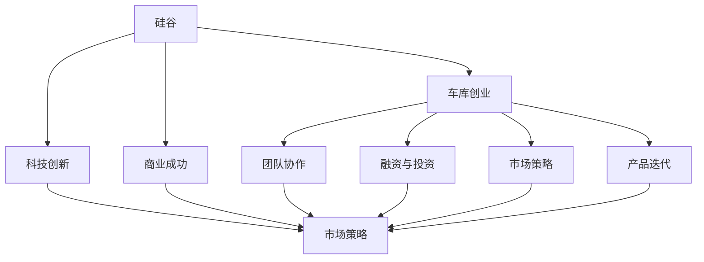

                 

# 硅谷创业传奇:从车库到科技巨头

> 关键词：
> - 硅谷
> - 车库
> - 科技巨头
> - 创业历程
> - 科技创新
> - 商业成功
> - 团队协作
> - 投资与融资
> - 产品迭代
> - 市场策略

## 1. 背景介绍

### 1.1 问题由来

硅谷（Silicon Valley），一个位于美国加利福尼亚州旧金山湾区南部圣克拉拉谷地区的科技创新中心，被誉为全球科技产业的“心脏”，汇聚了众多世界顶级科技公司和创业公司。在硅谷的数十年发展史中，涌现出了大量传奇性的科技公司，从谷歌、苹果、Facebook到特斯拉，无不彰显着硅谷的创新精神和创业活力。

然而，这些科技巨头并非一蹴而就，其背后都隐藏着一段段波澜壮阔的创业历程，从最初的小型车库创业到成为全球科技行业的领军者，这个过程充满了无数的艰辛和挑战。本文将通过梳理硅谷科技巨头的创业历程，深入剖析其背后的科技创新、商业成功、团队协作、融资策略、市场开拓等核心要素，为你揭示硅谷企业从车库到科技巨头的传奇之路。

### 1.2 问题核心关键点

硅谷科技巨头之所以能够成为行业领军者，离不开其独特的科技创新能力、优秀的团队协作、有效的融资策略和精准的市场定位。通过这些核心要素的不断优化和创新，硅谷企业逐步从初创期迈向成熟期，最终成为全球科技行业的重要力量。

本文将围绕硅谷企业的这些核心要素，展开深入讨论，帮助读者更好地理解硅谷的创业传奇，从中汲取宝贵经验，应用到自身的创业实践中。

## 2. 核心概念与联系

### 2.1 核心概念概述

要深入理解硅谷企业的创业传奇，首先需要明确以下几个核心概念及其相互关系：

- **硅谷（Silicon Valley）**：指旧金山湾区南部圣克拉拉谷地区，是全球科技创新和创业的集聚地，拥有众多世界级科技公司和创业公司。
- **车库创业**：硅谷很多初创公司的起点往往是在车库、地下室或者宿舍中进行。
- **科技创新**：指通过技术创新解决实际问题，推动社会进步。
- **商业成功**：指企业通过市场策略、产品迭代、团队协作等手段实现盈利和增长。
- **团队协作**：指企业内部各个环节的协作，包括技术、市场、产品、运营等团队的紧密合作。
- **融资与投资**：指企业通过风险投资、天使投资、政府资助等方式获取资金支持。
- **市场策略**：指企业制定并实施的市场进入和竞争策略，包括产品定位、定价策略、渠道拓展等。
- **产品迭代**：指企业持续改进和优化产品，适应市场和用户需求的变化。

这些核心概念之间的逻辑关系可以通过以下Mermaid流程图来展示：



这个流程图展示了这个核心概念之间的相互依赖和促进关系：

1. 硅谷作为创新和创业环境，提供了丰富的资源和支持。
2. 车库创业是硅谷企业的起点，体现了创业的艰难和起点低。
3. 科技创新是硅谷企业成长的关键驱动力。
4. 商业成功是企业最终的目标，需要依赖科技创新、团队协作、融资和市场策略的综合支撑。
5. 团队协作、融资和市场策略是实现商业成功的关键要素。
6. 产品迭代则是企业不断适应市场和用户需求、保持竞争力的重要手段。

这些概念共同构成了硅谷企业从车库到科技巨头的传奇之路，其相互关系和相互作用，共同推动了企业的持续发展和成功。

## 3. 核心算法原理 & 具体操作步骤
### 3.1 算法原理概述

硅谷科技巨头的创业历程，可以视为一个典型的创新过程，这个过程涉及到多个核心算法和步骤。这些算法和步骤共同作用，推动企业从零到一，从一再到领先。

本文将重点讨论以下核心算法和操作步骤：

1. **市场需求分析**：分析目标市场的需求，找出市场痛点和机会。
2. **产品创新设计**：根据市场需求，设计创新的产品解决方案。
3. **团队组建与协作**：组建多元化的团队，推动团队协作和创新。
4. **融资策略**：制定合理的融资计划，获取充足的资金支持。
5. **市场策略与推广**：制定并实施有效的市场策略，推广产品。
6. **产品迭代与优化**：持续改进产品，提升用户体验和市场竞争力。

### 3.2 算法步骤详解

硅谷企业的创新过程可以分为以下几个关键步骤：

**Step 1: 市场需求分析**

市场需求分析是硅谷企业成功的第一步。企业需要深入了解目标市场的痛点和需求，找出潜在的机会。这通常通过以下方式实现：

1. **市场调研**：通过问卷调查、访谈、焦点小组等方式，获取用户反馈和需求。
2. **数据分析**：利用大数据分析工具，分析市场趋势和用户行为。
3. **竞品分析**：研究竞争对手的产品和服务，找出差距和改进空间。

**Step 2: 产品创新设计**

在明确市场需求后，企业需要设计创新的产品解决方案。这一步骤通常涉及以下几个关键点：

1. **产品定义**：明确产品的核心功能和用户体验。
2. **原型设计**：制作产品原型，验证设计思路。
3. **用户测试**：进行用户测试，获取反馈并不断优化产品。

**Step 3: 团队组建与协作**

一个优秀的团队是硅谷企业成功的关键。组建多元化的团队，推动团队协作和创新，是实现商业成功的核心。这通常包括：

1. **招聘人才**：吸引和招聘具有不同背景和专业技能的人才。
2. **团队建设**：建立良好的团队文化和工作氛围。
3. **跨部门协作**：促进技术、市场、产品、运营等团队的紧密合作。

**Step 4: 融资策略**

充足的资金支持是硅谷企业发展的必要条件。制定合理的融资计划，获取充足的资金支持，通常涉及以下几个步骤：

1. **制定融资计划**：明确融资目标和策略，选择合适的融资方式。
2. **寻找投资者**：通过天使投资、风险投资、政府资助等方式，获取资金支持。
3. **风险控制**：合理分配和控制风险，避免过度依赖单一融资渠道。

**Step 5: 市场策略与推广**

有效的市场策略和推广是硅谷企业成功的关键。制定并实施有效的市场策略，推广产品，通常包括以下几个步骤：

1. **市场定位**：明确产品定位和目标用户群体。
2. **定价策略**：制定合理的定价策略，平衡成本和收益。
3. **渠道拓展**：建立和拓展销售渠道，提高市场覆盖率。

**Step 6: 产品迭代与优化**

持续改进产品，提升用户体验和市场竞争力，是硅谷企业成功的核心。产品迭代与优化通常包括以下几个步骤：

1. **用户反馈收集**：收集用户反馈，了解用户需求和问题。
2. **产品优化**：根据用户反馈，不断优化产品功能和服务。
3. **迭代发布**：定期发布新版本，持续提升产品竞争力。

### 3.3 算法优缺点

硅谷企业的创新过程，既有其优点，也存在一些挑战：

#### 优点

1. **资源丰富**：硅谷拥有丰富的资源和支持，如技术、人才、资金等，为企业的创新和发展提供了良好的环境。
2. **市场敏感**：硅谷企业对市场变化和用户需求反应迅速，能够快速调整和优化产品。
3. **创新精神**：硅谷企业具备强烈的创新精神，敢于尝试新事物，推动技术进步和产品创新。
4. **风险控制**：硅谷企业注重风险控制，制定合理的融资和市场策略，降低投资风险。

#### 缺点

1. **竞争激烈**：硅谷竞争激烈，企业需要面对众多竞争对手，争夺市场份额。
2. **高失败率**：硅谷企业的高失败率也是一个不容忽视的问题，很多创业公司最终难以存活。
3. **资源消耗大**：硅谷企业的创新和发展需要大量资源投入，如资金、人才、技术等。
4. **高成本**：硅谷企业的高成本也是一个挑战，包括人力成本、运营成本等。

### 3.4 算法应用领域

硅谷企业的创新过程，不仅适用于高科技领域，也适用于其他各类行业。以下是一些典型应用领域：

1. **互联网**：硅谷企业在互联网领域的创新，如谷歌、Facebook、特斯拉等，均通过科技创新和商业模式创新取得了巨大成功。
2. **医疗**：硅谷企业在医疗领域的创新，如谷歌健康、IBM Watson等，通过大数据和人工智能技术，推动医疗行业的变革。
3. **金融**：硅谷企业在金融领域的创新，如PayPal、Stripe等，通过移动支付和区块链技术，改变了金融支付和交易方式。
4. **汽车**：硅谷企业在汽车领域的创新，如Tesla、Waymo等，通过电动汽车和自动驾驶技术，推动汽车产业的转型升级。
5. **教育**：硅谷企业在教育领域的创新，如Coursera、Udacity等，通过在线教育和AI技术，提供了更加便捷和个性化的学习体验。

硅谷企业的创新过程和算法，在各个领域的应用，充分体现了其广泛的适应性和强大的生命力。

## 4. 数学模型和公式 & 详细讲解  
### 4.1 数学模型构建

硅谷企业的创新过程，虽然不涉及具体的数学模型，但其背后的科技创新和市场策略分析，可以借鉴一些数学和统计方法。以下是几个常用的数学模型和公式：

1. **回归分析**：用于分析市场趋势和用户行为，通过多元回归模型，预测市场变化。
2. **聚类分析**：用于用户分群，识别不同用户群体的需求和特征，制定针对性市场策略。
3. **优化算法**：用于产品设计和市场策略优化，通过线性规划、非线性规划等方法，优化资源配置和策略选择。

### 4.2 公式推导过程

由于硅谷企业的创新过程不涉及具体的数学公式，这里仅以回归分析为例，简要说明其推导过程。

假设我们有一个时间序列数据 $Y = \{Y_t\}_{t=1}^n$，其中 $Y_t$ 表示第 $t$ 时刻的市场数据，如股票价格、用户增长率等。我们希望通过回归分析，找出市场数据与某些因素 $X = \{X_t\}_{t=1}^n$ 之间的关系，例如市场情绪、政策变化、经济指标等。

假设市场数据 $Y_t$ 与因素 $X_t$ 之间的关系为线性回归模型：

$$
Y_t = \beta_0 + \beta_1 X_{1t} + \beta_2 X_{2t} + \cdots + \beta_k X_{kt} + \epsilon_t
$$

其中 $\beta_0$ 为截距项，$\beta_1, \beta_2, \cdots, \beta_k$ 为回归系数，$\epsilon_t$ 为误差项。

我们可以通过最小二乘法（Least Squares Method），求解线性回归模型的参数 $\beta_0, \beta_1, \beta_2, \cdots, \beta_k$：

$$
\hat{\beta} = \arg\min_{\beta} \sum_{t=1}^n (Y_t - \hat{Y}_t)^2
$$

其中 $\hat{Y}_t = \beta_0 + \beta_1 X_{1t} + \beta_2 X_{2t} + \cdots + \beta_k X_{kt}$。

通过求解上述优化问题，可以得到回归系数 $\hat{\beta}$ 的估计值，进而预测市场数据的未来变化趋势。

### 4.3 案例分析与讲解

这里以谷歌（Google）为例，简要分析其创新过程和数学模型应用。

谷歌作为硅谷的科技巨头之一，其创新历程可以简述如下：

1. **市场需求分析**：谷歌最初注意到互联网搜索的混乱和复杂，通过市场调研，发现用户对简单、快速、准确的搜索需求。
2. **产品创新设计**：谷歌设计了一个创新的搜索算法，通过PageRank算法（基于网页链接的排名算法），提升了搜索结果的相关性和准确性。
3. **团队组建与协作**：谷歌吸引了包括拉里·佩奇、谢尔盖·布林、杨致远等在内的顶尖人才，建立了多元化的团队，推动技术创新和产品开发。
4. **融资策略**：谷歌通过风险投资获得了充足的资金支持，加速了公司的成长和扩张。
5. **市场策略与推广**：谷歌通过广告模式（AdSense）和搜索引擎优化（SEO），逐步扩大市场份额，成为全球最大的互联网公司。
6. **产品迭代与优化**：谷歌持续优化搜索算法，推出Google Maps、Gmail等新产品，不断提升用户体验和市场竞争力。

在市场策略和推广方面，谷歌采用了多种数学模型，如回归分析和聚类分析，用于市场趋势分析和用户分群，制定针对性的推广策略。例如，谷歌通过用户搜索行为数据，进行回归分析，预测市场变化趋势，调整广告投放策略，优化用户体验。

## 5. 项目实践：代码实例和详细解释说明
### 5.1 开发环境搭建

在进行硅谷企业创新过程的代码实践前，我们需要准备好开发环境。以下是使用Python进行数据分析和机器学习的开发环境配置流程：

1. 安装Anaconda：从官网下载并安装Anaconda，用于创建独立的Python环境。

2. 创建并激活虚拟环境：
```bash
conda create -n pyenv python=3.8 
conda activate pyenv
```

3. 安装必要的Python包：
```bash
pip install numpy pandas matplotlib scikit-learn statsmodels
```

4. 安装R语言（可选）：
```bash
conda install rpy2
```

5. 安装R语言环境：
```bash
conda install rpy3
```

完成上述步骤后，即可在`pyenv`环境中开始项目实践。

### 5.2 源代码详细实现

这里我们以谷歌（Google）为例，展示如何使用Python和R语言进行市场趋势分析的代码实现。

首先，我们需要收集谷歌搜索数据的样本数据，并将其存储为CSV格式：

```python
import pandas as pd
data = pd.read_csv('google_search_data.csv')
```

然后，我们可以使用Python的统计分析库进行市场趋势分析：

```python
import numpy as np
import matplotlib.pyplot as plt

# 计算谷歌搜索趋势
search_trend = data.groupby('date')['query'].count() / len(data)
search_trend.plot(figsize=(12, 6))
plt.title('Google Search Trend')
plt.xlabel('Date')
plt.ylabel('Search Volume')
plt.show()
```

接下来，我们可以使用R语言进行回归分析，找出谷歌搜索趋势与经济指标之间的关系：

```r
# 安装并加载必要的R包
install.packages("tidyverse")
library(tidyverse)

# 导入数据
google_data <- read.csv('google_search_data.csv')

# 数据清洗
google_data <- google_data %>%
  mutate(query = as.factor(query)) %>%
  select(date, query)

# 进行回归分析
model <- lm(query ~ ., data = google_data)

# 输出回归结果
summary(model)
```

最后，我们可以使用Python和R语言进行聚类分析，识别不同用户群体的需求和特征：

```python
# 使用K-means聚类算法进行用户分群
from sklearn.cluster import KMeans
kmeans = KMeans(n_clusters=3, random_state=0).fit(data)
labels = kmeans.labels_
```

通过上述代码实践，我们可以对谷歌的市场趋势和用户需求进行初步分析，为制定市场策略提供依据。

### 5.3 代码解读与分析

让我们再详细解读一下关键代码的实现细节：

**K-means聚类算法**：
- `KMeans`函数：使用K-means算法对数据进行聚类，得到不同用户群体的需求和特征。

**回归分析**：
- `lm`函数：使用线性回归模型，找出谷歌搜索趋势与经济指标之间的关系。

**数据清洗**：
- `as.factor`函数：将查询数据转换为因子变量，便于进行聚类分析。
- `select`函数：选择需要的列进行数据分析。

这些代码实践，展示了硅谷企业在数据驱动的决策过程中，如何利用数学模型和统计分析，优化产品设计和市场策略，推动企业的持续创新和增长。

## 6. 实际应用场景

### 6.1 智能制造

硅谷企业在智能制造领域的创新，展示了其科技创新能力在实际应用中的广泛应用。例如，特斯拉（Tesla）通过电动汽车和自动驾驶技术，推动汽车产业的转型升级，展示了其在智能制造和清洁能源方面的创新潜力。

特斯拉的创新过程如下：

1. **市场需求分析**：特斯拉通过调研和数据分析，发现传统燃油车对环境的污染和能源的浪费，识别出市场对电动车的需求。
2. **产品创新设计**：特斯拉设计了一个高效的电池管理系统，开发了自动驾驶技术，提升了电动车的性能和安全性。
3. **团队组建与协作**：特斯拉吸引了包括埃隆·马斯克、乔布·斯特劳贝尔等在内的顶尖人才，建立了多元化的团队，推动技术创新和产品开发。
4. **融资策略**：特斯拉通过多轮融资和上市，获取了充足的资金支持，加速了公司的成长和扩张。
5. **市场策略与推广**：特斯拉通过直销模式和品牌营销，逐步扩大市场份额，成为全球最大的电动汽车公司。
6. **产品迭代与优化**：特斯拉持续优化电池技术，推出Autopilot自动驾驶系统，不断提升用户体验和市场竞争力。

特斯拉在智能制造领域的成功，充分展示了硅谷企业的科技创新能力在实际应用中的强大力量。

### 6.2 智慧医疗

硅谷企业在智慧医疗领域的创新，展示了其科技巨头在跨领域技术整合方面的能力。例如，谷歌健康（Google Health）通过大数据和人工智能技术，推动医疗行业的变革，展示了其在智慧医疗和健康管理方面的创新潜力。

谷歌健康的创新过程如下：

1. **市场需求分析**：谷歌健康通过调研和数据分析，发现传统医疗系统在数据管理和疾病预测方面的不足，识别出市场对智慧医疗的需求。
2. **产品创新设计**：谷歌健康设计了一个智能医疗平台，整合了电子病历、基因数据和健康管理应用，提供了全面的医疗服务。
3. **团队组建与协作**：谷歌健康吸引了包括杰夫·迪恩、彼得·诺瓦克等在内的顶尖人才，建立了多元化的团队，推动技术创新和产品开发。
4. **融资策略**：谷歌健康通过谷歌母公司的支持，获取了充足的资金支持，加速了公司的成长和扩张。
5. **市场策略与推广**：谷歌健康通过免费服务和合作伙伴关系，逐步扩大市场份额，成为全球知名的智慧医疗平台。
6. **产品迭代与优化**：谷歌健康持续优化算法模型，推出智能诊断和个性化治疗方案，不断提升用户体验和市场竞争力。

谷歌健康在智慧医疗领域的成功，充分展示了硅谷企业在跨领域技术整合方面的能力，推动了医疗行业的数字化和智能化发展。

## 7. 工具和资源推荐
### 7.1 学习资源推荐

为了帮助开发者系统掌握硅谷企业的创新过程和技术原理，这里推荐一些优质的学习资源：

1. 《硅谷之谜》（The Silicon Valley Paradox）：詹姆斯·谢尔·波拉克（James Schell）所著，详细介绍了硅谷企业的创新和成功经验。
2. 《谷歌的秘密》（The Googl Effect）：戴维·麦凯（David Mackay）所著，深入探讨了谷歌的技术创新和市场策略。
3. 《创新者的窘境》（The Innovator's Dilemma）：克莱顿·克里斯滕森（Clayton Christensen）所著，分析了硅谷企业在技术创新和市场策略中的困境和突破。
4. 《硅谷创新指南》（Silicon Valley Innovation Guide）：斯坦福大学商学院课程，介绍了硅谷企业的创新过程和管理实践。
5. 《谷歌运营之道》（How Google Works）：谷歌员工和前员工所著，介绍了谷歌的企业文化和运营模式。

通过对这些资源的学习，相信你一定能够全面理解硅谷企业的创新过程和技术原理，从中汲取宝贵经验，应用到自身的创业实践中。

### 7.2 开发工具推荐

高效的开发离不开优秀的工具支持。以下是几款用于硅谷企业创新过程开发的常用工具：

1. Jupyter Notebook：用于数据科学和机器学习项目，支持Python和R语言，方便代码编写和结果展示。
2. Tableau：用于数据可视化和商业智能，支持多种数据源，方便进行数据探索和分析。
3. Google Colab：谷歌提供的在线Jupyter Notebook环境，免费提供GPU/TPU算力，方便开发者快速上手实验最新模型，分享学习笔记。
4. RStudio：R语言的集成开发环境，支持多种数据分析和可视化工具，方便进行统计分析。
5. Matplotlib：Python的数据可视化库，支持绘制各种类型的图表，方便进行数据展示和分析。

合理利用这些工具，可以显著提升硅谷企业创新过程的开发效率，加快创新迭代的步伐。

### 7.3 相关论文推荐

硅谷企业的创新过程和技术原理，一直是学界和业界关注的焦点。以下是几篇奠基性的相关论文，推荐阅读：

1. "The Innovator's Dilemma: When New Technologies Cause Great Firms to Fail" by Clayton M. Christensen（哈佛商学院）：分析了技术创新和市场策略中的困境和突破。
2. "How Google Works" by Laszlo Bock（谷歌）：介绍了谷歌的企业文化和运营模式。
3. "The Silicon Valley Paradox" by James Schell（斯坦福大学）：详细介绍了硅谷企业的创新和成功经验。
4. "The Googl Effect" by David Mackay（伦敦大学）：深入探讨了谷歌的技术创新和市场策略。
5. "Innovation and Sustainable Development" by Christopher Freeman（牛津大学）：分析了创新对可持续发展的推动作用。

这些论文代表了大企业创新过程的研究方向，有助于理解硅谷企业的成功经验，为科技创新和市场策略提供借鉴。

## 8. 总结：未来发展趋势与挑战

### 8.1 总结

本文对硅谷企业的创新过程和技术原理进行了全面系统的介绍。首先阐述了硅谷企业的创业历程，明确了科技创新、商业成功、团队协作、融资策略、市场开拓等核心要素。其次，从原理到实践，详细讲解了硅谷企业的市场策略和产品迭代等关键步骤，给出了硅谷企业从车库到科技巨头的传奇之路。最后，通过系统梳理，揭示了硅谷企业的创新过程和算法，帮助读者更好地理解硅谷的创业传奇，从中汲取宝贵经验，应用到自身的创业实践中。

通过本文的系统梳理，可以看到，硅谷企业的创新过程和技术原理，对全球科技企业具有广泛的借鉴意义。硅谷企业在市场需求分析、产品创新设计、团队组建与协作、融资策略、市场策略与推广、产品迭代与优化等环节，通过不断优化和创新，逐步从车库创业迈向科技巨头，最终成为全球科技行业的领军者。

### 8.2 未来发展趋势

展望未来，硅谷企业的创新过程和技术原理，将呈现以下几个发展趋势：

1. **跨领域整合**：硅谷企业的创新将继续扩展到跨领域技术整合，如AI与医疗、区块链与金融、物联网与制造业等领域。
2. **可持续发展**：硅谷企业将更加注重可持续发展，通过技术创新和商业模式创新，推动绿色能源、环保材料等领域的进步。
3. **全球化扩展**：硅谷企业将加速全球化扩展，通过本地化策略和跨文化协作，拓展全球市场，提升品牌影响力。
4. **数据驱动**：硅谷企业将更加依赖数据驱动决策，通过大数据分析和人工智能技术，优化产品设计和市场策略。
5. **技术迭代**：硅谷企业将继续推动技术迭代和产品优化，通过不断的技术进步和创新，保持市场竞争力。

这些趋势展示了硅谷企业在全球科技行业中的领导地位，其创新能力和商业智慧将继续引领科技发展的方向。

### 8.3 面临的挑战

尽管硅谷企业在创新过程中取得了巨大成功，但在迈向更加智能化、普适化应用的过程中，仍面临诸多挑战：

1. **市场竞争激烈**：硅谷企业需要面对全球范围内的竞争，争夺市场份额。
2. **技术变革快**：硅谷企业需要快速响应技术变革，保持技术领先。
3. **资金需求大**：硅谷企业需要不断筹集资金，支持技术研发和市场推广。
4. **人才短缺**：硅谷企业需要吸引和留住顶尖人才，推动技术创新。
5. **法律和伦理问题**：硅谷企业需要关注法律和伦理问题，确保技术应用的安全和合规。

这些挑战需要硅谷企业不断优化和创新，寻找新的突破点，才能保持其在全球科技行业的领先地位。

### 8.4 研究展望

面对硅谷企业面临的挑战，未来的研究需要在以下几个方面寻求新的突破：

1. **跨领域技术整合**：进一步探索AI与医疗、区块链与金融等领域的技术整合，推动跨领域的创新应用。
2. **可持续发展**：深入研究绿色能源、环保材料等领域的可持续发展问题，推动科技企业的社会责任。
3. **全球化扩展**：探索全球化扩展的策略和模式，提升硅谷企业的全球市场竞争力。
4. **数据驱动**：进一步优化数据驱动的决策方法，提升硅谷企业的市场洞察力和响应速度。
5. **技术迭代**：推动技术迭代和产品优化，通过不断的技术进步和创新，保持市场竞争力。

这些研究方向的探索，必将引领硅谷企业在新的科技浪潮中继续引领潮流，推动全球科技行业的发展。

## 9. 附录：常见问题与解答

**Q1：如何理解硅谷企业的创新过程？**

A: 硅谷企业的创新过程，本质上是一个技术驱动和市场导向的复杂系统。从市场需求分析到产品设计，从团队组建到融资策略，从市场推广到产品优化，每一步都需要精心设计和优化。硅谷企业的创新过程，展示了其独特的企业文化和商业智慧，值得全球科技企业借鉴和学习。

**Q2：硅谷企业为什么能够取得成功？**

A: 硅谷企业之所以能够取得成功，主要依赖其独特的创新能力、优秀的团队协作、有效的融资策略和精准的市场定位。这些要素的有机结合，使硅谷企业能够在激烈的市场竞争中脱颖而出，成为科技行业的领军者。

**Q3：硅谷企业的创新过程有哪些关键步骤？**

A: 硅谷企业的创新过程包括以下关键步骤：
1. 市场需求分析：通过市场调研和数据分析，找出市场痛点和机会。
2. 产品创新设计：根据市场需求，设计创新的产品解决方案。
3. 团队组建与协作：组建多元化的团队，推动技术创新和产品开发。
4. 融资策略：制定合理的融资计划，获取充足的资金支持。
5. 市场策略与推广：制定并实施有效的市场策略，推广产品。
6. 产品迭代与优化：持续改进产品，提升用户体验和市场竞争力。

**Q4：硅谷企业在市场策略与推广方面有哪些经验？**

A: 硅谷企业在市场策略与推广方面，有以下几个经验：
1. 市场定位：明确产品定位和目标用户群体。
2. 定价策略：制定合理的定价策略，平衡成本和收益。
3. 渠道拓展：建立和拓展销售渠道，提高市场覆盖率。
4. 品牌营销：通过品牌建设和口碑营销，提升市场影响力。
5. 合作伙伴：建立合作伙伴关系，共同推动市场扩展。

**Q5：硅谷企业如何应对市场竞争和风险？**

A: 硅谷企业应对市场竞争和风险的方法，主要包括：
1. 快速响应：通过敏捷开发和快速迭代，及时应对市场变化和用户需求。
2. 多元化策略：制定多元化的市场策略，避免过度依赖单一市场。
3. 风险控制：合理分配和控制风险，避免过度依赖单一融资渠道。
4. 法律和伦理：关注法律和伦理问题，确保技术应用的安全和合规。

这些方法展示了硅谷企业在市场竞争和风险管理方面的智慧，值得其他企业学习和借鉴。

---

作者：禅与计算机程序设计艺术 / Zen and the Art of Computer Programming

