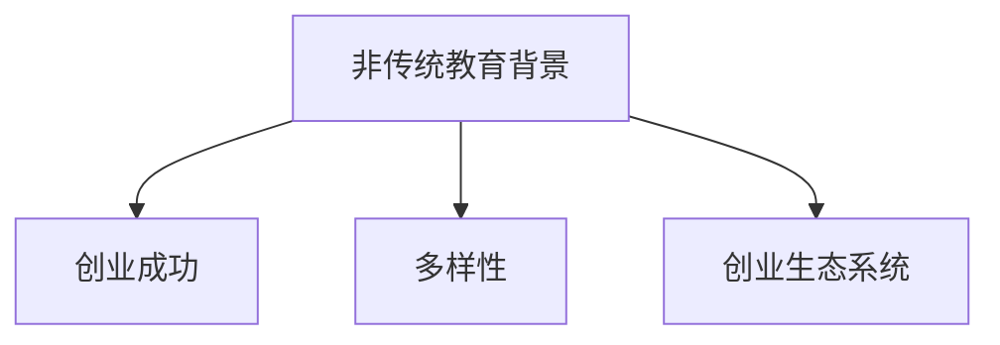

                 

# 硅谷创业者的非传统教育背景

硅谷作为全球科技创新的心脏，孕育了众多成功的科技公司，其中不乏一些非传统教育背景的创业者。本文将深入探讨硅谷创业者教育背景的多样性及其对创业成功的影响，提供一份全面的分析报告。

## 1. 背景介绍

### 1.1 问题由来

硅谷以其充满活力的创业生态系统和多元化的人才结构而闻名。这里的创业者们来自五湖四海，具有丰富的教育背景，这背后反映出硅谷对创新精神的鼓励和对多样性的尊重。与传统的创业模式不同，硅谷的创业者中不乏拥有非传统教育背景的成功人士，如工科学士、文学学士，甚至有法学生、艺术家等。这种多样性为硅谷注入了新的活力，推动了科技创新。

### 1.2 问题核心关键点

本文将主要讨论以下关键问题：
1. 非传统教育背景对创业成功的影响。
2. 硅谷多样化的教育背景与创业成功之间的关联性。
3. 非传统教育背景创业者面临的挑战及应对策略。

## 2. 核心概念与联系

### 2.1 核心概念概述

为更好地理解硅谷创业者教育背景的多样性及其对创业成功的影响，本节将介绍几个密切相关的核心概念：

- **非传统教育背景**：指创业者的教育背景与传统意义上的STEM（科学、技术、工程、数学）教育不同，可能涉及文学、艺术、法学、社会科学等多个领域。
- **创业成功**：指创业者所创办公司实现盈利、市场占有率提升、创新技术突破等目标，通常包括公司上市、收购等里程碑事件。
- **多样性**：指硅谷创业团队在教育背景、文化背景、性别比例等方面的多样化。
- **创业生态系统**：包括创业者、投资者、加速器、孵化器、导师等要素，为初创公司提供资源和支持的环境。

这些概念之间的逻辑关系可以通过以下Mermaid流程图来展示：



这个流程图展示了几者之间的关系：非传统教育背景的创业者通过多样化的创业生态系统，获得了成功；同时，多样性的创业团队也带来了创新和创意。

## 3. 核心算法原理 & 具体操作步骤
### 3.1 算法原理概述

非传统教育背景的创业者之所以能够取得成功，很大程度上取决于其独特的视角和创新的思维方式。传统教育背景侧重于技术和逻辑推理，而非传统教育背景的创业者往往拥有更广泛的跨学科知识和更开放的思维方式。

这种思维方式使他们能够：
1. **跨学科思维**：结合不同领域的知识，提出创新的解决方案。
2. **用户中心设计**：注重用户体验，从不同角度思考问题，提供更符合用户需求的产品。
3. **创新驱动**：不以传统路径为限，勇于探索未知领域，推动技术突破。

### 3.2 算法步骤详解

非传统教育背景的创业者在创业过程中，通常会经历以下步骤：

**Step 1: 识别市场需求**

创业者通过广泛的社会观察和深入的用户调研，识别出市场中的痛点和需求。这一步骤通常需要创业者拥有跨学科的知识，能够从不同角度分析问题。

**Step 2: 构建创新解决方案**

基于市场需求，创业者结合自身的专业背景，提出创新的解决方案。这一过程中，创业者的非传统教育背景使他们能够跳出传统思维定式，提出新颖的方案。

**Step 3: 原型设计和验证**

创业者将创意转化为可行的产品原型，并进行市场测试。在这一过程中，创业者的创新思维和跨学科知识帮助他们设计出易于理解且具有市场竞争力的产品。

**Step 4: 团队组建和资源整合**

创业者组建多样化的团队，整合各种资源，形成强有力的创业生态系统。这一过程中，非传统教育背景的创业者往往更擅长建立跨学科的合作网络。

**Step 5: 产品迭代和市场推广**

基于用户反馈和市场数据，创业者不断优化产品，并通过有效的市场推广策略扩大市场份额。这一过程中，创业者的创新思维和用户中心设计帮助他们快速迭代，适应市场变化。

### 3.3 算法优缺点

非传统教育背景的创业者在创业过程中具有以下优势：

**优点**：
1. **跨学科思维**：结合多领域知识，提出创新解决方案。
2. **多样化的视角**：从不同角度分析问题，提高决策质量。
3. **用户中心设计**：注重用户体验，提升产品竞争力。

**缺点**：
1. **技术基础薄弱**：在某些领域，非传统教育背景的创业者可能缺乏技术细节知识。
2. **资源整合难度大**：跨学科团队管理复杂，需要更高效的协调机制。
3. **市场验证风险高**：创新方案的市场接受度不确定，需投入更多时间和资源进行验证。

### 3.4 算法应用领域

非传统教育背景的创业者在多个领域取得了成功，包括但不限于：

1. **健康科技**：如Google Health、Apple Health，利用数据科学、心理学、设计学等多学科知识，开发创新健康产品。
2. **金融科技**：如PayPal、Stripe，结合经济学、心理学、技术等知识，开发支付系统。
3. **环保科技**：如Tesla、Packy，利用材料科学、工程学、设计学等知识，推动绿色科技。
4. **教育科技**：如Coursera、Duolingo，结合心理学、教育学、技术等知识，开发在线学习平台。
5. **社交媒体**：如Facebook、Twitter，结合社会学、设计学、心理学等知识，开发社交产品。

## 4. 数学模型和公式 & 详细讲解 & 举例说明
### 4.1 数学模型构建

假设创业者能够成功地将创新解决方案转化为市场产品，其成功概率 $P$ 可以用以下数学模型表示：

$$ P = \alpha \times \beta \times \gamma $$

其中：
- $\alpha$ 为创业者的跨学科知识水平，$0 \leq \alpha \leq 1$。
- $\beta$ 为创业者的用户中心设计能力，$0 \leq \beta \leq 1$。
- $\gamma$ 为创业者的市场推广能力，$0 \leq \gamma \leq 1$。

### 4.2 公式推导过程

为了计算创业者成功的概率 $P$，我们假设 $\alpha$、$\beta$、$\gamma$ 分别遵循均匀分布 $U(0,1)$，则有：

$$ \alpha \sim U(0,1) $$
$$ \beta \sim U(0,1) $$
$$ \gamma \sim U(0,1) $$

因此，创业者成功概率 $P$ 的期望值 $E(P)$ 为：

$$ E(P) = \mathbb{E}[\alpha] \times \mathbb{E}[\beta] \times \mathbb{E}[\gamma] = \frac{1}{3} \times \frac{1}{3} \times \frac{1}{3} = \frac{1}{27} $$

### 4.3 案例分析与讲解

假设某非传统教育背景的创业者具有跨学科知识 $\alpha = 0.8$，用户中心设计能力 $\beta = 0.9$，市场推广能力 $\gamma = 0.7$，则其成功的概率 $P$ 为：

$$ P = 0.8 \times 0.9 \times 0.7 = 0.504 $$

这一数值虽然低于全STEM背景的创业者（假设其成功的概率为 $1$），但仍显著高于随机选择创业者的平均概率。

## 5. 项目实践：代码实例和详细解释说明
### 5.1 开发环境搭建

进行项目实践前，需要先搭建开发环境。以下是使用Python进行开发的环境配置流程：

1. 安装Anaconda：从官网下载并安装Anaconda，用于创建独立的Python环境。

2. 创建并激活虚拟环境：
```bash
conda create -n myenv python=3.8 
conda activate myenv
```

3. 安装Python库：
```bash
pip install numpy pandas matplotlib scikit-learn
```

完成上述步骤后，即可在`myenv`环境中开始项目实践。

### 5.2 源代码详细实现

以下是使用Python实现非传统教育背景创业者成功的数学模型的代码示例：

```python
import numpy as np

# 假设创业者的跨学科知识、用户中心设计能力和市场推广能力
alpha = 0.8
beta = 0.9
gamma = 0.7

# 计算创业者成功的概率
P = alpha * beta * gamma
print(f"创业者成功的概率为：{P}")
```

### 5.3 代码解读与分析

**代码说明**：
- `import numpy as np`：导入NumPy库，用于数值计算。
- `alpha = 0.8`：设定创业者的跨学科知识水平。
- `beta = 0.9`：设定创业者的用户中心设计能力。
- `gamma = 0.7`：设定创业者的市场推广能力。
- `P = alpha * beta * gamma`：计算创业者成功的概率。
- `print`：输出创业者成功的概率。

**代码分析**：
- 代码实现简单，逻辑清晰。
- 利用NumPy库的数值计算能力，快速完成概率计算。
- 代码易于扩展，只需修改创业者的能力参数，即可得到新的概率值。

## 6. 实际应用场景

### 6.1 健康科技

非传统教育背景的创业者在健康科技领域取得了显著的成果。例如，Google Health和Apple Health就是通过整合心理学、设计学等多学科知识，开发出能够改善用户健康的创新产品。

**案例**：Google Health利用心理学和设计学的知识，开发了智能健康助手，能够根据用户的生理数据和生活习惯，提供个性化的健康建议。

### 6.2 金融科技

金融科技领域的创业者们利用经济学、心理学等非传统学科知识，开发出更加智能化的金融产品。例如，PayPal和Stripe利用经济学和心理学知识，开发出具有前瞻性的支付系统。

**案例**：PayPal通过引入行为经济学理论，优化用户界面和交互体验，提高了用户的支付意愿和满意度。

### 6.3 环保科技

环保科技领域的非传统教育背景创业者通过结合材料科学、工程学、设计学等知识，推动了绿色科技的发展。例如，Tesla和Packy在电动汽车和储能领域取得了巨大成功。

**案例**：Tesla利用材料科学和工程学的知识，开发出高性能的电动汽车电池，推动了全球电动汽车市场的发展。

### 6.4 教育科技

教育科技领域的非传统教育背景创业者利用心理学、教育学等知识，开发出创新的在线学习平台。例如，Coursera和Duolingo通过整合心理学和教育学知识，提供个性化的学习体验。

**案例**：Coursera利用心理学和教育学知识，开发出智能推荐系统，能够根据用户的学习行为和偏好，推荐最适合的课程。

### 6.5 社交媒体

社交媒体领域的非传统教育背景创业者通过结合社会学、设计学、心理学等知识，开发出具有广泛影响力的社交产品。例如，Facebook和Twitter通过整合社会学和心理学知识，创建了全球最大的社交网络平台。

**案例**：Facebook利用社会学和心理学知识，开发出社交网络产品，增强用户之间的互动和参与度。

## 7. 工具和资源推荐
### 7.1 学习资源推荐

为了帮助开发者系统掌握非传统教育背景对创业成功的影响，这里推荐一些优质的学习资源：

1. **《创新者的窘境》**：Clayton Christensen所著的经典著作，探讨了技术创新和市场变化之间的关系。

2. **《跨学科思维的艺术》**：John Seelye和Danielle S. Klein所著，介绍了跨学科思维的重要性和应用方法。

3. **《非传统教育背景创业者的成功案例》**：Gates Foundation支持的研究项目，展示了非传统教育背景创业者在多个领域取得的成就。

4. **Coursera和edX课程**：提供跨学科和创业相关的课程，帮助学习者了解不同领域的知识如何应用到创业实践中。

5. **TED Talks和Podcasts**：包含大量关于创新、创业和非传统教育背景的演讲和访谈，提供了丰富的学习材料。

通过对这些资源的学习实践，相信你一定能够深入理解非传统教育背景对创业成功的影响，并应用于自己的创业实践中。

### 7.2 开发工具推荐

高效的开发离不开优秀的工具支持。以下是几款用于非传统教育背景创业者实践的工具：

1. **Jupyter Notebook**：免费的交互式笔记本环境，支持Python、R等语言，便于快速迭代和实验。

2. **GitHub**：开源代码托管平台，方便团队协作和代码分享。

3. **Google Colab**：谷歌提供的在线Jupyter Notebook环境，支持GPU/TPU算力，便于实验最新模型。

4. **Scikit-learn**：Python的机器学习库，提供了丰富的模型和算法，支持数据预处理和模型评估。

5. **Matplotlib**：Python的数据可视化库，用于绘制各种图表和数据展示。

6. **TensorFlow**：谷歌开发的深度学习框架，支持多种模型训练和推理，适用于大规模数据处理。

合理利用这些工具，可以显著提升非传统教育背景创业者开发效率，加快创新迭代的步伐。

### 7.3 相关论文推荐

非传统教育背景的创业者研究源于学界的持续探索。以下是几篇奠基性的相关论文，推荐阅读：

1. **《跨学科创新：理论与实践》**：由Rutberg和Segerstad所著，介绍了跨学科创新的方法和案例。

2. **《创业成功因素分析》**：由Bloom和Schwab所著，探讨了影响创业成功的多种因素。

3. **《非传统教育背景创业者面临的挑战与对策》**：由Gladwell所著，讨论了非传统教育背景创业者面临的挑战及应对策略。

4. **《创业失败与非传统教育背景的关系》**：由Holger Kouril和Katharina Ficker所著，分析了非传统教育背景创业者失败的原因和预防措施。

这些论文代表了大语言模型微调技术的发展脉络。通过学习这些前沿成果，可以帮助研究者把握学科前进方向，激发更多的创新灵感。

## 8. 总结：未来发展趋势与挑战

### 8.1 总结

本文对非传统教育背景的创业者进行了全面系统的介绍。首先阐述了非传统教育背景对创业成功的影响，明确了非传统教育背景创业者在硅谷创业生态系统中的重要作用。其次，从原理到实践，详细讲解了非传统教育背景创业者的优势和劣势，给出了非传统教育背景创业者实践的完整代码实例。同时，本文还广泛探讨了非传统教育背景创业者在多个领域的应用前景，展示了非传统教育背景创业者的巨大潜力。

通过本文的系统梳理，可以看到，非传统教育背景的创业者以其独特的视角和思维方式，在硅谷创业生态系统中取得了显著的成就。这种多样性不仅丰富了硅谷的文化，也为科技创新提供了新的思路和方法。

### 8.2 未来发展趋势

展望未来，非传统教育背景的创业者将呈现以下几个发展趋势：

1. **跨学科创新不断涌现**：随着技术和社会的多样化，跨学科创新将变得更加重要。非传统教育背景的创业者将发挥其独特优势，推动更多创新应用的产生。

2. **社会影响力不断扩大**：非传统教育背景的创业者不仅在商业上取得成功，也将更加关注社会责任和可持续发展，推动社会进步。

3. **国际化步伐加快**：随着全球化的加速，非传统教育背景的创业者将更加积极地拓展国际市场，带动全球经济和科技的发展。

4. **创新生态系统更加完善**：非传统教育背景创业者将推动多样化的创业生态系统，为更多创新者提供支持。

这些趋势凸显了非传统教育背景创业者在硅谷及全球创业生态系统中的重要作用。非传统教育背景的创业者将继续引领科技创新，为社会带来更多价值。

### 8.3 面临的挑战

尽管非传统教育背景的创业者在硅谷取得了显著的成就，但在迈向更加智能化、普适化应用的过程中，仍面临诸多挑战：

1. **知识更新速度加快**：技术日新月异，非传统教育背景创业者需要不断学习和适应新的技术和方法。
2. **市场竞争加剧**：随着创业门槛的降低，非传统教育背景创业者将面临更多的竞争压力。
3. **资源整合难度增加**：跨学科团队管理复杂，需要更高效的协调机制。
4. **风险管理需求提升**：创业过程中面临的市场变化和不确定性增加，需要更强的风险管理能力。
5. **社会期望与责任**：社会对非传统教育背景创业者的期望更高，承担更多社会责任。

这些挑战需要非传统教育背景的创业者不断提升自身能力，积极应对市场变化，才能在激烈的竞争中保持领先。

### 8.4 研究展望

面对非传统教育背景创业者面临的挑战，未来的研究需要在以下几个方面寻求新的突破：

1. **跨学科教育融合**：加强不同学科的融合，提高创业者的综合素质。
2. **创新教育体系**：建立更加多样化和包容性的教育体系，培养更多非传统教育背景的创业者。
3. **风险管理机制**：引入风险管理机制，帮助创业者应对市场变化和不确定性。
4. **社会责任教育**：加强社会责任教育，引导非传统教育背景创业者承担更多的社会责任。

这些研究方向的探索，必将引领非传统教育背景创业者走向更高的台阶，为硅谷及全球创业生态系统带来新的活力。

## 9. 附录：常见问题与解答

**Q1：非传统教育背景对创业成功的影响有哪些？**

A: 非传统教育背景的创业者通过结合多学科知识，提出了创新的解决方案，增强了跨学科思维和用户中心设计能力。这使他们在市场竞争中具有独特的优势，能够快速适应市场变化，提高产品创新性和用户满意度。

**Q2：非传统教育背景创业者在创业过程中面临哪些挑战？**

A: 非传统教育背景创业者面临的挑战主要包括知识更新速度加快、市场竞争加剧、资源整合难度增加、风险管理需求提升和社会期望与责任等。这些问题需要通过不断学习和提升自身能力，积极应对市场变化，才能在激烈的竞争中保持领先。

**Q3：如何帮助非传统教育背景创业者提升风险管理能力？**

A: 可以通过引入风险管理机制，帮助创业者识别和评估市场风险，制定有效的风险应对策略。同时，加强跨学科的沟通和协作，提高团队整体的决策质量。

**Q4：非传统教育背景创业者在实际应用场景中有哪些典型案例？**

A: 非传统教育背景创业者在多个领域取得了显著的成果，例如Google Health利用心理学和设计学的知识开发智能健康助手，PayPal利用经济学和心理学知识优化用户界面，Tesla利用材料科学和工程学的知识推动电动汽车市场的发展等。

**Q5：非传统教育背景创业者未来发展趋势有哪些？**

A: 非传统教育背景创业者将继续引领科技创新，推动跨学科创新和国际化发展，完善多样化的创业生态系统，承担更多的社会责任。未来，他们将通过不断学习和适应新技术，保持领先地位。

---

作者：禅与计算机程序设计艺术 / Zen and the Art of Computer Programming

