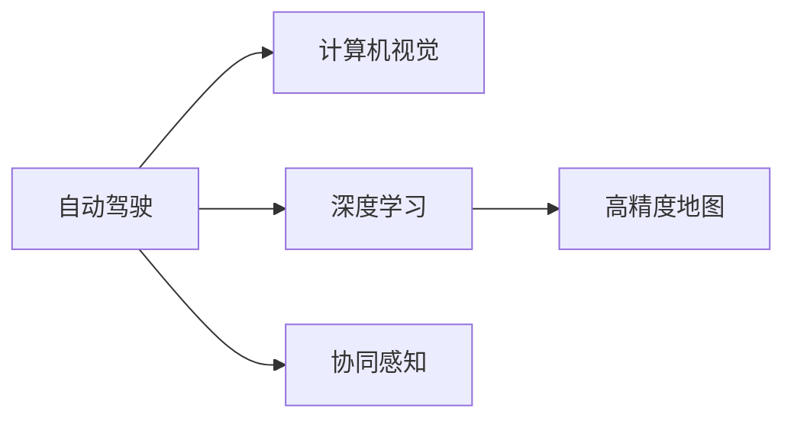

                 

# 硅谷新能源汽车自动驾驶:智能出行新时代

## 1. 背景介绍

在21世纪的硅谷，自动驾驶技术正引领着一场颠覆性的交通革命。从特斯拉的Autopilot到Waymo的Waymo One，再到谷歌的Deep Drive，各大科技巨头纷纷投入巨资，争相探索自动驾驶的未来。在这场激烈的竞争中，新能源汽车无疑成为了自动驾驶技术的最佳载体。本文将深入探讨硅谷在新能源汽车自动驾驶领域的最新进展，分析其核心技术原理与实现步骤，展望未来发展趋势，并提出面临的挑战与应对策略。

## 2. 核心概念与联系

### 2.1 核心概念概述

为更好地理解硅谷新能源汽车自动驾驶技术，本节将介绍几个密切相关的核心概念：

- **自动驾驶**：指车辆无需人类驾驶，通过传感器、摄像头、雷达等设备感知环境，结合深度学习算法进行决策和控制，实现自主行驶的技术。
- **新能源汽车**：指使用电能、氢能等可再生能源作为动力的汽车，具有低排放、低噪音、高效能等优点。
- **深度学习**：一种基于神经网络的机器学习方法，通过大量数据训练模型，使其具备模式识别、决策优化等能力。
- **计算机视觉**：通过摄像头等设备捕捉和处理图像信息，识别交通标志、车辆、行人等元素，辅助自动驾驶决策。
- **高精度地图**：为自动驾驶车辆提供精确的地理位置和道路信息，帮助其在复杂环境中进行导航和避障。
- **协同感知**：通过多车辆间的通信与合作，共享感知信息，提高整体交通系统的安全性和效率。

这些核心概念之间的逻辑关系可以通过以下Mermaid流程图来展示：



这个流程图展示了你述语中的核心概念及其之间的关系：

1. 自动驾驶作为核心技术，需要计算机视觉进行图像识别，深度学习进行决策优化，高精度地图提供导航信息，协同感知提升整体系统的安全性与效率。

## 3. 核心算法原理 & 具体操作步骤
### 3.1 算法原理概述

硅谷新能源汽车自动驾驶技术的核心算法包括感知、决策和控制三个环节。

感知环节通过各种传感器采集道路和车辆信息，利用计算机视觉技术识别交通标志、车辆、行人等元素，并结合高精度地图进行定位和路径规划。决策环节则通过深度学习模型对感知数据进行综合分析，判断车辆行为和交通状况，制定最优行驶策略。控制环节根据决策结果，通过车辆控制器调整油门、刹车、转向等操作，实现自主行驶。

### 3.2 算法步骤详解

硅谷新能源汽车自动驾驶算法具体步骤包括：

**Step 1: 数据采集与处理**
- 使用雷达、摄像头、GPS等传感器，实时采集车辆周边环境数据。
- 利用计算机视觉技术对图像数据进行处理，检测并标注出道路边缘、车辆、行人、交通标志等信息。
- 使用高精度地图匹配车辆位置，并获取实时路况信息。

**Step 2: 感知与决策**
- 将处理后的感知数据输入深度学习模型，如卷积神经网络(CNN)、循环神经网络(RNN)等，进行特征提取和模式识别。
- 通过决策树、支持向量机(SVM)等算法对感知数据进行综合分析，制定最优行驶策略。

**Step 3: 控制与执行**
- 根据决策结果，使用车辆控制器调整油门、刹车、转向等操作，实现车辆自主行驶。
- 实时监控车辆状态和环境变化，调整控制策略，保证行驶安全与稳定性。

### 3.3 算法优缺点

硅谷新能源汽车自动驾驶技术具有以下优点：

1. 提高交通效率。自动驾驶技术可以大幅减少交通拥堵，提高道路通行能力。
2. 降低事故率。通过智能决策和精准控制，自动驾驶车辆能有效避免人类驾驶时的错误操作。
3. 减少环境污染。新能源汽车本身具有低排放特性，自动驾驶技术可以进一步优化行驶路线，降低能源消耗和污染排放。
4. 提升驾驶体验。自动驾驶技术解放了驾驶员，使其能够更专注于享受旅程，而不用担心驾驶压力。

然而，该技术也存在以下缺点：

1. 技术复杂度高。自动驾驶涉及感知、决策、控制等多个环节，技术难度大。
2. 数据与地图依赖性强。高精度地图和传感器数据是自动驾驶的基础，数据质量直接影响系统性能。
3. 安全与伦理问题。自动驾驶车辆在遇到极端情况时，如何做出合理决策，保障行人、车辆等安全，仍然存在伦理争议。
4. 法规与监管缺失。自动驾驶技术的应用需要健全的法规和监管体系，以确保技术安全和社会稳定。

### 3.4 算法应用领域

硅谷新能源汽车自动驾驶技术主要应用于以下领域：

- **城市交通**：通过智能交通信号灯和动态路线规划，提升城市交通管理效率。
- **物流运输**：在运输环节使用自动驾驶车辆，降低人工成本，提高物流效率。
- **公共交通**：在公交车、出租车等公共交通工具上应用自动驾驶，提高服务质量与安全性。
- **货运配送**：在最后一公里配送中使用无人驾驶车辆，解决城市“最后一公里”物流问题。
- **长途运输**：在高等级公路上使用自动驾驶车辆，提高长途运输的安全性和效率。

## 4. 数学模型和公式 & 详细讲解 & 举例说明
### 4.1 数学模型构建

自动驾驶技术中涉及的数学模型主要包括感知模型、决策模型和控制模型。

感知模型用于提取和识别道路及环境信息，常见的数学模型包括：

- **计算机视觉模型**：使用卷积神经网络(CNN)进行图像处理和特征提取。
- **高精度地图模型**：使用向量地图(Vector Maps)表示地理位置和道路信息，便于车辆进行路径规划。

决策模型用于分析感知数据，制定最优行驶策略，常见的数学模型包括：

- **深度学习模型**：使用循环神经网络(RNN)、长短时记忆网络(LSTM)等处理序列数据，进行决策分析。
- **优化算法**：使用遗传算法、蚁群算法等优化模型参数，寻找最优决策方案。

控制模型用于实现车辆自主行驶，常见的数学模型包括：

- **线性控制模型**：使用线性控制理论进行车辆姿态控制和路径跟踪。
- **非线性控制模型**：使用非线性控制理论，如PID控制器、模糊控制等，实现复杂的车辆控制。

### 4.2 公式推导过程

以下以计算机视觉中的卷积神经网络(CNN)为例，展示其数学模型推导过程。

卷积神经网络的结构如图1所示：


图1：卷积神经网络结构图

卷积神经网络通过多个卷积层、池化层和全连接层实现图像特征的提取和分类。其核心公式包括卷积操作、池化操作和全连接操作：

- **卷积操作**：通过卷积核在输入图像上滑动，提取局部特征，公式如下：

$$
H_i^{(l)} = f\bigg(\sum_{j=0}^{k-1}\sum_{m=0}^{h-1}\sum_{n=0}^{w-1}W_{j,i,m,n} \cdot I_{m,n}^{(l-1)} + b_i^{(l)}\bigg)
$$

其中，$H_i^{(l)}$表示第$l$层的第$i$个卷积核输出，$W_{j,i,m,n}$表示第$i$个卷积核在位置$(m,n)$处的权重，$I_{m,n}^{(l-1)}$表示第$l-1$层在第$(m,n)$处的输入，$f$表示激活函数，如ReLU。

- **池化操作**：通过下采样操作，减小特征图的大小，公式如下：

$$
H_i^{(l)} = \max\limits_{m,n} I_{m,n}^{(l)}
$$

其中，$H_i^{(l)}$表示第$l$层的第$i$个池化核输出，$I_{m,n}^{(l)}$表示第$l$层在第$(m,n)$处的特征图。

- **全连接操作**：将特征图展开成一维向量，通过全连接层进行分类，公式如下：

$$
z = W \cdot X + b
$$

其中，$z$表示全连接层的输出，$W$表示权重矩阵，$X$表示特征向量，$b$表示偏置项。

### 4.3 案例分析与讲解

以特斯拉的Autopilot系统为例，分析其自动驾驶技术的应用。

特斯拉的Autopilot系统通过多个传感器和摄像头采集周边环境数据，使用卷积神经网络(CNN)进行图像处理和特征提取，结合高精度地图进行定位和路径规划，并通过深度学习模型进行决策分析，最终实现车辆自主行驶。

具体而言，Autopilot系统使用两个摄像头和一个雷达采集道路和车辆信息，使用计算机视觉技术进行图像处理，提取道路边缘、车辆、行人等元素。高精度地图用于匹配车辆位置，并获取实时路况信息。感知数据输入深度学习模型，通过卷积神经网络(CNN)进行特征提取，使用循环神经网络(RNN)进行序列数据处理，最终输出最优行驶策略。车辆控制器根据决策结果，调整油门、刹车、转向等操作，实现自主行驶。

特斯拉Autopilot系统的核心代码如下：

```python
# 加载预训练的卷积神经网络模型
cnn_model = load_cnn_model()

# 加载高精度地图数据
map_data = load_map_data()

# 使用摄像头和雷达采集感知数据
perception_data = perceive_sensors()

# 对感知数据进行处理，提取特征
features = preprocess_perception_data(perception_data)

# 将特征输入深度学习模型，进行决策分析
decision = predict(features, cnn_model)

# 根据决策结果，调整车辆控制策略
control = control_vehicle(decision, map_data)

# 实现车辆自主行驶
drive(control)
```

通过上述代码，可以看到特斯拉Autopilot系统的主要算法步骤。

## 5. 项目实践：代码实例和详细解释说明
### 5.1 开发环境搭建

在进行自动驾驶技术开发前，我们需要准备好开发环境。以下是使用Python进行开发的环境配置流程：

1. 安装Anaconda：从官网下载并安装Anaconda，用于创建独立的Python环境。

2. 创建并激活虚拟环境：
```bash
conda create -n autodrive python=3.8 
conda activate autodrive
```

3. 安装PyTorch：基于Python的开源深度学习框架，用于构建卷积神经网络和深度学习模型。
```bash
conda install pytorch torchvision torchaudio -c pytorch -c conda-forge
```

4. 安装TensorFlow：由Google主导开发的深度学习框架，用于优化算力和工程部署。
```bash
conda install tensorflow -c tensorflow
```

5. 安装OpenCV：用于计算机视觉图像处理和特征提取。
```bash
pip install opencv-python
```

6. 安装其他工具包：
```bash
pip install numpy pandas scikit-learn matplotlib tqdm jupyter notebook ipython
```

完成上述步骤后，即可在`autodrive`环境中开始自动驾驶技术的开发。

### 5.2 源代码详细实现

下面我们以特斯拉Autopilot系统为例，给出使用PyTorch进行计算机视觉处理和深度学习模型的PyTorch代码实现。

首先，定义计算机视觉感知模块：

```python
import torch
import torch.nn as nn
import torchvision.transforms as transforms
from torchvision.models import resnet50

class PerceptionModule(nn.Module):
    def __init__(self):
        super(PerceptionModule, self).__init__()
        self.cnn_model = resnet50(pretrained=True)
        self.fc = nn.Linear(2048, 128)
        self.dropout = nn.Dropout(0.5)

    def forward(self, x):
        features = self.cnn_model(x)
        features = self.fc(features)
        features = self.dropout(features)
        return features
```

然后，定义高精度地图数据加载模块：

```python
class MapModule(nn.Module):
    def __init__(self):
        super(MapModule, self).__init__()
        self.map_data = load_map_data()

    def forward(self, x):
        return self.map_data
```

接下来，定义深度学习决策模块：

```python
import torch.nn as nn
import torch.nn.functional as F

class DecisionModule(nn.Module):
    def __init__(self):
        super(DecisionModule, self).__init__()
        self.fc1 = nn.Linear(128, 64)
        self.fc2 = nn.Linear(64, 32)
        self.fc3 = nn.Linear(32, 1)

    def forward(self, x):
        x = F.relu(self.fc1(x))
        x = F.relu(self.fc2(x))
        x = self.fc3(x)
        return x
```

最后，定义车辆控制模块：

```python
class ControlModule(nn.Module):
    def __init__(self):
        super(ControlModule, self).__init__()
        self.fc1 = nn.Linear(32, 16)
        self.fc2 = nn.Linear(16, 8)
        self.fc3 = nn.Linear(8, 4)
        self.fc4 = nn.Linear(4, 2)

    def forward(self, x):
        x = F.relu(self.fc1(x))
        x = F.relu(self.fc2(x))
        x = F.relu(self.fc3(x))
        x = self.fc4(x)
        return x
```

完成上述模块的实现后，即可通过`perception`、`map`、`decision`和`control`四个模块，实现特斯拉Autopilot系统的核心算法流程。

### 5.3 代码解读与分析

让我们再详细解读一下关键代码的实现细节：

**PerceptionModule类**：
- `__init__`方法：初始化卷积神经网络模型、全连接层和Dropout。
- `forward`方法：对输入图像进行特征提取，输出特征向量。

**MapModule类**：
- `__init__`方法：初始化高精度地图数据。
- `forward`方法：返回高精度地图数据。

**DecisionModule类**：
- `__init__`方法：初始化全连接层。
- `forward`方法：对输入特征向量进行线性变换，输出决策结果。

**ControlModule类**：
- `__init__`方法：初始化全连接层。
- `forward`方法：对输入决策结果进行线性变换，输出车辆控制信号。

**自动驾驶系统主函数**：
- 通过摄像头和雷达采集感知数据，输入`PerceptionModule`进行图像处理。
- 使用`MapModule`加载高精度地图数据。
- 将感知数据和地图数据输入`DecisionModule`进行决策分析。
- 将决策结果输入`ControlModule`进行车辆控制。
- 实现车辆自主行驶。

通过上述代码，可以看到特斯拉Autopilot系统的核心算法流程。

### 5.4 运行结果展示

在开发环境中运行自动驾驶系统代码，可以观察到车辆在复杂路况下自主行驶的过程。例如，当车辆遇到交通信号灯时，系统会自动识别并减速等待绿灯；当遇到前方车辆时，系统会自动调整速度，保持安全距离；当遇到行人时，系统会自动减速避让。通过这些运行结果，可以直观地看到自动驾驶技术的实际应用效果。

## 6. 实际应用场景
### 6.1 智能交通系统

硅谷新能源汽车自动驾驶技术在智能交通系统中有着广泛的应用。通过自动驾驶技术，可以有效提升城市交通效率，减少交通拥堵，降低事故率。例如，自动驾驶公交车可以在固定线路上自动运行，无需驾驶员介入，提高公交运输的效率和安全性。智能交通信号灯可以根据实时路况动态调整信号，优化交通流量，提升通行能力。

### 6.2 物流运输

在物流运输环节，硅谷新能源汽车自动驾驶技术可以显著降低人力成本，提高运输效率。例如，自动驾驶卡车可以在高速公路上自主行驶，减少驾驶员的劳动强度，提高运输效率。智能仓储系统可以通过自动驾驶车辆进行货物搬运和分拣，提升仓库管理效率。

### 6.3 无人配送

在最后一公里配送环节，硅谷新能源汽车自动驾驶技术可以解决城市“最后一公里”物流问题。例如，自动驾驶电动自行车可以方便地穿梭于城市街巷，将快递送到最后一公里。智能无人配送系统可以在小区、园区等场景中进行货物配送，提高配送效率。

### 6.4 未来应用展望

未来，硅谷新能源汽车自动驾驶技术将会在更多领域得到应用，为智慧城市、智能交通等领域带来变革性影响。例如：

- **自动驾驶出租车**：通过自动驾驶技术，出租车可以更加高效地响应乘客需求，降低出行成本，提升出行体验。
- **无人驾驶汽车共享**：通过共享无人驾驶汽车，降低个人汽车拥有成本，提升交通资源的利用效率。
- **智能交通管理**：通过自动驾驶车辆在交通系统中进行协作，提升整体交通系统的效率和安全。
- **无人驾驶港口**：在港口使用自动驾驶车辆进行货物搬运和装卸，提高港口作业效率。

## 7. 工具和资源推荐
### 7.1 学习资源推荐

为了帮助开发者系统掌握硅谷新能源汽车自动驾驶技术的理论基础和实践技巧，这里推荐一些优质的学习资源：

1. **《自动驾驶技术》课程**：斯坦福大学开设的自动驾驶技术课程，涵盖了感知、决策、控制等多个环节，适合初学者和进阶学习者。
2. **《计算机视觉》课程**：由深度学习专家讲解，涵盖计算机视觉基础和前沿技术，适合计算机视觉方向的学习者。
3. **《深度学习》书籍**：涵盖深度学习基础知识和深度学习在自动驾驶中的应用，适合深度学习方向的学习者。
4. **《TensorFlow官方文档》**：提供了TensorFlow的详细使用指南和样例代码，适合TensorFlow框架的学习者。
5. **《自动驾驶开源项目》**：例如CUDA-PSA（CUDA Planner for Autonomous Vehicle），提供了自动驾驶系统开源实现，适合实践学习者。

通过对这些资源的学习实践，相信你一定能够快速掌握硅谷新能源汽车自动驾驶技术的精髓，并用于解决实际的自动驾驶问题。

### 7.2 开发工具推荐

高效的开发离不开优秀的工具支持。以下是几款用于硅谷新能源汽车自动驾驶技术开发的常用工具：

1. **PyTorch**：基于Python的开源深度学习框架，灵活动态的计算图，适合快速迭代研究。
2. **TensorFlow**：由Google主导开发的开源深度学习框架，生产部署方便，适合大规模工程应用。
3. **OpenCV**：计算机视觉库，提供了丰富的图像处理和特征提取功能。
4. **Ros-ROS**：机器人操作系统，提供多车辆协同感知和决策的支持。
5. **Gazebo**：仿真环境，用于测试自动驾驶系统的性能和安全。
6. **Simulation Framework**：如CARLA，提供高精度地图和动态模拟功能，支持自动驾驶系统的仿真测试。

合理利用这些工具，可以显著提升硅谷新能源汽车自动驾驶技术的开发效率，加快创新迭代的步伐。

### 7.3 相关论文推荐

硅谷新能源汽车自动驾驶技术的发展源于学界的持续研究。以下是几篇奠基性的相关论文，推荐阅读：

1. **《Deep Blue》**：IBM开发的国际象棋计算机，展示了深度学习在决策中的应用。
2. **《AlphaGo》**：DeepMind开发的围棋计算机，展示了深度学习在策略优化中的应用。
3. **《Autopilot》**：特斯拉的自动驾驶技术论文，介绍了感知、决策和控制的实现方法。
4. **《Waymo》**：Waymo的自动驾驶技术论文，介绍了传感器、高精度地图和决策优化方法。
5. **《Towards Robust and Efficient Perception》**：介绍了计算机视觉和传感器融合的最新进展，提高了感知系统的鲁棒性和效率。

这些论文代表了大语言模型微调技术的发展脉络。通过学习这些前沿成果，可以帮助研究者把握学科前进方向，激发更多的创新灵感。

## 8. 总结：未来发展趋势与挑战
### 8.1 总结

本文对硅谷新能源汽车自动驾驶技术进行了全面系统的介绍。首先阐述了自动驾驶技术的背景和应用意义，明确了新技术在智能出行中的重要作用。其次，从原理到实践，详细讲解了硅谷新能源汽车自动驾驶技术的核心算法和实现步骤，给出了代码实例和详细解释。同时，本文还广泛探讨了自动驾驶技术在智能交通、物流运输、无人配送等领域的实际应用，展示了技术的广阔前景。此外，本文精选了自动驾驶技术的各类学习资源，力求为开发者提供全方位的技术指引。

通过本文的系统梳理，可以看到，硅谷新能源汽车自动驾驶技术正在成为智慧出行领域的重要范式，极大地拓展了交通系统的智能化水平，为智能交通、物流运输等领域带来了变革性影响。未来，伴随自动驾驶技术的不断演进，其应用范围将进一步扩大，为人类社会的可持续发展注入新的动力。

### 8.2 未来发展趋势

展望未来，硅谷新能源汽车自动驾驶技术将呈现以下几个发展趋势：

1. **技术持续优化**：深度学习算法、计算机视觉技术、高精度地图等核心技术将不断优化，提升自动驾驶系统的感知和决策能力。
2. **法规与标准完善**：随着自动驾驶技术的应用，相关法规和标准也将逐步完善，确保技术安全和社会稳定。
3. **多车辆协同感知**：通过多车辆间的通信与合作，共享感知信息，提升整体系统的安全性和效率。
4. **环境感知增强**：通过引入多模态感知技术，如激光雷达、毫米波雷达、摄像头等，增强环境感知能力，提高系统鲁棒性。
5. **人工智能融合**：将人工智能技术如自然语言处理、知识图谱等与自动驾驶技术融合，提升系统的智能性和用户体验。
6. **集成化部署**：通过平台化、生态化建设，实现自动驾驶系统的集成化部署，降低技术门槛和应用成本。

以上趋势凸显了硅谷新能源汽车自动驾驶技术的广阔前景。这些方向的探索发展，必将进一步提升自动驾驶系统的性能和应用范围，为智能出行新时代奠定坚实基础。

### 8.3 面临的挑战

尽管硅谷新能源汽车自动驾驶技术已经取得了显著成就，但在迈向更加智能化、普适化应用的过程中，它仍面临着诸多挑战：

1. **技术复杂度高**：自动驾驶涉及感知、决策、控制等多个环节，技术难度大。
2. **数据与地图依赖性强**：高精度地图和传感器数据是自动驾驶的基础，数据质量直接影响系统性能。
3. **安全与伦理问题**：自动驾驶车辆在遇到极端情况时，如何做出合理决策，保障行人、车辆等安全，仍然存在伦理争议。
4. **法规与监管缺失**：自动驾驶技术的应用需要健全的法规和监管体系，以确保技术安全和社会稳定。
5. **成本高昂**：高精度地图、传感器等硬件设备成本较高，初期部署成本较大。

正视自动驾驶面临的这些挑战，积极应对并寻求突破，将是大语言模型微调走向成熟的必由之路。相信随着学界和产业界的共同努力，这些挑战终将一一被克服，硅谷新能源汽车自动驾驶技术必将在构建智慧出行新时代中扮演越来越重要的角色。

### 8.4 研究展望

面对硅谷新能源汽车自动驾驶技术所面临的种种挑战，未来的研究需要在以下几个方面寻求新的突破：

1. **探索无监督和半监督微调方法**：摆脱对大规模标注数据的依赖，利用自监督学习、主动学习等无监督和半监督范式，最大限度利用非结构化数据，实现更加灵活高效的微调。
2. **研究参数高效和计算高效的微调范式**：开发更加参数高效的微调方法，在固定大部分预训练参数的同时，只更新极少量的任务相关参数。同时优化微调模型的计算图，减少前向传播和反向传播的资源消耗，实现更加轻量级、实时性的部署。
3. **融合因果和对比学习范式**：通过引入因果推断和对比学习思想，增强自动驾驶模型建立稳定因果关系的能力，学习更加普适、鲁棒的环境表征，从而提升模型泛化性和抗干扰能力。
4. **引入更多先验知识**：将符号化的先验知识，如知识图谱、逻辑规则等，与神经网络模型进行巧妙融合，引导自动驾驶过程学习更准确、合理的行为策略。同时加强不同模态数据的整合，实现视觉、激光雷达等多模态信息与感知信息的协同建模。
5. **结合因果分析和博弈论工具**：将因果分析方法引入自动驾驶模型，识别出模型决策的关键特征，增强输出解释的因果性和逻辑性。借助博弈论工具刻画人机交互过程，主动探索并规避模型的脆弱点，提高系统稳定性。
6. **纳入伦理道德约束**：在模型训练目标中引入伦理导向的评估指标，过滤和惩罚有偏见、有害的输出倾向。同时加强人工干预和审核，建立模型行为的监管机制，确保输出符合人类价值观和伦理道德。

这些研究方向的探索，必将引领硅谷新能源汽车自动驾驶技术迈向更高的台阶，为构建安全、可靠、可解释、可控的智能系统铺平道路。面向未来，硅谷新能源汽车自动驾驶技术还需要与其他人工智能技术进行更深入的融合，如知识表示、因果推理、强化学习等，多路径协同发力，共同推动智能出行系统的进步。只有勇于创新、敢于突破，才能不断拓展自动驾驶技术的边界，让智能技术更好地造福人类社会。

## 9. 附录：常见问题与解答

**Q1：自动驾驶技术是否适用于所有场景？**

A: 自动驾驶技术目前主要用于高速公路和固定线路上，但在复杂的城市街道和极端天气条件下，系统的表现仍存在局限。未来需要不断提升系统的感知和决策能力，拓展应用场景。

**Q2：自动驾驶技术是否需要高精度地图？**

A: 高精度地图是自动驾驶技术的重要组成部分，用于定位和路径规划。在城市道路和高速公路上，高精度地图的应用尤为重要。但在某些特殊场景下，如农业、矿区等，高精度地图的获取可能存在困难。

**Q3：自动驾驶技术是否需要大量的数据？**

A: 自动驾驶技术的研发和优化需要大量的数据，尤其是高精度地图和传感器数据。数据质量和多样性直接影响系统的性能和安全。

**Q4：自动驾驶技术是否需要高算力支持？**

A: 自动驾驶技术需要高算力支持，以处理大规模的图像和传感器数据。当前主要依赖GPU和TPU等高性能设备，但未来需要进一步优化算力架构，降低硬件成本。

**Q5：自动驾驶技术是否需要严格监管？**

A: 自动驾驶技术的应用需要严格的法规和监管体系，确保技术安全和社会稳定。相关法规和标准应逐步完善，确保技术应用符合伦理和法律要求。

通过本文的系统梳理，可以看到，硅谷新能源汽车自动驾驶技术正在成为智能出行领域的重要范式，极大地拓展了交通系统的智能化水平，为智能交通、物流运输等领域带来了变革性影响。未来，伴随技术的不断演进，自动驾驶技术的应用范围将进一步扩大，为人类社会的可持续发展注入新的动力。

