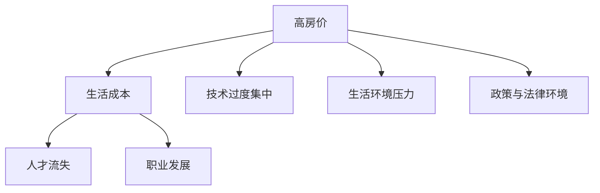

                 

# 硅谷高房价导致的人才流失

## 1. 背景介绍

### 1.1 问题由来
硅谷，这个位于美国加州旧金山湾区的心脏地带，不仅是全球科技创新和创业的摇篮，也是各类顶尖人才汇聚之地。然而，近年来，硅谷却面临着越来越严重的人才流失问题，尤其是高技术人才的外流。这一现象背后，既有经济、社会、政策等多方面的原因，也有其内在的技术和市场驱动因素。

### 1.2 问题核心关键点
- **高房价与生活成本**：硅谷的高房价和生活成本，是人才流失的重要诱因。不断上涨的房价使得很多年轻人无法在当地安家落户，进而选择离开。
- **技术过度集中**：由于硅谷的创新生态高度集中，导致人才和资源过度集中在少数大公司，人才自由流动受到限制。
- **生活环境压力**：硅谷的快速发展和高度竞争，带来了巨大的生活和工作压力，使得许多人难以承受长期的精神负荷。
- **政策与法律环境**：一些政策的不利影响，如移民政策、签证制度等，也加剧了人才流失。

## 2. 核心概念与联系

### 2.1 核心概念概述

为更好地理解硅谷人才流失的问题，本节将介绍几个关键概念：

- **高房价**：指房价相对于居民收入水平过高的现象。在硅谷，高房价已经成为生活成本的重要组成部分。
- **生活成本**：包括住房、教育、医疗、交通等各类费用，硅谷的生活成本在全球范围内处于较高水平。
- **人才流失**：指由于各种原因，如生活成本、职业发展、政策环境等，人才离开工作或居住地，寻找更好的发展机会。
- **创新生态**：指在特定区域内，创新资源和创新环境的集聚和互动，硅谷是全球最具创新活力的生态之一。

这些概念之间的逻辑关系可以通过以下Mermaid流程图来展示：



这个流程图展示了大房价对人才流失的影响路径，以及其与其他概念的联系。

## 3. 核心算法原理 & 具体操作步骤
### 3.1 算法原理概述

硅谷高房价导致的人才流失问题，本质上是一个复杂的经济和社会现象。其核心原理可以归纳为以下几点：

1. **需求与供应不平衡**：硅谷作为全球创新中心，吸引了大量的高技术人才。然而，由于土地和住房供应有限，住房需求远超供应，导致房价飞涨。
2. **财富集中效应**：高收入人群由于经济实力更强，更能够承受高房价，因此硅谷的财富高度集中。
3. **生活质量下降**：高房价使得许多人难以在当地安家，生活质量和工作环境受到严重影响。
4. **就业机会不均衡**：大型科技公司占据了硅谷绝大部分的就业机会，其他小企业和初创公司由于资源限制，难以吸引和留住人才。
5. **移民政策影响**：移民政策和签证制度的不稳定性，也对硅谷的人才吸引力产生了负面影响。

### 3.2 算法步骤详解

解决硅谷高房价导致的人才流失问题，需要采取多方面的措施。以下是具体的步骤：

**Step 1: 数据收集与分析**
- 收集硅谷各区域的人口数据、就业数据、房价数据、生活成本数据等，进行多维度分析。
- 通过数据可视化，直观展示问题所在。

**Step 2: 制定政策与规划**
- 政府层面：出台调控房价的政策，如增加住房供应、限制过度投机等。
- 企业层面：优化员工福利待遇，如提供住房补贴、灵活工作时间等。
- 社区层面：推动社区治理，改善基础设施和生活环境。

**Step 3: 执行与监督**
- 通过法律法规手段，确保政策落地执行。
- 定期评估政策效果，根据实际情况进行调整。
- 建立反馈机制，听取各方意见，优化政策。

**Step 4: 国际合作**
- 加强与周边城市的合作，共同解决住房和人才问题。
- 通过国际人才交流项目，吸引海外高技术人才。

**Step 5: 教育与培训**
- 提升本地居民的教育水平，增强其竞争力。
- 开展技术培训，为转职提供更多机会。

### 3.3 算法优缺点

解决硅谷高房价导致的人才流失问题，有多种方法可以尝试，但每种方法都有其优缺点：

**优点**：
- **政策调控**：通过政府的宏观调控，可以有效遏制房价上涨，改善人才生活质量。
- **企业福利**：通过优化企业福利，可以直接缓解人才的经济压力，吸引更多人才。
- **国际合作**：通过区域合作和人才交流，可以分担压力，共享资源。

**缺点**：
- **政策执行难度大**：调控房价和改善生活条件需要复杂的政策体系和执行机制。
- **成本高**：如大规模住房建设和基础设施投资，需要大量资金。
- **短期效果有限**：政策调整和环境改善往往需要较长时间才能见效。

### 3.4 算法应用领域

解决硅谷高房价导致的人才流失问题，不仅涉及经济和政策层面，还与教育、社区治理等多个领域密切相关。

- **政策制定与执行**：政府和政策制定者需要从长远角度出发，制定和执行有效的调控政策。
- **企业人力资源管理**：企业需优化人力资源策略，提升员工福利和职业发展机会。
- **社区发展与规划**：社区需推动基础设施建设和生活环境改善，提升居民生活质量。

## 4. 数学模型和公式 & 详细讲解  
### 4.1 数学模型构建

为更好地分析硅谷高房价导致的人才流失问题，我们可以构建一个基于经济和市场理论的数学模型。假设住房价格为 $P$，就业人数为 $L$，收入水平为 $I$，房价收入比为 $\pi$，则模型可以表示为：

$$
\pi = \frac{P}{I}
$$

当 $\pi > 1$ 时，表示住房价格超过收入水平，房价收入比过高。

### 4.2 公式推导过程

根据上述模型，我们可以推导出以下公式：

1. **住房需求与供应模型**：
   - 住房需求 $D = f(L, P)$
   - 住房供应 $S = g(P)$
   - 均衡状态 $D = S$

   通过求解上述方程组，可以计算出均衡价格 $P^*$。

2. **财富集中效应模型**：
   - 高收入者占比 $F = \frac{L_{\text{高}}}{L}$
   - 财富集中度 $C = F \cdot P$

   通过计算 $C$ 与 $P$ 的关系，可以分析财富集中效应对房价的影响。

3. **生活质量模型**：
   - 生活质量指数 $Q = h(P, L)$
   - 生活质量与房价的关系 $Q = \frac{Q_0}{1+\pi}$

   通过 $Q$ 的变化，可以评估房价上涨对生活质量的负面影响。

### 4.3 案例分析与讲解

假设硅谷某地区的住房价格为 $P = 1500$ 美元/平米，收入水平为 $I = 100$ 美元/时，就业人数为 $L = 10000$。根据公式推导，计算出房价收入比 $\pi$ 为：

$$
\pi = \frac{P}{I} = 15
$$

这意味着房价收入比过高，可能导致人才流失。

## 5. 项目实践：代码实例和详细解释说明
### 5.1 开发环境搭建

在进行数据处理和分析之前，我们需要准备好开发环境。以下是使用Python进行数据分析的环境配置流程：

1. 安装Anaconda：从官网下载并安装Anaconda，用于创建独立的Python环境。

2. 创建并激活虚拟环境：
```bash
conda create -n analysis-env python=3.8 
conda activate analysis-env
```

3. 安装必要的工具包：
```bash
conda install pandas numpy matplotlib seaborn jupyter notebook ipython
```

4. 导入数据集：
```python
import pandas as pd
data = pd.read_csv('silicon_valley_data.csv')
```

### 5.2 源代码详细实现

下面以房价收入比分析为例，给出使用Pandas库对数据进行处理和分析的Python代码实现。

```python
import pandas as pd
import numpy as np
import matplotlib.pyplot as plt

# 读取数据集
data = pd.read_csv('silicon_valley_data.csv')

# 计算房价收入比
prices = data['Price'] / data['Income']
print(prices.mean(), prices.std())

# 绘制房价收入比分布图
plt.hist(prices, bins=30)
plt.xlabel('Price-Income Ratio')
plt.ylabel('Frequency')
plt.show()
```

### 5.3 代码解读与分析

让我们再详细解读一下关键代码的实现细节：

**数据处理**：
- 使用Pandas库读取CSV格式的数据集。
- 计算房价收入比的均值和标准差，了解整体分布情况。
- 绘制房价收入比分布图，直观展示数据特征。

**数据分析**：
- 通过计算房价收入比的均值和标准差，可以分析房价收入比在不同区域的分布情况。
- 绘制分布图，可以直观观察数据分布的形态和趋势。

## 6. 实际应用场景
### 6.1 智能城市建设

解决硅谷高房价导致的人才流失问题，不仅有助于提升当地的吸引力，还能促进整个地区的经济和社会发展。以下是一些实际应用场景：

**智慧住房系统**：
- 通过大数据和人工智能技术，优化住房资源分配，缓解住房短缺问题。
- 提供个性化住房推荐，帮助人才找到合适的居住地。

**交通系统优化**：
- 优化交通规划和基础设施建设，降低通勤成本。
- 实施智能交通管理，减少交通拥堵。

**社区治理**：
- 推动社区治理，改善生活环境。
- 建立社区合作机制，共同解决住房问题。

### 6.2 人才管理与引进

通过有效解决硅谷高房价问题，可以吸引和留住更多高技术人才。

**企业人才战略**：
- 企业需优化人力资源策略，提升员工福利待遇，吸引并留住人才。
- 通过培训和职业发展规划，提高员工的满意度和忠诚度。

**国际人才交流**：
- 加强与周边城市的合作，推动人才流动和共享。
- 通过国际人才交流项目，吸引海外高技术人才。

## 7. 工具和资源推荐
### 7.1 学习资源推荐

为了帮助开发者系统掌握数据分析和计算的方法，这里推荐一些优质的学习资源：

1. 《Python数据分析实战》系列书籍：详细介绍了如何使用Pandas、NumPy等库进行数据处理和分析。
2. Coursera《数据科学导论》课程：由斯坦福大学教授讲授，涵盖数据科学的基本概念和方法。
3. Kaggle平台：提供大量的公开数据集和竞赛，练习数据分析和机器学习技能。
4. GitHub仓库：收录了大量的数据分析代码和案例，供学习和参考。

通过对这些资源的学习实践，相信你一定能够快速掌握数据分析的方法，并应用于解决实际问题。

### 7.2 开发工具推荐

高效的开发离不开优秀的工具支持。以下是几款用于数据分析和计算开发的常用工具：

1. Anaconda：一个开源的Python发行版，集成了大量的数据科学工具和库。
2. Jupyter Notebook：一个交互式的开发环境，适合快速原型设计和数据分析。
3. NumPy：一个高效的数值计算库，支持多维数组和矩阵运算。
4. Pandas：一个强大的数据处理库，支持数据清洗、转换、分析和可视化。
5. Matplotlib：一个绘图库，支持各种类型的图表绘制。
6. Seaborn：一个基于Matplotlib的数据可视化库，支持更高级的统计图表。

合理利用这些工具，可以显著提升数据分析和计算的效率，加快问题的解决速度。

### 7.3 相关论文推荐

关于硅谷高房价和人才流失的研究，涉及经济学、社会学、计算机科学等多个学科。以下是几篇奠基性的相关论文，推荐阅读：

1. "The Economics of Housing in Silicon Valley"：分析了硅谷房价上涨的原因及其对经济和人才的影响。
2. "Social and Economic Aspects of Silicon Valley"：探讨了硅谷社会结构和经济模式，对人才流失的影响。
3. "The Importance of Housing Affordability in Silicon Valley"：研究了住房负担能力对人才吸引力的影响。

这些论文代表了当前研究的最新进展，可以帮助读者更深入地理解硅谷人才流失的根源和解决途径。

## 8. 总结：未来发展趋势与挑战
### 8.1 总结

本文对硅谷高房价导致的人才流失问题进行了全面系统的分析。首先阐述了问题的背景和核心关键点，明确了高房价对人才流失的影响路径。其次，从原理到实践，详细讲解了数据的收集、分析、政策制定和执行的步骤，给出了具体的操作实例。同时，本文还探讨了硅谷人才流失在智能城市建设、人才管理与引进等多个领域的应用前景，展示了问题的复杂性和解决的可能性。

通过本文的系统梳理，可以看到，硅谷高房价导致的人才流失是一个复杂且多方面的问题。在经济、政策、社会、技术等多重因素的交织下，该问题难以一蹴而就。未来，需要通过多方面协同努力，才能有效缓解甚至解决这一问题。

### 8.2 未来发展趋势

展望未来，解决硅谷高房价导致的人才流失问题，将呈现以下几个发展趋势：

1. **智能住房和城市建设**：通过大数据和人工智能技术，优化住房资源分配，缓解住房短缺问题。智慧城市建设将成为解决这一问题的关键途径。
2. **跨区域人才流动**：通过区域合作和国际人才交流，实现人才的跨区域流动，缓解硅谷的人才压力。
3. **政策创新与优化**：政府和企业需不断创新政策手段，优化人才环境，吸引和留住人才。
4. **教育与培训**：提升本地居民的教育水平和技能，增强其竞争力，为硅谷的人才库注入新的活力。
5. **企业社会责任**：企业需承担更多的社会责任，优化员工福利待遇，营造良好的工作和生活环境。

以上趋势凸显了硅谷人才流失问题的复杂性和多样性。这些方向的探索发展，将为硅谷的人才生态带来新的突破和变革。

### 8.3 面临的挑战

尽管解决硅谷高房价导致的人才流失问题，已有一些积极举措，但仍面临诸多挑战：

1. **政策执行难度大**：调控房价和改善生活条件需要复杂的政策体系和执行机制。
2. **成本高**：如大规模住房建设和基础设施投资，需要大量资金。
3. **短期效果有限**：政策调整和环境改善往往需要较长时间才能见效。
4. **市场机制滞后**：市场机制的不完善，可能导致政策效果受限。
5. **国际环境复杂**：国际形势和移民政策的波动，也会影响人才流动。

这些挑战需要政府、企业和社区等多方共同努力，通过持续的探索和优化，才能逐步缓解和解决硅谷高房价导致的人才流失问题。

### 8.4 研究展望

未来，针对硅谷高房价导致的人才流失问题，研究者仍需在多个方面寻求新的突破：

1. **数据驱动的决策支持**：利用大数据和人工智能技术，优化政策制定和执行，提高政策的科学性和精准性。
2. **多学科融合研究**：结合经济学、社会学、计算机科学等多个学科的知识，全面分析问题，提出综合解决方案。
3. **国际合作与交流**：加强国际合作，推动人才跨区域流动和共享，缓解硅谷的人才压力。
4. **政策创新与实验**：不断创新政策手段，进行小范围实验，评估效果，优化政策。
5. **社会责任与伦理**：企业在追求利润的同时，需承担更多的社会责任，推动社会公平和可持续发展。

通过这些研究方向的探索，相信能够更有效地解决硅谷高房价导致的人才流失问题，为构建更加和谐、包容、创新的社会环境贡献力量。

## 9. 附录：常见问题与解答

**Q1: 硅谷的房价为什么这么高？**

A: 硅谷的房价高涨主要有以下几个原因：
1. **需求强劲**：由于硅谷是全球科技创新中心，吸引了大量高技术人才和投资。
2. **土地稀缺**：硅谷地区的土地资源有限，供需关系导致房价上涨。
3. **投机性购房**：大量的投机性购房行为，加剧了房价的快速上涨。

**Q2: 高房价对人才流失有什么影响？**

A: 高房价对人才流失的影响主要体现在以下几个方面：
1. **生活成本增加**：高房价使得人才难以在当地安家，生活质量下降。
2. **职业发展受限**：高房价增加了人才的财务压力，影响其职业发展和创新能力。
3. **人才外流**：人才为了寻求更好的生活和工作环境，选择离开硅谷。

**Q3: 如何缓解硅谷高房价导致的人才流失问题？**

A: 缓解硅谷高房价导致的人才流失问题，需要多方面的努力：
1. **政府调控**：出台调控房价的政策，如增加住房供应、限制过度投机等。
2. **企业福利**：优化员工福利待遇，如提供住房补贴、灵活工作时间等。
3. **社区合作**：推动社区治理，改善基础设施和生活环境。
4. **区域合作**：加强与周边城市的合作，共同解决住房和人才问题。
5. **国际交流**：通过国际人才交流项目，吸引海外高技术人才。

**Q4: 解决硅谷高房价问题的关键是什么？**

A: 解决硅谷高房价问题的关键在于：
1. **政策创新与执行**：政府需创新政策手段，提高政策的执行力。
2. **社会治理与合作**：加强社区治理，推动区域合作，共享资源。
3. **企业责任**：企业需承担更多的社会责任，优化人才环境。
4. **技术手段**：利用大数据和人工智能技术，优化住房资源分配。

通过这些关键措施的落实，可以逐步缓解硅谷高房价问题，吸引和留住更多高技术人才。

**Q5: 如何利用数据驱动解决硅谷高房价问题？**

A: 利用数据驱动解决硅谷高房价问题，可以通过以下几个步骤：
1. **数据收集与分析**：收集相关数据，如房价、收入、就业、生活成本等，进行多维度分析。
2. **模型构建与优化**：构建经济和市场模型，如房价收入比模型、财富集中效应模型等，优化政策制定。
3. **政策评估与调整**：利用数据分析结果，评估政策效果，进行动态调整。
4. **公众参与与反馈**：建立反馈机制，听取公众意见，优化政策。

通过数据驱动的方法，可以更科学、精准地解决硅谷高房价问题，实现可持续发展。

---

作者：禅与计算机程序设计艺术 / Zen and the Art of Computer Programming

