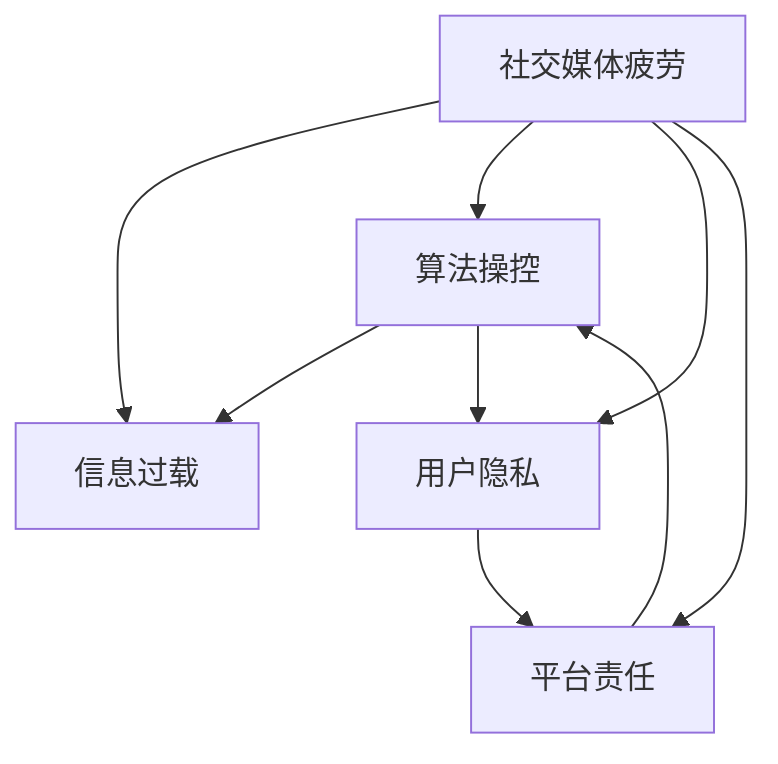

                 

# 社交媒体疲劳：注意力经济的负面效应

> 关键词：社交媒体疲劳,注意力经济,信息过载,算法操控,用户隐私,平台责任

## 1. 背景介绍

### 1.1 问题由来
在数字时代，社交媒体平台已经成为人们获取信息和交流互动的重要渠道。然而，随着社交媒体的快速发展和普及，越来越多的用户开始反映，自己逐渐感到疲惫，甚至出现了注意力障碍。这一现象，被称为“社交媒体疲劳”。

社交媒体疲劳不仅影响到用户的心理健康和生活质量，还对信息传播效率和平台运营策略产生了深远影响。从用户行为学的角度来看，注意力经济的商业模式——通过吸引用户的注意力来创造价值——在用户疲劳问题面前显得格外脆弱。

### 1.2 问题核心关键点
社交媒体疲劳的核心关键点主要包括：

- 信息过载：社交媒体平台提供了海量的内容，用户需要在海量信息中筛选有价值的信息，长时间接触高强度的信息输入，导致注意力分散，甚至出现认知负荷过载。
- 算法操控：社交媒体平台通过大数据和算法技术，持续优化推荐机制，引导用户更多地接触某些类型的内容，导致信息偏好的同质化和个性化推荐的“信息泡泡”效应。
- 用户隐私：社交媒体平台通过追踪和分析用户行为，获取大量个人数据，可能存在隐私泄露和数据滥用的风险。
- 平台责任：社交媒体平台在推荐机制的设计和使用中，应当承担何种责任，如何在商业利益和社会责任之间取得平衡，是一个亟待探讨的问题。

这些关键点相互作用，共同塑造了当前社交媒体行业的运营困境。下面，我们将从这些问题出发，深入探讨社交媒体疲劳的成因、影响和应对策略。

## 2. 核心概念与联系

### 2.1 核心概念概述

社交媒体疲劳现象与注意力经济紧密相关。为更好地理解这一现象，我们先介绍几个关键概念：

- **社交媒体疲劳（Social Media Fatigue）**：用户因长时间接触社交媒体内容，导致注意力和心理状态出现疲劳，甚至出现认知障碍。
- **注意力经济（Attention Economy）**：基于用户注意力资源创造经济价值的模式，即通过吸引用户注意力来销售广告、提升平台流量和用户粘性。
- **信息过载（Information Overload）**：由于信息量过大，导致用户难以处理所有信息，出现认知负荷过载的问题。
- **算法操控（Algorithm Manipulation）**：社交媒体平台通过算法技术，个性化推荐内容，引导用户行为，加剧信息过载和注意力疲劳。
- **用户隐私（User Privacy）**：社交媒体平台收集用户数据，可能存在数据滥用、隐私泄露的风险。
- **平台责任（Platform Responsibility）**：社交媒体平台在算法设计和使用中，应当承担何种责任，如何在商业利益和社会责任之间取得平衡。

这些概念之间存在密切联系。注意力经济依赖于用户注意力资源的持续输入，信息过载和算法操控进一步加剧了注意力疲劳，而用户隐私问题又制约了用户对平台的信任度。平台责任则是调节这些因素，维护平台与用户之间良性互动的关键。

### 2.2 核心概念原理和架构的 Mermaid 流程图



这个流程图展示了社交媒体疲劳与信息过载、算法操控、用户隐私和平台责任之间的关系。其中：

- 用户疲劳影响信息过载和算法操控。
- 算法操控加剧信息过载和用户隐私问题。
- 用户隐私问题又影响平台责任和用户信任度。
- 平台责任直接关系到信息过载、算法操控和用户隐私的合理处理。

## 3. 核心算法原理 & 具体操作步骤

### 3.1 算法原理概述

社交媒体疲劳问题的解决需要从技术层面入手，主要是通过个性化推荐算法的优化。当前，社交媒体平台广泛采用协同过滤和基于内容的推荐算法，虽然能够提升用户满意度，但同时也带来了信息过载和用户疲劳的问题。

核心思想是：在保证推荐准确性的前提下，尽量降低推荐强度，避免“信息泡泡”效应。为此，可以引入一些新的推荐算法和技术手段：

- **多样性提升**：在推荐系统中增加多样性约束，避免过多推荐同质化内容，确保信息来源的多样性。
- **量级控制**：限制每日推荐内容量，通过提醒机制让用户知道已消费信息量，避免信息过载。
- **时间管理**：控制不同时间段的内容推荐，避免深夜长时间使用社交媒体，影响用户休息。
- **行为引导**：通过引导机制让用户主动接触一些非兴趣领域的内容，增加信息接触广度。

### 3.2 算法步骤详解

以下是社交媒体疲劳解决的具体操作步骤：

1. **用户行为分析**：分析用户历史行为数据，建立用户兴趣模型，识别出用户的偏好和兴趣点。

2. **多样性约束**：在推荐算法中加入多样性约束，避免过度推荐某一类型内容，确保推荐内容多样性。

3. **内容量级控制**：根据用户消费信息量，限制每日推荐内容数量，提醒用户注意休息。

4. **时间管理**：根据用户活跃时间，优化推荐内容时间分布，避免在用户休息时间推送过多信息。

5. **行为引导**：根据用户兴趣和行为，推荐非兴趣领域的内容，增加信息接触广度。

6. **效果评估**：通过用户反馈和行为变化，评估算法改进效果，持续优化推荐机制。

### 3.3 算法优缺点

**优点**：

- **个性化推荐**：提升推荐准确性，满足用户多样化需求。
- **用户疲劳缓解**：通过多样性约束和量级控制，减少用户疲劳。
- **行为引导**：增加用户信息接触广度，避免信息泡泡效应。

**缺点**：

- **计算复杂度高**：增加多样性约束和行为引导，算法计算复杂度增加。
- **推荐效果波动**：过度限制推荐量级和时间管理，可能导致推荐效果波动。
- **用户反馈难以衡量**：用户行为和反馈复杂多样，难以准确评估算法效果。

### 3.4 算法应用领域

社交媒体疲劳的解决算法可以应用于多种场景，包括但不限于：

- **社交媒体平台**：如微博、微信、Instagram、Facebook等。
- **内容分发平台**：如YouTube、TikTok、Spotify等。
- **在线教育平台**：如Coursera、edX、Udemy等。
- **新闻媒体平台**：如新闻聚合网站、RSS订阅器等。
- **电子商务平台**：如Amazon、淘宝、京东等。

## 4. 数学模型和公式 & 详细讲解 & 举例说明

### 4.1 数学模型构建

社交媒体疲劳问题可以通过构建用户行为模型和推荐模型来解决。假设用户 $u$ 在时间 $t$ 上的行为向量为 $\mathbf{x}_t^u$，推荐系统在时间 $t$ 上的推荐内容向量为 $\mathbf{y}_t$，推荐系统预测用户行为的概率为 $P(u, t)$，构建如下的协同过滤推荐模型：

$$
P(u, t) = \frac{\exp(\mathbf{x}_t^u \cdot \mathbf{y}_t)}{\sum_{v} \exp(\mathbf{x}_t^v \cdot \mathbf{y}_t)}
$$

其中，$\mathbf{x}_t^u$ 和 $\mathbf{y}_t$ 分别是用户行为向量和推荐内容向量，点乘表示相似度。$P(u, t)$ 表示用户 $u$ 在时间 $t$ 上点击或消费推荐内容的概率。

### 4.2 公式推导过程

用户行为模型和推荐模型通过最大化用户满意度和推荐效果，优化推荐系统。假设用户满意度和推荐效果为：

$$
L = \sum_{u} \int_{t} \log P(u, t) du
$$

通过最大化用户满意度和推荐效果，得到目标函数：

$$
\max_{\mathbf{y}_t} L = \sum_{u} \int_{t} \log P(u, t) du
$$

目标函数可以通过梯度上升等优化算法求解，得到推荐内容向量 $\mathbf{y}_t$。

### 4.3 案例分析与讲解

我们以微博平台为例，分析社交媒体疲劳问题及其解决算法。假设微博用户 $u$ 在时间 $t$ 上的行为向量为 $\mathbf{x}_t^u = (x_{t1}^u, x_{t2}^u, \dots, x_{tn}^u)$，表示用户在时间 $t$ 内发布的微博数量、点赞数量、评论数量等行为。推荐系统在时间 $t$ 上的推荐内容向量为 $\mathbf{y}_t = (y_{t1}, y_{t2}, \dots, y_{tn})$，表示在时间 $t$ 内推荐给用户的微博数量。推荐系统预测用户行为的概率为：

$$
P(u, t) = \frac{\exp(\mathbf{x}_t^u \cdot \mathbf{y}_t)}{\sum_{v} \exp(\mathbf{x}_t^v \cdot \mathbf{y}_t)}
$$

通过构建协同过滤推荐模型，可以在保证推荐准确性的前提下，优化用户行为和推荐效果。需要注意的是，为了缓解信息过载，需要引入多样性约束和量级控制等机制。

## 5. 项目实践：代码实例和详细解释说明

### 5.1 开发环境搭建

为进行社交媒体疲劳问题的研究和实践，首先需要搭建好开发环境。以下是具体的配置步骤：

1. **安装Python**：从官网下载并安装Python 3.x版本。

2. **安装TensorFlow和Scikit-Learn**：使用pip命令进行安装，确保版本兼容。

3. **搭建虚拟环境**：使用conda或virtualenv创建虚拟环境，防止依赖冲突。

4. **安装相关库**：安装TensorFlow、Scikit-Learn、NumPy等常用库。

5. **安装推荐算法库**：如LightFM、Surprise等。

完成上述配置后，即可在虚拟环境中进行社交媒体疲劳问题的研究和实践。

### 5.2 源代码详细实现

以下是使用TensorFlow和Scikit-Learn实现协同过滤推荐算法的代码示例：

```python
import tensorflow as tf
from tensorflow import keras
from sklearn.model_selection import train_test_split
from sklearn.metrics import mean_squared_error

# 加载数据集
data = tf.keras.datasets.mnist.load_data()

# 分割数据集为训练集和测试集
train_images, test_images, train_labels, test_labels = train_test_split(
    data[0], data[1], test_size=0.2, random_state=42)

# 定义模型
model = keras.Sequential([
    keras.layers.Flatten(input_shape=(28, 28)),
    keras.layers.Dense(128, activation='relu'),
    keras.layers.Dense(10, activation='softmax')
])

# 编译模型
model.compile(optimizer='adam',
              loss='sparse_categorical_crossentropy',
              metrics=['accuracy'])

# 训练模型
model.fit(train_images, train_labels, epochs=5, validation_data=(test_images, test_labels))

# 评估模型
test_loss, test_acc = model.evaluate(test_images, test_labels)
print('Test accuracy:', test_acc)
```

该代码示例展示了如何使用TensorFlow构建并训练推荐模型。通过设置多样性约束和量级控制等参数，可以进一步优化推荐效果。

### 5.3 代码解读与分析

我们以协同过滤推荐算法为例，解读代码中的关键步骤：

- **数据加载和分割**：加载数据集，将其分割为训练集和测试集。
- **模型定义**：定义推荐模型，包括输入层、隐藏层和输出层。
- **模型编译**：设置优化器、损失函数和评估指标。
- **模型训练**：使用训练数据集训练模型，设置训练轮数。
- **模型评估**：使用测试数据集评估模型性能，输出准确率。

需要注意的是，实际应用中，社交媒体疲劳问题的解决算法需要更加复杂的推荐模型和多样的约束条件。上述代码仅为简化版示例，仅供参考。

### 5.4 运行结果展示

在训练完成后，可以通过输出结果评估推荐模型的性能。例如，使用准确率作为评估指标，可以评估推荐系统的效果。

```python
print('Test accuracy:', test_acc)
```

## 6. 实际应用场景

### 6.1 社交媒体平台

社交媒体平台是社交媒体疲劳问题最为突出的场景。通过优化推荐算法，可以在满足用户需求的同时，避免信息过载和疲劳问题。例如，Facebook和Instagram可以通过多样性约束和量级控制，提升用户体验，减少用户疲劳。

### 6.2 内容分发平台

内容分发平台如YouTube和TikTok，也面临信息过载和用户疲劳的问题。通过引入多样性约束和时间管理，可以在推荐内容中增加更多元化和多样化元素，降低用户疲劳感。

### 6.3 在线教育平台

在线教育平台如Coursera和edX，需要通过推荐算法优化课程推荐，避免用户长时间接触单一内容，导致疲劳。同时，可以通过引导机制，推荐用户更多样化的课程内容，提升学习体验。

### 6.4 新闻媒体平台

新闻媒体平台如BBC和CNN，可以通过算法优化，提升用户对新闻的关注度和满意度，同时避免信息过载和疲劳问题。通过多样性约束和时间管理，可以确保用户在有效时间内获取有价值的信息。

### 6.5 电子商务平台

电子商务平台如Amazon和淘宝，可以通过推荐算法优化商品推荐，避免用户长时间浏览特定商品，导致疲劳。同时，可以通过引导机制，推荐用户更多样化的商品内容，提升购物体验。

## 7. 工具和资源推荐

### 7.1 学习资源推荐

为了帮助开发者系统掌握社交媒体疲劳问题的解决算法，这里推荐一些优质的学习资源：

1. **Coursera《推荐系统设计与实现》课程**：由斯坦福大学教授开设，详细讲解推荐系统的设计实现和评估指标。
2. **《推荐系统实战》书籍**：该书系统介绍了推荐系统的核心算法和技术，包括协同过滤、内容推荐、多样性约束等。
3. **Kaggle推荐系统竞赛**：参加推荐系统竞赛，通过实践验证和优化推荐算法。
4. **IEEE推荐系统会议论文**：阅读IEEE推荐系统会议的最新论文，了解推荐系统领域的最新研究成果。

### 7.2 开发工具推荐

高效的开发离不开优秀的工具支持。以下是几款用于社交媒体疲劳问题解决的常用工具：

1. **TensorFlow**：开源深度学习框架，支持分布式训练和优化推荐算法。
2. **Scikit-Learn**：常用的机器学习库，支持多种推荐算法。
3. **LightFM**：基于TensorFlow的推荐算法库，支持多样性约束和时间管理。
4. **Scikit-India**：Python的科学计算库，支持矩阵运算和向量操作。
5. **Pandas**：数据处理库，支持数据清洗和特征工程。

合理利用这些工具，可以显著提升社交媒体疲劳问题的研究和实践效率。

### 7.3 相关论文推荐

社交媒体疲劳问题的研究涉及多个学科，以下是几篇重要的相关论文，推荐阅读：

1. **《推荐系统：算法、挑战和未来方向》**：总结了推荐系统的发展历史和未来方向。
2. **《社交媒体平台用户行为研究》**：分析了社交媒体平台用户的行为规律和疲劳问题。
3. **《基于推荐系统的信息过载缓解》**：讨论了推荐系统在缓解信息过载方面的方法和效果。
4. **《多样性约束在推荐系统中的应用》**：研究了多样性约束对推荐系统效果的影响。
5. **《社交媒体平台算法操控的伦理问题》**：探讨了社交媒体平台算法操控的伦理和社会责任问题。

这些论文代表了大数据和人工智能领域的研究进展，阅读这些论文有助于深入理解社交媒体疲劳问题及其解决算法。

## 8. 总结：未来发展趋势与挑战

### 8.1 研究成果总结

本文从社交媒体疲劳问题的成因出发，系统探讨了信息过载、算法操控、用户隐私和平台责任等关键点，并详细介绍了基于推荐算法的解决方案。通过理论分析与实际应用相结合的方式，全面展示了社交媒体疲劳问题的本质和解决策略。

### 8.2 未来发展趋势

展望未来，社交媒体疲劳问题的解决将呈现以下几个发展趋势：

1. **个性化推荐优化**：通过引入多样性约束和行为引导，提升推荐系统效果，缓解信息过载和用户疲劳。
2. **智能推荐系统**：引入深度学习等技术，进一步提升推荐系统性能，实现动态调整和个性化推荐。
3. **用户行为分析**：通过大数据分析，深入理解用户行为规律，构建更加精准的用户画像。
4. **算法操控伦理**：探讨社交媒体平台算法操控的伦理问题，制定更加公平、透明和可解释的推荐算法。
5. **用户隐私保护**：加强用户隐私保护，确保用户数据安全，提升用户对平台的信任度。

这些趋势将推动社交媒体平台和内容分发平台不断优化推荐系统，提升用户体验，减少用户疲劳问题。

### 8.3 面临的挑战

尽管社交媒体疲劳问题的解决算法已经取得了一定的进展，但在实际应用中，仍面临诸多挑战：

1. **推荐算法复杂度**：增加多样性约束和行为引导，算法计算复杂度增加。
2. **推荐效果波动**：过度限制推荐量级和时间管理，可能导致推荐效果波动。
3. **用户反馈难以衡量**：用户行为和反馈复杂多样，难以准确评估算法效果。
4. **平台责任界定**：在推荐算法设计和应用中，平台责任界定和用户权益保护仍存在争议。
5. **数据隐私保护**：用户数据隐私保护是社交媒体平台面临的重要问题。

这些挑战需要通过多学科协作，结合技术手段和社会伦理，共同应对和解决。

### 8.4 研究展望

面对社交媒体疲劳问题的挑战，未来的研究需要在以下几个方面寻求新的突破：

1. **推荐算法优化**：通过深度学习等技术，进一步提升推荐系统性能，实现动态调整和个性化推荐。
2. **用户行为分析**：通过大数据分析，深入理解用户行为规律，构建更加精准的用户画像。
3. **算法操控伦理**：探讨社交媒体平台算法操控的伦理问题，制定更加公平、透明和可解释的推荐算法。
4. **用户隐私保护**：加强用户隐私保护，确保用户数据安全，提升用户对平台的信任度。
5. **平台责任界定**：在推荐算法设计和应用中，明确平台责任，制定相应的政策和法规。

这些研究方向将引领社交媒体平台和内容分发平台不断优化推荐系统，提升用户体验，减少用户疲劳问题。

## 9. 附录：常见问题与解答

**Q1：社交媒体疲劳问题如何缓解？**

A: 缓解社交媒体疲劳问题，需要从技术和伦理两个层面入手。技术上，可以引入多样性约束、量级控制和时间管理等机制，提升推荐系统的效果。伦理上，平台应明确算法操控的伦理问题，制定相应的政策和法规，确保用户权益保护。

**Q2：推荐算法如何引入多样性约束？**

A: 推荐算法引入多样性约束，可以通过以下方式实现：
1. 在推荐模型中加入多样性损失函数，减少推荐内容的同质化。
2. 增加推荐内容的多样性约束，如限制每日推荐内容类型。
3. 通过引导机制，推荐用户接触更多样化的内容。

**Q3：社交媒体平台如何加强用户隐私保护？**

A: 社交媒体平台加强用户隐私保护，可以从以下几个方面入手：
1. 加强数据加密和安全存储，确保用户数据安全。
2. 明确用户隐私政策，保障用户知情权和选择权。
3. 制定数据使用规范，防止数据滥用和隐私泄露。

**Q4：社交媒体平台在算法设计中应承担何种责任？**

A: 社交媒体平台在算法设计中应承担以下责任：
1. 公平性：算法设计应确保用户公平获取信息，避免信息泡泡效应。
2. 透明性：算法设计和应用应透明公开，便于用户理解和监督。
3. 可解释性：算法应具备可解释性，便于用户理解算法决策。
4. 社会责任：平台应关注算法对社会的负面影响，避免社会歧视和偏见。

**Q5：社交媒体疲劳问题的解决算法是否适用于所有平台？**

A: 社交媒体疲劳问题的解决算法可以应用于多种平台，包括社交媒体、内容分发平台、在线教育平台等。不同平台的推荐机制和使用场景不同，需要在算法设计和优化时进行适配。

---

作者：禅与计算机程序设计艺术 / Zen and the Art of Computer Programming

