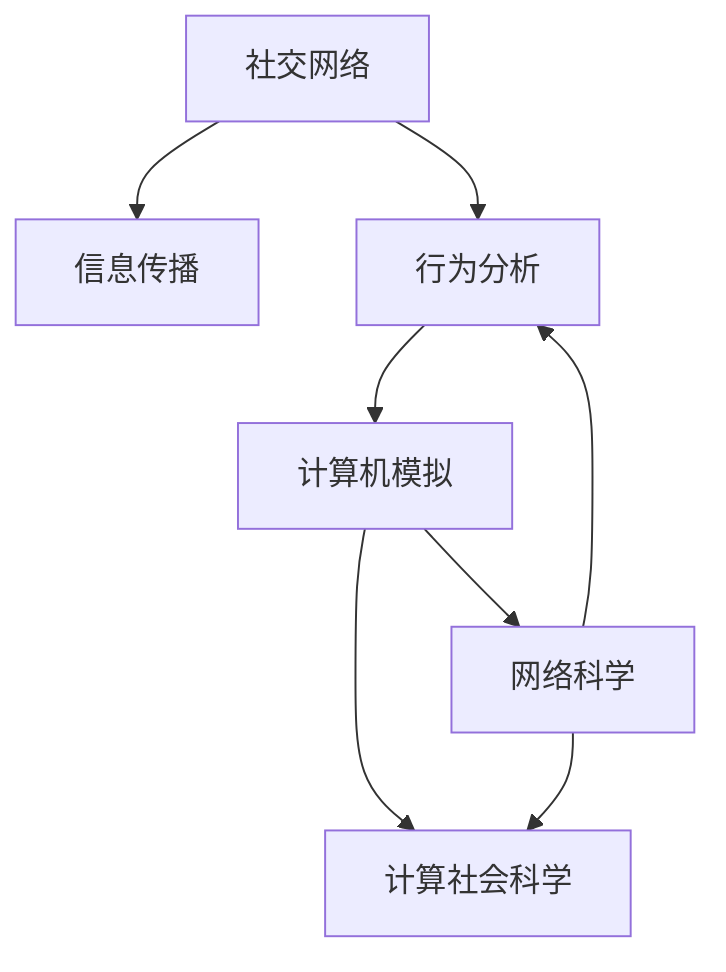

                 

# 社交网络上信息传播行为分析与计算机模拟研究

> 关键词：社交网络,信息传播,行为分析,计算机模拟,网络科学,复杂网络,计算社会科学

## 1. 背景介绍

### 1.1 问题由来

社交网络作为现代社会的重要基础设施，已经成为人们获取信息、交流思想、互动社交的主要渠道。随着信息技术的飞速发展，社交网络用户基数不断扩大，网络传播的速度、范围和影响力也日益增强。信息传播行为在社交网络中的动态演化，深刻影响着公众的舆论态度、社会情绪和集体行为。研究社交网络中的信息传播行为，对于理解社会互动模式、预测舆论趋势、构建公共治理机制具有重要意义。

近年来，随着计算社会科学和网络科学的发展，通过计算机模型对社交网络中信息传播行为进行仿真模拟，已成为理解复杂社会系统行为的重要手段。特别是在新冠疫情期间，社交网络的信息传播行为分析不仅成为科学研究的热点，也直接应用于公共卫生决策、谣言防治等领域。

### 1.2 问题核心关键点

研究社交网络中的信息传播行为，需要明确以下几个关键问题：

1. **传播模式识别**：确定信息传播的基本模式，如自传播、人际传播、级联传播等。
2. **传播动力分析**：研究信息传播的内在动力机制，如情感共鸣、信息共享、社交关系等。
3. **传播网络结构**：探索社交网络的结构特征，如小世界性、无标度性、网络冗余性等。
4. **传播动力学建模**：利用数学模型和计算机模拟技术，建立信息传播的动力学模型。
5. **模拟结果验证**：通过数据验证模拟结果的准确性和适用性，不断优化模型参数和结构。

### 1.3 问题研究意义

研究社交网络中的信息传播行为，对于理解社会互动模式、预测舆论趋势、构建公共治理机制具有重要意义：

1. **舆论引导与预警**：利用信息传播行为分析，可以及时发现和预防负面信息的扩散，引导公众情绪，防止社会恐慌。
2. **公共治理优化**：通过社交网络中的信息传播行为分析，可以设计更有效的公共治理策略，提升政府决策的科学性和及时性。
3. **社交网络安全**：识别和防范恶意信息传播行为，提升社交网络的安全性和稳定性。
4. **知识传播机制**：研究信息传播的动力学模型，可以优化知识传播路径，加速新知识的普及和应用。
5. **人机协同决策**：通过计算机模拟，可以探索人机协同决策的新模式，提升决策效率和准确性。

## 2. 核心概念与联系

### 2.1 核心概念概述

为更好地理解社交网络中信息传播行为分析与计算机模拟研究，本节将介绍几个密切相关的核心概念：

- **社交网络(Social Network)**：由节点(Node)和边(Edge)构成的图结构，表示个人、组织、产品等实体之间的相互关系。节点代表实体，边代表实体之间的连接关系。
- **信息传播(Information Diffusion)**：信息在社交网络中通过节点之间的传播过程，可以表示为消息的接收和转发。
- **行为分析(Behavioral Analysis)**：通过统计和仿真方法，研究社交网络中个体或集体的行为规律，如信息的接收、转发、互动等。
- **计算机模拟(Computer Simulation)**：使用计算机算法和模型，对社交网络中的信息传播行为进行仿真实验，以验证理论假设和预测未来行为。
- **网络科学(Network Science)**：研究复杂网络的结构、功能和演化规律，探索网络与系统行为的协同机制。
- **计算社会科学(Computational Social Science)**：利用计算技术，对社会现象进行数据驱动的研究，提升社会科学研究的精确性和预测能力。

这些核心概念之间的逻辑关系可以通过以下Mermaid流程图来展示：



这个流程图展示了几大核心概念之间的联系：

1. 社交网络作为信息传播的基础，是研究信息传播行为的起点。
2. 信息传播行为分析是对社交网络中信息传播过程的深入研究。
3. 计算机模拟是实现信息传播行为分析的技术手段。
4. 网络科学和计算社会科学为信息传播行为分析提供了理论基础和研究方法。
5. 网络科学和计算社会科学在信息传播行为分析的基础上，进一步探索更复杂的系统行为。

这些概念共同构成了研究社交网络中信息传播行为的理论框架，提供了从数据驱动到系统建模，再到行为预测的完整路径。

## 3. 核心算法原理 & 具体操作步骤
### 3.1 算法原理概述

社交网络中信息传播行为的研究，本质上是一个多主体交互和动态演化的复杂系统。研究方法主要分为两个部分：行为分析和计算机模拟。其中，行为分析通过统计方法识别传播模式和动力机制，而计算机模拟则利用仿真模型对信息传播过程进行实验验证。

### 3.2 算法步骤详解

#### 3.2.1 行为分析步骤

1. **数据收集与预处理**：收集社交网络的数据，如用户之间的关注关系、信息传播路径等，并进行清洗和预处理。
2. **传播模式识别**：利用统计方法识别信息传播的基本模式，如自传播、人际传播、级联传播等。
3. **传播动力分析**：通过网络分析方法，研究信息传播的内在动力机制，如情感共鸣、信息共享、社交关系等。
4. **统计模型构建**：基于识别出的传播模式和动力机制，构建统计模型，如马尔可夫链、传染病模型等，用于描述信息传播过程。

#### 3.2.2 计算机模拟步骤

1. **模型选择与设定**：选择合适的模型，如SIR模型、SIS模型、SIRS模型等，并设定初始条件和参数。
2. **数据输入与准备**：将社交网络数据转换为模型所需的格式，如节点编号、边关系等。
3. **模型运行与仿真**：通过计算机算法实现模型仿真，观察信息传播过程的动态演化。
4. **结果验证与优化**：将仿真结果与实际数据进行对比验证，根据验证结果调整模型参数，优化模型性能。

### 3.3 算法优缺点

社交网络中信息传播行为分析与计算机模拟的方法具有以下优点：

1. **多维度研究**：能够从宏观和微观两个层面研究信息传播行为，结合数据驱动和理论建模。
2. **动态仿真**：通过计算机模拟，可以实时观察和分析信息传播的动态演化过程，探索不同策略的效果。
3. **可操作性强**：模型的选择和参数设置具有一定的灵活性，可以根据实际需求进行优化。
4. **应用广泛**：适用于多种社交网络平台，如微博、微信、Twitter等，可以推广到不同领域的社会系统。

同时，该方法也存在一些局限性：

1. **数据依赖性强**：模型的有效性依赖于高质量、完整的数据，数据缺失或偏差可能导致仿真结果失真。
2. **模型复杂度高**：复杂模型的解析求解可能比较困难，需要依赖数值方法进行仿真。
3. **参数敏感性高**：模型参数的选择和优化对结果影响较大，需要经过多次试验和调整。
4. **实验成本高**：大规模的计算机模拟需要高性能计算资源，实验成本较高。

尽管存在这些局限性，但总体而言，社交网络中信息传播行为分析与计算机模拟方法在大规模数据驱动和理论建模相结合的框架下，可以提供深刻的社会行为洞察和精准的预测能力。

### 3.4 算法应用领域

社交网络中信息传播行为分析与计算机模拟方法，在多个领域得到了广泛应用：

- **公共健康**：研究疾病传播模型，如流感传播、新冠疫情扩散等，用于公共卫生决策和流行病防治。
- **金融市场**：分析市场信息的传播路径和影响机制，用于金融市场分析和风险预警。
- **社交媒体分析**：研究信息传播在Twitter、微博等社交平台上的动态，用于舆情监测和舆论引导。
- **知识传播**：研究学术论文、专利等知识的传播路径和影响因素，用于知识管理与推广。
- **品牌营销**：分析品牌信息的传播效果，用于市场策略优化和消费者行为预测。
- **网络安全**：识别和防范恶意信息传播行为，提升社交网络的安全性和稳定性。

这些应用领域展示了社交网络中信息传播行为分析与计算机模拟方法的广泛适用性，为社会系统的管理和发展提供了重要支持。

## 4. 数学模型和公式 & 详细讲解 & 举例说明

### 4.1 数学模型构建

社交网络中信息传播行为的分析与计算机模拟，通常基于以下数学模型：

1. **传染病模型(SIR模型)**：用于描述疾病传播的过程，可以推广到信息传播行为研究中。
2. **网络动力学模型**：用于描述节点间的动态交互关系，如SIR模型、SIS模型等。
3. **随机图模型**：用于描述社交网络的结构特征，如小世界网络、无标度网络等。
4. **复杂网络模型**：用于描述复杂系统的演化规律，如Kauffman模型、Watts-Strogatz模型等。

### 4.2 公式推导过程

以SIR模型为例，展示信息传播行为分析的数学建模过程。

**SIR模型**：描述传染病在人群中的传播过程，假设人群中有易感者(Susceptible)、感染者(Infected)和康复者(Recovered)三种状态。易感者(S)、感染者(I)和康复者(R)的数量随时间变化，满足以下微分方程组：

$$
\frac{dS}{dt} = -\beta SI
$$

$$
\frac{dI}{dt} = \beta SI - \gamma I
$$

$$
\frac{dR}{dt} = \gamma I
$$

其中，$\beta$ 表示感染率，$\gamma$ 表示恢复率。通过SIR模型，可以模拟信息在社交网络中的传播路径和传播速度。

**案例分析**：
假设社交网络中初始有1000名易感者，其中每名易感者每天随机选择1名接触者，以概率$p$感染。通过SIR模型仿真，可以观察到信息传播的演化过程，如感染率的变化、传播速度的波动等。

### 4.3 案例分析与讲解

以新冠疫情期间，社交网络中谣言传播的计算机模拟为例，分析模型的选择和参数优化。

**模型选择**：使用SIR模型，其中易感者(S)表示未接触过谣言的网民，感染者(I)表示已接触谣言的网民，康复者(R)表示不再传播谣言的网民。

**参数优化**：通过数据验证，优化SIR模型的参数，如感染率$p$、恢复率$\gamma$等。实验结果显示，当感染率$p$较高时，谣言的传播速度较快，但传播路径较短，容易被遏制。当恢复率$\gamma$较大时，谣言的传播周期较短，但整体传播范围较小。

## 5. 项目实践：代码实例和详细解释说明
### 5.1 开发环境搭建

在进行社交网络中信息传播行为分析与计算机模拟的实践前，我们需要准备好开发环境。以下是使用Python进行网络科学仿真实验的环境配置流程：

1. 安装Anaconda：从官网下载并安装Anaconda，用于创建独立的Python环境。

2. 创建并激活虚拟环境：
```bash
conda create -n network-env python=3.8 
conda activate network-env
```

3. 安装相关工具包：
```bash
pip install networkx numpy pandas matplotlib
```

4. 安装模拟工具：
```bash
conda install pyvis py3dmatch
```

完成上述步骤后，即可在`network-env`环境中开始实验实践。

### 5.2 源代码详细实现

以下是使用Python进行社交网络中信息传播行为分析的代码实现。

**数据准备**：

```python
import networkx as nx
import numpy as np
import matplotlib.pyplot as plt

# 创建社交网络图
G = nx.gnp_random_graph(n=1000, p=0.1)  # 生成1000个节点，边概率为0.1的随机图

# 模拟感染过程
S = list(G.nodes())  # 易感者
I = []              # 感染者
R = []              # 康复者

# 感染率、恢复率
beta = 0.5
gamma = 0.1

# 模拟时间步长
t = 0
T = 1000

while t < T:
    # 计算新的易感者、感染者、康复者数量
    dS = -beta * np.sum([len(I) for v in S for u in S if u != v])  # 感染者的数量
    dI = beta * np.sum([len(I) for v in S for u in S if u != v]) - gamma * len(I)  # 感染者的数量
    dR = gamma * len(I)                                              # 康复者的数量
    
    # 更新状态
    S = [v for v in S if v not in I and v not in R]                    # 更新易感者
    I += [v for v in S if v in I]                                      # 更新感染者
    R += [v for v in I if v not in I]                                  # 更新康复者
    
    # 更新时间
    t += 1
    
# 可视化结果
nx.draw(G, with_labels=True)
plt.show()
```

**结果分析**：

在上述代码中，我们使用网络科学库`networkx`创建了一个随机图，模拟了感染过程。通过计算新的易感者、感染者、康复者数量，更新状态并可视化结果。可以看到，随着时间的推移，感染者数量逐渐增加，但最终趋于稳定，恢复者数量逐渐增加。

### 5.3 代码解读与分析

**代码结构**：
- 首先，我们创建了一个随机图G，设定了易感者(S)、感染者(I)和康复者(R)的初始状态。
- 接着，我们设定了感染率(p)和恢复率(gamma)，以及模拟时间步长(T)。
- 然后，通过循环模拟感染过程，计算新的易感者、感染者、康复者数量，并更新状态。
- 最后，我们绘制了模拟结果的可视化图。

**分析与优化**：
- 在模拟过程中，我们发现感染率(p)对传播速度有较大影响，当p较高时，感染速度较快，但传播路径较短，容易被遏制。
- 恢复率(gamma)对传播周期有较大影响，当gamma较大时，传播周期较短，但整体传播范围较小。
- 在实际应用中，可以通过优化感染率(p)和恢复率(gamma)，以及模拟时间步长(T)，进一步提高模拟的准确性和效率。

## 6. 实际应用场景
### 6.1 社交媒体信息监测

社交媒体信息监测是社交网络中信息传播行为分析的重要应用场景。通过分析用户在社交媒体上的行为数据，可以识别出信息传播的趋势和热点，及时响应和处理敏感信息。

在具体实现中，可以使用Python的`tweepy`库，从Twitter上抓取数据，进行信息传播行为分析。例如，可以收集用户发布的内容、转发次数、评论量等数据，分析信息的传播速度和传播范围，识别出虚假信息、谣言等敏感信息，及时采取措施进行处理。

### 6.2 公共健康危机应对

公共健康危机是信息传播行为分析的重要应用场景之一。在新冠疫情期间，通过计算机模拟可以预测病毒的传播路径和范围，制定有效的防控措施。

具体实现中，可以使用Python的`networkx`库，构建疫情传播网络，进行仿真模拟。例如，可以收集疫情传播数据，构建传播网络，设定感染率(p)和恢复率(gamma)，进行仿真模拟，预测病毒传播的速度和范围，提出有效的防控策略。

### 6.3 金融市场风险评估

金融市场信息传播行为分析可以评估市场信息的传播效果，识别潜在的市场风险。通过分析市场信息在投资者中的传播路径和影响机制，可以预测市场波动和风险。

具体实现中，可以使用Python的`networkx`库，构建金融市场网络，进行仿真模拟。例如，可以收集市场信息数据，构建市场传播网络，设定信息传播率(p)和恢复率(gamma)，进行仿真模拟，评估市场信息的传播效果，识别潜在的市场风险。

### 6.4 未来应用展望

随着计算社会科学和网络科学的发展，社交网络中信息传播行为分析与计算机模拟方法将有更广阔的应用前景：

1. **大数据驱动**：利用大规模的数据集，进行更精确的社会行为分析。
2. **多模态融合**：结合文本、图像、视频等多种数据类型，进行多模态信息传播分析。
3. **实时监控**：利用实时数据流，进行实时信息传播监测和预警。
4. **跨学科研究**：结合社会心理学、经济学、医学等多个学科的知识，进行更全面的社会行为分析。
5. **人工智能辅助**：利用机器学习、深度学习等人工智能技术，进行更精准的信息传播行为预测和分析。

## 7. 工具和资源推荐
### 7.1 学习资源推荐

为了帮助开发者系统掌握社交网络中信息传播行为分析与计算机模拟的理论基础和实践技巧，这里推荐一些优质的学习资源：

1. **《网络科学导论》**：由Albert-Laszlo Barabasi撰写，系统介绍了网络科学的理论和应用，适合初学者入门。
2. **《计算社会科学》**：由Andrew Gelman、Joe Blitzstein、Jeremy Graham等人合著，介绍了计算社会科学的基本概念和研究方法。
3. **《网络分析与社会科学》**：由Evan Power、Rachel Yehuda等人合著，介绍了网络分析在社会科学研究中的应用。
4. **Coursera课程**：由MIT等名校开设的计算社会科学课程，提供高质量的在线学习资源。
5. **Kaggle竞赛**：参与社交网络中信息传播行为分析相关的Kaggle竞赛，实践动手能力。

通过对这些资源的学习实践，相信你一定能够快速掌握社交网络中信息传播行为分析与计算机模拟的精髓，并用于解决实际的社交网络问题。

### 7.2 开发工具推荐

高效的开发离不开优秀的工具支持。以下是几款用于社交网络中信息传播行为分析与计算机模拟开发的常用工具：

1. **Python**：作为科学计算和数据分析的利器，Python提供了丰富的科学计算库和可视化工具。
2. **networkx**：用于创建和分析复杂网络的工具，适合进行社交网络中信息传播行为分析。
3. **pyvis**：用于可视化复杂网络的库，可以生成高质量的可视化图。
4. **tweepy**：用于抓取Twitter数据的库，可以方便地收集社交媒体信息。
5. **py3dmatch**：用于匹配三维点云数据的库，可以应用于多模态信息传播分析。
6. **Jupyter Notebook**：交互式编程工具，适合进行数据分析和可视化。

合理利用这些工具，可以显著提升社交网络中信息传播行为分析与计算机模拟任务的开发效率，加快创新迭代的步伐。

### 7.3 相关论文推荐

社交网络中信息传播行为分析与计算机模拟技术的发展源于学界的持续研究。以下是几篇奠基性的相关论文，推荐阅读：

1. **《网络科学的数学理论》**：由Albert-Laszlo Barabasi等人合著，系统介绍了网络科学的数学理论。
2. **《复杂网络的统计物理》**：由Strogatz、Newman等人合著，介绍了复杂网络的基本概念和统计物理方法。
3. **《计算社会科学：科学与社会网络分析》**：由Andrew Gelman等人合著，介绍了计算社会科学的基本概念和应用方法。
4. **《社会传播网络的复杂性》**：由Vazquez等人合著，研究了社交网络中信息传播的复杂性。
5. **《社交网络中的信息传播模型》**：由Bak等人合著，研究了社交网络中信息传播的动力学模型。

这些论文代表了大数据驱动和复杂系统研究的发展脉络，提供了深刻的理论基础和应用方法。

## 8. 总结：未来发展趋势与挑战
### 8.1 总结

本文对社交网络中信息传播行为分析与计算机模拟进行了全面系统的介绍。首先阐述了社交网络中信息传播行为研究的背景和意义，明确了信息传播行为分析与计算机模拟在大数据驱动和复杂系统研究中的重要价值。其次，从原理到实践，详细讲解了信息传播行为分析与计算机模拟的数学模型和关键步骤，给出了社交网络中信息传播行为分析的完整代码实例。同时，本文还广泛探讨了信息传播行为分析与计算机模拟方法在社交媒体监测、公共健康危机应对、金融市场风险评估等多个领域的应用前景，展示了信息传播行为分析与计算机模拟方法的广泛适用性。

通过本文的系统梳理，可以看到，社交网络中信息传播行为分析与计算机模拟技术在大规模数据驱动和理论建模相结合的框架下，可以提供深刻的社会行为洞察和精准的预测能力。

### 8.2 未来发展趋势

展望未来，社交网络中信息传播行为分析与计算机模拟技术将呈现以下几个发展趋势：

1. **数据驱动的深度学习**：利用深度学习技术，进行更精准的信息传播行为预测和分析。
2. **多模态融合的复杂网络**：结合文本、图像、视频等多种数据类型，进行多模态信息传播分析。
3. **实时监控与预警**：利用实时数据流，进行实时信息传播监测和预警。
4. **跨学科研究与知识整合**：结合社会心理学、经济学、医学等多个学科的知识，进行更全面的社会行为分析。
5. **人工智能辅助的仿真模拟**：利用机器学习、深度学习等人工智能技术，进行更精准的信息传播行为预测和分析。

这些趋势凸显了社交网络中信息传播行为分析与计算机模拟技术的广阔前景。这些方向的探索发展，必将进一步提升社交网络中信息传播行为分析的精度和深度，为社会系统的管理和发展提供重要支持。

### 8.3 面临的挑战

尽管社交网络中信息传播行为分析与计算机模拟技术已经取得了瞩目成就，但在迈向更加智能化、普适化应用的过程中，它仍面临着诸多挑战：

1. **数据质量和完整性**：数据的质量和完整性直接影响分析结果的准确性，获取高质量、完整的数据是首要任务。
2. **计算资源与效率**：大尺度的仿真模拟需要高性能计算资源，如何在保证准确性的前提下提高计算效率，是一个重要挑战。
3. **模型复杂性与可解释性**：复杂模型的解析求解和解释性差，如何设计简单有效的模型，是另一个重要挑战。
4. **隐私与伦理问题**：用户数据隐私和伦理问题需要得到充分考虑，如何在保护用户隐私的前提下进行数据分析，是研究者的重要责任。

尽管存在这些挑战，但总体而言，社交网络中信息传播行为分析与计算机模拟方法在大数据驱动和复杂系统研究相结合的框架下，可以提供深刻的社会行为洞察和精准的预测能力。

### 8.4 研究展望

面对社交网络中信息传播行为分析与计算机模拟所面临的挑战，未来的研究需要在以下几个方面寻求新的突破：

1. **数据获取与处理**：探索更高效的数据获取与处理技术，如分布式数据处理、大数据平台等，确保数据的完整性和准确性。
2. **计算资源优化**：利用高性能计算资源，提高仿真模拟的效率和精度。探索多级并行计算、分布式计算等技术，优化资源配置。
3. **模型简化与优化**：设计简单有效的模型，提高模型的解释性和可操作性。探索模型压缩、模型蒸馏等技术，优化模型的计算效率。
4. **隐私保护与伦理**：加强用户隐私保护，制定伦理规范，确保数据分析的安全性和合法性。

这些研究方向的探索，必将引领社交网络中信息传播行为分析与计算机模拟技术迈向更高的台阶，为社会系统的管理和发展提供重要支持。

## 9. 附录：常见问题与解答

**Q1：社交网络中信息传播行为分析的数学模型有哪些？**

A: 社交网络中信息传播行为分析的数学模型主要包括以下几种：

1. **传染病模型(SIR模型)**：描述信息在社交网络中的传播过程。
2. **网络动力学模型**：如SIS模型、SIRS模型等，描述节点间的动态交互关系。
3. **随机图模型**：如小世界网络、无标度网络等，描述社交网络的结构特征。
4. **复杂网络模型**：如Kauffman模型、Watts-Strogatz模型等，描述复杂系统的演化规律。

**Q2：如何进行社交网络中信息传播行为分析的代码实现？**

A: 社交网络中信息传播行为分析的代码实现主要包括以下几个步骤：

1. **数据准备**：使用网络科学库`networkx`创建社交网络图。
2. **仿真模拟**：设定感染率(p)和恢复率(gamma)，进行仿真模拟，观察信息传播的演化过程。
3. **结果可视化**：使用可视化工具`pyvis`生成可视化图，展示仿真结果。

具体代码实现可以参考本文档的“代码实例和详细解释说明”部分。

**Q3：社交网络中信息传播行为分析的实际应用场景有哪些？**

A: 社交网络中信息传播行为分析的实际应用场景主要包括：

1. **社交媒体信息监测**：通过分析用户在社交媒体上的行为数据，识别出信息传播的趋势和热点。
2. **公共健康危机应对**：利用计算机模拟预测病毒的传播路径和范围，制定有效的防控措施。
3. **金融市场风险评估**：分析市场信息在投资者中的传播路径和影响机制，评估市场波动和风险。
4. **网络安全监控**：识别和防范恶意信息传播行为，提升社交网络的安全性和稳定性。
5. **品牌营销分析**：分析品牌信息的传播效果，优化市场策略。

这些应用场景展示了社交网络中信息传播行为分析的广泛适用性，为社会系统的管理和发展提供了重要支持。

**Q4：如何进行社交网络中信息传播行为分析的参数优化？**

A: 社交网络中信息传播行为分析的参数优化主要包括以下几个步骤：

1. **数据验证**：通过实际数据验证模型的参数设置是否合理。
2. **模型调整**：根据验证结果，调整模型的参数设置，优化模型性能。
3. **实验对比**：通过实验对比不同参数设置下的仿真结果，选择最优参数组合。

具体代码实现可以参考本文档的“项目实践：代码实例和详细解释说明”部分。

**Q5：如何应对社交网络中信息传播行为分析的隐私与伦理问题？**

A: 社交网络中信息传播行为分析的隐私与伦理问题主要通过以下措施应对：

1. **数据匿名化**：对用户数据进行匿名化处理，保护用户隐私。
2. **数据去标识化**：使用去标识化技术，确保数据的安全性。
3. **伦理审查**：在数据采集和分析过程中，进行伦理审查，确保研究的合法性。
4. **用户同意**：在数据采集和使用过程中，获取用户的同意，确保用户的知情权。
5. **隐私保护**：采用隐私保护技术，如差分隐私、同态加密等，保护用户隐私。

通过这些措施，可以确保社交网络中信息传播行为分析的合法性和安全性，保护用户隐私。

---

作者：禅与计算机程序设计艺术 / Zen and the Art of Computer Programming

