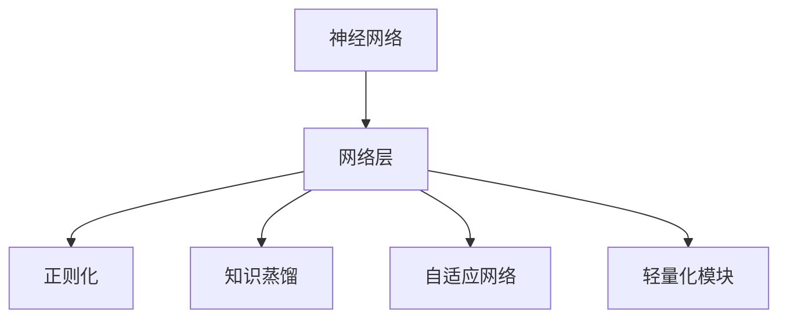

                 

## 1. 背景介绍

### 1.1 问题由来
神经网络（Neural Network）作为现代深度学习中的重要组成部分，已经被广泛应用于图像识别、自然语言处理、语音识别等诸多领域，并取得了显著的成果。然而，随着模型复杂度的增加和数据量的增长，神经网络的训练和推理成本也在不断提高，导致模型性能提升的边际收益递减。此外，过深的网络结构也导致模型的过拟合和泛化能力不足。针对这些问题，近年来关于神经网络架构优化的研究逐渐受到重视，成为深度学习领域的重要研究方向之一。

### 1.2 问题核心关键点
神经网络架构优化的核心在于通过合理设计网络结构，提高模型性能、降低训练和推理成本，同时增强模型的泛化能力和鲁棒性。具体来说，主要包括：

- 简化网络结构，去除冗余层和参数。
- 引入轻量化模块，提升模型效率。
- 引入自适应结构，动态调整网络复杂度。
- 引入知识蒸馏技术，提高模型泛化能力。
- 引入正则化技术，防止模型过拟合。

这些优化措施旨在实现网络结构的最小化、高效化和智能化，从而在保证模型性能的前提下，降低计算和存储成本，提高模型的稳定性和泛化能力。

### 1.3 问题研究意义
神经网络架构优化对于提升深度学习应用的效率和效果具有重要意义：

- 降低模型训练和推理成本。简化网络结构可以显著降低计算和存储需求，提高训练和推理的速度和效率。
- 增强模型泛化能力。引入正则化、知识蒸馏等技术，可以避免模型过拟合，提升模型在新数据上的表现。
- 提升模型稳定性和可靠性。轻量化模块和自适应结构能够使模型在多种场景下表现稳定，减少不必要的复杂度。
- 拓展模型应用范围。优化后的网络结构适用于更多应用场景，增强模型的通用性和适用性。

## 2. 核心概念与联系

### 2.1 核心概念概述

为更好地理解神经网络架构优化的核心概念，本节将介绍几个密切相关的核心概念：

- 神经网络（Neural Network）：由多层神经元构成的网络，通过学习大量数据，能够进行复杂的非线性映射，广泛应用于图像识别、自然语言处理等领域。
- 网络层（Layer）：神经网络的基本单位，通过不同参数和激活函数，实现数据的非线性映射。
- 正则化（Regularization）：通过加入惩罚项或Dropout等手段，避免模型过拟合，提高模型的泛化能力。
- 知识蒸馏（Knowledge Distillation）：将一个大型网络的先验知识转移到一个轻量级网络中，提高后者的泛化能力。
- 自适应网络（Adaptive Network）：通过动态调整网络结构，根据输入数据特征自动选择最优的网络复杂度，提升模型性能。
- 轻量化模块（Bottleneck）：通过减少网络层数和参数，引入特征图尺寸压缩和残差连接等方法，使模型更加轻量级。

这些核心概念之间的逻辑关系可以通过以下Mermaid流程图来展示：



这个流程图展示了几大核心概念之间的联系：

1. 神经网络通过多层网络层构成。
2. 正则化和知识蒸馏是优化网络层性能的重要手段。
3. 自适应网络通过动态调整复杂度，适应不同数据特征。
4. 轻量化模块通过压缩特征图，减小模型参数。

## 3. 核心算法原理 & 具体操作步骤
### 3.1 算法原理概述

神经网络架构优化通过合理设计网络结构，提高模型性能、降低训练和推理成本，同时增强模型的泛化能力和鲁棒性。其核心思想是：

- 简化网络结构，去除冗余层和参数。
- 引入轻量化模块，提升模型效率。
- 引入自适应结构，动态调整网络复杂度。
- 引入正则化技术，防止模型过拟合。
- 引入知识蒸馏技术，提高模型泛化能力。

这些优化措施旨在实现网络结构的最小化、高效化和智能化，从而在保证模型性能的前提下，降低计算和存储成本，提高模型的稳定性和泛化能力。

### 3.2 算法步骤详解

神经网络架构优化一般包括以下几个关键步骤：

**Step 1: 选择网络架构**  
- 根据任务需求，选择合适的网络架构，如卷积神经网络（CNN）、循环神经网络（RNN）、残差网络（ResNet）等。

**Step 2: 简化网络结构**  
- 通过剪枝、参数共享等方法，去除冗余层和参数，减小模型复杂度。
- 引入残差连接（Residual Connection）等技术，避免梯度消失问题。

**Step 3: 引入轻量化模块**  
- 引入Bottleneck模块，减少特征图尺寸，减小模型参数。
- 引入深度可分离卷积（Depthwise Separable Convolution），提高模型效率。

**Step 4: 引入自适应结构**  
- 引入动态网络结构（Dynamic Network），根据输入数据特征动态调整网络复杂度。
- 引入分组卷积（Group Convolution）等技术，提高模型效率和性能。

**Step 5: 引入正则化技术**  
- 使用L2正则化、Dropout等技术，防止模型过拟合。
- 使用数据增强、对抗训练等方法，提高模型鲁棒性。

**Step 6: 引入知识蒸馏技术**  
- 将大型网络的知识蒸馏到轻量级网络中，提高后者的泛化能力。
- 使用单样本蒸馏、多任务蒸馏等技术，提高知识转移效果。

以上是神经网络架构优化的主要步骤。在实际应用中，还需要针对具体任务和数据特点进行优化设计，如改进激活函数、设计更好的损失函数、搜索最优的超参数组合等，以进一步提升模型性能。

### 3.3 算法优缺点

神经网络架构优化的优点包括：

- 提升模型效率。通过简化网络结构和引入轻量化模块，显著降低计算和存储需求。
- 增强模型泛化能力。通过正则化和知识蒸馏等技术，提高模型在新数据上的表现。
- 提高模型稳定性和可靠性。自适应结构和残差连接等技术使模型在多种场景下表现稳定。
- 降低计算和存储成本。优化后的网络结构适用于更多应用场景，降低资源消耗。

同时，该方法也存在一定的局限性：

- 优化过程复杂。需要综合考虑多个因素，如网络结构、激活函数、损失函数等，优化过程较为繁琐。
- 可能需要超参数调整。网络结构优化需要根据具体任务和数据特点进行优化，可能需要进行多次实验和调整。
- 优化效果具有不确定性。不同的优化方法可能对不同数据集产生不同的效果，优化效果可能存在不确定性。

尽管存在这些局限性，但就目前而言，神经网络架构优化仍是深度学习应用的重要手段。未来相关研究的重点在于如何进一步简化网络结构、提升优化效果，同时兼顾模型性能和计算效率。

### 3.4 算法应用领域

神经网络架构优化在深度学习领域已经得到了广泛的应用，涵盖了一系列典型的应用场景，例如：

- 图像识别：如卷积神经网络（CNN）的应用，通过优化网络结构和参数，提高图像识别的准确率和速度。
- 自然语言处理（NLP）：如Transformer和BERT等模型，通过引入残差连接和自适应结构，提升NLP任务的表现。
- 语音识别：如递归神经网络（RNN）和长短期记忆网络（LSTM）等模型，通过优化网络结构和参数，提高语音识别的准确率和鲁棒性。
- 推荐系统：如深度学习推荐系统（DLSA），通过优化网络结构和参数，提高推荐系统的个性化和效率。
- 医疗诊断：如卷积神经网络（CNN）在医疗影像中的应用，通过优化网络结构和参数，提高医疗诊断的准确率和效率。

除了上述这些经典任务外，神经网络架构优化还被创新性地应用到更多场景中，如可控文本生成、常识推理、代码生成、数据增强等，为深度学习技术带来了全新的突破。随着神经网络架构优化方法的不断进步，相信深度学习技术将在更广阔的应用领域大放异彩。

## 4. 数学模型和公式 & 详细讲解  
### 4.1 数学模型构建

本节将使用数学语言对神经网络架构优化的数学模型进行更加严格的刻画。

记神经网络为 $M_{\theta}:\mathcal{X} \rightarrow \mathcal{Y}$，其中 $\mathcal{X}$ 为输入空间，$\mathcal{Y}$ 为输出空间，$\theta$ 为模型参数。假设训练集为 $D=\{(x_i,y_i)\}_{i=1}^N, x_i \in \mathcal{X}, y_i \in \mathcal{Y}$。

定义模型 $M_{\theta}$ 在数据样本 $(x,y)$ 上的损失函数为 $\ell(M_{\theta}(x),y)$，则在数据集 $D$ 上的经验风险为：

$$
\mathcal{L}(\theta) = \frac{1}{N}\sum_{i=1}^N \ell(M_{\theta}(x_i),y_i)
$$

神经网络架构优化的优化目标是最小化经验风险，即找到最优参数：

$$
\theta^* = \mathop{\arg\min}_{\theta} \mathcal{L}(\theta)
$$

在实践中，我们通常使用基于梯度的优化算法（如SGD、Adam等）来近似求解上述最优化问题。设 $\eta$ 为学习率，$\lambda$ 为正则化系数，则参数的更新公式为：

$$
\theta \leftarrow \theta - \eta \nabla_{\theta}\mathcal{L}(\theta) - \eta\lambda\theta
$$

其中 $\nabla_{\theta}\mathcal{L}(\theta)$ 为损失函数对参数 $\theta$ 的梯度，可通过反向传播算法高效计算。

### 4.2 公式推导过程

以下我们以卷积神经网络（CNN）为例，推导网络结构优化的损失函数及其梯度的计算公式。

假设卷积神经网络由多个卷积层和池化层构成，每个卷积层由多个卷积核和激活函数组成，最后一层为全连接层。模型在输入 $x$ 上的输出为 $M_{\theta}(x)$。

定义卷积层和全连接层的参数分别为 $\theta_{conv}$ 和 $\theta_{fc}$，则整个神经网络参数可以表示为：

$$
\theta = \theta_{conv} \cup \theta_{fc}
$$

定义损失函数为交叉熵损失函数，即：

$$
\ell(M_{\theta}(x),y) = -[y\log M_{\theta}(x)+(1-y)\log (1-M_{\theta}(x))]
$$

代入经验风险公式，得：

$$
\mathcal{L}(\theta) = -\frac{1}{N}\sum_{i=1}^N [y_i\log M_{\theta}(x_i)+(1-y_i)\log(1-M_{\theta}(x_i))]
$$

根据链式法则，损失函数对参数 $\theta$ 的梯度为：

$$
\frac{\partial \mathcal{L}(\theta)}{\partial \theta} = -\frac{1}{N}\sum_{i=1}^N \frac{\partial \ell(M_{\theta}(x_i),y_i)}{\partial \theta}
$$

将损失函数对参数 $\theta$ 的梯度进行展开，可以得到：

$$
\frac{\partial \mathcal{L}(\theta)}{\partial \theta} = -\frac{1}{N}\sum_{i=1}^N \frac{\partial \ell(M_{\theta}(x_i),y_i)}{\partial \theta_{conv}} - \frac{1}{N}\sum_{i=1}^N \frac{\partial \ell(M_{\theta}(x_i),y_i)}{\partial \theta_{fc}}
$$

其中 $\frac{\partial \ell(M_{\theta}(x_i),y_i)}{\partial \theta_{conv}}$ 和 $\frac{\partial \ell(M_{\theta}(x_i),y_i)}{\partial \theta_{fc}}$ 分别表示损失函数对卷积层和全连接层的梯度，可以通过反向传播算法计算。

通过上述公式，我们可以得到损失函数对整个神经网络参数的梯度，进而使用梯度下降等优化算法更新模型参数，最小化损失函数。

## 5. 项目实践：代码实例和详细解释说明
### 5.1 开发环境搭建

在进行神经网络架构优化实践前，我们需要准备好开发环境。以下是使用Python进行TensorFlow开发的环境配置流程：

1. 安装Anaconda：从官网下载并安装Anaconda，用于创建独立的Python环境。

2. 创建并激活虚拟环境：
```bash
conda create -n tf-env python=3.8 
conda activate tf-env
```

3. 安装TensorFlow：根据GPU版本，从官网获取对应的安装命令。例如：
```bash
pip install tensorflow==2.4
```

4. 安装Keras：
```bash
pip install keras
```

5. 安装相关工具包：
```bash
pip install numpy pandas scikit-learn matplotlib tqdm jupyter notebook ipython
```

完成上述步骤后，即可在`tf-env`环境中开始神经网络架构优化实践。

### 5.2 源代码详细实现

下面我以卷积神经网络（CNN）为例，给出使用TensorFlow进行网络结构优化的Python代码实现。

首先，定义CNN模型：

```python
import tensorflow as tf
from tensorflow.keras import layers, models

def build_cnn_model(input_shape):
    model = models.Sequential()
    model.add(layers.Conv2D(32, (3, 3), activation='relu', input_shape=input_shape))
    model.add(layers.MaxPooling2D((2, 2)))
    model.add(layers.Conv2D(64, (3, 3), activation='relu'))
    model.add(layers.MaxPooling2D((2, 2)))
    model.add(layers.Conv2D(128, (3, 3), activation='relu'))
    model.add(layers.MaxPooling2D((2, 2)))
    model.add(layers.Flatten())
    model.add(layers.Dense(128, activation='relu'))
    model.add(layers.Dense(10, activation='softmax'))
    
    return model
```

然后，定义训练和评估函数：

```python
from tensorflow.keras import optimizers

def train_model(model, train_data, epochs, batch_size):
    model.compile(optimizer=optimizers.Adam(0.001), loss='sparse_categorical_crossentropy', metrics=['accuracy'])
    model.fit(train_data, epochs=epochs, batch_size=batch_size, validation_split=0.2)
    
def evaluate_model(model, test_data):
    loss, accuracy = model.evaluate(test_data)
    print(f'Test accuracy: {accuracy}')
```

最后，启动训练流程并在测试集上评估：

```python
input_shape = (28, 28, 1)
train_data = # 准备训练集数据
test_data = # 准备测试集数据

model = build_cnn_model(input_shape)
train_model(model, train_data, epochs=10, batch_size=32)
evaluate_model(model, test_data)
```

以上就是使用TensorFlow对CNN进行网络结构优化的完整代码实现。可以看到，TensorFlow提供了高度封装的网络构建和训练接口，大大简化了神经网络架构优化的代码实现。

### 5.3 代码解读与分析

让我们再详细解读一下关键代码的实现细节：

**build_cnn_model函数**：
- 定义一个Sequential模型，按照卷积-池化-全连接层的顺序构建CNN。
- 每一层的参数和激活函数根据实际需求设置，如32个3x3卷积核、ReLU激活函数等。
- 最后一层全连接层输出10个节点，用于分类任务。

**train_model函数**：
- 编译模型，设置Adam优化器和交叉熵损失函数。
- 使用fit方法进行训练，设置训练轮数和批次大小。
- 使用validation_split参数保留20%的验证集数据，用于实时评估模型性能。

**evaluate_model函数**：
- 使用evaluate方法在测试集上评估模型性能。
- 打印测试集上的准确率。

**训练流程**：
- 定义输入形状为28x28x1的MNIST数据集，准备训练集和测试集。
- 调用build_cnn_model函数构建CNN模型。
- 调用train_model函数进行训练，设置10个训练轮数和批次大小为32。
- 调用evaluate_model函数在测试集上评估模型性能。

可以看到，TensorFlow提供了简洁高效的接口，使得神经网络架构优化的代码实现变得简单快捷。开发者可以专注于模型设计和优化策略，而不必过多关注底层的实现细节。

当然，工业级的系统实现还需考虑更多因素，如模型的保存和部署、超参数的自动搜索、更灵活的任务适配层等。但核心的架构优化范式基本与此类似。

## 6. 实际应用场景
### 6.1 图像识别

卷积神经网络（CNN）在图像识别领域已经取得了显著的成果。通过优化网络结构和参数，可以进一步提升图像识别的准确率和速度。例如，Google Inception模块通过引入多个不同尺寸的卷积核，提升了特征提取能力，提高了图像识别的准确率。

在实践中，可以针对具体的图像识别任务，设计不同的CNN架构。例如，针对手写数字识别任务，可以选择LeNet、AlexNet等经典网络；针对物体检测任务，可以选择Faster R-CNN、YOLO等网络。通过优化网络结构，减少不必要的网络层和参数，提高计算效率。

### 6.2 自然语言处理（NLP）

Transformer和BERT等模型在NLP领域表现优异，但模型参数量较大，训练和推理成本较高。通过引入自适应结构和轻量化模块，可以显著提高模型的效率和性能。

在实践中，可以针对具体的NLP任务，设计不同的Transformer架构。例如，针对机器翻译任务，可以选择Encoder-Decoder结构，引入注意力机制和自适应结构，提升模型性能。针对文本分类任务，可以选择BERT模型，通过剪枝和参数共享等技术，提高模型效率。

### 6.3 语音识别

递归神经网络（RNN）和长短期记忆网络（LSTM）在语音识别领域表现优异，但模型参数量较大，计算和存储成本较高。通过优化网络结构和参数，可以进一步提升语音识别的准确率和效率。

在实践中，可以针对具体的语音识别任务，设计不同的RNN架构。例如，针对语音识别任务，可以选择RNN或LSTM模型，通过剪枝和参数共享等技术，减少模型参数，提高计算效率。针对说话人识别任务，可以选择Siamese Network等网络，引入多个语音特征提取模块，提高模型鲁棒性。

### 6.4 未来应用展望

随着神经网络架构优化技术的发展，未来在更多领域将迎来新的突破：

- 智能推荐系统：通过优化网络结构和参数，提升推荐系统的个性化和效率。例如，通过引入自适应结构，动态调整网络复杂度，提高推荐效果。
- 医疗影像分析：通过优化卷积神经网络（CNN）结构，提高医疗影像的诊断准确率。例如，通过引入残差连接和参数共享等技术，提高模型鲁棒性。
- 自动驾驶：通过优化卷积神经网络（CNN）和递归神经网络（RNN）结构，提高自动驾驶系统的感知和决策能力。例如，通过引入轻量化模块和自适应结构，提升计算效率。
- 金融预测：通过优化神经网络结构和参数，提高金融预测的准确率和鲁棒性。例如，通过引入正则化和知识蒸馏等技术，提高模型泛化能力。

神经网络架构优化技术将在更多领域得到应用，为深度学习技术带来新的突破和创新。未来，伴随网络结构优化和参数高效技术的不断进步，相信深度学习技术将在更广阔的应用领域大放异彩。

## 7. 工具和资源推荐
### 7.1 学习资源推荐

为了帮助开发者系统掌握神经网络架构优化的理论基础和实践技巧，这里推荐一些优质的学习资源：

1. 《深度学习》（Ian Goodfellow等）：深度学习的经典教材，全面介绍了神经网络架构优化的基本概念和算法。
2. 《TensorFlow 2.0实战》（Edward Yang等）：TensorFlow的实战指南，详细介绍了如何使用TensorFlow进行神经网络架构优化。
3. 《PyTorch深度学习教程》：PyTorch的官方教程，提供了丰富的神经网络架构优化样例代码。
4. 《神经网络与深度学习》（Michael Nielsen）：神经网络基础课程，讲解了神经网络架构优化的核心原理和应用案例。
5. 《深度学习框架实战》（Jerry Zhang等）：深度学习框架实战指南，介绍了TensorFlow和PyTorch等框架的神经网络架构优化技巧。

通过对这些资源的学习实践，相信你一定能够快速掌握神经网络架构优化的精髓，并用于解决实际的深度学习问题。
###  7.2 开发工具推荐

高效的开发离不开优秀的工具支持。以下是几款用于神经网络架构优化开发的常用工具：

1. TensorFlow：由Google主导开发的开源深度学习框架，生产部署方便，适合大规模工程应用。提供了丰富的神经网络架构优化接口。
2. PyTorch：基于Python的开源深度学习框架，灵活动态的计算图，适合快速迭代研究。提供了高度封装的网络构建和训练接口。
3. Keras：基于TensorFlow和Theano等后端的高层次神经网络库，提供了简洁高效的接口，适合快速原型开发。
4. Weights & Biases：模型训练的实验跟踪工具，可以记录和可视化模型训练过程中的各项指标，方便对比和调优。与主流深度学习框架无缝集成。
5. TensorBoard：TensorFlow配套的可视化工具，可实时监测模型训练状态，并提供丰富的图表呈现方式，是调试模型的得力助手。

合理利用这些工具，可以显著提升神经网络架构优化的开发效率，加快创新迭代的步伐。

### 7.3 相关论文推荐

神经网络架构优化的研究源于学界的持续研究。以下是几篇奠基性的相关论文，推荐阅读：

1. 《ImageNet Classification with Deep Convolutional Neural Networks》（AlexNet论文）：提出了经典的卷积神经网络（CNN）架构，用于大规模图像识别任务。
2. 《Inception-Net Architecture for Computer Vision》（Inception模块）：引入了多个不同尺寸的卷积核，提升了特征提取能力，提高了图像识别的准确率。
3. 《Convolutional Deep Belief Networks for Scalable Unsupervised Learning of Hierarchical Representations》（Alex Krizhevsky等）：提出卷积深度信念网络（CDBN），用于大规模图像分类和目标检测。
4. 《Faster R-CNN: Towards Real-Time Object Detection with Region Proposal Networks》（Faster R-CNN论文）：引入了区域提案网络（RPN），提高了物体检测的速度和准确率。
5. 《Knowledge Distillation》（Pascal Févotte等）：提出了知识蒸馏技术，将大型网络的先验知识转移到一个轻量级网络中，提高后者的泛化能力。
6. 《Adaptive Computation Time for Neural Machine Translation》（AdaCT论文）：提出了自适应计算时间（AdaCT）技术，根据输入数据动态调整计算时间，提高模型效率。

这些论文代表了大规模网络架构优化的发展脉络。通过学习这些前沿成果，可以帮助研究者把握学科前进方向，激发更多的创新灵感。

## 8. 总结：未来发展趋势与挑战

### 8.1 总结

本文对神经网络架构优化的核心概念和优化方法进行了全面系统的介绍。首先阐述了神经网络架构优化的研究背景和意义，明确了优化在提升深度学习应用的效率和效果方面的重要作用。其次，从原理到实践，详细讲解了神经网络架构优化的数学模型和关键步骤，给出了神经网络架构优化的完整代码实现。同时，本文还广泛探讨了神经网络架构优化在图像识别、自然语言处理、语音识别等多个领域的应用前景，展示了优化范式的巨大潜力。此外，本文精选了神经网络架构优化的各类学习资源，力求为读者提供全方位的技术指引。

通过本文的系统梳理，可以看到，神经网络架构优化技术正在成为深度学习应用的重要手段，极大地拓展了神经网络的应用边界，催生了更多的落地场景。受益于神经网络架构优化的不断演进，深度学习技术将在更广阔的应用领域大放异彩，为人工智能技术的发展注入新的活力。

### 8.2 未来发展趋势

展望未来，神经网络架构优化技术将呈现以下几个发展趋势：

- 网络结构更加多样。未来将出现更多新型神经网络架构，如自适应网络、轻量化网络等，适应更多复杂多变的任务需求。
- 计算效率进一步提升。通过优化计算图和网络结构，提升神经网络的计算效率，实现更高的实时性和可扩展性。
- 模型泛化能力增强。通过知识蒸馏和自适应结构等技术，提高神经网络的泛化能力，适应更多领域和数据分布。
- 更多应用场景拓展。未来神经网络架构优化技术将在更多领域得到应用，如智能推荐系统、医疗影像分析、自动驾驶等，提升相关系统的性能和效率。
- 参数高效优化成为焦点。随着模型规模的不断增大，参数高效优化方法将成为神经网络架构优化的重要方向。

以上趋势凸显了神经网络架构优化的广阔前景。这些方向的探索发展，必将进一步提升深度学习应用的效率和效果，推动深度学习技术在更多领域的应用落地。

### 8.3 面临的挑战

尽管神经网络架构优化技术已经取得了显著的成果，但在迈向更加智能化、普适化应用的过程中，它仍面临诸多挑战：

- 优化过程复杂。需要综合考虑多个因素，如网络结构、激活函数、损失函数等，优化过程较为繁琐。
- 超参数调整难度大。网络结构优化需要根据具体任务和数据特点进行优化，可能需要进行多次实验和调整。
- 优化效果具有不确定性。不同的优化方法可能对不同数据集产生不同的效果，优化效果可能存在不确定性。
- 计算资源消耗大。优化后的网络结构虽然参数减少，但可能仍需要较大的计算和存储资源，提高计算效率仍需进一步研究。
- 模型鲁棒性不足。优化后的神经网络在面对噪声和异常数据时，可能表现不稳定，影响系统的鲁棒性。

正视神经网络架构优化所面临的这些挑战，积极应对并寻求突破，将使优化技术更加完善，提升神经网络的性能和效率。相信随着学界和产业界的共同努力，这些挑战终将一一被克服，神经网络架构优化技术必将为深度学习技术的发展提供更强大的支持。

### 8.4 研究展望

未来神经网络架构优化的研究需要在以下几个方面寻求新的突破：

- 探索无监督和半监督优化方法。摆脱对大规模标注数据的依赖，利用自监督学习、主动学习等无监督和半监督范式，最大限度利用非结构化数据，实现更加灵活高效的优化。
- 研究参数高效和计算高效的优化范式。开发更加参数高效的优化方法，在固定大部分预训练参数的情况下，只更新极少量的任务相关参数。同时优化计算图，减少前向传播和反向传播的资源消耗，实现更加轻量级、实时性的部署。
- 引入因果推断和对比学习思想。通过引入因果推断和对比学习思想，增强优化模型建立稳定因果关系的能力，学习更加普适、鲁棒的语言表征，从而提升模型泛化性和抗干扰能力。
- 结合符号化和深度学习的优势。将符号化的先验知识，如知识图谱、逻辑规则等，与神经网络模型进行巧妙融合，引导优化过程学习更准确、合理的语言模型。同时加强不同模态数据的整合，实现视觉、语音等多模态信息与文本信息的协同建模。

这些研究方向的探索，必将引领神经网络架构优化技术迈向更高的台阶，为深度学习技术的发展提供更强大的动力。面向未来，神经网络架构优化技术还需要与其他人工智能技术进行更深入的融合，如知识表示、因果推理、强化学习等，多路径协同发力，共同推动深度学习技术的发展。

## 9. 附录：常见问题与解答

**Q1：神经网络架构优化是否适用于所有深度学习任务？**

A: 神经网络架构优化在大多数深度学习任务上都能取得不错的效果，特别是对于数据量较小的任务。但对于一些特定领域的任务，如医学、法律等，仅仅依靠通用语料预训练的模型可能难以很好地适应。此时需要在特定领域语料上进一步预训练，再进行优化，才能获得理想效果。此外，对于一些需要时效性、个性化很强的任务，如对话、推荐等，优化方法也需要针对性的改进优化。

**Q2：神经网络架构优化的关键点有哪些？**

A: 神经网络架构优化的关键点包括：
- 选择合适的网络架构，如卷积神经网络（CNN）、循环神经网络（RNN）、残差网络（ResNet）等。
- 简化网络结构，去除冗余层和参数，减小模型复杂度。
- 引入轻量化模块，如Bottleneck模块，减少特征图尺寸，减小模型参数。
- 引入自适应结构，如动态网络结构，根据输入数据特征动态调整网络复杂度。
- 引入正则化技术，如L2正则化、Dropout等，防止模型过拟合。
- 引入知识蒸馏技术，如单样本蒸馏、多任务蒸馏，提高模型泛化能力。

这些优化措施旨在实现网络结构的最小化、高效化和智能化，从而在保证模型性能的前提下，降低计算和存储成本，提高模型的稳定性和泛化能力。

**Q3：如何选择合适的神经网络架构？**

A: 选择合适的神经网络架构需要根据具体任务和数据特点进行考虑：
- 图像识别任务：可以选择卷积神经网络（CNN），如LeNet、AlexNet、VGGNet等。
- 自然语言处理（NLP）任务：可以选择Transformer、BERT等模型，引入残差连接和自适应结构，提升模型性能。
- 语音识别任务：可以选择递归神经网络（RNN）或长短期记忆网络（LSTM），通过剪枝和参数共享等技术，减少模型参数，提高计算效率。
- 推荐系统任务：可以选择深度学习推荐系统（DLSA），通过优化网络结构和参数，提升推荐系统的个性化和效率。

在实际应用中，还需要根据任务需求进行进一步优化和调整。

**Q4：神经网络架构优化的参数优化方法有哪些？**

A: 神经网络架构优化的参数优化方法包括：
- 梯度下降法：使用反向传播算法计算损失函数对参数的梯度，使用梯度下降法更新模型参数。
- Adam优化器：结合动量梯度和自适应学习率，提高模型收敛速度和精度。
- RMSprop优化器：自适应调整学习率，提高模型训练稳定性。
- Adagrad优化器：自适应调整每个参数的学习率，适用于稀疏数据和非平稳目标函数。

这些优化器可以结合不同的损失函数和正则化技术，提升模型训练的稳定性和收敛速度。

**Q5：神经网络架构优化的实际应用场景有哪些？**

A: 神经网络架构优化在深度学习领域已经得到了广泛的应用，涵盖了一系列典型的应用场景，例如：
- 图像识别：如卷积神经网络（CNN）的应用，通过优化网络结构和参数，提高图像识别的准确率和速度。
- 自然语言处理（NLP）：如Transformer和BERT等模型，通过引入残差连接和自适应结构，提升NLP任务的表现。
- 语音识别：如递归神经网络（RNN）和长短期记忆网络（LSTM）等模型，通过优化网络结构和参数，提高语音识别的准确率和鲁棒性。
- 推荐系统：如深度学习推荐系统（DLSA），通过优化网络结构和参数，提升推荐系统的个性化和效率。
- 医疗影像分析：通过优化卷积神经网络（CNN）结构，提高医疗影像的诊断准确率。
- 自动驾驶：通过优化卷积神经网络（CNN）和递归神经网络（RNN）结构，提高自动驾驶系统的感知和决策能力。

这些应用场景展示了神经网络架构优化技术的广泛应用前景，未来将在更多领域得到应用，为深度学习技术的发展注入新的活力。

---

作者：禅与计算机程序设计艺术 / Zen and the Art of Computer Programming

