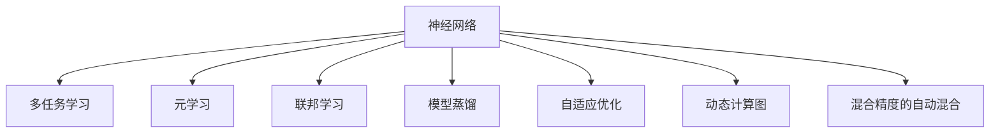

                 

# 神经网络模型的灵活可扩展性

在人工智能的海洋中，神经网络（Neural Networks）是最璀璨的一颗明珠。它以其强大的学习能力和泛化性能，成为构建各种复杂系统的重要基石。但神经网络并非没有局限，其最大的挑战之一就是模型的灵活性和可扩展性。如何构建既灵活又可扩展的神经网络，成为许多研究和应用中的核心议题。本文将从核心概念、算法原理、实际应用等方面，深入探讨神经网络模型的灵活可扩展性，希望能为读者提供有益的见解。

## 1. 背景介绍

### 1.1 问题由来
随着深度学习技术的发展，神经网络在计算机视觉、自然语言处理、语音识别等诸多领域取得了显著的进展。然而，由于模型规模的不断膨胀，神经网络在实际部署时面临了诸多挑战。例如，模型的参数量不断增大，训练和推理的计算成本显著提高；模型的复杂度增加，导致对硬件资源的需求也随之提升；模型的泛化能力有限，难以应对未见过的数据。

为了解决这些挑战，研究者们提出了一系列提升模型灵活性和可扩展性的方法，如多任务学习、元学习、联邦学习等。这些方法不仅能在保持模型性能的同时，大幅降低对硬件资源的依赖，还能提升模型对新数据的泛化能力。

### 1.2 问题核心关键点
在讨论神经网络模型的灵活可扩展性时，我们主要关注以下几个核心问题：
- 如何构建既灵活又高效的神经网络模型？
- 如何在保持模型性能的同时，降低计算成本和资源消耗？
- 如何提升神经网络模型的泛化能力，更好地应对未见过的数据？

本文将围绕这些关键问题，探讨神经网络模型的灵活可扩展性。

## 2. 核心概念与联系

### 2.1 核心概念概述

为更好地理解神经网络模型的灵活可扩展性，本节将介绍几个密切相关的核心概念：

- 神经网络（Neural Network, NN）：由大量神经元（节点）通过有向边（连接）构成的非线性网络。每个神经元接收输入信号，通过激活函数处理后，产生输出信号，再传递给下一层神经元。
- 多任务学习（Multi-task Learning, MTL）：在同一模型上同时训练多个相关任务，共享网络参数和损失函数，提升模型的泛化能力和利用率。
- 元学习（Meta-learning）：通过学习如何快速适应新任务，提升模型的迁移学习能力和泛化性能。
- 联邦学习（Federated Learning, FL）：分布式训练，参与方仅分享模型参数更新而非原始数据，保护数据隐私的同时，提升模型的泛化能力。
- 模型蒸馏（Model Distillation）：通过训练一个压缩版的模型（蒸馏模型），继承大模型的知识，降低计算成本，同时保持高性能。
- 自适应优化（Adaptive Optimization）：根据训练数据和网络结构，动态调整学习率、正则化参数等超参数，提升模型的收敛速度和泛化性能。
- 动态计算图（Dynamic Computation Graph）：在运行时动态生成计算图，支持不同规模和结构的神经网络模型，提升灵活性。
- 混合精度的自动混合（Automatic Mixed Precision, AMP）：将模型参数和计算分别使用不同的精度（如32位和16位），在保证精度的情况下，显著提高计算效率。

这些核心概念之间的逻辑关系可以通过以下Mermaid流程图来展示：



这个流程图展示了一些核心概念的相互关系：

1. 神经网络是所有模型的基础。
2. 多任务学习、元学习和联邦学习是提升模型泛化能力的三个重要方向。
3. 模型蒸馏和自适应优化是提升模型性能和灵活性的重要手段。
4. 动态计算图和混合精度的自动混合是提升模型灵活性和效率的关键技术。

这些概念共同构成了神经网络模型的灵活可扩展性的技术框架，使其能够在各种场景下发挥强大的学习能力和泛化能力。通过理解这些核心概念，我们可以更好地把握神经网络模型的本质和优化方向。

## 3. 核心算法原理 & 具体操作步骤
### 3.1 算法原理概述

神经网络模型的灵活可扩展性主要体现在以下几个方面：模型结构、参数共享、迁移学习等。

- 模型结构：通过引入卷积神经网络（CNN）、循环神经网络（RNN）、注意力机制等结构，提升模型的表达能力和泛化性能。
- 参数共享：通过多任务学习、元学习等方法，共享网络参数，提升模型的泛化能力和利用率。
- 迁移学习：通过在大规模数据集上预训练模型，在小规模任务上微调模型，提升模型的迁移能力和泛化性能。

基于这些原理，神经网络模型的灵活可扩展性可以通过以下步骤实现：

**Step 1: 设计模型结构**
- 选择合适的神经网络架构，如卷积神经网络（CNN）、循环神经网络（RNN）、注意力机制等。
- 设计网络层的连接方式，如全连接层、卷积层、池化层、循环层等。
- 引入正则化技术，如Dropout、L2正则等，避免过拟合。

**Step 2: 参数共享与复用**
- 使用多任务学习，在同一模型上训练多个相关任务，共享网络参数。
- 使用元学习，通过学习如何快速适应新任务，提升模型的泛化能力。
- 使用联邦学习，分布式训练，保护数据隐私的同时，提升模型的泛化能力。

**Step 3: 迁移学习与微调**
- 在大规模数据集上预训练模型，学习通用特征。
- 在目标任务上微调模型，通过少量标注数据，提升模型在特定任务上的性能。

**Step 4: 模型压缩与蒸馏**
- 使用模型蒸馏，通过训练一个压缩版的模型，继承大模型的知识，降低计算成本，同时保持高性能。
- 使用自适应优化，根据训练数据和网络结构，动态调整学习率、正则化参数等超参数，提升模型的收敛速度和泛化性能。
- 使用动态计算图和混合精度的自动混合，提升模型的灵活性和效率。

### 3.2 算法步骤详解

以卷积神经网络（CNN）为例，介绍神经网络模型的灵活可扩展性的具体操作步骤：

**Step 1: 设计CNN模型**
- 选择适当的卷积层、池化层、全连接层等网络层，构建CNN模型。
- 定义卷积核的大小、步幅、填充等参数，设计卷积操作。
- 定义池化操作的方式，如最大池化、平均池化等。
- 设计激活函数，如ReLU、Sigmoid等，用于增加非线性表达能力。

**Step 2: 参数共享与复用**
- 使用多任务学习，在同一模型上训练多个相关任务，共享卷积核、池化操作等参数。
- 使用元学习，通过学习如何快速适应新任务，提升模型的泛化能力。
- 使用联邦学习，分布式训练，保护数据隐私的同时，提升模型的泛化能力。

**Step 3: 迁移学习与微调**
- 在大规模数据集上预训练CNN模型，学习通用特征。
- 在目标任务上微调模型，通过少量标注数据，提升模型在特定任务上的性能。

**Step 4: 模型压缩与蒸馏**
- 使用模型蒸馏，通过训练一个压缩版的模型（蒸馏模型），继承大模型的知识，降低计算成本，同时保持高性能。
- 使用自适应优化，根据训练数据和网络结构，动态调整学习率、正则化参数等超参数，提升模型的收敛速度和泛化性能。
- 使用动态计算图和混合精度的自动混合，提升模型的灵活性和效率。

### 3.3 算法优缺点

神经网络模型的灵活可扩展性具有以下优点：
1. 提升模型的泛化能力。通过多任务学习、元学习和联邦学习，提升模型对新任务的适应能力，避免过拟合。
2. 降低计算成本。通过模型蒸馏和自适应优化，降低模型计算资源的需求，提升训练和推理效率。
3. 提高模型灵活性。通过动态计算图和混合精度的自动混合，提升模型的灵活性和效率。

同时，该方法也存在一定的局限性：
1. 对数据质量要求高。模型蒸馏和自适应优化等方法需要大量高质量数据支持，否则效果有限。
2. 参数共享可能导致模型泛化性能下降。多任务学习等方法需要合理设计参数共享策略，避免泛化性能下降。
3. 模型蒸馏可能导致精度损失。蒸馏模型在保持高性能的同时，可能会引入一定精度损失。

尽管存在这些局限性，但就目前而言，神经网络模型的灵活可扩展性仍是提升模型性能和效率的重要手段。未来相关研究的重点在于如何进一步优化参数共享策略，降低对数据的需求，同时保证模型的泛化性能。

### 3.4 算法应用领域

神经网络模型的灵活可扩展性在众多领域得到了广泛应用，涵盖了计算机视觉、自然语言处理、语音识别、推荐系统等多个方向。

- 计算机视觉：通过卷积神经网络（CNN）、注意力机制等结构，实现图像分类、物体检测、图像分割等任务。
- 自然语言处理：通过循环神经网络（RNN）、注意力机制等结构，实现文本分类、情感分析、机器翻译等任务。
- 语音识别：通过卷积神经网络（CNN）、循环神经网络（RNN）等结构，实现语音识别、情感分析等任务。
- 推荐系统：通过模型蒸馏和自适应优化，提升推荐模型的灵活性和效率，实现个性化推荐。

除了这些主流应用外，神经网络模型的灵活可扩展性还将在更多领域得到创新应用，如医疗影像分析、金融风险预测、智能交通管理等，为各行业带来深远的影响。

## 4. 数学模型和公式 & 详细讲解
### 4.1 数学模型构建

神经网络模型的灵活可扩展性可以通过以下数学模型进行描述：

- 定义输入样本 $x \in \mathbb{R}^n$，目标输出 $y \in \mathbb{R}^m$，其中 $n$ 和 $m$ 分别为输入和输出的维度。
- 定义神经网络模型 $f$，由多个神经元 $h_1, h_2, ..., h_L$ 组成，每个神经元接收输入 $x_i$，通过激活函数 $\sigma$ 处理后，产生输出 $h_i$。
- 定义损失函数 $L(y, \hat{y})$，用于衡量模型输出与真实标签之间的差异。

神经网络模型的优化目标是找到最优的权重参数 $w$，使得损失函数 $L(y, \hat{y})$ 最小化：

$$
\hat{w} = \mathop{\arg\min}_{w} L(y, f_w(x))
$$

其中 $f_w(x)$ 表示在权重 $w$ 下，神经网络模型对输入 $x$ 的输出。

### 4.2 公式推导过程

以卷积神经网络（CNN）为例，推导CNN模型的数学公式：

- 卷积层：定义卷积核 $w$，通过卷积操作 $c$ 处理输入 $x$，得到输出 $h$：

$$
c(x) = \sum_k w_k \ast x_k
$$

- 池化层：定义池化操作 $p$，通过最大池化、平均池化等方式处理卷积层的输出 $h$，得到下一层的输入 $h'$：

$$
h' = p(h)
$$

- 全连接层：定义权重矩阵 $W$，通过全连接操作 $fc$ 处理池化层的输出 $h'$，得到最终输出 $\hat{y}$：

$$
\hat{y} = fc(h')
$$

- 损失函数：定义交叉熵损失函数 $L$，用于衡量模型输出与真实标签之间的差异：

$$
L(y, \hat{y}) = -\frac{1}{N} \sum_{i=1}^N \sum_{j=1}^m y_i^j \log \hat{y}_i^j
$$

其中 $y_i^j$ 表示第 $i$ 个样本的第 $j$ 个输出标签，$\hat{y}_i^j$ 表示模型预测的第 $i$ 个样本的第 $j$ 个输出。

在得到损失函数的梯度后，即可带入参数更新公式，完成模型的迭代优化。重复上述过程直至收敛，最终得到适应目标任务的最优模型参数 $\hat{w}$。

## 5. 项目实践：代码实例和详细解释说明
### 5.1 开发环境搭建

在进行神经网络模型实践前，我们需要准备好开发环境。以下是使用Python进行TensorFlow开发的环境配置流程：

1. 安装Anaconda：从官网下载并安装Anaconda，用于创建独立的Python环境。

2. 创建并激活虚拟环境：
```bash
conda create -n tf-env python=3.8 
conda activate tf-env
```

3. 安装TensorFlow：根据CUDA版本，从官网获取对应的安装命令。例如：
```bash
pip install tensorflow
```

4. 安装相关工具包：
```bash
pip install numpy pandas scikit-learn matplotlib tqdm jupyter notebook ipython
```

完成上述步骤后，即可在`tf-env`环境中开始神经网络模型的实践。

### 5.2 源代码详细实现

这里我们以卷积神经网络（CNN）为例，给出使用TensorFlow实现CNN的代码实现。

首先，定义CNN模型的超参数：

```python
import tensorflow as tf
from tensorflow.keras import layers, models

# 定义超参数
batch_size = 32
epochs = 20
learning_rate = 0.001
```

接着，构建CNN模型：

```python
# 定义模型
model = models.Sequential()

# 添加卷积层
model.add(layers.Conv2D(32, (3, 3), activation='relu', input_shape=(28, 28, 1)))
model.add(layers.MaxPooling2D((2, 2)))
model.add(layers.Conv2D(64, (3, 3), activation='relu'))
model.add(layers.MaxPooling2D((2, 2)))
model.add(layers.Conv2D(64, (3, 3), activation='relu'))

# 添加全连接层
model.add(layers.Flatten())
model.add(layers.Dense(64, activation='relu'))
model.add(layers.Dense(10, activation='softmax'))
```

然后，编译模型并训练：

```python
# 编译模型
model.compile(optimizer=tf.keras.optimizers.Adam(learning_rate=learning_rate),
              loss=tf.keras.losses.SparseCategoricalCrossentropy(from_logits=True),
              metrics=['accuracy'])

# 训练模型
model.fit(train_images, train_labels, epochs=epochs, batch_size=batch_size,
          validation_data=(test_images, test_labels))
```

最后，评估模型：

```python
# 评估模型
test_loss, test_acc = model.evaluate(test_images, test_labels, verbose=2)
print('\nTest accuracy:', test_acc)
```

以上就是使用TensorFlow实现卷积神经网络（CNN）的完整代码实现。可以看到，TensorFlow提供了强大的API，使得神经网络模型的构建和训练变得非常简单。

### 5.3 代码解读与分析

让我们再详细解读一下关键代码的实现细节：

**超参数定义**：
- `batch_size`：指定每次训练的样本数量。
- `epochs`：指定训练的轮数。
- `learning_rate`：指定学习率。

**模型构建**：
- `Sequential`模型：使用`Sequential`模型，表示顺序执行的神经网络结构。
- `Conv2D`层：定义卷积层，使用`Conv2D`层进行卷积操作。
- `MaxPooling2D`层：定义池化层，使用`MaxPooling2D`层进行最大池化操作。
- `Dense`层：定义全连接层，使用`Dense`层进行全连接操作。
- `Flatten`层：定义扁平化层，将卷积层和全连接层的输出扁平化。

**模型编译**：
- `Adam`优化器：使用`Adam`优化器进行模型训练。
- `SparseCategoricalCrossentropy`损失函数：使用`SparseCategoricalCrossentropy`损失函数进行模型评估。
- `accuracy`指标：使用`accuracy`指标进行模型评估。

**模型训练**：
- `fit`函数：使用`fit`函数进行模型训练，指定训练集、验证集和批次大小。

**模型评估**：
- `evaluate`函数：使用`evaluate`函数进行模型评估，指定测试集和批次大小。

可以看到，TensorFlow提供的API使得神经网络模型的构建和训练变得非常简单，开发者可以更专注于模型的设计和优化。

当然，工业级的系统实现还需考虑更多因素，如模型的保存和部署、超参数的自动搜索、更灵活的任务适配层等。但核心的模型构建和训练过程与上述示例类似。

## 6. 实际应用场景
### 6.1 计算机视觉

卷积神经网络（CNN）在计算机视觉领域的应用非常广泛，可以实现图像分类、物体检测、图像分割等任务。例如，在图像分类任务中，可以使用CNN模型对输入的图像进行分类，输出预测结果。在物体检测任务中，可以使用CNN模型检测图像中的物体位置，输出物体类别和坐标信息。

在实际应用中，可以通过大规模标注数据对CNN模型进行预训练，然后针对特定的计算机视觉任务进行微调，提升模型性能。例如，在医学影像分析中，可以使用大规模的医学影像数据进行预训练，然后在具体的医学影像分类任务上进行微调，提升模型的泛化能力和诊断准确率。

### 6.2 自然语言处理

循环神经网络（RNN）和注意力机制在自然语言处理（NLP）领域也有广泛应用，可以实现文本分类、情感分析、机器翻译等任务。例如，在文本分类任务中，可以使用RNN模型对输入的文本进行分类，输出预测结果。在情感分析任务中，可以使用RNN模型对输入的文本进行情感判断，输出情感极性。

在实际应用中，可以通过大规模无标签文本数据对RNN模型进行预训练，然后针对特定的NLP任务进行微调，提升模型性能。例如，在机器翻译任务中，可以使用大规模的双语文本数据进行预训练，然后在具体的机器翻译任务上进行微调，提升模型的翻译质量和泛化能力。

### 6.3 推荐系统

推荐系统需要根据用户的历史行为和兴趣，推荐合适的商品或内容。卷积神经网络（CNN）和注意力机制在推荐系统中也有广泛应用，可以实现个性化推荐。例如，在商品推荐任务中，可以使用CNN模型对用户的浏览和购买历史进行建模，然后根据模型预测用户可能感兴趣的商品，推荐给用户。

在实际应用中，可以通过大规模的用户行为数据对CNN模型进行预训练，然后针对特定的推荐任务进行微调，提升模型性能。例如，在视频推荐任务中，可以使用大规模的视频观看历史数据进行预训练，然后在具体的推荐任务上进行微调，提升模型的推荐效果和用户体验。

### 6.4 未来应用展望

随着神经网络模型的不断演进，其在实际应用中的灵活性和可扩展性将进一步提升。未来，我们可以期待以下方面的突破：

1. 模型的混合精度训练：通过混合精度的自动混合（AMP），在保持精度的情况下，显著提高计算效率，提升模型的灵活性和效率。
2. 动态计算图的引入：在运行时动态生成计算图，支持不同规模和结构的神经网络模型，提升模型的灵活性。
3. 元学习和自适应优化：通过学习如何快速适应新任务，提升模型的泛化能力和利用率，降低计算成本。
4. 多任务学习和联邦学习：在同一模型上训练多个相关任务，提升模型的泛化能力和利用率，保护数据隐私的同时，提升模型的泛化能力。
5. 知识蒸馏和模型压缩：通过训练一个压缩版的模型（蒸馏模型），继承大模型的知识，降低计算成本，同时保持高性能。
6. 多模态融合：将视觉、语音、文本等多模态信息进行融合，提升模型的感知能力和泛化性能。

这些技术将进一步提升神经网络模型的灵活性和可扩展性，为计算机视觉、自然语言处理、推荐系统等领域带来更多的创新应用。

## 7. 工具和资源推荐
### 7.1 学习资源推荐

为了帮助开发者系统掌握神经网络模型的灵活可扩展性的理论基础和实践技巧，这里推荐一些优质的学习资源：

1. 《深度学习》课程：斯坦福大学开设的深度学习课程，涵盖神经网络模型的基本概念和算法原理，是入门深度学习的经典课程。
2. 《TensorFlow 2.0实战》书籍：TensorFlow官方出版的实战书籍，介绍了TensorFlow的API和使用技巧，适合TensorFlow的开发者学习。
3. 《神经网络与深度学习》书籍：深度学习领域的经典书籍，系统介绍了神经网络模型的原理和应用，适合深度学习的入门者和从业者。
4. 《自然语言处理综述》论文：总结了NLP领域的研究进展和应用案例，适合对NLP领域感兴趣的读者学习。
5. 《计算机视觉：模型、学习和推理》书籍：系统介绍了计算机视觉领域的研究进展和应用案例，适合计算机视觉领域的开发者学习。

通过对这些资源的学习实践，相信你一定能够快速掌握神经网络模型的灵活可扩展性的精髓，并用于解决实际的计算机视觉、自然语言处理、推荐系统等问题。

### 7.2 开发工具推荐

高效的开发离不开优秀的工具支持。以下是几款用于神经网络模型开发的常用工具：

1. TensorFlow：由Google主导开发的开源深度学习框架，支持大规模分布式训练，适合深度学习开发。
2. PyTorch：由Facebook主导开发的深度学习框架，灵活易用，支持动态计算图，适合深度学习研究和实验。
3. Keras：基于TensorFlow和Theano的高级API，适合快速原型开发和模型训练。
4. JAX：基于NumPy的高级API，支持动态计算图和自动微分，适合深度学习研究和实验。
5. MXNet：由亚马逊主导开发的深度学习框架，支持多种硬件平台，适合大规模深度学习应用。
6. Caffe：由Berkeley主导开发的深度学习框架，适合计算机视觉和图像处理。
7. MXNet：由亚马逊主导开发的深度学习框架，支持多种硬件平台，适合大规模深度学习应用。

合理利用这些工具，可以显著提升神经网络模型的开发效率，加快创新迭代的步伐。

### 7.3 相关论文推荐

神经网络模型的灵活可扩展性领域的研究进展离不开学术论文的推动。以下是几篇奠基性的相关论文，推荐阅读：

1. AlexNet：卷积神经网络（CNN）的先驱论文，介绍了CNN模型在图像分类任务中的成功应用。
2. GoogLeNet：使用Inception模块的卷积神经网络模型，在图像分类任务中取得了优异的性能。
3. ResNet：残差网络（ResNet），通过残差连接解决深度网络训练中的梯度消失问题，提升了模型的训练深度。
4. DenseNet：密集连接网络（DenseNet），通过密集连接提升模型的特征重用能力，提升了模型的训练深度。
5. Attention is All You Need：Transformer模型的提出，引入了注意力机制，提升了模型的序列建模能力。
6. Multi-task Learning for Parallel Text Generation：多任务学习在并行文本生成任务中的应用，提升了模型的泛化能力和利用率。
7. Distributed Adaptive Subgradient Methods for Online or Stochastic Convex Optimization：介绍分布式优化算法，提升了模型训练的效率和泛化性能。

这些论文代表了大模型灵活可扩展性的发展脉络。通过学习这些前沿成果，可以帮助研究者把握学科前进方向，激发更多的创新灵感。

## 8. 总结：未来发展趋势与挑战
### 8.1 总结

本文对神经网络模型的灵活可扩展性进行了全面系统的介绍。首先阐述了神经网络模型在计算机视觉、自然语言处理、推荐系统等领域的应用，明确了模型的灵活可扩展性在提升模型性能和效率方面的重要价值。其次，从原理到实践，详细讲解了神经网络模型的构建、训练、评估等关键步骤，给出了具体的代码实现和分析。同时，本文还广泛探讨了模型蒸馏、自适应优化、多任务学习等提升模型灵活性和可扩展性的前沿技术，展示了大模型在实际应用中的巨大潜力。

通过本文的系统梳理，可以看到，神经网络模型的灵活可扩展性不仅在提升模型性能和效率方面发挥了重要作用，还在各个领域的应用中展现出巨大的潜力和价值。未来，随着模型的不断演进和技术的不断突破，神经网络模型的灵活可扩展性将进一步提升，为计算机视觉、自然语言处理、推荐系统等领域带来更多的创新应用。

### 8.2 未来发展趋势

展望未来，神经网络模型的灵活可扩展性将呈现以下几个发展趋势：

1. 模型的混合精度训练：通过混合精度的自动混合（AMP），在保持精度的情况下，显著提高计算效率，提升模型的灵活性和效率。
2. 动态计算图的引入：在运行时动态生成计算图，支持不同规模和结构的神经网络模型，提升模型的灵活性。
3. 元学习和自适应优化：通过学习如何快速适应新任务，提升模型的泛化能力和利用率，降低计算成本。
4. 多任务学习和联邦学习：在同一模型上训练多个相关任务，提升模型的泛化能力和利用率，保护数据隐私的同时，提升模型的泛化能力。
5. 知识蒸馏和模型压缩：通过训练一个压缩版的模型（蒸馏模型），继承大模型的知识，降低计算成本，同时保持高性能。
6. 多模态融合：将视觉、语音、文本等多模态信息进行融合，提升模型的感知能力和泛化性能。

这些趋势将进一步提升神经网络模型的灵活性和可扩展性，为计算机视觉、自然语言处理、推荐系统等领域带来更多的创新应用。

### 8.3 面临的挑战

尽管神经网络模型的灵活可扩展性取得了显著进展，但在迈向更加智能化、普适化应用的过程中，仍面临诸多挑战：

1. 模型过拟合问题：在训练过程中，模型可能会对训练数据过度拟合，导致泛化性能下降。解决过拟合问题需要合理设计正则化策略和数据增强技术。
2. 模型复杂度：随着模型结构的不断复杂化，模型训练和推理的计算成本显著提高。解决模型复杂度问题需要优化模型结构，提升计算效率。
3. 数据分布变化：在实际应用中，模型的训练数据和测试数据分布可能存在差异，导致模型泛化性能下降。解决数据分布变化问题需要引入迁移学习和多任务学习，提升模型的泛化能力。
4. 模型隐私保护：在分布式训练中，模型参数需要在不同设备间传输，存在隐私泄露的风险。解决模型隐私保护问题需要引入联邦学习和差分隐私技术。
5. 模型公平性：在实际应用中，模型可能会学习到有偏见的数据，导致输出结果存在偏见。解决模型公平性问题需要引入公平性约束和数据采样技术。

这些挑战需要在理论和实践两个层面进行深入研究和突破。只有不断优化模型结构，提升计算效率，增强泛化能力，才能真正实现神经网络模型的灵活可扩展性。

### 8.4 研究展望

面对神经网络模型灵活可扩展性所面临的挑战，未来的研究需要在以下几个方面寻求新的突破：

1. 参数高效的模型蒸馏方法：在保持模型性能的前提下，进一步减少模型参数量，降低计算成本。
2. 高效的动态计算图技术：进一步提升动态计算图的灵活性和效率，支持更多样化的神经网络结构。
3. 元学习与自适应优化：进一步提升模型的泛化能力和利用率，降低计算成本。
4. 多模态融合与泛化能力：将视觉、语音、文本等多模态信息进行融合，提升模型的感知能力和泛化性能。
5. 模型的公平性与隐私保护：引入公平性约束和差分隐私技术，提升模型的公平性和隐私保护水平。

这些研究方向将进一步推动神经网络模型的灵活可扩展性，为计算机视觉、自然语言处理、推荐系统等领域带来更多的创新应用。

## 9. 附录：常见问题与解答

**Q1：神经网络模型如何提升计算效率？**

A: 神经网络模型可以通过以下方法提升计算效率：
1. 使用混合精度的自动混合（AMP）：将模型参数和计算分别使用不同的精度（如32位和16位），在保证精度的情况下，显著提高计算效率。
2. 引入动态计算图：在运行时动态生成计算图，支持不同规模和结构的神经网络模型，提升模型的灵活性和效率。
3. 使用自适应优化：根据训练数据和网络结构，动态调整学习率、正则化参数等超参数，提升模型的收敛速度和泛化性能。
4. 使用模型蒸馏：通过训练一个压缩版的模型（蒸馏模型），继承大模型的知识，降低计算成本，同时保持高性能。
5. 使用多任务学习和联邦学习：在同一模型上训练多个相关任务，提升模型的泛化能力和利用率，降低计算成本。

这些方法可以在保持模型性能的同时，显著提升计算效率，使得神经网络模型能够在各种场景下进行高效的应用。

**Q2：神经网络模型的混合精度训练如何实现？**

A: 神经网络模型的混合精度训练可以通过以下步骤实现：
1. 将模型的某些层的参数使用16位浮点数（FP16）进行训练，以减少计算量和内存占用。
2. 在计算过程中，使用32位浮点数（FP32）进行梯度计算和参数更新，以保证精度。
3. 在反向传播过程中，将16位浮点数和32位浮点数混合使用，以保持精度和效率的平衡。
4. 使用优化器（如Adam）进行模型训练，动态调整超参数（如学习率）以优化训练过程。

混合精度训练可以通过TensorFlow、PyTorch等深度学习框架中的API实现，开发者可以根据具体需求进行调整和优化。

**Q3：如何设计合理的神经网络结构？**

A: 设计合理的神经网络结构是提升模型性能和效率的关键。以下是一些设计原则：
1. 选择合适的神经网络架构：如卷积神经网络（CNN）、循环神经网络（RNN）、注意力机制等。
2. 设计网络层的连接方式：如全连接层、卷积层、池化层、循环层等。
3. 引入正则化技术：如Dropout、L2正则等，避免过拟合。
4. 设计激活函数：如ReLU、Sigmoid等，增加非线性表达能力。
5. 使用参数共享：如多任务学习、元学习等，提升模型的泛化能力和利用率。

在实际应用中，可以采用交叉验证、网格搜索等方法，对不同的网络结构和超参数进行组合测试，以选择最优的模型结构。

**Q4：神经网络模型的迁移学习如何实现？**

A: 神经网络模型的迁移学习可以通过以下步骤实现：
1. 在大规模数据集上预训练模型，学习通用特征。
2. 在目标任务上微调模型，通过少量标注数据，提升模型在特定任务上的性能。
3. 引入多任务学习：在同一模型上训练多个相关任务，共享网络参数和损失函数，提升模型的泛化能力和利用率。
4. 引入元学习：通过学习如何快速适应新任务，提升模型的泛化能力。
5. 引入联邦学习：分布式训练，保护数据隐私的同时，提升模型的泛化能力。

在实际应用中，可以通过大规模标注数据对神经网络模型进行预训练，然后针对特定的NLP、计算机视觉、推荐系统等任务进行微调，提升模型性能和泛化能力。

**Q5：神经网络模型的公平性如何保证？**

A: 神经网络模型的公平性可以通过以下方法保证：
1. 引入公平性约束：在设计模型时，引入公平性约束，确保模型输出不带有偏见。
2. 使用差分隐私技术：在训练过程中，使用差分隐私技术保护数据隐私，防止模型学习到有偏见的数据。
3. 引入数据采样技术：在训练过程中，引入数据采样技术，确保模型对不同群体的数据样本有相同的关注度。
4. 使用对抗训练：在训练过程中，引入对抗训练技术，防止模型学习到有害的特征和偏见。

在实际应用中，可以采用公平性评估工具对模型输出进行评估，确保模型的公平性符合要求。

---

作者：禅与计算机程序设计艺术 / Zen and the Art of Computer Programming

