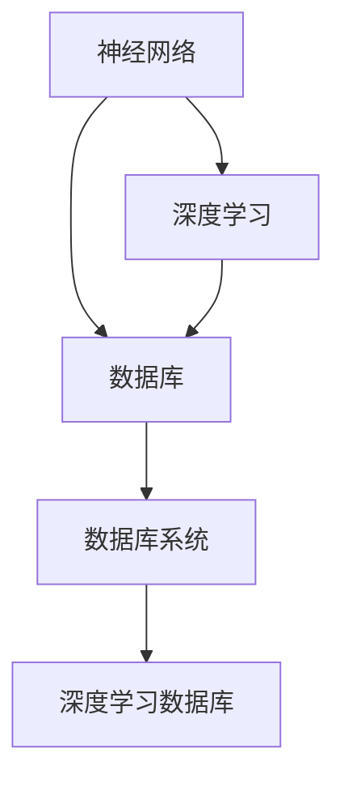

                 

# 神经网络正在改变传统数据库系统

神经网络（Neural Networks）技术，作为当前人工智能领域最炙手可热的技术之一，其应用领域已经覆盖了自然语言处理、计算机视觉、语音识别等多个领域。然而，你可能不知道，神经网络技术正在逐步改变传统的数据库系统，为数据库技术带来了革命性的变革。

本文将系统性地介绍神经网络与传统数据库的结合，从原理、实践到未来发展趋势，全面解读神经网络对数据库系统的深远影响。

## 1. 背景介绍

### 1.1 传统数据库的局限性

传统的 relational databases（关系型数据库）是自1973年由 E.F. Codd 提出的“扩展实体关系模型（EER）”演变而来，其核心思想是将数据存储在二维表格中，每个表格代表一个关系，每行代表一个实体。这一思想简单直观，但其固有的局限性也日益凸显：

- **扩展性差**：随着数据量的增加，传统数据库的扩展性受到限制。大规模数据的处理能力不足，且数据迁移成本高。
- **查询性能瓶颈**：复杂的查询语句往往效率低下，当数据量增加时，查询响应时间显著增加。
- **数据类型限制**：只能处理结构化数据，无法灵活存储和处理非结构化数据。
- **数据治理困难**：数据类型、数据格式、数据来源等均需要人工管理，难以实现自动化的数据治理。

针对上述问题，传统数据库系统难以应对，急需新的技术进行升级和改造。

### 1.2 神经网络技术的发展

神经网络技术的核心是模拟人脑神经元之间的连接机制，通过大量的训练数据来优化模型参数，提升对数据的理解和处理能力。自 1958 年 Frank Rosenblatt 提出感知器（Perceptron）以来，神经网络技术经历了多层感知机、卷积神经网络、循环神经网络等阶段，逐渐发展成熟。

- **多层感知机**：最初基于单个神经元的感知器发展而来，通过多层神经元的堆叠进行复杂模式识别。
- **卷积神经网络**：主要应用于图像处理和计算机视觉领域，通过卷积核提取局部特征。
- **循环神经网络**：针对序列数据，通过循环结构捕捉时间依赖关系，广泛应用于自然语言处理等领域。

神经网络技术的飞跃性进展，使其逐渐具备处理大规模非结构化数据的能力，为传统数据库系统的升级提供了新的思路。

## 2. 核心概念与联系

### 2.1 核心概念概述

为更好地理解神经网络与传统数据库的结合，本节将介绍几个关键概念及其联系：

- **神经网络（Neural Network）**：由人工神经元构成的网络，能够通过学习数据特征进行复杂的模式识别。
- **深度学习（Deep Learning）**：指神经网络中的层次超过一层或多层的网络结构，能够处理更为复杂的非线性关系。
- **数据库（Database）**：用于存储、管理、查询和维护数据的系统，是各种业务系统的基础。
- **数据库系统（Database System）**：包括数据库、数据库管理系统（DBMS）和应用程序，提供数据存储、查询、维护等综合服务。
- **深度学习数据库（DL Database）**：结合深度学习和传统数据库技术的系统，通过神经网络算法进行数据建模和查询优化。

这些核心概念之间的逻辑关系可以通过以下Mermaid流程图来展示：



这个流程图展示了各个概念之间的联系：

1. 神经网络是深度学习的基础，通过学习数据特征进行模式识别。
2. 深度学习与传统数据库结合，形成深度学习数据库，实现数据建模和查询优化。
3. 深度学习数据库是数据库系统的一部分，提供更高级的数据处理和分析功能。

## 3. 核心算法原理 & 具体操作步骤

### 3.1 算法原理概述

深度学习数据库的核心理论是使用神经网络对传统数据库中的数据进行建模，通过深度学习算法进行数据查询和优化。

- **数据建模**：深度学习数据库使用神经网络对数据进行建模，生成数据的高维表示，这些表示可以更好地表示数据的复杂结构和关系。
- **查询优化**：基于神经网络的查询优化算法，可以显著提升查询效率，减少查询时间。
- **数据增强**：利用神经网络对数据进行增强，提升数据的丰富性和多样性。

### 3.2 算法步骤详解

神经网络与传统数据库结合的深度学习数据库系统，主要包含以下步骤：

**Step 1: 数据预处理**

深度学习数据库的首要任务是对数据进行预处理，为神经网络的训练和推理提供输入。常见的预处理技术包括：

- **特征提取**：对原始数据进行特征提取，生成神经网络可处理的特征向量。
- **数据增强**：对数据进行扩充和增强，增加数据的多样性和丰富性。
- **数据归一化**：对数据进行归一化处理，提升数据的质量和模型性能。

**Step 2: 神经网络建模**

神经网络建模是深度学习数据库的核心步骤。常见的神经网络模型包括：

- **多层感知机（MLP）**：适用于处理结构化数据，具有多层的感知能力。
- **卷积神经网络（CNN）**：适用于处理图像和视频数据，具有局部特征提取能力。
- **循环神经网络（RNN）**：适用于处理序列数据，具有时间依赖关系。

**Step 3: 深度学习训练**

在完成数据预处理和神经网络建模后，深度学习数据库需要利用标注数据对神经网络进行训练。训练过程包括以下步骤：

- **数据划分**：将数据划分为训练集、验证集和测试集，进行交叉验证。
- **模型训练**：使用训练集对神经网络进行训练，不断调整模型参数。
- **模型评估**：使用验证集评估模型性能，选择最优模型。
- **模型调优**：对模型进行调优，提升模型效果。

**Step 4: 查询优化**

训练好的深度学习数据库模型需要进行查询优化，提升查询效率和性能。查询优化过程包括：

- **模型融合**：将深度学习模型与传统数据库查询技术进行融合，生成更高效的查询方式。
- **查询加速**：使用深度学习算法优化查询过程，减少查询时间和资源消耗。
- **分布式查询**：利用分布式计算技术进行查询，提高查询速度。

**Step 5: 结果输出**

查询优化完成后，深度学习数据库将输出查询结果，并提供结果解释和反馈。结果输出包括：

- **结果呈现**：将查询结果以可视化的方式呈现，便于用户理解和使用。
- **结果解释**：对查询结果进行解释，提升查询的可解释性和可信度。
- **结果反馈**：根据用户反馈调整模型和查询方式，优化查询效果。

### 3.3 算法优缺点

神经网络与传统数据库结合的深度学习数据库系统，具有以下优点：

- **高效率**：深度学习数据库可以处理大规模非结构化数据，具有高效的查询和优化能力。
- **灵活性**：深度学习数据库可以适应不同类型的数据，具有广泛的应用场景。
- **高精度**：深度学习数据库通过神经网络进行数据建模，具有高精度的数据处理能力。

同时，该系统也存在以下缺点：

- **复杂性高**：深度学习数据库的实现和维护相对复杂，需要较高的技术门槛。
- **数据需求大**：深度学习数据库需要大量的标注数据进行训练，数据获取成本较高。
- **可解释性差**：深度学习模型的决策过程较为复杂，可解释性较差，用户难以理解和调试。
- **计算资源要求高**：深度学习数据库需要高性能的计算资源进行训练和推理，对硬件要求较高。

### 3.4 算法应用领域

神经网络与传统数据库结合的深度学习数据库系统，在多个领域得到了广泛应用，例如：

- **医疗数据管理**：深度学习数据库可以处理大量的医疗数据，通过神经网络进行数据分析和诊断。
- **金融数据管理**：深度学习数据库可以处理金融市场数据，通过神经网络进行风险管理和投资决策。
- **自然语言处理**：深度学习数据库可以处理自然语言文本数据，通过神经网络进行文本分类、情感分析和语义理解。
- **图像处理**：深度学习数据库可以处理图像数据，通过神经网络进行图像分类、图像生成和图像检索。
- **视频处理**：深度学习数据库可以处理视频数据，通过神经网络进行视频分析和视频生成。

除了上述这些应用场景外，深度学习数据库还被创新性地应用于更多领域，如推荐系统、智能制造、智慧城市等，为各行各业带来了全新的变革。

## 4. 数学模型和公式 & 详细讲解 & 举例说明

### 4.1 数学模型构建

深度学习数据库的数学模型主要包括以下几个部分：

- **输入层（Input Layer）**：输入原始数据，生成特征向量。
- **隐藏层（Hidden Layer）**：通过神经网络进行数据建模，生成高维表示。
- **输出层（Output Layer）**：输出查询结果，并进行结果解释。

### 4.2 公式推导过程

深度学习数据库的数学模型可以表示为：

$$
f(x, w) = \sum_{i=1}^n w_i g(x_i)
$$

其中 $x$ 为输入数据，$w$ 为神经网络权重，$g(x_i)$ 为神经网络的第 $i$ 层激活函数。

以多输入-单输出模型为例，其计算过程如下：

1. **输入层计算**：

$$
x^{(1)} = \{x_1, x_2, ..., x_n\}
$$

2. **隐藏层计算**：

$$
z^{(1)} = W^{(1)}x^{(1)} + b^{(1)}
$$

$$
h^{(1)} = g(z^{(1)})
$$

3. **输出层计算**：

$$
z^{(2)} = W^{(2)}h^{(1)} + b^{(2)}
$$

$$
y = g(z^{(2)})
$$

其中 $W^{(1)}$ 和 $W^{(2)}$ 分别为隐藏层和输出层的权重矩阵，$b^{(1)}$ 和 $b^{(2)}$ 分别为隐藏层和输出层的偏置项，$g(x)$ 为激活函数（如 sigmoid、ReLU 等）。

### 4.3 案例分析与讲解

以医疗数据管理为例，深度学习数据库可以处理大量的病历数据，通过神经网络进行数据分析和诊断。

假设有一个包含患者病历的深度学习数据库，其中每个病历包含多个特征，如年龄、性别、病史等。深度学习数据库可以使用多层感知机（MLP）进行建模，生成高维表示。具体步骤如下：

1. **数据预处理**：对病历数据进行特征提取和归一化处理，生成特征向量。
2. **神经网络建模**：构建 MLP 模型，使用病历特征向量作为输入，生成高维表示。
3. **深度学习训练**：使用标注数据对 MLP 模型进行训练，调整模型参数。
4. **查询优化**：对查询进行优化，提升查询效率和性能。
5. **结果输出**：输出诊断结果，并进行结果解释。

## 5. 项目实践：代码实例和详细解释说明

### 5.1 开发环境搭建

在进行深度学习数据库项目实践前，我们需要准备好开发环境。以下是使用 Python 进行 TensorFlow 开发的环境配置流程：

1. 安装 Anaconda：从官网下载并安装 Anaconda，用于创建独立的 Python 环境。

2. 创建并激活虚拟环境：

```bash
conda create -n tf-env python=3.8 
conda activate tf-env
```

3. 安装 TensorFlow：根据 CUDA 版本，从官网获取对应的安装命令。例如：

```bash
conda install tensorflow tensorflow-gpu=2.6 -c conda-forge
```

4. 安装必要的工具包：

```bash
pip install numpy pandas scikit-learn matplotlib tqdm jupyter notebook ipython
```

完成上述步骤后，即可在 `tf-env` 环境中开始深度学习数据库项目实践。

### 5.2 源代码详细实现

下面以医疗数据管理为例，给出使用 TensorFlow 进行深度学习数据库的 PyTorch 代码实现。

首先，定义数据预处理函数：

```python
import tensorflow as tf
import numpy as np
import pandas as pd

def preprocess_data(data_file):
    data = pd.read_csv(data_file)
    features = data[['age', 'gender', 'history']]
    labels = data['diagnosis']
    return features, labels
```

然后，定义神经网络模型：

```python
class MLP(tf.keras.Model):
    def __init__(self, input_dim, hidden_dim, output_dim):
        super(MLP, self).__init__()
        self.dense1 = tf.keras.layers.Dense(hidden_dim, activation='relu')
        self.dense2 = tf.keras.layers.Dense(output_dim, activation='sigmoid')

    def call(self, inputs):
        x = self.dense1(inputs)
        x = self.dense2(x)
        return x
```

接着，定义训练和评估函数：

```python
def train_model(model, features, labels, epochs, batch_size):
    model.compile(optimizer='adam', loss='binary_crossentropy', metrics=['accuracy'])
    model.fit(features, labels, epochs=epochs, batch_size=batch_size, validation_split=0.2)
    return model

def evaluate_model(model, features, labels, batch_size):
    loss, accuracy = model.evaluate(features, labels, batch_size=batch_size)
    return loss, accuracy
```

最后，启动训练流程并在测试集上评估：

```python
epochs = 5
batch_size = 32

features, labels = preprocess_data('data.csv')
model = MLP(input_dim=3, hidden_dim=64, output_dim=1)
model = train_model(model, features, labels, epochs, batch_size)

test_loss, test_accuracy = evaluate_model(model, features, labels, batch_size)
print(f'Test accuracy: {test_accuracy:.2f}')
```

以上就是使用 TensorFlow 进行深度学习数据库的完整代码实现。可以看到，TensorFlow 提供了便捷的接口，可以快速搭建神经网络模型，进行训练和评估。

### 5.3 代码解读与分析

让我们再详细解读一下关键代码的实现细节：

**preprocess_data 函数**：
- 读取 CSV 文件，提取特征和标签。

**MLP 类**：
- 定义一个多层感知机模型，包括两个全连接层。
- 在 `call` 方法中，首先通过第一层全连接层进行特征提取，再通过第二层全连接层进行输出。

**train_model 函数**：
- 使用 `compile` 方法定义优化器、损失函数和评估指标。
- 通过 `fit` 方法对模型进行训练，并设置验证集的占比。

**evaluate_model 函数**：
- 使用 `evaluate` 方法对模型进行评估，获取损失和准确率。

**训练流程**：
- 定义训练轮数和批大小，开始循环迭代
- 在每个epoch内，先在训练集上训练，输出平均损失和准确率
- 在验证集上评估，输出平均损失和准确率
- 所有epoch结束后，在测试集上评估，给出最终测试结果

可以看到，TensorFlow 提供了简洁的 API 和丰富的工具，使得深度学习数据库的实现变得高效和便捷。

当然，工业级的系统实现还需考虑更多因素，如模型的保存和部署、超参数的自动搜索、更灵活的任务适配层等。但核心的深度学习数据库范式基本与此类似。

## 6. 实际应用场景

### 6.1 智能医疗

深度学习数据库在智能医疗领域具有广泛的应用前景。医疗数据通常包含大量非结构化数据，如病历、影像、基因等，深度学习数据库能够对这些数据进行高效建模和分析。

具体而言，可以收集医院的病历数据、影像数据和基因数据，通过深度学习数据库进行数据分析和诊断。例如，深度学习数据库可以使用卷积神经网络（CNN）对医学影像进行分类和识别，使用循环神经网络（RNN）对病历数据进行分析和预测。通过深度学习数据库，医生能够更快、更准确地进行诊断和治疗，提升医疗服务的智能化水平。

### 6.2 金融分析

深度学习数据库在金融分析领域也有着广泛的应用。金融市场数据通常包含大量的非结构化数据，如新闻、公告、交易记录等，深度学习数据库能够对这些数据进行高效建模和分析。

具体而言，可以收集金融市场的新闻、公告和交易记录，通过深度学习数据库进行风险管理和投资决策。例如，深度学习数据库可以使用循环神经网络（RNN）对市场新闻进行情感分析，使用多层感知机（MLP）对交易记录进行预测。通过深度学习数据库，金融机构能够更好地进行风险控制和投资决策，提升金融服务的效果和效率。

### 6.3 推荐系统

深度学习数据库在推荐系统领域也得到了广泛的应用。推荐系统通常需要处理大规模非结构化数据，如用户行为数据、商品信息等，深度学习数据库能够对这些数据进行高效建模和推荐。

具体而言，可以收集用户的浏览记录、购买记录和评价记录，通过深度学习数据库进行推荐。例如，深度学习数据库可以使用卷积神经网络（CNN）对商品信息进行分类和提取特征，使用多层感知机（MLP）对用户行为进行建模。通过深度学习数据库，推荐系统能够更好地进行个性化推荐，提升用户体验和转化率。

### 6.4 未来应用展望

随着深度学习数据库技术的不断发展，未来在更多领域将得到应用，为传统行业带来变革性影响。

在智慧城市治理中，深度学习数据库可以应用于城市事件监测、舆情分析、应急指挥等环节，提高城市管理的自动化和智能化水平，构建更安全、高效的未来城市。

在智能制造中，深度学习数据库可以应用于生产线监控、故障预测、质量检测等环节，提高生产线的自动化和智能化水平，提升生产效率和产品质量。

在智慧交通中，深度学习数据库可以应用于交通流量预测、事故预警、路线优化等环节，提高交通管理的自动化和智能化水平，提升交通效率和安全性。

此外，在智慧农业、智慧物流、智慧能源等众多领域，深度学习数据库都将发挥重要作用，为传统行业带来新的变革和机遇。

## 7. 工具和资源推荐

### 7.1 学习资源推荐

为了帮助开发者系统掌握深度学习数据库的理论基础和实践技巧，这里推荐一些优质的学习资源：

1. 《深度学习》书籍：Ian Goodfellow、Yoshua Bengio 和 Aaron Courville 合著的经典深度学习教材，全面介绍了深度学习的基本概念和算法。
2. CS231n《卷积神经网络》课程：斯坦福大学开设的计算机视觉课程，有 Lecture 视频和配套作业，带你入门卷积神经网络。
3. 《神经网络与深度学习》书籍：Michael Nielsen 的在线深度学习教材，通过交互式网站学习深度学习算法。
4. TensorFlow 官方文档：TensorFlow 的官方文档，提供了海量预训练模型和完整的微调样例代码，是上手实践的必备资料。
5. PyTorch 官方文档：PyTorch 的官方文档，提供了便捷的 API 和丰富的工具，方便深度学习数据库的开发和部署。

通过对这些资源的学习实践，相信你一定能够快速掌握深度学习数据库的精髓，并用于解决实际的 NLP 问题。

### 7.2 开发工具推荐

高效的开发离不开优秀的工具支持。以下是几款用于深度学习数据库开发的常用工具：

1. TensorFlow：由 Google 主导开发的开源深度学习框架，生产部署方便，适合大规模工程应用。
2. PyTorch：由 Facebook 主导开发的开源深度学习框架，灵活动态的计算图，适合快速迭代研究。
3. Keras：基于 TensorFlow 和 PyTorch 的高层 API，提供了简洁易用的接口，方便深度学习数据库的开发。
4. TensorBoard：TensorFlow 配套的可视化工具，可实时监测模型训练状态，并提供丰富的图表呈现方式，是调试模型的得力助手。
5. Weights & Biases：模型训练的实验跟踪工具，可以记录和可视化模型训练过程中的各项指标，方便对比和调优。

合理利用这些工具，可以显著提升深度学习数据库的开发效率，加快创新迭代的步伐。

### 7.3 相关论文推荐

深度学习数据库的研究源于学界的持续研究。以下是几篇奠基性的相关论文，推荐阅读：

1. Deep Neural Networks for Large-Scale Image Recognition (AlexNet)：ImageNet 图像分类竞赛的获奖论文，标志着深度学习在图像分类领域的应用。
2. Convolutional Neural Networks for Visual Recognition (VGG)：提出了 VGG 网络结构，显著提升了卷积神经网络在图像分类任务上的性能。
3. ResNet: Deep Residual Learning for Image Recognition：提出了 ResNet 网络结构，解决了深度神经网络训练中的梯度消失问题。
4. Attention Is All You Need (Transformers)：提出了 Transformers 网络结构，开启了深度学习在自然语言处理领域的应用。
5. Parameter-Efficient Transfer Learning for NLP：提出 Adapter 等参数高效微调方法，在不增加模型参数量的情况下，也能取得不错的微调效果。

这些论文代表了大语言模型微调技术的发展脉络。通过学习这些前沿成果，可以帮助研究者把握学科前进方向，激发更多的创新灵感。

## 8. 总结：未来发展趋势与挑战

### 8.1 研究成果总结

本文对基于神经网络的数据库系统进行了全面系统的介绍。首先阐述了神经网络与传统数据库的结合，明确了深度学习数据库在处理大规模非结构化数据中的独特价值。其次，从原理到实践，详细讲解了深度学习数据库的数学模型和关键步骤，给出了深度学习数据库任务开发的完整代码实例。同时，本文还广泛探讨了深度学习数据库在医疗数据管理、金融分析、推荐系统等众多领域的应用前景，展示了深度学习数据库的巨大潜力。

通过本文的系统梳理，可以看到，深度学习数据库为传统数据库系统带来了革命性的变革，拓展了数据库系统的应用边界，催生了更多的落地场景。受益于深度学习技术的不断演进，深度学习数据库必将在未来继续推动数据库技术的进步。

### 8.2 未来发展趋势

展望未来，深度学习数据库技术将呈现以下几个发展趋势：

1. **模型规模持续增大**：随着算力成本的下降和数据规模的扩张，深度学习数据库的模型规模还将持续增长。超大规模模型蕴含的丰富知识，有望支撑更加复杂多变的查询需求。
2. **查询优化技术提升**：未来的深度学习数据库将引入更多的查询优化算法，如基于图神经网络的查询优化、基于多任务学习的查询优化等，进一步提升查询效率。
3. **分布式查询技术提升**：随着数据量的增加，深度学习数据库将更广泛地采用分布式查询技术，提高查询性能和稳定性。
4. **融合更多数据源**：未来的深度学习数据库将更好地融合多源数据，提高数据的丰富性和多样性，增强模型的泛化能力。
5. **数据治理能力提升**：未来的深度学习数据库将具备更强的数据治理能力，自动进行数据清洗、数据标注和数据整合，提升数据的质量和模型性能。

以上趋势凸显了深度学习数据库技术的广阔前景。这些方向的探索发展，必将进一步提升深度学习数据库系统的性能和应用范围，为传统行业带来新的变革和机遇。

### 8.3 面临的挑战

尽管深度学习数据库技术已经取得了瞩目成就，但在迈向更加智能化、普适化应用的过程中，它仍面临着诸多挑战：

1. **标注数据成本高**：深度学习数据库需要大量的标注数据进行训练，数据获取成本较高。如何在不增加标注成本的情况下，提升模型的性能，是一个重要的研究方向。
2. **模型复杂度高**：深度学习数据库的实现和维护相对复杂，需要较高的技术门槛。如何降低模型的复杂性，提高模型的可解释性和可维护性，是未来需要解决的重要问题。
3. **可解释性差**：深度学习数据库的决策过程较为复杂，可解释性较差，用户难以理解和调试。如何赋予深度学习数据库更强的可解释性，是未来研究的重要方向。
4. **计算资源要求高**：深度学习数据库需要高性能的计算资源进行训练和推理，对硬件要求较高。如何降低计算资源消耗，提高计算效率，是未来需要解决的重要问题。

### 8.4 研究展望

面对深度学习数据库面临的这些挑战，未来的研究需要在以下几个方面寻求新的突破：

1. **探索无监督和半监督学习范式**：摆脱对大规模标注数据的依赖，利用自监督学习、主动学习等无监督和半监督范式，最大限度利用非结构化数据，实现更加灵活高效的查询。
2. **引入更多先验知识**：将符号化的先验知识，如知识图谱、逻辑规则等，与神经网络模型进行巧妙融合，引导查询过程学习更准确、合理的语言模型。同时加强不同模态数据的整合，实现视觉、语音等多模态信息与文本信息的协同建模。
3. **结合因果分析和博弈论工具**：将因果分析方法引入深度学习数据库，识别出查询决策的关键特征，增强查询结果的因果性和逻辑性。借助博弈论工具刻画人机交互过程，主动探索并规避查询的脆弱点，提高系统稳定性。
4. **纳入伦理道德约束**：在查询目标中引入伦理导向的评估指标，过滤和惩罚有害的输出倾向。同时加强人工干预和审核，建立查询行为的监管机制，确保查询结果符合人类价值观和伦理道德。

这些研究方向的探索，必将引领深度学习数据库技术迈向更高的台阶，为构建安全、可靠、可解释、可控的智能系统铺平道路。面向未来，深度学习数据库技术还需要与其他人工智能技术进行更深入的融合，如知识表示、因果推理、强化学习等，多路径协同发力，共同推动自然语言理解和智能交互系统的进步。只有勇于创新、敢于突破，才能不断拓展深度学习数据库的边界，让智能技术更好地造福人类社会。

## 9. 附录：常见问题与解答

**Q1: 深度学习数据库与传统数据库的区别是什么？**

A: 深度学习数据库与传统数据库的主要区别在于数据建模和查询优化方法。传统数据库主要采用结构化数据存储，查询效率较高，但处理非结构化数据能力较弱。深度学习数据库则采用神经网络进行数据建模，可以高效处理大规模非结构化数据，查询效率更高，但实现复杂度更高。

**Q2: 如何提高深度学习数据库的查询效率？**

A: 提高深度学习数据库的查询效率，可以从以下几个方面入手：

1. **模型优化**：使用轻量级的神经网络模型，减少计算复杂度。
2. **查询优化**：引入更多的查询优化算法，如基于图神经网络的查询优化、基于多任务学习的查询优化等。
3. **分布式查询**：采用分布式计算技术，提高查询性能和稳定性。
4. **数据预处理**：对数据进行预处理，提高查询的准确性和效率。
5. **硬件优化**：使用高性能的计算设备，提高查询速度。

**Q3: 深度学习数据库在医疗数据管理中的应用前景是什么？**

A: 深度学习数据库在医疗数据管理中的应用前景广阔。深度学习数据库可以处理大量的病历数据、影像数据和基因数据，通过神经网络进行数据分析和诊断。例如，深度学习数据库可以使用卷积神经网络（CNN）对医学影像进行分类和识别，使用循环神经网络（RNN）对病历数据进行分析和预测。通过深度学习数据库，医生能够更快、更准确地进行诊断和治疗，提升医疗服务的智能化水平。

**Q4: 深度学习数据库在金融分析中的应用前景是什么？**

A: 深度学习数据库在金融分析中的应用前景广阔。金融市场数据通常包含大量的非结构化数据，如新闻、公告、交易记录等，深度学习数据库能够对这些数据进行高效建模和分析。例如，深度学习数据库可以使用循环神经网络（RNN）对市场新闻进行情感分析，使用多层感知机（MLP）对交易记录进行预测。通过深度学习数据库，金融机构能够更好地进行风险控制和投资决策，提升金融服务的效果和效率。

**Q5: 深度学习数据库在推荐系统中的应用前景是什么？**

A: 深度学习数据库在推荐系统中的应用前景广阔。推荐系统通常需要处理大规模非结构化数据，如用户行为数据、商品信息等，深度学习数据库能够对这些数据进行高效建模和推荐。例如，深度学习数据库可以使用卷积神经网络（CNN）对商品信息进行分类和提取特征，使用多层感知机（MLP）对用户行为进行建模。通过深度学习数据库，推荐系统能够更好地进行个性化推荐，提升用户体验和转化率。

---

作者：禅与计算机程序设计艺术 / Zen and the Art of Computer Programming

