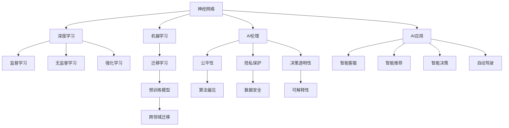

                 

# 神经网络：人类与机器的共存

> 关键词：神经网络,人类与机器,共存,AI伦理,机器学习

## 1. 背景介绍

### 1.1 问题由来
随着人工智能(AI)技术的迅猛发展，神经网络(Neural Networks)作为其中的重要一环，已经在图像识别、语音识别、自然语言处理等领域取得了显著的成果。然而，神经网络技术的广泛应用也引发了一系列社会伦理问题，如就业失业、隐私保护、算法偏见等，引发了关于人类与机器共存问题的深入思考。

### 1.2 问题核心关键点
神经网络技术的快速发展，一方面为解决现实问题提供了强有力的工具，另一方面也带来了不可忽视的伦理挑战。这些问题核心在于：

- **就业失业**：随着自动化和智能化水平的提高，某些传统职业可能会被机器取代，造成就业结构的巨大变化。
- **隐私保护**：神经网络常常需要大量个人数据进行训练，如何确保数据的安全和隐私成为了一大难题。
- **算法偏见**：神经网络可能通过训练数据学习到其中的偏见，导致输出结果存在歧视性，影响社会公平。
- **决策透明性**：神经网络在处理复杂任务时，决策过程往往缺乏可解释性，难以被理解和信任。

如何平衡神经网络技术的发展与伦理问题的处理，成为了现代社会面临的重要课题。本文将从神经网络技术本身出发，探讨其对人类生活的影响，并提出一些解决方案，促进人机和谐共存。

## 2. 核心概念与联系

### 2.1 核心概念概述

为更好地理解神经网络技术对人类生活的影响，本节将介绍几个密切相关的核心概念：

- **神经网络**：一种由大量神经元构成的计算模型，用于模拟人脑的认知和推理能力。通过训练，神经网络可以学习复杂的输入输出映射关系。

- **机器学习**：一种通过数据训练模型，使其具备一定智能能力的AI技术。机器学习中的监督学习、无监督学习和强化学习等范式，分别对应着分类、聚类和决策任务。

- **深度学习**：一种基于神经网络的机器学习方法，通过多层非线性映射实现高维数据的有效表示和处理。深度学习技术在图像、语音、自然语言处理等领域取得了巨大成功。

- **迁移学习**：指将一个领域学习到的知识，迁移应用到另一个不同但相关的领域的学习范式。神经网络技术中的迁移学习主要体现在预训练模型的跨领域适应性上。

- **强化学习**：通过与环境的交互，神经网络学习到最优决策策略。强化学习在自动驾驶、机器人控制等领域有广泛应用。

- **AI伦理**：关于AI技术的伦理道德问题，包括公平性、隐私保护、安全性等。AI伦理的研究旨在构建负责任、透明、可控的AI系统。

这些核心概念之间的逻辑关系可以通过以下Mermaid流程图来展示：



这个流程图展示了几大核心概念之间的关系：

1. 神经网络通过机器学习，特别是深度学习技术，获取数据的复杂表示。
2. 深度学习中的监督学习、无监督学习和强化学习分别对应不同的应用场景。
3. 迁移学习通过预训练模型实现跨领域的知识迁移，提升了神经网络模型的泛化能力。
4. AI伦理关注于神经网络技术的应用过程中可能出现的伦理问题，如算法偏见、决策透明性等。
5. AI伦理中的公平性、隐私保护、安全性等目标，通过构建透明、可解释的AI系统得以实现。
6. 神经网络技术在智能客服、推荐系统、自动驾驶等多个领域得到广泛应用，改变了人类的工作和生活方式。

这些概念共同构成了神经网络技术的发展框架，对其伦理和社会影响的研究也正在不断深入。

## 3. 核心算法原理 & 具体操作步骤
### 3.1 算法原理概述

神经网络技术的核心在于通过大量的训练数据，学习输入到输出的映射关系。以分类任务为例，神经网络通过多层非线性映射，将输入特征映射到输出类别上。数学上，神经网络的输出 $y$ 可以表示为：

$$ y = f_W \left(\sigma \left(\sum_{i=1}^{n} W_i x_i + b_i \right) \right) $$

其中 $x$ 为输入特征向量，$W$ 为权重矩阵，$b$ 为偏置向量，$f_W$ 为激活函数，$\sigma$ 为非线性映射函数。

神经网络的训练过程包括前向传播和反向传播两个步骤。在前向传播中，输入特征通过神经网络的多层非线性映射，得到输出结果。在反向传播中，根据输出结果与真实标签的误差，反向计算权重和偏置的梯度，并使用优化算法（如梯度下降）更新模型参数。

通过不断迭代，神经网络学习到更加准确的输入输出映射关系，从而实现对复杂任务的有效处理。然而，这一过程往往伴随着数据隐私、算法偏见等问题，需要谨慎处理。

### 3.2 算法步骤详解

神经网络技术的实际应用过程，可以分为以下几个关键步骤：

**Step 1: 数据准备**
- 收集并标注大量的训练数据和测试数据，确保数据的多样性和代表性。
- 清洗和预处理数据，去除异常值和噪声，构建合适的数据集。

**Step 2: 模型构建**
- 选择合适的神经网络架构，如卷积神经网络(CNN)、循环神经网络(RNN)、长短时记忆网络(LSTM)等。
- 定义模型参数，包括权重矩阵、偏置向量等。

**Step 3: 模型训练**
- 使用训练数据，通过前向传播和反向传播进行模型训练。
- 选择合适的优化算法，如随机梯度下降、Adam等，设定学习率、批大小等超参数。
- 使用正则化技术，如L2正则、Dropout等，防止过拟合。

**Step 4: 模型评估**
- 使用测试数据集对训练好的模型进行评估，计算准确率、召回率、F1分数等指标。
- 根据评估结果调整模型参数，继续优化模型性能。

**Step 5: 模型部署**
- 将训练好的模型部署到实际应用场景中。
- 设置合适的推理参数，如批大小、计算精度等。
- 进行在线/离线推理，提供服务或生成预测结果。

### 3.3 算法优缺点

神经网络技术在处理复杂任务方面具有以下优点：

- 处理非线性关系的能力强：通过多层非线性映射，神经网络能够处理高维、复杂的数据关系。
- 自动特征提取：神经网络在训练过程中自动学习输入数据的特征，无需手动提取特征。
- 适用性广：神经网络在图像、语音、自然语言处理等多个领域都有广泛应用。

同时，神经网络技术也存在一些缺点：

- 需要大量标注数据：神经网络的训练需要大量的标注数据，获取成本较高。
- 模型复杂度高：神经网络结构复杂，参数数量庞大，难以理解和调试。
- 泛化能力差：神经网络易受到数据分布的变化影响，泛化能力不足。

### 3.4 算法应用领域

神经网络技术已经在多个领域得到了广泛应用，例如：

- 计算机视觉：用于图像分类、目标检测、图像分割等任务。
- 自然语言处理：用于文本分类、情感分析、机器翻译等任务。
- 语音识别：用于语音转写、语音合成等任务。
- 推荐系统：用于个性化推荐、用户行为分析等任务。
- 医疗诊断：用于影像诊断、病理分析等任务。
- 自动驾驶：用于感知环境、路径规划等任务。

这些应用领域展示了神经网络技术在实际生活中的广泛影响。然而，神经网络技术在带来便利的同时，也引发了伦理和社会问题，需要在应用过程中进行慎重考虑。

## 4. 数学模型和公式 & 详细讲解  
### 4.1 数学模型构建

神经网络的数学模型可以表示为：

$$ f(x; \theta) = W_0 f(W_{n-1} \cdots f(W_1 f(W_0 x + b_0) + b_1) + \cdots + b_{n-1}) + b_n $$

其中 $x$ 为输入向量，$\theta$ 为模型参数，$f$ 为激活函数，$W$ 和 $b$ 为权重矩阵和偏置向量。

### 4.2 公式推导过程

以二分类任务为例，神经网络的输出可以表示为：

$$ y = \sigma \left(\sum_{i=1}^{n} W_i x_i + b_i \right) $$

其中 $\sigma$ 为sigmoid函数，$W$ 和 $b$ 为模型参数。在训练过程中，通过反向传播计算权重和偏置的梯度：

$$ \frac{\partial \mathcal{L}}{\partial W_i} = \frac{\partial \mathcal{L}}{\partial y} \frac{\partial y}{\partial x_i} $$
$$ \frac{\partial \mathcal{L}}{\partial b_i} = \frac{\partial \mathcal{L}}{\partial y} $$

其中 $\mathcal{L}$ 为损失函数，通常采用交叉熵损失函数。

### 4.3 案例分析与讲解

以图像分类为例，使用卷积神经网络(CNN)进行训练。CNN通过卷积层和池化层提取图像特征，再通过全连接层进行分类。其训练过程包括：

1. 数据准备：收集图像数据，进行预处理，如归一化、数据增强等。
2. 模型构建：设计CNN结构，包括卷积层、池化层、全连接层等。
3. 模型训练：使用训练数据进行前向传播和反向传播，优化模型参数。
4. 模型评估：使用测试数据集评估模型性能，计算准确率、召回率等指标。
5. 模型部署：将训练好的模型部署到实际应用中，进行推理预测。

## 5. 项目实践：代码实例和详细解释说明
### 5.1 开发环境搭建

在进行神经网络项目实践前，需要先搭建好开发环境。以下是使用Python进行TensorFlow开发的环境配置流程：

1. 安装Anaconda：从官网下载并安装Anaconda，用于创建独立的Python环境。

2. 创建并激活虚拟环境：
```bash
conda create -n tf-env python=3.8 
conda activate tf-env
```

3. 安装TensorFlow：根据CUDA版本，从官网获取对应的安装命令。例如：
```bash
conda install tensorflow
```

4. 安装TensorFlow Addons：安装TensorFlow的扩展库，支持更多最新的神经网络模型。
```bash
conda install tensorflow-addons
```

5. 安装各类工具包：
```bash
pip install numpy pandas scikit-learn matplotlib tqdm jupyter notebook ipython
```

完成上述步骤后，即可在`tf-env`环境中开始神经网络实践。

### 5.2 源代码详细实现

下面我们以图像分类为例，给出使用TensorFlow对卷积神经网络进行训练的PyTorch代码实现。

首先，定义CNN模型：

```python
import tensorflow as tf
from tensorflow.keras import layers

class CNNModel(tf.keras.Model):
    def __init__(self):
        super(CNNModel, self).__init__()
        self.conv1 = layers.Conv2D(32, 3, activation='relu')
        self.pool1 = layers.MaxPooling2D()
        self.conv2 = layers.Conv2D(64, 3, activation='relu')
        self.pool2 = layers.MaxPooling2D()
        self.flatten = layers.Flatten()
        self.dense1 = layers.Dense(64, activation='relu')
        self.dense2 = layers.Dense(10)

    def call(self, inputs):
        x = self.conv1(inputs)
        x = self.pool1(x)
        x = self.conv2(x)
        x = self.pool2(x)
        x = self.flatten(x)
        x = self.dense1(x)
        return self.dense2(x)
```

然后，定义训练和评估函数：

```python
from tensorflow.keras.datasets import mnist
from tensorflow.keras.utils import to_categorical
from sklearn.metrics import accuracy_score

(train_images, train_labels), (test_images, test_labels) = mnist.load_data()

train_images = train_images.reshape(-1, 28, 28, 1).astype('float32') / 255.0
test_images = test_images.reshape(-1, 28, 28, 1).astype('float32') / 255.0

train_labels = to_categorical(train_labels)
test_labels = to_categorical(test_labels)

def train_model(model, train_images, train_labels, epochs=10, batch_size=32):
    model.compile(optimizer='adam', loss='categorical_crossentropy', metrics=['accuracy'])
    model.fit(train_images, train_labels, epochs=epochs, batch_size=batch_size, validation_data=(test_images, test_labels))
    return model

def evaluate_model(model, test_images, test_labels):
    y_pred = model.predict(test_images)
    y_pred = np.argmax(y_pred, axis=1)
    y_true = np.argmax(test_labels, axis=1)
    accuracy = accuracy_score(y_true, y_pred)
    return accuracy

model = CNNModel()
model = train_model(model, train_images, train_labels)
accuracy = evaluate_model(model, test_images, test_labels)
print(f"Accuracy: {accuracy}")
```

以上就是使用TensorFlow进行卷积神经网络训练的完整代码实现。可以看到，TensorFlow提供了丰富的API和预定义模型，大大简化了神经网络开发的复杂度。

### 5.3 代码解读与分析

让我们再详细解读一下关键代码的实现细节：

**CNNModel类**：
- `__init__`方法：初始化卷积层、池化层、全连接层等组件。
- `call`方法：定义模型的前向传播过程，依次经过卷积层、池化层、全连接层等。

**train_model函数**：
- 使用`compile`方法配置模型优化器和损失函数。
- 使用`fit`方法进行训练，指定训练轮数和批大小，并调用`evaluate`方法评估模型性能。

**evaluate_model函数**：
- 使用`predict`方法对测试集进行预测。
- 通过`argmax`方法将预测结果转化为类别标签。
- 使用`accuracy_score`方法计算预测准确率。

**mnist加载数据**：
- 使用`load_data`方法加载MNIST数据集，包括训练集和测试集。
- 将图像数据归一化到0-1之间，并将标签转化为one-hot编码。

可以看到，TensorFlow提供了简洁高效的工具，使得神经网络模型的开发和训练变得非常便捷。然而，实际应用中还需要考虑模型泛化能力、计算资源、数据隐私等诸多问题。

## 6. 实际应用场景
### 6.1 智能客服系统

神经网络技术可以应用于智能客服系统的构建。传统客服往往需要配备大量人力，高峰期响应缓慢，且一致性和专业性难以保证。而使用神经网络技术构建的智能客服系统，可以7x24小时不间断服务，快速响应客户咨询，用自然流畅的语言解答各类常见问题。

在技术实现上，可以收集企业内部的历史客服对话记录，将问题和最佳答复构建成监督数据，在此基础上对预训练神经网络模型进行微调。微调后的模型能够自动理解用户意图，匹配最合适的答案模板进行回复。对于客户提出的新问题，还可以接入检索系统实时搜索相关内容，动态组织生成回答。如此构建的智能客服系统，能大幅提升客户咨询体验和问题解决效率。

### 6.2 金融舆情监测

金融机构需要实时监测市场舆论动向，以便及时应对负面信息传播，规避金融风险。传统的人工监测方式成本高、效率低，难以应对网络时代海量信息爆发的挑战。神经网络技术可以应用于文本分类和情感分析任务，帮助机构自动识别舆情动向。

具体而言，可以收集金融领域相关的新闻、报道、评论等文本数据，并对其进行主题标注和情感标注。在此基础上对预训练神经网络模型进行微调，使其能够自动判断文本属于何种主题，情感倾向是正面、中性还是负面。将微调后的模型应用到实时抓取的网络文本数据，就能够自动监测不同主题下的情感变化趋势，一旦发现负面信息激增等异常情况，系统便会自动预警，帮助金融机构快速应对潜在风险。

### 6.3 个性化推荐系统

当前的推荐系统往往只依赖用户的历史行为数据进行物品推荐，无法深入理解用户的真实兴趣偏好。神经网络技术可以应用于个性化推荐系统，通过分析用户的浏览、点击、评论、分享等行为数据，提取和用户交互的物品标题、描述、标签等文本内容。将文本内容作为模型输入，用户的后续行为（如是否点击、购买等）作为监督信号，在此基础上微调预训练神经网络模型。微调后的模型能够从文本内容中准确把握用户的兴趣点。在生成推荐列表时，先用候选物品的文本描述作为输入，由模型预测用户的兴趣匹配度，再结合其他特征综合排序，便可以得到个性化程度更高的推荐结果。

### 6.4 未来应用展望

随着神经网络技术的不断发展，其在实际生活中的应用将更加广泛。未来，神经网络技术将从以下几个方面进一步拓展：

- **医疗诊断**：通过图像识别技术，神经网络可以辅助医生进行影像诊断，提高诊断效率和准确性。
- **智能交通**：使用神经网络进行交通流量预测和路径规划，提升交通管理水平。
- **自动驾驶**：通过视觉和感知神经网络，自动驾驶系统可以实现高精度的环境感知和决策。
- **教育学习**：使用神经网络技术进行个性化学习路径推荐，提高学习效率和效果。
- **智能家居**：通过语音识别和自然语言处理，神经网络可以实现智能家居设备的人机交互。

## 7. 工具和资源推荐
### 7.1 学习资源推荐

为了帮助开发者系统掌握神经网络技术，这里推荐一些优质的学习资源：

1. 《深度学习》书籍：Ian Goodfellow所著，全面介绍了深度学习的理论基础和应用实践。
2. CS231n《卷积神经网络》课程：斯坦福大学开设的计算机视觉课程，提供了丰富的深度学习资源。
3. CS224n《自然语言处理》课程：斯坦福大学开设的NLP课程，介绍了深度学习在NLP中的应用。
4. Kaggle：数据科学竞赛平台，提供了大量实战项目和数据集，可以锻炼实际应用能力。
5. TensorFlow官方文档：TensorFlow的详细文档，提供了丰富的API参考和代码示例。
6. PyTorch官方文档：PyTorch的详细文档，提供了丰富的API参考和代码示例。

通过对这些资源的学习实践，相信你一定能够快速掌握神经网络技术的精髓，并用于解决实际的AI问题。
###  7.2 开发工具推荐

高效的开发离不开优秀的工具支持。以下是几款用于神经网络开发常用的工具：

1. TensorFlow：由Google主导开发的开源深度学习框架，支持多种计算平台，生产部署方便。
2. PyTorch：Facebook开发的开源深度学习框架，灵活动态，研究社区活跃。
3. Jupyter Notebook：支持多种编程语言，提供交互式编程环境，非常适合研究开发。
4. VSCode：开源的跨平台代码编辑器，支持丰富的插件和扩展，可以提升开发效率。
5. Google Colab：谷歌提供的在线Jupyter Notebook环境，免费提供GPU/TPU算力，适合快速上手实验。
6. PyCharm：商业版的代码编辑器，支持深度学习框架的调试和优化。

合理利用这些工具，可以显著提升神经网络开发的效率，加快创新迭代的步伐。

### 7.3 相关论文推荐

神经网络技术的发展源于学界的持续研究。以下是几篇奠基性的相关论文，推荐阅读：

1. Yann LeCun等《深度学习》：全面介绍了深度学习的理论基础和应用实践。
2. Alex Krizhevsky等《ImageNet Classification with Deep Convolutional Neural Networks》：展示了卷积神经网络在图像分类任务上的卓越性能。
3. Ian Goodfellow等《Generative Adversarial Nets》：提出了生成对抗网络，进一步推动了深度学习的发展。
4. Geoffrey Hinton等《A Neural Probabilistic Language Model》：介绍了神经网络在自然语言处理中的应用。
5. Ian Goodfellow等《Deep Learning》：涵盖了深度学习的方方面面，包括理论、算法和应用。
6. Yoshua Bengio等《Learning Phrases, Words, Tags》：展示了循环神经网络在序列数据上的出色表现。

这些论文代表了神经网络技术的发展脉络，通过学习这些前沿成果，可以帮助研究者把握学科前进方向，激发更多的创新灵感。

## 8. 总结：未来发展趋势与挑战
### 8.1 总结

本文对神经网络技术的核心算法原理和操作步骤进行了详细阐述，并介绍了其在实际应用中的多个场景。通过系统的理论学习和实践练习，相信读者能够掌握神经网络技术的精髓，并将其应用于解决实际问题。

### 8.2 未来发展趋势

展望未来，神经网络技术将呈现以下几个发展趋势：

- **模型规模持续增大**：随着计算资源的提升和训练算法的优化，神经网络模型的参数量将不断增加，能够处理更加复杂的任务。
- **自动化设计**：未来的神经网络设计将更多依赖自动化工具和算法，如神经网络架构搜索(NAS)，提升设计效率和效果。
- **多模态融合**：神经网络技术将更多地与其他模态数据融合，实现视觉、语音、文本等多种数据类型的协同处理。
- **联邦学习**：通过分布式训练和模型共享，神经网络技术可以实现多设备之间的协同学习，保护隐私的同时提升模型性能。
- **自监督学习**：利用未标注数据进行自监督学习，减少对标注数据的依赖，提升模型泛化能力。
- **解释性增强**：未来的神经网络设计将更多关注模型的可解释性，增强其决策过程的透明性和可信度。

### 8.3 面临的挑战

尽管神经网络技术已经取得了巨大的成功，但在发展过程中仍面临诸多挑战：

- **计算资源消耗大**：神经网络模型的训练和推理需要大量的计算资源，如GPU/TPU等。如何降低资源消耗，提升计算效率，仍需进一步研究。
- **数据隐私保护**：神经网络模型往往需要大量个人数据进行训练，如何在保护隐私的前提下，充分利用数据进行模型训练，仍需进一步探索。
- **模型鲁棒性不足**：神经网络模型在处理复杂任务时，容易受到数据扰动和对抗攻击的影响，如何提升模型的鲁棒性，是一个重要研究方向。
- **公平性和伦理**：神经网络模型可能学习到数据中的偏见，导致输出结果存在歧视性，如何构建公平、透明的神经网络模型，仍需进一步研究。
- **可解释性不足**：神经网络模型通常缺乏可解释性，难以理解其内部工作机制，如何在保证模型性能的同时，提升可解释性，是一个重要研究方向。

### 8.4 研究展望

面对神经网络技术面临的诸多挑战，未来的研究需要在以下几个方面寻求新的突破：

- **小样本学习和自监督学习**：通过利用未标注数据进行自监督学习，或通过少量标注数据进行小样本学习，提升模型的泛化能力和泛化性。
- **模型压缩和优化**：开发更高效的模型压缩和优化算法，减少模型参数和计算资源消耗，提升模型的计算效率和部署灵活性。
- **多模态融合**：将视觉、语音、文本等多种数据类型进行融合，构建多模态神经网络模型，提升模型对复杂任务的建模能力。
- **解释性和可控性**：通过引入因果推断和对抗学习，增强模型的可解释性和鲁棒性，构建可控的神经网络模型。
- **伦理和社会影响**：构建具有伦理导向的神经网络模型，关注模型的公平性、隐私保护和安全性，提升模型的社会责任感。

这些研究方向将进一步推动神经网络技术的发展，为构建更加智能、公平、可控的AI系统提供有力支持。相信随着研究的不断深入，神经网络技术将进一步提升人类生活的质量和效率，同时减少对社会的影响和风险。

## 9. 附录：常见问题与解答
**Q1：神经网络技术在实际应用中面临哪些挑战？**

A: 神经网络技术在实际应用中面临以下挑战：
1. 计算资源消耗大：神经网络模型的训练和推理需要大量的计算资源，如GPU/TPU等。
2. 数据隐私保护：神经网络模型往往需要大量个人数据进行训练，如何在保护隐私的前提下，充分利用数据进行模型训练，仍需进一步探索。
3. 模型鲁棒性不足：神经网络模型在处理复杂任务时，容易受到数据扰动和对抗攻击的影响，如何提升模型的鲁棒性，是一个重要研究方向。
4. 公平性和伦理：神经网络模型可能学习到数据中的偏见，导致输出结果存在歧视性，如何构建公平、透明的神经网络模型，仍需进一步研究。
5. 可解释性不足：神经网络模型通常缺乏可解释性，难以理解其内部工作机制，如何在保证模型性能的同时，提升可解释性，是一个重要研究方向。

**Q2：如何提升神经网络模型的泛化能力？**

A: 提升神经网络模型的泛化能力，可以从以下几个方面入手：
1. 增加数据量：通过收集更多的训练数据，提升模型的泛化能力。
2. 使用数据增强：对训练数据进行扩充和增强，如旋转、裁剪、平移等，提升模型的泛化能力。
3. 引入自监督学习：利用未标注数据进行自监督学习，提升模型的泛化能力。
4. 使用正则化技术：如L2正则、Dropout等，防止模型过拟合，提升泛化能力。
5. 使用迁移学习：通过在不同任务之间迁移知识，提升模型的泛化能力。

**Q3：如何在保护隐私的前提下，利用神经网络技术进行个性化推荐？**

A: 在保护隐私的前提下，利用神经网络技术进行个性化推荐，可以采用以下方法：
1. 联邦学习：通过分布式训练和模型共享，实现多设备之间的协同学习，保护隐私的同时提升模型性能。
2. 差分隐私：通过在训练过程中加入噪声，保护个人隐私，同时提升模型性能。
3. 数据去标识化：在数据预处理过程中，去除个人隐私信息，保护隐私。
4. 数据加密：对个人隐私数据进行加密处理，保护隐私。
5. 模型本地化：将模型部署到本地设备上进行推理，减少隐私泄露风险。

**Q4：如何提升神经网络模型的可解释性？**

A: 提升神经网络模型的可解释性，可以从以下几个方面入手：
1. 使用可解释模型：如决策树、线性回归等，提升模型的可解释性。
2. 引入可解释技术：如LIME、SHAP等，解释模型的决策过程。
3. 模型可视化：通过可视化技术，如特征重要性分析、梯度可视化等，理解模型的内部工作机制。
4. 模型简化：通过简化模型结构，提升模型的可解释性。
5. 数据预处理：通过数据预处理，提升模型的可解释性。

**Q5：如何在实际应用中构建公平、透明的神经网络模型？**

A: 在实际应用中构建公平、透明的神经网络模型，可以采用以下方法：
1. 数据公平性：在训练数据中进行公平性约束，防止数据中的偏见传递到模型中。
2. 算法公平性：在模型设计中进行公平性约束，防止模型输出中的偏见。
3. 透明度增强：通过可视化技术，如特征重要性分析、梯度可视化等，理解模型的内部工作机制，增强模型的透明度。
4. 可解释性增强：通过引入可解释技术，解释模型的决策过程，增强模型的透明度。
5. 伦理导向设计：在模型设计中引入伦理导向的评估指标，过滤和惩罚有偏见、有害的输出倾向。

这些研究方向将进一步推动神经网络技术的发展，为构建更加智能、公平、可控的AI系统提供有力支持。相信随着研究的不断深入，神经网络技术将进一步提升人类生活的质量和效率，同时减少对社会的影响和风险。

---

作者：禅与计算机程序设计艺术 / Zen and the Art of Computer Programming

