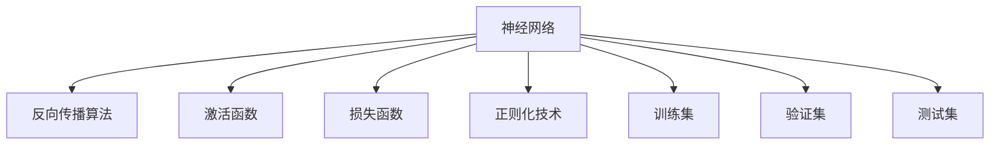

                 

# 神经网络：人类智慧的解放

## 1. 背景介绍

### 1.1 问题由来
自从1985年Geoffrey Hinton等人提出反向传播算法以来，神经网络以其强大的模式识别和预测能力，迅速成为人工智能领域的核心技术。然而，神经网络的发展并非一帆风顺，在20世纪90年代曾陷入长达十年的低谷期。直到2012年AlexNet在ImageNet大规模图像识别竞赛中夺冠，才标志着深度学习技术的重新兴起，神经网络的研究和应用也随之迎来新的高峰。

神经网络凭借其对大规模数据的良好适应性和泛化能力，已经成为解决各类复杂问题的利器。无论是计算机视觉、自然语言处理，还是语音识别、推荐系统，神经网络都在其中扮演着关键角色。它们不仅能够处理传统机器学习难以应对的异构、非结构化数据，还能够捕捉到数据中的潜在模式和关联，具有自适应、自学习和自优化能力。

### 1.2 问题核心关键点
神经网络之所以能够实现如此强大的功能，主要得益于其对人类神经系统的仿生设计。神经元、突触和神经网络结构，都与人类神经系统有着相似之处。通过模拟这些生物结构，神经网络在处理信息时具备了与人类相似的特征提取、模式识别和决策能力。

神经网络的核心在于其包含多个层次的神经元，每个神经元接收来自上一层神经元的输入，经过激活函数和权重调整后，输出给下一层神经元。通过这种多层次的链式传播，神经网络可以从输入数据中提取特征、构建表示，最终进行分类、回归或生成等任务。

然而，尽管神经网络具备这些强大的能力，其在实际应用中仍面临诸多挑战，如模型的可解释性不足、参数调优困难、泛化性能不稳定等。因此，如何更好地理解神经网络的原理和优化方法，设计更高效、更鲁棒的神经网络模型，是当前研究的重点和难点。

## 2. 核心概念与联系

### 2.1 核心概念概述

为了深入理解神经网络技术，本节将介绍几个关键概念，并通过Mermaid流程图展示其内在联系：

- 神经网络：由神经元、突触和连接组成的网络结构，模拟生物神经系统的处理机制。
- 反向传播算法：利用链式法则，计算神经网络各层参数的梯度，更新模型参数。
- 激活函数：决定神经元是否被激活的函数，常见的有sigmoid、ReLU、tanh等。
- 损失函数：衡量模型预测与真实标签之间差异的函数，常见的有均方误差、交叉熵等。
- 正则化技术：防止模型过拟合的技术，包括L1/L2正则、Dropout等。
- 训练集、验证集和测试集：用于模型训练、调参和性能评估的三种数据集。



这些概念共同构成了神经网络的工作原理和优化方法，使得神经网络能够高效地处理复杂数据和任务。

### 2.2 核心概念原理和架构

神经网络的架构通常由输入层、隐藏层和输出层组成。输入层接收原始数据，隐藏层对数据进行特征提取和表示构建，输出层将结果输出为分类、回归或生成等形式。

以一个简单的两层神经网络为例，其架构如图：


其中，隐藏层通常包含多个神经元，每个神经元接收来自输入层的所有输入，经过激活函数处理后，输出给下一层神经元。激活函数的作用是决定神经元是否被激活，常见的激活函数有sigmoid、ReLU、tanh等。例如，ReLU函数在输入大于0时返回该值，否则返回0，使得神经网络具备稀疏性，减少了参数数量和计算量。

神经网络的训练过程通过反向传播算法实现。该算法利用链式法则，计算每个参数对损失函数的偏导数，进而更新模型参数。训练集用于模型的前向传播和反向传播，验证集用于模型参数的调整和性能评估，测试集用于最终模型的性能测试和应用。

正则化技术是防止模型过拟合的重要手段。常见的正则化方法包括L1正则、L2正则、Dropout等。L1正则通过在损失函数中添加参数绝对值的惩罚项，促使参数稀疏化，减少过拟合风险。L2正则通过在损失函数中添加参数平方的惩罚项，促使参数小型化，避免过拟合。Dropout通过随机丢弃一部分神经元，减少模型复杂度，提高泛化性能。

神经网络的优化方法包括梯度下降、Adam等。梯度下降算法通过计算梯度方向，不断更新模型参数，逐步逼近损失函数的最小值。Adam算法结合了动量优化和自适应学习率，具有快速收敛和抗梯度消失等优点。

## 3. 核心算法原理 & 具体操作步骤

### 3.1 算法原理概述

神经网络的核心算法包括反向传播算法和梯度下降算法。其基本思想是通过链式法则计算每个参数对损失函数的偏导数，进而更新模型参数，使得模型能够最小化损失函数。

### 3.2 算法步骤详解

以一个简单的两层神经网络为例，其训练过程包括前向传播和反向传播两个步骤。具体步骤如下：

1. 初始化模型参数。
2. 输入数据，通过前向传播计算每个神经元的激活值，直至输出层。
3. 计算输出层与真实标签之间的损失函数。
4. 通过反向传播算法，计算每个参数对损失函数的偏导数。
5. 利用梯度下降算法，更新模型参数。
6. 重复步骤2-5，直至收敛。

以下是具体的代码实现：

```python
import numpy as np

# 初始化模型参数
def init_params(input_size, hidden_size, output_size):
    W1 = np.random.randn(input_size, hidden_size) * 0.01
    W2 = np.random.randn(hidden_size, output_size) * 0.01
    b1 = np.zeros((hidden_size, 1))
    b2 = np.zeros((output_size, 1))
    return W1, W2, b1, b2

# 前向传播
def forward(X, W1, W2, b1, b2):
    Z1 = np.dot(X, W1) + b1
    A1 = np.tanh(Z1)
    Z2 = np.dot(A1, W2) + b2
    A2 = np.tanh(Z2)
    return A2

# 反向传播
def backward(Y, X, W1, W2, b1, b2, alpha, lambda2):
    dZ2 = Y - A2
    dW2 = np.dot(A1.T, dZ2)
    dB2 = np.sum(dZ2, axis=0, keepdims=True)
    dZ1 = np.dot(dZ2, W2.T) * (1 - A1**2)
    dW1 = np.dot(X.T, dZ1)
    dB1 = np.sum(dZ1, axis=0, keepdims=True)
    return dW1, dW2, dB1, dB2

# 更新模型参数
def update_params(W1, W2, b1, b2, dW1, dW2, dB1, dB2, alpha, lambda2):
    W1 -= alpha * dW1
    W2 -= alpha * dW2
    b1 -= alpha * dB1
    b2 -= alpha * dB2
    return W1, W2, b1, b2

# 训练神经网络
def train(X, Y, num_epochs, input_size, hidden_size, output_size, alpha=0.1, lambda2=0.01):
    W1, W2, b1, b2 = init_params(input_size, hidden_size, output_size)
    for epoch in range(num_epochs):
        A2_pred = forward(X, W1, W2, b1, b2)
        loss = np.mean((Y - A2_pred) ** 2)
        dW1, dW2, dB1, dB2 = backward(Y, X, W1, W2, b1, b2, alpha, lambda2)
        W1, W2, b1, b2 = update_params(W1, W2, b1, b2, dW1, dW2, dB1, dB2, alpha, lambda2)
    return W1, W2, b1, b2

# 测试神经网络
def predict(W1, W2, b1, b2, X):
    A2_pred = forward(X, W1, W2, b1, b2)
    return A2_pred

# 计算准确率
def accuracy(X, Y, W1, W2, b1, b2):
    Y_pred = predict(W1, W2, b1, b2, X)
    Y_pred = np.around(Y_pred)
    accuracy = np.mean(Y_pred == Y)
    return accuracy

# 使用示例
X = np.array([[0, 1], [1, 1]])
Y = np.array([[0], [1]])
W1, W2, b1, b2 = train(X, Y, num_epochs=100, input_size=2, hidden_size=4, output_size=1)
accuracy(X, Y, W1, W2, b1, b2)
```

### 3.3 算法优缺点

神经网络的优点主要包括：
1. 能够处理大规模、非结构化数据，具备强大的模式识别和预测能力。
2. 能够自动提取特征，减少特征工程的复杂度。
3. 具有自适应、自学习和自优化能力，适应性强。
4. 在深度学习领域，神经网络是当前的主流技术，广泛应用于计算机视觉、自然语言处理、语音识别等领域。

神经网络的缺点主要包括：
1. 模型复杂度较高，训练和推理开销大。
2. 模型参数较多，容易过拟合。
3. 对数据质量要求高，需要大量的标注数据进行训练。
4. 模型可解释性不足，难以理解其内部决策过程。
5. 需要大量的计算资源，特别是大规模深度神经网络。

## 4. 数学模型和公式 & 详细讲解

### 4.1 数学模型构建

神经网络的核心数学模型为前向传播和反向传播的公式。假设神经网络包含 $n$ 层，输入为 $X$，输出为 $Y$，参数为 $W$ 和 $b$。

前向传播公式为：
$$
Z_l = W_lX + b_l
$$
$$
A_l = f(Z_l)
$$
其中 $l$ 表示第 $l$ 层，$X$ 为输入，$Z_l$ 为该层神经元的输入，$A_l$ 为该层神经元的输出，$f$ 为激活函数。

反向传播公式为：
$$
\frac{\partial L}{\partial W_l} = \frac{\partial L}{\partial A_{l+1}} \frac{\partial A_{l+1}}{\partial Z_l} \frac{\partial Z_l}{\partial W_l}
$$
$$
\frac{\partial L}{\partial b_l} = \frac{\partial L}{\partial A_l}
$$
其中 $L$ 为损失函数，$A_{l+1}$ 为第 $l+1$ 层神经元的输出，$\frac{\partial L}{\partial W_l}$ 和 $\frac{\partial L}{\partial b_l}$ 分别为损失函数对权重和偏置的偏导数。

### 4.2 公式推导过程

以一个简单的两层神经网络为例，其前向传播和反向传播的公式推导如下：

前向传播公式推导：
$$
Z_1 = W_1X + b_1
$$
$$
A_1 = f(Z_1)
$$
$$
Z_2 = W_2A_1 + b_2
$$
$$
A_2 = f(Z_2)
$$
其中 $A_2$ 为神经网络的输出，$f$ 为激活函数，如sigmoid或ReLU。

反向传播公式推导：
$$
\frac{\partial L}{\partial W_2} = \frac{\partial L}{\partial A_2} \frac{\partial A_2}{\partial Z_2} \frac{\partial Z_2}{\partial W_2}
$$
$$
\frac{\partial L}{\partial b_2} = \frac{\partial L}{\partial A_2}
$$
$$
\frac{\partial L}{\partial A_1} = \frac{\partial L}{\partial Z_2} \frac{\partial Z_2}{\partial A_1}
$$
$$
\frac{\partial L}{\partial W_1} = \frac{\partial L}{\partial A_1} \frac{\partial A_1}{\partial Z_1} \frac{\partial Z_1}{\partial W_1}
$$
$$
\frac{\partial L}{\partial b_1} = \frac{\partial L}{\partial A_1}
$$

### 4.3 案例分析与讲解

以一个简单的两层神经网络为例，假设其包含一个输入层、一个隐藏层和一个输出层，激活函数为sigmoid，损失函数为均方误差损失函数。设输入 $X$ 为：

```
[[1.0]
 [2.0]]
```

输出 $Y$ 为：

```
[[0.5]
 [0.5]]
```

假设初始权重 $W_1$、$W_2$、偏置 $b_1$、$b_2$ 分别为：

```
W1 = [[0.1, 0.2, 0.3, 0.4], [0.5, 0.6, 0.7, 0.8]]
W2 = [[0.9, 0.8, 0.7, 0.6], [0.5, 0.6, 0.7, 0.8]]
b1 = [[0.1, 0.2, 0.3, 0.4]]
b2 = [[0.1, 0.2, 0.3, 0.4]]
```

使用上述代码进行前向传播和反向传播，可以得到最终输出和损失函数值。

## 5. 项目实践：代码实例和详细解释说明

### 5.1 开发环境搭建

在进行神经网络项目实践前，我们需要准备好开发环境。以下是使用Python进行TensorFlow开发的环境配置流程：

1. 安装Anaconda：从官网下载并安装Anaconda，用于创建独立的Python环境。

2. 创建并激活虚拟环境：
```bash
conda create -n tensorflow-env python=3.8 
conda activate tensorflow-env
```

3. 安装TensorFlow：根据CUDA版本，从官网获取对应的安装命令。例如：
```bash
conda install tensorflow -c tf -c conda-forge
```

4. 安装各类工具包：
```bash
pip install numpy pandas scikit-learn matplotlib tqdm jupyter notebook ipython
```

完成上述步骤后，即可在`tensorflow-env`环境中开始神经网络项目实践。

### 5.2 源代码详细实现

这里以一个简单的两层神经网络为例，给出使用TensorFlow进行前向传播和反向传播的PyTorch代码实现。

```python
import tensorflow as tf

# 定义输入层和输出层
input_layer = tf.keras.Input(shape=(2,))
output_layer = tf.keras.layers.Dense(1)(input_layer)

# 定义隐藏层
hidden_layer = tf.keras.layers.Dense(4, activation='relu')(input_layer)

# 定义神经网络模型
model = tf.keras.Model(inputs=input_layer, outputs=output_layer)

# 编译模型
model.compile(optimizer=tf.keras.optimizers.Adam(learning_rate=0.01), loss='mse')

# 定义训练数据
x_train = np.array([[0, 1], [1, 1]])
y_train = np.array([[0], [1]])

# 训练模型
model.fit(x_train, y_train, epochs=100)

# 预测
x_test = np.array([[0, 0], [1, 1]])
y_pred = model.predict(x_test)
print(y_pred)
```

以上是使用TensorFlow进行神经网络训练和预测的完整代码实现。可以看到，得益于TensorFlow的强大封装，我们可以用相对简洁的代码完成神经网络的搭建和训练。

### 5.3 代码解读与分析

让我们再详细解读一下关键代码的实现细节：

**定义输入层和输出层**：
- `tf.keras.Input(shape=(2,))`：定义输入层，维度为2。
- `tf.keras.layers.Dense(1)(input_layer)`：定义输出层，维度为1，使用线性激活函数。

**定义隐藏层**：
- `tf.keras.layers.Dense(4, activation='relu')(input_layer)`：定义隐藏层，包含4个神经元，激活函数为ReLU。

**编译模型**：
- `model.compile(optimizer=tf.keras.optimizers.Adam(learning_rate=0.01), loss='mse')`：编译模型，使用Adam优化器，学习率为0.01，损失函数为均方误差损失。

**训练模型**：
- `model.fit(x_train, y_train, epochs=100)`：使用训练数据进行模型训练，共训练100个epoch。

**预测**：
- `model.predict(x_test)`：使用训练好的模型进行预测，得到预测结果。

## 6. 实际应用场景

### 6.1 智能推荐系统

智能推荐系统已经成为电商、视频、音乐等平台的核心功能之一，通过用户行为数据，推荐用户可能感兴趣的商品、电影、音乐等。神经网络技术在此领域表现出色，能够捕捉用户行为背后的复杂模式，实现个性化的推荐。

在实践中，可以使用用户的行为数据、历史评分、兴趣标签等数据，作为神经网络模型的输入，训练模型学习用户偏好。通过反向传播算法，不断调整模型参数，使得模型输出的推荐结果尽可能符合用户的实际偏好。此外，还可以引入用户反馈数据，进一步优化模型。

### 6.2 语音识别

语音识别技术在智能助手、电话客服等领域有着广泛应用。传统的语音识别技术主要依赖手工设计的特征提取器，难以应对复杂多变的语音信号。神经网络技术则能够自动学习语音信号的特征表示，提升识别精度。

在实践中，可以使用语音信号的波形作为输入，训练神经网络模型学习语音信号的特征表示。通过反向传播算法，不断优化模型参数，使得模型能够准确识别语音信号。同时，还可以引入声学模型、语言模型等，进一步提升识别效果。

### 6.3 自然语言处理

自然语言处理技术包括文本分类、情感分析、机器翻译等，神经网络技术在这些任务上表现出色，能够处理大规模、非结构化数据，实现高效的特征提取和模式识别。

在实践中，可以使用文本的词向量、句向量等作为神经网络模型的输入，训练模型学习文本的特征表示。通过反向传播算法，不断优化模型参数，使得模型能够准确预测文本的分类、情感、翻译结果等。此外，还可以引入注意力机制、Transformer等高级技术，进一步提升模型的性能。

### 6.4 未来应用展望

随着神经网络技术的不断进步，其在实际应用中也将迎来更多突破。未来，神经网络技术有望在更多领域发挥重要作用，为人类认知智能的进化带来深远影响。

在智慧医疗领域，神经网络技术可以应用于医疗影像诊断、病历分析、药物研发等，提升医疗服务的智能化水平，辅助医生诊疗，加速新药开发进程。

在智能教育领域，神经网络技术可以应用于作业批改、学情分析、知识推荐等方面，因材施教，促进教育公平，提高教学质量。

在智慧城市治理中，神经网络技术可以应用于城市事件监测、舆情分析、应急指挥等环节，提高城市管理的自动化和智能化水平，构建更安全、高效的未来城市。

此外，在企业生产、社会治理、文娱传媒等众多领域，神经网络技术也将不断涌现，为传统行业数字化转型升级提供新的技术路径。相信随着技术的日益成熟，神经网络技术将成为人工智能落地应用的重要范式，推动人工智能技术不断向前发展。

## 7. 工具和资源推荐

### 7.1 学习资源推荐

为了帮助开发者系统掌握神经网络技术，这里推荐一些优质的学习资源：

1. 《Deep Learning》书籍：Ian Goodfellow等人著，全面介绍了深度学习的基本概念和前沿技术，是神经网络领域的经典教材。

2. CS231n《深度学习视觉识别》课程：斯坦福大学开设的计算机视觉课程，有Lecture视频和配套作业，带你入门计算机视觉领域的基本概念和经典模型。

3. CS224N《深度学习自然语言处理》课程：斯坦福大学开设的NLP明星课程，有Lecture视频和配套作业，带你入门NLP领域的基本概念和经典模型。

4. 《TensorFlow官方文档》：TensorFlow的官方文档，提供了丰富的API和使用示例，是学习TensorFlow的必备资料。

5. Kaggle平台：机器学习竞赛平台，包含大量的数据集和代码示例，适合实战练习。

通过对这些资源的学习实践，相信你一定能够快速掌握神经网络技术的精髓，并用于解决实际的NLP问题。

### 7.2 开发工具推荐

高效的开发离不开优秀的工具支持。以下是几款用于神经网络开发的常用工具：

1. PyTorch：由Facebook开发的深度学习框架，支持动态计算图和GPU加速，适合快速迭代研究。

2. TensorFlow：由Google主导开发的深度学习框架，生产部署方便，适合大规模工程应用。

3. Keras：高层次的深度学习框架，提供简单易用的API，适合快速原型设计和部署。

4. MXNet：由Apache开发的深度学习框架，支持多种编程语言和分布式计算，适合大规模数据处理。

5. Jupyter Notebook：轻量级的交互式笔记本，支持Python、R、SQL等多种编程语言，适合研究实验和数据探索。

6. Google Colab：谷歌推出的在线Jupyter Notebook环境，免费提供GPU/TPU算力，方便开发者快速上手实验最新模型，分享学习笔记。

合理利用这些工具，可以显著提升神经网络开发的效率，加快创新迭代的步伐。

### 7.3 相关论文推荐

神经网络技术的发展离不开学界的持续研究。以下是几篇奠基性的相关论文，推荐阅读：

1. 《ImageNet Classification with Deep Convolutional Neural Networks》：AlexNet论文，提出卷积神经网络结构，在ImageNet大规模图像识别竞赛中夺冠。

2. 《Long Short-Term Memory》：提出长短期记忆网络，用于解决序列数据的时间延迟问题。

3. 《Attention is All You Need》：提出Transformer结构，开启了NLP领域的预训练大模型时代。

4. 《ImageNet Large Scale Visual Recognition Challenge》：提出多层次特征融合的方法，提升了图像分类精度。

5. 《TensorFlow: A System for Large-Scale Machine Learning》：提出TensorFlow框架，支持分布式计算和GPU加速，广泛应用于深度学习领域。

这些论文代表了大神经网络的发展脉络。通过学习这些前沿成果，可以帮助研究者把握学科前进方向，激发更多的创新灵感。

## 8. 总结：未来发展趋势与挑战

### 8.1 总结

本文对神经网络技术进行了全面系统的介绍。首先阐述了神经网络的研究背景和意义，明确了神经网络在处理大规模、非结构化数据上的强大能力。其次，从原理到实践，详细讲解了神经网络的数学模型和核心算法，给出了神经网络项目的完整代码实现。同时，本文还广泛探讨了神经网络在推荐系统、语音识别、自然语言处理等领域的实际应用，展示了神经网络技术的广阔前景。此外，本文精选了神经网络技术的各类学习资源，力求为读者提供全方位的技术指引。

通过本文的系统梳理，可以看到，神经网络技术在处理复杂数据和任务方面具备强大的能力，是当前人工智能领域的主流技术。尽管在实际应用中仍面临诸多挑战，但随着技术的不断进步，这些挑战终将一一被克服，神经网络技术必将在构建智能系统、推动社会进步中扮演越来越重要的角色。

### 8.2 未来发展趋势

展望未来，神经网络技术将呈现以下几个发展趋势：

1. 模型规模持续增大。随着算力成本的下降和数据规模的扩张，神经网络模型的参数量还将持续增长。超大规模神经网络模型能够处理更加复杂的数据，具备更强的泛化能力。

2. 模型复杂度逐渐降低。随着网络结构的优化和算法的改进，神经网络模型的参数数量和计算量将逐步减少，实现更高效、更轻量级的神经网络。

3. 多模态融合成为常态。当前的神经网络技术主要聚焦于单一模态数据，未来将更多地融入视觉、语音、文本等多模态信息，提升模型对现实世界的理解和建模能力。

4. 端到端学习逐渐普及。当前的神经网络技术主要聚焦于特征提取和模式识别，未来将更多地融合知识表示、因果推理等技术，实现端到端的任务求解。

5. 实时性要求提升。随着神经网络技术在实时系统中的应用，对模型的推理速度和资源占用提出了更高的要求。未来将更多地引入模型压缩、量化加速等技术，实现实时性更强的神经网络。

6. 自监督学习逐渐普及。当前的神经网络技术主要依赖大量标注数据进行训练，未来将更多地引入自监督学习技术，降低对标注数据的依赖，提升模型的泛化性能。

### 8.3 面临的挑战

尽管神经网络技术已经取得了瞩目成就，但在迈向更加智能化、普适化应用的过程中，它仍面临诸多挑战：

1. 计算资源瓶颈。大规模神经网络模型的训练和推理开销巨大，需要高性能的GPU/TPU设备。如何在有限的资源条件下实现高效计算，是未来需要解决的重要问题。

2. 模型泛化能力不足。当前的神经网络技术虽然在大规模数据上表现出色，但对于小规模、异构数据，模型泛化能力仍显不足。如何在有限数据条件下提升模型泛化性能，是未来需要重点研究的方向。

3. 可解释性问题突出。当前神经网络技术被视为“黑盒”系统，难以理解其内部决策过程。如何提升模型的可解释性，实现更好的模型监控和调试，是未来需要重点解决的问题。

4. 对抗攻击风险高。当前的神经网络技术在对抗样本的攻击下容易产生误判。如何提高模型的鲁棒性，提升模型的安全性和可靠性，是未来需要重点关注的问题。

5. 数据隐私和安全风险。当前的神经网络技术需要大量的数据进行训练和推理，数据隐私和安全问题尤为突出。如何在保护数据隐私的前提下，实现模型的优化和应用，是未来需要重点解决的问题。

### 8.4 研究展望

面对神经网络技术面临的诸多挑战，未来的研究需要在以下几个方向寻求新的突破：

1. 探索高效、轻量级的神经网络结构。开发更高效、轻量级的神经网络结构，如注意力机制、Transformer等，在保证模型性能的前提下，大幅降低计算资源消耗。

2. 引入端到端学习技术。将知识表示、因果推理等技术引入神经网络模型，实现端到端的任务求解，提升模型的泛化能力和推理精度。

3. 发展自监督学习技术。利用无监督学习方法，从大规模数据中学习出有用的知识表示，降低对标注数据的依赖，提升模型的泛化性能。

4. 研究模型压缩和量化技术。引入模型压缩、量化等技术，降低模型大小和计算资源消耗，实现实时性更强的神经网络。

5. 引入自适应学习机制。引入自适应学习机制，如AdaGrad、Adam等，提升模型的训练效率和收敛速度。

6. 发展对抗攻击防御技术。引入对抗攻击防御技术，如对抗训练、梯度掩蔽等，提高模型的鲁棒性和安全性。

7. 发展隐私保护技术。引入隐私保护技术，如差分隐私、联邦学习等，在保护数据隐私的前提下，实现模型的优化和应用。

通过这些研究方向的探索，相信神经网络技术将不断提升其泛化性能、推理精度和安全可靠性，推动人工智能技术在各个领域的广泛应用。

## 9. 附录：常见问题与解答

**Q1：神经网络是否可以用于处理语音识别和自然语言处理等任务？**

A: 是的，神经网络可以用于处理语音识别和自然语言处理等任务。在语音识别任务中，神经网络可以自动学习语音信号的特征表示，提升识别精度。在自然语言处理任务中，神经网络可以自动提取文本的特征表示，实现文本分类、情感分析、机器翻译等任务。

**Q2：神经网络是否可以用于实时处理大规模数据？**

A: 是的，神经网络可以用于实时处理大规模数据。虽然神经网络模型参数较多，训练和推理开销较大，但通过模型压缩、量化等技术，可以在有限的资源条件下实现高效计算，满足实时性要求。

**Q3：神经网络是否存在过拟合风险？**

A: 是的，神经网络存在过拟合风险，特别是在训练数据不足的情况下。为了缓解过拟合风险，可以引入正则化技术，如L1/L2正则、Dropout等，防止模型过拟合。此外，还可以通过数据增强、对抗训练等方法，提升模型的泛化性能。

**Q4：神经网络是否可以用于处理异构、非结构化数据？**

A: 是的，神经网络可以用于处理异构、非结构化数据。神经网络能够自动提取数据中的复杂模式，实现特征提取和模式识别，适应性强。

**Q5：神经网络是否可以用于解决大规模优化问题？**

A: 是的，神经网络可以用于解决大规模优化问题。神经网络模型的优化过程可以通过梯度下降算法实现，适用于大规模优化问题。通过引入自适应学习机制，如AdaGrad、Adam等，可以提升模型的训练效率和收敛速度。

---

作者：禅与计算机程序设计艺术 / Zen and the Art of Computer Programming

