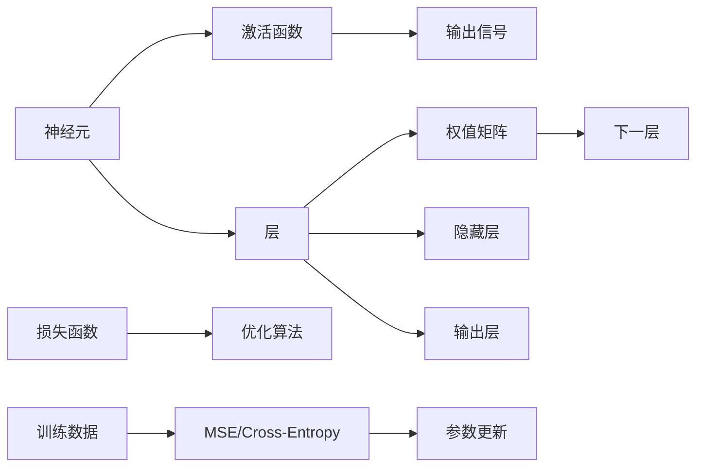

                 

## 1. 背景介绍

### 1.1 问题由来

在过去的几十年中，神经网络（Neural Networks）一直是人工智能和机器学习领域的重要研究课题。其背后的逻辑，即通过模拟人脑神经元的工作机制，来模仿和学习复杂的数据模式，不仅引发了计算机科学和工程界的极大兴趣，也为解决各类复杂问题提供了新的途径。

自1989年第一篇关于深度学习（Deep Learning）的论文发表以来，神经网络领域取得了迅猛发展，尤其在图像识别、语音处理、自然语言处理等领域取得了重大的突破。如今，深度学习技术已经成为了人工智能研究的核心方向之一，广泛应用于自动驾驶、智能推荐、智能客服等众多领域。

### 1.2 问题核心关键点

神经网络的研究核心在于理解如何通过大规模的训练数据，学习数据的内在规律，从而实现对复杂数据的自动处理和推理。关键问题包括：

1. **数据预处理**：如何高效地处理和表示大规模数据，提取关键特征。
2. **模型设计**：选择合适的模型结构，确定神经元之间的连接方式和激活函数。
3. **优化算法**：设计高效的训练算法，如随机梯度下降（SGD）、Adam等，以便快速迭代优化模型参数。
4. **泛化能力**：确保模型在未见过的数据上仍能保持良好表现，避免过拟合。
5. **稀疏性**：如何在减少参数量的同时保持模型性能，是深度学习研究的重要方向。

这些问题不仅对学术界有着深远影响，也为业界提供了众多应用机会。当前，神经网络技术已经应用于诸多实际场景，如自然语言处理、计算机视觉、推荐系统等，为各个行业带来了显著的收益。

### 1.3 问题研究意义

深入理解神经网络的研究，不仅能够为解决具体问题提供强有力的技术支持，还能激发新的技术思路，推动整个人工智能领域的发展。神经网络的研究意义主要体现在以下几个方面：

1. **理论探索**：神经网络作为研究复杂系统的重要工具，其本身的研究可以推动认知科学的进步，为理解大脑工作机制提供新的视角。
2. **应用广泛**：深度学习技术的快速发展，使神经网络在各行各业得到广泛应用，极大提高了生产力。
3. **经济效益**：神经网络在商业上的应用可以产生显著的经济效益，如在广告推荐、金融风险预测等领域。
4. **伦理与社会影响**：神经网络的广泛应用也引发了一系列伦理和社会问题，如隐私保护、公平性等，对其进行研究具有重要意义。

总之，神经网络不仅在学术界具有重要地位，在实际应用中也展现了巨大的潜力和价值。研究神经网络不仅能够帮助解决具体的技术问题，还能推动人工智能和人类社会的进步。

## 2. 核心概念与联系

### 2.1 核心概念概述

神经网络作为人工智能领域的研究热点，其核心概念和架构可以简单总结如下：

- **神经元（Neuron）**：神经网络的构建基石，模拟大脑中神经元的工作方式。每个神经元接收输入信号，经过激活函数处理后，产生输出信号。
- **层（Layer）**：神经元组成的网络层，通常包括输入层、隐藏层、输出层。不同层之间通过权值矩阵相连，形成复杂的神经网络。
- **激活函数（Activation Function）**：引入非线性变换，增加网络的非线性拟合能力。常用的激活函数包括sigmoid、ReLU等。
- **损失函数（Loss Function）**：度量模型输出与真实标签之间的差异，常用的损失函数包括均方误差、交叉熵等。
- **优化算法（Optimization Algorithm）**：用于训练神经网络，最小化损失函数，如随机梯度下降（SGD）、Adam等。

这些概念构成了神经网络的基本框架，彼此之间紧密联系，共同作用，以实现对数据的自动学习与处理。

### 2.2 核心概念原理和架构的 Mermaid 流程图



这个流程图展示了神经网络的基本架构和训练过程。

1. 神经元接收输入信号。
2. 激活函数对其进行处理，产生输出信号。
3. 层与层之间通过权值矩阵相连。
4. 损失函数衡量模型输出与真实标签之间的差异。
5. 优化算法根据损失函数对模型参数进行更新。

### 2.3 概念间的联系

这些概念之间存在紧密的联系：

- **神经元与激活函数**：激活函数引入非线性变换，使得神经元可以处理更复杂的数据模式。
- **层与权值矩阵**：不同层通过权值矩阵相连，形成了整个网络的拓扑结构。
- **损失函数与优化算法**：优化算法通过不断调整参数，使得损失函数值最小化。

通过理解这些核心概念及其间的联系，可以更好地掌握神经网络的工作原理和训练流程。

## 3. 核心算法原理 & 具体操作步骤

### 3.1 算法原理概述

神经网络的训练主要分为两个步骤：前向传播和反向传播。

**前向传播（Forward Propagation）**：将输入数据通过网络层进行逐层计算，得到最终输出。每个神经元都按照激活函数进行计算，逐层传递。

**反向传播（Backpropagation）**：利用输出误差反推至输入层，更新网络参数。具体来说，通过链式法则计算输出误差对每个参数的梯度，然后使用优化算法调整参数，使得误差最小化。

### 3.2 算法步骤详解

神经网络的训练主要包括以下几个关键步骤：

**Step 1: 准备数据集**
- 收集训练数据集和验证数据集。
- 数据预处理，包括归一化、标准化等。
- 划分数据集，将其分为训练集、验证集、测试集。

**Step 2: 设计模型架构**
- 确定网络层数和每层神经元数量。
- 选择激活函数和优化算法。
- 设计损失函数。

**Step 3: 初始化模型参数**
- 对所有模型参数进行随机初始化。
- 设定学习率和训练轮数。

**Step 4: 前向传播**
- 将训练数据输入模型，计算每个神经元的输出。
- 重复此过程，直到输出层。

**Step 5: 计算损失**
- 根据真实标签和模型输出计算损失值。
- 将损失值记录到训练日志中。

**Step 6: 反向传播**
- 通过链式法则计算每个参数的梯度。
- 使用优化算法更新参数。

**Step 7: 验证与调整**
- 每隔一定轮数在验证集上评估模型性能。
- 根据性能调整学习率和模型结构。

**Step 8: 测试与部署**
- 在测试集上评估模型性能。
- 部署模型至生产环境。

### 3.3 算法优缺点

神经网络算法的优点包括：

1. **强大的泛化能力**：通过大量数据训练，神经网络可以有效学习数据的复杂特征。
2. **灵活的模型结构**：不同架构的神经网络可以应对多种问题。
3. **高效自动化的优化**：优化算法可以自动调整参数，减少手动调参的负担。

其缺点主要体现在：

1. **模型复杂度高**：神经网络参数量大，计算资源消耗高。
2. **训练时间长**：特别是在大数据集上，训练过程较慢。
3. **局部最优**：容易陷入局部最优，需要多种优化策略和技巧来克服。
4. **过拟合问题**：在训练过程中，神经网络容易过拟合训练数据，需要采取正则化等方法。

### 3.4 算法应用领域

神经网络的应用领域非常广泛，涉及自然语言处理、计算机视觉、语音识别、推荐系统等多个领域。以下是一些典型的应用：

1. **图像识别**：通过卷积神经网络（CNN）对图像进行分类和识别，广泛应用于无人驾驶、医疗影像等领域。
2. **语音识别**：使用循环神经网络（RNN）处理语音信号，实现自动语音识别。
3. **自然语言处理**：通过序列模型处理自然语言数据，如情感分析、机器翻译等。
4. **推荐系统**：利用神经网络模型进行个性化推荐，提升用户体验。
5. **游戏AI**：使用神经网络构建智能游戏玩家，提高游戏AI的决策水平。

## 4. 数学模型和公式 & 详细讲解 & 举例说明

### 4.1 数学模型构建

神经网络是一种前馈神经网络（Feedforward Neural Network），通常包含多层神经元。以一个典型的多层感知机（Multilayer Perceptron，MLP）为例，其数学模型可以表示为：

$$
y = f(\mathbf{W} \mathbf{x} + \mathbf{b})
$$

其中，$f$ 表示激活函数，$\mathbf{W}$ 为权重矩阵，$\mathbf{x}$ 为输入向量，$\mathbf{b}$ 为偏置项。对于深层神经网络，每个隐藏层都通过上述方式计算输出。

### 4.2 公式推导过程

以一个简单的三层神经网络为例，进行详细推导。假设输入层有 $n_1$ 个神经元，隐藏层有 $n_2$ 个神经元，输出层有 $n_3$ 个神经元。则该网络的结构可以表示为：

- 输入层到隐藏层：$y_1 = f(\mathbf{W}_{11} \mathbf{x} + \mathbf{b}_1)$
- 隐藏层到输出层：$y_2 = f(\mathbf{W}_{21} y_1 + \mathbf{b}_2)$
- 输出层：$y_3 = f(\mathbf{W}_{31} y_2 + \mathbf{b}_3)$

其中，$y_i$ 表示第 $i$ 层的输出，$\mathbf{W}_{ij}$ 为从第 $i$ 层到第 $j$ 层的权重矩阵，$\mathbf{b}_i$ 为第 $i$ 层的偏置项。

### 4.3 案例分析与讲解

以手写数字识别为例，说明神经网络的训练过程。

**Step 1: 数据准备**
- 收集手写数字图片，标记每个数字。
- 对图片进行归一化处理。

**Step 2: 模型设计**
- 设计三层神经网络，其中输入层有784个神经元，隐藏层有256个神经元，输出层有10个神经元。
- 选择ReLU作为激活函数，选择交叉熵损失函数。
- 选择随机梯度下降作为优化算法。

**Step 3: 训练**
- 将数据集分为训练集和验证集。
- 对每个批次数据进行前向传播和反向传播，计算损失值和梯度。
- 使用SGD算法更新参数。
- 在验证集上评估模型性能，调整学习率。

**Step 4: 测试**
- 使用测试集评估模型性能。
- 输出预测结果。

## 5. 项目实践：代码实例和详细解释说明

### 5.1 开发环境搭建

神经网络的开发环境搭建主要包括以下步骤：

1. 安装Python：下载并安装Python，推荐使用3.6及以上版本。
2. 安装相关库：安装Numpy、Pandas、Scikit-learn等常用库，可以使用conda或pip进行安装。
3. 安装深度学习框架：安装TensorFlow、PyTorch等深度学习框架，推荐使用GPU版本。
4. 安装深度学习模型库：安装Keras、MXNet等深度学习模型库，便于快速构建模型。

### 5.2 源代码详细实现

以使用PyTorch框架实现手写数字识别为例，给出完整的代码实现。

```python
import torch
import torch.nn as nn
import torch.optim as optim
from torchvision import datasets, transforms

# 数据预处理
transform = transforms.Compose([
    transforms.ToTensor(),
    transforms.Normalize((0.1307,), (0.3081,))
])

# 加载数据集
trainset = datasets.MNIST(root='./data', train=True, download=True, transform=transform)
trainloader = torch.utils.data.DataLoader(trainset, batch_size=64, shuffle=True)

# 定义模型
class Net(nn.Module):
    def __init__(self):
        super(Net, self).__init__()
        self.fc1 = nn.Linear(784, 512)
        self.fc2 = nn.Linear(512, 256)
        self.fc3 = nn.Linear(256, 10)
        self.relu = nn.ReLU()

    def forward(self, x):
        x = self.relu(self.fc1(x.view(-1, 784)))
        x = self.relu(self.fc2(x))
        x = self.fc3(x)
        return x

# 定义损失函数和优化器
net = Net()
criterion = nn.CrossEntropyLoss()
optimizer = optim.SGD(net.parameters(), lr=0.01, momentum=0.5)

# 训练
for epoch in range(10):
    running_loss = 0.0
    for i, data in enumerate(trainloader, 0):
        inputs, labels = data
        optimizer.zero_grad()
        outputs = net(inputs)
        loss = criterion(outputs, labels)
        loss.backward()
        optimizer.step()
        running_loss += loss.item()
        if i % 2000 == 1999:  
            print('[%d, %5d] loss: %.3f' % (epoch + 1, i + 1, running_loss / 2000))
            running_loss = 0.0

# 测试
correct = 0
total = 0
with torch.no_grad():
    for data in testloader:
        images, labels = data
        outputs = net(images)
        _, predicted = torch.max(outputs.data, 1)
        total += labels.size(0)
        correct += (predicted == labels).sum().item()

print('Accuracy of the network on the 10000 test images: %d %%' % (100 * correct / total))
```

### 5.3 代码解读与分析

**Net类定义**：
- `__init__`方法：初始化模型参数。
- `forward`方法：定义前向传播计算过程。

**训练循环**：
- 对每个批次数据进行前向传播和反向传播。
- 使用SGD算法更新参数。
- 在每个epoch后输出训练损失。

**测试循环**：
- 对测试集进行预测，并计算准确率。

## 6. 实际应用场景

### 6.1 医疗影像分析

神经网络在医疗影像分析中的应用尤为突出，如对X光片、CT扫描等影像数据进行自动诊断。通过深度学习技术，可以训练出能够识别癌症、骨折等疾病的神经网络模型，显著提高诊断效率和准确率。

### 6.2 自动驾驶

神经网络在自动驾驶中主要应用于图像识别和决策规划。通过卷积神经网络（CNN）对道路图像进行分类和特征提取，结合RNN处理时间序列数据，可以构建自动驾驶系统的感知和决策模块，提高行车安全和舒适性。

### 6.3 智能推荐

神经网络在智能推荐系统中被广泛应用，通过学习用户行为数据和商品特征，构建用户和商品间的关联关系，实现个性化推荐。基于深度学习技术的推荐系统，可以在海量数据中发现潜在关联，提升推荐准确率和用户体验。

### 6.4 未来应用展望

神经网络的应用领域将不断拓展，未来的趋势可能包括：

1. **多模态学习**：神经网络将更多地融合视觉、听觉、语言等多种模态数据，提升对复杂场景的建模能力。
2. **强化学习**：神经网络结合强化学习技术，实现智能体在环境中自适应决策，应用于游戏、机器人等领域。
3. **自适应网络**：神经网络将具备动态调整模型结构的能力，自适应不同任务的需求。
4. **分布式训练**：神经网络将在大规模分布式计算环境中训练，加速深度学习模型的研发和优化。
5. **联邦学习**：在保护用户隐私的前提下，神经网络模型将在分布式环境中进行联合训练，提高模型泛化能力。

## 7. 工具和资源推荐

### 7.1 学习资源推荐

为了深入理解神经网络，以下是一些推荐的学习资源：

1. 《深度学习》（Ian Goodfellow等著）：深度学习领域的经典教材，介绍了深度学习的基本概念和算法。
2. Coursera的深度学习课程（Andrew Ng）：由斯坦福大学教授Andrew Ng主讲，涵盖深度学习的基础和应用。
3. PyTorch官方文档：详细介绍了PyTorch的使用方法和API接口。
4. Kaggle数据竞赛：参与Kaggle的数据竞赛，在实践中学习深度学习技术。
5. TensorFlow官方文档：介绍TensorFlow的使用方法和API接口。

### 7.2 开发工具推荐

神经网络的开发工具有很多，以下是一些推荐：

1. PyTorch：易用性高，支持动态图，适合研究和原型开发。
2. TensorFlow：支持静态图和动态图，适合大规模生产部署。
3. Keras：基于TensorFlow和Theano，简单易用，适合快速原型开发。
4. MXNet：支持多种编程语言，适合大规模分布式计算。

### 7.3 相关论文推荐

神经网络的发展离不开众多学者的贡献，以下是一些经典论文：

1. A Few Useful Things to Know About Deep Learning（深度学习入门指南）：Yoshua Bengio等著，介绍了深度学习的基本概念和应用。
2. ImageNet Classification with Deep Convolutional Neural Networks（ImageNet分类：卷积神经网络）：Alex Krizhevsky等著，提出卷积神经网络在图像识别中的应用。
3. Learning Phrases and Sentences from Parallel Corpora（并行语料库上的短语和句子学习）：Yann LeCun等著，提出使用循环神经网络处理序列数据的思路。
4. Convolutional Neural Networks for Natural Language Processing（卷积神经网络在自然语言处理中的应用）：Kyunghyun Cho等著，提出卷积神经网络在文本处理中的应用。

## 8. 总结：未来发展趋势与挑战

### 8.1 研究成果总结

神经网络技术在过去几十年中取得了长足进步，广泛应用于图像识别、语音识别、自然语言处理等领域。当前，神经网络研究的主要方向包括：

1. **模型架构设计**：研究新的神经网络架构，如ResNet、Transformer等，提升模型的表现。
2. **优化算法改进**：研究新的优化算法，如AdamW、Adafactor等，提升模型的训练效率。
3. **数据高效利用**：研究数据增强、迁移学习等技术，提高模型在大规模数据上的表现。
4. **模型压缩与加速**：研究模型压缩、稀疏化等技术，提升模型的推理效率。

### 8.2 未来发展趋势

未来的神经网络研究可能包括以下几个方向：

1. **自适应网络**：研究神经网络具备动态调整结构的能力，以应对不同任务的需求。
2. **联邦学习**：研究分布式环境下的联合训练方法，保护用户隐私。
3. **多模态学习**：研究融合视觉、听觉、语言等多种模态数据的技术，提升模型的表现。
4. **分布式训练**：研究在大规模分布式计算环境中的训练方法，提高训练效率。
5. **强化学习**：研究神经网络结合强化学习技术，提升决策能力。

### 8.3 面临的挑战

尽管神经网络技术取得了显著进展，但仍面临诸多挑战：

1. **计算资源消耗**：神经网络参数量大，计算资源消耗高，需要高效的优化算法和计算设备。
2. **数据隐私保护**：大规模神经网络模型需要大量的标注数据，如何保护用户隐私成为一个重要问题。
3. **模型泛化能力**：神经网络容易过拟合训练数据，需要多种正则化技术和算法优化方法。
4. **解释性和可解释性**：神经网络模型的决策过程通常缺乏解释性，难以理解其内部机制。
5. **伦理与社会影响**：神经网络模型的应用可能带来伦理和社会问题，如就业取代、隐私侵犯等。

### 8.4 研究展望

未来的研究需要关注以下几个方面：

1. **模型解释性**：研究神经网络的解释性，提升模型的透明性和可解释性。
2. **隐私保护**：研究如何在大数据应用中保护用户隐私，确保数据安全。
3. **跨领域融合**：研究神经网络与其他AI技术的融合，提升系统的综合能力。
4. **自动化调参**：研究自动化调参方法，减少人工调参的负担。
5. **社会影响**：研究神经网络对社会的影响，确保技术应用的公正性和合理性。

## 9. 附录：常见问题与解答

**Q1: 神经网络为什么能够处理复杂任务？**

A: 神经网络通过多层非线性变换，可以学习并捕捉数据的复杂结构。每层神经元通过激活函数进行非线性变换，使得模型可以处理更加复杂的数据模式。

**Q2: 神经网络的训练过程如何避免过拟合？**

A: 神经网络容易过拟合训练数据，因此需要采用多种正则化技术，如L2正则化、Dropout等，限制模型的复杂度。同时，进行数据增强、模型集成等技术，提升模型的泛化能力。

**Q3: 神经网络在实际应用中如何处理缺失值？**

A: 神经网络无法直接处理缺失值，因此需要在使用前进行数据预处理，如均值填补、插值法等。对于缺失值较多的数据，可以使用数据增强等技术，增加数据的多样性。

**Q4: 神经网络的模型压缩和加速技术有哪些？**

A: 神经网络的模型压缩和加速技术包括模型剪枝、参数量化、稀疏化等。通过这些技术可以减少模型参数量，提高推理效率。

**Q5: 神经网络在工业界有哪些应用？**

A: 神经网络在工业界的应用包括图像识别、语音识别、自然语言处理、推荐系统、自动驾驶等。神经网络技术在各个领域都展现了巨大的潜力。

总之，神经网络技术具有强大的数据处理能力和泛化能力，已经成为人工智能研究的重要方向。通过深入理解神经网络的工作原理和训练方法，可以更好地应用这一技术，推动人工智能的不断进步。

---

作者：禅与计算机程序设计艺术 / Zen and the Art of Computer Programming

