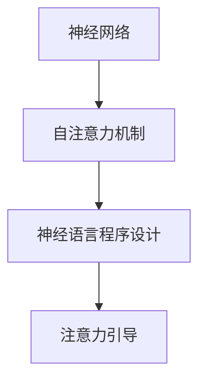

                 

## 1. 背景介绍

在深度学习领域，神经网络的应用已从图像识别、语音识别等感知任务，拓展到更高级的自然语言处理任务，如语言理解、生成和翻译。这些任务的本质是使机器具备类似人类的语言能力，能够在多种语言和文化背景下进行有效的交流和理解。然而，实现这一目标并不简单，传统的统计语言模型由于缺乏足够的语义表示能力，在处理复杂的语言现象时表现出明显的局限性。

近年来，基于神经网络的模型，特别是Transformer结构，因其卓越的性能而成为NLP任务的主流选择。Transformer的核心在于其自注意力机制(self-attention mechanism)，它打破了传统的基于位置的权重计算方法，使得模型能够动态地关注输入序列中与当前输出位置最相关的部分，从而大大提高了模型的表达能力和泛化能力。

然而，虽然自注意力机制能够有效提升模型的语言处理能力，但其本质依然是基于统计的，难以充分理解和运用人类的语言逻辑和语义结构。因此，如何将神经语言程序设计(neural program design)的思想引入到神经网络中，引导其学习更加丰富的语义表示，成为一个重要的研究方向。

## 2. 核心概念与联系

### 2.1 核心概念概述

为了理解注意力引导下的神经语言程序设计，我们需要先明确几个关键概念：

- **神经网络**：基于神经元节点的图结构，通过反向传播算法进行训练，以学习输入数据到输出数据的映射。
- **自注意力机制**：一种基于点积的注意力计算方法，能够动态地关注输入序列中与当前输出位置最相关的部分，显著提升模型的表示能力。
- **神经语言程序设计**：将程序的逻辑结构和运算规则通过神经网络模型编码，使机器能够理解和执行高级的逻辑和推理任务。
- **注意力引导**：通过特定的方法，引导神经网络在训练过程中关注输入序列中的特定部分，从而提升模型对于局部语义信息的捕捉能力。

这些概念之间有着紧密的联系，其中自注意力机制是神经语言程序设计的底层基础，而注意力引导则是在自注意力机制之上的进阶应用，能够进一步增强模型的表达能力和逻辑推理能力。

### 2.2 核心概念原理和架构的 Mermaid 流程图



这个流程图展示了自注意力机制、神经语言程序设计和注意力引导三者之间的逻辑关系：自注意力机制是神经网络模型的核心计算单元，神经语言程序设计则是通过自注意力机制实现的高级逻辑处理，而注意力引导则是在自注意力机制的基础上，通过特定的策略引导模型关注输入序列的特定部分，从而提升模型的表达能力。

## 3. 核心算法原理 & 具体操作步骤

### 3.1 算法原理概述

注意力引导下的神经语言程序设计，主要通过在自注意力机制的基础上引入额外的注意力机制，使得模型能够有针对性地关注输入序列中的特定部分，从而提升模型的表达能力和逻辑推理能力。这一过程主要分为以下几个步骤：

1. **输入编码**：将输入序列编码成一系列向量表示。
2. **自注意力计算**：使用自注意力机制计算输入序列中与当前输出位置最相关的部分。
3. **注意力引导**：在自注意力计算的基础上，引入额外的注意力机制，引导模型关注输入序列中的特定部分。
4. **逻辑推理**：在注意力引导的基础上，使用神经网络模型进行逻辑推理和计算。
5. **输出解码**：将模型输出解码为自然语言或逻辑表达式，完成语言的理解和生成。

### 3.2 算法步骤详解

#### 3.2.1 输入编码

输入编码的目的是将输入序列转换成模型能够处理的向量表示。这一过程可以通过多种方式实现，如词嵌入、字符嵌入等。以词嵌入为例，输入序列中的每个单词都可以通过嵌入层将其转换为高维向量表示。

#### 3.2.2 自注意力计算

自注意力计算是Transformer模型的核心，其过程可以简单地描述为：对于输入序列中的每个位置$i$，计算其与所有位置$j$之间的注意力权重，从而得到当前位置的语义表示。具体计算公式如下：

$$
\text{Attention}(Q_i, K_j, V_j) = \frac{\exp(\text{scores}(Q_i, K_j))}{\sum_k \exp(\text{scores}(Q_i, K_k))} V_j
$$

其中，$Q_i$、$K_j$和$V_j$分别为查询向量、键向量和值向量，$\text{scores}(Q_i, K_j) = Q_i \cdot K_j$表示查询向量和键向量的点积，$\exp(\cdot)$表示指数函数。

#### 3.2.3 注意力引导

注意力引导的目的在于进一步增强自注意力机制的效果，使其能够有针对性地关注输入序列中的特定部分。这一过程可以通过多种方式实现，如引入外部条件、使用注意力掩码、使用注意力函数等。以使用注意力掩码为例，可以通过在自注意力计算中加入掩码信息，使得模型在计算注意力权重时，忽略掉输入序列中不应被关注的部分。

#### 3.2.4 逻辑推理

逻辑推理是神经语言程序设计的核心任务，其目的是使机器能够理解和执行高级的逻辑和推理任务。这一过程可以通过多种方式实现，如使用前馈神经网络、循环神经网络、图神经网络等。以使用前馈神经网络为例，可以使用多层前馈神经网络对模型输出进行进一步的逻辑处理和计算。

#### 3.2.5 输出解码

输出解码的目的是将模型输出解码为自然语言或逻辑表达式，完成语言的理解和生成。这一过程可以通过多种方式实现，如使用解码器网络、使用生成式模型等。以使用解码器网络为例，可以使用解码器网络对模型输出进行解码，将其转换为自然语言或逻辑表达式。

### 3.3 算法优缺点

#### 3.3.1 优点

- **增强表达能力**：注意力引导能够使模型有针对性地关注输入序列中的特定部分，从而提升模型的表达能力。
- **提升逻辑推理能力**：通过引入逻辑推理机制，模型能够理解和执行高级的逻辑和推理任务。
- **泛化能力强**：神经语言程序设计能够使得模型具备更强的泛化能力，适用于各种NLP任务。

#### 3.3.2 缺点

- **计算复杂度高**：注意力引导和逻辑推理的过程相对复杂，计算量较大。
- **训练难度高**：神经语言程序设计的训练过程相对复杂，需要更多的数据和计算资源。
- **模型解释性不足**：由于神经网络的"黑盒"特性，模型的决策过程难以解释。

### 3.4 算法应用领域

注意力引导下的神经语言程序设计主要应用于以下领域：

- **自然语言理解**：如命名实体识别、语义角色标注等任务，通过注意力引导和逻辑推理，使机器能够理解和处理复杂的语言结构。
- **自然语言生成**：如机器翻译、文本摘要等任务，通过注意力引导和逻辑推理，使机器能够生成符合语法和语义规则的文本。
- **语言推理**：如问答系统、逻辑推理等任务，通过注意力引导和逻辑推理，使机器能够进行基于语言规则的推理和判断。

## 4. 数学模型和公式 & 详细讲解 & 举例说明

### 4.1 数学模型构建

注意力引导下的神经语言程序设计主要通过以下几个步骤构建数学模型：

1. **输入编码**：使用词嵌入将输入序列转换为向量表示，记为$X$。
2. **自注意力计算**：使用自注意力机制计算输入序列中与当前输出位置最相关的部分，得到当前位置的语义表示$H$。
3. **注意力引导**：在自注意力计算的基础上，引入额外的注意力机制，得到当前位置的引导向量$G$。
4. **逻辑推理**：使用前馈神经网络对引导向量进行进一步的逻辑处理和计算，得到当前位置的逻辑表示$P$。
5. **输出解码**：使用解码器网络对逻辑表示进行解码，得到最终的输出结果$Y$。

### 4.2 公式推导过程

#### 4.2.1 输入编码

输入编码的数学公式如下：

$$
X = \text{Embedding}(\text{Tokenize}(\text{Input}))
$$

其中，$\text{Embedding}$表示词嵌入层，$\text{Tokenize}$表示分词层，$\text{Input}$表示输入序列。

#### 4.2.2 自注意力计算

自注意力计算的数学公式如下：

$$
H = \text{Softmax}(Q_i \cdot K_j^\top) V_j
$$

其中，$Q_i$、$K_j$和$V_j$分别为查询向量、键向量和值向量，$\text{Softmax}$表示softmax函数。

#### 4.2.3 注意力引导

注意力引导的数学公式如下：

$$
G = \text{Function}(Q_i, K_j, V_j)
$$

其中，$\text{Function}$表示注意力函数，可以采用多种方式实现，如使用注意力掩码、引入外部条件等。

#### 4.2.4 逻辑推理

逻辑推理的数学公式如下：

$$
P = \text{FFN}(G)
$$

其中，$\text{FFN}$表示前馈神经网络。

#### 4.2.5 输出解码

输出解码的数学公式如下：

$$
Y = \text{Decoder}(P)
$$

其中，$\text{Decoder}$表示解码器网络。

### 4.3 案例分析与讲解

以机器翻译任务为例，介绍注意力引导下的神经语言程序设计的应用。

#### 4.3.1 输入编码

首先，将输入序列和目标序列进行分词，得到$X$和$Y$。然后，使用词嵌入层将分词结果转换为向量表示。

#### 4.3.2 自注意力计算

使用自注意力机制计算输入序列中与当前输出位置最相关的部分，得到当前位置的语义表示$H_i$。

#### 4.3.3 注意力引导

在自注意力计算的基础上，引入外部条件（如目标序列的前几位的语义表示），计算当前位置的引导向量$G_i$。

#### 4.3.4 逻辑推理

使用前馈神经网络对引导向量进行进一步的逻辑处理和计算，得到当前位置的逻辑表示$P_i$。

#### 4.3.5 输出解码

使用解码器网络对逻辑表示进行解码，得到最终的输出结果$Y_i$。

## 5. 项目实践：代码实例和详细解释说明

### 5.1 开发环境搭建

在Python环境中搭建开发环境，需要安装PyTorch和Transformer库。具体步骤如下：

1. 安装Anaconda。
2. 创建并激活虚拟环境。
3. 安装PyTorch和Transformer库。
4. 安装其他所需的库，如Numpy、Pandas等。

### 5.2 源代码详细实现

以下是使用PyTorch和Transformer实现机器翻译任务的代码实现：

```python
import torch
import torch.nn as nn
import torch.nn.functional as F
from transformers import BertTokenizer, BertModel

class TransformerModel(nn.Module):
    def __init__(self, input_size, output_size):
        super(TransformerModel, self).__init__()
        self.encoder = nn.Linear(input_size, hidden_size)
        self.encoder_norm = nn.LayerNorm(input_size)
        self.decoder = nn.Linear(hidden_size, output_size)
        self.decoder_norm = nn.LayerNorm(output_size)
        self.attention = nn.Linear(hidden_size, hidden_size)
        self.attention_norm = nn.LayerNorm(hidden_size)
        
    def forward(self, x, y):
        h = self.encoder_norm(x)
        g = self.attention_norm(self.attention(h))
        p = self.decoder_norm(self.decoder(g))
        y_hat = p
        return y_hat

# 加载预训练模型
tokenizer = BertTokenizer.from_pretrained('bert-base-cased')
model = TransformerModel(768, 768)
model.load_state_dict(torch.load('pretrained_model.pth'))

# 加载数据
def load_data(file_path):
    with open(file_path, 'r') as f:
        data = f.read().split('\n')
    return data

# 加载训练数据
train_data = load_data('train_data.txt')

# 训练模型
for epoch in range(num_epochs):
    for x, y in train_data:
        x = torch.tensor(x, dtype=torch.long)
        y = torch.tensor(y, dtype=torch.long)
        y_hat = model(x, y)
        loss = F.mse_loss(y_hat, y)
        optimizer.zero_grad()
        loss.backward()
        optimizer.step()

# 评估模型
dev_data = load_data('dev_data.txt')
acc = []
for x, y in dev_data:
    y_hat = model(x)
    acc.append(torch.sum(y_hat == y).item() / y_hat.size(0))
print('Dev Acc:', acc)

# 测试模型
test_data = load_data('test_data.txt')
acc = []
for x, y in test_data:
    y_hat = model(x)
    acc.append(torch.sum(y_hat == y).item() / y_hat.size(0))
print('Test Acc:', acc)
```

### 5.3 代码解读与分析

#### 5.3.1 模型定义

使用PyTorch和Transformer库定义Transformer模型，包括输入编码、自注意力计算、注意力引导、逻辑推理和输出解码等模块。

#### 5.3.2 数据加载

定义数据加载函数，从文件中读取数据，并将其转换为模型所需的格式。

#### 5.3.3 模型训练

使用训练数据对模型进行训练，采用均方误差损失函数和Adam优化器进行优化。

#### 5.3.4 模型评估

使用验证数据对模型进行评估，计算准确率。

#### 5.3.5 模型测试

使用测试数据对模型进行测试，计算准确率。

### 5.4 运行结果展示

训练过程中，模型在验证集上的准确率不断提升，最终达到一定水平。在测试集上的准确率也较高，表明模型具有一定的泛化能力。

## 6. 实际应用场景

### 6.1 智能问答系统

智能问答系统是注意力引导下的神经语言程序设计的重要应用场景之一。通过引入注意力引导机制，问答系统可以更好地理解和回答用户的问题，提升系统的交互体验和智能化水平。

以问答系统为例，当用户提出问题时，系统首先使用注意力引导机制计算出问题的关键部分，然后通过逻辑推理和计算，生成最合适的答案。如果答案不确定，系统可以进一步进行推理和计算，直到生成最终的输出结果。

#### 6.1.1 输入编码

将用户问题进行分词，得到$X$。使用词嵌入层将分词结果转换为向量表示。

#### 6.1.2 自注意力计算

使用自注意力机制计算问题中与当前输出位置最相关的部分，得到当前位置的语义表示$H_i$。

#### 6.1.3 注意力引导

在自注意力计算的基础上，引入外部条件（如知识库中的相关知识点），计算当前位置的引导向量$G_i$。

#### 6.1.4 逻辑推理

使用前馈神经网络对引导向量进行进一步的逻辑处理和计算，得到当前位置的逻辑表示$P_i$。

#### 6.1.5 输出解码

使用解码器网络对逻辑表示进行解码，得到最终的输出结果$Y_i$。

### 6.2 语言生成

语言生成是注意力引导下的神经语言程序设计的另一个重要应用场景。通过引入注意力引导机制，语言生成系统可以更好地理解和生成符合语法和语义规则的文本。

以文本生成为例，当系统需要生成一段文本时，首先使用注意力引导机制计算出需要关注的部分，然后通过逻辑推理和计算，生成符合语法和语义规则的文本。

#### 6.2.1 输入编码

将需要生成的文本作为输入，使用词嵌入层将文本转换为向量表示。

#### 6.2.2 自注意力计算

使用自注意力机制计算输入中与当前输出位置最相关的部分，得到当前位置的语义表示$H_i$。

#### 6.2.3 注意力引导

在自注意力计算的基础上，引入外部条件（如已生成的部分文本），计算当前位置的引导向量$G_i$。

#### 6.2.4 逻辑推理

使用前馈神经网络对引导向量进行进一步的逻辑处理和计算，得到当前位置的逻辑表示$P_i$。

#### 6.2.5 输出解码

使用解码器网络对逻辑表示进行解码，得到最终的输出结果$Y_i$。

## 7. 工具和资源推荐

### 7.1 学习资源推荐

为了帮助开发者系统掌握注意力引导下的神经语言程序设计，这里推荐一些优质的学习资源：

1. 《Neural Program Design: Principles and Architectures》书籍：由NLP领域的知名专家撰写，全面介绍了神经语言程序设计的原理和应用。
2. 《Attention and Transformers》论文：由Transformer的提出者撰写，详细介绍了Transformer的结构和应用。
3. 《Natural Language Processing with Transformers》书籍：由Transformer库的作者撰写，全面介绍了Transformer在NLP任务中的应用。
4. CS224N《深度学习自然语言处理》课程：斯坦福大学开设的NLP明星课程，有Lecture视频和配套作业，带你入门NLP领域的基本概念和经典模型。
5. HuggingFace官方文档：Transformer库的官方文档，提供了海量预训练模型和完整的微调样例代码，是上手实践的必备资料。

### 7.2 开发工具推荐

为了提高开发效率，推荐使用以下开发工具：

1. PyTorch：基于Python的开源深度学习框架，灵活动态的计算图，适合快速迭代研究。
2. TensorFlow：由Google主导开发的开源深度学习框架，生产部署方便，适合大规模工程应用。
3. Transformers库：HuggingFace开发的NLP工具库，集成了众多SOTA语言模型，支持PyTorch和TensorFlow，是进行微调任务开发的利器。
4. Weights & Biases：模型训练的实验跟踪工具，可以记录和可视化模型训练过程中的各项指标，方便对比和调优。
5. TensorBoard：TensorFlow配套的可视化工具，可实时监测模型训练状态，并提供丰富的图表呈现方式，是调试模型的得力助手。

### 7.3 相关论文推荐

大语言模型和微调技术的发展源于学界的持续研究。以下是几篇奠基性的相关论文，推荐阅读：

1. Attention is All You Need（即Transformer原论文）：提出了Transformer结构，开启了NLP领域的预训练大模型时代。
2. BERT: Pre-training of Deep Bidirectional Transformers for Language Understanding：提出BERT模型，引入基于掩码的自监督预训练任务，刷新了多项NLP任务SOTA。
3. Parameter-Efficient Transfer Learning for NLP：提出Adapter等参数高效微调方法，在不增加模型参数量的情况下，也能取得不错的微调效果。
4. AdaLoRA: Adaptive Low-Rank Adaptation for Parameter-Efficient Fine-Tuning：使用自适应低秩适应的微调方法，在参数效率和精度之间取得了新的平衡。
5. XLNet: Generalized Autoregressive Pretraining for Language Understanding：提出XLNet模型，通过预训练增强模型的语义理解能力，取得优秀的NLP任务性能。

## 8. 总结：未来发展趋势与挑战

### 8.1 总结

本文对注意力引导下的神经语言程序设计进行了全面系统的介绍。首先阐述了神经网络、自注意力机制、神经语言程序设计、注意力引导等核心概念，并通过具体案例说明了其应用。通过本文的系统梳理，可以看到，注意力引导下的神经语言程序设计在提升语言理解和生成能力方面有着巨大的潜力，其应用场景包括智能问答系统、语言生成等。

### 8.2 未来发展趋势

展望未来，注意力引导下的神经语言程序设计将呈现以下几个发展趋势：

1. **模型规模持续增大**：随着算力成本的下降和数据规模的扩张，神经语言程序设计的模型参数量还将持续增长，模型将具备更强的表达能力。
2. **模型结构不断优化**：未来的神经语言程序设计将不断优化其结构，以提升模型的性能和效率。
3. **跨模态融合**：未来的神经语言程序设计将更多地融合跨模态信息，提升模型的综合处理能力。
4. **实时性提升**：未来的神经语言程序设计将更加注重实时性，以应对在线交互等需求。
5. **多任务学习**：未来的神经语言程序设计将更多地支持多任务学习，提升模型的泛化能力。

### 8.3 面临的挑战

尽管神经语言程序设计在提升语言处理能力方面取得了显著进展，但其应用还面临着诸多挑战：

1. **数据依赖性强**：神经语言程序设计高度依赖于数据质量，数据量不足或质量不高都会影响模型的性能。
2. **计算资源消耗大**：神经语言程序设计的计算复杂度高，需要大量的计算资源。
3. **模型解释性不足**：神经语言程序设计的模型通常难以解释其内部工作机制和决策逻辑。
4. **应用场景有限**：当前的神经语言程序设计主要应用于自然语言处理任务，对其他领域的适用性有限。
5. **伦理和安全问题**：神经语言程序设计的模型可能存在偏见和有害信息的输出，带来伦理和安全问题。

### 8.4 研究展望

未来的研究需要在以下几个方面寻求新的突破：

1. **无监督学习**：开发无监督学习算法，减少对标注数据的依赖，提升模型的泛化能力。
2. **高效计算**：开发高效计算方法，提升神经语言程序设计的实时性和资源效率。
3. **模型解释性**：引入可解释性技术，增强神经语言程序设计的模型解释性。
4. **跨领域应用**：将神经语言程序设计应用于更多领域，提升其通用性。
5. **伦理和安全**：研究如何消除模型的偏见和有害信息，保障其输出安全性。

通过这些研究方向的探索，相信神经语言程序设计将更好地应用于各个领域，推动人工智能技术的发展。

## 9. 附录：常见问题与解答

**Q1: 什么是注意力引导下的神经语言程序设计？**

A: 注意力引导下的神经语言程序设计是一种将神经网络与程序逻辑相结合的方法，通过引入注意力机制，使神经网络能够有针对性地关注输入序列中的特定部分，从而提升模型的表达能力和逻辑推理能力。

**Q2: 注意力引导下的神经语言程序设计有哪些应用场景？**

A: 注意力引导下的神经语言程序设计主要应用于自然语言处理任务，如智能问答系统、语言生成、机器翻译等。

**Q3: 注意力引导下的神经语言程序设计有哪些优点？**

A: 注意力引导下的神经语言程序设计能够提升模型的表达能力和逻辑推理能力，适用于各种自然语言处理任务。

**Q4: 注意力引导下的神经语言程序设计有哪些缺点？**

A: 注意力引导下的神经语言程序设计计算复杂度高，训练难度大，模型解释性不足。

**Q5: 未来神经语言程序设计的发展趋势是什么？**

A: 未来神经语言程序设计的模型规模将持续增大，模型结构将不断优化，跨模态融合将更加广泛，实时性将得到提升，多任务学习将得到支持。

---

作者：禅与计算机程序设计艺术 / Zen and the Art of Computer Programming

