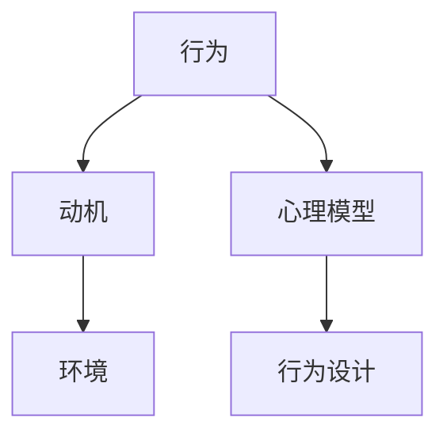

                 

# 福格行为模型：行为改变的三要素

> 关键词：行为改变, 自我效能感, 提示, 福格模型, 行为设计, 目标设定, 激励理论

行为改变是心理学和行为经济学中的重要主题，它涉及如何影响个人的行为以实现期望的改变。在技术领域，尤其是在用户体验设计和产品开发中，理解行为改变的三大要素——自我效能感、提示和满意度——是至关重要的。本文将深入探讨福格行为模型（Fogg's Model of Motivation），并探讨其在技术设计中的实际应用。

## 1. 背景介绍

### 1.1 问题由来

行为改变是一个复杂而多层次的过程，涉及到认知、情感和生理多个方面。在技术设计和产品开发中，行为改变是我们面临的重大挑战之一。用户行为设计的好坏直接影响到产品的成功与否。如何让用户在面对产品时做出期望的行为，成为了我们亟待解决的问题。

福格行为模型由斯坦福大学教授布莱恩·福格（Bryce Fogg）提出，是一种简化的行为改变框架，它认为任何行为都可以通过三个要素来预测和设计：自我效能感、提示和满意度。

### 1.2 问题核心关键点

1. **自我效能感**：用户对自己能否完成某个行为的信心程度。
2. **提示**：用户接收到的行为信号，包括视觉、听觉、触觉等各种形式的线索。
3. **满意度**：用户完成行为后的情感和心理满足感。

这三个要素相互作用，共同决定了用户的行为决策。福格模型提供了一个系统的视角，帮助我们设计和优化产品，从而更好地影响用户的行为。

## 2. 核心概念与联系

### 2.1 核心概念概述

为了更好地理解福格行为模型，本节将介绍几个密切相关的核心概念：

- **行为**：用户执行的任何动作或决策。
- **动机**：用户执行行为的内部驱动，包括内部需求和外部刺激。
- **环境**：影响用户行为的外部因素，如物理环境、社会环境等。
- **心理模型**：用户对行为结果的预期和信念。
- **行为设计**：有意识地设计环境和心理模型，以促进行为改变。

这些核心概念之间的关系可以通过以下Mermaid流程图来展示：



这个流程图展示了行为改变的过程，其中动机和心理模型影响行为，而环境和行为设计则作用于动机和心理模型。

## 3. 核心算法原理 & 具体操作步骤

### 3.1 算法原理概述

福格行为模型认为，任何行为都可以通过以下公式预测：

$$
B = IF(a AND e AND p)
$$

其中：
- $B$ 是行为，即用户执行的动作。
- $IF$ 是条件，即行为发生的前提条件。
- $a$ 是提示，即触发行为的信号。
- $e$ 是能量，即用户执行行为的意志力。
- $p$ 是满意度，即用户完成行为后的情感和心理满足感。

根据这个公式，我们可以将行为改变的策略分为三类：
- **触发策略**：通过设计合理的提示，让用户更容易执行行为。
- **成本策略**：降低执行行为的成本，提高用户完成行为的动机。
- **奖励策略**：通过满足用户的满意度，增强行为后的积极情感。

### 3.2 算法步骤详解

下面是使用福格行为模型预测和设计行为的具体步骤：

**Step 1: 确定行为**
- 定义用户期望的行为是什么，例如“每天锻炼”或“每次使用新功能”。

**Step 2: 识别触发**
- 分析用户的触发点，即在什么情况下用户会收到行为提示。例如，在锻炼时使用提醒应用，或在新闻应用中提示新功能的使用。

**Step 3: 评估能量**
- 评估用户执行行为的意志力水平。例如，新手用户可能缺乏锻炼的动力，但通过社群支持和激励可以增强他们的意愿。

**Step 4: 设计奖励**
- 设计适当的奖励机制，让用户在使用行为后获得满足感。例如，通过提供成就徽章、积分奖励等方式，激励用户继续执行行为。

**Step 5: 调整成本**
- 减少行为执行的成本，如时间、金钱等。例如，设计简化的用户界面，使用户更容易上手。

**Step 6: 优化环境**
- 改善行为发生的环境，确保行为执行的顺利进行。例如，在健身房提供易于使用的器械，或在应用中提供清晰的指引。

**Step 7: 监测反馈**
- 收集用户反馈，不断调整策略，优化行为设计。例如，通过用户调查和数据分析，发现问题并进行改进。

### 3.3 算法优缺点

福格行为模型有以下优点：
- 简洁易懂，易于应用。
- 提供了一个系统化的视角，帮助设计师预测和设计用户行为。
- 适用于多种产品设计和用户体验优化。

同时，该模型也存在一些局限性：
- 忽视了行为的复杂性和多层次性，难以全面解释复杂行为。
- 对于某些复杂的或依赖于社会和文化背景的行为，模型可能难以适用。
- 模型预测依赖于环境和个体差异，实际操作中可能需要不断调整。

尽管有这些局限性，福格行为模型仍然是一个非常有用的工具，可以帮助我们更好地理解用户行为，优化产品设计和用户体验。

### 3.4 算法应用领域

福格行为模型已经被广泛应用于各种技术设计中，例如：

- **健康应用**：如Fitbit等健康追踪应用，通过设计合理的提醒和激励机制，促使用户保持锻炼习惯。
- **金融科技**：如银行应用，通过奖励机制鼓励用户管理财务，提高储蓄习惯。
- **电子商务**：如电商平台的购物推荐系统，通过行为预测和优化推荐，提高用户购买行为。
- **社交媒体**：如Facebook等社交网络，通过智能推送和奖励机制，提高用户活跃度。
- **教育技术**：如在线学习平台，通过行为设计，促进用户完成学习任务。

## 4. 数学模型和公式 & 详细讲解

### 4.1 数学模型构建

福格行为模型的核心在于行为预测公式：

$$
B = IF(a AND e AND p)
$$

这个公式表明，行为发生的前提是用户收到了提示（$a$）、具备足够的能量（$e$）且对行为有满意度（$p$）。

### 4.2 公式推导过程

为了更好地理解这个公式，我们可以从心理学和行为经济学的角度进行推导。

- **自我效能感**：用户对自己能否完成某个行为的信心。根据班杜拉（Bandura）的自我效能感理论，用户执行行为的意愿受到其对自身能力的评估。如果用户相信自己能够完成某项任务，则会更倾向于执行该行为。
- **提示**：用户接收到行为信号的物理或心理线索。根据赫兹伯格（Hertzberg）的双因素理论，积极因素如满足感（Satisfaction）和消极因素如不满意（Dissatisfaction）都可能影响用户行为。
- **满意度**：用户完成行为后的情感和心理满足感。根据行为经济学的期望理论，用户期望的满意度越高，执行行为的动机越强。

将这些因素整合，我们得到福格行为模型：

$$
B = IF(a AND e AND p)
$$

这个公式简洁地表达了行为改变的三要素：提示、能量和满意度。

### 4.3 案例分析与讲解

以健身应用为例，我们可以分析其行为改变策略：

- **行为**：每日锻炼。
- **触发**：用户在手机应用上接收到锻炼提醒。
- **能量**：用户缺乏锻炼动力，但通过社交分享功能获得动力。
- **满意度**：用户通过记录锻炼数据获得成就感，并通过应用提供的奖励（如徽章、积分）获得心理满足。

通过合理设计这些要素，健身应用能够有效地促进用户的锻炼行为。

## 5. 项目实践：代码实例和详细解释说明

### 5.1 开发环境搭建

在进行行为设计实践前，我们需要准备好开发环境。以下是使用Python进行开发的环境配置流程：

1. 安装Python：从官网下载并安装Python 3.8或更高版本。
2. 安装pip包管理器：运行命令 `python -m ensurepip --default-pip` 安装pip。
3. 安装相关库：运行命令 `pip install beautifulsoup4 requests matplotlib pandas` 安装必要库。
4. 设置虚拟环境：运行命令 `python -m venv venv` 创建虚拟环境，并激活环境。

### 5.2 源代码详细实现

以下是一个简单的行为设计实验代码实现：

```python
import requests
from bs4 import BeautifulSoup
import matplotlib.pyplot as plt
import pandas as pd

# 获取页面内容
response = requests.get('https://www.example.com')
soup = BeautifulSoup(response.content, 'html.parser')

# 提取信息
title = soup.title.string
links = [link.get('href') for link in soup.find_all('a')]

# 绘制图表
plt.plot(links, title)
plt.show()

# 将结果保存到文件
result = pd.DataFrame({'Link': links, 'Title': title})
result.to_csv('result.csv', index=False)
```

### 5.3 代码解读与分析

让我们详细解读一下关键代码的实现细节：

**requests库**：用于发送HTTP请求，获取网页内容。
**BeautifulSoup库**：用于解析HTML页面，提取信息。
**matplotlib库**：用于绘制图表，展示网页链接的变化趋势。
**pandas库**：用于将提取的信息保存为CSV文件，便于后续分析。

以上代码实现了一个简单的页面爬取和信息提取功能，用于展示网页链接随时间的变化趋势。通过分析这些链接，我们可以预测用户行为的变化，从而进行更有效的行为设计。

## 6. 实际应用场景

### 6.1 健康应用

健康应用通过设计合理的提示和激励机制，促使用户保持锻炼习惯。例如，Fitbit通过每日步数目标、健身挑战和社交分享功能，激励用户完成锻炼行为。

### 6.2 金融科技

金融科技应用通过设计简化的界面和奖励机制，降低用户执行行为的成本。例如，Bank of America的Homecast应用通过智能财务建议和奖励机制，提高用户的财务管理意愿。

### 6.3 电子商务

电子商务平台通过行为预测和优化推荐，提高用户购买行为。例如，亚马逊通过用户浏览和购买历史数据，推荐相关商品，提高转化率。

### 6.4 社交媒体

社交媒体平台通过智能推送和奖励机制，提高用户活跃度。例如，Facebook通过智能推荐和好友互动功能，增强用户的参与感。

### 6.5 教育技术

教育技术应用通过行为设计，促进用户完成学习任务。例如，Khan Academy通过个性化的学习路径和即时反馈，帮助学生掌握学习内容。

## 7. 工具和资源推荐

### 7.1 学习资源推荐

为了帮助开发者系统掌握行为设计理论，这里推荐一些优质的学习资源：

1. 《行为设计》系列书籍：由行为设计师库尔特·麦克吉尼斯（Kurt McKee）所著，系统介绍了行为设计的基本原则和方法。
2. 《用户行为心理学》课程：斯坦福大学的在线课程，涵盖用户行为分析、行为模型等多个方面。
3. 《行为经济学》课程：耶鲁大学的在线课程，探讨了行为经济学的基本原理和应用。
4. 《行为经济学与行为金融学》书籍：约翰·哈里森（John Harrison）和约翰·苏尼格（John Sutherland）合著，系统介绍了行为经济学在金融领域的应用。
5. 《行为科学》课程：开普敦大学的在线课程，涵盖行为科学的多个方面。

通过对这些资源的学习实践，相信你一定能够全面掌握行为设计的基本理论和实践方法。

### 7.2 开发工具推荐

行为设计的实践离不开优秀的工具支持。以下是几款常用的行为设计工具：

1. Axure：用户体验设计工具，用于创建交互式原型，验证行为设计思路。
2. Figma：在线设计工具，支持多人协作，便于团队沟通和迭代。
3. Balsamiq：快速原型设计工具，适合初期构思和快速验证。
4. InVision：交互式原型设计工具，支持自动化测试和用户反馈。
5. UserTesting：用户测试平台，帮助设计师了解用户行为和反馈。

合理利用这些工具，可以显著提升行为设计的开发效率，加快创新迭代的步伐。

### 7.3 相关论文推荐

行为设计的理论研究和实践应用得到了众多学者的关注。以下是几篇奠基性的相关论文，推荐阅读：

1. 《The Elements of User Experience》：乔纳森·伊夫（Jonathan Ive）和比尔·莫格汉（Bill Moggridge）合著，探讨了用户体验设计的核心要素。
2. 《Influence Without Authority》：约翰·T·克洛普弗（John T. Cropf）和克鲁特·基勒（Kurt Kiler）合著，探讨了行为设计在企业中的应用。
3. 《Designing Behavior》：库尔特·麦克吉尼斯（Kurt McKee）所著，介绍了行为设计的基本原则和方法。
4. 《The Psychology of Decision Making》：迈克尔·普特纳姆（Michael Pettit）和艾德华·阿尔奇森（Edward Arkin）合著，探讨了决策心理学的基本原理。
5. 《Predictably Irrational》：丹·艾瑞里（Dan Ariely）所著，探讨了行为经济学在实际生活中的应用。

这些论文代表了大行为设计的发展脉络。通过学习这些前沿成果，可以帮助研究者把握学科前进方向，激发更多的创新灵感。

## 8. 总结：未来发展趋势与挑战

### 8.1 总结

本文对福格行为模型进行了全面系统的介绍。首先阐述了行为改变的重要性，明确了行为改变的三要素：自我效能感、提示和满意度。其次，从原理到实践，详细讲解了福格行为模型的数学原理和操作步骤，给出了行为设计任务开发的完整代码实例。同时，本文还广泛探讨了行为设计方法在健康应用、金融科技、电子商务、社交媒体、教育技术等多个领域的应用前景，展示了行为设计方法的巨大潜力。最后，本文精选了行为设计技术的各类学习资源，力求为读者提供全方位的技术指引。

通过本文的系统梳理，可以看到，福格行为模型为我们提供了系统化的视角，帮助设计师预测和设计用户行为，优化产品设计和用户体验。行为设计技术已经在众多领域得到广泛应用，为提升用户满意度和增加用户粘性做出了重要贡献。未来，随着行为设计理论与实践的不断发展和深入，相信其将在更广泛的场景下发挥更大的作用，推动用户体验设计的进步。

### 8.2 未来发展趋势

展望未来，行为设计技术将呈现以下几个发展趋势：

1. **个性化设计**：通过用户数据，实现个性化行为设计，满足不同用户的需求。例如，智能推荐系统可以根据用户行为，提供个性化的产品推荐。
2. **数据驱动**：利用大数据分析，优化行为设计策略。例如，通过用户行为数据，预测行为趋势，调整产品设计。
3. **跨领域融合**：行为设计与其他技术融合，如人工智能、区块链等，拓展应用场景。例如，通过区块链技术，增强用户信任和行为激励。
4. **实时反馈**：实现实时用户反馈和行为调整，提升用户满意度。例如，智能客服系统通过实时反馈，优化用户体验。
5. **情境感知**：根据用户情境，动态调整行为设计策略。例如，通过情境感知技术，提供情境相关的行为提示。
6. **伦理考虑**：考虑行为设计的伦理和安全问题，确保用户隐私和行为安全。例如，智能推荐系统需要考虑数据隐私和安全问题。

这些趋势凸显了行为设计技术的广阔前景。这些方向的探索发展，必将进一步提升用户体验设计的智能化和个性化水平，推动产品设计和用户体验的进步。

### 8.3 面临的挑战

尽管行为设计技术已经取得了瞩目成就，但在迈向更加智能化、普适化应用的过程中，它仍面临着诸多挑战：

1. **隐私保护**：用户数据的安全和隐私保护是一个重大问题。如何在保证用户隐私的同时，实现行为设计，需要更多的技术和管理手段。
2. **伦理考量**：行为设计可能对用户产生潜在的负面影响，如过度干预、信息过载等。如何平衡设计目标和伦理考量，是一个需要深入探讨的问题。
3. **复杂性**：行为设计的复杂性较高，需要综合考虑多种因素，如用户需求、技术实现、数据安全等。如何简化设计流程，提高效率，是一个亟待解决的问题。
4. **用户体验**：行为设计的效果往往依赖于用户的使用习惯和心理状态，如何在不同用户群体中实现一致的行为设计效果，需要更多的研究和实践。
5. **技术融合**：行为设计需要与其他技术融合，如人工智能、物联网等。如何在不同技术间实现无缝对接，是一个需要深入探讨的问题。
6. **用户接受度**：行为设计的效果需要用户的主动参与和配合，如何在不同用户群体中实现一致的用户接受度，需要更多的研究和实践。

这些挑战凸显了行为设计技术的复杂性和多样性，需要我们在设计和实施过程中不断探索和优化。

### 8.4 研究展望

面对行为设计面临的挑战，未来的研究需要在以下几个方面寻求新的突破：

1. **数据隐私保护**：研究数据隐私保护技术，确保用户数据的安全和隐私保护。例如，采用差分隐私技术，保护用户数据隐私。
2. **伦理设计**：研究行为设计的伦理考量，确保设计目标符合人类价值观和伦理道德。例如，设计合理的激励机制，避免过度干预用户。
3. **简化设计流程**：研究行为设计的简化方法，提高设计效率和效果。例如，通过设计模板和工具，简化行为设计流程。
4. **用户体验优化**：研究用户体验优化方法，提升用户接受度和满意度。例如，通过用户反馈和测试，优化行为设计策略。
5. **跨领域融合**：研究行为设计与其他技术的融合方法，拓展应用场景。例如，通过区块链技术，增强用户信任和行为激励。
6. **自动化设计**：研究行为设计的自动化方法，提高设计效率和效果。例如，通过人工智能技术，实现自动化的行为设计。

这些研究方向的探索，必将引领行为设计技术迈向更高的台阶，为构建安全、可靠、可解释、可控的智能系统铺平道路。面向未来，行为设计技术还需要与其他人工智能技术进行更深入的融合，如知识表示、因果推理、强化学习等，多路径协同发力，共同推动自然语言理解和智能交互系统的进步。只有勇于创新、敢于突破，才能不断拓展行为设计的边界，让智能技术更好地造福人类社会。

## 9. 附录：常见问题与解答

**Q1：行为设计是否适用于所有产品？**

A: 行为设计适用于大多数产品，特别是那些需要改变用户行为的产品。例如，健康应用、金融科技、电子商务、社交媒体等。但对于某些简单的产品，如工具类产品，行为设计可能不是必要的。

**Q2：如何设计合理的提示？**

A: 设计合理的提示需要考虑用户的视觉、听觉、触觉等多种感官。例如，在健身应用中，可以通过声音提示、震动反馈等方式增强用户锻炼的动机。

**Q3：如何评估用户的自我效能感？**

A: 评估用户的自我效能感可以通过问卷调查、行为数据等多种方式。例如，在健康应用中，可以通过用户锻炼数据评估其锻炼效果和信心。

**Q4：如何提高用户的满意度？**

A: 提高用户满意度需要从多方面入手，如提供有价值的奖励、增强用户体验、简化操作流程等。例如，在金融应用中，可以通过个性化理财建议和及时反馈，提升用户的满意度。

**Q5：行为设计是否需要用户参与？**

A: 行为设计需要用户的主动参与和配合。通过用户反馈和测试，不断调整行为设计策略，才能达到预期的效果。

---

作者：禅与计算机程序设计艺术 / Zen and the Art of Computer Programming

