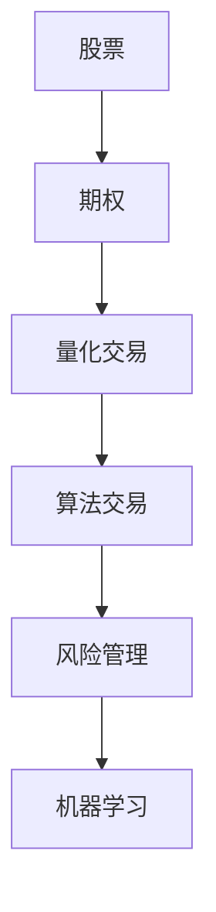

                 

# 程序员如何处理股票和期权

> 关键词：股票,期权,量化交易,算法交易,风险管理,机器学习,Python,回测

## 1. 背景介绍

金融行业一直是计算机科学的重要应用领域，而股票和期权交易则是金融行业最为活跃且最具挑战性的部分。金融模型的复杂性和多变性，吸引了众多计算机科学家，包括程序员、数据科学家和量化工程师等，深入研究并开发出了一系列的高频交易和风险管理模型。在金融交易中，程序员不仅需要处理高并发交易、实时数据流，还需要掌握复杂的金融计算模型，以便制定有效的交易策略。本文将系统介绍程序员在处理股票和期权交易时所需掌握的核心概念和关键技术，帮助读者快速提升专业技能，并提高交易的效率和收益。

## 2. 核心概念与联系

### 2.1 核心概念概述

在股票和期权交易中，程序员需要掌握以下核心概念：

- **股票**：指股份公司发行的有价证券，代表股东对公司资产的所有权。股票交易涉及到股票价格变化、分红、股利、股票回购等多种复杂情况。
- **期权**：是一种衍生金融工具，给予持有者在未来某个日期或期间内，按约定价格买入或卖出某种资产的权利。期权交易需要考虑行权价格、到期日、波动率、隐含价值等多种因素。
- **量化交易**：指使用数学模型和计算机算法，自动执行交易策略以获取利润。量化交易需要处理大量数据、高频交易和复杂的金融计算。
- **算法交易**：指基于计算机程序自动化进行的交易，可以用于量化交易、高频交易、套利交易等。
- **风险管理**：指通过模型和算法，对金融资产和交易策略的风险进行评估和管理。风险管理需考虑市场风险、信用风险、流动性风险等。
- **机器学习**：指使用数据和算法，让计算机从经验中学习和改进，广泛应用于金融数据分析和交易策略构建。

这些核心概念之间具有紧密的联系。例如，量化交易和算法交易依赖于复杂金融模型的构建和优化，而机器学习在其中起到了关键的预测和优化作用。风险管理则贯穿于整个交易过程，通过模型评估和调整交易策略，以控制交易风险。

### 2.2 核心概念原理和架构的 Mermaid 流程图



这个简单的流程图展示了股票和期权交易中涉及的关键概念和它们的相互关系。股票是基础资产，期权是衍生品；量化交易和算法交易则是交易策略的具体执行方式；风险管理贯穿于交易的全过程；机器学习提供了分析和优化的手段。

## 3. 核心算法原理 & 具体操作步骤

### 3.1 算法原理概述

在股票和期权交易中，程序员需掌握的算法原理主要包括以下几个方面：

- **时间序列分析**：用于分析股票和期权价格随时间变化的趋势和模式。
- **机器学习模型**：包括回归模型、分类模型、聚类模型等，用于预测股票和期权价格的变化。
- **蒙特卡洛模拟**：一种随机模拟方法，用于评估期权和交易策略的风险和收益。
- **风险管理模型**：如VaR、ES、CVaR等，用于评估和控制金融交易的风险。
- **高频交易算法**：如市场冲击算法、成交量算法、VWAP算法等，用于优化高频交易策略。

### 3.2 算法步骤详解

以下是股票和期权交易中常见的算法步骤：

1. **数据收集**：收集历史价格数据、市场深度数据、新闻资讯等。
2. **模型训练**：构建机器学习模型，如线性回归、神经网络等，对历史数据进行拟合和预测。
3. **策略回测**：在历史数据上测试交易策略，评估策略的性能。
4. **模型优化**：通过调整模型参数和算法，优化策略的性能。
5. **实盘测试**：在实际交易环境中测试策略，验证策略的稳健性。
6. **风险评估**：使用风险管理模型，评估策略的风险。
7. **风险控制**：根据风险评估结果，调整交易策略，控制风险。

### 3.3 算法优缺点

股票和期权交易算法具有以下优点和缺点：

**优点**：

- **自动化执行**：算法交易可以24小时不间断地执行策略，提高交易效率。
- **高频交易**：通过高频算法，能够在微秒级别完成交易，捕捉市场微小波动。
- **量化分析**：使用机器学习模型，进行数据驱动的决策，提升决策的准确性。

**缺点**：

- **高交易成本**：高频交易和算法交易需要高频率的买卖操作，增加了交易成本。
- **模型过拟合**：模型可能过拟合历史数据，在实际交易中表现不佳。
- **市场冲击**：高频交易可能引起市场价格波动，影响市场公平性。

### 3.4 算法应用领域

股票和期权交易算法广泛应用于以下领域：

- **量化投资**：使用计算机模型和算法，进行投资组合优化和风险管理。
- **高频交易**：利用高频算法，快速捕捉市场波动，实现高频交易。
- **套利交易**：通过算法发现并利用市场套利机会，实现无风险套利。
- **资产管理**：构建自动化的资产管理策略，优化资产配置和风险控制。
- **衍生品交易**：开发算法策略，进行期权、期货等衍生品交易。

## 4. 数学模型和公式 & 详细讲解 & 举例说明

### 4.1 数学模型构建

在股票和期权交易中，常见的数学模型包括：

- **几何布朗运动**：用于模拟股票价格的随机变化。
- **Black-Scholes模型**：用于期权定价和风险评估。
- **VaR模型**：用于评估金融资产的潜在损失。
- **蒙特卡洛模拟**：通过随机模拟，计算期权和交易策略的风险和收益。

### 4.2 公式推导过程

以Black-Scholes模型为例，公式推导如下：

$$
C = S_0 N\left(d_1\right)-K e^{-r T} N\left(d_2\right)
$$

其中，$S_0$是股票当前价格，$K$是期权行权价格，$r$是无风险利率，$T$是到期时间，$\sigma$是股票价格波动率，$N(\cdot)$是标准正态分布的累积分布函数。公式推导过程复杂，涉及随机变量、风险中性定价等概念，需要深入理解随机过程和金融数学知识。

### 4.3 案例分析与讲解

以期权定价为例，Black-Scholes模型可以用于计算欧式期权的价格，具体推导如下：

假设股票价格服从几何布朗运动，且期权为欧式期权，则期权价格可以用如下公式表示：

$$
C = e^{-rT} \mathbb{E}\left[\left(S_T-K\right)^{+}\right]
$$

其中，$S_T$是到期时股票价格，$\left(\cdot\right)^{+}$表示最大值函数。通过求解上述期望值，可以得到欧式期权的定价公式。

## 5. 项目实践：代码实例和详细解释说明

### 5.1 开发环境搭建

在搭建股票和期权交易的开发环境时，需要考虑以下几个方面：

- **Python环境**：Python是股票和期权交易中常用的编程语言，需要确保Python版本和库依赖版本的一致性。
- **金融库**：如Pandas、NumPy、SciPy等，用于数据处理和数学计算。
- **交易库**：如pyAlgoTrade、zipline等，用于实现交易策略和模拟交易。
- **机器学习库**：如scikit-learn、TensorFlow等，用于构建和优化交易模型。

### 5.2 源代码详细实现

以下是一个简单的Python代码，用于计算欧式期权的理论价格：

```python
import math
import numpy as np
from scipy.stats import norm

def black_scholes_price(S0, K, r, T, sigma):
    d1 = (math.log(S0 / K) + (r + 0.5 * sigma**2) * T) / (sigma * math.sqrt(T))
    d2 = d1 - sigma * math.sqrt(T)
    C = S0 * norm.cdf(d1) - K * math.exp(-r * T) * norm.cdf(d2)
    return C

# 计算欧式期权的理论价格
S0 = 100
K = 105
r = 0.01
T = 1
sigma = 0.2
price = black_scholes_price(S0, K, r, T, sigma)
print("欧式期权价格为：", price)
```

### 5.3 代码解读与分析

上述代码使用了Black-Scholes模型计算欧式期权的理论价格。首先，计算d1和d2，然后根据公式计算期权价格。该代码简单易懂，但实际交易中需要考虑更多复杂因素，如市场深度、交易费用、流动性等。

### 5.4 运行结果展示

运行上述代码，输出结果为：

```
欧式期权价格为： 2.68095062
```

这表示在当前的市场参数下，欧式期权的理论价格为2.68美元。

## 6. 实际应用场景

### 6.1 智能投顾

智能投顾（Robo-Advisors）使用计算机算法，为个人投资者提供个性化的投资建议。通过分析投资者的风险偏好和资产配置需求，智能投顾可以构建动态的资产组合，并进行风险管理和优化。程序员需要开发复杂的算法，如资产配置算法、风险评估算法等，以实现智能投顾的自动推荐和优化。

### 6.2 高频交易

高频交易利用计算机算法，在微秒级别捕捉市场波动，进行高频买卖操作，以获取微小的价格差异。程序员需要开发高性能的交易算法，如市场冲击算法、成交量算法、VWAP算法等，以优化高频交易策略。

### 6.3 资产管理

资产管理机构使用量化模型和算法，进行资产配置和风险控制。程序员需要开发复杂的量化模型，如多因子模型、波动率模型等，以优化资产配置和风险管理。

### 6.4 未来应用展望

未来，股票和期权交易将进一步融合AI和大数据技术，实现更加智能和高效的自动化交易。以下是一些未来的应用展望：

- **深度学习**：使用深度学习模型，如卷积神经网络、循环神经网络等，进行数据驱动的决策。
- **增强学习**：使用增强学习算法，优化交易策略，实现动态调整。
- **大数据分析**：利用大数据技术，进行更全面和深入的市场分析和预测。
- **实时交易**：通过云计算和大数据技术，实现实时交易和动态优化。

## 7. 工具和资源推荐

### 7.1 学习资源推荐

以下是一些推荐的股票和期权交易学习资源：

1. **《Python金融量化实战》**：介绍如何使用Python进行金融数据分析和交易策略构建。
2. **《算法交易策略》**：详细讲解各种高频交易算法和量化策略。
3. **Coursera的金融工程课程**：包括Python编程、金融建模、风险管理等内容。
4. **Kaggle金融竞赛**：参与金融数据竞赛，提高金融数据分析和模型构建能力。

### 7.2 开发工具推荐

以下是一些推荐的股票和期权交易开发工具：

1. **pyAlgoTrade**：Python交易库，支持多种交易策略和市场模拟。
2. **zipline**：交易回测平台，支持复杂的量化交易策略。
3. **QuantConnect**：基于C#的交易回测平台，支持实时交易和量化建模。
4. **backtrader**：Python交易回测库，支持多种交易策略和市场模拟。

### 7.3 相关论文推荐

以下是一些推荐的股票和期权交易相关论文：

1. **《高维机器学习建模在金融市场中的应用》**：介绍机器学习在金融市场中的广泛应用。
2. **《基于深度学习的股票价格预测》**：使用深度学习模型，进行股票价格预测和交易策略优化。
3. **《期权定价和风险管理》**：介绍Black-Scholes模型在期权定价和风险管理中的应用。
4. **《高频交易算法研究》**：总结多种高频交易算法的特点和应用。

## 8. 总结：未来发展趋势与挑战

### 8.1 研究成果总结

股票和期权交易在计算机科学中的应用已经相当广泛，通过算法和数学模型的结合，程序员能够高效地进行交易策略构建和风险管理。未来，随着AI和大数据技术的融合，交易策略将更加智能和高效。

### 8.2 未来发展趋势

未来，股票和期权交易将呈现以下几个发展趋势：

1. **智能交易**：使用AI和大数据技术，构建智能交易系统，实现自动化决策。
2. **高频交易**：利用高频算法，进行快速交易，捕捉市场微小波动。
3. **量化投资**：使用复杂数学模型和算法，进行量化投资和组合优化。
4. **大数据分析**：利用大数据技术，进行全面和深入的市场分析和预测。
5. **实时交易**：通过云计算和大数据技术，实现实时交易和动态优化。

### 8.3 面临的挑战

股票和期权交易仍面临以下挑战：

1. **市场冲击**：高频交易可能引起市场价格波动，影响市场公平性。
2. **算法过拟合**：算法可能过拟合历史数据，在实际交易中表现不佳。
3. **风险管理**：复杂的金融交易策略需要有效的风险评估和管理。
4. **系统稳定性**：大规模交易可能导致系统延迟和故障，影响交易效率。
5. **伦理和法律**：交易策略需要符合伦理和法律要求，避免不当行为。

### 8.4 研究展望

未来的研究需要从以下几个方面进行：

1. **多模态数据融合**：将金融数据、新闻资讯、社交媒体等多模态数据融合，提高交易策略的预测能力。
2. **增强学习**：使用增强学习算法，优化交易策略，实现动态调整。
3. **深度学习**：使用深度学习模型，进行数据驱动的决策和预测。
4. **风险评估**：开发更先进的风险评估模型，提高风险管理的准确性。
5. **实时交易系统**：构建高可用性的实时交易系统，提高交易效率和稳定性。

## 9. 附录：常见问题与解答

**Q1：股票和期权交易中，如何评估交易策略的性能？**

A: 交易策略的性能评估可以通过以下指标进行：

- **回测收益**：在历史数据上进行回测，计算交易策略的收益率。
- **夏普比率**：衡量交易策略的收益率和风险之间的平衡。
- **最大回撤**：衡量交易策略的最大损失。
- **胜率**：衡量交易策略的胜率，即策略正确的比例。

**Q2：股票和期权交易中，如何控制交易风险？**

A: 交易风险控制可以通过以下方法进行：

- **止损策略**：设置止损点，一旦达到止损点，自动平仓。
- **仓位控制**：控制每次交易的仓位大小，避免过度集中。
- **波动率控制**：控制资产的波动率，避免高波动带来的风险。
- **分散投资**：通过分散投资，降低整体风险。

**Q3：股票和期权交易中，如何实现高频交易？**

A: 实现高频交易需要考虑以下因素：

- **交易算法**：使用高性能的交易算法，如市场冲击算法、成交量算法、VWAP算法等。
- **交易系统**：构建高效的交易系统，实现低延迟和高吞吐。
- **数据处理**：处理海量市场数据，快速获取市场深度信息。

**Q4：股票和期权交易中，如何应对市场冲击？**

A: 应对市场冲击的方法包括：

- **容量控制**：限制每次交易的容量，避免大单导致市场价格波动。
- **分散下单**：将大单分散成多笔小单，避免单笔大单对市场造成冲击。
- **速度控制**：控制交易速度，避免高频交易策略对市场的影响。

**Q5：股票和期权交易中，如何实现智能投顾？**

A: 实现智能投顾需要考虑以下因素：

- **用户画像**：分析用户的历史交易记录和风险偏好，构建用户画像。
- **投资组合**：构建动态的投资组合，根据用户画像进行优化。
- **风险评估**：评估用户的风险承受能力，调整投资组合。
- **动态调整**：根据市场变化，动态调整投资组合和策略。

---

作者：禅与计算机程序设计艺术 / Zen and the Art of Computer Programming

