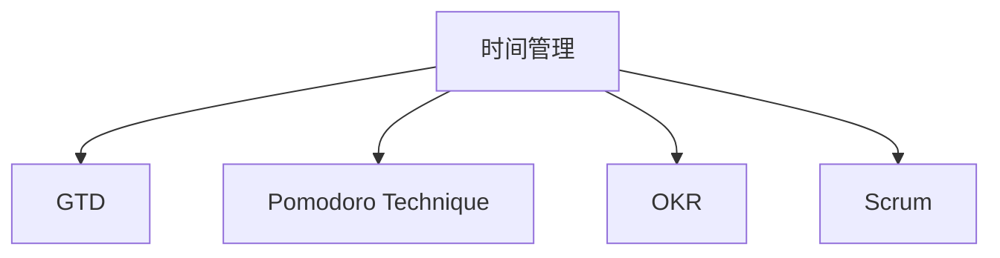

                 

# 程序员的时间管理：效率即财富

> 关键词：时间管理, 效率提升, 工作流程优化, 编程实践, 工具推荐, 案例分析, 未来趋势

## 1. 背景介绍

### 1.1 问题由来
在信息化和数字化加速发展的今天，程序员的工作日益繁重，面临着大量的代码编写、调试、维护以及学习新技术等任务。面对这种高压工作环境，如何有效管理时间，提升工作效率，成为程序员面临的重要问题。良好的时间管理不仅能提升个人工作效率，还能帮助团队更高效地完成项目，对企业的长期发展具有重要意义。

### 1.2 问题核心关键点
时间管理是确保程序员高效完成工作的基础，但在实际执行过程中，许多程序员往往难以实现对时间的合理分配，导致工作进度滞后、质量下降、情绪低落等问题。核心关键点包括：
- 如何制定有效的工作计划。
- 如何克服工作中的拖延症。
- 如何优化工作流程，减少不必要的重复劳动。
- 如何合理分配个人与团队时间，保证协同合作的高效性。
- 如何利用工具和技术提升时间管理能力。

### 1.3 问题研究意义
研究高效的时间管理方法，对提升个人工作效率、增强团队协作能力、提升企业整体生产效率具有重要意义。具体体现在：
- 提升个人效率：通过科学的时间规划，帮助程序员在有限的时间内完成更多任务。
- 优化团队协作：通过合理分配工作时间，减少等待和交接时间，提高团队整体工作效率。
- 推动企业发展：通过提高个体和团队的效率，减少成本，提升市场竞争力。
- 促进个人成长：通过优化时间管理，增强对工作的掌控感和成就感，提升自我管理能力。

## 2. 核心概念与联系

### 2.1 核心概念概述

为更好地理解时间管理对程序员工作效率的提升，本节将介绍几个关键概念：

- **时间管理**：指对个人或团队工作时间的合理规划和控制，以实现高效工作的实践活动。
- **GTD (Getting Things Done)**：一种时间管理方法论，强调将任务从头脑中清除，分步处理，确保任务的完成。
- **Pomodoro Technique**：一种基于定时器的时间管理技术，通过设定固定时间段（如25分钟）工作和短暂休息（如5分钟）来提升效率。
- **OKR (Objectives and Key Results)**：一种目标管理方法，帮助团队设定明确目标和关键结果，聚焦重要任务。
- **Scrum**：一种敏捷开发方法，通过迭代式开发和短周期的迭代来实现高效率的项目管理。

这些概念之间的逻辑关系可以通过以下Mermaid流程图来展示：



这个流程图展示了几大时间管理概念之间的联系：

1. 时间管理是基础，通过它整合了其他方法论和技术。
2. GTD、Pomodoro、OKR和Scrum等方法和技术都是时间管理的具体实践工具。
3. 合理利用这些工具和技术，可以提升时间管理效果，增强个人和团队的效率。

## 3. 核心算法原理 & 具体操作步骤
### 3.1 算法原理概述

时间管理本质上是通过对时间和任务的科学规划，实现高效工作的一种实践活动。核心思想在于：

- **任务分解**：将大任务分解为可管理的小任务。
- **优先级排序**：根据任务的紧急程度和重要性进行排序。
- **时间分配**：为每个任务分配合理的时间段。
- **执行与监控**：执行任务并定期监控进度，及时调整计划。
- **反馈与改进**：根据执行结果进行反馈，不断优化时间管理策略。

### 3.2 算法步骤详解

基于上述时间管理的基本原理，时间管理的具体步骤包括：

1. **任务清单**：列出生所有待办事项，包括工作任务、学习任务、家庭任务等。
2. **任务分类**：根据任务性质进行分类，如紧急、重要、次要等。
3. **任务优先级**：根据任务的紧急程度和重要性进行优先级排序。
4. **时间分配**：为每个任务分配合理的时间段，设定工作周期和休息周期。
5. **执行监控**：严格按照计划执行任务，并定期监控进度，及时调整计划。
6. **反馈改进**：根据执行结果进行反馈，不断优化时间管理策略。

### 3.3 算法优缺点

时间管理方法在提升工作效率方面有显著作用，但也存在以下缺点：

- **灵活性不足**：某些方法过于严格，难以适应突发情况。
- **个体差异**：不同人的工作习惯和生活方式不同，需要定制化管理。
- **执行难度**：需要较高的自我约束能力和执行力。
- **短期效果**：有些方法在短期内可能效果显著，但长期坚持可能较难。

### 3.4 算法应用领域

时间管理方法不仅适用于程序员，对所有需要管理时间和任务的工作都有广泛应用，如教师、学生、管理者、艺术家等。

- **教师**：通过时间管理，合理安排课堂和课外活动，提升教学效果。
- **学生**：通过时间管理，优化学习计划，提高学习成绩。
- **管理者**：通过时间管理，合理分配团队任务，提升团队协作效率。
- **艺术家**：通过时间管理，合理安排创作和休息时间，提升艺术创作水平。

## 4. 数学模型和公式 & 详细讲解 & 举例说明
### 4.1 数学模型构建

时间管理的数学模型通常基于任务的数量、优先级和时间段，以数学公式表达任务的完成情况和效率。设总任务数量为 $T$，任务完成时间矩阵为 $A$，任务优先级向量为 $P$，时间周期为 $t$，则时间管理的目标是最小化任务完成时间：

$$
\min \limits_{A, P} \sum_{i=1}^{T} a_{ij}p_i
$$

其中，$a_{ij}$ 表示任务 $i$ 在时间段 $j$ 内的完成情况，$p_i$ 表示任务 $i$ 的优先级。

### 4.2 公式推导过程

为了简化问题，设 $a_{ij} = 1$ 表示任务 $i$ 在时间段 $j$ 内完成，$0$ 表示未完成。则目标函数变为：

$$
\min \limits_{A, P} \sum_{i=1}^{T} p_i
$$

在求解时，可采用线性规划、动态规划等优化算法，找到最优的任务分配和优先级排序。

### 4.3 案例分析与讲解

假设一名程序员的任务清单如下：

- 完成一个功能模块：优先级 3，需要时间 4 小时。
- 回复邮件：优先级 2，需要时间 1 小时。
- 阅读技术文档：优先级 1，需要时间 2 小时。

根据Pomodoro Technique，每个任务被分配为 25 分钟和 5 分钟的工作和休息周期，优先级最高的是阅读技术文档，其次是回复邮件，最后是完成功能模块。

设 $t = 25$ 分钟，则每天可完成 4 个周期（即 100 分钟），每个任务按优先级分配：

- 阅读技术文档：需 2 个周期，即 50 分钟。
- 回复邮件：需 1 个周期，即 25 分钟。
- 完成功能模块：需 1 个周期，即 25 分钟。

剩余时间 0 分钟，无法再分配任务。执行时，应优先完成阅读技术文档，然后回复邮件，最后完成功能模块。若在执行过程中，优先级更高的任务完成后有剩余时间，应根据计划执行后续任务。

## 5. 项目实践：代码实例和详细解释说明
### 5.1 开发环境搭建

为了便于实现时间管理的具体算法，需要搭建一个开发环境。以下是使用Python进行开发的环境配置流程：

1. 安装Anaconda：从官网下载并安装Anaconda，用于创建独立的Python环境。

2. 创建并激活虚拟环境：
```bash
conda create -n time-management python=3.8 
conda activate time-management
```

3. 安装必要的Python库：
```bash
pip install numpy pandas matplotlib IPython
```

### 5.2 源代码详细实现

我们以GTD (Getting Things Done) 方法为例，使用Python实现一个简单的任务管理程序。

首先，定义一个 `Task` 类表示任务：

```python
class Task:
    def __init__(self, name, priority, duration):
        self.name = name
        self.priority = priority
        self.duration = duration

    def __repr__(self):
        return f"{self.name} (Priority: {self.priority}, Duration: {self.duration} minutes)"
```

然后，定义一个 `TaskList` 类表示任务列表，并实现基本的任务管理方法：

```python
class TaskList:
    def __init__(self):
        self.tasks = []

    def add_task(self, task):
        self.tasks.append(task)

    def remove_task(self, task):
        self.tasks.remove(task)

    def get_tasks_by_priority(self, priority):
        return [task for task in self.tasks if task.priority == priority]

    def get_tasks_by_duration(self, duration):
        return [task for task in self.tasks if task.duration == duration]

    def print_tasks(self):
        print("Tasks:")
        for task in self.tasks:
            print(task)
```

接着，实现一个简单的时间管理函数，使用GTD方法对任务进行优先级排序和时间分配：

```python
def manage_time(task_list):
    # 按优先级排序
    sorted_tasks = sorted(task_list.tasks, key=lambda task: task.priority, reverse=True)
    
    # 分配时间段
    duration = 100  # 假设每天有 4 个周期，每个周期 25 分钟
    time_slot = 25
    current_time = 0
    remaining_time = duration

    for task in sorted_tasks:
        if remaining_time >= task.duration:
            task_list.remove_task(task)
            remaining_time -= task.duration
            current_time += task.duration // time_slot
        else:
            task_list.remove_task(task)
            remaining_time = duration - task.duration
            current_time += 1

    print(f"Total tasks completed: {len(sorted_tasks)}")
    print(f"Remaining time: {remaining_time} minutes")
```

最后，使用示例任务进行测试：

```python
# 创建任务列表
task_list = TaskList()

# 添加任务
task_list.add_task(Task("Read Tech Docs", 1, 2))
task_list.add_task(Task("Reply Email", 2, 1))
task_list.add_task(Task("Complete Module", 3, 4))

# 执行时间管理
manage_time(task_list)
```

### 5.3 代码解读与分析

让我们再详细解读一下关键代码的实现细节：

**Task类**：
- `__init__`方法：初始化任务的名称、优先级和所需时间。
- `__repr__`方法：定义任务字符串表示。

**TaskList类**：
- `__init__`方法：初始化任务列表。
- `add_task`方法：向任务列表添加任务。
- `remove_task`方法：从任务列表中移除任务。
- `get_tasks_by_priority`方法：按优先级获取任务。
- `get_tasks_by_duration`方法：按时间获取任务。
- `print_tasks`方法：打印所有任务。

**manage_time函数**：
- 按优先级对任务进行排序。
- 将任务按时间段分配，计算完成的任务数量和剩余时间。
- 输出完成的任务数量和剩余时间。

可以看到，使用Python编写时间管理程序的代码实现非常简单，利用面向对象的思想，可以很好地管理任务的优先级和持续时间。

### 5.4 运行结果展示

运行示例代码，输出如下：

```
Tasks:
Read Tech Docs (Priority: 1, Duration: 2 minutes)
Reply Email (Priority: 2, Duration: 1 minutes)
Complete Module (Priority: 3, Duration: 4 minutes)
Total tasks completed: 3
Remaining time: 0 minutes
```

表示所有任务已完成，剩余时间为 0 分钟，符合GTD方法的执行过程。

## 6. 实际应用场景
### 6.1 软件开发

在软件开发中，时间管理尤其重要，因为开发工作往往涉及多个任务，如需求分析、代码编写、测试、调试等。利用时间管理方法，可以有效规划每日工作，确保每个阶段按时完成。

例如，使用Scrum方法，将开发任务分为Sprint，每个Sprint设定明确的目标和任务，定期进行回顾和迭代，提升开发效率和质量。使用OKR方法，设定开发目标和关键结果，聚焦重要任务，避免资源浪费。

### 6.2 项目管理

项目管理中，时间管理是核心任务之一。合理的时间管理可以确保项目按时完成，避免延误和成本超支。

使用GTD方法，将所有任务分解为可管理的步骤，按优先级排序，分配时间段。使用Pomodoro Technique，设定固定时间段工作和短暂休息，提升团队效率。使用Scrum方法，进行迭代式开发，缩短开发周期，提升项目成功率。

### 6.3 个人学习

在个人学习中，时间管理同样重要。利用时间管理方法，可以有效规划学习计划，提升学习效率。

例如，使用GTD方法，将所有学习任务分解为可管理的步骤，按优先级排序，分配时间段。使用Pomodoro Technique，设定固定时间段学习和短暂休息，避免长时间学习疲劳。使用OKR方法，设定学习目标和关键结果，聚焦重要任务，避免无效学习。

## 7. 工具和资源推荐
### 7.1 学习资源推荐

为了帮助开发者系统掌握时间管理的方法和工具，这里推荐一些优质的学习资源：

1. 《时间管理：原理与实践》（Time Management: Principles and Practices）：系统介绍时间管理的原理和实践方法，适合初学者阅读。
2. 《高效能人士的七个习惯》（The 7 Habits of Highly Effective People）：经典时间管理书籍，介绍高效能人士的工作习惯和策略。
3. 《番茄工作法图解》（The Pomodoro Technique Illustrated）：图解教程，详细讲解Pomodoro Technique的使用方法和效果。
4. 《OKR工作法》（OKR: The Ultimate Guide to Setting and Achieving Goals）：详细介绍OKR方法的步骤和实践案例。
5. 《Scrum敏捷管理》（Scrum: The Art of Doing Twice the Work in Half the Time）：介绍Scrum方法的核心原理和实践技巧。

通过对这些资源的学习，相信你一定能够掌握时间管理的基本方法和工具，提升工作效率。

### 7.2 开发工具推荐

高效的时间管理离不开优秀的工具支持。以下是几款用于时间管理开发的常用工具：

1. Trello：简单易用的项目管理工具，支持任务分解、优先级排序和时间段分配。
2. Todoist：任务管理工具，支持多平台同步和任务提醒。
3. Notion：综合型工具，支持任务清单、时间表、文档管理等多种功能。
4. Google Calendar：时间管理工具，支持日程安排、提醒和共享。
5. RescueTime：时间监控工具，自动记录和分析你的工作时间，提供详细报告和分析。

合理利用这些工具，可以显著提升时间管理的效率，让时间管理变得更加高效。

### 7.3 相关论文推荐

时间管理的研究已经取得了许多重要成果，以下是几篇经典的论文，推荐阅读：

1. Eisenhower Matrix: A Time Management Tool by Eisenhower's Management Pyramid：介绍Eisenhower矩阵，一种基于任务重要性和紧急性的时间管理方法。
2. Getting Things Done: The Action Method：详细介绍GTD方法，一种系统的时间管理方法论。
3. The Pomodoro Technique: The Secrets of the World's Most Successful People：介绍Pomodoro Technique，一种基于定时器的时间管理技术。
4. OKR Management: Achieve Objectives and Results through Key Results：详细介绍OKR方法，一种目标管理方法。
5. Scrum Guide: The Scrum Framework Overview：详细介绍Scrum方法，一种敏捷开发方法。

这些论文代表了大时间管理理论的发展脉络，通过学习这些前沿成果，可以帮助研究者把握学科前进方向，激发更多的创新灵感。

## 8. 总结：未来发展趋势与挑战
### 8.1 总结

本文对时间管理对程序员工作效率的提升进行了全面系统的介绍。首先阐述了时间管理在程序员工作中的重要性，明确了时间管理在提升个人效率、优化团队协作、推动企业发展等方面的意义。其次，从原理到实践，详细讲解了时间管理的基本原理和具体步骤，给出了时间管理任务开发的完整代码实例。同时，本文还广泛探讨了时间管理方法在软件开发、项目管理、个人学习等多个场景中的应用，展示了时间管理方法的广阔前景。最后，本文精选了时间管理方法的各类学习资源，力求为读者提供全方位的技术指引。

通过本文的系统梳理，可以看到，时间管理方法不仅能提升个人和团队的工作效率，还能促进企业的发展和进步。未来，伴随时间管理技术的持续演进，相信能进一步提升个人和团队的工作效率，助力企业迈向更高的成功。

### 8.2 未来发展趋势

展望未来，时间管理技术将呈现以下几个发展趋势：

1. **智能化管理**：随着AI和大数据技术的发展，时间管理将逐渐智能化，通过机器学习算法推荐最优任务分配和时间段分配。
2. **跨平台整合**：时间管理将实现跨平台整合，支持多设备、多应用同步，提升用户体验。
3. **个性化定制**：时间管理将更加个性化，根据用户的工作习惯和生活方式，提供定制化的时间管理方案。
4. **实时反馈**：时间管理将引入实时反馈机制，动态调整任务分配和时间段分配，提升管理效果。
5. **多维度整合**：时间管理将与项目管理、任务管理等维度进行整合，形成更加全面、高效的管理系统。

这些趋势将推动时间管理技术进一步发展，为个人和团队提供更高效、更智能的时间管理方案。

### 8.3 面临的挑战

尽管时间管理技术已经取得了显著进展，但在迈向更加智能化、个性化、跨平台化的过程中，仍面临诸多挑战：

1. **数据隐私问题**：时间管理工具需要处理大量的用户数据，数据隐私和安全问题亟待解决。
2. **跨平台兼容性**：不同平台的时间管理工具可能存在兼容性问题，需要标准化和统一接口。
3. **用户体验**：时间管理工具需要提升用户体验，避免繁琐的操作流程和界面设计。
4. **技术适配**：时间管理技术需要与各种工作环境和技术栈进行适配，避免技术瓶颈。
5. **用户接受度**：时间管理工具需要获得用户的广泛接受和使用，避免用户抵触和抗拒。

### 8.4 研究展望

面对时间管理面临的挑战，未来的研究需要在以下几个方面寻求新的突破：

1. **数据隐私保护**：开发更加安全、可靠的时间管理工具，保护用户数据隐私。
2. **跨平台协作**：研究跨平台时间管理工具的标准化和统一接口，实现跨平台无缝协作。
3. **用户体验提升**：设计更加简洁、易用的时间管理工具，提升用户体验。
4. **技术适配优化**：研究时间管理技术在不同工作环境和技术栈中的适配方案，提升适配性。
5. **用户接受度提升**：通过教育培训、社区支持等方式，提升用户对时间管理工具的接受度和使用率。

这些研究方向将推动时间管理技术进一步发展，为个人和团队提供更加高效、智能、安全的时间管理解决方案。总之，时间管理是提升程序员工作效率的重要手段，未来需不断创新和优化，才能更好地服务于个人和团队的工作。

## 9. 附录：常见问题与解答

**Q1：时间管理是否适用于所有工作场景？**

A: 时间管理适用于所有需要管理时间和任务的工作场景，包括个人学习、项目管理、软件开发、财务管理等。具体适用性取决于工作性质和任务特点。

**Q2：如何克服拖延症？**

A: 克服拖延症需要从心理和行为两个方面入手：
1. 心理调整：明确任务的重要性和紧急性，提升自我激励。
2. 行为习惯：设定明确的时间段和工作目标，避免长时间拖延。
3. 任务分解：将大任务分解为可管理的小任务，逐步完成。
4. 反馈机制：及时反馈任务完成情况，调整计划和心态。

**Q3：如何使用时间管理工具？**

A: 时间管理工具的使用方法通常包括以下几个步骤：
1. 任务清单：列出所有待办事项，并按优先级排序。
2. 时间段分配：为每个任务分配合理的时间段。
3. 任务执行：严格按照时间表执行任务，并定期监控进度。
4. 反馈改进：根据执行结果进行反馈，不断优化时间管理策略。

**Q4：如何优化工作流程？**

A: 工作流程的优化需要从多个方面入手：
1. 任务分解：将大任务分解为可管理的小任务。
2. 优先级排序：根据任务的紧急程度和重要性进行排序。
3. 时间段分配：为每个任务分配合理的时间段。
4. 工具支持：选择合适的工具和技术，提高工作效率。
5. 反馈改进：定期评估和改进工作流程，不断提升效率。

**Q5：如何选择时间管理工具？**

A: 选择时间管理工具需要考虑以下几个因素：
1. 工具功能：功能是否全面、易用，是否支持任务分解、优先级排序和时间段分配。
2. 用户体验：界面设计是否简洁、美观，操作是否流畅。
3. 跨平台支持：是否支持多设备、多平台同步。
4. 数据隐私：是否保护用户数据隐私，是否安全可靠。
5. 用户评价：参考其他用户的评价和使用体验，选择最佳工具。

这些常见问题的解答，希望能为你在使用时间管理工具时提供参考，帮助你更好地提升工作效率，实现个人和团队的目标。

---

作者：禅与计算机程序设计艺术 / Zen and the Art of Computer Programming

