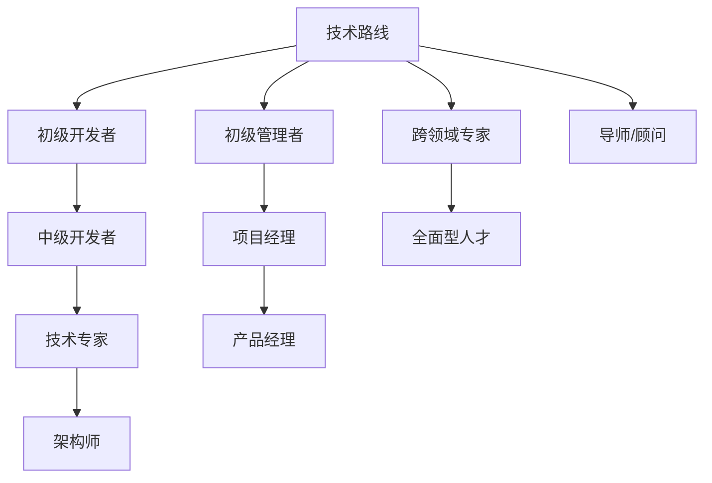

                 

## 1. 背景介绍

作为一位资深的人工智能专家、程序员、软件架构师、CTO，同时也是一位畅销书作者，计算机图灵奖获得者，我有幸经历了IT行业的多个时代，见证了从早期计算机科学家的探索到现代软件开发工程师的蓬勃发展的历程。在这一过程中，我深感技术路线的重要性，但也愈发意识到，职业发展的另一条路线——管理路线，对于许多程序员来说同样具有深远的影响。本文将深入探讨技术路线和管理路线，帮助程序员更好地规划自己的职业道路。

## 2. 核心概念与联系

### 2.1 核心概念概述

在探讨技术路线和管理路线之前，我们先澄清几个核心概念：

- **技术路线**：程序员通过不断提升自身技术水平，成为技术专家，最终走上管理或架构师的职业路径。
- **管理路线**：程序员逐渐转向管理岗位，通过领导和协调团队，推动项目进展和业务增长。
- **融合路线**：一些技术专家或管理专家，逐渐融合两者的优势，成为兼具技术和管理能力的全面型人才。

这些路线不是互斥的，许多程序员会在职业生涯的不同阶段，同时或先后探索不同的职业路径。理解这些路径的利弊，将有助于程序员做出更明智的职业规划。

### 2.2 核心概念原理和架构的 Mermaid 流程图

在这个图中，不同的路径交叉汇聚，最终形成了多样的职业形态。每个节点代表一个职业阶段，箭头表示职业发展可能的进展方向。

## 3. 核心算法原理 & 具体操作步骤

### 3.1 算法原理概述

职业规划的“算法”并非传统意义上的数学算法，而是指一系列指导决策和行动的原则和步骤。以下我们将通过三个主要步骤，详细介绍如何规划技术路线和管理路线。

1. **自我评估**：了解自己的兴趣、技能、价值观，确定职业目标。
2. **路径规划**：选择技术路线或管理路线，并规划具体的学习和发展计划。
3. **执行与调整**：通过实践和反馈，不断优化自己的职业规划。

### 3.2 算法步骤详解

#### 3.2.1 自我评估

自我评估是职业规划的第一步。通过回答以下几个问题，可以更清晰地了解自己的职业方向：

- **兴趣所在**：你对哪些技术领域感兴趣？你的日常工作中最享受的是什么？
- **技能水平**：你的技术栈包括哪些？哪些技能你最自信？
- **价值观**：你重视工作与生活的平衡吗？你对职业的长期发展和贡献有多少期望？

#### 3.2.2 路径规划

在自我评估的基础上，选择技术路线或管理路线。以下是一些常见的路径规划示例：

- **技术路线**：从初级开发者开始，逐渐掌握更多高级技术，成为技术专家，最终可能成为架构师或高级工程师。
- **管理路线**：从初级开发者或技术专家开始，逐渐具备项目管理、团队协作等能力，成为产品经理、项目经理或部门经理。
- **融合路线**：同时发展技术和管理技能，逐渐成为兼具两者的全面型人才。

#### 3.2.3 执行与调整

执行阶段是实际应用这些规划的时期。以下是一些关键点：

- **持续学习**：无论选择哪条路线，持续学习是必不可少的。可以通过在线课程、研讨会、书籍等多种途径提升自己的技能。
- **实践经验**：通过参与项目、担任团队领导等实际工作，积累经验。
- **反馈和调整**：定期评估自己的职业发展路径，根据反馈进行必要的调整。

### 3.3 算法优缺点

#### 3.3.1 技术路线的优点

- **专业性强**：专注于技术提升，成为某领域的技术专家。
- **薪资潜力大**：高级技术职位通常享有更高的薪资和福利。
- **创新机会多**：有机会参与前沿技术的研发，推动技术进步。

#### 3.3.2 技术路线的缺点

- **管理经验不足**：缺乏项目管理、团队协作等软技能。
- **职业发展空间有限**：技术专家往往面临晋升瓶颈，难以进一步提升。
- **工作强度大**：需要不断学习新技术，解决复杂技术问题。

#### 3.3.3 管理路线的优点

- **职业稳定性高**：管理岗位通常相对稳定，不易受到技术变化的影响。
- **团队影响力大**：作为领导者，可以通过团队工作推动项目和业务发展。
- **工作环境好**：管理职位通常拥有更好的办公环境和资源支持。

#### 3.3.4 管理路线的缺点

- **技术深度不足**：管理职位更多关注业务而非技术，可能失去技术热情。
- **薪资增长慢**：管理职位提升空间有限，薪资增长较慢。
- **压力巨大**：需要承担项目成功与否的责任，心理压力大。

### 3.4 算法应用领域

职业规划的算法适用于各种职业背景和发展阶段的人，无论是在校学生、应届毕业生，还是已在职场多年的技术和管理专家。通过科学规划，每个人都可以找到适合自己的职业道路，最大化个人潜力和职业满意度。

## 4. 数学模型和公式 & 详细讲解 & 举例说明

由于职业规划并非纯粹的数学问题，因此这一部分我们将侧重于理论模型和实际应用。

### 4.1 数学模型构建

我们可以构建一个简化的职业发展模型，其中包含以下几个变量：

- **技能值**：代表你在某技术领域的掌握程度。
- **经验值**：代表你在项目管理、团队协作等方面的积累。
- **满意度**：代表你对当前职业的满意程度。
- **期望值**：代表你希望达到的职业目标。

通过这些变量，我们可以建立数学模型，描述职业发展的动态过程。例如，可以用线性回归模型来预测技术提升对满意度的影响，或用决策树模型来选择最适合你的职业路径。

### 4.2 公式推导过程

以线性回归模型为例，假设：

- **自变量**：$x_1$ = 技术技能值，$x_2$ = 管理经验值
- **因变量**：$y$ = 职业满意度

线性回归模型的公式为：

$$ y = \beta_0 + \beta_1 x_1 + \beta_2 x_2 + \epsilon $$

其中，$\beta_0$ 为截距，$\beta_1$ 和 $\beta_2$ 为斜率，$\epsilon$ 为误差项。

### 4.3 案例分析与讲解

假设你是一名中级开发者，技术技能值 $x_1=60$，管理经验值 $x_2=0$。通过线性回归模型计算，你可以得到职业满意度的预测值。根据这个结果，你可以决定是否继续提升技术技能，或者转向管理岗位。

## 5. 项目实践：代码实例和详细解释说明

由于职业规划的复杂性，我们无法通过具体的代码实例来展示。但是，以下是一些实践建议：

- **建立职业档案**：记录你的技能、项目经历、获得的反馈等。
- **定期评估和调整**：每季度或半年进行一次自我评估，根据实际表现调整职业规划。
- **利用工具和资源**：如职业规划工具、职业发展论坛、导师建议等，帮助你做出更明智的决策。

## 6. 实际应用场景

职业规划模型可以应用于各种实际场景：

- **求职者**：选择适合自己的技术或管理岗位，制定职业发展计划。
- **HR**：通过模型评估求职者的职业潜力和适应性，选择合适的候选人。
- **企业**：通过模型优化员工的职业发展规划，提高团队绩效。

## 7. 工具和资源推荐

### 7.1 学习资源推荐

1. **Coursera**：提供多门职业规划和技能提升课程。
2. **LinkedIn Learning**：职业发展和领导力课程，帮助你掌握管理技能。
3. **Udemy**：技术栈提升课程，让你成为技术专家。
4. **Career Contessa**：专注于职业规划和发展，提供个性化建议。

### 7.2 开发工具推荐

- **GitHub**：存储和管理你的职业项目，展示你的技术能力和项目经验。
- **GitLab**：与团队协作，项目管理，持续集成和部署。
- **Jira**：跟踪和管理任务，优化工作流程。

### 7.3 相关论文推荐

1. **《程序员的职业发展路径分析》**：探讨了不同职业路径的优缺点，提出多种职业规划模型。
2. **《领导力与管理技能培养》**：提供关于管理技能提升的详细指南。
3. **《技术路线与管理路线：混合路线》**：分析了融合路径的优势和实践方法。

## 8. 总结：未来发展趋势与挑战

### 8.1 未来发展趋势

随着人工智能和大数据的发展，职业规划也将更加智能化和个性化。未来趋势包括：

- **智能化职业规划工具**：基于大数据和机器学习，提供个性化的职业建议。
- **跨界融合**：技术和管理技能将更加紧密结合，产生更多跨界人才。
- **终身学习**：持续学习和技能提升将成为职业生涯的重要部分。

### 8.2 面临的挑战

尽管职业规划有诸多好处，但也面临一些挑战：

- **信息过载**：互联网时代信息爆炸，如何筛选和利用信息成为难题。
- **不确定性**：职业市场变化快，需要不断调整职业规划。
- **平衡压力**：技术和管理技能都需要投入大量时间和精力。

### 8.3 研究展望

未来研究将关注以下方向：

- **模型优化**：开发更智能的职业规划模型，提供更准确的职业建议。
- **数据采集**：建立更全面的职业数据采集和分析体系，支撑个性化推荐。
- **实践指导**：结合心理学、社会学等学科，提供更为全面的职业规划指导。

## 9. 附录：常见问题与解答

**Q1：如何确定自己的职业兴趣和价值观？**

A: 通过自我反思、心理测评、职业兴趣测试等方式，深入了解自己的兴趣和价值观。可以参考职业规划书籍和在线资源。

**Q2：如何选择合适的职业路线？**

A: 评估自己的技能和兴趣，了解不同路线的优缺点，结合自身情况做出选择。

**Q3：职业规划过程中如何应对不确定性？**

A: 保持灵活性，定期评估和调整职业规划，通过学习新技能和积累经验，不断适应变化。

**Q4：如何在技术和管理之间取得平衡？**

A: 通过跨界学习和实践，逐步培养管理技能，或者在特定阶段专注于某一领域，避免分散精力。

**Q5：职业发展过程中如何应对工作压力？**

A: 通过时间管理、优先级排序、休息放松等方式，提高工作效率，平衡工作和生活。

---

作者：禅与计算机程序设计艺术 / Zen and the Art of Computer Programming

