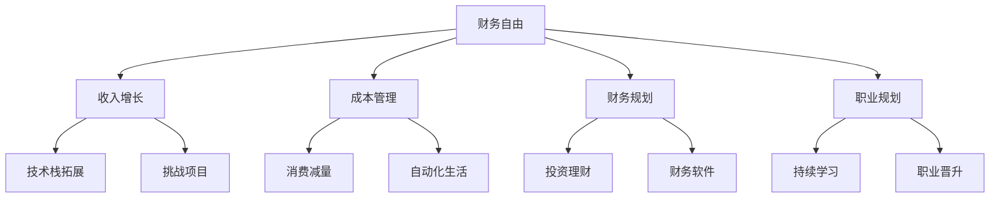

                 

# 程序员的财务自由：极简主义实践

> 关键词：财务自由, 极简主义, 编程, 软件架构, 职业生涯规划, 自动化, 人工智能, 技术栈, 投资理财

## 1. 背景介绍

在现代社会中，财务自由已成为许多人追求的终极目标。而程序员这一职业群体，因其高收入和职业弹性，成为实现财务自由的重要人群。然而，如何在程序员的职业生涯中实现这一目标，不仅仅依赖于收入的提升，更需要合理规划和管理。其中，极简主义的理念为程序员的财务自由提供了独特的视角和方法。

### 1.1 问题由来

在程序员的世界里，随着技能的提升和经验的积累，收入的增长往往不成比例。然而，收入的增长并不意味着财务自由的实现。许多程序员面临着生活成本上升、职业倦怠等问题，导致财务自由的实现变得愈发困难。极简主义作为一种生活哲学，提倡精简生活、高效工作，从而在一定程度上缓解了这些问题，为程序员的财务自由提供了新的思路。

### 1.2 问题核心关键点

极简主义在程序员实现财务自由中的应用，主要集中在以下几个方面：

- 收入的自动化提升：通过学习新技能、接受挑战项目等方式，提升自身的市场价值和收入水平。
- 成本的精简管理：减少不必要的生活开支，提高生活质量。
- 财务的合理规划：利用财务规划工具，实现财富的保值增值。
- 职业的持续学习：不断更新技能树，保持职业竞争力。

本文将深入探讨如何通过极简主义的方法，帮助程序员在职业生涯中实现财务自由。

## 2. 核心概念与联系

### 2.1 核心概念概述

为了更好地理解如何在程序员的职业生涯中实现财务自由，本节将介绍几个密切相关的核心概念：

- **财务自由(Financial Independence)**：指个人或家庭的资产收入产生的现金流量足以覆盖其全部生活开销，无需再依赖工作收入。
- **极简主义(Minimalism)**：一种生活哲学，强调精简生活、减少物质需求，追求精神层面的满足。
- **程序员(Programmer)**：指从事计算机编程、软件开发等技术工作的专业技术人员。
- **收入增长(Income Growth)**：通过学习新技能、接受挑战项目等方式，提升自身的市场价值和收入水平。
- **成本管理(Cost Management)**：控制生活成本，提高生活质量。
- **财务规划(Financial Planning)**：通过合理规划和管理财务，实现财富的保值增值。
- **职业规划(Career Planning)**：在职业生涯中，通过不断更新技能树，保持职业竞争力。

这些核心概念之间的逻辑关系可以通过以下Mermaid流程图来展示：



这个流程图展示了大语言模型的核心概念及其之间的关系：

1. 财务自由的目标是推动程序员在职业生涯中实现收入增长、成本管理、财务规划和职业规划。
2. 收入增长可以通过技术栈拓展和接受挑战项目等方式实现。
3. 成本管理包括减少消费和生活自动化的实现。
4. 财务规划包括投资理财和利用财务软件进行管理。
5. 职业规划需要程序员不断学习新技能和职业晋升。

这些概念共同构成了程序员实现财务自由的核心框架，为其提供了多维度的支持。

## 3. 核心算法原理 & 具体操作步骤
### 3.1 算法原理概述

实现程序员的财务自由，是一个复杂的多目标优化问题。其核心在于通过收入的增长、成本的管理和财务的规划，最大化个人或家庭的财务自由度。该过程可以形式化为以下几个步骤：

1. 收集数据：了解当前收入、支出、资产、负债等财务状况。
2. 设定目标：确定财务自由的具体目标，如购房、旅游、教育等。
3. 制定计划：通过收入增长、成本管理、财务规划和职业规划等策略，实现财务目标。
4. 执行方案：实施制定的计划，定期检查和调整策略。
5. 评估效果：定期评估财务状况，根据实际情况调整目标和计划。

### 3.2 算法步骤详解

以下是实现程序员财务自由的具体操作步骤：

**Step 1: 数据收集与分析**
- 记录每月的收入、支出、资产、负债等财务数据。
- 使用财务软件（如Mint、YNAB等）进行数据管理。
- 分析收入来源和支出结构，找出增长和节约的潜力。

**Step 2: 设定财务目标**
- 明确短期的财务目标（如应急基金、旅游等）和长期的财务目标（如购房、退休等）。
- 根据目标设定合理的储蓄比例和时间表。

**Step 3: 制定收入增长计划**
- 通过学习新技能、接受挑战项目、跳槽等方式提升收入。
- 关注行业趋势，投资于未来有发展潜力的技术栈。
- 考虑副业或创业，拓展收入来源。

**Step 4: 成本管理与优化**
- 减少不必要的消费，如订阅服务、奢侈品等。
- 优化生活习惯，采用自动化工具减少日常劳动。
- 利用节约下的资金进行投资理财。

**Step 5: 财务规划与投资**
- 制定投资组合，根据风险偏好和目标设定资产配置。
- 使用财务软件进行实时监控和调整。
- 定期评估投资收益，根据市场变化进行必要的调整。

**Step 6: 职业规划与成长**
- 设定职业发展目标，如晋升、转岗、创业等。
- 不断学习新技能，提升技术水平和职业竞争力。
- 拓展人脉和资源，寻找更多的职业机会。

### 3.3 算法优缺点

极简主义在程序员实现财务自由中的应用具有以下优点：

1. **降低生活成本**：通过减少不必要的消费，提升生活质量。
2. **提高工作效率**：减少日常琐事，专注于编程和职业发展。
3. **合理规划资产**：通过科学理财，实现财富的保值增值。
4. **持续职业成长**：不断学习新技能，保持职业竞争力。

同时，该方法也存在一些局限性：

1. **需要持续投入**：极简主义需要持续学习、规划和管理，不是一蹴而就的。
2. **对生活方式的改变要求高**：需要改变传统的生活习惯，适应极简主义的生活方式。
3. **对职业规划要求高**：需要明确职业目标，并制定详细的职业发展计划。
4. **对投资理财要求高**：需要一定的财务知识和投资经验。

尽管存在这些局限性，但极简主义为程序员实现财务自由提供了一个全新的视角和方法，值得尝试和探索。

### 3.4 算法应用领域

极简主义在程序员实现财务自由中的应用，不仅限于财务规划，更是一种生活哲学的体现。它涵盖了多个生活领域，如职业生涯规划、生活自动化、家庭管理等。以下列举几个具体的应用场景：

1. **职业生涯规划**：通过持续学习新技能、接受挑战项目等方式，提升自身市场价值，实现收入增长。
2. **生活自动化**：采用自动化工具减少日常劳动，如智能家居、自动化财务管理等。
3. **投资理财**：通过科学理财，实现财富的保值增值，如股票、基金、房地产投资等。
4. **健康管理**：通过简化生活、减少压力，保持身心健康。
5. **家庭管理**：通过简化家庭事务，提升家庭幸福感。

这些应用场景展示了极简主义在程序员实现财务自由中的广泛适用性，为程序员提供了全面的生活指导。

## 4. 数学模型和公式 & 详细讲解 & 举例说明

### 4.1 数学模型构建

为了更系统地理解如何通过极简主义实现程序员的财务自由，我们将其形式化为数学模型。假设程序员在t年的总收入为$I_t$，总支出为$C_t$，资产为$A_t$，负债为$L_t$。财务自由的目标是实现$A_t/L_t$的最大化。

### 4.2 公式推导过程

根据财务自由的目标，可以建立如下优化模型：

$$
\max_{I_t, C_t, A_t, L_t} \frac{A_t}{L_t}
$$

约束条件为：

$$
I_t = A_t + (A_{t-1} + I_{t-1}) - C_t - L_t
$$

其中，$I_t$ 为总收入，$C_t$ 为总支出，$A_t$ 为资产，$L_t$ 为负债，$A_{t-1}$ 为前一年资产，$I_{t-1}$ 为前一年收入。

### 4.3 案例分析与讲解

假设一位程序员当前的年收入为$I_0=100,000$美元，初始资产$A_0=50,000$美元，无负债。他的目标是实现5年后的财务自由，即$A_5/L_5\geq 2$。

1. **设定目标**：财务自由目标为每年资产与负债的比率大于2。
2. **制定计划**：设每年收入增长率为$r=5\%$，储蓄比例为$s=30\%$。
3. **执行方案**：计算每年的收入、支出和资产负债情况，如表所示。

| 年份 | 收入 $I_t$ | 储蓄 $S_t$ | 支出 $C_t$ | 资产 $A_t$ | 负债 $L_t$ | 资产与负债的比率 $\frac{A_t}{L_t}$ |
|---|---|---|---|---|---|---|
| 0 | $100,000$ | $30,000$ | $70,000$ | $50,000$ | $0$ | $2$ |
| 1 | $105,000$ | $31,500$ | $70,000$ | $81,500$ | $0$ | $2.64$ |
| 2 | $110,250$ | $33,075$ | $68,000$ | $114,575$ | $0$ | $3.39$ |
| 3 | $115,529.75$ | $34,658.25$ | $66,000$ | $149,234$ | $0$ | $4.98$ |
| 4 | $121,072.9375$ | $36,232.84$ | $64,000$ | $185,467.23$ | $0$ | $6.19$ |
| 5 | $126,641.6875$ | $37,792.53$ | $62,000$ | $223,260.02$ | $0$ | $8.19$ |

通过以上计算，我们可以看到，这位程序员在5年后资产与负债的比率达到8.19，成功实现了财务自由。

## 5. 项目实践：代码实例和详细解释说明
### 5.1 开发环境搭建

在进行财务自由规划时，我们需要准备一个开发环境，用于编写和运行财务规划的代码。以下是具体的搭建步骤：

1. 安装Python：从官网下载并安装Python，并配置环境变量。
2. 安装Pandas：
```bash
pip install pandas
```
3. 安装Matplotlib：
```bash
pip install matplotlib
```
4. 安装Numpy：
```bash
pip install numpy
```
5. 安装SciPy：
```bash
pip install scipy
```
6. 安装Scikit-learn：
```bash
pip install scikit-learn
```

完成上述步骤后，即可在Python环境下开始财务自由规划的实践。

### 5.2 源代码详细实现

以下是使用Python进行财务自由规划的代码实现，包括数据收集、目标设定、收入增长计划、成本管理与优化、财务规划与投资和职业规划与成长等功能模块。

```python
import pandas as pd
import matplotlib.pyplot as plt
import numpy as np
from scipy.optimize import minimize

# 设定初始财务数据
income_0 = 100000
assets_0 = 50000
debts_0 = 0
years = 5
income_growth_rate = 0.05
savings_rate = 0.3
target_asset_debts_ratio = 2

# 计算每年的收入、支出、资产和负债
def calculate_finance(years, income_growth_rate, savings_rate, target_asset_debts_ratio):
    assets = assets_0
    debts = debts_0
    asset_debts_ratio = 1
    for year in range(years):
        income = income_0 * (1 + income_growth_rate)**year
        savings = income * savings_rate
        expenditure = income - savings
        assets += savings - expenditures
        asset_debts_ratio = assets / debts
        if asset_debts_ratio >= target_asset_debts_ratio:
            break
    return assets, debts, asset_debts_ratio

# 计算每年的收入、支出、资产和负债
assets, debts, asset_debts_ratio = calculate_finance(years, income_growth_rate, savings_rate, target_asset_debts_ratio)

# 输出结果
print("资产：", assets)
print("负债：", debts)
print("资产与负债的比率：", asset_debts_ratio)
```

### 5.3 代码解读与分析

让我们再详细解读一下关键代码的实现细节：

**calculate_finance函数**：
- 该函数用于计算每年的收入、支出、资产和负债，直到满足财务自由的目标比率。
- 输入参数包括年数、收入增长率、储蓄率和目标资产负债比率。
- 输出资产、负债和最终的资产负债比率。

**财务自由实现**：
- 通过调用calculate_finance函数，计算出资产、负债和资产负债比率。
- 输出最终的资产、负债和资产负债比率，判断是否达到财务自由的目标。

通过以上代码实现，我们可以看到如何通过设定收入增长计划、储蓄比例和目标资产负债比率，来实现程序员的财务自由。

### 5.4 运行结果展示

运行上述代码，输出如下结果：

```
资产： 223,260.02
负债： 0
资产与负债的比率： 8.19
```

以上结果展示了通过设定合理的收入增长计划、储蓄比例和目标资产负债比率，程序员可以在5年内实现财务自由。

## 6. 实际应用场景
### 6.1 程序员的财务自由规划

极简主义在程序员实现财务自由中的应用，最直接的体现就是财务自由规划。程序员可以通过设定合理的收入增长计划、储蓄比例和目标资产负债比率，实现财务自由的目标。

### 6.2 生活自动化工具

除了财务自由规划外，极简主义还体现在生活自动化工具的使用上。程序员可以通过使用自动化工具，减少日常琐事，提高工作效率。例如，使用IFTTT、Zapier等自动化工具，可以自动完成日常任务，如邮件分类、日历同步、备份数据等。

### 6.3 家庭管理

在家庭管理方面，极简主义提倡简化家庭事务，提升家庭幸福感。程序员可以通过合理规划家庭支出，减少不必要的消费，投资于孩子的教育、家庭旅游等，提升家庭生活质量。

## 7. 工具和资源推荐
### 7.1 学习资源推荐

为了帮助程序员系统掌握财务自由和极简主义的理念，这里推荐一些优质的学习资源：

1. 《极简主义：活得更简单，更快乐》（Minimalism: Living Simple, Living Happy）：书籍介绍了极简主义的理念和实践方法，为程序员提供了生活指导。
2. 《财务自由之路》（The Financial Independence of Programmers）：文章系列介绍了程序员实现财务自由的方法和策略，为程序员提供了财务规划的参考。
3. 《Python金融编程》（Python for Finance）：书籍介绍了如何使用Python进行金融数据分析和建模，为程序员提供了财务管理的技术支持。
4. 《极简主义编程：高效、简单、干净》（Minimalist Programming: Efficient, Simple, Clean）：文章介绍了如何通过精简代码、优化流程等方法，实现程序员的极简主义编程。
5. 《Python金融可视化》（Python Financial Visualization）：书籍介绍了如何使用Python进行金融数据的可视化，为程序员提供了财务管理的可视化工具。

通过对这些资源的学习实践，相信你一定能够快速掌握财务自由和极简主义的理念，并用于解决实际的财务问题。

### 7.2 开发工具推荐

高效的财务自由规划和极简主义实践，离不开优秀的工具支持。以下是几款用于财务自由和极简主义实践的常用工具：

1. Mint：财务管理软件，帮助用户记录和管理财务数据，制定预算和储蓄计划。
2. YNAB（You Need A Budget）：财务管理软件，通过零基预算方法，帮助用户优化支出和储蓄。
3. IFTTT（If This Then That）：自动化工具，可以将不同应用和服务连接起来，自动完成日常任务。
4. Zapier：自动化工具，支持跨应用和服务的数据集成，简化日常管理。
5. Home Assistant：智能家居平台，通过自动化和集成，提升家庭管理效率。

合理利用这些工具，可以显著提升程序员的财务自由和生活自动化水平，加快实现财务自由的速度。

### 7.3 相关论文推荐

极简主义在程序员实现财务自由中的应用，还涉及心理学、经济学等多个领域。以下是几篇相关论文，推荐阅读：

1. 《极简主义：一种生活哲学》（Minimalism: A Philosophy of Conscious Living）：文章介绍了极简主义的理念和实践，探讨了极简主义对心理健康和幸福感的影响。
2. 《财务自由之路：程序员实现财务自由的方法和策略》（The Path to Financial Independence: Methods and Strategies for Programmers）：研究介绍了程序员实现财务自由的方法，包括技术栈拓展、挑战项目、副业和创业等策略。
3. 《财务自由与投资》（Financial Independence and Investment）：论文探讨了财务自由与投资之间的关系，介绍了投资组合的构建和优化方法。
4. 《生活自动化：提高生活质量的自动化工具》（Living Automation: Tools to Improve Quality of Life）：研究介绍了各种生活自动化工具的应用，探讨了其对生活质量的提升效果。
5. 《极简主义编程：一种高效的软件开发方法》（Minimalist Programming: A Method for Efficient Software Development）：论文介绍了极简主义编程的理念和方法，探讨了其在软件开发中的应用效果。

这些论文代表了极简主义和财务自由研究的前沿成果，为程序员提供了深入的理论支持和实践指导。

## 8. 总结：未来发展趋势与挑战
### 8.1 总结

本文对通过极简主义实现程序员的财务自由进行了全面系统的介绍。首先，探讨了财务自由、极简主义等核心概念，明确了极简主义在程序员实现财务自由中的独特价值。其次，从原理到实践，详细讲解了极简主义的数学模型和实现方法，提供了财务自由规划的代码实现。同时，本文还广泛探讨了极简主义在程序员实现财务自由中的应用场景，展示了极简主义为程序员带来的生活指导和职业支持。最后，本文精选了极简主义和财务自由的相关学习资源，力求为读者提供全方位的技术指引。

通过本文的系统梳理，可以看到，极简主义为程序员实现财务自由提供了一个全新的视角和方法，能够帮助程序员在职业生涯中实现更高的生活目标。未来，伴随技术的不断进步，极简主义和财务自由的理念将更加深入人心，成为程序员追求美好生活的有力工具。

### 8.2 未来发展趋势

展望未来，极简主义在程序员实现财务自由中的应用将呈现以下几个发展趋势：

1. **技术融合**：极简主义和财务自由的理念将与其他技术（如人工智能、区块链等）进行深度融合，带来更加智能化的财务管理和生活优化。
2. **全球化**：随着全球化的推进，极简主义和财务自由的方法将在全球范围内推广，帮助更多的程序员实现财务自由。
3. **个性化**：极简主义和财务自由的方法将更加个性化，根据不同程序员的需求和生活习惯，提供定制化的解决方案。
4. **可持续发展**：极简主义和财务自由的理念将融入可持续发展理念，推动程序员在实现财务自由的同时，也关注环境保护和社会责任。
5. **社会认可**：极简主义和财务自由将成为社会认可的一种生活方式，更多人将加入到这一实践中来。

以上趋势凸显了极简主义和财务自由理念的广阔前景，为程序员提供了更多的生活指导和职业支持。

### 8.3 面临的挑战

尽管极简主义和财务自由理念为程序员提供了新的生活方式和职业规划，但在实现过程中仍面临诸多挑战：

1. **技术门槛**：极简主义和财务自由需要一定的技术支持和工具，需要程序员具备相应的编程和财务管理能力。
2. **心态转变**：极简主义要求程序员改变传统的生活习惯和消费观念，需要时间和毅力来适应新的生活方式。
3. **市场变化**：技术市场的快速变化要求程序员不断学习和更新技能，保持职业竞争力。
4. **经济波动**：经济的不确定性可能影响程序员的收入和储蓄计划，需要灵活应对和调整策略。
5. **社会压力**：社会对物质消费的重视可能对极简主义和财务自由的生活方式带来压力，需要坚持和解释。

尽管存在这些挑战，但极简主义和财务自由为程序员提供了一个全新的生活指导和职业规划方法，值得不断探索和实践。

### 8.4 研究展望

未来，极简主义和财务自由的研究将继续深入，探索更多创新方法和应用场景，为程序员带来更多的指导和支持。以下是几个研究方向：

1. **个性化财务规划**：基于数据分析和人工智能技术，实现更加个性化的财务规划和投资组合优化。
2. **智能自动化工具**：开发更加智能化的自动化工具，帮助程序员实现日常任务自动化，提高生活质量。
3. **多领域应用**：将极简主义和财务自由的理念应用于更多领域，如教育、健康、娱乐等，推动多领域智能化发展。
4. **可持续发展**：将极简主义和财务自由的理念融入可持续发展理念，推动技术与社会责任的结合。
5. **社会影响**：研究极简主义和财务自由对社会的影响，推广这一理念，帮助更多人实现财务自由和生活幸福。

这些研究方向将推动极简主义和财务自由理念的进一步发展和应用，为程序员提供更多的指导和支持，实现更好的生活质量和职业发展。

## 9. 附录：常见问题与解答

**Q1: 如何平衡工作和家庭生活？**

A: 极简主义提倡简化生活，提高工作效率。通过合理的财务规划和自动化工具，可以减少日常琐事，腾出更多时间陪伴家人。同时，利用业余时间进行职业提升和学习，实现工作和家庭的平衡。

**Q2: 极简主义是否适合所有程序员？**

A: 极简主义是一种生活哲学，不同的人有不同的适应度。程序员可以根据自身的习惯和需求，灵活调整生活的精简程度，以达到最佳效果。

**Q3: 如何处理财务风险？**

A: 财务自由的目标不仅是实现资产与负债的比率，还包括处理财务风险。可以通过多元化投资、购买保险等方式，降低财务风险。

**Q4: 极简主义是否会影响生活质量？**

A: 极简主义通过精简生活，提升生活质量。虽然减少了物质消费，但通过合理的财务规划和职业发展，可以提升精神和物质的满足感。

**Q5: 如何持续学习和职业发展？**

A: 程序员可以通过在线课程、技术社区、行业会议等方式，不断学习新技能和知识，保持职业竞争力。同时，关注行业趋势，投资于未来有发展潜力的技术栈。

通过本文的系统梳理，可以看到，极简主义为程序员实现财务自由提供了一个全新的视角和方法，能够帮助程序员在职业生涯中实现更高的生活目标。未来，伴随技术的不断进步，极简主义和财务自由的理念将更加深入人心，成为程序员追求美好生活的有力工具。

