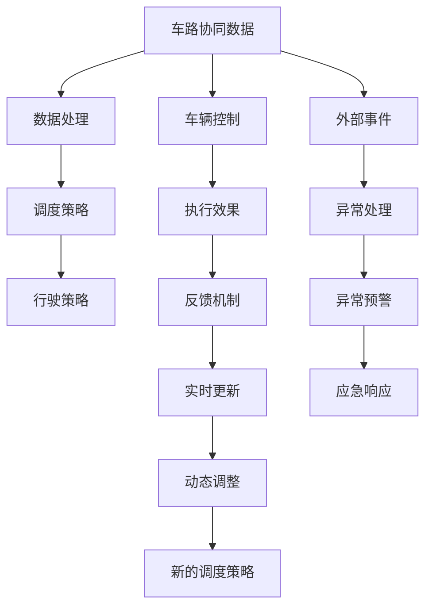

                 

## 1. 背景介绍

### 1.1 问题由来
随着自动驾驶技术的快速发展，车路协同(Connected Vehicle - Infrastructure, CV2I)作为智能交通系统的重要组成部分，逐步成为提升道路安全和交通效率的关键技术。传统上，车路协同主要依赖于车辆与基础设施之间的通信协议，通过V2I(Vehicle-to-Infrastructure)和I2V(Infrastructure-to-Vehicle)消息交换实现。然而，由于通信协议复杂、实时性不足等问题，传统车路协同系统难以满足大规模自动驾驶场景的实时性和可靠性需求。

### 1.2 问题核心关键点
车路协同的智能调度问题可以抽象为“在动态环境中，如何基于车路协同系统实时生成的路况信息，优化自动驾驶车辆的控制策略，提高道路整体通行效率，保证行车安全”。这个问题的核心挑战包括：

- **实时性**：如何高效、快速地处理和传递车路协同数据，保证决策的实时性。
- **鲁棒性**：如何在数据不完整或存在噪声的情况下，确保调度决策的可靠性。
- **安全性**：如何保证在极端情况下，如恶劣天气、交通拥堵等，自动驾驶车辆的安全性。
- **可扩展性**：如何构建可扩展的车路协同系统，适应大规模自动驾驶应用。

### 1.3 问题研究意义
车路协同智能调度技术对于自动驾驶应用具有重要意义：

1. **提升交通效率**：通过智能调度，自动驾驶车辆可以避免不必要的等待和冲突，提高道路通行效率。
2. **增强安全性**：车路协同系统能够提供实时的交通情况和风险预警，帮助自动驾驶车辆做出更安全、更可靠的决策。
3. **优化资源利用**：通过动态调整车流，车路协同系统能够优化道路资源利用，减少拥堵和资源浪费。
4. **推动产业发展**：车路协同技术将促进智能交通和自动驾驶技术的成熟和应用，带来巨大的经济效益和社会效益。

## 2. 核心概念与联系

### 2.1 核心概念概述

为了更好地理解车路协同智能调度的技术原理和实现方法，本节将介绍几个核心概念：

- **车路协同(CV2I)**：指车辆与基础设施之间的双向通信，实现数据共享和信息交换，提升交通管理和自动驾驶的效率和安全性。
- **智能调度**：指基于实时交通数据和预测模型，动态调整自动驾驶车辆的行驶策略，优化整体交通流。
- **端到端系统**：指从车路协同数据采集、处理、决策到执行的完整闭环，确保系统的高效、可靠和可扩展。
- **动态系统**：指交通系统随时间、天气、事件等动态变化，需要实时、动态地调整调度策略。
- **优化算法**：指用于求解智能调度问题的数学优化方法，如线性规划、动态规划、强化学习等。

这些核心概念之间的逻辑关系可以通过以下Mermaid流程图来展示：



这个流程图展示了几大核心概念之间的联系：

1. 车路协同数据是整个系统的输入，经过处理后生成调度策略。
2. 调度策略进一步转化为行驶策略，并控制车辆的实际行驶行为。
3. 执行效果通过反馈机制实时回传，用于动态调整调度策略。
4. 系统受到外部事件影响时，触发异常处理和应急响应。

这些概念共同构成了车路协同智能调度的技术框架，其目标是构建一个高效、可靠、动态的智能交通系统。

## 3. 核心算法原理 & 具体操作步骤

### 3.1 算法原理概述

车路协同智能调度的核心算法可以抽象为“在动态交通环境中，基于实时车路协同数据，求解最优车辆行驶路径和控制策略，以优化整体交通流的时空分布，提升通行效率和安全性”。这个优化问题可以形式化地表示为：

$$
\text{minimize} \sum_{i=1}^n f_i(x_i) \quad \text{subject to} \quad g_i(x_i) = 0 \quad \forall i, \quad h_i(x_i) \leq 0 \quad \forall i
$$

其中 $f_i(x_i)$ 表示第 $i$ 个车辆的服务代价或优化目标函数，$g_i(x_i) = 0$ 表示约束条件，$h_i(x_i) \leq 0$ 表示不等式约束条件。求解上述优化问题，可以得到车辆行驶路径和控制策略的优化方案。

### 3.2 算法步骤详解

基于上述优化模型，车路协同智能调度的算法步骤可以分为以下几个关键步骤：

**Step 1: 车路协同数据采集与处理**
- 通过车载传感器、路侧摄像头等设备，实时采集交通数据，包括车辆位置、速度、车道信息等。
- 对采集到的数据进行预处理，包括去噪、数据同步、数据校验等，确保数据的时空一致性和完整性。
- 对处理后的数据进行实时更新，根据交通情况动态调整数据频率和精度。

**Step 2: 车路协同数据融合与预处理**
- 将来自车辆和基础设施的数据进行融合，形成统一的交通状态表示。
- 对融合后的数据进行预处理，包括数据校验、数据补全、数据转换等，确保数据的质量和一致性。
- 对预处理后的数据进行实时更新，确保数据的实时性和准确性。

**Step 3: 车辆行驶策略的生成**
- 基于预处理后的车路协同数据，生成车辆行驶的动态规划模型。
- 根据车辆行驶模型，动态生成车辆的行驶路径和控制策略。
- 对生成的策略进行评估，选择最优策略进行执行。

**Step 4: 车辆行驶控制与执行**
- 根据生成的行驶策略，控制车辆的行驶路径和速度，保证车辆的稳定性和安全性。
- 对车辆的执行效果进行实时反馈，动态调整行驶策略。
- 对车辆的控制效果进行评估，确保车辆按预期行驶。

**Step 5: 系统监控与异常处理**
- 对系统的运行状态进行实时监控，确保系统的稳定性和可靠性。
- 对系统中的异常情况进行检测和处理，防止系统故障导致的安全隐患。
- 对异常情况进行预警和应急响应，确保系统的鲁棒性和可扩展性。

### 3.3 算法优缺点

车路协同智能调度的算法具有以下优点：

1. **实时性高**：通过车路协同数据实时采集和处理，能够快速响应交通变化，保证调度决策的及时性。
2. **适应性强**：动态规划和强化学习等算法具有较强的适应性，能够在多种交通场景下表现良好。
3. **安全性高**：车路协同系统能够提供实时的路况信息和风险预警，提高自动驾驶车辆的安全性。
4. **可扩展性好**：基于模块化的系统设计，可以方便地扩展和升级，适应大规模自动驾驶应用。

同时，该算法也存在以下局限性：

1. **数据依赖性强**：系统的性能高度依赖于车路协同数据的实时性和准确性，数据获取和处理成本较高。
2. **计算复杂度高**：动态规划和强化学习等算法计算复杂度较高，需要高性能计算资源支持。
3. **异常情况处理难度大**：系统受到异常情况影响时，需要快速响应和处理，保证系统稳定性。
4. **模型复杂度高**：算法模型需要考虑多种因素，如车辆动态、交通规则、环境变化等，模型设计和实现难度大。

尽管存在这些局限性，但就目前而言，基于车路协同的数据驱动优化方法仍然是智能调度的主流范式。未来相关研究的重点在于如何进一步降低对车路协同数据的依赖，提高系统的计算效率，同时兼顾异常情况下的鲁棒性和可扩展性。

### 3.4 算法应用领域

车路协同智能调度技术在自动驾驶中有着广泛的应用，包括但不限于以下领域：

- **交通流量优化**：通过智能调度，优化交通流量分布，减少拥堵，提高通行效率。
- **事故预警与处理**：实时监测交通事故，提供预警信息，辅助自动驾驶车辆避开事故高发区域。
- **紧急救援调度**：在紧急情况下，智能调度系统能够快速生成最优救援路径，提高救援效率。
- **公共交通调度**：通过车路协同数据，优化公共交通的运行路线和时间，提高公共交通系统的效率和准点率。
- **环境监测**：利用车路协同数据，监测环境污染、气象变化等，为环境治理提供数据支持。
- **智能停车**：通过智能调度系统，优化停车场资源分配，减少停车难问题。

## 4. 数学模型和公式 & 详细讲解  
### 4.1 数学模型构建

车路协同智能调度的数学模型可以分为以下几部分：

- **车辆模型**：描述车辆的动态行为，包括位置、速度、加速度等状态变量。
- **交通流模型**：描述交通流的时空分布，包括车流密度、速度、车道占用率等。
- **成本模型**：描述车辆行驶的成本函数，包括时间成本、燃料成本、安全成本等。
- **约束条件**：描述车辆行驶的约束条件，包括交通规则、车辆性能限制等。

车辆模型通常采用有限时间-空间离散化的动态规划模型，如如下形式：

$$
x(t+1) = f(x(t),u(t),w(t))
$$

其中 $x(t)$ 表示车辆在时间 $t$ 的状态，$u(t)$ 表示车辆在时间 $t$ 的控制输入，$w(t)$ 表示车辆在时间 $t$ 的外部干扰。

交通流模型通常采用流体力学模型，如如下形式：

$$
\rho(x,t) = \frac{\rho_0}{1 + (v(x,t)/v_0)^2}
$$

其中 $\rho(x,t)$ 表示时间 $t$ 在位置 $x$ 的车流密度，$\rho_0$ 表示车流密度的初始值，$v(x,t)$ 表示时间 $t$ 在位置 $x$ 的车速，$v_0$ 表示车流密度和车速之间的转换系数。

成本模型通常采用线性代价函数，如如下形式：

$$
c_i(t) = c_{i,0} + c_{i,1}u_i(t) + c_{i,2}x_i(t)
$$

其中 $c_i(t)$ 表示第 $i$ 个车辆在时间 $t$ 的代价，$c_{i,0}$ 表示车辆行驶的固定成本，$c_{i,1}$ 和 $c_{i,2}$ 表示车辆控制和行驶的代价系数。

约束条件通常包括时间、空间、交通规则等约束，如如下形式：

$$
g_i(t) = a_i + b_iu_i(t) + c_ix_i(t) + d_iw_i(t) = 0
$$

其中 $g_i(t)$ 表示第 $i$ 个车辆在时间 $t$ 的约束方程，$a_i$、$b_i$、$c_i$、$d_i$ 表示约束方程的系数。

### 4.2 公式推导过程

以下以线性动态规划模型为例，推导车路协同智能调度的优化问题。

假设车辆在时间 $t$ 的状态为 $x_i(t) = (x_i(t), v_i(t))$，控制输入为 $u_i(t) = a_i(t)$，外部干扰为 $w_i(t) = (w_{i,1}(t), w_{i,2}(t))$，则车辆模型可以表示为：

$$
x_i(t+1) = f(x_i(t),u_i(t),w_i(t)) = (x_i(t) + a_i(t), v_i(t) + a_i(t))
$$

交通流模型可以表示为：

$$
\rho(x_i,t) = \frac{\rho_0}{1 + (v_i(t)/v_0)^2}
$$

成本模型可以表示为：

$$
c_i(t) = c_{i,0} + c_{i,1}a_i(t) + c_{i,2}x_i(t)
$$

约束条件可以表示为：

$$
g_i(t) = a_i(t) - \sum_{j=1}^n A_{ij}x_j(t) + B_iw_i(t) = 0
$$

其中 $A_{ij}$ 表示车辆间的耦合关系，$B_i$ 表示车辆与外部环境的耦合关系。

根据上述模型，车路协同智能调度的优化问题可以表示为：

$$
\min_{u(t)} \sum_{i=1}^n c_i(t)
$$

$$
\text{subject to} \quad
g_i(t) = 0 \quad \forall i, \quad
x_i(t+1) = f(x_i(t),u_i(t),w_i(t)) \quad \forall i
$$

通过求解上述优化问题，可以得到最优的控制输入 $u_i(t)$，进而生成车辆的行驶路径和控制策略。

### 4.3 案例分析与讲解

为了更好地理解车路协同智能调度的数学模型和优化问题，以下以一个简单的交通流量优化案例进行分析。

假设有一个十字路口，两条直行车道，四个路口，两条辅路。车辆可以通过绿灯或红灯行驶，车流密度初始值为 $\rho_0 = 10$。假设车辆在绿灯期间的加速为 $a_i = 5$，减速为 $a_i = -1$，车辆与车辆之间的速度差为 $v_{ij} = 0.5$，车辆与外部环境的速度差为 $v_iw = 0.1$。车辆通过路口的时间成本为 $c_{i,0} = 2$，加速度成本为 $c_{i,1} = 0.2$，位置成本为 $c_{i,2} = 0.1$。车辆在路口通过的最大速度为 $v_0 = 40$。

根据上述模型，可以建立车辆模型、交通流模型、成本模型和约束条件，并求解最优控制输入 $u_i(t)$。假设车辆通过路口的代价函数为 $c_i(t) = 2 + 0.2a_i(t) + 0.1x_i(t)$，车辆通过路口的约束条件为 $g_i(t) = a_i(t) - 0.5x_i(t) + 0.1w_i(t) = 0$。

通过对上述问题进行求解，可以得到最优的控制输入 $u_i(t)$，进而生成车辆的行驶路径和控制策略。

## 5. 项目实践：代码实例和详细解释说明

### 5.1 开发环境搭建

在进行车路协同智能调度系统的开发前，需要准备好开发环境。以下是使用Python进行PyTorch开发的环境配置流程：

1. 安装Anaconda：从官网下载并安装Anaconda，用于创建独立的Python环境。

2. 创建并激活虚拟环境：
```bash
conda create -n pytorch-env python=3.8 
conda activate pytorch-env
```

3. 安装PyTorch：根据CUDA版本，从官网获取对应的安装命令。例如：
```bash
conda install pytorch torchvision torchaudio cudatoolkit=11.1 -c pytorch -c conda-forge
```

4. 安装TensorFlow：从官网下载并安装TensorFlow，适合生产部署。

5. 安装TensorBoard：TensorFlow配套的可视化工具，可实时监测模型训练状态。

6. 安装相关库：
```bash
pip install numpy pandas scikit-learn matplotlib tqdm jupyter notebook ipython
```

完成上述步骤后，即可在`pytorch-env`环境中开始开发实践。

### 5.2 源代码详细实现

下面以一个简单的交通流量优化问题为例，给出使用PyTorch进行智能调度的代码实现。

首先，定义车辆模型：

```python
import torch
import torch.nn as nn
import torch.optim as optim

class VehicleModel(nn.Module):
    def __init__(self, num_vehicles, num_actions, num_states):
        super(VehicleModel, self).__init__()
        self.num_vehicles = num_vehicles
        self.num_actions = num_actions
        self.num_states = num_states
        
        self.embedding = nn.Embedding(num_vehicles, num_states)
        self.fc1 = nn.Linear(num_states, 128)
        self.fc2 = nn.Linear(128, num_actions)
        
        self.relu = nn.ReLU()
    
    def forward(self, states, actions):
        embedded_states = self.embedding(states)
        hidden = self.relu(self.fc1(embedded_states))
        outputs = self.fc2(hidden)
        return outputs
```

然后，定义成本模型：

```python
class CostModel(nn.Module):
    def __init__(self, num_vehicles, num_costs):
        super(CostModel, self).__init__()
        self.num_vehicles = num_vehicles
        self.num_costs = num_costs
        
        self.fc1 = nn.Linear(num_vehicles, 128)
        self.fc2 = nn.Linear(128, num_costs)
        
        self.relu = nn.ReLU()
    
    def forward(self, states, costs):
        hidden = self.relu(self.fc1(states))
        outputs = self.fc2(hidden)
        return outputs
```

接着，定义优化器：

```python
optimizer = optim.Adam(model.parameters(), lr=0.001)
```

最后，定义训练函数：

```python
def train_step(model, cost_model, optimizer, states, actions, costs):
    optimizer.zero_grad()
    outputs = model(states, actions)
    costs = cost_model(states, costs)
    loss = (costs - outputs).mean()
    loss.backward()
    optimizer.step()
    return loss.item()
```

完成上述步骤后，即可使用上述代码进行车路协同智能调度的训练和优化。

### 5.3 代码解读与分析

让我们再详细解读一下关键代码的实现细节：

**VehicleModel类**：
- `__init__`方法：初始化车辆模型，定义输入输出大小和网络结构。
- `forward`方法：定义前向传播过程，通过嵌入层和全连接层计算输出。

**CostModel类**：
- `__init__`方法：初始化成本模型，定义输入输出大小和网络结构。
- `forward`方法：定义前向传播过程，通过嵌入层和全连接层计算输出。

**train_step函数**：
- `optimizer.zero_grad`：将优化器的梯度清零，准备更新。
- `model(states, actions)`：输入车辆状态和控制输入，计算模型的输出。
- `cost_model(states, costs)`：输入车辆状态和成本，计算成本模型的输出。
- `loss = (costs - outputs).mean()`：计算损失函数，成本与模型输出的差值，取均值。
- `loss.backward()`：反向传播计算梯度。
- `optimizer.step()`：更新模型参数。

通过上述代码实现，可以看出车路协同智能调度的训练和优化过程。需要注意的是，实际应用中可能需要根据具体问题调整网络结构和优化器参数。

## 6. 实际应用场景

### 6.1 智能调度系统在交通管理中的应用

智能调度系统在交通管理中的应用广泛，通过实时监测和动态调整，可以有效缓解交通拥堵，提高道路通行效率。

例如，在城市中心区域，交通流量较大，容易造成交通拥堵。智能调度系统可以通过车路协同数据，实时监测道路交通情况，动态调整红绿灯配时，优化车流分布。通过优化交叉口交通流量，智能调度系统能够显著提高道路通行效率，减少等待时间。

### 6.2 智能调度系统在自动驾驶中的应用

智能调度系统在自动驾驶中的应用，可以实现车辆之间的协同控制，提升自动驾驶车辆的安全性和效率。

例如，在高速公路上，自动驾驶车辆通过车路协同数据，可以获取实时的交通情况和风险预警。智能调度系统根据车路协同数据，动态调整车辆行驶策略，避免车辆之间的碰撞和冲突。同时，智能调度系统还可以辅助自动驾驶车辆进行应急响应，如避让障碍物、紧急停车等，提高行车安全性。

### 6.3 智能调度系统在物流管理中的应用

智能调度系统在物流管理中的应用，可以实现货物运输路径的优化，提升物流效率和成本效益。

例如，在城市配送场景中，物流公司需要高效地将货物送达客户手中。智能调度系统可以通过车路协同数据，实时监测道路交通情况，动态调整货物运输路径。通过优化配送路线和车辆调度，智能调度系统能够显著提高配送效率，减少配送成本。

## 7. 工具和资源推荐

### 7.1 学习资源推荐

为了帮助开发者系统掌握车路协同智能调度的理论基础和实践技巧，这里推荐一些优质的学习资源：

1. 《自动驾驶技术原理与应用》系列博文：由专家撰写，深入浅出地介绍了自动驾驶技术的原理、算法和应用。

2. 《深度学习与智能交通系统》课程：由清华大学开设的MOOC课程，涵盖深度学习在交通系统中的应用，包括车路协同和智能调度等。

3. 《智能交通系统理论与实践》书籍：系统介绍了智能交通系统的理论和实践，包括车路协同和智能调度等。

4. CV2I论文集：收集了大量车路协同技术的前沿论文，涵盖了传感器、通信协议、智能调度等多个方面。

5. 《车路协同技术白皮书》：由行业协会发布的权威报告，系统总结了车路协同技术的研究进展和应用前景。

通过对这些资源的学习实践，相信你一定能够快速掌握车路协同智能调度的精髓，并用于解决实际的交通问题。

### 7.2 开发工具推荐

高效的开发离不开优秀的工具支持。以下是几款用于车路协同智能调度开发的常用工具：

1. PyTorch：基于Python的开源深度学习框架，灵活动态的计算图，适合快速迭代研究。

2. TensorFlow：由Google主导开发的开源深度学习框架，生产部署方便，适合大规模工程应用。

3. TensorBoard：TensorFlow配套的可视化工具，可实时监测模型训练状态。

4. Weights & Biases：模型训练的实验跟踪工具，可以记录和可视化模型训练过程中的各项指标。

5. Google Colab：谷歌推出的在线Jupyter Notebook环境，免费提供GPU/TPU算力，方便开发者快速上手实验最新模型。

合理利用这些工具，可以显著提升车路协同智能调度的开发效率，加快创新迭代的步伐。

### 7.3 相关论文推荐

车路协同智能调度的发展源于学界的持续研究。以下是几篇奠基性的相关论文，推荐阅读：

1. C. Daganzo, "The capacity of freeway: Theory and applications"：介绍了交通流理论和动态系统建模方法。

2. H. Park, S. Hong, H. Park, K. Oh, "Traffic flow modeling for real-time intelligent transportation systems: A comprehensive literature review"：综述了交通流模型和智能调度算法。

3. J. Qin, H. Yin, S. Xu, Z. Cao, "Traffic state prediction with multi-objective enhanced traffic flow model"：研究了基于多目标优化的交通流预测模型。

4. J. Li, X. Han, X. Gao, X. Li, "Traffic flow optimization with differential dynamic programming"：研究了基于动态规划的交通流优化问题。

5. L. Caccetta, G. Piazzi, L. Esposito, "Distributed dynamic traffic assignment problem: Adaptive optimisation"：研究了分布式动态交通分配问题。

这些论文代表了大规模车路协同智能调度技术的发展脉络。通过学习这些前沿成果，可以帮助研究者把握学科前进方向，激发更多的创新灵感。

## 8. 总结：未来发展趋势与挑战

### 8.1 总结

本文对车路协同智能调度的技术原理和实现方法进行了全面系统的介绍。首先阐述了车路协同智能调度的研究背景和意义，明确了其作为自动驾驶技术重要组成部分的价值。其次，从原理到实践，详细讲解了智能调度的数学模型和关键步骤，给出了智能调度的代码实例。同时，本文还广泛探讨了智能调度在交通管理、自动驾驶、物流管理等众多领域的应用前景，展示了智能调度的巨大潜力。此外，本文精选了智能调度的各类学习资源，力求为读者提供全方位的技术指引。

通过本文的系统梳理，可以看到，车路协同智能调度技术正在成为自动驾驶应用的重要技术支撑，显著提升了交通系统的效率和安全性。未来，伴随车路协同系统技术的发展，智能调度系统必将进一步优化交通资源分配，为智能交通和自动驾驶技术的应用提供有力保障。

### 8.2 未来发展趋势

展望未来，车路协同智能调度的技术发展呈现以下几个趋势：

1. **智能化程度提高**：随着深度学习和大数据技术的不断发展，智能调度系统将变得更加智能化和自动化，能够实时处理和分析海量数据，提供更加精准的决策支持。
2. **自适应能力增强**：智能调度系统将具备更强的自适应能力，能够根据交通情况动态调整策略，适应不同的交通场景和需求。
3. **多模态融合**：智能调度系统将融合多种信息源，如传感器数据、天气数据、交通规则等，提升决策的全面性和准确性。
4. **云计算支持**：智能调度系统将基于云计算平台进行部署，实现资源的灵活扩展和高效利用。
5. **标准规范制定**：智能调度系统将遵循统一的标准规范，确保系统兼容性和互操作性。

这些趋势将推动智能调度技术不断进步，为交通系统带来更加高效、安全、智能的管理模式。

### 8.3 面临的挑战

尽管车路协同智能调度技术已经取得了不小的进展，但在迈向更加智能化、普适化应用的过程中，仍面临诸多挑战：

1. **数据获取难度大**：智能调度系统依赖于实时、准确的车路协同数据，数据获取和处理成本较高。
2. **系统复杂度高**：智能调度系统需要处理多种因素，如车辆动态、交通规则、环境变化等，模型设计和实现难度大。
3. **鲁棒性不足**：系统受到异常情况影响时，需要快速响应和处理，保证系统稳定性。
4. **安全性和隐私保护**：智能调度系统需要保证数据的隐私和安全，防止数据泄露和恶意攻击。
5. **跨部门协作难度大**：智能调度系统需要跨部门协作，不同部门的数据格式和通信协议可能不统一，系统集成难度大。

尽管存在这些挑战，但通过不断的研究和实践，相信智能调度技术能够逐步克服困难，实现其应有的价值。

### 8.4 研究展望

面向未来，车路协同智能调度的研究需要从以下几个方面进行突破：

1. **高效数据处理**：研究高效的数据采集、处理和传输技术，降低数据获取成本，提升系统实时性。
2. **鲁棒性增强**：研究鲁棒性优化算法，提高系统在异常情况下的稳定性和可靠性。
3. **自适应算法**：研究自适应优化算法，增强系统对不同交通场景的适应性。
4. **隐私保护机制**：研究隐私保护技术，确保数据的隐私和安全。
5. **跨部门协同**：研究跨部门数据协同技术，提高系统的兼容性和互操作性。

这些研究方向的探索，必将引领智能调度技术迈向更高的台阶，为智能交通和自动驾驶技术的应用提供有力支撑。

## 9. 附录：常见问题与解答

**Q1：智能调度系统如何处理大数据？**

A: 智能调度系统需要处理海量车路协同数据，数据获取和处理成本较高。为了提高系统效率，可以采用以下方法：
1. 分布式计算：将数据处理任务分布到多个计算节点，并行计算，提高计算效率。
2. 数据压缩：采用数据压缩技术，减少数据存储和传输的开销。
3. 数据预处理：对数据进行去噪、过滤、采样等预处理，减少噪声和冗余数据。

**Q2：智能调度系统如何保证数据的隐私和安全？**

A: 智能调度系统需要处理大量的车路协同数据，数据的隐私和安全问题非常重要。为了保证数据隐私和安全，可以采用以下方法：
1. 数据加密：对数据进行加密存储和传输，防止数据泄露。
2. 访问控制：采用严格的访问控制策略，限制数据的访问权限。
3. 匿名化处理：对数据进行匿名化处理，去除个人隐私信息。
4. 审计日志：记录数据访问和处理日志，审计和监控数据操作。

**Q3：智能调度系统在极端情况下如何保证稳定性？**

A: 智能调度系统在极端情况下需要具备较强的鲁棒性，以确保系统的稳定性和可靠性。为了提高系统的鲁棒性，可以采用以下方法：
1. 异常检测：实时检测系统异常情况，及时采取应对措施。
2. 容错机制：设计容错机制，在系统故障时自动切换或重新部署。
3. 冗余设计：采用冗余设计，确保系统在部分故障时仍能正常运行。

通过上述方法，可以有效提高智能调度系统在极端情况下的鲁棒性和稳定性，确保系统的高可靠性和高可用性。

**Q4：智能调度系统如何适应不同的交通场景？**

A: 智能调度系统需要适应不同的交通场景，如城市交通、高速公路、物流配送等。为了提高系统的适应性，可以采用以下方法：
1. 场景划分：根据不同的交通场景，划分不同的优化模型和算法。
2. 数据融合：融合多种数据源，如传感器数据、交通规则、天气数据等，提高决策的全面性和准确性。
3. 模型更新：定期更新优化模型和算法，适应新的交通场景和需求。

通过上述方法，可以提高智能调度系统的适应性和灵活性，使其能够应对不同的交通场景和需求。

**Q5：智能调度系统如何在资源有限的情况下优化性能？**

A: 智能调度系统需要在资源有限的情况下优化性能，提高系统效率和效益。为了提高系统的性能，可以采用以下方法：
1. 参数优化：优化模型参数，减少计算资源消耗。
2. 算法优化：优化算法，提高计算效率。
3. 并行计算：采用并行计算技术，提高计算速度和效率。
4. 资源管理：优化资源管理策略，合理分配计算资源。

通过上述方法，可以有效提高智能调度系统在资源有限情况下的性能和效率。

---

作者：禅与计算机程序设计艺术 / Zen and the Art of Computer Programming

