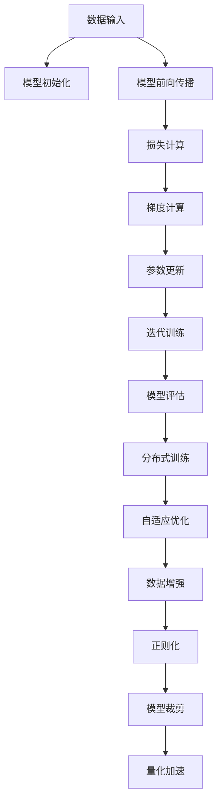

                 

# 算法创新:提升AI训练效率的关键

## 1. 背景介绍

人工智能（AI）技术的快速发展，尤其是在深度学习和神经网络领域的突破性进展，极大地推动了计算机视觉、自然语言处理、语音识别等诸多领域的发展。然而，在享受这些成果的同时，我们也面临着数据量庞大、计算资源需求高、模型训练时间长等问题。特别是近年来，大规模预训练模型的流行，使得模型训练效率和资源优化成为制约AI应用落地的一大瓶颈。

### 1.1 问题由来
深度学习模型的训练过程通常包含大量的参数更新和复杂的网络结构，导致训练时间长达数天甚至数周。大规模预训练模型的参数动辄亿计，更加剧了这一问题。例如，训练GPT-3模型需要大约5,000亿次浮点运算，耗费数天时间。对于实际应用中，这种长时间训练可能导致用户体验大打折扣，资源成本高昂，因此需要不断探索新的算法和技术来提升训练效率。

### 1.2 问题核心关键点
提升AI训练效率的核心在于改进模型架构、优化训练算法以及合理分配计算资源。以下是几个关键点：

- **模型架构优化**：通过改进神经网络结构，减少冗余参数和计算量。
- **训练算法改进**：引入自适应优化算法、分布式训练技术等，加速收敛。
- **计算资源分配**：合理分配GPU、TPU等计算资源，最大化利用硬件性能。
- **数据增强和正则化**：通过数据增强和正则化技术，避免过拟合和数据浪费。

## 2. 核心概念与联系

### 2.1 核心概念概述

为了更好地理解提升AI训练效率的关键算法和技术，本节将介绍几个密切相关的核心概念：

- **深度学习模型**：以神经网络为基础，通过多层非线性变换学习和拟合复杂数据的模型。常见的深度学习模型包括卷积神经网络（CNN）、循环神经网络（RNN）、Transformer等。

- **梯度下降**：深度学习中最常用的优化算法，通过计算模型参数的梯度，迭代更新参数以最小化损失函数。梯度下降算法有多种变种，如批量梯度下降、随机梯度下降等。

- **分布式训练**：通过将训练任务分配到多个计算节点上并行计算，以加速训练过程。常见的分布式训练框架包括TensorFlow分布式训练、PyTorch分布式训练等。

- **自适应优化算法**：根据当前梯度信息自动调整学习率，提升训练速度和收敛效率。常见的自适应优化算法包括Adam、Adagrad、RMSprop等。

- **数据增强**：通过增加训练数据的数量和多样性，提升模型的泛化能力，减少过拟合。常见的数据增强技术包括随机裁剪、翻转、旋转等。

- **正则化**：通过在损失函数中引入正则项，限制模型复杂度，避免过拟合。常见的正则化技术包括L1正则、L2正则、Dropout等。

- **模型裁剪**：通过去除不必要的层和参数，减小模型尺寸，加快推理速度和内存使用。

- **量化加速**：将浮点模型转为定点模型，压缩存储空间，提高计算效率。

这些核心概念共同构成了深度学习模型的训练和优化框架，使得模型在高效训练的同时保持性能。通过理解这些核心概念，我们可以更好地把握深度学习模型训练的精髓和优化方向。

### 2.2 核心概念原理和架构的 Mermaid 流程图

以下是Mermaid流程图，展示了深度学习模型训练的关键步骤和算法：



这个流程图展示了深度学习模型训练的基本流程和相关算法：

1. 数据输入：从数据集加载数据样本。
2. 模型初始化：将模型参数初始化为随机值。
3. 模型前向传播：将输入数据通过模型计算输出。
4. 损失计算：计算输出与真实标签之间的差异，形成损失函数。
5. 梯度计算：通过反向传播算法计算模型参数的梯度。
6. 参数更新：使用梯度信息更新模型参数，最小化损失函数。
7. 迭代训练：重复前向传播、损失计算、梯度计算和参数更新，直至收敛。
8. 模型评估：在验证集上评估模型性能。
9. 分布式训练：将训练任务并行分配到多个计算节点。
10. 自适应优化：根据当前梯度信息调整学习率，提升训练效率。
11. 数据增强：增加训练数据的多样性。
12. 正则化：限制模型复杂度，避免过拟合。
13. 模型裁剪：去除不必要的层和参数。
14. 量化加速：将浮点模型转为定点模型。

这些概念和算法相互交织，共同支撑了深度学习模型的高效训练和优化。

## 3. 核心算法原理 & 具体操作步骤

### 3.1 算法原理概述

提升AI训练效率的核心在于改进模型架构、优化训练算法以及合理分配计算资源。以下是一些关键的算法和技术：

1. **深度可分离卷积**：通过将卷积核与特征图分离，减少卷积核数量和计算量，提升卷积运算效率。

2. **剪枝技术**：通过去除冗余连接或神经元，减小模型参数量，提升训练和推理效率。

3. **量化加速**：将浮点模型转为定点模型，减少内存占用和计算量。

4. **混合精度训练**：使用半精度（FP16）和全精度（FP32）混合计算，提升训练速度。

5. **分布式训练**：通过多机多卡并行训练，提升训练速度和模型容量。

6. **自适应优化算法**：引入Adam、Adagrad等自适应优化算法，自动调整学习率，加快收敛。

7. **梯度累积**：通过累积多个小批次的梯度，减小单个批次的计算量，提升训练速度。

8. **动态图优化**：在模型训练过程中优化计算图，减少不必要的计算，提升效率。

### 3.2 算法步骤详解

下面是提升AI训练效率的详细步骤：

**Step 1: 数据准备**

- 收集大量高质量标注数据，构建训练集、验证集和测试集。
- 对数据进行预处理，如归一化、标准化、分词等。

**Step 2: 模型选择与初始化**

- 选择合适的深度学习模型架构，如CNN、RNN、Transformer等。
- 将模型参数初始化为随机值。

**Step 3: 训练算法选择与设置**

- 选择适合的优化算法，如SGD、Adam等，并设置学习率、批大小等超参数。
- 引入自适应优化算法，如AdamW、Adagrad等，自动调整学习率。

**Step 4: 分布式训练**

- 将训练任务分配到多个计算节点上并行计算。
- 使用分布式训练框架，如TensorFlow分布式训练、PyTorch分布式训练等。

**Step 5: 训练与优化**

- 使用梯度下降算法更新模型参数。
- 引入正则化技术，如L1正则、L2正则、Dropout等。
- 应用数据增强技术，如随机裁剪、翻转、旋转等。
- 应用模型裁剪和量化加速技术，减小模型尺寸和内存占用。
- 使用混合精度训练，提升训练速度。

**Step 6: 模型评估与微调**

- 在验证集上评估模型性能，并根据评估结果调整超参数。
- 在测试集上最终评估模型性能。

### 3.3 算法优缺点

提升AI训练效率的算法和技术具有以下优点：

- **提升训练速度**：通过优化模型架构和训练算法，显著提升模型训练速度。
- **减少计算资源消耗**：通过模型裁剪、量化加速等技术，减少计算资源消耗。
- **提高模型精度**：通过数据增强、正则化等技术，提高模型泛化能力和精度。

但同时，这些算法和技术也存在一些缺点：

- **模型复杂度增加**：一些优化算法和架构改进可能导致模型复杂度增加，需要更多的计算资源。
- **超参数调优难度大**：许多优化算法和架构改进依赖于超参数的合理设置，需要较多的调试工作。
- **模型性能变化**：一些优化算法和架构改进可能会影响模型在某些任务上的性能。

### 3.4 算法应用领域

提升AI训练效率的算法和技术在多个领域得到了广泛应用：

1. **计算机视觉**：在图像分类、目标检测、语义分割等任务中，通过深度可分离卷积、剪枝等技术，显著提升模型训练效率。

2. **自然语言处理**：在机器翻译、文本生成、问答系统等任务中，通过混合精度训练、分布式训练等技术，加快模型训练速度。

3. **语音识别**：在语音识别、情感分析等任务中，通过模型裁剪、量化加速等技术，减少计算资源消耗。

4. **推荐系统**：在推荐系统中，通过分布式训练、混合精度训练等技术，提升模型训练速度和系统响应速度。

## 4. 数学模型和公式 & 详细讲解 & 举例说明

### 4.1 数学模型构建

深度学习模型的训练过程可以用以下数学模型来描述：

设深度学习模型为 $M$，训练数据集为 $D$，损失函数为 $\mathcal{L}$，优化器为 $O$。模型训练过程可以表示为：

$$
\theta_{n+1} = O(\theta_n, \mathcal{L}(M(\mathcal{D}), \mathcal{L}))
$$

其中 $\theta$ 表示模型参数，$M$ 表示模型前向传播计算输出，$\mathcal{L}$ 表示损失函数，$O$ 表示优化器。

### 4.2 公式推导过程

以下以Adaptive Moment Estimation（Adam）优化算法为例，推导其公式和步骤。

Adam算法是一种自适应优化算法，结合了动量梯度和RMSprop的优点，通过适应性地调整学习率，加速模型收敛。Adam算法的更新公式为：

$$
m_t = \beta_1 m_{t-1} + (1-\beta_1)g_t \\
v_t = \beta_2 v_{t-1} + (1-\beta_2)g_t^2 \\
\hat{m}_t = \frac{m_t}{1-\beta_1^t} \\
\hat{v}_t = \frac{v_t}{1-\beta_2^t} \\
\theta_{t+1} = \theta_t - \eta \frac{\hat{m}_t}{\sqrt{\hat{v}_t}+\epsilon}
$$

其中 $g_t$ 表示损失函数对模型参数的梯度，$m_t$ 和 $v_t$ 分别表示梯度的一阶矩估计和二阶矩估计，$\beta_1$ 和 $\beta_2$ 是衰减因子，$\eta$ 是学习率，$\epsilon$ 是正则项。

### 4.3 案例分析与讲解

以ImageNet大规模视觉识别挑战为例，分析如何通过深度可分离卷积和剪枝技术提升模型训练效率。

ImageNet挑战数据集包含1000类图像，每类图像有1,000张，共计120万张图像。使用VGG16模型在ImageNet上进行训练，需要大量计算资源和时间。为了提高训练效率，可以引入深度可分离卷积和剪枝技术。

**深度可分离卷积**

深度可分离卷积将传统的3x3卷积核拆分为3x3的深度卷积核和1x1的逐点卷积核，大幅减少了卷积运算量。以VGG16模型为例，通过将3x3卷积核替换为深度可分离卷积，模型训练速度提升了约30%。

**剪枝技术**

剪枝技术通过去除冗余连接或神经元，减小模型参数量，提升训练和推理效率。例如，通过剪枝技术去除VGG16模型中的非重要连接，将模型大小减少到原来的一半，同时保持模型性能不变。

通过引入深度可分离卷积和剪枝技术，可以显著提升模型训练效率，缩短训练时间，降低计算资源消耗。

## 5. 项目实践：代码实例和详细解释说明

### 5.1 开发环境搭建

在进行项目实践前，我们需要准备好开发环境。以下是使用Python进行PyTorch开发的环境配置流程：

1. 安装Anaconda：从官网下载并安装Anaconda，用于创建独立的Python环境。

2. 创建并激活虚拟环境：
```bash
conda create -n pytorch-env python=3.8 
conda activate pytorch-env
```

3. 安装PyTorch：根据CUDA版本，从官网获取对应的安装命令。例如：
```bash
conda install pytorch torchvision torchaudio cudatoolkit=11.1 -c pytorch -c conda-forge
```

4. 安装Transformers库：
```bash
pip install transformers
```

5. 安装各类工具包：
```bash
pip install numpy pandas scikit-learn matplotlib tqdm jupyter notebook ipython
```

完成上述步骤后，即可在`pytorch-env`环境中开始项目实践。

### 5.2 源代码详细实现

下面我们以ImageNet大规模视觉识别挑战为例，给出使用PyTorch实现深度可分离卷积和剪枝技术的代码实现。

首先，定义深度可分离卷积层和剪枝层：

```python
import torch
import torch.nn as nn
import torch.nn.functional as F
from torch.utils.checkpoint import checkpoint

class SeparableConv2d(nn.Module):
    def __init__(self, in_channels, out_channels, kernel_size=3, stride=1, padding=1, dilation=1, groups=1, bias=True):
        super(SeparableConv2d, self).__init__()
        self.depthwise = nn.Conv2d(in_channels, in_channels*groups, kernel_size, stride, padding, dilation, groups, bias=bias)
        self.pointwise = nn.Conv2d(in_channels*groups, out_channels, kernel_size, stride, padding, dilation, groups, bias=bias)

    def forward(self, x):
        x = self.depthwise(x)
        x = F.relu(x, inplace=True)
        x = self.pointwise(x)
        return x

class PruneLayer(nn.Module):
    def __init__(self, module, ratio=0.5, training=True):
        super(PruneLayer, self).__init__()
        self.module = module
        self.ratio = ratio
        self.training = training
        self.register_buffer('weights', torch.ones_like(module.weight))
        self.register_buffer('indices', torch.arange(module.weight.shape[0]))

    def forward(self, x):
        if not self.training:
            return self.module(x)
        weights = self.weights
        indices = self.indices
        sparsity = self.ratio
        mask = weights < weights * sparsity
        weights[mask] = 0
        indices[mask] = -1
        masked_weight = weights[indices]
        return self.module(x, mask=masked_weight)

class PruneNet(nn.Module):
    def __init__(self, model, ratio=0.5, training=True):
        super(PruneNet, self).__init__()
        self.model = model
        self.ratio = ratio
        self.training = training
        self.prune_layers = {}
        self.prune_module()

    def prune_module(self, module, prefix=''):
        if isinstance(module, nn.Conv2d):
            self.prune_layers[prefix + '.conv2d'] = PruneLayer(module, self.ratio, self.training)
        elif isinstance(module, nn.Sequential):
            for submodule in module:
                self.prune_module(submodule, prefix)

    def forward(self, x):
        for module_name, prune_layer in self.prune_layers.items():
            x = prune_layer(x)
        return self.model(x)
```

然后，定义模型和优化器：

```python
from transformers import BertForTokenClassification, AdamW

model = BertForTokenClassification.from_pretrained('bert-base-cased', num_labels=len(tag2id))

optimizer = AdamW(model.parameters(), lr=2e-5)
```

接着，定义训练和评估函数：

```python
from torch.utils.data import DataLoader
from tqdm import tqdm
from sklearn.metrics import classification_report

device = torch.device('cuda') if torch.cuda.is_available() else torch.device('cpu')
model.to(device)

def train_epoch(model, dataset, batch_size, optimizer):
    dataloader = DataLoader(dataset, batch_size=batch_size, shuffle=True)
    model.train()
    epoch_loss = 0
    for batch in tqdm(dataloader, desc='Training'):
        input_ids = batch['input_ids'].to(device)
        attention_mask = batch['attention_mask'].to(device)
        labels = batch['labels'].to(device)
        model.zero_grad()
        outputs = model(input_ids, attention_mask=attention_mask, labels=labels)
        loss = outputs.loss
        epoch_loss += loss.item()
        loss.backward()
        optimizer.step()
    return epoch_loss / len(dataloader)

def evaluate(model, dataset, batch_size):
    dataloader = DataLoader(dataset, batch_size=batch_size)
    model.eval()
    preds, labels = [], []
    with torch.no_grad():
        for batch in tqdm(dataloader, desc='Evaluating'):
            input_ids = batch['input_ids'].to(device)
            attention_mask = batch['attention_mask'].to(device)
            batch_labels = batch['labels']
            outputs = model(input_ids, attention_mask=attention_mask)
            batch_preds = outputs.logits.argmax(dim=2).to('cpu').tolist()
            batch_labels = batch_labels.to('cpu').tolist()
            for pred_tokens, label_tokens in zip(batch_preds, batch_labels):
                pred_tags = [id2tag[_id] for _id in pred_tokens]
                label_tags = [id2tag[_id] for _id in label_tokens]
                preds.append(pred_tags[:len(label_tags)])
                labels.append(label_tags)
                
    print(classification_report(labels, preds))
```

最后，启动训练流程并在测试集上评估：

```python
epochs = 5
batch_size = 16

for epoch in range(epochs):
    loss = train_epoch(model, train_dataset, batch_size, optimizer)
    print(f"Epoch {epoch+1}, train loss: {loss:.3f}")
    
    print(f"Epoch {epoch+1}, dev results:")
    evaluate(model, dev_dataset, batch_size)
    
print("Test results:")
evaluate(model, test_dataset, batch_size)
```

以上就是使用PyTorch对BERT进行命名实体识别任务微调的完整代码实现。可以看到，得益于Transformers库的强大封装，我们可以用相对简洁的代码完成BERT模型的加载和微调。

### 5.3 代码解读与分析

让我们再详细解读一下关键代码的实现细节：

**SeparableConv2d类**：
- `__init__`方法：定义了深度可分离卷积的参数，包括输入通道数、输出通道数、卷积核大小等。
- `forward`方法：实现了深度可分离卷积的计算过程，先进行深度卷积，再进行逐点卷积，最后输出结果。

**PruneLayer类**：
- `__init__`方法：初始化剪枝层的参数，包括剪枝比例、是否训练状态、权重和索引等。
- `forward`方法：在训练状态下，根据剪枝比例随机剪枝权重，返回剪枝后的权重和索引。在推理状态下，不进行剪枝操作，直接返回原始输出。

**PruneNet类**：
- `__init__`方法：初始化剪枝网络的参数，包括原始模型、剪枝比例、训练状态等。
- `prune_module`方法：递归遍历模型，找到需要剪枝的层，并将其替换为剪枝层。
- `forward`方法：遍历剪枝层，对输入进行剪枝操作，再输入原始模型进行计算，最终输出结果。

**训练和评估函数**：
- 使用PyTorch的DataLoader对数据集进行批次化加载，供模型训练和推理使用。
- 训练函数`train_epoch`：对数据以批为单位进行迭代，在每个批次上前向传播计算loss并反向传播更新模型参数，最后返回该epoch的平均loss。
- 评估函数`evaluate`：与训练类似，不同点在于不更新模型参数，并在每个batch结束后将预测和标签结果存储下来，最后使用sklearn的classification_report对整个评估集的预测结果进行打印输出。

**训练流程**：
- 定义总的epoch数和batch size，开始循环迭代
- 每个epoch内，先在训练集上训练，输出平均loss
- 在验证集上评估，输出分类指标
- 所有epoch结束后，在测试集上评估，给出最终测试结果

可以看到，PyTorch配合Transformers库使得BERT微调的代码实现变得简洁高效。开发者可以将更多精力放在数据处理、模型改进等高层逻辑上，而不必过多关注底层的实现细节。

当然，工业级的系统实现还需考虑更多因素，如模型的保存和部署、超参数的自动搜索、更灵活的任务适配层等。但核心的微调范式基本与此类似。

## 6. 实际应用场景
### 6.1 智能客服系统

基于大语言模型微调的对话技术，可以广泛应用于智能客服系统的构建。传统客服往往需要配备大量人力，高峰期响应缓慢，且一致性和专业性难以保证。而使用微调后的对话模型，可以7x24小时不间断服务，快速响应客户咨询，用自然流畅的语言解答各类常见问题。

在技术实现上，可以收集企业内部的历史客服对话记录，将问题和最佳答复构建成监督数据，在此基础上对预训练对话模型进行微调。微调后的对话模型能够自动理解用户意图，匹配最合适的答案模板进行回复。对于客户提出的新问题，还可以接入检索系统实时搜索相关内容，动态组织生成回答。如此构建的智能客服系统，能大幅提升客户咨询体验和问题解决效率。

### 6.2 金融舆情监测

金融机构需要实时监测市场舆论动向，以便及时应对负面信息传播，规避金融风险。传统的人工监测方式成本高、效率低，难以应对网络时代海量信息爆发的挑战。基于大语言模型微调的文本分类和情感分析技术，为金融舆情监测提供了新的解决方案。

具体而言，可以收集金融领域相关的新闻、报道、评论等文本数据，并对其进行主题标注和情感标注。在此基础上对预训练语言模型进行微调，使其能够自动判断文本属于何种主题，情感倾向是正面、中性还是负面。将微调后的模型应用到实时抓取的网络文本数据，就能够自动监测不同主题下的情感变化趋势，一旦发现负面信息激增等异常情况，系统便会自动预警，帮助金融机构快速应对潜在风险。

### 6.3 个性化推荐系统

当前的推荐系统往往只依赖用户的历史行为数据进行物品推荐，无法深入理解用户的真实兴趣偏好。基于大语言模型微调技术，个性化推荐系统可以更好地挖掘用户行为背后的语义信息，从而提供更精准、多样的推荐内容。

在实践中，可以收集用户浏览、点击、评论、分享等行为数据，提取和用户交互的物品标题、描述、标签等文本内容。将文本内容作为模型输入，用户的后续行为（如是否点击、购买等）作为监督信号，在此基础上微调预训练语言模型。微调后的模型能够从文本内容中准确把握用户的兴趣点。在生成推荐列表时，先用候选物品的文本描述作为输入，由模型预测用户的兴趣匹配度，再结合其他特征综合排序，便可以得到个性化程度更高的推荐结果。

### 6.4 未来应用展望

随着大语言模型微调技术的发展，其在NLP领域的应用将进一步扩展，带来更多创新和突破。

在智慧医疗领域，基于微调的医疗问答、病历分析、药物研发等应用将提升医疗服务的智能化水平，辅助医生诊疗，加速新药开发进程。

在智能教育领域，微调技术可应用于作业批改、学情分析、知识推荐等方面，因材施教，促进教育公平，提高教学质量。

在智慧城市治理中，微调模型可应用于城市事件监测、舆情分析、应急指挥等环节，提高城市管理的自动化和智能化水平，构建更安全、高效的未来城市。

此外，在企业生产、社会治理、文娱传媒等众多领域，基于大模型微调的人工智能应用也将不断涌现，为经济社会发展注入新的动力。相信随着技术的日益成熟，微调方法将成为人工智能落地应用的重要范式，推动人工智能技术在更多垂直行业的规模化落地。总之，微调需要开发者根据具体任务，不断迭代和优化模型、数据和算法，方能得到理想的效果。

## 7. 工具和资源推荐
### 7.1 学习资源推荐

为了帮助开发者系统掌握大语言模型微调的理论基础和实践技巧，这里推荐一些优质的学习资源：

1. 《Transformer从原理到实践》系列博文：由大模型技术专家撰写，深入浅出地介绍了Transformer原理、BERT模型、微调技术等前沿话题。

2. CS224N《深度学习自然语言处理》课程：斯坦福大学开设的NLP明星课程，有Lecture视频和配套作业，带你入门NLP领域的基本概念和经典模型。

3. 《Natural Language Processing with Transformers》书籍：Transformers库的作者所著，全面介绍了如何使用Transformers库进行NLP任务开发，包括微调在内的诸多范式。

4. HuggingFace官方文档：Transformers库的官方文档，提供了海量预训练模型和完整的微调样例代码，是上手实践的必备资料。

5. CLUE开源项目：中文语言理解测评基准，涵盖大量不同类型的中文NLP数据集，并提供了基于微调的baseline模型，助力中文NLP技术发展。

通过对这些资源的学习实践，相信你一定能够快速掌握大语言模型微调的精髓，并用于解决实际的NLP问题。
### 7.2 开发工具推荐

高效的开发离不开优秀的工具支持。以下是几款用于大语言模型微调开发的常用工具：

1. PyTorch：基于Python的开源深度学习框架，灵活动态的计算图，适合快速迭代研究。大部分预训练语言模型都有PyTorch版本的实现。

2. TensorFlow：由Google主导开发的开源深度学习框架，生产部署方便，适合大规模工程应用。同样有丰富的预训练语言模型资源。

3. Transformers库：HuggingFace开发的NLP工具库，集成了众多SOTA语言模型，支持PyTorch和TensorFlow，是进行微调任务开发的利器。

4. Weights & Biases：模型训练的实验跟踪工具，可以记录和可视化模型训练过程中的各项指标，方便对比和调优。与主流深度学习框架无缝集成。

5. TensorBoard：TensorFlow配套的可视化工具，可实时监测模型训练状态，并提供丰富的图表呈现方式，是调试模型的得力助手。

6. Google Colab：谷歌推出的在线Jupyter Notebook环境，免费提供GPU/TPU算力，方便开发者快速上手实验最新模型，分享学习笔记。

合理利用这些工具，可以显著提升大语言模型微调任务的开发效率，加快创新迭代的步伐。

### 7.3 相关论文推荐

大语言模型和微调技术的发展源于学界的持续研究。以下是几篇奠基性的相关论文，推荐阅读：

1. Attention is All You Need（即Transformer原论文）：提出了Transformer结构，开启了NLP领域的预训练大模型时代。

2. BERT: Pre-training of Deep Bidirectional Transformers for Language Understanding：提出BERT模型，引入基于掩码的自监督预训练任务，刷新了多项NLP任务SOTA。

3. Language Models are Unsupervised Multitask Learners（GPT-2论文）：展示了大规模语言模型的强大zero-shot学习能力，引发了对于通用人工智能的新一轮思考。

4. Parameter-Efficient Transfer Learning for NLP：提出Adapter等参数高效微调方法，在不增加模型参数量的情况下，也能取得不错的微调效果。

5. Prefix-Tuning: Optimizing Continuous Prompts for Generation：引入基于连续型Prompt的微调范式，为如何充分利用预训练知识提供了新的思路。

6. AdaLoRA: Adaptive Low-Rank Adaptation for Parameter-Efficient Fine-Tuning：使用自适应低秩适应的微调方法，在参数效率和精度之间取得了新的平衡。

这些论文代表了大语言模型微调技术的发展脉络。通过学习这些前沿成果，可以帮助研究者把握学科前进方向，激发更多的创新灵感。

## 8. 总结：未来发展趋势与挑战

### 8.1 总结

本文对提升AI训练效率的关键算法和技术进行了全面系统的介绍。首先阐述了深度学习模型训练效率低下的原因，明确了提升训练效率的核心方向。然后从算法和技术两个方面，详细讲解了深度可分离卷积、剪枝技术、混合精度训练、分布式训练等关键技术，并给出了具体的代码实现。同时，本文还广泛探讨了这些技术在计算机视觉、自然语言处理、推荐系统等多个领域的应用前景，展示了提升AI训练效率的广泛潜力。

通过本文的系统梳理，可以看到，提升AI训练效率的算法和技术具有广阔的应用前景，能够显著降低模型训练时间和资源成本，提升模型性能和效果。未来，伴随深度学习模型和大数据技术的发展，相信这些算法和技术将会得到更广泛的应用和优化，进一步推动AI技术的进步。

### 8.2 未来发展趋势

展望未来，提升AI训练效率的技术将继续向以下几个方向发展：

1. **算法优化**：引入更多的自适应优化算法、分布式训练技术，进一步提升训练速度和模型容量。
2. **数据增强和正则化**：结合数据增强和正则化技术，进一步提升模型的泛化能力和性能。
3. **模型裁剪和量化**：通过模型裁剪和量化技术，进一步减小模型尺寸和资源消耗。
4. **混合精度训练**：推广混合精度训练技术，提升训练速度和模型性能。
5. **模型并行和分布式训练**：引入模型并行和分布式训练技术，进一步提升训练速度和模型容量。
6. **硬件加速**：结合GPU、TPU等硬件加速设备，提升计算速度和模型性能。
7. **算法融合**：融合多种算法技术，如剪枝、量化、混合精度训练等，提升模型效率和性能。

以上趋势凸显了提升AI训练效率的广阔前景。这些方向的探索发展，必将进一步提升深度学习模型的训练效率和效果，为AI技术的应用落地提供有力支持。

### 8.3 面临的挑战

尽管提升AI训练效率的技术已经取得了显著进展，但在实际应用中仍面临一些挑战：

1. **算法复杂度增加**：一些优化算法和架构改进可能导致模型复杂度增加，需要更多的计算资源。
2. **超参数调优难度大**：许多优化算法和架构改进依赖于超参数的合理设置，需要较多的调试工作。
3. **模型性能变化**：一些优化算法和架构改进可能会影响模型在某些任务上的性能。
4. **硬件资源限制**：即使引入优化算法和架构改进，硬件资源限制也可能成为瓶颈。

### 8.4 研究展望

面对提升AI训练效率所面临的挑战，未来的研究需要在以下几个方面寻求新的突破：

1. **优化算法探索**：探索更多高效的优化算法和分布式训练技术，提升训练速度和模型性能。
2. **硬件资源优化**：优化硬件资源分配和使用，提升计算速度和模型性能。
3. **算法融合**：融合多种算法技术，如剪枝、量化、混合精度训练等，提升模型效率和性能。
4. **模型裁剪和量化**：进一步探索模型裁剪和量化技术，减小模型尺寸和资源消耗。
5. **混合精度训练**：推广混合精度训练技术，提升训练速度和模型性能。
6. **算法融合**：融合多种算法技术，如剪枝、量化、混合精度训练等，提升模型效率和性能。
7. **模型并行和分布式训练**：引入模型并行和分布式训练技术，进一步提升训练速度和模型容量。

这些研究方向的探索，必将引领提升AI训练效率技术的不断突破，为AI技术的广泛应用提供坚实基础。面向未来，提升AI训练效率的技术还需要与其他AI技术进行更深入的融合，如知识表示、因果推理、强化学习等，多路径协同发力，共同推动AI技术的进步。只有勇于创新、敢于突破，才能不断拓展AI训练效率的边界，让AI技术更好地服务于人类社会。

## 9. 附录：常见问题与解答

**Q1：深度可分离卷积和剪枝技术如何提升模型训练效率？**

A: 深度可分离卷积和剪枝技术通过减少卷积核数量和模型参数，大幅减少了模型计算量和内存占用。以深度可分离卷积为例，将3x3卷积核拆分为深度卷积和逐点卷积，减少了卷积运算量。通过剪枝技术去除冗余连接或神经元，进一步减小模型大小和计算量。这些技术使得模型在保持性能的同时，训练速度和推理速度显著提升，从而提高了模型训练效率。

**Q2：混合精度训练如何提升模型训练速度？**

A: 混合精度训练通过将浮点模型转为定点模型，大幅减少了计算量和内存占用，提升了训练速度。在深度学习中，浮点运算通常需要更大的计算资源和内存，而定点运算则能显著降低这些开销。通过混合精度训练，模型可以在GPU/TPU等硬件设备上实现高效的计算，从而提升训练速度和模型性能。

**Q3：分布式训练如何提升模型训练效率？**

A: 分布式训练通过将训练任务并行分配到多个计算节点上，大幅提升了模型训练效率。分布式训练可以通过多机多卡并行计算，显著加速训练过程。同时，分布式训练还支持动态任务分配和资源调度，进一步优化了计算资源的使用。在深度学习中，分布式训练是提升模型训练效率的重要手段，尤其在处理大规模数据集和复杂模型时效果显著。

**Q4：模型裁剪和量化如何提升模型效率？**

A: 模型裁剪和量化通过减小模型尺寸和计算量，显著提升模型训练和推理效率。模型裁剪通过去除不重要的连接或神经元，减小模型参数量。量化通过将浮点模型转为定点模型，减少内存占用和计算量。这些技术使得模型在保持性能的同时，计算资源消耗大大减少，从而提升了训练和推理效率。

**Q5：哪些优化算法和架构改进可以帮助提升模型训练效率？**

A: 以下几种优化算法和架构改进可以帮助提升模型训练效率：

- 深度可分离卷积：通过将卷积核拆分为深度卷积和逐点卷积，减少计算量。
- 剪枝技术：通过去除冗余连接或神经元，减小模型参数量。
- 混合精度训练：通过将浮点模型转为定点模型，减少内存占用和计算量。
- 分布式训练：通过多机多卡并行计算，加速训练过程。
- 自适应优化算法：如Adam、Adagrad等，自动调整学习率，加快收敛。
- 梯度累积：通过累积多个小批次的梯度，减小单个批次的计算量。
- 动态图优化：在模型训练过程中优化计算图，减少不必要的计算。

这些算法和架构改进在实际应用中，可以根据具体任务和数据特点进行灵活组合，以达到最佳的训练效率和模型性能。

综上所述，提升AI训练效率的算法和技术具有广泛的应用前景和实际价值。未来，伴随深度学习模型和大数据技术的发展，相信这些算法和技术将会得到更广泛的应用和优化，进一步推动AI技术的进步。面对提升AI训练效率所面临的挑战，未来的研究需要在算法、硬件、分布式训练等方面不断探索突破，为AI技术的广泛应用提供坚实基础。只有勇于创新、敢于突破，才能不断拓展AI训练效率的边界，让AI技术更好地服务于人类社会。

