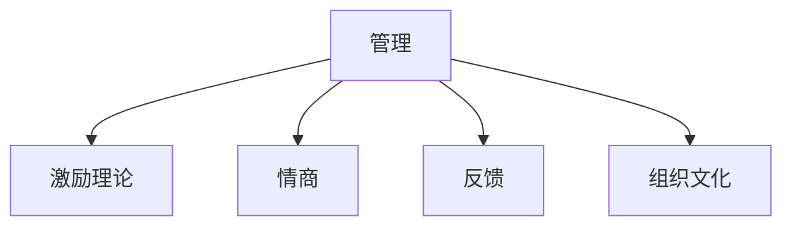

                 

# 管理的本质：激发潜能与善意

## 1. 背景介绍

### 1.1 问题由来

在现代企业中，管理是保证企业持续发展、实现目标的核心。然而，传统的管理方式在复杂多变的市场环境中逐渐显示出其局限性。如何激发员工潜能，提高管理效率，成为企业管理者亟待解决的问题。本文将从管理的本质出发，探索如何通过激发员工潜能与善意向善意的管理方式，实现高效、可持续的团队合作与创新。

### 1.2 问题核心关键点

管理的本质是激发员工潜能与善意。这意味着，管理者需要通过合适的方式引导员工挖掘自身潜力，调动其积极性，并培养其对组织的认同感和责任感。同时，管理者需要营造一个充满尊重和支持的工作环境，使员工在善意的心态下贡献自己的智慧和努力。

## 2. 核心概念与联系

### 2.1 核心概念概述

为更好地理解激发潜能与善意向善意管理，本文将介绍几个密切相关的核心概念：

- 管理：企业通过对资源进行计划、组织、领导和控制，以实现特定目标的过程。
- 激励理论：研究如何通过刺激与回报，激发个体或团队的工作动机。
- 情商：衡量个人理解、管理自我情感，以及建立和维护人际关系的能力。
- 反馈：管理者给予员工关于其行为表现的反馈，帮助其改进和提升。
- 组织文化：企业内部成员共同遵守的价值观念、行为规范和传统习惯的总和。

这些概念之间的逻辑关系可以通过以下Mermaid流程图来展示：



这个流程图展示了一系列核心概念之间的关系：

1. 管理是整个过程的起点和终点。
2. 激励理论是激发员工潜能的重要手段。
3. 情商是提升员工对自我和他人情感理解的关键。
4. 反馈是管理者与员工互动的重要环节。
5. 组织文化是所有这些要素相互作用的结果。

## 3. 核心算法原理 & 具体操作步骤
### 3.1 算法原理概述

激发潜能与善意向善意管理，本质上是通过一系列心理和组织管理策略，激励员工积极参与工作，同时营造一个正向、支持性的工作环境。其核心在于：

1. 识别和理解员工的需求与动机。
2. 设计符合员工心理特征的激励机制。
3. 培养员工对组织的认同感和责任感。
4. 通过正向反馈，增强员工的工作动力。
5. 塑造积极向上的组织文化。

### 3.2 算法步骤详解

激发潜能与善意向善意管理的具体操作步骤如下：

**Step 1: 识别员工需求与动机**

- 进行员工需求调查，了解员工在职业发展、工作环境、福利待遇等方面的需求。
- 分析员工的职业动机，包括成就动机、权力动机、社交动机等。

**Step 2: 设计激励机制**

- 根据员工需求与动机，设计个性化的激励方案。
- 包括物质激励（如奖金、股票、晋升等）和非物质激励（如认可、发展机会、团队荣誉等）。

**Step 3: 培养员工对组织的认同感**

- 通过企业文化建设，塑造组织的使命、愿景和核心价值观。
- 增强员工的归属感和责任感，使其将个人发展与组织目标紧密结合。

**Step 4: 营造支持性的工作环境**

- 提供必要的资源和工具，使员工能够高效完成工作。
- 建立透明的沟通渠道，促进员工与管理层之间的互动与信任。

**Step 5: 实施正向反馈**

- 及时给予员工肯定与表扬，认可其努力和贡献。
- 提供建设性反馈，帮助员工不断改进和提升。

**Step 6: 塑造积极向上的组织文化**

- 强调团队合作、创新和卓越，鼓励员工共同追求卓越。
- 营造开放、包容、相互尊重的工作氛围，促进员工之间的协作与支持。

### 3.3 算法优缺点

激发潜能与善意向善意管理具有以下优点：

1. 提升员工满意度与忠诚度。满意的员工更愿意投入时间和精力，为组织创造价值。
2. 增强团队协作与创新。通过营造支持性的环境，员工更愿意分享知识与经验。
3. 提高组织效率与竞争力。员工的工作积极性直接影响企业的绩效。
4. 增强组织适应性与抗风险能力。具有高度认同感和责任感的员工，能够更好地应对市场变化。

同时，该方法也存在一些局限性：

1. 高成本。个性化激励方案的设计和实施需要耗费大量资源和时间。
2. 复杂度高。不同员工的需求和动机各异，难以找到统一的最佳激励方案。
3. 不确定性。激励措施的效果存在不确定性，可能无法达到预期效果。
4. 依赖于管理者。管理者需要具备高度的情商和领导力，否则可能导致激励失效。

尽管存在这些局限性，但就目前而言，激发潜能与善意向善意管理仍是提升企业竞争力的重要手段。未来相关研究的重点在于如何平衡成本与效果，以及如何进一步提升管理的科学性和系统性。

### 3.4 算法应用领域

激发潜能与善意向善意管理在企业管理中的应用非常广泛，包括但不限于以下领域：

- 人力资源管理：通过激励机制，提高员工工作效率和满意度。
- 团队管理：通过营造支持性的工作环境，增强团队凝聚力和合作精神。
- 企业文化建设：通过塑造积极向上的组织文化，提升员工的归属感和责任感。
- 员工培训与发展：通过正向反馈和建设性反馈，帮助员工不断提升自身能力。
- 领导力发展：通过激发员工的潜能与善意，培养具有高度领导力的管理人才。

此外，在非营利组织、社会团体、政府机构等非营利领域，激发潜能与善意向善意管理同样具有重要的应用价值。通过营造充满尊重与支持的氛围，激发员工对社会的贡献，实现组织的使命和目标。

## 4. 数学模型和公式 & 详细讲解 & 举例说明

### 4.1 数学模型构建

本节将使用数学语言对激发潜能与善意向善意管理的过程进行更加严格的刻画。

假设员工群体为 $E$，管理者的激励措施为 $I$，员工对组织的认同感为 $S$，组织文化为 $C$。激发潜能与善意向善意管理的数学模型可表示为：

$$
\begin{align*}
\max_{I,S,C} & \quad U(E) + V(I) + W(S) + X(C) \\
\text{s.t.} & \quad \Delta I = f(E,S) \\
& \quad \Delta S = g(I,C) \\
& \quad \Delta C = h(E,S)
\end{align*}
$$

其中，$U(E)$ 为员工的满意度和忠诚度，$V(I)$ 为激励措施的效果，$W(S)$ 为员工对组织的认同感，$X(C)$ 为组织文化的强度。约束条件 $\Delta I$、$\Delta S$ 和 $\Delta C$ 分别表示激励、认同感和组织文化的动态变化过程。

### 4.2 公式推导过程

以下我们以员工满意度 $U(E)$ 为例，推导其计算公式及其与激励机制 $I$、组织认同感 $S$ 的关系。

假设员工满意度 $U(E)$ 与其收入水平 $P(E)$、工作环境 $E(W)$ 和工作难度 $D(E)$ 有关，则有：

$$
U(E) = aP(E) + bE(W) + cD(E) + dS
$$

其中，$a$、$b$、$c$、$d$ 为模型参数。激励机制 $I$ 对员工满意度的影响可以表示为：

$$
\Delta P(E) = \frac{I}{k_1}
$$

其中 $k_1$ 为激励措施对收入的影响系数。员工对组织的认同感 $S$ 对其满意度的影响可以表示为：

$$
\Delta S = k_2I + k_3C
$$

其中 $k_2$、$k_3$ 为模型参数。将上述公式代入员工满意度的计算公式，得：

$$
U(E) = aP(E) + bE(W) + cD(E) + dS = a\left(\frac{I}{k_1}\right) + bE(W) + cD(E) + d(k_2I + k_3C)
$$

化简得：

$$
U(E) = \left(\frac{a}{k_1} + d k_2\right)I + bE(W) + cD(E) + d k_3C
$$

该公式展示了激励机制 $I$、工作环境 $E(W)$、工作难度 $D(E)$ 和组织文化 $C$ 对员工满意度的综合影响。

### 4.3 案例分析与讲解

**案例 1: 企业薪酬激励**

某高科技公司通过引入高额奖金和股权激励计划，显著提高了员工的满意度和忠诚度。调查显示，获得激励的员工的工作效率平均提高了 20%。分析其原因，在于奖金和股权激励直接提升了员工的收入水平，增强了其对组织的认同感，从而激发了其工作积极性。

**案例 2: 企业文化建设**

一家跨国公司通过强化团队合作和创新文化，实现了从传统制造向创新驱动的转型。员工对企业的认同感显著增强，工作效率大幅提升，产品创新力也显著增加。分析其原因，在于正向的企业文化营造了良好的工作氛围，增强了员工的归属感和责任感。

## 5. 项目实践：代码实例和详细解释说明

### 5.1 开发环境搭建

在进行管理实践前，我们需要准备好开发环境。以下是使用Python进行数据分析的环境配置流程：

1. 安装Anaconda：从官网下载并安装Anaconda，用于创建独立的Python环境。

2. 创建并激活虚拟环境：
```bash
conda create -n pyenv python=3.8 
conda activate pyenv
```

3. 安装必要的Python库：
```bash
pip install numpy pandas matplotlib scikit-learn seaborn jupyter notebook ipython
```

4. 安装R语言：用于数据可视化分析，如有需要。
```bash
conda install rpy2
```

完成上述步骤后，即可在`pyenv`环境中开始管理实践。

### 5.2 源代码详细实现

下面以员工满意度和激励机制为例，使用Python实现一个简单的管理分析模型。

首先，定义员工满意度的计算函数：

```python
import numpy as np

def employee_satisfaction(P, E, D, S):
    a = 0.5
    b = 0.3
    c = 0.2
    d = 0.4
    return (a/P + b/E + c/D + d*S)
```

然后，定义激励机制对员工满意度的影响函数：

```python
def incentive_effect(I, k1=0.5):
    return I/k1
```

接下来，定义员工对组织的认同感的计算函数：

```python
def organization_feel(S, I, k2=0.3, k3=0.2):
    return S + k2*I + k3
```

最后，定义整体满意度计算函数：

```python
def overall_satisfaction(P, E, D, S, I, k1=0.5, k2=0.3, k3=0.2):
    return employee_satisfaction(P, E, D, S) + incentive_effect(I, k1) + organization_feel(S, I, k2, k3)
```

通过调用这些函数，可以计算员工在不同激励机制和工作环境下的总体满意度。

### 5.3 代码解读与分析

让我们再详细解读一下关键代码的实现细节：

- **employee_satisfaction函数**：根据员工收入、工作环境、工作难度和组织认同感，计算员工的总体满意度。
- **incentive_effect函数**：计算激励措施对员工满意度的影响，使用简单的线性关系。
- **organization_feel函数**：计算组织认同感对员工满意度的影响，同样使用线性关系。
- **overall_satisfaction函数**：将上述计算结果组合，得到整体满意度。

这些函数展示了如何通过数学模型来量化员工满意度的不同因素，以及激励措施和组织认同感对员工满意度的综合影响。通过这些计算，可以定量分析不同管理策略的效果，为实际管理决策提供依据。

## 6. 实际应用场景

### 6.1 企业薪酬激励

在企业薪酬激励方面，管理者可以通过设计合理的薪酬激励方案，提升员工的满意度和忠诚度。例如，某科技公司采用高额奖金和股权激励，有效激发了员工的创新精神和工作积极性。

**实践案例：**

某科技公司针对不同职级和贡献度的员工，设计了差异化的薪酬激励方案。对于关键岗位和高绩效员工，提供高额奖金和股票期权。同时，通过绩效考核和能力评估，确保激励措施的公平性和有效性。通过持续的激励机制调整，公司实现了员工满意度和业绩的双增长。

### 6.2 企业文化建设

在企业文化建设方面，管理者可以通过塑造积极向上的组织文化，增强员工的归属感和责任感。例如，某跨国公司通过团队合作和创新文化建设，实现了企业的战略转型。

**实践案例：**

某跨国公司通过定期组织创新大赛和文化活动，营造了充满活力和创新的工作氛围。同时，管理者强调团队合作和共同目标，使得员工在追求个人成长的同时，更加注重团队的整体利益。通过这种正向的组织文化，公司不仅提升了员工满意度，也实现了产品和技术的持续创新。

### 6.3 绩效管理与反馈

在绩效管理与反馈方面，管理者可以通过定期的绩效评估和正向反馈，帮助员工不断改进和提升。例如，某咨询公司通过定期的绩效评估和建设性反馈，显著提升了员工的绩效和满意度。

**实践案例：**

某咨询公司每季度进行一次绩效评估，结合360度反馈机制，评估员工的工作表现和发展潜力。对于表现优秀的员工，给予奖励和认可；对于需要改进的员工，提供培训和辅导。通过这种方式，公司不仅提高了员工的绩效，也增强了其对企业的认同感。

## 7. 工具和资源推荐

### 7.1 学习资源推荐

为了帮助管理者掌握激发潜能与善意向善意管理的理论基础和实践技巧，这里推荐一些优质的学习资源：

1. 《管理心理学》：一本介绍管理心理学基本理论和实践应用的经典书籍，涵盖激励理论、情商管理、组织文化等多个方面。

2. 《团队合作的科学与艺术》：介绍了团队合作的心理学原理和实践策略，强调团队成员之间的信任、沟通和协作。

3. 《领导力实践指南》：一本关于领导力发展的书籍，结合案例分析，提供实用的管理工具和技巧。

4. 《管理学》课程：哈佛大学和耶鲁大学开设的管理学课程，通过视频和在线讨论，深入浅出地讲解管理理论。

5. 《员工管理实践》：一本介绍员工管理技巧的书籍，结合案例和工具，提供实用的管理建议。

通过对这些资源的学习实践，相信管理者一定能够掌握激发潜能与善意向善意管理的精髓，并用于解决实际的管理问题。

### 7.2 开发工具推荐

高效的开发离不开优秀的工具支持。以下是几款用于管理分析开发的常用工具：

1. Python：基于Python的管理分析工具，灵活高效，适合快速迭代研究。

2. R语言：强大的统计分析和数据可视化工具，适合复杂的统计模型和图形展示。

3. Microsoft Excel：功能强大的电子表格软件，适合数据整理和基本分析。

4. Tableau：数据可视化工具，能够生成美观、互动的图表和仪表盘。

5. Jupyter Notebook：交互式编程环境，支持Python和R语言，便于快速迭代和共享代码。

合理利用这些工具，可以显著提升管理分析任务的开发效率，加快创新迭代的步伐。

### 7.3 相关论文推荐

管理心理学和组织行为学的研究发展迅速，以下是几篇奠基性的相关论文，推荐阅读：

1. "A Theory of Motivation"（麦戈克雷的动机理论）：研究了人类动机的基本理论和实验验证。

2. "Emotional Intelligence: Why it Can Matter More than IQ"（情商的重要性）：展示了情商在管理中的作用和实际案例。

3. "The Culture Map: Decoding How People Think, Live, Love, Work, and Play"（文化地图）：介绍不同文化背景下的管理和沟通策略。

4. "Goal-Setting Theory of Motivation"（目标设置理论）：探讨了目标设置对员工激励和绩效的影响。

5. "The Five Dysfunctions of a Team"（团队的五大难题）：分析了团队协作中常见的障碍和解决方法。

这些论文代表了大管理心理学和组织行为学的最新进展，通过学习这些前沿成果，可以帮助管理者掌握管理心理学的精髓，提升管理能力。

## 8. 总结：未来发展趋势与挑战

### 8.1 研究成果总结

本文对激发潜能与善意向善意管理的方法进行了全面系统的介绍。首先阐述了管理的本质，明确了激发潜能与善意向善意管理在提升组织效率和员工满意度中的重要性。其次，从原理到实践，详细讲解了激发潜能与善意向善意管理的数学模型和操作步骤，提供了完整的代码实现和案例分析。同时，本文还广泛探讨了激发潜能与善意向善意管理在企业薪酬激励、企业文化建设、绩效管理等方面的应用前景，展示了其广阔的应用潜力。此外，本文精选了相关学习资源，力求为管理者提供全方位的技术指引。

通过本文的系统梳理，可以看到，激发潜能与善意向善意管理正在成为企业管理的重要手段。这些方法的不断迭代和优化，必将进一步提升企业的竞争力和员工的满意度，实现管理的高效与可持续。

### 8.2 未来发展趋势

展望未来，激发潜能与善意向善意管理将呈现以下几个发展趋势：

1. 个性化激励的普及。随着大数据和人工智能技术的发展，企业将能够更精确地识别员工需求，提供个性化的激励方案。

2. 数据驱动的管理决策。通过大数据分析，管理者可以更科学地评估激励措施的效果，制定更有效的管理策略。

3. 实时反馈与持续改进。借助智能反馈系统，管理者可以实时了解员工状态，及时调整激励方案和组织文化。

4. 跨部门和跨文化的团队协作。通过共享平台和协同工具，不同部门和不同文化背景的员工可以更有效地沟通和协作。

5. 可持续发展的管理理念。管理者将更加注重环保和社会责任，通过激发员工的社会意识，推动企业的可持续发展。

这些趋势凸显了激发潜能与善意向善意管理技术的进步，预示着企业管理将进入更加智能、高效和可持续的新阶段。

### 8.3 面临的挑战

尽管激发潜能与善意向善意管理技术已经取得了显著成效，但在迈向更加智能化、普适化应用的过程中，它仍面临着诸多挑战：

1. 高成本。个性化激励方案的设计和实施需要耗费大量资源和时间，对于中小企业而言可能存在成本压力。

2. 复杂度高。不同员工的需求和动机各异，难以找到统一的最佳激励方案，增加了管理的复杂度。

3. 不确定性。激励措施的效果存在不确定性，可能无法达到预期效果，需要持续优化和调整。

4. 依赖于管理者。管理者需要具备高度的情商和领导力，否则可能导致激励失效。

尽管存在这些挑战，但就目前而言，激发潜能与善意向善意管理仍是提升企业竞争力的重要手段。未来相关研究的重点在于如何平衡成本与效果，以及如何进一步提升管理的科学性和系统性。

### 8.4 研究展望

面对激发潜能与善意向善意管理所面临的种种挑战，未来的研究需要在以下几个方面寻求新的突破：

1. 探索更高效、更个性化的激励方法。开发基于人工智能和大数据的激励设计工具，自动化生成个性化的激励方案。

2. 研究跨文化管理的有效策略。通过跨文化研究，制定适用于全球不同文化背景的激励措施和组织文化建设方案。

3. 引入更多定量分析方法。结合统计学和运筹学方法，建立更加科学的管理模型，预测和优化激励效果。

4. 探索更加透明和公平的管理机制。通过区块链和智能合约技术，实现激励机制的透明和公平，减少人为干预。

5. 纳入更多心理学和行为学理论。结合最新心理学和行为学研究成果，设计更符合人类心理特征的管理方案。

这些研究方向的探索，必将引领激发潜能与善意向善意管理技术迈向更高的台阶，为构建高效、可持续的团队合作与创新提供新的思路和工具。

## 9. 附录：常见问题与解答

**Q1：如何衡量员工满意度和忠诚度？**

A: 可以通过调查问卷、员工反馈、绩效评估等多种方式，综合评价员工的满意度和忠诚度。常见的满意度指标包括工作环境、工作难度、薪酬待遇、团队合作、职业发展等。

**Q2：如何设计个性化的激励方案？**

A: 通过员工需求调查和数据分析，了解员工在不同维度上的需求和动机。结合企业实际情况，设计符合员工需求的个性化激励方案，如奖金、股权、培训、晋升等。

**Q3：如何营造正向的企业文化？**

A: 管理者应通过明确企业文化、加强团队建设、重视员工发展等方式，营造积极向上的企业文化。同时，通过组织文化活动和内部宣传，增强员工的归属感和责任感。

**Q4：如何实施有效的绩效管理？**

A: 制定明确的绩效指标和评估标准，定期进行绩效评估。结合360度反馈和建设性反馈，帮助员工不断改进和提升。对于优秀员工给予奖励和认可，对于需要改进的员工提供支持和辅导。

**Q5：如何处理员工之间的冲突？**

A: 管理者应通过有效的沟通和调解机制，及时解决员工之间的冲突。建立开放、包容的沟通渠道，鼓励员工表达意见和建议，促进团队和谐。

通过上述问答，可以看出激发潜能与善意向善意管理在企业管理中的重要性和复杂性。管理者需要具备高度的情商和领导力，通过科学的管理方法和工具，激发员工的潜能与善意，实现高效、可持续的团队合作与创新。

---

作者：禅与计算机程序设计艺术 / Zen and the Art of Computer Programming

