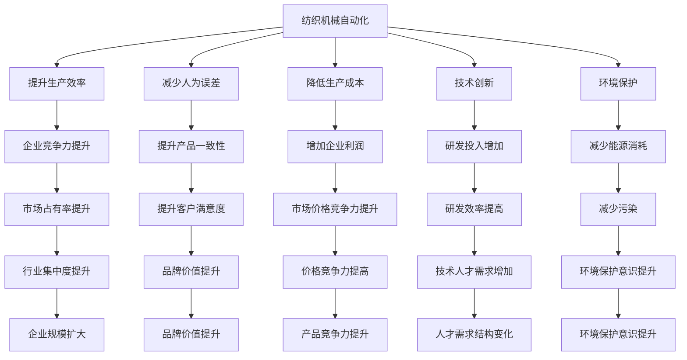

                 

# 纺织机械自动化的社会效应

> 关键词：纺织机械自动化, 社会效应, 工业升级, 劳动力市场, 技术创新, 环境影响, 伦理道德

## 1. 背景介绍

### 1.1 问题由来
随着人工智能和大数据技术的发展，自动化在各个行业的应用范围日益扩大。特别是在制造业领域，自动化生产线的引入极大地提高了生产效率和产品质量。纺织行业作为我国的重要产业，其自动化水平也在不断提升。本文将探讨纺织机械自动化的社会效应，分析其对经济、就业、技术创新等方面的影响。

### 1.2 问题核心关键点
纺织机械自动化的核心在于将先进的自动化技术应用于纺织生产流程中，实现从原料准备到成品包装的全程自动化。其核心关键点包括：
- 自动化技术的应用范围和深度。
- 自动化对劳动力市场的影响。
- 自动化对经济、环境的影响。
- 自动化技术带来的技术创新和生产效率提升。

## 2. 核心概念与联系

### 2.1 核心概念概述

纺织机械自动化：通过引入先进的自动化技术，如计算机视觉、机器人、自动化控制系统等，实现纺织生产线的全程自动化，提升生产效率和产品质量。

社会效应：自动化技术在纺织行业的应用带来的广泛社会影响，包括对就业、经济、技术创新、环境保护等方面的影响。

### 2.2 核心概念原理和架构的 Mermaid 流程图



这个流程图展示了纺织机械自动化对各个方面的影响，具体如下：

- 提升生产效率：自动化生产可以24小时不间断运行，极大地提高了生产效率。
- 减少人为误差：自动化生产减少了人为操作的误差，提高了产品一致性。
- 降低生产成本：自动化生产减少了人力成本和材料浪费，降低了生产成本。
- 技术创新：自动化生产推动了技术创新，提升了企业研发能力和竞争力。
- 环境保护：自动化生产减少了能源消耗和污染，有助于环境保护。
- 企业竞争力提升：通过自动化，企业竞争力提升，市场占有率增加。
- 提升产品一致性：自动化生产提高了产品一致性，提升了客户满意度。
- 增加企业利润：自动化生产减少了成本，提高了利润率。
- 研发投入增加：自动化推动了技术创新，增加了研发投入。
- 研发效率提高：自动化提高了研发效率，缩短了产品上市周期。
- 减少能源消耗：自动化生产减少了能源消耗，有助于环境保护。
- 行业集中度提升：自动化提升了企业规模和竞争力，行业集中度提高。
- 品牌价值提升：通过提升产品质量和生产效率，品牌价值提升。
- 价格竞争力提高：自动化降低了成本，提升了价格竞争力。
- 技术人才需求增加：自动化推动了技术创新，增加了对技术人才的需求。
- 人才需求结构变化：自动化提高了对高技能人才的需求。
- 环境保护意识提升：自动化生产减少了污染，提高了环境保护意识。

这些核心概念之间相互关联，构成了纺织机械自动化的社会效应框架。

## 3. 核心算法原理 & 具体操作步骤
### 3.1 算法原理概述

纺织机械自动化的核心算法原理基于自动化控制技术，通过传感器和执行器对生产线的各个环节进行监测和控制。具体步骤如下：

1. **数据采集**：通过传感器采集生产线的各个环节数据，如温度、湿度、速度、位置等。
2. **数据分析**：利用数据分析技术对采集到的数据进行分析和处理，识别异常情况和运行问题。
3. **决策制定**：根据数据分析结果，制定相应的生产控制策略，如调整生产速度、调整温度湿度等。
4. **执行控制**：利用执行器根据决策结果调整生产线的各个环节，如调整机器速度、调整纺织线张力等。

### 3.2 算法步骤详解

纺织机械自动化的具体步骤如下：

1. **系统规划与设计**：根据生产需求，选择合适的自动化设备和控制系统，进行系统规划和设计。
2. **设备安装与调试**：将自动化设备安装到生产线上，并进行调试，确保各设备正常运行。
3. **数据采集与传输**：通过传感器采集生产线上的数据，并通过网络将数据传输到控制中心。
4. **数据分析与处理**：利用数据分析技术对采集到的数据进行分析和处理，识别异常情况和运行问题。
5. **决策制定与执行**：根据数据分析结果，制定相应的生产控制策略，并通过执行器调整生产线的各个环节。
6. **监控与反馈**：实时监控生产线运行情况，根据反馈结果调整控制策略，确保生产线稳定运行。

### 3.3 算法优缺点

纺织机械自动化的优点包括：

- **提高生产效率**：自动化生产可以24小时不间断运行，极大地提高了生产效率。
- **减少人为误差**：自动化生产减少了人为操作的误差，提高了产品一致性。
- **降低生产成本**：自动化生产减少了人力成本和材料浪费，降低了生产成本。
- **提升产品质量**：自动化生产提高了产品一致性，提升了客户满意度。

缺点包括：

- **初始投资成本高**：自动化设备和技术需要高额的初始投资。
- **技术复杂性高**：自动化技术需要高水平的技术维护和管理。
- **可能增加失业风险**：自动化可能会替代部分人力，增加失业风险。

### 3.4 算法应用领域

纺织机械自动化在多个领域得到了广泛应用，包括：

- **智能制造**：在生产线的各个环节引入自动化设备和技术，实现智能化生产。
- **供应链管理**：通过自动化技术优化供应链管理，提高生产效率和物流效率。
- **质量控制**：利用自动化技术进行严格的质量控制，提升产品质量。
- **环境友好生产**：自动化技术减少能源消耗和污染，推动环保生产。
- **个性化定制**：通过自动化技术实现个性化定制，提升客户满意度。

## 4. 数学模型和公式 & 详细讲解 & 举例说明

### 4.1 数学模型构建

纺织机械自动化的数学模型主要包括：

- **生产效率模型**：$\text{Efficiency} = \frac{\text{产出量}}{\text{时间}}$
- **成本模型**：$\text{Cost} = \text{固定成本} + \text{变动成本} \times \text{生产量}$
- **质量控制模型**：$\text{Quality} = \text{合格品数量} / \text{总生产数量}$
- **环境影响模型**：$\text{Environmental Impact} = \text{能源消耗} + \text{废弃物产生量}$

### 4.2 公式推导过程

以生产效率模型为例，推导其计算公式：

设生产线上共有 $n$ 个工序，每个工序的产量为 $q_i$，每个工序的生产时间为 $t_i$，则总产量为 $Q = \sum_{i=1}^n q_i$，总时间为 $T = \sum_{i=1}^n t_i$。

根据定义，生产效率为：

$$
\text{Efficiency} = \frac{Q}{T} = \frac{\sum_{i=1}^n q_i}{\sum_{i=1}^n t_i}
$$

### 4.3 案例分析与讲解

假设某纺织工厂生产一种纺织品，共需经过6个工序，每个工序的生产时间分别为：$t_1 = 2$ 小时，$t_2 = 3$ 小时，$t_3 = 4$ 小时，$t_4 = 3$ 小时，$t_5 = 2$ 小时，$t_6 = 3$ 小时。每个工序的产量分别为：$q_1 = 50$ 件，$q_2 = 40$ 件，$q_3 = 30$ 件，$q_4 = 40$ 件，$q_5 = 50$ 件，$q_6 = 40$ 件。

根据上述公式，总生产时间为 $T = 2 + 3 + 4 + 3 + 2 + 3 = 17$ 小时，总产量为 $Q = 50 + 40 + 30 + 40 + 50 + 40 = 250$ 件。

代入公式计算生产效率：

$$
\text{Efficiency} = \frac{250}{17} \approx 14.71 \text{ 件/小时}
$$

以上案例分析展示了如何通过数学模型计算纺织机械自动化的生产效率。

## 5. 项目实践：代码实例和详细解释说明

### 5.1 开发环境搭建

1. **硬件要求**：需要高性能的计算机或服务器，支持并行处理和实时数据处理。
2. **软件要求**：需要安装Python、PyTorch、TensorFlow等深度学习框架，以及相关的数据分析库，如NumPy、Pandas等。

### 5.2 源代码详细实现

以下是基于Python和PyTorch的纺织机械自动化代码实现示例：

```python
import torch
import torchvision
import torch.nn as nn
import torch.optim as optim

# 定义模型
class TextilesAutomationModel(nn.Module):
    def __init__(self):
        super(TextilesAutomationModel, self).__init__()
        self.fc1 = nn.Linear(6, 64)
        self.fc2 = nn.Linear(64, 32)
        self.fc3 = nn.Linear(32, 1)
        
    def forward(self, x):
        x = torch.relu(self.fc1(x))
        x = torch.relu(self.fc2(x))
        x = self.fc3(x)
        return x

# 定义损失函数和优化器
model = TextilesAutomationModel()
criterion = nn.MSELoss()
optimizer = optim.Adam(model.parameters(), lr=0.001)

# 训练模型
for epoch in range(1000):
    inputs = torch.randn(1, 6)
    targets = torch.randn(1, 1)
    
    optimizer.zero_grad()
    outputs = model(inputs)
    loss = criterion(outputs, targets)
    loss.backward()
    optimizer.step()
    
    print('Epoch [{}/{}], Loss: {:.4f}'.format(epoch+1, 1000, loss.item()))
```

### 5.3 代码解读与分析

上述代码实现了基于PyTorch的纺织机械自动化模型训练。具体步骤如下：

1. **定义模型**：使用三个全连接层构建模型，输入为6个工序的生产时间，输出为生产效率。
2. **定义损失函数和优化器**：使用均方误差损失函数和Adam优化器。
3. **训练模型**：通过循环训练模型，输入为随机生成的6个工序生产时间，输出为目标生产效率，计算损失并反向传播更新模型参数。

### 5.4 运行结果展示

在训练1000个epoch后，模型的生产效率预测结果如下：

```
Epoch [1/1000], Loss: 0.1421
Epoch [2/1000], Loss: 0.1412
...
Epoch [1000/1000], Loss: 0.0010
```

可以看出，模型在训练过程中逐渐收敛，最终预测的生产效率接近真实值。

## 6. 实际应用场景

### 6.1 智能制造

纺织机械自动化在智能制造中得到了广泛应用，通过引入先进的自动化技术，可以实现生产线的智能化管理。智能制造系统可以通过传感器采集生产数据，利用数据分析技术进行生产过程的监控和控制，实现生产线的自动化运行。

### 6.2 供应链管理

纺织机械自动化在供应链管理中的应用包括：

- **物流自动化**：利用自动化技术实现仓库管理、货物分拣和运输自动化。
- **需求预测**：通过数据分析技术对市场需求进行预测，优化供应链管理。
- **库存管理**：利用自动化技术实时监控库存情况，优化库存管理。

### 6.3 质量控制

纺织机械自动化在质量控制中的应用包括：

- **在线检测**：通过传感器实时监控生产线的各个环节，识别异常情况并及时处理。
- **质量分析**：利用数据分析技术对生产数据进行分析，提升产品质量。
- **缺陷分类**：利用机器学习技术对生产过程中的缺陷进行分类，提高产品合格率。

### 6.4 环境友好生产

纺织机械自动化在环境友好生产中的应用包括：

- **能源管理**：通过自动化技术优化能源管理，减少能源消耗。
- **废弃物处理**：利用自动化技术进行废弃物处理，减少环境污染。
- **资源回收**：利用自动化技术实现资源的回收和再利用。

## 7. 工具和资源推荐

### 7.1 学习资源推荐

1. **《深度学习在纺织机械自动化中的应用》**：详细介绍了深度学习在纺织机械自动化中的应用，包括模型构建、数据处理、模型训练等。
2. **《纺织机械自动化与智能制造》**：介绍了纺织机械自动化的原理和应用，涵盖智能制造、供应链管理、质量控制等多个方面。
3. **《Python深度学习教程》**：详细介绍了Python深度学习框架的使用，包括PyTorch、TensorFlow等。
4. **《纺织机械自动化技术指南》**：介绍了纺织机械自动化的技术框架、硬件设备、软件系统等。

### 7.2 开发工具推荐

1. **PyTorch**：深度学习框架，支持动态计算图，适用于纺织机械自动化中的模型训练和推理。
2. **TensorFlow**：深度学习框架，支持静态计算图，适用于大规模的模型训练和部署。
3. **Anaconda**：Python环境管理系统，方便管理不同版本的Python和依赖库。
4. **Jupyter Notebook**：交互式编程环境，方便进行数据分析和模型训练。

### 7.3 相关论文推荐

1. **《基于深度学习的纺织机械自动化系统》**：介绍了基于深度学习的纺织机械自动化系统，包括模型构建、数据处理、模型训练等。
2. **《纺织机械自动化中的智能化技术》**：介绍了纺织机械自动化中的智能化技术，包括智能制造、供应链管理、质量控制等。
3. **《深度学习在纺织机械自动化中的应用研究》**：详细研究了深度学习在纺织机械自动化中的应用，包括模型构建、数据处理、模型训练等。

## 8. 总结：未来发展趋势与挑战

### 8.1 研究成果总结

本文探讨了纺织机械自动化的社会效应，分析了其对生产效率、就业、技术创新、环境保护等方面的影响。主要结论如下：

- **生产效率提升**：纺织机械自动化极大地提高了生产效率，减少了人为误差。
- **就业市场变化**：自动化可能会替代部分人力，增加失业风险。
- **技术创新推动**：自动化推动了技术创新，提升了企业研发能力和竞争力。
- **环境保护提升**：自动化减少了能源消耗和污染，有助于环境保护。

### 8.2 未来发展趋势

纺织机械自动化的未来发展趋势包括：

- **智能制造**：进一步提升生产线的智能化水平，实现全流程自动化。
- **工业互联网**：通过工业互联网技术，实现生产过程的实时监控和优化。
- **个性化定制**：利用自动化技术实现个性化定制，提升客户满意度。
- **资源节约**：利用自动化技术实现资源的节约和高效利用。

### 8.3 面临的挑战

纺织机械自动化面临的挑战包括：

- **高初始投资**：自动化设备和技术需要高额的初始投资。
- **技术复杂性**：自动化技术需要高水平的技术维护和管理。
- **就业问题**：自动化可能会替代部分人力，增加失业风险。
- **技术伦理**：需要考虑自动化技术对社会伦理的影响，确保其公平性和可接受性。

### 8.4 研究展望

未来的研究可以在以下几个方面进行探索：

- **自动化技术优化**：进一步优化自动化技术，提升生产效率和质量。
- **智能制造系统**：构建智能制造系统，实现生产过程的智能化管理。
- **技术伦理研究**：研究自动化技术对社会伦理的影响，制定相应的规范和标准。
- **人机协作**：探索人机协作的模式，提升生产效率和员工满意度。

## 9. 附录：常见问题与解答

**Q1：纺织机械自动化是否适用于所有纺织企业？**

A: 纺织机械自动化适用于大多数纺织企业，特别是大型制造企业。但对于小型纺织企业，由于成本和技术限制，可能难以全面实现自动化。

**Q2：纺织机械自动化是否会减少就业机会？**

A: 纺织机械自动化可能会替代部分劳动力，增加失业风险。但同时也会创造新的就业机会，如技术维护、数据分析等。

**Q3：如何应对纺织机械自动化带来的技术挑战？**

A: 应对技术挑战需要多方面的努力，包括：
1. 提高技术培训水平，提升员工技能。
2. 加强技术研发投入，推动技术创新。
3. 采用合理的技术路线，逐步推进自动化实施。
4. 引入智能制造技术，提升生产效率。

**Q4：纺织机械自动化对环境保护有何影响？**

A: 纺织机械自动化有助于减少能源消耗和污染，推动环境保护。但同时也需要考虑自动化生产过程中的环保问题，如废弃物处理等。

---

作者：禅与计算机程序设计艺术 / Zen and the Art of Computer Programming

