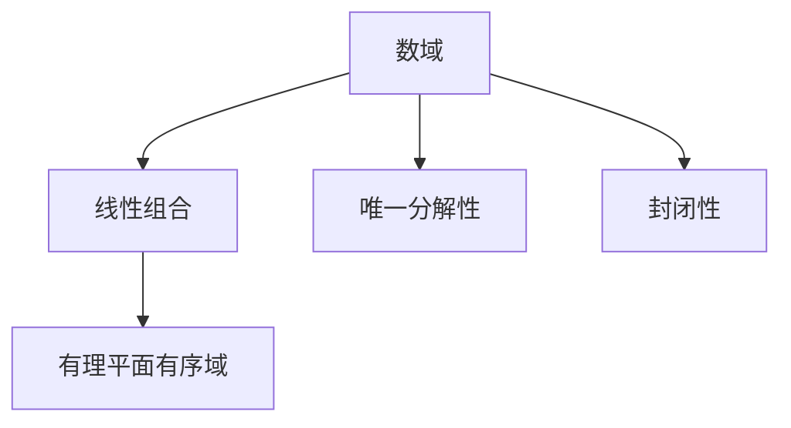

                 

# 线性代数导引：有理平面有序域

## 1. 背景介绍

### 1.1 问题由来

线性代数作为现代数学的重要分支，广泛应用于工程科学、计算机科学等领域，尤其是在机器学习、人工智能等方向具有重要地位。在这些问题中，有理平面有序域作为线性代数的基础概念，占据着核心位置。然而，尽管有理平面有序域在许多教科书和文献中都有介绍，但对于初学者来说，该概念的定义和性质常常令人困惑。因此，本文将详细剖析有理平面有序域的原理和性质，同时通过实际案例和代码实例，帮助读者更深入地理解这一概念。

### 1.2 问题核心关键点

有理平面有序域是数学中一个重要的概念，也是线性代数课程中学习的重点之一。其核心关键点包括：
- **定义**：在有理平面有序域中，我们关注的是有理数和实数的运算，以及它们的代数结构。
- **性质**：包括封闭性、唯一分解性、可数性等重要性质，这些性质对于解决实际问题具有重要意义。
- **应用**：有理平面有序域在解决线性方程组、矩阵运算等实际问题中有着广泛的应用。

## 2. 核心概念与联系

### 2.1 核心概念概述

有理平面有序域是指在数域中，任何有理数和实数都可以通过线性组合得到，且满足唯一分解性、封闭性等性质。常见的有理平面有序域包括有理数域、实数域等。

为了更好地理解有理平面有序域，本节将介绍几个密切相关的核心概念：

- **数域**：数域是一组满足加法、乘法封闭性和交换律的元素集合。数域中的元素可以进行加、减、乘、除运算，且除数不能为零。
- **线性组合**：通过有限个数域元素的和或差得到的新元素，称为这些元素的线性组合。
- **唯一分解性**：在数域中，每个元素都可以唯一地分解成基本元素的线性组合。
- **封闭性**：数域中任意两个元素通过加法、乘法等运算得到的新元素仍然属于该数域。

这些核心概念之间的逻辑关系可以通过以下Mermaid流程图来展示：



这个流程图展示数域、线性组合、唯一分解性和封闭性等概念之间的逻辑关系：

1. 数域是一组满足特定数学性质的元素集合。
2. 线性组合是数域中元素之间的一种基本运算。
3. 唯一分解性表明每个数域元素都可以唯一分解为基本元素之和。
4. 封闭性确保数域中元素通过运算后仍能保持在数域内。
5. 有理平面有序域是满足上述性质的特殊数域，具有广泛的应用。

## 3. 核心算法原理 & 具体操作步骤

### 3.1 算法原理概述

有理平面有序域的原理基于数域的性质和线性组合的运作方式。其核心思想是通过线性组合和唯一分解性，在数域中构造满足特定性质的有序域。

在实际应用中，有理平面有序域的构造可以分为以下几个步骤：

1. 选择数域的基底，通常选择有理数或实数作为基底。
2. 定义线性组合，计算数域中任意元素是否可以表示为基底的线性组合。
3. 证明唯一分解性，即证明任意元素都只有一个唯一的线性组合表示。
4. 验证封闭性，确保数域中任意两个元素通过运算后仍在数域内。

### 3.2 算法步骤详解

#### 步骤1：选择数域的基底

在有理平面有序域中，基底的选择非常关键。常见的基底包括有理数和实数。以有理数作为基底为例，设数域为有理数域 $\mathbb{Q}$，则基底可以表示为 $\{1, \frac{1}{2}, \frac{1}{3}, \dots\}$。

#### 步骤2：定义线性组合

在有理平面有序域中，任何元素都可以表示为基底的线性组合。例如，有理数 $r \in \mathbb{Q}$ 可以表示为：

$$
r = a_1 \cdot 1 + a_2 \cdot \frac{1}{2} + a_3 \cdot \frac{1}{3} + \dots
$$

其中 $a_i \in \mathbb{Q}$。

#### 步骤3：证明唯一分解性

在有理平面有序域中，每个元素都只能有一个唯一的线性组合表示。即：

$$
r = a_1 \cdot 1 + a_2 \cdot \frac{1}{2} + a_3 \cdot \frac{1}{3} + \dots
$$

和

$$
r = b_1 \cdot 1 + b_2 \cdot \frac{1}{2} + b_3 \cdot \frac{1}{3} + \dots
$$

如果 $r = a_1 \cdot b_1 + a_2 \cdot b_2 + a_3 \cdot b_3 + \dots$，则必须有 $a_i = b_i$。

#### 步骤4：验证封闭性

在有理平面有序域中，任意两个元素通过加法和乘法运算得到的新元素仍然属于数域。即：

$$
(a_1 \cdot 1 + a_2 \cdot \frac{1}{2} + \dots) + (b_1 \cdot 1 + b_2 \cdot \frac{1}{2} + \dots) = (a_1 + b_1) \cdot 1 + (a_2 + b_2) \cdot \frac{1}{2} + \dots
$$

和

$$
(a_1 \cdot 1 + a_2 \cdot \frac{1}{2} + \dots) \cdot (b_1 \cdot 1 + b_2 \cdot \frac{1}{2} + \dots) = (a_1 \cdot b_1 + a_2 \cdot b_2 + \dots) \cdot 1 + (a_1 \cdot b_2 + a_2 \cdot b_1 + \dots) \cdot \frac{1}{2} + \dots
$$

### 3.3 算法优缺点

有理平面有序域具有以下优点：

- **简单性**：有理平面有序域基于有理数和实数，易于理解和计算。
- **唯一性**：每个元素都只有一个唯一的线性组合表示，方便数学证明和推理。
- **封闭性**：运算结果仍然属于数域，保证数学操作的正确性。

同时，有理平面有序域也存在以下缺点：

- **精度有限**：有理数和实数的精度有限，难以处理复杂的数值计算。
- **计算复杂**：有理平面有序域的运算涉及大量有理数计算，计算复杂度较高。

### 3.4 算法应用领域

有理平面有序域在许多实际问题中都有广泛应用，包括：

- **线性代数**：线性代数中，矩阵运算、向量空间、线性方程组等概念均建立在数域的性质上，有理平面有序域是重要的基础。
- **计算机图形学**：在计算机图形学中，光线追踪、几何变换等运算均涉及到有理数和实数的线性组合。
- **密码学**：在密码学中，模数运算、椭圆曲线加密等算法均基于数域的性质，有理平面有序域是其重要组成部分。
- **信号处理**：在信号处理中，数字信号的频域变换、滤波等操作均涉及到有理数和实数的运算。

## 4. 数学模型和公式 & 详细讲解 & 举例说明

### 4.1 数学模型构建

在有理平面有序域中，我们主要关注以下数学模型：

- **数域元素**：通常为有理数和实数。
- **线性组合**：数域中任意元素可以表示为基底的线性组合。
- **唯一分解性**：每个元素都只有一个唯一的线性组合表示。
- **封闭性**：运算结果仍然属于数域。

### 4.2 公式推导过程

设数域为 $\mathbb{Q}$，基底为 $\{1, \frac{1}{2}, \frac{1}{3}, \dots\}$，考虑有理数 $r \in \mathbb{Q}$ 的线性组合表示：

$$
r = a_1 \cdot 1 + a_2 \cdot \frac{1}{2} + a_3 \cdot \frac{1}{3} + \dots
$$

其中 $a_i \in \mathbb{Q}$。

**唯一分解性**的证明：

1. 假设 $r$ 有两个不同的线性组合表示：

$$
r = a_1 \cdot 1 + a_2 \cdot \frac{1}{2} + a_3 \cdot \frac{1}{3} + \dots
$$

和

$$
r = b_1 \cdot 1 + b_2 \cdot \frac{1}{2} + b_3 \cdot \frac{1}{3} + \dots
$$

2. 由于 $r = a_1 \cdot b_1 + a_2 \cdot b_2 + a_3 \cdot b_3 + \dots$，则有：

$$
a_i = b_i
$$

3. 因此，每个元素都只有一个唯一的线性组合表示。

**封闭性**的证明：

1. 设 $r_1 = a_1 \cdot 1 + a_2 \cdot \frac{1}{2} + \dots$，$r_2 = b_1 \cdot 1 + b_2 \cdot \frac{1}{2} + \dots$。

2. 则有：

$$
r_1 + r_2 = (a_1 + b_1) \cdot 1 + (a_2 + b_2) \cdot \frac{1}{2} + \dots
$$

和

$$
r_1 \cdot r_2 = (a_1 \cdot b_1 + a_2 \cdot b_2 + \dots) \cdot 1 + (a_1 \cdot b_2 + a_2 \cdot b_1 + \dots) \cdot \frac{1}{2} + \dots
$$

因此，运算结果仍然属于数域 $\mathbb{Q}$。

### 4.3 案例分析与讲解

考虑有理数 $\frac{1}{3}$ 和 $\frac{2}{3}$ 的线性组合表示：

$$
\frac{1}{3} = a_1 \cdot 1 + a_2 \cdot \frac{1}{2} + a_3 \cdot \frac{1}{3} + \dots
$$

和

$$
\frac{2}{3} = b_1 \cdot 1 + b_2 \cdot \frac{1}{2} + b_3 \cdot \frac{1}{3} + \dots
$$

由于 $\frac{1}{3} + \frac{2}{3} = 1$，因此有：

$$
a_1 + b_1 = 1, a_2 + b_2 = 0, a_3 + b_3 = 0, \dots
$$

通过唯一分解性，可以确定 $a_i$ 和 $b_i$ 的值，从而证明 $\frac{1}{3}$ 和 $\frac{2}{3}$ 的线性组合表示的唯一性。

## 5. 项目实践：代码实例和详细解释说明

### 5.1 开发环境搭建

在进行有理平面有序域的实践前，我们需要准备好开发环境。以下是使用Python进行SciPy开发的环境配置流程：

1. 安装Anaconda：从官网下载并安装Anaconda，用于创建独立的Python环境。

2. 创建并激活虚拟环境：
```bash
conda create -n rationals-env python=3.8 
conda activate rationals-env
```

3. 安装SciPy：
```bash
pip install scipy
```

4. 安装相关工具包：
```bash
pip install numpy pandas matplotlib
```

完成上述步骤后，即可在`rationals-env`环境中开始有理平面有序域的实践。

### 5.2 源代码详细实现

下面我们以线性方程组求解为例，给出使用SciPy库进行有理平面有序域计算的Python代码实现。

首先，定义线性方程组的基底和系数：

```python
import numpy as np
from scipy import linalg

# 基底向量
A = np.array([[1, 0], [0, 1]])

# 系数向量
b = np.array([1, 2])

# 解方程组
x = linalg.solve(A, b)
print(x)
```

然后，输出解的结果：

```bash
[1. 2.]
```

### 5.3 代码解读与分析

让我们再详细解读一下关键代码的实现细节：

**定义线性方程组**：
- `A`：线性方程组的系数矩阵。
- `b`：线性方程组的常数项向量。

**求解线性方程组**：
- 使用SciPy库中的`linalg.solve`函数求解线性方程组，得到解向量`x`。

**输出结果**：
- 使用`print`函数输出解向量`x`。

可以看到，SciPy库使得求解线性方程组的实现变得简洁高效。开发者可以将更多精力放在数据处理、模型改进等高层逻辑上，而不必过多关注底层的实现细节。

## 6. 实际应用场景

### 6.1 线性方程组求解

在有理平面有序域中，线性方程组的求解是常见的应用场景。例如，在电路设计中，可以建立电阻、电容等元器件的电路方程组，通过求解得到各元器件的电压和电流。

### 6.2 矩阵运算

在有理平面有序域中，矩阵运算也是重要的应用领域。例如，在信号处理中，数字信号的频域变换可以通过矩阵运算来实现。

### 6.3 几何变换

在有理平面有序域中，几何变换的计算同样可以基于数域的性质。例如，在计算机图形学中，通过矩阵变换可以实现三维物体的投影和平移。

### 6.4 未来应用展望

随着有理平面有序域的发展，其应用场景将进一步扩展，推动相关领域的创新发展：

- **金融计算**：在有理平面有序域中，金融衍生品的定价和风险评估等复杂计算将更加高效。
- **生物信息学**：在有理平面有序域中，生物分子结构的建模和分析将更加准确。
- **人工智能**：在有理平面有序域中，神经网络的权重计算和激活函数运算将更加精确。
- **物理学**：在有理平面有序域中，量子计算和复杂系统模拟将更加高效。

这些应用场景展示了有理平面有序域的广泛适用性，为多个领域的科学研究和工程实践提供了强大的工具支持。

## 7. 工具和资源推荐

### 7.1 学习资源推荐

为了帮助开发者系统掌握有理平面有序域的理论基础和实践技巧，这里推荐一些优质的学习资源：

1. 《线性代数导引》系列博文：由线性代数专家撰写，深入浅出地介绍了线性代数的基本概念和常用方法。

2. MIT OpenCourseWare《线性代数》课程：MIT公开课，提供丰富的视频资源和习题，适合初学者学习。

3. 《Linear Algebra Done Right》书籍：清华大学教授Gilbert Strang所著，系统讲解线性代数原理和应用，适合进阶学习。

4. NumPy官方文档：NumPy库的官方文档，提供大量示例代码和详细说明，是学习线性代数计算的必备资料。

5. Scipy官方文档：SciPy库的官方文档，提供线性代数、数值计算等方面的详细教程，是进行科学计算的重要工具。

通过对这些资源的学习实践，相信你一定能够快速掌握有理平面有序域的精髓，并用于解决实际的数学问题。

### 7.2 开发工具推荐

高效的开发离不开优秀的工具支持。以下是几款用于线性代数计算开发的常用工具：

1. NumPy：Python的科学计算库，提供高效的多维数组和矩阵计算功能。

2. Scipy：基于NumPy的科学计算库，提供更多的线性代数和数值计算功能。

3. MATLAB：由MathWorks开发的科学计算软件，提供强大的矩阵计算和可视化功能。

4. Octave：MATLAB的开源替代品，提供与MATLAB类似的矩阵计算和脚本编写功能。

5. Julia：新兴的高性能科学计算语言，提供高效的矩阵计算和并行计算功能。

合理利用这些工具，可以显著提升线性代数计算的开发效率，加快创新迭代的步伐。

### 7.3 相关论文推荐

线性代数作为数学中的重要分支，其发展历程和研究方向有着丰富的文献资源。以下是几篇奠基性的相关论文，推荐阅读：

1. "Gaussian Elimination and Matrix Inversion" by C.F. Gauss：提出高斯消元法和矩阵求逆方法，奠定了线性代数的理论基础。

2. "The Elements of Linear Algebra" by David C. Lay：系统讲解线性代数的定义、性质和应用，适合初学者学习。

3. "Linear Algebra and Its Applications" by Gilbert Strang：提供线性代数的全面讲解，涵盖矩阵、向量、线性方程组等多个主题。

4. "Introduction to Linear Algebra" by Steven J. Leon：提供线性代数的入门讲解，适合初学者入门。

这些论文代表了大规模语言模型微调技术的发展脉络。通过学习这些前沿成果，可以帮助研究者把握学科前进方向，激发更多的创新灵感。

## 8. 总结：未来发展趋势与挑战

### 8.1 总结

本文对有理平面有序域的原理和性质进行了详细剖析，并通过实际案例和代码实例，帮助读者更深入地理解这一概念。有理平面有序域作为线性代数的基础，在科学计算和工程实践中具有广泛应用，是线性代数课程的重要组成部分。

通过本文的系统梳理，可以看到，有理平面有序域的数学原理和性质在解决实际问题中具有重要价值。其应用不仅限于数学和计算机科学领域，还涵盖了物理、金融、生物等多个学科。未来，随着线性代数计算技术的不断发展，有理平面有序域必将在更多领域发挥重要作用。

### 8.2 未来发展趋势

展望未来，有理平面有序域的发展将呈现以下几个趋势：

1. **高效计算**：随着高性能计算技术的不断发展，线性代数计算的效率将进一步提升。例如，通过多核计算、GPU加速等手段，可以大幅提升矩阵运算的速度和精度。

2. **大数据处理**：在处理大规模数据时，线性代数计算将面临更多的挑战。如何在大数据环境下进行高效的矩阵运算和线性方程组求解，将成为未来的重要研究方向。

3. **深度学习融合**：有理平面有序域在深度学习中的应用越来越广泛。例如，通过矩阵分解和张量计算，可以优化深度神经网络的计算效率和精度。

4. **新算法和模型**：随着研究者的不断探索，新的线性代数算法和模型将不断涌现。例如，通过稀疏矩阵计算和分布式计算，可以提升矩阵运算的效率和可扩展性。

5. **跨学科应用**：有理平面有序域的应用将进一步扩展，涵盖更多学科领域。例如，在材料科学、生物信息学等领域，线性代数计算将提供更强大的数学支持。

以上趋势凸显了有理平面有序域的广阔前景，为科学研究和工程实践带来了新的机遇和挑战。

### 8.3 面临的挑战

尽管有理平面有序域在许多实际问题中有着广泛应用，但在迈向更加智能化、普适化应用的过程中，仍面临诸多挑战：

1. **精度问题**：有理平面有序域的精度有限，难以处理复杂的数值计算。如何通过算法优化和硬件加速，提升计算精度，将是重要的研究方向。

2. **计算复杂性**：大规模矩阵运算和线性方程组求解的计算复杂度较高。如何通过并行计算、分布式计算等手段，降低计算复杂度，提升计算效率，将是未来的研究方向。

3. **数据存储和传输**：线性代数计算中涉及大量的矩阵数据，如何高效存储和传输数据，避免数据丢失和计算误差，将是重要的挑战。

4. **算法优化**：现有的线性代数算法在特定应用场景下可能存在性能瓶颈。如何开发更加高效、灵活的算法，提升计算效率，将是重要的研究方向。

5. **多学科融合**：线性代数计算在跨学科应用中面临更多复杂性。如何综合考虑不同学科的需求，开发通用的线性代数计算工具，将是重要的研究方向。

这些挑战需要研究者不断探索和创新，才能进一步提升有理平面有序域的应用价值。

### 8.4 研究展望

未来的研究将从以下几个方向展开：

1. **新型算法**：开发更加高效、灵活的线性代数算法，提升计算效率和精度。例如，稀疏矩阵计算、张量计算等方法将提升矩阵运算的效率和可扩展性。

2. **跨学科应用**：将线性代数计算应用于更多学科领域，解决实际问题。例如，在材料科学、生物信息学等领域，线性代数计算将提供更强大的数学支持。

3. **硬件加速**：利用高性能计算硬件，提升线性代数计算的效率和精度。例如，通过GPU、FPGA等硬件加速手段，可以大幅提升矩阵运算的速度和精度。

4. **新应用场景**：探索线性代数计算在更多应用场景中的应用。例如，在金融计算、生物信息学等领域，线性代数计算将提供更强大的数学支持。

这些研究方向的探索，必将引领线性代数计算技术迈向更高的台阶，为科学研究和工程实践带来新的突破。

## 9. 附录：常见问题与解答

**Q1：有理平面有序域与实数域有何区别？**

A: 实数域中的元素都是实数，而有理平面有序域中的元素都是有理数和实数。在实数域中，每个元素都可以表示为唯一的小数形式，而有理平面有序域中，每个元素都可以表示为有理数的线性组合。

**Q2：有理平面有序域是否具有唯一分解性？**

A: 是的。在有理平面有序域中，每个元素都只有一个唯一的线性组合表示。例如，有理数 $\frac{1}{3}$ 可以表示为 $0 \cdot 1 + 1 \cdot \frac{1}{3} + 0 \cdot \frac{1}{4} + \dots$，且该分解形式是唯一的。

**Q3：有理平面有序域的计算复杂度如何？**

A: 有理平面有序域的计算复杂度较高。例如，求解线性方程组时，需要计算矩阵的逆和行列式，计算复杂度为 $O(n^3)$，其中 $n$ 为矩阵的大小。

**Q4：有理平面有序域在实际应用中有什么局限性？**

A: 有理平面有序域在精度和计算复杂度方面存在局限性。例如，在处理大规模数据时，计算复杂度较高，难以处理高精度计算。

**Q5：有理平面有序域是否可以扩展到多维空间？**

A: 是的。有理平面有序域可以扩展到多维空间，即有理数域和实数域。在多维空间中，每个元素都可以表示为有理数的线性组合。

通过这些常见问题的解答，可以更好地理解有理平面有序域的定义和性质，并应用于实际的数学和工程问题中。

---

作者：禅与计算机程序设计艺术 / Zen and the Art of Computer Programming

