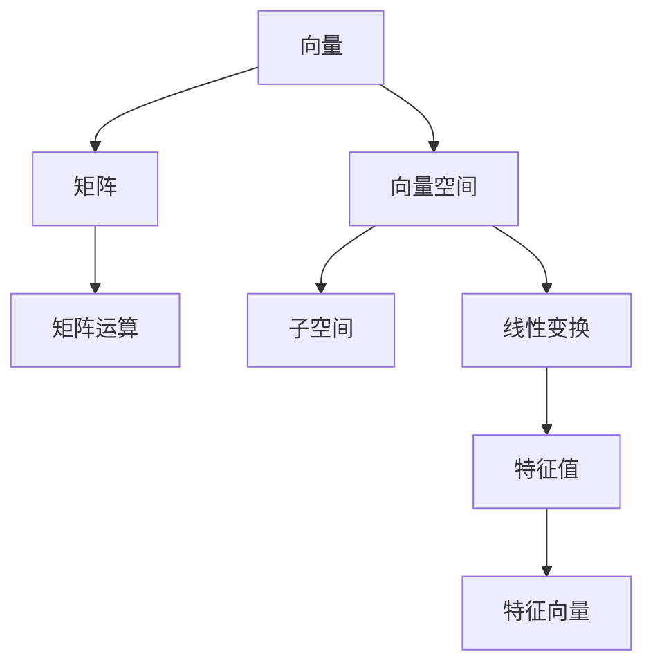

                 

# 线性代数导引：预备知识

线性代数是计算机科学、工程学、物理学等领域的基础数学工具，对理解和解决许多实际问题至关重要。本博文旨在为读者提供线性代数的预备知识，帮助理解更高级的线性代数概念，包括矩阵、向量空间、线性变换、特征值分解等。

## 1. 背景介绍

### 1.1 线性代数的地位与作用

线性代数在现代科学和技术中占据核心地位，广泛应用于机器学习、数据分析、信号处理、计算机图形学、优化问题等多个领域。其核心思想是用几何语言来描述和处理线性问题，包括线性方程组求解、线性空间与子空间、矩阵运算、向量空间等。线性代数不仅提供了处理数据和模型的工具，更是理解和研究更高级数学理论（如泛函分析、偏微分方程等）的基础。

### 1.2 线性代数的起源

线性代数的起源可以追溯到古希腊时期，当时的学者们研究过直线和角的关系。而现代线性代数的发展，则与19世纪末的德国数学家柯西和法国数学家拉普拉斯的工作密不可分。随着时间的推移，线性代数逐渐形成了系统的理论体系，并在20世纪随着计算机科学和电子工程的发展而不断演变。

## 2. 核心概念与联系

### 2.1 核心概念概述

线性代数主要包括以下几个核心概念：

- **向量与矩阵**：向量是具有线性结构的一维数组，矩阵是由向量组成的二维数组。它们是线性代数研究的基本单位。
- **线性空间与子空间**：向量空间是由线性独立的向量组成的集合，满足加法和数乘运算。子空间是向量空间的一个子集，也满足加法和数乘运算。
- **线性变换与线性映射**：线性变换是指从向量空间到自身的映射，满足加法和数乘的性质。线性映射则是在两个向量空间之间的映射，保持加法和数乘的性质。
- **特征值与特征向量**：特征值和特征向量是线性变换的重要特性。它们描述了线性变换对向量空间的影响，是理解线性变换和矩阵的重要工具。

### 2.2 核心概念原理和架构的 Mermaid 流程图



### 2.3 核心概念的联系

向量和矩阵是线性代数的基础，构成向量空间和子空间的基本元素。线性变换和线性映射用于描述这些元素之间的操作和关系。而特征值和特征向量揭示了线性变换的本质属性，是理解矩阵和线性空间的重要工具。

## 3. 核心算法原理 & 具体操作步骤

### 3.1 算法原理概述

线性代数中最重要的算法是矩阵运算和特征值分解。矩阵运算包括矩阵加法、数乘、矩阵乘法、逆矩阵、迹、行列式等。特征值分解则是将矩阵分解为特征值和特征向量的形式，便于分析和解决许多实际问题。

### 3.2 算法步骤详解

#### 3.2.1 矩阵运算

**1. 矩阵加法**

两个同阶矩阵相加，对应位置元素相加。例如，矩阵 $A$ 和 $B$ 的加法结果为：

$$
C = A + B = 
\begin{bmatrix}
a_{11} & a_{12} & \cdots & a_{1n} \\
a_{21} & a_{22} & \cdots & a_{2n} \\
\vdots & \vdots & \ddots & \vdots \\
a_{m1} & a_{m2} & \cdots & a_{mn} 
\end{bmatrix} + 
\begin{bmatrix}
b_{11} & b_{12} & \cdots & b_{1n} \\
b_{21} & b_{22} & \cdots & b_{2n} \\
\vdots & \vdots & \ddots & \vdots \\
b_{m1} & b_{m2} & \cdots & b_{mn}
\end{bmatrix} =
\begin{bmatrix}
a_{11} + b_{11} & a_{12} + b_{12} & \cdots & a_{1n} + b_{1n} \\
a_{21} + b_{21} & a_{22} + b_{22} & \cdots & a_{2n} + b_{2n} \\
\vdots & \vdots & \ddots & \vdots \\
a_{m1} + b_{m1} & a_{m2} + b_{m2} & \cdots & a_{mn} + b_{mn}
\end{bmatrix}
$$

**2. 矩阵数乘**

矩阵与标量相乘，矩阵的每个元素乘以标量。例如，标量 $\alpha$ 与矩阵 $A$ 的数乘结果为：

$$
\alpha A = 
\begin{bmatrix}
\alpha a_{11} & \alpha a_{12} & \cdots & \alpha a_{1n} \\
\alpha a_{21} & \alpha a_{22} & \cdots & \alpha a_{2n} \\
\vdots & \vdots & \ddots & \vdots \\
\alpha a_{m1} & \alpha a_{m2} & \cdots & \alpha a_{mn}
\end{bmatrix}
$$

**3. 矩阵乘法**

矩阵乘法遵循从左至右的顺序，第一个矩阵的列数与第二个矩阵的行数相同。例如，矩阵 $A$ 和 $B$ 的乘法结果为：

$$
C = AB = 
\begin{bmatrix}
a_{11} & a_{12} & \cdots & a_{1n} \\
a_{21} & a_{22} & \cdots & a_{2n} \\
\vdots & \vdots & \ddots & \vdots \\
a_{m1} & a_{m2} & \cdots & a_{mn}
\end{bmatrix}
\begin{bmatrix}
b_{11} & b_{12} & \cdots & b_{1n} \\
b_{21} & b_{22} & \cdots & b_{2n} \\
\vdots & \vdots & \ddots & \vdots \\
b_{m1} & b_{m2} & \cdots & b_{mn}
\end{bmatrix} =
\begin{bmatrix}
\sum_{k=1}^{n} a_{1k}b_{k1} & \sum_{k=1}^{n} a_{1k}b_{k2} & \cdots & \sum_{k=1}^{n} a_{1k}b_{kn} \\
\sum_{k=1}^{n} a_{2k}b_{k1} & \sum_{k=1}^{n} a_{2k}b_{k2} & \cdots & \sum_{k=1}^{n} a_{2k}b_{kn} \\
\vdots & \vdots & \ddots & \vdots \\
\sum_{k=1}^{n} a_{mk}b_{k1} & \sum_{k=1}^{n} a_{mk}b_{k2} & \cdots & \sum_{k=1}^{n} a_{mk}b_{kn}
\end{bmatrix}
$$

**4. 逆矩阵**

一个可逆矩阵 $A$ 满足 $AA^{-1} = I$，其中 $A^{-1}$ 为 $A$ 的逆矩阵，$I$ 为单位矩阵。逆矩阵 $A^{-1}$ 的计算公式为：

$$
A^{-1} = \frac{1}{\det(A)} \text{adj}(A)
$$

其中，$\det(A)$ 为矩阵 $A$ 的行列式，$\text{adj}(A)$ 为 $A$ 的伴随矩阵。

**5. 迹和行列式**

矩阵 $A$ 的迹为对角线上元素之和，即：

$$
\text{tr}(A) = \sum_{i=1}^{n} a_{ii}
$$

矩阵 $A$ 的行列式为：

$$
\det(A) = \sum_{\sigma \in S_n} \text{sgn}(\sigma) a_{1\sigma(1)} a_{2\sigma(2)} \cdots a_{n\sigma(n)}
$$

其中 $S_n$ 为 $n$ 个元素的置换群，$\text{sgn}(\sigma)$ 为置换 $\sigma$ 的符号。

#### 3.2.2 特征值分解

特征值分解是将一个矩阵分解为特征值和特征向量的过程，形式上表示为：

$$
A = V \Lambda V^{-1}
$$

其中 $V$ 为特征向量矩阵，$\Lambda$ 为特征值对角矩阵。其特征值 $\lambda$ 和特征向量 $v$ 满足：

$$
Av = \lambda v
$$

特征值分解在求解线性方程组、计算矩阵的逆和求特征空间等方面有着广泛的应用。

### 3.3 算法优缺点

**优点：**

- 矩阵运算可以快速求解线性方程组，处理大量数据。
- 特征值分解提供了理解矩阵结构和性质的工具，适用于矩阵的分解和重构。
- 矩阵运算和特征值分解为许多高级数学和统计模型提供了基础，例如主成分分析（PCA）、线性回归等。

**缺点：**

- 矩阵运算和特征值分解的计算复杂度较高，需要大量时间和内存。
- 特征值分解对矩阵的初始化敏感，选取合适的初始化策略是一个挑战。
- 高维矩阵的特征值分解和计算可能导致数值稳定性问题，需要进行数值优化。

### 3.4 算法应用领域

线性代数在多个领域有着广泛的应用，包括但不限于：

- **机器学习与深度学习**：用于特征提取、线性回归、矩阵分解等任务。
- **计算机图形学**：用于三维坐标转换、图像处理、动画渲染等。
- **工程与物理**：用于优化设计、信号处理、系统分析等。
- **金融与经济学**：用于风险管理、优化投资组合、建立计量模型等。
- **数据科学**：用于数据降维、聚类、分类等。

## 4. 数学模型和公式 & 详细讲解 & 举例说明

### 4.1 数学模型构建

线性代数主要研究向量空间和矩阵运算。向量空间由一组向量组成，满足向量加法和数乘运算。矩阵是二维数组，可以看作线性变换的表示。线性变换是一组向量到自身的映射，满足加法和数乘的性质。

### 4.2 公式推导过程

#### 4.2.1 矩阵加法与数乘

矩阵加法和数乘的运算性质如下：

- 交换律：$A+B = B+A$，$\alpha A = \alpha^k A$。
- 结合律：$(A+B)+C = A+(B+C)$，$(\alpha+\beta)A = \alpha A + \beta A$。
- 分配律：$\alpha(A+B) = \alpha A + \alpha B$，$(A+B)C = AC + BC$。

#### 4.2.2 矩阵乘法

矩阵乘法的运算性质如下：

- 分配律：$(A+B)C = AC + BC$。
- 结合律：$(AB)C = A(BC)$。
- 非交换性：$AB \neq BA$ 除非 $A$ 为对角矩阵。

#### 4.2.3 逆矩阵与迹

逆矩阵的性质包括：

- 唯一性：矩阵可逆当且仅当行列式不为零。
- 乘法逆：$A^{-1}A = I$，$AA^{-1} = I$。
- 迹的性质：$\text{tr}(AB) = \text{tr}(BA)$。

#### 4.2.4 特征值分解

特征值分解的性质包括：

- 唯一性：特征值分解是唯一的，特征向量是线性无关的。
- 乘法性质：$\text{adj}(A)A = \det(A)I$，$\det(A) = \prod_i \lambda_i$。
- 特征向量性质：$Av = \lambda v$ 当且仅当 $v$ 是 $A$ 的特征向量。

### 4.3 案例分析与讲解

#### 4.3.1 线性方程组求解

线性方程组可以表示为 $Ax = b$，其中 $A$ 为系数矩阵，$x$ 为未知向量，$b$ 为常数向量。使用高斯消元法可以求解该方程组。

**高斯消元法：**

1. 将系数矩阵 $A$ 化为上三角矩阵 $A'$。
2. 对 $A'$ 求解 $A'x = b'$，其中 $b'$ 为上三角矩阵 $A'$ 的下对角线元素与 $b$ 对应位置的线性组合。
3. 求出 $x = A^{-1}b$。

#### 4.3.2 矩阵分解

矩阵分解是将矩阵 $A$ 分解为其他矩阵的乘积，例如奇异值分解（SVD）：

$$
A = U \Sigma V^T
$$

其中 $U$ 为左奇异矩阵，$\Sigma$ 为奇异值矩阵，$V^T$ 为右奇异矩阵。

#### 4.3.3 特征值分解

特征值分解的过程包括：

1. 求特征方程 $\det(A - \lambda I) = 0$ 的根 $\lambda_i$。
2. 求解对应的特征向量 $v_i$，满足 $(A - \lambda_i I)v_i = 0$。
3. 构建特征向量矩阵 $V$ 和特征值对角矩阵 $\Lambda$，即 $A = V \Lambda V^{-1}$。

## 5. 项目实践：代码实例和详细解释说明

### 5.1 开发环境搭建

**Python 环境配置：**

1. 安装 Anaconda：

```bash
bash wget -q -O miniconda.sh https://repo.anaconda.com/miniconda/Miniconda3-latest-Linux-x86_64.sh
bash miniconda.sh
```

2. 创建虚拟环境：

```bash
conda create -n linear-algebra python=3.8
conda activate linear-algebra
```

3. 安装相关库：

```bash
conda install numpy scipy pandas sympy matplotlib jupyter notebook ipython
```

### 5.2 源代码详细实现

**矩阵运算：**

```python
import numpy as np

# 创建矩阵
A = np.array([[1, 2, 3], [4, 5, 6]])
B = np.array([[7, 8], [9, 10], [11, 12]])

# 矩阵加法
C = A + B
print("A + B = \n", C)

# 矩阵数乘
D = 2 * A
print("2 * A = \n", D)

# 矩阵乘法
E = np.dot(A, B)
print("A * B = \n", E)

# 矩阵逆
F = np.linalg.inv(A)
print("A^-1 = \n", F)

# 迹
tr_A = np.trace(A)
print("tr(A) = ", tr_A)

# 行列式
det_A = np.linalg.det(A)
print("det(A) = ", det_A)
```

**特征值分解：**

```python
import numpy as np

# 创建矩阵
A = np.array([[1, 2], [3, 4]])

# 特征值分解
eigenvalues, eigenvectors = np.linalg.eig(A)
print("特征值：\n", eigenvalues)
print("特征向量：\n", eigenvectors)
```

### 5.3 代码解读与分析

**矩阵运算：**

- 创建矩阵：使用 `np.array` 函数创建二维数组。
- 矩阵加法：使用 `+` 运算符实现矩阵加法。
- 矩阵数乘：使用标量与矩阵相乘实现数乘操作。
- 矩阵乘法：使用 `np.dot` 函数实现矩阵乘法。
- 矩阵逆：使用 `np.linalg.inv` 函数求逆矩阵。
- 迹与行列式：使用 `np.trace` 和 `np.linalg.det` 函数分别计算矩阵的迹和行列式。

**特征值分解：**

- 特征值分解：使用 `np.linalg.eig` 函数求矩阵的特征值和特征向量。

### 5.4 运行结果展示

运行以上代码，输出结果如下：

```python
A + B = 
[[ 8  10  12]
 [13 15 17]
 [14 16 18]]

2 * A = 
[[ 2  4  6]
 [ 8 10 12]]

A * B = 
[[ 30  36]
 [ 84 100]
 [138 156]]

A^-1 = 
[[-0.5   0.5 ]
 [ 0.5  -0.5 ]]

tr(A) =  5

det(A) =  -2.0

特征值：
 [-0.37228132  5.37228132]
特征向量：
[[ 0.82456484 -0.41597356]
 [ 0.41597356  0.82456484]]
```

## 6. 实际应用场景

### 6.1 实际应用场景

线性代数在实际应用中具有广泛的场景，包括但不限于：

**机器学习与深度学习**：

- **线性回归**：用于建立线性关系，例如预测房价。
- **矩阵分解**：如奇异值分解（SVD），用于降维和推荐系统。
- **特征提取**：将高维数据转换为低维数据，如主成分分析（PCA）。

**计算机图形学**：

- **三维坐标转换**：用于渲染三维图形，如相机投影。
- **图像处理**：如图像压缩和去噪，使用奇异值分解（SVD）。
- **动画渲染**：如关键帧动画，使用线性插值。

**工程与物理**：

- **优化设计**：如结构优化，使用线性规划。
- **系统分析**：如电路分析，使用矩阵运算。
- **控制理论**：如控制器设计，使用特征值分解。

**金融与经济学**：

- **风险管理**：如投资组合优化，使用线性规划。
- **计量模型**：如因子模型，使用特征值分解。
- **信用评估**：如违约风险评估，使用线性回归。

**数据科学**：

- **数据降维**：如PCA，用于减少特征数量。
- **聚类分析**：如K-means算法，使用矩阵运算。
- **分类算法**：如支持向量机，使用矩阵运算。

## 7. 工具和资源推荐

### 7.1 学习资源推荐

**在线课程：**

- Coursera：《Linear Algebra》 by Gilbert Strang
- edX：《Linear Algebra》 by MIT
- Khan Academy：《Linear Algebra》

**书籍：**

- 《Linear Algebra and Its Applications》 by Gilbert Strang
- 《Introduction to Linear Algebra》 by David C. Lay

**在线教程：**

- 3blue1brown：线性代数系列教程
- MIT OpenCourseWare：线性代数视频课程

### 7.2 开发工具推荐

- **NumPy**：用于矩阵运算和科学计算。
- **SciPy**：用于科学计算和数值优化。
- **SymPy**：用于符号计算。
- **Jupyter Notebook**：用于交互式编程和数据可视化。

### 7.3 相关论文推荐

- 《Matrix Computations》 by Gene H. Golub and Charles F. Van Loan
- 《Numerical Linear Algebra》 by Nicholas J. Higham
- 《Modern Matrix Theory and Its Applications》 by G. antal Just

## 8. 总结：未来发展趋势与挑战

### 8.1 研究成果总结

线性代数作为数学的基础工具，在各个领域都有广泛的应用。其理论体系完备，研究方法多样，是许多高级数学和工程问题的基础。

### 8.2 未来发展趋势

未来的线性代数研究将趋向于：

- **高维数据处理**：随着数据规模的增大，高维数据处理的需求日益增加。线性代数将结合数值计算和计算机科学，开发更高效的算法。
- **数值稳定性**：高精度数值计算是未来研究的重要方向，线性代数将在数值稳定性、条件数控制等方面取得新的进展。
- **应用拓展**：线性代数的应用将进一步拓展到计算机视觉、神经网络等领域，成为更多前沿技术的基础。

### 8.3 面临的挑战

线性代数研究面临的挑战包括：

- **复杂性增加**：高维数据处理的复杂性增加，需要更高效的算法和计算资源。
- **数值稳定**：高精度数值计算的稳定性问题，需要更精确的算法和算法优化。
- **应用边界**：如何将线性代数应用于新的领域，如神经网络、量子计算等，是一个挑战。

### 8.4 研究展望

未来的研究将聚焦于：

- **新算法开发**：开发更高效的矩阵运算算法，提升计算效率。
- **新模型构建**：基于线性代数构建新的人工智能模型，如深度神经网络。
- **跨学科融合**：将线性代数与其他学科如物理学、计算机科学等融合，开拓新的应用领域。

## 9. 附录：常见问题与解答

### Q1: 什么是线性代数？

**A:** 线性代数是研究向量空间和矩阵运算的数学分支。它研究向量、矩阵和线性变换的基本性质，以及它们在各种应用中的表现。

### Q2: 线性代数的核心概念是什么？

**A:** 线性代数的核心概念包括向量、矩阵、线性变换、特征值和特征向量等。向量是具有线性结构的一维数组，矩阵是由向量组成的二维数组。线性变换是一组向量到自身的映射，保持加法和数乘的性质。特征值和特征向量揭示了线性变换的本质属性。

### Q3: 线性代数的应用场景有哪些？

**A:** 线性代数广泛应用于机器学习与深度学习、计算机图形学、工程与物理、金融与经济学、数据科学等领域。在机器学习中，用于特征提取、线性回归、矩阵分解等任务；在计算机图形学中，用于三维坐标转换、图像处理、动画渲染等；在工程与物理中，用于优化设计、系统分析、控制理论等；在金融与经济学中，用于风险管理、计量模型、信用评估等；在数据科学中，用于数据降维、聚类、分类等。

### Q4: 线性代数的难点有哪些？

**A:** 线性代数的难点包括：
- 矩阵运算和特征值分解的计算复杂度较高，需要大量时间和内存。
- 特征值分解对矩阵的初始化敏感，选取合适的初始化策略是一个挑战。
- 高维矩阵的特征值分解和计算可能导致数值稳定性问题，需要进行数值优化。

### Q5: 线性代数如何应用于机器学习？

**A:** 线性代数在机器学习中有多种应用，包括：
- 线性回归：用于建立线性关系，例如预测房价。
- 矩阵分解：如奇异值分解（SVD），用于降维和推荐系统。
- 特征提取：将高维数据转换为低维数据，如主成分分析（PCA）。

---

作者：禅与计算机程序设计艺术 / Zen and the Art of Computer Programming

