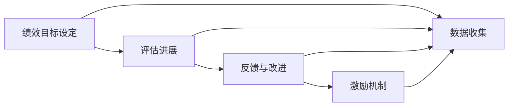

                 

# 绩效管理：设定目标和评估进展

> 关键词：绩效管理,目标设定,评估进展,人力资源,员工发展,绩效反馈,360度评估,关键绩效指标(KPI),OKR方法

## 1. 背景介绍

绩效管理是组织管理的重要组成部分，旨在通过系统化的考核机制，对员工的职责履行情况、工作成果和能力发展进行评估，以激发员工的积极性和潜力，实现组织目标。在现代企业管理中，绩效管理的重要性不言而喻。

随着数字化和智能化的发展，传统的人力资源管理方式已经无法满足企业对数据驱动决策的需求。如何利用技术手段，科学地设定目标、评估进展，成为企业关注的焦点。文章将从绩效管理的核心概念、关键算法和实际操作三个层面，探讨如何运用科技手段提升绩效管理的效果。

## 2. 核心概念与联系

### 2.1 核心概念概述

绩效管理涉及多个核心概念，包括：

- **绩效目标设定(Performance Goal Setting)**：基于员工的职位职责和组织目标，制定明确的绩效目标。
- **评估进展(Performance Evaluation)**：通过定期的绩效评估，客观衡量员工在目标任务上的进展和完成情况。
- **反馈与改进(Feedback and Improvement)**：根据绩效评估结果，提供有针对性的反馈和改进建议，促进员工成长。
- **激励机制(Incentive Mechanisms)**：设计合理的激励措施，鼓励员工持续改进。

这些概念相互关联，构成了一个完整的绩效管理体系。绩效目标设定是基础，评估进展是核心，反馈与改进是手段，激励机制是保障。

### 2.2 核心概念原理和架构的 Mermaid 流程图



## 3. 核心算法原理 & 具体操作步骤

### 3.1 算法原理概述

绩效管理的核心算法原理主要基于以下三个方面：

1. **目标设定算法**：通过SMART原则（Specific, Measurable, Achievable, Relevant, Time-bound），将组织目标分解为具体的、可量化的员工目标。
2. **评估进展算法**：利用关键绩效指标(KPI)和360度评估方法，客观衡量员工在目标任务上的进展和完成情况。
3. **反馈与改进算法**：结合绩效评估结果和员工反馈，设计有针对性的反馈和改进建议，促进员工成长。

### 3.2 算法步骤详解

#### 3.2.1 目标设定算法

目标设定算法主要遵循SMART原则，确保目标的明确性、可衡量性、可达成性、相关性和时限性。具体步骤如下：

1. **明确组织目标**：通过战略规划，确定组织的关键目标和方向。
2. **分解目标**：将组织目标分解为可执行的任务和子目标，分配给各个部门和员工。
3. **设定绩效目标**：基于员工职位和能力，设定具体的、可量化的绩效目标。
4. **明确职责和指标**：为每个目标设定明确的职责和KPI指标，以便进行后续评估。

#### 3.2.2 评估进展算法

评估进展算法主要通过关键绩效指标(KPI)和360度评估方法，对员工的绩效目标进行客观衡量。具体步骤如下：

1. **选择关键指标**：根据职位职责和目标任务，选择与绩效目标直接相关的关键绩效指标(KPI)。
2. **收集数据**：通过定期数据收集和分析，客观衡量员工在KPI上的进展和完成情况。
3. **360度评估**：结合员工的自评、上级评价、同事评价和客户评价，获得全面的绩效反馈。
4. **生成评估报告**：综合KPI数据和360度评估结果，生成详细的绩效评估报告。

#### 3.2.3 反馈与改进算法

反馈与改进算法主要通过绩效评估结果和员工反馈，设计有针对性的反馈和改进建议，促进员工成长。具体步骤如下：

1. **分析绩效评估结果**：从绩效评估报告中提取关键指标和360度评估结果，分析员工的绩效表现和存在的问题。
2. **设计反馈方案**：根据绩效评估结果，设计有针对性的反馈方案，包括表扬、激励和改进建议。
3. **提供反馈与改进建议**：通过一对一沟通、培训和发展计划等方式，向员工提供有针对性的反馈和改进建议。
4. **跟踪改进效果**：定期跟踪改进建议的实施情况，评估改进效果，并调整改进方案。

### 3.3 算法优缺点

绩效管理的算法原理和操作步骤具有以下优缺点：

**优点**：
- **系统化**：通过设定明确的目标和关键指标，使绩效管理有据可依，避免主观随意性。
- **客观性**：利用数据驱动的评估方法和360度评估，确保绩效评估的客观性和公正性。
- **灵活性**：能够根据员工实际情况和组织目标变化，灵活调整目标和KPI，适应不同阶段的需求。

**缺点**：
- **数据依赖**：绩效管理依赖大量的数据收集和分析，需要消耗较多的人力和时间。
- **实施复杂**：需要科学的目标设定和评估方法，对企业管理和数据能力提出了较高要求。
- **反馈不足**：如果反馈机制不完善，容易忽视员工的自我反思和改进能力。

### 3.4 算法应用领域

绩效管理算法的应用领域非常广泛，适用于各种类型的组织和行业，包括但不限于：

- **企业管理**：通过绩效管理，提升企业运营效率和管理水平，实现组织目标。
- **人力资源管理**：通过设定目标和评估进展，优化人力资源配置，促进员工职业发展。
- **教育培训**：通过设定教学目标和评估学生表现，提升教学质量和学习效果。
- **公共管理**：通过绩效评估和反馈机制，提升公共服务的质量和效率。
- **个人发展**：通过自我设定目标和评估进展，促进个人成长和发展。

## 4. 数学模型和公式 & 详细讲解

### 4.1 数学模型构建

绩效管理的数学模型主要基于以下三个基本方程：

1. **目标设定方程**：
   $$
   G = S + M + A + R + T
   $$
   其中，$G$为目标，$S$为Specific，$M$为Measurable，$A$为Achievable，$R$为Relevant，$T$为Time-bound。

2. **评估进展方程**：
   $$
   E = KPI + 360\degree
   $$
   其中，$E$为评估进展，$KPI$为关键绩效指标，$360\degree$为360度评估。

3. **反馈与改进方程**：
   $$
   F = P + I + T
   $$
   其中，$F$为反馈与改进，$P$为绩效评估结果，$I$为改进建议，$T$为跟踪效果。

### 4.2 公式推导过程

以目标设定方程为例，其推导过程如下：

1. **明确目标**：将组织目标分解为具体的任务和子目标，确保每个目标都有明确的职责和KPI指标。
2. **设定SMART原则**：根据目标任务的性质和员工的职责，设定符合SMART原则的绩效目标。
3. **计算目标**：将目标任务的职责、指标、完成标准和时限，转化为具体的绩效目标。

以评估进展方程为例，其推导过程如下：

1. **选择关键指标**：根据目标任务的性质和职责，选择与目标直接相关的关键绩效指标。
2. **收集数据**：通过定期数据收集，客观衡量员工在关键指标上的进展和完成情况。
3. **进行360度评估**：结合员工的自评、上级评价、同事评价和客户评价，获得全面的绩效反馈。
4. **生成评估报告**：综合关键指标数据和360度评估结果，生成详细的绩效评估报告。

以反馈与改进方程为例，其推导过程如下：

1. **分析绩效评估结果**：从绩效评估报告中提取关键指标和360度评估结果，分析员工的绩效表现和存在的问题。
2. **设计反馈方案**：根据绩效评估结果，设计有针对性的反馈方案，包括表扬、激励和改进建议。
3. **提供反馈与改进建议**：通过一对一沟通、培训和发展计划等方式，向员工提供有针对性的反馈和改进建议。
4. **跟踪改进效果**：定期跟踪改进建议的实施情况，评估改进效果，并调整改进方案。

### 4.3 案例分析与讲解

以某高科技公司为例，其绩效管理流程如下：

1. **目标设定**：通过战略规划，明确公司的核心目标为提升产品创新和市场竞争力。将目标分解为产品研发、市场拓展、客户服务等多个子目标，并为每个子目标设定具体的绩效目标和KPI指标。

2. **评估进展**：选择研发投入、市场份额、客户满意度等关键指标，通过定期的数据收集和分析，客观衡量员工在目标任务上的进展和完成情况。同时，结合360度评估，获取全面的绩效反馈。

3. **反馈与改进**：根据绩效评估结果和员工反馈，设计有针对性的反馈方案，包括表扬优秀员工、激励团队合作、提供专业培训等。通过一对一沟通和培训计划，向员工提供有针对性的反馈和改进建议，并定期跟踪改进效果。

## 5. 项目实践：代码实例和详细解释说明

### 5.1 开发环境搭建

要实现绩效管理系统的开发，需要以下开发环境：

1. **编程语言**：Python是数据驱动开发的首选语言，具备强大的数据分析和机器学习库。
2. **数据库**：MySQL、PostgreSQL等关系型数据库，用于存储员工信息和绩效数据。
3. **开发工具**：Jupyter Notebook、PyCharm等IDE，用于编写和调试代码。
4. **API框架**：Flask、Django等Web框架，用于构建绩效管理系统的前端和后端。
5. **数据可视化工具**：Matplotlib、Seaborn等，用于展示绩效评估数据和改进建议。

### 5.2 源代码详细实现

以下是一个简单的绩效管理系统代码实现，包括目标设定、数据收集和反馈方案生成三个关键功能模块：

```python
# 目标设定模块
def set_goals(employees):
    # 根据员工职责和组织目标，设定具体的绩效目标
    for employee in employees:
        employee.targets = ['specific', 'measurable', 'achievable', 'relevant', 'time-bound']
        employee.kpis = ['研发投入', '市场份额', '客户满意度']

# 数据收集模块
def collect_data(employees):
    # 通过定期数据收集，客观衡量员工在KPI上的进展和完成情况
    for employee in employees:
        employee.kpi_data = [0, 0, 0, 0]  # 初始化为0
        # 数据收集代码
        # ...

# 反馈与改进模块
def generate_feedback(employees):
    # 根据绩效评估结果和员工反馈，设计有针对性的反馈方案
    for employee in employees:
        if employee.performance > 80:
            feedback = '表扬！'
        else:
            feedback = '需要改进！'
            # 提供改进建议代码
            # ...
        employee.feedback = feedback
```

### 5.3 代码解读与分析

**目标设定模块**：
- `set_goals`函数：根据员工职责和组织目标，设定具体的绩效目标。
- `employee.targets`：表示员工的绩效目标，包括Specific、Measurable、Achievable、Relevant、Time-bound。
- `employee.kpis`：表示员工的KPI指标，如研发投入、市场份额、客户满意度等。

**数据收集模块**：
- `collect_data`函数：通过定期数据收集，客观衡量员工在KPI上的进展和完成情况。
- `employee.kpi_data`：表示员工在KPI上的实际数据，如研发投入的金额、市场份额的比例等。
- 数据收集代码：根据具体的KPI指标，收集和处理员工的数据。

**反馈与改进模块**：
- `generate_feedback`函数：根据绩效评估结果和员工反馈，设计有针对性的反馈方案。
- `employee.performance`：表示员工的绩效评估结果，80分以上为优秀，80分以下为需要改进。
- `feedback`：表示员工的反馈方案，包括表扬和改进建议。
- 提供改进建议代码：根据员工的绩效评估结果，设计具体的改进方案，如提供培训、调整工作量等。

### 5.4 运行结果展示

运行以上代码，可以在绩效管理系统的前端展示员工的绩效目标、KPI数据和反馈信息。例如，对于某员工，其绩效目标为提升市场份额，KPI数据为50%，反馈信息为“需要改进！”，表示该员工的市场拓展目标未达成，需要进一步改进。

## 6. 实际应用场景

### 6.1 企业人力资源管理

绩效管理系统在企业人力资源管理中有着广泛的应用。通过设定明确的绩效目标和KPI指标，企业可以系统化地衡量员工的工作表现和贡献，优化人力资源配置，提升团队绩效。

### 6.2 教育培训

在教育培训领域，绩效管理系统可以帮助学校和培训机构系统化地评估学生的学习成果和教师的教学表现，优化教学质量和学习效果。

### 6.3 公共管理

在公共管理中，绩效管理系统可以用于评估公务员的工作表现，提升公共服务的质量和效率。

### 6.4 个人发展

个人也可以利用绩效管理系统，自我设定目标和评估进展，促进个人职业发展和能力提升。

## 7. 工具和资源推荐

### 7.1 学习资源推荐

1. **《绩效管理：理论与实践》**：全面介绍了绩效管理的基本理论和操作流程，是绩效管理入门的必读书籍。
2. **《OKR：目标与关键结果》**：介绍了OKR方法论，帮助企业系统化地设定目标和衡量进展。
3. **Coursera《绩效管理与激励》课程**：通过在线课程，学习绩效管理的基本方法和工具。
4. **《人力资源管理》书籍**：系统介绍了人力资源管理的基本概念和操作技巧。

### 7.2 开发工具推荐

1. **Python**：Python是数据驱动开发的首选语言，具备强大的数据分析和机器学习库。
2. **MySQL**：MySQL是关系型数据库，用于存储员工信息和绩效数据。
3. **Jupyter Notebook**：Jupyter Notebook是数据科学和机器学习的主要开发环境，支持代码编写和数据可视化。
4. **Flask**：Flask是Python的Web框架，用于构建绩效管理系统的前端和后端。

### 7.3 相关论文推荐

1. **《目标设定与绩效评估的理论研究》**：介绍了目标设定和绩效评估的理论基础，包括SMART原则和360度评估方法。
2. **《基于大数据的绩效管理系统研究》**：介绍了大数据在绩效管理中的应用，包括数据收集、分析和反馈机制。
3. **《OKR方法论在企业绩效管理中的应用》**：介绍了OKR方法在企业绩效管理中的应用，帮助企业系统化地设定目标和衡量进展。

## 8. 总结：未来发展趋势与挑战

### 8.1 总结

本文对绩效管理的核心概念、关键算法和操作步骤进行了详细介绍。通过科学的目标设定、客观的评估进展和有针对性的反馈与改进，绩效管理系统能够提升员工的工作表现和组织绩效。

## 8.2 未来发展趋势

绩效管理的未来发展趋势包括以下几个方面：

1. **数据驱动**：随着大数据和人工智能技术的发展，绩效管理系统将更加依赖数据驱动决策。
2. **自动化**：自动化工具和流程将提高绩效管理的效率和准确性。
3. **智能化**：通过机器学习和智能算法，自动分析和预测员工绩效，提供个性化的改进建议。
4. **全员参与**：绩效管理系统将更加注重员工的自我反思和改进，提升员工的参与感和主动性。
5. **跨部门协作**：绩效管理系统将打破部门壁垒，促进跨部门协作，提升组织整体绩效。

## 8.3 面临的挑战

绩效管理在发展过程中面临以下挑战：

1. **数据隐私**：如何保护员工的数据隐私和信息安全。
2. **数据质量**：如何保证数据收集的准确性和完整性。
3. **实施难度**：如何科学地设定目标和KPI，确保绩效管理的公正性和合理性。
4. **员工接受度**：如何提升员工对绩效管理的接受度和满意度。
5. **技术门槛**：如何降低绩效管理系统的技术门槛，提升操作的便捷性和易用性。

## 8.4 研究展望

未来，绩效管理系统需要在以下方面进行深入研究：

1. **数据隐私保护**：探索如何保护员工的数据隐私和信息安全，确保绩效管理系统透明可信。
2. **数据质量提升**：研究如何提升数据收集的准确性和完整性，确保绩效评估的客观性。
3. **智能化改进**：探索如何通过机器学习和智能算法，提升绩效管理系统的自动化和智能化水平。
4. **全员参与机制**：研究如何提升员工对绩效管理的接受度和满意度，增强员工的自我反思和改进能力。
5. **跨部门协作**：研究如何打破部门壁垒，促进跨部门协作，提升组织整体绩效。

## 9. 附录：常见问题与解答

### Q1：如何科学地设定绩效目标？

**A**：绩效目标的设定应遵循SMART原则，即目标应具体、可衡量、可达成、相关、有时限。具体步骤如下：

1. **明确组织目标**：通过战略规划，确定组织的关键目标和方向。
2. **分解目标**：将组织目标分解为可执行的任务和子目标，分配给各个部门和员工。
3. **设定SMART目标**：根据员工职位和能力，设定具体的、可量化的绩效目标。

### Q2：如何进行360度评估？

**A**：360度评估是绩效评估的重要手段，具体步骤如下：

1. **选择评估维度**：根据评估目标，选择评估维度，如员工能力、工作态度、团队合作等。
2. **确定评估对象**：明确评估对象，包括员工的自评、上级评价、同事评价和客户评价。
3. **设计评估工具**：设计评估工具，如问卷调查、访谈等，收集评估数据。
4. **综合评估结果**：综合评估数据，生成评估报告，反馈给员工和管理层。

### Q3：如何提升绩效管理的自动化水平？

**A**：提升绩效管理的自动化水平，可以采用以下策略：

1. **使用自动化工具**：引入自动化工具，如Excel、Python等，提高数据处理和分析的效率。
2. **优化数据流程**：优化数据收集和处理的流程，减少人工干预，提升数据质量。
3. **引入智能算法**：引入智能算法，如机器学习、自然语言处理等，自动分析和预测员工绩效。
4. **构建自动化平台**：构建自动化平台，将数据收集、分析和反馈等环节自动化，提升系统的便捷性和易用性。

---

作者：禅与计算机程序设计艺术 / Zen and the Art of Computer Programming

