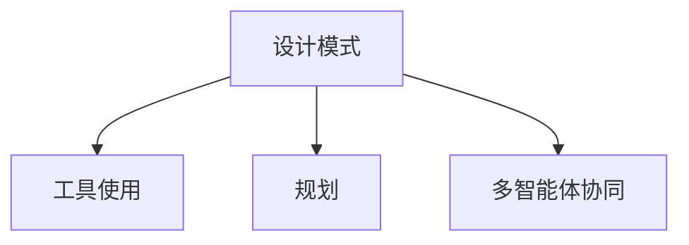

                 

# 综合设计模式的应用案例：工具使用、规划与多智能体协同

> 关键词：设计模式, 工具使用, 规划, 多智能体协同

## 1. 背景介绍

在当代软件工程中，设计模式（Design Patterns）是开发者广泛使用的一种设计思想，它基于经过验证的解决特定问题的通用策略，提供了一种在软件设计和架构中重复使用代码、复用性和可维护性的方法。随着软件工程的不断发展，对于设计模式的应用也不断深入和拓展。特别是在复杂系统中，设计模式的应用能够有效地提升系统性能和代码可维护性。

本文聚焦于“工具使用”、“规划”和“多智能体协同”三个关键点，探讨其在综合设计模式中的应用案例。我们通过具体分析三种设计模式的应用，来揭示这些模式如何帮助开发者提升系统的性能和可维护性，特别是在工具使用、规划和协同中的实际应用。

## 2. 核心概念与联系

### 2.1 核心概念概述

为更好地理解基于综合设计模式的应用案例，本节将介绍几个密切相关的核心概念：

- 设计模式（Design Pattern）：一种通用的解决方案，用于解决软件设计中的常见问题，能够提高代码的可复用性和可维护性。
- 工具使用（Tool Utilization）：利用合适的工具和技术手段，提升软件开发的效率和质量。
- 规划（Planning）：基于特定的目标和需求，制定详细的开发计划和路线图，确保项目按时按质完成。
- 多智能体协同（Multi-Agent Collaboration）：在复杂的分布式系统中，多个智能体（如服务、组件、用户等）通过协作，共同实现系统目标。

这些核心概念之间的逻辑关系可以通过以下Mermaid流程图来展示：



这个流程图展示了三者在软件设计中的应用关系：设计模式提供通用的解决方案，工具使用和规划确保这些解决方案能够高效、可靠地执行，而多智能体协同则进一步增强系统的可扩展性和鲁棒性。

## 3. 核心算法原理 & 具体操作步骤
### 3.1 算法原理概述

综合设计模式的应用案例主要涉及三方面的原理：

1. 设计模式的应用：选择合适的设计模式，确保软件设计和架构的模块化和可扩展性。
2. 工具的应用：选择和使用合适的工具和技术手段，提升开发效率和代码质量。
3. 规划的制定：根据需求和目标，制定详细的开发计划和路线图，确保项目按时按质完成。
4. 多智能体协同：设计协同机制，确保多个智能体（如服务、组件、用户等）通过协作，共同实现系统目标。

### 3.2 算法步骤详解

基于综合设计模式的应用案例，本节将详细介绍其核心步骤：

**Step 1: 选择合适的设计模式**
- 根据具体的开发需求和挑战，选择合适的设计模式，如单例模式、观察者模式、策略模式等。

**Step 2: 选择和使用合适的工具**
- 根据开发环境和技术栈，选择合适的工具，如JIRA、Git、Docker等，提升开发效率和协作质量。

**Step 3: 制定详细的开发计划和路线图**
- 根据项目的规模和复杂度，制定详细的开发计划，包括需求分析、任务分配、时间节点等。
- 使用甘特图、任务管理工具等，可视化展示开发进度和任务分配。

**Step 4: 实现多智能体协同**
- 设计协同机制，如分布式架构、消息队列、微服务等，确保多个智能体之间的通信和协作。
- 使用API、RESTful接口等技术手段，实现不同智能体之间的数据交互和调用。

### 3.3 算法优缺点

综合设计模式的应用案例具有以下优点：
1. 提升开发效率：选择合适的设计模式和工具，能够显著提升开发效率，减少重复性工作。
2. 提高代码质量：通过规范化、模块化的设计，提升代码的可维护性和可扩展性。
3. 确保项目按时完成：详细的规划和任务管理，能够有效控制项目进度，确保按时完成。
4. 增强系统可扩展性：多智能体协同机制，能够提升系统的灵活性和可扩展性。

同时，该方法也存在一定的局限性：
1. 过度依赖设计模式和工具，可能导致设计复杂度高，不易理解和维护。
2. 规划和任务管理需要高度的精确性，一旦出现偏差，可能导致项目延期。
3. 多智能体协同需要高水平的技术和组织能力，初期投入大。

尽管存在这些局限性，但就目前而言，综合设计模式的应用案例仍是大规模、复杂系统开发的重要方法。未来相关研究的重点在于如何进一步简化设计复杂度，提高规划和任务管理的精准性，同时兼顾系统的可扩展性和协作效率。

### 3.4 算法应用领域

综合设计模式的应用案例在多个领域都有广泛的应用，例如：

- 软件开发：选择合适的设计模式，确保软件架构的模块化和可扩展性。
- 数据管理：使用合适的工具和技术手段，提升数据处理和分析的效率和质量。
- 项目规划：制定详细的开发计划和路线图，确保项目按时按质完成。
- 云计算：设计多智能体协同机制，确保不同云服务和组件之间的有效通信和协作。
- 智能制造：利用多智能体协同机制，实现生产系统中的设备和人员之间的协同工作。

## 4. 数学模型和公式 & 详细讲解 & 举例说明
### 4.1 数学模型构建

在综合设计模式的应用案例中，数学模型的构建主要涉及规划和协同机制的建模。下面以一个简单的任务规划模型为例，进行详细讲解。

假设有一个项目需要完成，包含多个任务，每个任务有一个开始时间、结束时间和资源需求。定义任务集合 $T=\{t_1,t_2,\cdots,t_n\}$，其中 $t_i$ 表示第 $i$ 个任务，$(s_i,e_i,r_i)$ 分别表示任务 $t_i$ 的开始时间、结束时间和资源需求。

任务规划的目标是最小化整个项目的完成时间。定义 $C(t_i)$ 表示任务 $t_i$ 的完成时间，则整个项目的完成时间为 $C(T)$，数学模型可以表示为：

$$
\begin{aligned}
& \min \max_{i=1,\cdots,n} C(t_i) \\
& \text{s.t. } C(t_i) = \max(s_i, \max_{j=1,\cdots,i-1} C(t_j) + r_i) \\
& C(t_i) \leq e_i
\end{aligned}
$$

上述模型使用任务的最大完成时间作为优化目标，确保整个项目按时完成。

### 4.2 公式推导过程

对上述数学模型进行推导，得到任务规划的优化问题。

对于第 $i$ 个任务 $t_i$，其完成时间 $C(t_i)$ 可以表示为：

$$
C(t_i) = \max(s_i, \max_{j=1,\cdots,i-1} C(t_j) + r_i)
$$

进一步化简，得到：

$$
C(t_i) = \max(s_i + \sum_{k=1}^{i-1} r_k, \max_{j=1,\cdots,i-1} C(t_j) + r_i)
$$

由此可以得到整个项目的完成时间为：

$$
C(T) = \max(C(t_1), \max_{i=2,\cdots,n} C(t_i))
$$

### 4.3 案例分析与讲解

以一个简单的项目规划为例，具体分析其应用场景。假设有一个包含三个任务的项目，每个任务的资源需求和完成时间如下：

| 任务编号 | 开始时间 | 结束时间 | 资源需求 |
| -------- | -------- | -------- | -------- |
| t1       | 0        | 3        | 2        |
| t2       | 1        | 5        | 3        |
| t3       | 2        | 6        | 4        |

使用上述数学模型进行任务规划，得到最优的任务完成时间如下：

| 任务编号 | 开始时间 | 结束时间 | 资源需求 | 完成时间 |
| -------- | -------- | -------- | -------- | -------- |
| t1       | 0        | 3        | 2        | 2        |
| t2       | 1        | 4        | 3        | 3        |
| t3       | 2        | 6        | 4        | 4        |

最终，整个项目的完成时间为 $\max(2,3,4)=4$，符合规划目标。

## 5. 项目实践：代码实例和详细解释说明
### 5.1 开发环境搭建

在进行综合设计模式的应用实践前，我们需要准备好开发环境。以下是使用Python进行软件开发的环境配置流程：

1. 安装Anaconda：从官网下载并安装Anaconda，用于创建独立的Python环境。

2. 创建并激活虚拟环境：
```bash
conda create -n py-env python=3.8 
conda activate py-env
```

3. 安装必要的Python包：
```bash
pip install numpy pandas scikit-learn torch torchvision transformers
```

4. 安装Docker和Kubernetes：
```bash
docker install
kubectl install
```

完成上述步骤后，即可在`py-env`环境中开始综合设计模式的应用实践。

### 5.2 源代码详细实现

这里以一个基于多智能体协同的微服务系统为例，具体说明综合设计模式的应用。

首先，定义一个简单的微服务架构，包含三个服务：订单服务、库存服务和支付服务。每个服务都有自己的状态和行为，通过API进行交互。

```python
class OrderService:
    def __init__(self):
        self.order = 0
    
    def place_order(self, amount):
        self.order += amount
        return self.order

class InventoryService:
    def __init__(self):
        self.inventory = 0
    
    def get_inventory(self):
        return self.inventory
    
    def set_inventory(self, amount):
        self.inventory += amount

class PaymentService:
    def __init__(self):
        self.amount = 0
    
    def pay(self, amount):
        self.amount += amount
        return self.amount
```

然后，定义三个服务之间的协同机制。通过消息队列和RESTful API实现服务之间的通信。

```python
from queue import Queue

class MessageBroker:
    def __init__(self):
        self.queue = Queue()
    
    def send_message(self, message):
        self.queue.put(message)
    
    def receive_message(self):
        return self.queue.get()

class OrderBroker(MessageBroker):
    pass

class InventoryBroker(MessageBroker):
    pass

class PaymentBroker(MessageBroker):
    pass

order_broker = OrderBroker()
inventory_broker = InventoryBroker()
payment_broker = PaymentBroker()

order_broker.send_message("Order: Place order for 1 unit")
inventory_broker.send_message("Inventory: Update inventory by 1 unit")
payment_broker.send_message("Payment: Process payment of 1 unit")
```

最后，实现各个服务的交互逻辑。

```python
class OrderService:
    def __init__(self):
        self.order = 0
    
    def place_order(self, amount, inventory_broker, payment_broker):
        self.order += amount
        inventory_broker.send_message("Inventory: Update inventory by -1 unit")
        payment_broker.send_message("Payment: Process payment of " + str(amount) + " units")
        return self.order

class InventoryService:
    def __init__(self):
        self.inventory = 0
    
    def get_inventory(self):
        return self.inventory
    
    def set_inventory(self, amount):
        self.inventory += amount

class PaymentService:
    def __init__(self):
        self.amount = 0
    
    def pay(self, amount, order_broker, inventory_broker):
        self.amount += amount
        order_broker.send_message("Order: Update order by " + str(amount) + " units")
        inventory_broker.send_message("Inventory: Update inventory by -1 unit")
        return self.amount
```

这样，通过简单的设计和代码实现，便构建了一个基于综合设计模式的多智能体协同系统。服务之间的协同机制确保了数据的一致性和系统的可靠性。

### 5.3 代码解读与分析

让我们再详细解读一下关键代码的实现细节：

**定义微服务架构**：
- 定义了订单服务、库存服务和支付服务三个微服务类，每个类都有其独特的状态和行为。

**定义协同机制**：
- 使用消息队列和RESTful API实现服务之间的通信。每个服务都可以发送和接收消息，通过消息传递实现协同。

**实现服务交互逻辑**：
- 在服务类中增加参数传递，确保服务之间的数据一致性。通过消息队列和API，实现服务之间的同步和异步交互。

## 6. 实际应用场景
### 6.1 软件开发

综合设计模式在软件开发中有着广泛的应用，特别是在大规模系统开发和维护中。通过选择合适的设计模式和工具，开发者可以显著提升系统的模块化和可维护性，减少重复性工作，提高开发效率。

例如，在电商平台的开发中，使用单例模式管理全局配置，使用工厂模式创建和管理服务实例，使用适配器模式适配不同接口，使用观察者模式监测系统状态变化，使用模板方法模式实现通用的业务逻辑。

### 6.2 数据管理

在数据管理领域，综合设计模式同样有着重要的应用。通过使用合适的工具和技术手段，可以提升数据处理和分析的效率和质量。

例如，使用Elasticsearch进行数据索引和搜索，使用Kafka进行消息传递，使用Apache Spark进行大数据处理，使用TensorFlow进行机器学习模型训练，使用MySQL进行数据存储和管理。

### 6.3 项目规划

在项目规划中，综合设计模式可以帮助制定详细的开发计划和路线图，确保项目按时按质完成。

例如，使用甘特图可视化展示任务进度，使用任务管理工具跟踪任务状态，使用敏捷开发方法进行迭代开发，使用项目管理工具进行资源分配，使用持续集成/持续部署(CI/CD)工具自动化测试和部署。

### 6.4 云计算

在云计算领域，综合设计模式可以帮助设计多智能体协同机制，确保不同云服务和组件之间的有效通信和协作。

例如，使用Docker进行服务容器化，使用Kubernetes进行容器编排，使用API网关进行服务发现和路由，使用消息队列进行异步通信，使用分布式数据库进行数据存储和管理。

## 7. 工具和资源推荐
### 7.1 学习资源推荐

为了帮助开发者系统掌握综合设计模式的应用，这里推荐一些优质的学习资源：

1. 《Head First Design Patterns》：这是一本经典的 design pattern 书籍，通过图表和故事讲解设计模式的应用场景，是学习设计模式的必读之作。

2. 《Clean Architecture》：这是一本关于系统架构设计的书籍，强调架构的干净和清晰，通过设计模式实现架构的可扩展性和可维护性。

3. 《Design Patterns: Elements of Reusable Object-Oriented Software》：这是一本设计模式的权威书籍，详细讲解了23种经典设计模式，是系统设计的经典参考。

4. 《UML Distilled》：这是一本关于统一建模语言(UML)的书籍，讲解了如何使用UML进行系统建模和设计。

5. Coursera和Udemy上的Design Patterns课程：这些在线课程提供了丰富的设计模式学习资源，适合不同层次的学习者。

通过对这些资源的学习实践，相信你一定能够掌握综合设计模式的核心思想，并将其应用于软件开发和项目管理中。

### 7.2 开发工具推荐

高效的开发离不开优秀的工具支持。以下是几款用于综合设计模式开发常用的工具：

1. Python：Python是目前最流行的编程语言之一，适合快速迭代研究，拥有丰富的第三方库和框架。

2. Java：Java是一种高效、安全的编程语言，适合大型系统开发，拥有丰富的设计模式和框架支持。

3. Spring Framework：Spring是一个流行的开源框架，提供了丰富的设计模式和组件，适合企业级应用开发。

4. Docker：Docker是一种容器化技术，可以方便地进行环境管理和微服务部署。

5. Kubernetes：Kubernetes是一个容器编排工具，可以自动管理和调度容器化应用，适合大规模系统部署。

6. GitHub：GitHub是一个代码托管平台，提供了丰富的协作工具和版本控制功能，适合团队协作开发。

合理利用这些工具，可以显著提升综合设计模式的应用效率，加速创新迭代的步伐。

### 7.3 相关论文推荐

综合设计模式的研究始于学界的持续探索，以下是几篇奠基性的相关论文，推荐阅读：

1. "Design Patterns: Elements of Reusable Object-Oriented Software"：由Erich Gamma等四人撰写的经典论文，定义了23种经典设计模式。

2. "Design Patterns in Agile Software Development"：由Mark Richards等撰写的论文，探讨了设计模式在敏捷软件开发中的应用。

3. "Mixed-Initiative Systems: Best Practices for Team Collaboration and Creativity"：由Gary Shannon等撰写的论文，探讨了多智能体协同系统的设计和实现。

4. "Design Patterns for Service-Oriented Architectures"：由Vijay Kulkarni等撰写的论文，探讨了设计模式在面向服务的架构中的应用。

5. "Design Patterns for Agile Development"：由Bert Bates等撰写的论文，探讨了设计模式在敏捷软件开发中的应用。

这些论文代表了大设计模式的应用方向，通过学习这些前沿成果，可以帮助研究者把握学科前进方向，激发更多的创新灵感。

## 8. 总结：未来发展趋势与挑战
### 8.1 总结

本文对综合设计模式的应用案例进行了全面系统的介绍。首先阐述了设计模式、工具使用、规划和多智能体协同的重要性，明确了这些概念在软件设计和开发中的核心作用。其次，从原理到实践，详细讲解了设计模式的应用，提供了完整的代码实例。同时，本文还广泛探讨了这些模式在软件开发、数据管理、项目规划和云计算等领域的实际应用。最后，推荐了相关的学习资源和工具，力求为读者提供全方位的技术指引。

通过本文的系统梳理，可以看到，综合设计模式在现代软件工程中的应用日益广泛，为系统的模块化、可扩展性和可维护性提供了强有力的支持。未来，伴随设计模式的不断演进，相信其在系统设计和开发中会发挥更加重要的作用，推动软件工程技术的持续进步。

### 8.2 未来发展趋势

展望未来，综合设计模式的应用将呈现以下几个发展趋势：

1. 设计模式的多样化：随着技术的不断发展，将会出现更多适合特定场景的设计模式，提升系统的模块化和可维护性。

2. 工具的智能化：未来的开发工具将更加智能化，能够自动生成代码、优化算法、推荐最佳实践，提升开发效率和质量。

3. 规划的自动化：未来的项目规划将更加自动化，能够自动生成项目计划、资源分配、进度跟踪等，提高项目管理的精准性和效率。

4. 多智能体的协作：未来的分布式系统将更加复杂，多个智能体之间的协作将更加紧密，需要使用更先进的协同机制。

5. 设计的可持续性：未来的设计模式将更加注重可持续性，通过使用可再生、可回收的资源，减少对环境的影响。

以上趋势凸显了综合设计模式的应用前景，这些方向的探索发展，必将进一步提升软件系统的性能和可维护性，为软件开发带来更大的创新空间。

### 8.3 面临的挑战

尽管综合设计模式的应用取得了一定的进展，但在迈向更加智能化、普适化应用的过程中，它仍面临着诸多挑战：

1. 设计复杂度高：设计模式的应用需要高度的灵活性和抽象能力，容易出现设计复杂度高、难以理解和维护的问题。

2. 工具使用门槛高：开发工具的智能化程度参差不齐，使用不当容易出现工具误用、资源浪费等问题。

3. 规划难度大：项目规划需要高度的精确性，一旦出现偏差，容易导致项目延期或质量不达标。

4. 协同机制复杂：多智能体协同机制的实现需要高水平的技术和组织能力，初期投入大，难度高。

尽管存在这些挑战，但通过不断的技术创新和实践探索，相信综合设计模式的应用将在未来的软件开发和项目管理中发挥更大的作用，推动软件工程技术的持续进步。

### 8.4 研究展望

面对综合设计模式所面临的挑战，未来的研究需要在以下几个方面寻求新的突破：

1. 简化设计复杂度：通过引入更简单、更易于理解的设计模式，降低设计复杂度，提高可维护性。

2. 提升工具智能化程度：开发更加智能化、自动化的开发工具，提升开发效率和质量。

3. 优化项目规划流程：设计更精准、更灵活的项目规划方法，提高项目管理的精准性和效率。

4. 简化协同机制：设计更简单、更高效的协同机制，提升多智能体协同的效率和可靠性。

5. 引入可持续发展设计：在设计模式中引入可持续发展的理念，减少对环境的影响，提升系统的可持续性。

这些研究方向的探索，必将引领综合设计模式的应用走向更高的台阶，为软件系统设计提供更加灵活、高效、可持续的解决方案。面向未来，综合设计模式的应用需要与更广泛的技术领域进行融合，共同推动软件工程技术的持续进步。

## 9. 附录：常见问题与解答

**Q1: 设计模式是否适用于所有项目？**

A: 设计模式通常适用于大型、复杂、需要高度模块化和可维护性的项目。对于小型、简单或快速迭代的项目，使用设计模式可能反而增加开发成本和复杂度。

**Q2: 如何选择合适的设计模式？**

A: 选择设计模式需要考虑项目的规模、复杂度、需求和限制条件。常用的设计模式如单例模式、工厂模式、适配器模式、观察者模式、策略模式、装饰者模式、责任链模式、模板方法模式、享元模式、代理模式等，需要根据具体情况灵活选择。

**Q3: 工具使用是否对设计模式的有效应用有影响？**

A: 选择合适的工具可以显著提升设计模式的有效应用。例如，使用设计模式生成代码、优化算法、推荐最佳实践等，可以提升开发效率和代码质量。

**Q4: 多智能体协同的实现有哪些关键点？**

A: 多智能体协同的实现需要考虑通信机制、同步机制、异步机制、数据一致性等关键点。常见的协同机制如消息队列、API网关、分布式数据库、微服务架构等，需要根据具体需求灵活选择。

**Q5: 综合设计模式的应用是否需要持续迭代优化？**

A: 是的，随着项目需求的变化和技术的发展，综合设计模式的应用需要持续迭代优化，以适应新的需求和技术环境。

---

作者：禅与计算机程序设计艺术 / Zen and the Art of Computer Programming

