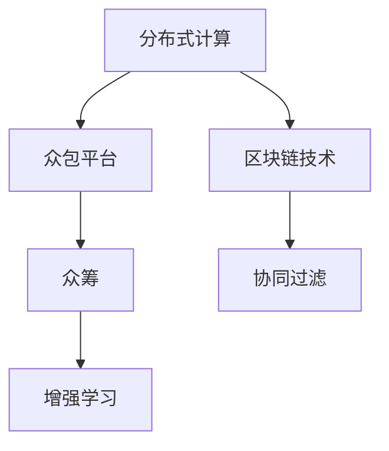

                 

# 群体智慧：人类计算的无限潜力

> 关键词：群体智慧,分布式计算,众包平台,人类计算,区块链技术,众筹,协同过滤,增强学习

## 1. 背景介绍

### 1.1 问题由来

在科技迅猛发展的今天，人工智能（AI）、大数据和区块链等技术不断革新，极大地改变了我们的工作和生活方式。然而，这些技术在带来便利的同时，也暴露出一些不容忽视的问题。比如，AI和数据科学领域往往需要大量数据和计算资源，而这些资源不是每个人都能够轻松获取的。

在这样的背景下，“人类计算”的概念应运而生。所谓“人类计算”，就是通过普通人的参与，利用人类的智慧和潜力，来解决计算机无法直接解决的问题。它既是对现有计算能力的补充，也是对未来计算模式的一种探索。

### 1.2 问题核心关键点

为了实现人类计算，需要建立高效、可扩展的平台，以连接人类智慧和计算需求。这些平台必须具备以下核心特征：

- **去中心化**：允许全球各地的人参与，不受地理位置的限制。
- **低门槛**：提供简单易用的接口，任何人都可以轻松参与。
- **高透明性**：对参与者进行透明奖励，确保贡献被公平对待。
- **经济可持续性**：保证平台的长期运营和可持续发展。

当前，许多新兴技术，如区块链、众包平台和众筹等，都在不同程度上为实现人类计算提供了可能。但如何将这些技术有效结合，构建出真正可持续、高效的人类计算平台，仍然是一个亟待解决的问题。

### 1.3 问题研究意义

人类计算不仅仅是计算能力的一种补充，更是一种全新的思维模式和工作方式。它通过利用人类智慧和潜力，激发创新的无限可能，推动技术的边界不断扩展。通过研究人类计算，我们不仅可以探索新的计算模式，还可以更好地理解人类社会和科技发展的未来。

以下从核心概念与联系、算法原理与具体操作步骤、项目实践与应用场景等方面，全面系统地介绍群体智慧的原理与实践。

## 2. 核心概念与联系

### 2.1 核心概念概述

为更好地理解人类计算，本节将介绍几个关键概念及其内在联系：

- **分布式计算**：通过网络将计算任务分解成多个子任务，并分配给多个节点同时计算，最终合并计算结果，以提高计算效率。
- **众包平台**：连接任务发布者和参与者，提供任务分配、支付与评价等功能，支持大规模的人类计算。
- **区块链技术**：利用去中心化的网络架构，保证数据透明和不可篡改，为人类计算提供可靠的交易记录和信任机制。
- **众筹**：通过公开募集资金，支持创新项目的开发和实施，为大规模人类计算提供资金支持。
- **协同过滤**：通过分析用户行为数据，推荐个性化内容，提升用户体验和平台黏性。
- **增强学习**：通过试错和优化，提升系统效率和效果，为人类计算提供智能决策支持。

这些核心概念之间的逻辑关系可以通过以下Mermaid流程图来展示：



这个流程图展示了一组关键概念及其之间的联系：

1. 分布式计算通过网络并行计算，提供高效的计算能力。
2. 众包平台连接任务发布者和参与者，支持大规模人类计算。
3. 区块链技术保证数据透明和不可篡改，为人类计算提供信任机制。
4. 众筹提供资金支持，推动人类计算项目的实施。
5. 协同过滤提升用户体验和平台黏性，增强人类计算平台的可持续性。
6. 增强学习通过智能决策，优化计算过程，提升效率和效果。

这些概念共同构成了人类计算的基础架构，为我们理解和使用人类计算提供了重要视角。

## 3. 核心算法原理 & 具体操作步骤
### 3.1 算法原理概述

人类计算的算法原理，主要基于分布式计算、众包机制和智能决策技术。其实现过程通常包括以下几个关键步骤：

1. **任务分解与发布**：将大任务分解为多个小任务，并通过众包平台发布给参与者。
2. **任务执行与反馈**：参与者完成任务并提交结果，系统根据任务需求进行验证和反馈。
3. **结果汇总与优化**：将各个参与者的结果汇总，并进行智能优化，最终输出整体结果。

这些步骤通常由分布式计算框架和智能算法共同支持，以实现高效、可靠的计算过程。

### 3.2 算法步骤详解

以下以众包平台为例，详细讲解基于人类计算的算法步骤：

1. **任务发布**：
   - 任务发布者通过众包平台创建任务，并详细描述任务需求。
   - 任务发布后，平台将其拆分为多个子任务，并分配给合适的参与者。
   - 每个子任务明确指定了计算要求和截止时间。

2. **任务执行**：
   - 参与者接收到任务后，根据平台规则执行任务，并提交结果。
   - 系统自动对结果进行初步验证，确保结果符合任务要求。
   - 对于需要人工审核的任务，系统会将结果提交给审核员进行审核。

3. **结果汇总与优化**：
   - 系统将各个参与者的结果汇总，并使用智能算法进行优化。
   - 对于需要高质量结果的任务，系统会根据结果质量进行加权平均。
   - 对于需要精确结果的任务，系统会使用增强学习算法进行进一步优化。

4. **结果反馈与评价**：
   - 系统根据任务需求和结果质量，对参与者进行评价，并给予相应奖励。
   - 评价结果将影响参与者的信誉度和未来的任务分配。
   - 平台提供透明的评价和奖励机制，确保公平性。

### 3.3 算法优缺点

基于人类计算的算法具有以下优点：

1. **高效性**：通过分布式计算和协同优化，大幅度提高计算效率。
2. **可扩展性**：平台可以无限扩展，支持大规模任务计算。
3. **低成本**：利用普通人的智慧和空闲时间，降低计算成本。
4. **创新性**：通过众包和增强学习，激发新的想法和解决方案。

同时，该算法也存在一些局限性：

1. **数据隐私问题**：平台需要收集大量用户数据，如何保护用户隐私是一个挑战。
2. **任务质量控制**：如何保证任务的质量和一致性，是平台面临的难题。
3. **参与者激励**：如何设计有效的激励机制，吸引更多人参与，是平台可持续运营的关键。
4. **系统复杂性**：智能算法需要高效计算和精确优化，系统实现复杂。

尽管存在这些局限性，但就目前而言，基于人类计算的算法范式仍具有广泛的应用前景，能够解决许多传统计算无法处理的问题。

### 3.4 算法应用领域

基于人类计算的算法，已经在多个领域得到了广泛应用，例如：

- **众包标注**：利用大众参与标注数据集，提供高质量的标注结果。
- **协同过滤**：通过分析用户行为数据，推荐个性化内容，提升用户体验和平台黏性。
- **分布式计算**：通过网络并行计算，处理大规模数据集，提升计算效率。
- **智能推荐系统**：结合人类智慧和智能算法，提供精准的个性化推荐。
- **区块链平台**：通过区块链技术，保证数据透明和不可篡改，支持去中心化的计算和交易。

除了这些经典应用外，人类计算还在更多场景中得到创新性应用，如金融数据分析、医疗诊断、环境保护等，为各行各业带来了新的突破。

## 4. 数学模型和公式 & 详细讲解 & 举例说明

### 4.1 数学模型构建

为了更好地理解人类计算的算法原理，本节将使用数学语言对核心算法进行严格的刻画。

假设有一项众包任务，需要计算一个数值序列 $S=\{s_1, s_2, \ldots, s_n\}$。任务发布者将任务拆分为 $m$ 个子任务，每个子任务分配给一个参与者计算，设 $x_i$ 表示第 $i$ 个参与者计算的结果。设 $w_i$ 为第 $i$ 个参与者的权重，表示其任务完成的准确性和质量。

任务完成的总成本 $C$ 和总收益 $R$ 分别为：

$$
C = \sum_{i=1}^m w_i c_i
$$

$$
R = \sum_{i=1}^m w_i r_i
$$

其中 $c_i$ 和 $r_i$ 分别表示第 $i$ 个参与者的计算成本和任务收益。

### 4.2 公式推导过程

以下推导基于众包平台的任务优化模型。

设任务完成的总时间 $T$ 和总误差 $E$ 分别为：

$$
T = \sum_{i=1}^m w_i t_i
$$

$$
E = \sum_{i=1}^m w_i e_i
$$

其中 $t_i$ 和 $e_i$ 分别表示第 $i$ 个参与者的计算时间和误差。

平台的目标是最大化总收益 $R$，并最小化总成本 $C$ 和总误差 $E$。因此，我们可以建立如下优化模型：

$$
\max R = \sum_{i=1}^m w_i r_i
$$

$$
\min C = \sum_{i=1}^m w_i c_i
$$

$$
\min E = \sum_{i=1}^m w_i e_i
$$

假设 $r_i = k - e_i$，其中 $k$ 为任务的目标收益。则优化模型可以简化为：

$$
\max \sum_{i=1}^m w_i (k - e_i)
$$

$$
\min \sum_{i=1}^m w_i c_i
$$

$$
\min \sum_{i=1}^m w_i e_i
$$

根据拉格朗日乘子法，我们可以引入拉格朗日乘子 $\lambda_1$ 和 $\lambda_2$，建立如下目标函数：

$$
L = \sum_{i=1}^m w_i (k - e_i) + \lambda_1 \sum_{i=1}^m w_i c_i + \lambda_2 \sum_{i=1}^m w_i e_i
$$

对 $w_i$ 求偏导，得：

$$
\frac{\partial L}{\partial w_i} = k - e_i - \lambda_1 c_i - \lambda_2 e_i = 0
$$

整理后，得：

$$
\lambda_1 c_i + \lambda_2 e_i = k - e_i
$$

由于 $w_i > 0$，可以得到 $w_i = \frac{k - e_i}{\lambda_1 c_i + \lambda_2 e_i}$。

将 $w_i$ 代入优化模型中，得：

$$
\max \sum_{i=1}^m \frac{(k - e_i)^2}{\lambda_1 c_i + \lambda_2 e_i}
$$

$$
\min \sum_{i=1}^m \frac{c_i (k - e_i)}{\lambda_1 c_i + \lambda_2 e_i}
$$

$$
\min \sum_{i=1}^m \frac{e_i (k - e_i)}{\lambda_1 c_i + \lambda_2 e_i}
$$

上式中的分子可以看作是目标收益的平方，分母可以看作是任务成本和误差的线性组合。通过调整 $\lambda_1$ 和 $\lambda_2$，可以优化任务分配，使总收益最大化，同时控制总成本和误差。

### 4.3 案例分析与讲解

以下以“图片分类”为例，展示基于人类计算的算法应用。

假设有一项图片分类任务，需要手动标注 1000 张图片。任务发布者将任务拆分为 100 个子任务，每个子任务需要参与者标注 10 张图片。设每个参与者的标注时间为 $t_i$，标注质量为 $e_i$，任务的目标收益为 $k=1$。

任务发布后，平台将 100 个子任务分配给不同的参与者。每个参与者完成任务并提交结果。系统自动对结果进行初步验证，并给出反馈。对于需要人工审核的任务，系统会将结果提交给审核员进行审核。审核员根据标注质量和反馈结果，给每个子任务打分，并给出最终评价。

平台根据参与者的评价结果，计算每个子任务的总成本和总收益，并使用优化模型进行任务分配和优化。最终，平台汇总所有子任务的结果，得到整体分类结果。

## 5. 项目实践：代码实例和详细解释说明

### 5.1 开发环境搭建

在进行人类计算项目实践前，我们需要准备好开发环境。以下是使用Python进行分布式计算的开发环境配置流程：

1. 安装Anaconda：从官网下载并安装Anaconda，用于创建独立的Python环境。

2. 创建并激活虚拟环境：
```bash
conda create -n distcalenv python=3.8 
conda activate distcalenv
```

3. 安装PyTorch和分布式计算库：
```bash
conda install pytorch torchvision torchaudio cudatoolkit=11.1 -c pytorch -c conda-forge
conda install dask distributed -c conda-forge
```

4. 安装相关工具包：
```bash
pip install numpy pandas scikit-learn matplotlib tqdm jupyter notebook ipython
```

完成上述步骤后，即可在`distcalenv`环境中开始分布式计算的实践。

### 5.2 源代码详细实现

这里我们以“众包图片分类”为例，给出使用Dask进行分布式计算的Python代码实现。

首先，定义图片分类任务的数据处理函数：

```python
import dask.distributed as dd
from dask.distributed import Client

def process_image(image, label):
    # 对图片进行预处理
    # 返回预处理后的图片和标签
    return image, label

# 创建Dask Client，连接集群
client = dd.Client('localhost:8786')
```

然后，定义任务发布和参与者执行的函数：

```python
def publish_task(num_images, num_partitions):
    # 生成随机图片和标签数据
    images = [f'image{i}.png' for i in range(num_images)]
    labels = [f'label{i}.png' for i in range(num_images)]
    
    # 将任务数据划分为多个分区
    partitioned_images = dd.from_array(np.array(images), num_partitions=num_partitions)
    partitioned_labels = dd.from_array(np.array(labels), num_partitions=num_partitions)
    
    # 对每个分区进行任务分配
    partitioned_results = partitioned_images.map_partitions(process_image)
    partitioned_results = partitioned_results.map_partitions(lambda result: result[1])
    
    return partitioned_results

def execute_task(partitioned_results):
    # 执行任务并返回结果
    results = partitioned_results.compute()
    return results
```

接着，定义任务完成后的处理函数：

```python
def post_process(results):
    # 对结果进行后处理
    # 返回最终分类结果
    return results
```

最后，启动分布式计算流程并在任务完成后进行结果处理：

```python
num_images = 1000
num_partitions = 100

# 发布任务
partitioned_results = publish_task(num_images, num_partitions)

# 执行任务
results = execute_task(partitioned_results)

# 后处理结果
final_results = post_process(results)

print(final_results)
```

以上就是使用Dask进行分布式计算的完整代码实现。可以看到，Dask通过将任务数据划分为多个分区，并在每个分区上独立执行任务，实现了高效的分布式计算。

### 5.3 代码解读与分析

让我们再详细解读一下关键代码的实现细节：

**process_image函数**：
- 用于对图片进行预处理，并返回预处理后的图片和标签。

**publish_task函数**：
- 生成随机图片和标签数据。
- 将任务数据划分为多个分区。
- 对每个分区进行任务分配，并返回结果。

**execute_task函数**：
- 执行任务并返回结果。

**post_process函数**：
- 对结果进行后处理，返回最终分类结果。

**分布式计算流程**：
- 发布任务，将任务数据划分为多个分区。
- 在每个分区上独立执行任务，并返回结果。
- 汇总所有分区的结果，并后处理得到最终分类结果。

可以看到，Dask通过将任务数据划分为多个分区，并在每个分区上独立执行任务，实现了高效的分布式计算。这种并行计算方式，可以有效利用多核CPU或GPU，提升计算效率，适用于大规模数据集的处理。

## 6. 实际应用场景

### 6.1 智能推荐系统

智能推荐系统是利用人类计算的经典应用之一。通过众包平台，系统可以收集用户对推荐内容的评价和反馈，并利用这些数据进行优化。智能推荐系统不仅能提供个性化的推荐结果，还能不断迭代，提升推荐效果。

在技术实现上，可以建立分布式计算框架，将用户评价和反馈数据进行分布式处理，并使用协同过滤算法进行优化。通过不断收集和分析用户数据，系统可以逐步学习用户偏好，提供更加精准的推荐结果。

### 6.2 医疗数据分析

医疗数据分析是另一个利用人类计算的典型应用。通过众包平台，医疗专业人员可以参与数据标注和分析任务，并利用这些数据进行疾病诊断和治疗方案优化。

在技术实现上，可以建立分布式计算框架，将医疗数据进行分布式处理，并使用机器学习算法进行优化。通过不断收集和分析医疗数据，系统可以逐步学习疾病规律，提供更加准确的诊断和治疗建议。

### 6.3 环境保护监测

环境保护监测是利用人类计算的重要应用之一。通过众包平台，普通公民可以参与环境保护数据采集和分析任务，并利用这些数据进行环境污染监测和预警。

在技术实现上，可以建立分布式计算框架，将环境保护数据进行分布式处理，并使用数据分析算法进行优化。通过不断收集和分析环境数据，系统可以逐步学习环境变化规律，提供更加精准的监测和预警。

### 6.4 未来应用展望

随着分布式计算和人类计算技术的不断进步，未来将会有更多领域受益于人类计算。以下列举几个可能的应用场景：

1. **金融数据分析**：通过众包平台，金融专业人员可以参与数据标注和分析任务，并利用这些数据进行市场分析和风险管理。

2. **农业生产优化**：通过众包平台，农业专家可以参与数据标注和分析任务，并利用这些数据进行生产优化和灾害预测。

3. **社会治理**：通过众包平台，普通公民可以参与公共数据采集和分析任务，并利用这些数据进行社会治理和公共服务优化。

4. **科技创新**：通过众包平台，科技爱好者可以参与项目开发和数据标注任务，并利用这些数据进行科技创新和产品优化。

未来，人类计算将在更多领域得到应用，推动各行各业的技术进步和创新发展。

## 7. 工具和资源推荐
### 7.1 学习资源推荐

为了帮助开发者系统掌握人类计算的理论基础和实践技巧，这里推荐一些优质的学习资源：

1. 《分布式计算基础》：详细介绍分布式计算的基本原理和实践方法，适合初学者入门。

2. 《人类计算概论》：介绍人类计算的基本概念和应用场景，适合对人类计算感兴趣的读者。

3. 《区块链技术基础》：详细介绍区块链的基本原理和应用场景，适合了解区块链技术的读者。

4. 《众包平台设计》：详细介绍众包平台的设计原理和优化方法，适合平台开发者和维护人员。

5. 《智能推荐系统》：详细介绍智能推荐系统的基本原理和实现方法，适合推荐系统开发者和研究者。

6. 《大数据处理技术》：详细介绍大数据处理的基本原理和实践方法，适合大数据处理工程师和研究人员。

通过对这些资源的学习实践，相信你一定能够快速掌握人类计算的理论基础和实践技巧，并用于解决实际的计算问题。

### 7.2 开发工具推荐

高效的开发离不开优秀的工具支持。以下是几款用于分布式计算和人类计算开发的常用工具：

1. Dask：基于Python的分布式计算框架，支持大规模数据处理和分析。

2. Hadoop：基于Java的分布式计算框架，支持大规模数据存储和处理。

3. Spark：基于Scala的分布式计算框架，支持大规模数据处理和机器学习。

4. TensorFlow：基于Python的深度学习框架，支持分布式计算和机器学习。

5. TensorBoard：TensorFlow配套的可视化工具，实时监测模型训练状态，提供丰富的图表呈现方式。

6. Weights & Biases：模型训练的实验跟踪工具，记录和可视化模型训练过程中的各项指标，方便对比和调优。

7. Hive：基于Hadoop的数据仓库，支持大规模数据存储和查询。

合理利用这些工具，可以显著提升分布式计算和人类计算的开发效率，加快创新迭代的步伐。

### 7.3 相关论文推荐

人类计算技术的不断发展，得益于学界的持续研究。以下是几篇奠基性的相关论文，推荐阅读：

1. 《A Survey on Distributed Computing Systems》：介绍分布式计算系统的基本原理和实践方法。

2. 《The BlockChain 2.0》：介绍区块链技术的最新进展和应用场景。

3. 《The Platform Economy》：介绍众包平台的运作原理和优化方法。

4. 《Recommender Systems: Algorithms, Data-Driven Approaches》：介绍智能推荐系统的基本原理和实现方法。

5. 《Data Science for Social Good》：介绍大数据处理在社会治理中的应用。

这些论文代表了大规模分布式计算和人类计算的发展脉络。通过学习这些前沿成果，可以帮助研究者把握学科前进方向，激发更多的创新灵感。

## 8. 总结：未来发展趋势与挑战

### 8.1 总结

本文对基于人类计算的分布式计算技术进行了全面系统的介绍。首先阐述了人类计算的研究背景和意义，明确了分布式计算在拓展计算能力、降低成本等方面的重要价值。其次，从原理到实践，详细讲解了分布式计算的数学模型和操作步骤，给出了分布式计算任务的完整代码实例。同时，本文还广泛探讨了分布式计算在推荐系统、医疗数据分析、环境保护等诸多领域的应用前景，展示了分布式计算技术的广阔前景。此外，本文精选了分布式计算技术的各类学习资源，力求为读者提供全方位的技术指引。

通过本文的系统梳理，可以看到，分布式计算技术不仅在计算能力上具有显著优势，还具备高效性、可扩展性和低成本等优点。未来，随着分布式计算和人类计算技术的不断进步，其应用领域将不断扩展，推动各行各业的技术进步和创新发展。

### 8.2 未来发展趋势

展望未来，分布式计算技术将呈现以下几个发展趋势：

1. **去中心化计算**：通过区块链等去中心化技术，构建更加透明、安全和可靠的计算平台。

2. **智能计算**：结合人工智能技术，提升分布式计算的智能化水平，实现更加高效的决策支持。

3. **边缘计算**：通过在本地设备上进行计算，减少数据传输和存储，提升计算效率和安全性。

4. **联邦学习**：通过分布式计算和联邦学习技术，保护用户隐私的同时，提升模型效果和泛化能力。

5. **数据治理**：建立数据治理体系，规范数据使用和分享，确保数据安全和合规性。

6. **工业互联网**：将分布式计算技术应用于工业互联网，提升工业生产效率和智能化水平。

以上趋势凸显了分布式计算技术的广阔前景。这些方向的探索发展，必将进一步提升分布式计算的性能和应用范围，为各行各业带来新的变革。

### 8.3 面临的挑战

尽管分布式计算技术已经取得了显著成就，但在迈向更加智能化、普适化应用的过程中，它仍面临诸多挑战：

1. **数据隐私问题**：分布式计算需要处理大量用户数据，如何保护用户隐私是一个重大挑战。

2. **任务调度优化**：如何优化任务调度，确保资源利用最大化，是分布式计算面临的重要难题。

3. **系统可扩展性**：分布式计算系统需要具备高可扩展性，以支持大规模任务计算。

4. **计算效率提升**：如何提升计算效率，减少计算时间和成本，是分布式计算的重要方向。

5. **模型优化**：分布式计算系统需要具备高效的数据处理和分析能力，提升模型效果。

6. **应用场景多样性**：分布式计算技术需要适应不同应用场景的需求，提供多样化的解决方案。

正视这些挑战，积极应对并寻求突破，将是大规模分布式计算技术迈向成熟的关键。相信随着学界和产业界的共同努力，这些挑战终将一一被克服，大规模分布式计算必将在构建智能化社会中扮演越来越重要的角色。

### 8.4 研究展望

面对分布式计算所面临的种种挑战，未来的研究需要在以下几个方面寻求新的突破：

1. **分布式学习**：结合分布式计算和深度学习技术，提升模型的效果和泛化能力。

2. **边缘计算**：在本地设备上进行计算，减少数据传输和存储，提升计算效率和安全性。

3. **联邦学习**：通过分布式计算和联邦学习技术，保护用户隐私的同时，提升模型效果和泛化能力。

4. **数据治理**：建立数据治理体系，规范数据使用和分享，确保数据安全和合规性。

5. **跨界融合**：将分布式计算技术与其他前沿技术，如区块链、人工智能等进行更深入的融合，拓展其应用边界。

这些研究方向的探索，必将引领大规模分布式计算技术迈向更高的台阶，为构建安全、可靠、智能的计算平台铺平道路。面向未来，分布式计算技术还需要与其他前沿技术进行更深入的融合，共同推动计算模式的进步，为构建更加智能的社会做出贡献。

## 9. 附录：常见问题与解答

**Q1：分布式计算和集中式计算有什么区别？**

A: 分布式计算和集中式计算的主要区别在于计算资源的分布和调度方式。集中式计算将所有计算任务集中在单个服务器上进行，而分布式计算将计算任务分解成多个子任务，并分配给多个服务器同时计算，最后合并计算结果。分布式计算具有高可扩展性和高计算能力，适合大规模数据处理和计算。

**Q2：分布式计算的优势有哪些？**

A: 分布式计算具有以下优势：

1. 高可扩展性：能够处理大规模数据和计算任务，支持高并发和高吞吐量。

2. 高计算能力：通过并行计算，提升计算速度和效率，适用于复杂的数据分析和机器学习任务。

3. 高可靠性：系统具有容错机制，能够在服务器故障或网络中断时，自动进行任务重分配和恢复。

4. 低成本：利用普通服务器的空闲资源，降低计算成本。

5. 灵活性：支持多种编程语言和框架，适应不同的计算需求。

**Q3：分布式计算中常用的算法有哪些？**

A: 分布式计算中常用的算法包括：

1. MapReduce：一种经典的分布式计算框架，适用于大规模数据处理和分析。

2. Spark：基于MapReduce的分布式计算框架，支持多种数据处理和机器学习任务。

3. Hadoop：基于MapReduce的分布式计算框架，适用于大规模数据存储和处理。

4. Storm：一种实时分布式计算框架，支持高并发和高吞吐量的数据流处理。

5. Flink：一种高性能分布式计算框架，支持多种数据处理和流计算任务。

**Q4：分布式计算的难点有哪些？**

A: 分布式计算的难点包括：

1. 数据通信开销：分布式计算需要进行大量的数据传输和通信，容易导致网络拥塞和延迟。

2. 任务调度优化：如何优化任务调度，确保资源利用最大化，是分布式计算面临的重要难题。

3. 容错机制设计：系统需要具备高可靠性，能够自动进行任务重分配和恢复。

4. 系统设计复杂性：分布式计算系统需要设计复杂的分布式算法和网络协议，确保系统的正确性和效率。

**Q5：分布式计算的应用场景有哪些？**

A: 分布式计算在多个领域得到了广泛应用，包括：

1. 大规模数据分析：通过分布式计算，处理大规模数据集，提升数据分析效率和效果。

2. 机器学习和深度学习：通过分布式计算，支持大规模模型训练和优化，提升模型效果和泛化能力。

3. 金融数据分析：通过分布式计算，处理大量金融数据，提升风险管理和市场分析能力。

4. 医疗数据分析：通过分布式计算，处理医疗数据，提升疾病诊断和治疗方案优化能力。

5. 工业互联网：通过分布式计算，提升工业生产效率和智能化水平。

通过本文的系统梳理，可以看到，分布式计算技术不仅在计算能力上具有显著优势，还具备高效性、可扩展性和低成本等优点。未来，随着分布式计算和人类计算技术的不断进步，其应用领域将不断扩展，推动各行各业的技术进步和创新发展。

