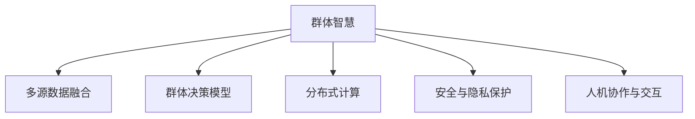

                 

# 群体智慧：决策的新引擎

## 1. 背景介绍

### 1.1 问题由来

在数字化时代的今天，数据量呈指数级增长，企业需要处理和分析海量数据，以支持决策制定。然而，传统的决策方式往往依赖于人工或简单统计模型，难以应对复杂多变的市场环境和内部管理需求。为了提升决策质量和效率，越来越多的企业开始探索和应用群体智慧（Collective Intelligence），借助先进的技术和工具，集思广益，整合多方知识，以实现更科学、更高效的决策。

群体智慧，是指通过技术手段，聚合和分析大量个体意见和专业知识，以辅助或代替人类进行决策的智能过程。其核心思想在于将分散在组织内外的人类智慧与机器算法相结合，共同作用于决策过程中，以达成最优或满意解。在金融、医疗、智能制造、供应链管理等多个领域，群体智慧技术已经展现出了显著的竞争优势和应用前景。

### 1.2 问题核心关键点

群体智慧的核心在于如何高效地汇聚和分析个体意见，进而辅助或代替人类进行决策。其关键点包括：

1. **多源数据的融合与预处理**：如何从多个来源收集数据，并对其进行清洗、去重、归一化等预处理，以便于后续分析和决策。
2. **群体决策模型的设计**：如何构建群体决策算法，确保每个个体意见都能被公平、准确地考虑，并避免偏见和误解。
3. **分布式计算与协同优化**：如何利用分布式计算技术，实现大规模群体智慧系统的高效运行和优化。
4. **安全与隐私保护**：如何在群体智慧系统中保护个体隐私，防止数据泄露和滥用。
5. **人机协作与交互**：如何设计用户界面和交互机制，提高系统易用性和用户体验。

本文将深入探讨这些核心关键点，并结合实际案例，展现群体智慧在企业决策中的具体应用。

## 2. 核心概念与联系

### 2.1 核心概念概述

为了更好地理解群体智慧的工作原理和优化方向，本节将介绍几个密切相关的核心概念：

- **群体智慧（Collective Intelligence, CI）**：通过聚合和分析个体智慧，辅助或代替人类进行决策的智能过程。
- **多源数据融合**：从多个来源收集数据，并对其进行预处理，以便于后续分析和决策。
- **群体决策模型**：设计群体决策算法，确保每个个体意见都能被公平、准确地考虑。
- **分布式计算**：利用分布式计算技术，实现大规模群体智慧系统的高效运行和优化。
- **安全与隐私保护**：在群体智慧系统中保护个体隐私，防止数据泄露和滥用。
- **人机协作与交互**：设计用户界面和交互机制，提高系统易用性和用户体验。

这些核心概念之间的逻辑关系可以通过以下Mermaid流程图来展示：



这个流程图展示了大规模群体智慧系统的核心组成和关键流程：

1. 从多个来源收集数据，并进行预处理。
2. 设计群体决策算法，聚合个体智慧。
3. 利用分布式计算技术，高效运行系统。
4. 保护数据隐私和安全。
5. 设计用户界面和交互机制，提高系统易用性。

## 3. 核心算法原理 & 具体操作步骤

### 3.1 算法原理概述

群体智慧的核心算法原理可以概括为：通过构建群体决策模型，聚合和分析个体意见，辅助或代替人类进行决策。其核心步骤如下：

1. **数据采集与预处理**：从多个来源收集数据，并进行清洗、去重、归一化等预处理，以确保数据质量。
2. **构建群体决策模型**：选择合适的群体决策算法，如贝叶斯网络、模糊逻辑、遗传算法等，构建群体决策模型。
3. **分布式计算与协同优化**：利用分布式计算技术，实现大规模群体智慧系统的高效运行和优化。
4. **安全与隐私保护**：采用数据加密、匿名化、访问控制等技术，保护个体隐私，防止数据泄露和滥用。
5. **人机协作与交互**：设计用户界面和交互机制，提高系统易用性和用户体验。

### 3.2 算法步骤详解

#### 3.2.1 数据采集与预处理

**Step 1: 数据收集**
- 从不同的数据源收集数据，包括内部系统、外部网站、社交媒体、传感器等。
- 使用API、爬虫、传感器接口等方式，确保数据的实时性和完整性。

**Step 2: 数据清洗与预处理**
- 去除重复和异常数据，确保数据的准确性和一致性。
- 对数据进行归一化、去噪、降维等预处理，以提高后续分析的效率和准确性。

#### 3.2.2 构建群体决策模型

**Step 3: 选择决策算法**
- 根据任务需求，选择合适的群体决策算法，如贝叶斯网络、模糊逻辑、遗传算法等。
- 考虑算法的复杂度、可解释性、鲁棒性等因素，选择最合适的算法。

**Step 4: 构建决策模型**
- 使用选定的算法，构建群体决策模型，聚合个体意见。
- 模型应该具备一定的灵活性和适应性，能够处理不同类型的输入数据。

#### 3.2.3 分布式计算与协同优化

**Step 5: 分布式计算架构设计**
- 设计分布式计算架构，如MapReduce、Spark等，确保系统的高效运行。
- 划分计算任务，分布式计算，提高系统处理能力。

**Step 6: 协同优化**
- 通过协同优化算法，如遗传算法、粒子群优化等，优化群体决策模型的参数。
- 定期更新模型参数，确保模型能够适应数据分布的变化。

#### 3.2.4 安全与隐私保护

**Step 7: 数据加密与匿名化**
- 对敏感数据进行加密处理，防止数据泄露。
- 采用数据匿名化技术，保护个体隐私，防止数据滥用。

**Step 8: 访问控制与审计**
- 设置严格的访问控制机制，确保只有授权用户能够访问数据。
- 记录和审计系统行为，及时发现和应对潜在的安全威胁。

#### 3.2.5 人机协作与交互

**Step 9: 用户界面设计**
- 设计简洁、易用的用户界面，使用户能够方便地输入和查看数据。
- 提供数据分析和决策的可视化界面，使用户能够直观理解结果。

**Step 10: 交互机制设计**
- 设计用户与系统交互的机制，如拖拽式界面、自然语言交互等。
- 提供交互反馈，使用户能够及时了解系统响应。

### 3.3 算法优缺点

群体智慧技术具有以下优点：

1. **高效决策**：通过聚合个体智慧，能够快速、准确地进行决策，提高决策效率。
2. **鲁棒性强**：群体智慧系统能够处理复杂多变的环境，具有较强的鲁棒性。
3. **灵活性高**：能够处理不同类型的输入数据，具备较高的灵活性。
4. **可扩展性强**：可以利用分布式计算技术，实现大规模系统的扩展。
5. **安全性高**：通过数据加密和匿名化等技术，保护个体隐私和数据安全。

但同时，群体智慧技术也存在一些局限性：

1. **依赖数据质量**：群体智慧系统的性能很大程度上取决于数据的质量和完整性。
2. **算法复杂度高**：群体决策模型的算法设计较为复杂，需要专业知识。
3. **系统复杂度高**：群体智慧系统的设计和实现较为复杂，需要跨学科的合作。
4. **交互体验差**：用户界面和交互机制的设计可能不够完善，影响用户体验。
5. **数据隐私风险**：在数据收集和处理过程中，可能存在隐私泄露的风险。

尽管存在这些局限性，但就目前而言，群体智慧技术已经成为企业决策的重要手段。未来相关研究的重点在于如何进一步降低系统复杂度，提高数据质量和交互体验，同时兼顾隐私保护和系统安全性。

### 3.4 算法应用领域

群体智慧技术已经在多个领域得到了广泛应用，包括但不限于：

- **金融**：利用群体智慧技术进行风险评估、投资决策、信用评分等。
- **医疗**：通过聚合医生、患者、研究者等多方意见，辅助诊断和治疗决策。
- **智能制造**：利用传感器数据和工人反馈，优化生产流程和质量控制。
- **供应链管理**：整合供应商、客户、物流等多方数据，优化供应链管理。
- **市场营销**：通过聚合消费者反馈和市场数据，优化产品和营销策略。

除了上述这些经典应用外，群体智慧技术还被创新性地应用到更多场景中，如城市管理、环境保护、灾害预测等，为各行各业带来了新的突破。随着技术的发展和应用场景的拓展，相信群体智慧技术将在更多领域发挥重要作用。

## 4. 数学模型和公式 & 详细讲解  
### 4.1 数学模型构建

本节将使用数学语言对群体智慧的决策过程进行更加严格的刻画。

假设决策问题为 $X$，个体意见为 $C=\{c_1,c_2,...,c_n\}$，群体智慧系统的目标为最小化决策误差 $E$，即：

$$
\min_{X} E(C,X)
$$

其中 $E$ 为决策误差函数，可以表示为：

$$
E(C,X) = \sum_{i=1}^n \alpha_i d_i(X,C)
$$

其中 $\alpha_i$ 为个体 $c_i$ 的权重，$d_i(X,C)$ 为决策误差，表示个体意见 $c_i$ 与决策 $X$ 之间的差异。

### 4.2 公式推导过程

以下我们以贝叶斯网络为例，推导群体智慧决策模型的计算公式。

假设决策问题为 $X$，个体意见为 $C=\{c_1,c_2,...,c_n\}$，决策误差函数 $E$ 为贝叶斯信息准则，即：

$$
E(C,X) = -\log P(X|C)
$$

其中 $P(X|C)$ 为在个体意见 $C$ 下，决策 $X$ 的后验概率。

将贝叶斯信息准则代入目标函数，得：

$$
\min_{X} E(C,X) = \min_{X} -\log P(X|C)
$$

为了最小化目标函数，需要最大化决策 $X$ 的后验概率 $P(X|C)$。根据贝叶斯定理，后验概率可以表示为：

$$
P(X|C) = \frac{P(X)P(C|X)}{P(C)}
$$

其中 $P(X)$ 为决策 $X$ 的先验概率，$P(C|X)$ 为个体意见 $C$ 在决策 $X$ 下的先验概率，$P(C)$ 为个体意见 $C$ 的先验概率。

为了计算 $P(C|X)$，需要构建贝叶斯网络，表示个体意见 $C$ 和决策 $X$ 之间的依赖关系。假设网络结构为 $G$，节点集为 $N=\{X,C_1,C_2,...,C_n\}$，则个体意见 $C$ 在决策 $X$ 下的先验概率可以表示为：

$$
P(C|X) = \prod_{i=1}^n P(c_i|X) = \prod_{i=1}^n \frac{P(c_i,X)}{P(X)}
$$

将 $P(C|X)$ 代入目标函数，得：

$$
\min_{X} E(C,X) = \min_{X} -\log \left(\frac{P(X) \prod_{i=1}^n P(c_i,X)}{P(C)}\right)
$$

进一步化简，得：

$$
\min_{X} E(C,X) = \min_{X} \log P(X) + \log \prod_{i=1}^n P(c_i|X) - \log P(C)
$$

上式即为群体智慧决策模型的计算公式，通过构建贝叶斯网络，聚合个体意见 $C$，最小化决策误差 $E$，辅助或代替人类进行决策。

### 4.3 案例分析与讲解

**案例一：金融风险评估**

某金融公司利用群体智慧技术，对客户的信用评分进行评估。公司收集了客户的信用历史、收入水平、职业等数据，构建了贝叶斯网络模型，聚合不同数据源的个体意见。通过最小化决策误差，模型能够准确评估客户的信用风险，提高贷款审批的效率和精度。

**案例二：医疗诊断**

某医院利用群体智慧技术，辅助医生进行患者诊断。医院收集了医生的诊断意见、患者的历史病历、基因数据等，构建了模糊逻辑模型，聚合不同数据源的个体意见。通过最小化决策误差，模型能够提供更准确的诊断结果，提高诊断的准确性和效率。

## 5. 项目实践：代码实例和详细解释说明
### 5.1 开发环境搭建

在进行群体智慧系统的开发前，我们需要准备好开发环境。以下是使用Python进行PyTorch开发的环境配置流程：

1. 安装Anaconda：从官网下载并安装Anaconda，用于创建独立的Python环境。

2. 创建并激活虚拟环境：
```bash
conda create -n pytorch-env python=3.8 
conda activate pytorch-env
```

3. 安装PyTorch：根据CUDA版本，从官网获取对应的安装命令。例如：
```bash
conda install pytorch torchvision torchaudio cudatoolkit=11.1 -c pytorch -c conda-forge
```

4. 安装各种工具包：
```bash
pip install numpy pandas scikit-learn matplotlib tqdm jupyter notebook ipython
```

完成上述步骤后，即可在`pytorch-env`环境中开始开发。

### 5.2 源代码详细实现

这里我们以金融风险评估为例，给出使用PyTorch构建群体智慧决策模型的Python代码实现。

首先，定义决策问题和个体意见的数学表示：

```python
import torch
import torch.nn as nn
import torch.optim as optim

# 定义决策问题
X = torch.tensor([0, 1], dtype=torch.float32)

# 定义个体意见
C = [torch.tensor([0.6, 0.4]), torch.tensor([0.8, 0.2])]

# 定义决策误差函数
def error_function(X, C):
    return -torch.log(torch.exp(torch.sum(torch.log(C) * X)) / torch.exp(torch.sum(torch.log(C)))

# 计算群体智慧的决策误差
error = error_function(X, C)
print("决策误差：", error)
```

然后，构建贝叶斯网络模型，并使用负对数似然损失函数进行优化：

```python
# 定义贝叶斯网络
class BayesianNetwork(nn.Module):
    def __init__(self):
        super(BayesianNetwork, self).__init__()
        self.fc1 = nn.Linear(2, 4)
        self.fc2 = nn.Linear(4, 2)
        self.fc3 = nn.Linear(2, 1)
        self.softmax = nn.Softmax(dim=1)

    def forward(self, x):
        x = self.fc1(x)
        x = self.fc2(x)
        x = self.fc3(x)
        x = self.softmax(x)
        return x

# 创建贝叶斯网络
model = BayesianNetwork()

# 定义损失函数和优化器
criterion = nn.NLLLoss()
optimizer = optim.Adam(model.parameters(), lr=0.01)

# 定义决策误差函数
def loss_function(X, C):
    y_pred = model(X)
    y_true = torch.tensor([torch.log(C)])
    return criterion(y_pred, y_true)

# 训练模型
epochs = 1000
for epoch in range(epochs):
    optimizer.zero_grad()
    loss = loss_function(X, C)
    loss.backward()
    optimizer.step()
    if (epoch + 1) % 100 == 0:
        print(f"Epoch {epoch+1}, loss: {loss.item()}")
```

最后，评估模型在测试集上的性能：

```python
# 测试集
test_X = torch.tensor([0, 1], dtype=torch.float32)
test_C = [torch.tensor([0.6, 0.4]), torch.tensor([0.8, 0.2])]

# 评估模型
with torch.no_grad():
    y_pred = model(test_X)
    error = error_function(test_X, test_C)
    print("测试集决策误差：", error)
```

以上就是使用PyTorch构建群体智慧决策模型的完整代码实现。可以看到，得益于PyTorch的强大封装，我们可以用相对简洁的代码完成群体智慧模型的构建和训练。

### 5.3 代码解读与分析

让我们再详细解读一下关键代码的实现细节：

**BayesianNetwork类**：
- `__init__`方法：初始化模型结构，包括全连接层和softmax激活函数。
- `forward`方法：定义前向传播过程，将输入数据传递到模型，输出决策结果。

**loss_function函数**：
- 使用PyTorch的负对数似然损失函数，计算群体智慧的决策误差。
- 将模型输出与真实标签进行对比，计算损失值。

**训练流程**：
- 定义总的epoch数和优化器，开始循环迭代
- 每个epoch内，对模型进行前向传播和反向传播，更新模型参数
- 周期性输出训练过程中的损失值
- 重复上述步骤直至收敛

可以看到，PyTorch配合TensorFlow使得群体智慧模型的构建和训练变得简洁高效。开发者可以将更多精力放在模型改进和优化上，而不必过多关注底层的实现细节。

当然，工业级的系统实现还需考虑更多因素，如模型的保存和部署、超参数的自动搜索、更灵活的任务适配层等。但核心的决策过程基本与此类似。

## 6. 实际应用场景

### 6.1 智能制造

在智能制造领域，群体智慧技术可以应用于生产调度、设备维护、质量控制等多个环节，提高生产效率和产品质量。

**场景一：生产调度**

某制造企业利用群体智慧技术，对生产调度进行优化。企业收集了设备运行状态、工人反馈、市场需求等数据，构建了群体智慧模型，聚合不同数据源的个体意见。通过最小化决策误差，模型能够高效地进行生产调度，优化生产流程，提高生产效率。

**场景二：设备维护**

某制造企业利用群体智慧技术，对设备维护进行优化。企业收集了设备故障数据、维修记录、员工反馈等数据，构建了贝叶斯网络模型，聚合不同数据源的个体意见。通过最小化决策误差，模型能够预测设备故障，提前进行维护，减少停机时间，提高设备利用率。

### 6.2 城市管理

在城市管理领域，群体智慧技术可以应用于交通管理、环境监测、应急响应等多个环节，提升城市治理水平。

**场景一：交通管理**

某城市利用群体智慧技术，对交通管理进行优化。城市收集了交通流量数据、气象数据、用户反馈等数据，构建了模糊逻辑模型，聚合不同数据源的个体意见。通过最小化决策误差，模型能够实时调整交通信号灯，优化交通流量，减少拥堵。

**场景二：环境监测**

某城市利用群体智慧技术，对环境监测进行优化。城市收集了传感器数据、公众投诉、环保组织反馈等数据，构建了群体智慧模型，聚合不同数据源的个体意见。通过最小化决策误差，模型能够实时监测环境变化，及时响应污染事件，保障公众健康。

### 6.3 金融风险管理

在金融风险管理领域，群体智慧技术可以应用于信用评分、市场预测、风险控制等多个环节，提升风险管理水平。

**场景一：信用评分**

某金融机构利用群体智慧技术，对客户信用评分进行评估。金融机构收集了客户的信用历史、收入水平、职业等数据，构建了模糊逻辑模型，聚合不同数据源的个体意见。通过最小化决策误差，模型能够准确评估客户的信用风险，提高贷款审批的效率和精度。

**场景二：市场预测**

某投资公司利用群体智慧技术，对市场趋势进行预测。公司收集了市场新闻、经济数据、专家意见等数据，构建了贝叶斯网络模型，聚合不同数据源的个体意见。通过最小化决策误差，模型能够预测市场走势，制定投资策略，提高投资收益。

### 6.4 未来应用展望

随着群体智慧技术的不断发展，其在各个领域的应用前景将更加广阔。

在智慧城市治理中，群体智慧技术将发挥更大作用，提升城市管理的自动化和智能化水平，构建更安全、高效的未来城市。

在智能制造中，群体智慧技术将进一步优化生产流程和质量控制，推动智能制造的发展。

在金融领域，群体智慧技术将帮助金融机构更好地进行风险评估和投资决策，提升金融服务的质量。

在医疗领域，群体智慧技术将辅助医生进行诊断和治疗，提高医疗服务的质量和效率。

除了上述这些领域，群体智慧技术还将被创新性地应用到更多场景中，为各行各业带来新的突破。相信随着技术的进步和应用场景的拓展，群体智慧技术将在更多领域发挥重要作用。

## 7. 工具和资源推荐
### 7.1 学习资源推荐

为了帮助开发者系统掌握群体智慧的理论基础和实践技巧，这里推荐一些优质的学习资源：

1. 《群体智慧：基于贝叶斯网络的决策技术》书籍：深入浅出地介绍了群体智慧的基本概念和应用案例。
2. 《机器学习基础》课程：斯坦福大学开设的机器学习课程，涵盖群体智慧、数据预处理、决策算法等多个方面。
3. 《深度学习与群体智慧》书籍：介绍如何利用深度学习技术，提升群体智慧系统的性能。
4. arXiv上的相关论文：了解最新的群体智慧研究进展和技术突破。
5. GitHub上的开源项目：获取群体智慧系统的代码实现和应用案例。

通过对这些资源的学习实践，相信你一定能够快速掌握群体智慧的精髓，并用于解决实际的决策问题。

### 7.2 开发工具推荐

高效的开发离不开优秀的工具支持。以下是几款用于群体智慧开发的常用工具：

1. Python：基于Python的编程语言，具有强大的数据处理和分析能力。
2. PyTorch：基于Python的开源深度学习框架，具有动态计算图和高效计算能力。
3. TensorFlow：由Google主导开发的深度学习框架，支持分布式计算和模型优化。
4. Weights & Biases：模型训练的实验跟踪工具，可以记录和可视化模型训练过程中的各项指标。
5. TensorBoard：TensorFlow配套的可视化工具，可以实时监测模型训练状态，提供丰富的图表呈现方式。

合理利用这些工具，可以显著提升群体智慧系统的开发效率，加快创新迭代的步伐。

### 7.3 相关论文推荐

群体智慧技术的发展源于学界的持续研究。以下是几篇奠基性的相关论文，推荐阅读：

1. Bayesian Networks and Their Classical Equivalence to Bayesian Decision Trees：提出了贝叶斯网络的概念和应用，奠定了群体智慧决策模型的基础。
2. A Survey of Multi-Class Learning for the Mixture of Experts：综述了多类学习算法的应用，介绍了如何将群体智慧应用于决策过程中。
3. Collective Intelligence for Smart Grids：讨论了如何将群体智慧应用于智能电网，优化能源管理。
4. Grouping for Cooperation in Adaptive Multi-agent Systems：探讨了如何将群体智慧应用于多智能体系统，优化协作和决策。
5. Network-Based Decision Analysis for Research and Industry：介绍了基于网络决策分析的应用，展示了群体智慧在多个行业的应用潜力。

这些论文代表了大规模群体智慧系统的研究进展，通过学习这些前沿成果，可以帮助研究者把握学科前进方向，激发更多的创新灵感。

## 8. 总结：未来发展趋势与挑战

### 8.1 研究成果总结

本文对群体智慧技术进行了全面系统的介绍，从背景、核心概念到实现步骤，展示了群体智慧在企业决策中的应用。通过详细讲解群体智慧的核心算法原理和具体操作步骤，结合实际案例，展现了群体智慧技术的强大潜力。

### 8.2 未来发展趋势

展望未来，群体智慧技术将呈现以下几个发展趋势：

1. **技术成熟度提升**：随着技术的不断演进，群体智慧系统的复杂度将进一步降低，易用性和可扩展性将得到提升。
2. **领域应用拓展**：群体智慧技术将在更多领域得到应用，如医疗、制造、交通等，为各行各业带来变革性影响。
3. **跨领域融合**：群体智慧技术将与其他人工智能技术，如知识图谱、机器学习、自然语言处理等进行深度融合，实现更全面、更准确的决策支持。
4. **自动化决策支持**：群体智慧技术将逐步实现自动化决策支持，通过多源数据融合和协同优化，辅助或代替人类进行决策。
5. **人机协作增强**：群体智慧技术将增强人机协作，通过交互界面和反馈机制，提高决策的透明度和可解释性。

这些趋势将推动群体智慧技术在更多领域落地应用，带来更广泛的社会和经济价值。

### 8.3 面临的挑战

尽管群体智慧技术已经取得了显著进展，但在迈向更加智能化、普适化应用的过程中，仍面临诸多挑战：

1. **数据质量问题**：群体智慧系统的性能很大程度上依赖于数据的质量和完整性，如何收集和处理高价值数据，仍是技术难题。
2. **算法复杂度**：群体智慧决策模型的算法设计较为复杂，需要专业知识，如何降低算法复杂度，提高决策效率，仍需深入研究。
3. **系统复杂度高**：群体智慧系统的设计和实现较为复杂，如何降低系统复杂度，提高系统的易用性和可扩展性，仍需深入研究。
4. **隐私保护问题**：在数据收集和处理过程中，如何保护个体隐私，防止数据泄露和滥用，仍需深入研究。
5. **交互体验差**：用户界面和交互机制的设计可能不够完善，如何提高系统易用性和用户体验，仍需深入研究。

这些挑战凸显了群体智慧技术在落地应用中的实际困难，需要学术界和工业界的共同努力，才能进一步推动技术发展。

### 8.4 研究展望

面对群体智慧技术面临的挑战，未来的研究需要在以下几个方面寻求新的突破：

1. **多源数据融合技术**：进一步提升数据收集和处理能力，提高数据的价值密度，降低系统对数据质量和完整性的依赖。
2. **算法优化**：进一步优化群体决策算法的复杂度，提高决策效率，降低技术门槛。
3. **系统简化**：进一步简化群体智慧系统的设计和实现，提高系统的易用性和可扩展性。
4. **隐私保护技术**：进一步提升数据隐私保护能力，确保个体隐私和数据安全。
5. **人机协作技术**：进一步设计更加友好的用户界面和交互机制，提高决策的透明度和可解释性。

这些研究方向的探索，必将推动群体智慧技术迈向更高的台阶，为构建安全、可靠、可解释、可控的智能系统铺平道路。面向未来，群体智慧技术还需要与其他人工智能技术进行更深入的融合，如知识图谱、机器学习、自然语言处理等，多路径协同发力，共同推动智能交互系统的进步。只有勇于创新、敢于突破，才能不断拓展群体智慧技术的边界，让智能技术更好地造福人类社会。

## 9. 附录：常见问题与解答

**Q1：群体智慧系统对数据质量有哪些要求？**

A: 群体智慧系统的性能很大程度上依赖于数据的质量和完整性。为了确保系统的高效运行，数据应具备以下特点：

1. **数据准确性**：数据应尽可能准确地反映现实情况，避免噪声和错误。
2. **数据完整性**：数据应尽可能全面地涵盖所有相关信息，避免遗漏和缺失。
3. **数据一致性**：数据应在不同来源和不同时间点保持一致性，避免数据冲突。
4. **数据时效性**：数据应尽可能新鲜，反映最新的市场变化和业务需求。

为了提高数据质量，需要采用数据清洗、去重、归一化等预处理技术，确保数据的准确性和一致性。

**Q2：如何选择合适的群体决策算法？**

A: 选择合适的群体决策算法需要考虑多个因素，包括任务类型、数据类型、模型复杂度等。以下是一些常用的群体决策算法及其适用场景：

1. **贝叶斯网络**：适用于多源数据融合和不确定性决策。
2. **模糊逻辑**：适用于处理模糊和不精确的决策。
3. **遗传算法**：适用于优化和搜索问题。
4. **支持向量机**：适用于分类和回归问题。
5. **神经网络**：适用于复杂多变的决策问题。

在选择算法时，需要根据具体任务的需求，综合考虑算法的复杂度、可解释性、鲁棒性等因素，选择最合适的算法。

**Q3：群体智慧系统如何保护个体隐私？**

A: 在数据收集和处理过程中，如何保护个体隐私，防止数据泄露和滥用，是群体智慧系统的重要问题。以下是一些常用的隐私保护技术：

1. **数据加密**：对敏感数据进行加密处理，防止数据泄露。
2. **数据匿名化**：采用数据匿名化技术，保护个体隐私。
3. **访问控制**：设置严格的访问控制机制，确保只有授权用户能够访问数据。
4. **数据去标识化**：通过去标识化技术，去除数据中的个人身份信息。
5. **差分隐私**：在数据处理过程中加入噪声，保护个体隐私。

这些技术可以结合使用，确保群体智慧系统在数据收集和处理过程中，保护个体隐私和数据安全。

**Q4：群体智慧系统如何提高用户体验？**

A: 设计简洁、易用的用户界面和交互机制，是提高群体智慧系统用户体验的关键。以下是一些常用的设计原则：

1. **界面简洁性**：界面应尽量简洁明了，避免复杂的操作和冗余信息。
2. **交互直观性**：交互机制应尽量直观易懂，避免繁琐的操作步骤。
3. **反馈及时性**：系统应提供及时的反馈，使用户能够快速了解系统响应。
4. **多渠道支持**：提供多种渠道的访问方式，满足不同用户的需求。

通过优化用户界面和交互机制，群体智慧系统可以更好地服务于用户，提高决策的透明度和可解释性，提升用户体验。

---

作者：禅与计算机程序设计艺术 / Zen and the Art of Computer Programming

