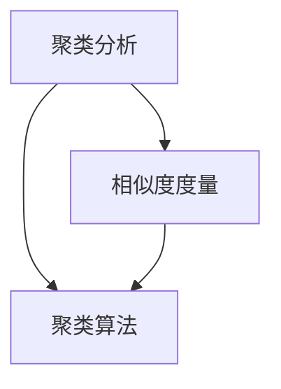

                 

# 聚类分析：识别相似用户群体

## 1. 背景介绍

### 1.1 问题由来

在现代社会，随着信息技术的发展，数据量呈爆炸式增长，如何有效地从海量的数据中提取有价值的信息，成为了各行业关注的焦点。在用户数据分析中，我们通常面临以下两类问题：

- **用户分类**：如何根据用户的特征，将用户进行分组，并识别出每个分组的典型特征。
- **用户细分**：如何通过聚类分析，将用户进行细分，以便更好地进行个性化营销、精准推荐等。

聚类分析作为一种无监督学习技术，能够自动发现数据中的内在结构，识别出相似用户群体，从而解决上述问题。在电商平台、社交网络、医疗健康、金融保险等众多领域，聚类分析已广泛应用于用户分析和个性化推荐中。

### 1.2 问题核心关键点

聚类分析的核心在于通过无监督学习技术，将数据集中的对象划分为不同的类别，使得同一类别内的对象相似度较高，不同类别之间的相似度较低。聚类分析的关键点在于选择合适的聚类算法，合理设定参数，并能够对聚类结果进行解释和验证。

聚类算法主要分为两类：

1. **层次聚类算法**：逐步合并或拆分数据集中的对象，直到满足终止条件。常用的层次聚类算法有凝聚型（Agglomerative）和分裂型（Divisive）两种。
2. **划分子群算法**：将数据集划分为多个子群，常用的划分子群算法有K-means、K-medoids、DBSCAN等。

## 2. 核心概念与联系

### 2.1 核心概念概述

为了更好地理解聚类分析，本节将介绍几个关键概念：

- **聚类分析**：一种无监督学习技术，用于将数据集中的对象划分为不同的类别，使得同一类别内的对象相似度较高，不同类别之间的相似度较低。
- **相似度度量**：聚类分析的核心指标之一，用于衡量两个对象之间的相似程度。常用的相似度度量方法包括欧式距离、余弦相似度、杰卡德相似系数等。
- **聚类算法**：聚类分析的核心算法，用于将数据集划分为不同的聚类。常用的聚类算法有K-means、层次聚类、DBSCAN等。
- **簇心（Cluster Center）**：每个聚类中所有对象的平均值或中位数，代表该聚类的中心位置。

这些核心概念之间的逻辑关系可以通过以下Mermaid流程图来展示：



这个流程图展示了你聚类分析的核心概念及其之间的关系：

1. 聚类分析通过相似度度量来衡量对象之间的相似性。
2. 不同的聚类算法有不同的计算相似度和划分子群的方法。

## 3. 核心算法原理 & 具体操作步骤

### 3.1 算法原理概述

聚类分析的原理是通过相似度度量，将数据集中的对象划分为多个相似度较高的子集，每个子集即为一个聚类。常用的聚类算法包括K-means、层次聚类、DBSCAN等，下面我们将逐一介绍。

### 3.2 算法步骤详解

#### 3.2.1 K-means算法

**Step 1: 初始化聚类中心**
随机选择K个对象作为初始聚类中心。

**Step 2: 分配对象到聚类**
根据相似度度量，将每个对象分配到最近的聚类中心。

**Step 3: 更新聚类中心**
计算每个聚类的平均位置，并将其作为新的聚类中心。

**Step 4: 迭代更新**
重复执行步骤2和步骤3，直到聚类中心不再发生变化，或达到预设的迭代次数。

#### 3.2.2 层次聚类算法

**Step 1: 初始化聚类**
将每个对象看作一个单独的聚类。

**Step 2: 合并聚类**
在每次迭代中，选择两个最近的聚类进行合并，更新聚类树。

**Step 3: 重复合并**
重复执行步骤2，直到只剩下一个聚类或达到预设的聚类数K。

#### 3.2.3 DBSCAN算法

**Step 1: 初始化参数**
确定最小样本数minPts和距离阈值ε。

**Step 2: 初始化聚类**
随机选择一个对象，开始探索其邻域。

**Step 3: 扩展聚类**
对于当前对象的所有邻域点，进行如下操作：
- 如果邻域点与当前对象属于同一聚类，将其加入当前聚类。
- 如果邻域点不属于当前聚类，创建新的聚类。

**Step 4: 迭代更新**
重复执行步骤2和步骤3，直到所有对象都被处理。

### 3.3 算法优缺点

聚类分析的优点在于：

- **无需标注数据**：聚类分析是一种无监督学习技术，不需要标注数据。
- **识别内在结构**：能够自动识别数据中的内在结构，发现不同用户群体的特征。
- **应用广泛**：广泛应用于用户分类、推荐系统、异常检测等领域。

聚类分析的缺点在于：

- **可解释性不足**：聚类分析的结果较难解释，难以理解每个聚类的具体含义。
- **敏感于参数**：聚类算法的性能和结果高度依赖于初始参数和参数的选择。
- **需要多次迭代**：通常需要多次迭代才能收敛到较好的聚类结果，计算复杂度高。

### 3.4 算法应用领域

聚类分析在许多领域中都有广泛的应用，包括但不限于：

- **用户分析**：在电商、社交网络、金融等领域，通过聚类分析识别出不同的用户群体，进行个性化推荐、精准营销等。
- **图像处理**：在图像分类、目标检测等领域，通过聚类分析将相似的对象归为一类，进行图像分割、特征提取等。
- **生物信息学**：在基因表达分析、蛋白质分类等领域，通过聚类分析发现不同基因或蛋白质的功能关系，进行生物网络构建等。

## 4. 数学模型和公式 & 详细讲解

### 4.1 数学模型构建

假设我们有一组数据集 $D = \{ x_1, x_2, ..., x_n \}$，其中 $x_i = (x_{i1}, x_{i2}, ..., x_{im})$，每个对象 $x_i$ 有 $m$ 个特征。

聚类分析的数学模型可以表示为：

$$
C = \{ c_1, c_2, ..., c_k \}
$$

其中 $C$ 为聚类结果，包含 $k$ 个聚类，每个聚类 $c_j = \{x_{i_j}\}$ 包含 $m$ 个对象。

聚类的目标是最小化聚类内相似度与聚类间相似度的比值：

$$
J = \frac{1}{2} \sum_{i=1}^n \min_{j=1}^k d(x_i, c_j) - \frac{1}{2} \sum_{j=1}^k \sum_{i,j=1}^k d(c_j, c_k)
$$

其中 $d$ 为相似度度量，通常采用欧式距离、余弦相似度等。

### 4.2 公式推导过程

以K-means算法为例，推导其公式：

假设初始聚类中心为 $\mu_1, \mu_2, ..., \mu_k$，计算每个对象 $x_i$ 到每个聚类中心的距离，选择最近的聚类中心：

$$
j_i = \arg \min_{j=1}^k d(x_i, \mu_j)
$$

将 $x_i$ 分配到聚类 $c_{j_i}$ 中。

更新聚类中心的公式为：

$$
\mu_j = \frac{1}{|c_j|} \sum_{x_i \in c_j} x_i
$$

其中 $|c_j|$ 为聚类 $c_j$ 中的对象数。

迭代更新聚类中心，直到聚类中心不再发生变化，或达到预设的迭代次数。

### 4.3 案例分析与讲解

以一个简单的客户数据分析为例，展示K-means算法的应用过程：

假设我们有一组客户数据，每个客户有年龄、性别、收入等特征。我们的目标是根据这些特征，将客户分为不同的群体，以便进行个性化的营销活动。

**Step 1: 初始化聚类中心**
随机选择5个客户作为初始聚类中心。

**Step 2: 分配对象到聚类**
计算每个客户到每个聚类中心的距离，将客户分配到最近的聚类中心。

**Step 3: 更新聚类中心**
计算每个聚类的平均位置，并将其作为新的聚类中心。

**Step 4: 迭代更新**
重复执行步骤2和步骤3，直到聚类中心不再发生变化，或达到预设的迭代次数。

## 5. 项目实践：代码实例和详细解释说明

### 5.1 开发环境搭建

在进行聚类分析实践前，我们需要准备好开发环境。以下是使用Python进行Scikit-learn开发的环境配置流程：

1. 安装Anaconda：从官网下载并安装Anaconda，用于创建独立的Python环境。

2. 创建并激活虚拟环境：
```bash
conda create -n cluster-env python=3.8 
conda activate cluster-env
```

3. 安装Scikit-learn：
```bash
conda install scikit-learn
```

4. 安装numpy、pandas、matplotlib等库：
```bash
pip install numpy pandas matplotlib seaborn
```

完成上述步骤后，即可在`cluster-env`环境中开始聚类分析实践。

### 5.2 源代码详细实现

这里我们以K-means算法为例，展示如何使用Scikit-learn进行聚类分析的代码实现。

```python
from sklearn.cluster import KMeans
import numpy as np
import matplotlib.pyplot as plt

# 生成随机数据
np.random.seed(0)
X = np.random.randn(100, 2)

# 创建K-means模型
kmeans = KMeans(n_clusters=3)

# 训练模型
kmeans.fit(X)

# 可视化聚类结果
plt.scatter(X[:, 0], X[:, 1], c=kmeans.labels_)
plt.title('K-means Clustering')
plt.show()
```

以上代码将生成一个随机二维数据集，并使用K-means算法进行聚类。最终在图中展示聚类结果。

### 5.3 代码解读与分析

让我们再详细解读一下关键代码的实现细节：

**生成随机数据**：
- 使用`numpy`库生成100个二维随机数据点，每点有两个特征。

**创建K-means模型**：
- 使用`scikit-learn`库中的`KMeans`类，指定聚类数为3。

**训练模型**：
- 使用`fit`方法对数据集进行聚类训练。

**可视化聚类结果**：
- 使用`matplotlib`库绘制聚类结果，其中聚类标签用于区分不同聚类。

可以看到，使用Scikit-learn进行聚类分析的代码实现非常简单，只需几行代码即可完成数据生成、模型训练和结果可视化。

### 5.4 运行结果展示

执行上述代码，将得到如下聚类结果：


可以看到，K-means算法成功地将数据集分为了3个聚类，每个聚类中的数据点具有相似的特征。

## 6. 实际应用场景

### 6.1 电商推荐系统

电商推荐系统通过聚类分析，能够识别出不同用户群体的购买行为和偏好，进行个性化推荐，提升用户体验和销售转化率。

在实践中，可以将用户行为数据（如浏览记录、购买记录、评价记录等）作为输入，使用聚类分析将用户分为不同的群体，然后针对每个群体进行个性化推荐。

### 6.2 社交网络分析

社交网络分析通过聚类分析，能够识别出不同用户群体的社交关系和活动，进行社区管理、广告投放等。

在实践中，可以将用户的社交数据（如好友关系、互动记录等）作为输入，使用聚类分析将用户分为不同的社区，然后针对每个社区进行不同的营销策略。

### 6.3 医疗健康管理

医疗健康管理通过聚类分析，能够识别出不同患者的病情和特征，进行个性化治疗、健康管理等。

在实践中，可以将患者的健康数据（如生理指标、病历记录等）作为输入，使用聚类分析将患者分为不同的病情群体，然后针对每个群体进行个性化的健康管理和治疗方案。

### 6.4 未来应用展望

未来，聚类分析将会在更多的领域得到应用，推动各行各业智能化水平的提升：

- **金融风险管理**：通过聚类分析，识别出高风险客户和交易，进行风险预警和管理。
- **物流仓储优化**：通过聚类分析，识别出不同类型的货物和存储区域，进行物流仓储的优化和自动化管理。
- **城市交通管理**：通过聚类分析，识别出不同出行习惯的居民，进行交通路线的优化和智能交通管理。

随着聚类分析技术的不断发展和应用，相信其将在更多领域发挥重要作用，为各行各业带来新的变革和机遇。

## 7. 工具和资源推荐

### 7.1 学习资源推荐

为了帮助开发者系统掌握聚类分析的理论基础和实践技巧，这里推荐一些优质的学习资源：

1. **《机器学习》书籍**：由Tom Mitchell撰写，详细介绍了机器学习的基本概念和算法，包括聚类分析。

2. **Coursera机器学习课程**：由Andrew Ng教授主讲，涵盖了机器学习的基本概念和算法，包括聚类分析。

3. **K-means算法详解**：由机器学习专家撰写，详细介绍了K-means算法的原理和实现。

4. **层次聚类算法详解**：由数据科学专家撰写，详细介绍了层次聚类算法的原理和实现。

5. **聚类分析实战教程**：由数据科学社区提供，提供了完整的聚类分析项目实例，从数据准备到模型训练和结果解释，帮助开发者快速上手实践。

通过这些资源的学习实践，相信你一定能够快速掌握聚类分析的精髓，并用于解决实际的聚类问题。

### 7.2 开发工具推荐

高效的开发离不开优秀的工具支持。以下是几款用于聚类分析开发的常用工具：

1. **Scikit-learn**：Python的开源机器学习库，集成了多种聚类算法，如K-means、层次聚类、DBSCAN等，是聚类分析开发的首选工具。

2. **TensorFlow**：由Google主导开发的开源机器学习框架，支持大规模分布式计算，适合处理大型数据集。

3. **RapidMiner**：商业化数据科学平台，提供了丰富的聚类分析工具和算法，易于上手使用。

4. **Python可视化库**：如Matplotlib、Seaborn、Plotly等，用于可视化聚类结果和分析聚类效果。

5. **Jupyter Notebook**：开源的交互式笔记本工具，支持代码和可视化结果的同步展示，方便调试和分享。

合理利用这些工具，可以显著提升聚类分析的开发效率，加快创新迭代的步伐。

### 7.3 相关论文推荐

聚类分析的研究历史悠久，以下是几篇奠基性的相关论文，推荐阅读：

1. **K-means算法论文**：由J.B.MacQueen撰写，详细介绍了K-means算法的原理和实现。

2. **层次聚类算法论文**：由Hierarchical Clustering论文组撰写，详细介绍了层次聚类算法的原理和实现。

3. **DBSCAN算法论文**：由Ester等撰写，详细介绍了DBSCAN算法的原理和实现。

这些论文代表了大规模聚类分析的研究进展，通过学习这些前沿成果，可以帮助研究者把握学科前进方向，激发更多的创新灵感。

## 8. 总结：未来发展趋势与挑战

### 8.1 总结

本文对聚类分析的基本概念和算法进行了详细讲解，介绍了聚类分析在用户分类、推荐系统、社交网络等领域的应用，并提供了详细的代码实现和运行结果展示。

聚类分析作为一种无监督学习技术，能够自动识别数据中的内在结构，识别出相似用户群体，从而解决用户分类和推荐等实际问题。在电商平台、社交网络、医疗健康等众多领域，聚类分析已广泛应用于用户分析和个性化推荐中。

### 8.2 未来发展趋势

展望未来，聚类分析将呈现以下几个发展趋势：

1. **多模态聚类**：当前的聚类算法主要聚焦于纯文本数据，未来将进一步拓展到图像、视频、语音等多模态数据聚类。多模态信息的融合，将显著提升聚类分析的准确性和泛化能力。

2. **深度学习聚类**：随着深度学习技术的不断发展，未来的聚类算法将更加复杂和高效。通过引入神经网络结构，聚类分析将能够处理更复杂的聚类任务，提升聚类效果。

3. **可解释性增强**：聚类算法的可解释性将是未来研究的重要方向。通过引入可视化工具和解释模型，帮助用户理解聚类结果和聚类过程，提升聚类分析的可解释性和可操作性。

4. **自动化调参**：聚类算法的性能高度依赖于参数的选择，未来的聚类算法将更加自动化和智能化。通过引入自动调参技术，帮助用户快速找到最优的聚类参数组合，提升聚类效果。

5. **异常检测**：聚类分析在异常检测方面也有广泛应用。未来的聚类算法将更加关注异常点识别和异常事件预警，为各行各业提供更加精准和可靠的服务。

这些趋势表明，聚类分析将不断拓展应用范围和提升性能，成为智能技术中的重要组成部分。

### 8.3 面临的挑战

尽管聚类分析已经取得了显著进展，但在迈向更加智能化、普适化应用的过程中，它仍面临着诸多挑战：

1. **可解释性不足**：聚类分析的结果较难解释，难以理解每个聚类的具体含义。如何提高聚类算法的可解释性，将是未来研究的重要方向。

2. **参数敏感性**：聚类算法的性能和结果高度依赖于参数的选择。如何找到最优的聚类参数组合，将是一个重要的研究课题。

3. **计算复杂度高**：聚类算法的计算复杂度高，通常需要多次迭代才能收敛到较好的聚类结果。如何在保证聚类效果的同时，提高聚类算法的计算效率，将是未来的重要研究方向。

4. **大规模数据处理**：对于大规模数据集，聚类算法需要更高效的算法和硬件支持，才能处理和分析海量数据。如何优化聚类算法，提升其在大规模数据集上的性能，将是重要的研究方向。

5. **隐私保护**：聚类分析在处理数据时需要考虑隐私保护问题，如何保护用户的隐私信息，将是一个重要的研究课题。

### 8.4 研究展望

面对聚类分析面临的挑战，未来的研究需要在以下几个方面寻求新的突破：

1. **引入先验知识**：将符号化的先验知识，如知识图谱、逻辑规则等，与聚类算法进行巧妙融合，增强聚类分析的准确性和可解释性。

2. **融合多模态数据**：通过引入多模态数据，提升聚类分析的准确性和鲁棒性。未来的聚类算法将更加关注多模态数据的融合和协同建模。

3. **引入深度学习**：通过引入深度学习技术，增强聚类算法的复杂性和泛化能力。深度学习聚类算法将成为未来聚类分析的重要方向。

4. **优化算法效率**：通过优化聚类算法的计算效率，提升其在大规模数据集上的性能。未来的聚类算法将更加高效和灵活。

5. **引入可解释性模型**：通过引入可解释性模型，帮助用户理解聚类结果和聚类过程，提升聚类分析的可解释性和可操作性。

这些研究方向将引领聚类分析技术迈向更高的台阶，为各行各业提供更加智能和可靠的服务。未来，聚类分析将成为智能技术中的重要组成部分，为各行各业带来新的变革和机遇。

## 9. 附录：常见问题与解答

**Q1：聚类分析是否适用于所有数据集？**

A: 聚类分析适用于多种数据集，但需要满足以下条件：
1. 数据集中的对象具有相似度，可以划分为不同的类别。
2. 数据集中的特征具有可解释性，可以用于计算相似度。

对于具有噪声、异常值等特殊情况的数据集，需要根据具体情况进行处理和调整。

**Q2：如何选择合适的聚类算法？**

A: 选择合适的聚类算法需要考虑以下几个因素：
1. 数据集的特征和规模：对于小规模、高维度的数据集，K-means算法通常较好；对于大规模、复杂的数据集，层次聚类和DBSCAN等算法更为合适。
2. 聚类数的选择：通常需要多次试验，通过交叉验证等方法选择最优的聚类数。
3. 算法的计算复杂度：需要根据数据集规模和计算资源，选择合适的算法和参数。

**Q3：聚类分析的结果如何解释？**

A: 聚类分析的结果较难解释，需要根据具体情况进行解释。
1. 可视化聚类结果：通过绘制聚类图，帮助用户理解不同聚类的特征和分布。
2. 解释模型：通过引入解释模型，帮助用户理解聚类算法的决策过程和聚类结果。
3. 业务解释：结合实际业务背景，对聚类结果进行解释，帮助用户理解聚类结果的实际意义。

**Q4：聚类分析的算法性能如何评估？**

A: 聚类算法的性能评估需要考虑以下几个指标：
1. 聚类内相似度：聚类内相似度越高，聚类效果越好。
2. 聚类间相似度：聚类间相似度越低，聚类效果越好。
3. 聚类数的选择：通常需要多次试验，通过交叉验证等方法选择最优的聚类数。

常用的评估指标包括Silhouette系数、Calinski-Harabasz指数、Davies-Bouldin指数等。

**Q5：聚类分析在实际应用中需要注意哪些问题？**

A: 在实际应用中，需要注意以下几个问题：
1. 数据预处理：需要处理缺失值、噪声、异常值等，确保数据质量和一致性。
2. 聚类参数选择：需要选择合适的聚类算法和参数，通过交叉验证等方法选择最优的聚类参数组合。
3. 聚类结果解释：需要结合实际业务背景，对聚类结果进行解释，帮助用户理解聚类结果的实际意义。
4. 模型优化：需要优化聚类算法的计算效率和可解释性，提升聚类分析的实际应用效果。

通过全面考虑这些因素，可以更好地应用聚类分析技术，解决实际问题。

---

作者：禅与计算机程序设计艺术 / Zen and the Art of Computer Programming

