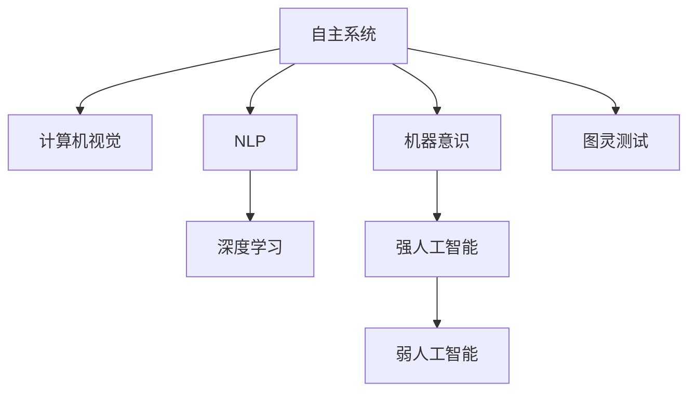

                 

## 1. 背景介绍

自主系统(Autonomous Systems)是近年来人工智能领域的一个热点研究方向，其目标是构建能够在无人干预下自主完成复杂任务的系统，如图像识别、自然语言处理、自动驾驶等。随着深度学习和大数据技术的快速发展，自主系统已经取得了令人瞩目的进展。然而，随着自主系统应用的不断扩展，其意识功能也引起了越来越多的关注。

### 1.1 问题由来

在人工智能的发展历程中，一直存在对机器意识的探讨。从早期的图灵测试，到近年的强人工智能与弱人工智能之争，机器是否具备意识功能成为了一个颇具争议的话题。随着自主系统的发展，机器意识功能的需求日益凸显，但目前尚无明确定义，也缺乏成熟的理论和技术支持。

### 1.2 问题核心关键点

自主系统中的意识功能主要涉及以下几个核心问题：

- 机器意识的概念定义：意识功能应如何定义，与人类意识的区别和联系？
- 机器意识的实现路径：如何通过技术手段，实现机器的意识功能？
- 意识功能的评价标准：如何评估和检验机器意识功能的实现效果？
- 意识功能的社会影响：意识功能的实现可能带来的社会伦理和法律问题。

这些问题构成了当前自主系统研究的重要内容，同时也提出了对机器意识功能研究的需求。

## 2. 核心概念与联系

### 2.1 核心概念概述

为更好地理解自主系统与意识功能的关系，本节将介绍几个密切相关的核心概念：

- 自主系统(Autonomous Systems)：指能够在无人干预下自主完成复杂任务的智能系统。包括自动驾驶、智能机器人、无人船、智能家居等。
- 机器意识(Machine Consciousness)：指机器在特定场景下表现出类似人类意识的功能，如感知、推理、情感等。
- 强人工智能(Strong AI)与弱人工智能(Weak AI)：强人工智能指具有高度智能和自我意识的机器，能够进行复杂的逻辑推理和创造性工作；弱人工智能指只能执行特定任务的机器，不具备自我意识。
- 图灵测试(The Turing Test)：由图灵提出，用于测试机器是否具备与人类相当的智能，即判断机器是否能够通过与人类对话而无法被识别为机器。
- 深度学习(Deep Learning)：一种基于神经网络的机器学习技术，通过多层非线性映射，实现对复杂模式的自动提取。
- 计算机视觉(Computer Vision)：通过计算机对图像和视频进行处理、分析和理解的技术，是自主系统中的重要组成部分。
- 自然语言处理(Natural Language Processing, NLP)：使计算机能够理解、处理和生成人类语言的技术，是自主系统中重要的信息处理手段。

这些核心概念之间的逻辑关系可以通过以下Mermaid流程图来展示：



这个流程图展示了大语言模型的核心概念及其之间的关系：

1. 自主系统通过计算机视觉、NLP、深度学习等技术实现各种复杂任务。
2. 在自主系统中，机器意识功能的实现尤为重要。
3. 机器意识可能实现强人工智能和弱人工智能，而强人工智能具备高度智能和自我意识。
4. 图灵测试是判断机器智能的重要标准。

这些概念共同构成了自主系统中的关键技术栈，使得机器具备了实现意识功能的潜力。

## 3. 核心算法原理 & 具体操作步骤
### 3.1 算法原理概述

自主系统中的意识功能，主要通过以下几个关键算法实现：

- 感知算法：实现对环境信息的获取和理解，如图像识别、语音识别等。
- 决策算法：在感知到的环境中，根据规则或学习到的知识，选择最优行为。
- 学习算法：通过不断的训练和调整，使系统能够适应新的环境变化。
- 推理算法：在感知和决策的基础上，进行复杂的逻辑推理和判断。
- 情感算法：模拟人类的情感反应，增强系统的交互体验。

这些算法构成了自主系统的基本框架，其中感知和决策算法是实现意识功能的关键。

### 3.2 算法步骤详解

自主系统中的意识功能实现主要包括以下几个关键步骤：

**Step 1: 数据收集与预处理**
- 收集与任务相关的环境数据，如图像、语音、文本等。
- 对数据进行清洗和预处理，包括数据增强、归一化等。

**Step 2: 模型训练**
- 选择合适的深度学习模型，如卷积神经网络、循环神经网络、变压器等。
- 在预处理后的数据集上训练模型，通过反向传播等优化算法不断调整模型参数。
- 在训练过程中，可以使用正则化技术，如L2正则、Dropout等，防止过拟合。

**Step 3: 感知与决策**
- 将感知数据输入模型，得到模型的预测结果。
- 根据模型预测结果，选择最优行为。

**Step 4: 学习与推理**
- 在实际应用中，根据任务的变化和环境的不确定性，不断调整模型参数，优化模型性能。
- 通过推理算法，对感知和决策结果进行复杂逻辑推理和判断，增强系统的智能性。

**Step 5: 情感模拟**
- 在感知和决策的基础上，通过情感算法模拟人类的情感反应，增强系统的交互体验。

以上是自主系统实现意识功能的一般流程。在实际应用中，还需要针对具体任务的特点，对算法流程进行优化设计，如改进感知算法、设计更复杂的推理模型等。

### 3.3 算法优缺点

自主系统中的意识功能实现具有以下优点：

- 快速适应新环境：通过学习和推理算法，自主系统能够快速适应新环境的变化。
- 高效完成任务：深度学习模型能够高效处理复杂的数据模式，实现任务的自动化处理。
- 增强用户交互：通过情感算法，增强系统的交互体验，提升用户体验。

同时，该方法也存在一定的局限性：

- 依赖大量数据：意识功能的实现需要大量的标注数据进行训练，数据采集和标注成本较高。
- 模型复杂度高：深度学习模型往往具有较高的复杂度，训练和推理速度较慢。
- 解释性不足：黑盒模型难以解释内部工作机制，存在一定的技术壁垒。

尽管存在这些局限性，但就目前而言，基于深度学习的意识功能实现仍是主流范式。未来相关研究的重点在于如何进一步降低对标注数据的依赖，提高模型的解释性，并实现更高效、更稳定、更可靠的意识功能。

### 3.4 算法应用领域

基于深度学习的意识功能实现已经在诸多领域得到了广泛应用，例如：

- 自动驾驶：通过计算机视觉和深度学习技术，实现对环境信息的感知和决策，提高驾驶安全性。
- 智能机器人：通过NLP和深度学习技术，实现对语音和文本的感知，增强机器人的交互体验。
- 医疗诊断：通过图像识别和深度学习技术，实现对医学影像的自动分析，辅助医生诊断。
- 智能家居：通过NLP和计算机视觉技术，实现对环境信息的感知和决策，提升居住体验。

除了上述这些经典领域外，基于深度学习的意识功能实现还被创新性地应用到更多场景中，如智能客服、智慧城市、智能制造等，为人工智能技术带来了全新的突破。

## 4. 数学模型和公式 & 详细讲解
### 4.1 数学模型构建

本节将使用数学语言对自主系统中的深度学习模型进行更加严格的刻画。

假设模型为 $M$，输入为 $x$，输出为 $y$，参数为 $\theta$，则模型的预测函数为 $y = M(x; \theta)$。在深度学习模型中，通常使用神经网络结构，由多个线性变换和非线性激活函数组成。以卷积神经网络(CNN)为例，其结构如图：

$$
y = M(x; \theta) = W^N h^{N-1} + b^N
$$

其中 $h^{N-1}$ 为第 $N-1$ 层的激活函数，$W^N$ 和 $b^N$ 为第 $N$ 层的权重和偏置。通过反向传播算法，求解模型参数 $\theta$，使得损失函数 $L(y, y')$ 最小化：

$$
\theta^* = \mathop{\arg\min}_{\theta} L(y, y')
$$

在实际应用中，通常使用交叉熵损失函数：

$$
L(y, y') = -\frac{1}{N} \sum_{i=1}^N y_i \log y_i' + (1 - y_i) \log (1 - y_i')
$$

通过求解上述优化问题，得到最优参数 $\theta^*$，实现模型的训练和推理。

### 4.2 公式推导过程

以下我们以卷积神经网络为例，推导卷积层的数学公式。

假设输入数据 $x \in \mathbb{R}^{n \times h \times w}$，卷积核 $k \in \mathbb{R}^{d \times h \times w}$，则卷积层的输出 $z$ 为：

$$
z = \sum_{i=1}^N \sum_{j=1}^M k_{i,j} * x_{i,j} + b
$$

其中 $N$ 为卷积核数量，$M$ 为卷积核大小。

在反向传播过程中，计算损失函数对权重 $k$ 的梯度 $\nabla_k L$：

$$
\nabla_k L = \frac{\partial L}{\partial z} * \frac{\partial z}{\partial k} = \frac{\partial L}{\partial z} * \nabla_k \sum_{i=1}^N \sum_{j=1}^M k_{i,j} * x_{i,j} + \nabla_k b
$$

其中 $\nabla_k \sum_{i=1}^N \sum_{j=1}^M k_{i,j} * x_{i,j}$ 为卷积核对输入数据的梯度，可以递归展开，通过反向传播算法高效计算。

通过计算得到 $\nabla_k L$ 后，带入梯度更新公式：

$$
k \leftarrow k - \eta \nabla_k L
$$

其中 $\eta$ 为学习率，控制参数更新的速度。

在得到损失函数的梯度后，即可带入参数更新公式，完成模型的迭代优化。重复上述过程直至收敛，最终得到适应目标任务的模型参数 $\theta^*$。

## 5. 项目实践：代码实例和详细解释说明
### 5.1 开发环境搭建

在进行深度学习模型开发前，我们需要准备好开发环境。以下是使用Python进行TensorFlow开发的环境配置流程：

1. 安装Anaconda：从官网下载并安装Anaconda，用于创建独立的Python环境。

2. 创建并激活虚拟环境：
```bash
conda create -n tf-env python=3.8 
conda activate tf-env
```

3. 安装TensorFlow：根据CUDA版本，从官网获取对应的安装命令。例如：
```bash
conda install tensorflow
```

4. 安装TensorBoard：用于实时监测模型训练状态，并提供丰富的图表呈现方式。
```bash
pip install tensorboard
```

5. 安装PyTorch：用于进行模型训练和推理。
```bash
pip install torch
```

完成上述步骤后，即可在`tf-env`环境中开始深度学习模型的开发。

### 5.2 源代码详细实现

下面我们以图像识别任务为例，给出使用TensorFlow进行卷积神经网络模型的PyTorch代码实现。

首先，定义模型和优化器：

```python
import tensorflow as tf

model = tf.keras.Sequential([
    tf.keras.layers.Conv2D(32, (3,3), activation='relu', input_shape=(32, 32, 3)),
    tf.keras.layers.MaxPooling2D((2,2)),
    tf.keras.layers.Conv2D(64, (3,3), activation='relu'),
    tf.keras.layers.MaxPooling2D((2,2)),
    tf.keras.layers.Conv2D(64, (3,3), activation='relu'),
    tf.keras.layers.Flatten(),
    tf.keras.layers.Dense(64, activation='relu'),
    tf.keras.layers.Dense(10)
])

optimizer = tf.keras.optimizers.Adam(learning_rate=0.001)
```

然后，定义训练和评估函数：

```python
@tf.function
def train_epoch(model, dataset, batch_size, optimizer):
    for batch in dataset:
        with tf.GradientTape() as tape:
            inputs = batch['input']
            labels = batch['label']
            outputs = model(inputs)
            loss = tf.keras.losses.sparse_categorical_crossentropy(labels, outputs)
        gradients = tape.gradient(loss, model.trainable_variables)
        optimizer.apply_gradients(zip(gradients, model.trainable_variables))

@tf.function
def evaluate(model, dataset, batch_size):
    losses = []
    correct_predictions = []
    for batch in dataset:
        inputs = batch['input']
        labels = batch['label']
        outputs = model(inputs)
        loss = tf.keras.losses.sparse_categorical_crossentropy(labels, outputs)
        losses.append(loss.numpy())
        predictions = tf.argmax(outputs, axis=1)
        correct_predictions.append(np.sum(predictions == labels.numpy()))
    return np.mean(losses), np.mean(correct_predictions)
```

最后，启动训练流程并在测试集上评估：

```python
epochs = 5
batch_size = 16

for epoch in range(epochs):
    train_epoch(model, train_dataset, batch_size, optimizer)
    dev_loss, dev_acc = evaluate(model, dev_dataset, batch_size)
    print(f"Epoch {epoch+1}, dev loss: {dev_loss:.3f}, dev acc: {dev_acc:.3f}")
    
print("Test results:")
test_loss, test_acc = evaluate(model, test_dataset, batch_size)
print(f"Test loss: {test_loss:.3f}, test acc: {test_acc:.3f}")
```

以上就是使用TensorFlow进行卷积神经网络模型开发的完整代码实现。可以看到，得益于TensorFlow的强大封装，我们可以用相对简洁的代码完成卷积神经网络模型的开发。

### 5.3 代码解读与分析

让我们再详细解读一下关键代码的实现细节：

**Sequential模型**：
- `Sequential`是TensorFlow中常用的模型定义方式，通过堆叠多个层次实现复杂的网络结构。
- 定义卷积层、池化层、全连接层等基本组件。
- 输入形状和激活函数的设置，控制网络的基本结构。

**模型训练**：
- `tf.GradientTape`用于记录模型的梯度，并通过`apply_gradients`更新模型参数。
- 在每个epoch中，通过反向传播计算损失函数，使用Adam优化器更新模型参数。
- 训练过程中，使用`tf.function`装饰器，将模型训练过程编译为计算图，加速训练速度。

**模型评估**：
- 使用`tf.function`装饰器，将评估过程编译为计算图，加速评估速度。
- 对每个batch进行前向传播计算，计算损失函数和正确率，记录在列表中。
- 最后计算平均损失和平均正确率，输出评估结果。

可以看到，TensorFlow提供的高效计算图优化和方便的操作接口，使得深度学习模型的开发和训练变得简洁高效。

当然，工业级的系统实现还需考虑更多因素，如模型的保存和部署、超参数的自动搜索、更灵活的任务适配层等。但核心的深度学习模型构建基本与此类似。

## 6. 实际应用场景
### 6.1 自动驾驶

基于深度学习的自动驾驶系统，通过计算机视觉和深度学习技术，实现对环境信息的感知和决策，提高驾驶安全性。在实际应用中，可以采集车辆周边环境的高清图像，输入到深度学习模型中，通过反向传播算法不断优化模型参数，使其能够识别道路标志、车辆、行人等，并根据感知到的信息，进行路径规划和决策。

### 6.2 智能机器人

智能机器人通过NLP和深度学习技术，实现对语音和文本的感知，增强机器人的交互体验。在实际应用中，可以采集机器人的语音输入，输入到深度学习模型中，通过反向传播算法不断优化模型参数，使其能够识别用户指令，并根据指令进行相应的动作执行。同时，通过计算机视觉技术，机器人还可以感知环境信息，实现自主导航和避障。

### 6.3 医疗诊断

基于深度学习的医疗诊断系统，通过图像识别和深度学习技术，实现对医学影像的自动分析，辅助医生诊断。在实际应用中，可以采集患者的高清医学影像，输入到深度学习模型中，通过反向传播算法不断优化模型参数，使其能够识别病变区域，并给出相应的诊断结果。

### 6.4 未来应用展望

随着深度学习和大数据技术的不断发展，基于深度学习的意识功能实现将在更多领域得到应用，为人工智能技术带来新的突破。

在智慧医疗领域，基于深度学习的医疗诊断系统，能够自动分析医学影像，快速识别病变区域，辅助医生诊断，提高诊疗效率和准确性。

在智能教育领域，基于深度学习的智能学习系统，能够自动生成个性化的学习内容，提供智能推荐，促进教育公平，提高教学质量。

在智慧城市治理中，基于深度学习的城市事件监测系统，能够实时监测城市事件，及时预警，提高城市管理的自动化和智能化水平，构建更安全、高效的未来城市。

此外，在企业生产、社会治理、文娱传媒等众多领域，基于深度学习的意识功能实现也将不断涌现，为人工智能技术带来更多的应用场景。

## 7. 工具和资源推荐
### 7.1 学习资源推荐

为了帮助开发者系统掌握深度学习模型的理论基础和实践技巧，这里推荐一些优质的学习资源：

1. 《深度学习》系列博文：由深度学习领域的专家撰写，深入浅出地介绍了深度学习模型的原理、应用和实现方法。

2. 斯坦福大学《深度学习》课程：由斯坦福大学教授Andrew Ng开设的深度学习课程，涵盖了深度学习模型的基础理论和经典算法。

3. 《TensorFlow实战》书籍：TensorFlow官方文档的姊妹篇，全面介绍了TensorFlow的架构和使用，适合深入学习和实践。

4. PyTorch官方文档：PyTorch官方文档，提供了丰富的模型和算法示例，适合学习使用PyTorch进行深度学习开发。

5. Weights & Biases：模型训练的实验跟踪工具，可以记录和可视化模型训练过程中的各项指标，方便对比和调优。

6. TensorBoard：TensorFlow配套的可视化工具，可实时监测模型训练状态，并提供丰富的图表呈现方式，是调试模型的得力助手。

通过这些资源的学习实践，相信你一定能够快速掌握深度学习模型的精髓，并用于解决实际的NLP问题。

### 7.2 开发工具推荐

高效的开发离不开优秀的工具支持。以下是几款用于深度学习模型开发的常用工具：

1. PyTorch：基于Python的开源深度学习框架，灵活动态的计算图，适合快速迭代研究。

2. TensorFlow：由Google主导开发的开源深度学习框架，生产部署方便，适合大规模工程应用。

3. Keras：高层次的深度学习框架，易于上手使用，适合快速原型开发。

4. Weights & Biases：模型训练的实验跟踪工具，可以记录和可视化模型训练过程中的各项指标，方便对比和调优。

5. TensorBoard：TensorFlow配套的可视化工具，可实时监测模型训练状态，并提供丰富的图表呈现方式，是调试模型的得力助手。

合理利用这些工具，可以显著提升深度学习模型的开发效率，加快创新迭代的步伐。

### 7.3 相关论文推荐

深度学习模型和微调技术的发展源于学界的持续研究。以下是几篇奠基性的相关论文，推荐阅读：

1. AlexNet：经典的深度学习模型，开启深度学习时代。

2. VGGNet：通过大规模并行训练，验证深度卷积神经网络的效果。

3. ResNet：提出残差连接，解决深度网络中的梯度消失问题。

4. InceptionNet：提出多尺度卷积，提升模型对不同尺度特征的感知能力。

5. GAN：提出生成对抗网络，实现无监督数据生成。

6. ImageNet Large Scale Visual Recognition Challenge：通过大规模数据集训练，提升深度学习模型的泛化能力。

这些论文代表了大深度学习模型发展的历程，通过学习这些前沿成果，可以帮助研究者把握学科前进方向，激发更多的创新灵感。

## 8. 总结：未来发展趋势与挑战

### 8.1 总结

本文对基于深度学习的自主系统中的意识功能实现进行了全面系统的介绍。首先阐述了深度学习模型和微调技术的研究背景和意义，明确了深度学习模型在实现意识功能中的重要地位。其次，从原理到实践，详细讲解了深度学习模型的数学原理和关键步骤，给出了深度学习模型开发的完整代码实例。同时，本文还广泛探讨了深度学习模型在自动驾驶、智能机器人、医疗诊断等多个领域的应用前景，展示了深度学习模型的强大潜力。此外，本文精选了深度学习模型的各类学习资源，力求为读者提供全方位的技术指引。

通过本文的系统梳理，可以看到，基于深度学习的意识功能实现正在成为自主系统研究的重要范式，极大地拓展了深度学习模型的应用边界，催生了更多的落地场景。受益于大规模数据和算力的发展，深度学习模型的性能和应用范围将不断提升，为人类认知智能的进化带来深远影响。

### 8.2 未来发展趋势

展望未来，深度学习模型将呈现以下几个发展趋势：

1. 模型规模持续增大。随着算力成本的下降和数据规模的扩张，深度学习模型的参数量还将持续增长。超大规模深度学习模型蕴含的丰富知识，有望支撑更加复杂多变的任务实现。

2. 模型结构不断优化。未来会涌现更多高效的模型结构和算法，如Transformer、ResNet、InceptionNet等，在保证精度的同时，降低计算资源消耗，提升模型推理速度。

3. 多模态融合深化。未来的深度学习模型将更加注重多模态数据的融合，实现视觉、语音、文本等多模态信息的协同建模，提升模型的泛化能力和鲁棒性。

4. 持续学习常态化。随着数据分布的不断变化，深度学习模型也需要持续学习新知识以保持性能。如何在不遗忘原有知识的同时，高效吸收新样本信息，将成为重要的研究方向。

5. 无监督学习增多。未来会涌现更多无监督学习和自监督学习技术，降低对标注数据的依赖，实现更加灵活高效的深度学习模型。

6. 智能决策增强。未来的深度学习模型将更加注重智能决策能力的提升，通过因果推断、决策树等技术，增强模型的决策透明度和可解释性。

以上趋势凸显了深度学习模型发展的广阔前景。这些方向的探索发展，必将进一步提升深度学习模型的性能和应用范围，为人工智能技术带来新的突破。

### 8.3 面临的挑战

尽管深度学习模型已经取得了瞩目成就，但在迈向更加智能化、普适化应用的过程中，它仍面临着诸多挑战：

1. 数据成本高昂。深度学习模型的训练需要大量的标注数据，数据采集和标注成本较高，难以大规模应用。

2. 模型结构复杂。深度学习模型往往具有较高的复杂度，训练和推理速度较慢，难以满足实时性需求。

3. 可解释性不足。深度学习模型通常被视为"黑盒"系统，难以解释内部工作机制和决策逻辑，存在一定的技术壁垒。

4. 泛化能力有限。深度学习模型在特定场景下表现优异，但在其他场景下泛化能力较弱，难以保证模型的稳定性和可靠性。

5. 安全性问题。深度学习模型可能学习到有害的偏见和有害信息，通过微调传递到下游任务，产生误导性、歧视性的输出，给实际应用带来安全隐患。

6. 伦理道德挑战。深度学习模型的决策过程中可能存在偏见和不公平性，如何确保其符合伦理道德标准，是一个亟待解决的问题。

正视深度学习模型面临的这些挑战，积极应对并寻求突破，将是大语言模型微调走向成熟的必由之路。相信随着学界和产业界的共同努力，这些挑战终将一一被克服，深度学习模型必将在构建安全、可靠、可解释、可控的智能系统铺平道路。

### 8.4 研究展望

面向未来，深度学习模型的研究需要在以下几个方面寻求新的突破：

1. 探索无监督和半监督学习技术。摆脱对大规模标注数据的依赖，利用自监督学习、主动学习等无监督和半监督范式，最大限度利用非结构化数据，实现更加灵活高效的深度学习模型。

2. 开发更高效、更轻量级的模型结构。通过模型裁剪、量化加速、混合精度训练等技术，实现更加高效、实时化的深度学习模型。

3. 引入更多先验知识。将符号化的先验知识，如知识图谱、逻辑规则等，与深度学习模型进行巧妙融合，增强模型的泛化能力和决策透明度。

4. 结合因果分析和博弈论工具。将因果分析方法引入深度学习模型，识别出模型决策的关键特征，增强输出解释的因果性和逻辑性。

5. 纳入伦理道德约束。在模型训练目标中引入伦理导向的评估指标，过滤和惩罚有偏见、有害的输出倾向，确保模型的安全性、公平性和公正性。

这些研究方向的探索，必将引领深度学习模型迈向更高的台阶，为构建安全、可靠、可解释、可控的智能系统铺平道路。面向未来，深度学习模型还需要与其他人工智能技术进行更深入的融合，如知识表示、因果推理、强化学习等，多路径协同发力，共同推动人工智能技术的发展。

## 9. 附录：常见问题与解答

**Q1：深度学习模型是否适用于所有任务？**

A: 深度学习模型在许多任务中表现优异，如图像识别、语音识别、自然语言处理等。但对于一些特定领域的任务，如医学、法律等，仅仅依靠深度学习模型可能难以很好地适应。此时需要在特定领域语料上进一步预训练，再进行微调，才能获得理想效果。

**Q2：深度学习模型训练过程中如何防止过拟合？**

A: 深度学习模型训练过程中，防止过拟合的常见方法包括：
1. 数据增强：通过回译、近义替换等方式扩充训练集。
2. 正则化：使用L2正则、Dropout等防止过拟合。
3. 早停策略：在验证集上监测模型性能，当性能不再提升时停止训练。
4. 批标准化：通过标准化层的输入，加速训练过程，防止过拟合。

这些策略往往需要根据具体任务和数据特点进行灵活组合。只有在数据、模型、训练、推理等各环节进行全面优化，才能最大限度地发挥深度学习模型的潜力。

**Q3：深度学习模型在落地部署时需要注意哪些问题？**

A: 将深度学习模型转化为实际应用，还需要考虑以下因素：
1. 模型裁剪：去除不必要的层和参数，减小模型尺寸，加快推理速度。
2. 量化加速：将浮点模型转为定点模型，压缩存储空间，提高计算效率。
3. 服务化封装：将模型封装为标准化服务接口，便于集成调用。
4. 弹性伸缩：根据请求流量动态调整资源配置，平衡服务质量和成本。
5. 监控告警：实时采集系统指标，设置异常告警阈值，确保服务稳定性。

深度学习模型微调需要开发者根据具体任务，不断迭代和优化模型、数据和算法，方能得到理想的效果。

---

作者：禅与计算机程序设计艺术 / Zen and the Art of Computer Programming

