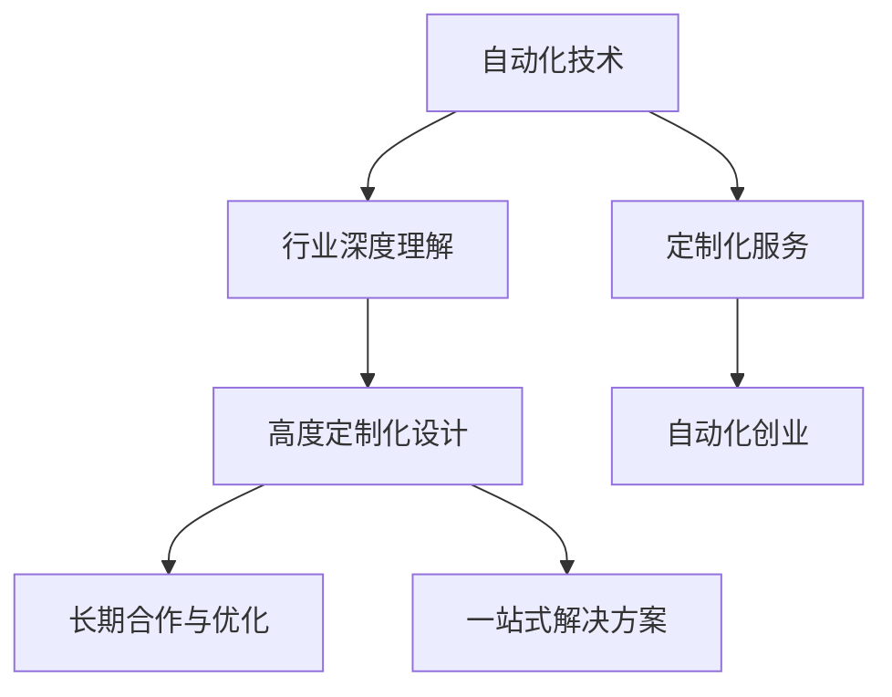

                 

# 自动化创业中的定制化服务模式

在数字化转型浪潮的驱动下，自动化创业成为越来越多企业青睐的发展方向。从智能客服到智能运维，从智能生产到智能仓储，自动化技术正广泛应用于各个行业，提升生产效率，降低运营成本。然而，在自动化创业的道路上，不同行业的痛点和需求各异，一招鲜未必走遍天下。因此，定制化服务模式应运而生，通过深度结合特定行业需求，提供量身定做的自动化解决方案，帮助企业突破瓶颈，实现业务升级。本文将系统地介绍自动化创业中的定制化服务模式，探讨其原理、流程、应用案例及未来发展趋势，希望能为有意从事自动化创业的朋友们提供有益的参考。

## 1. 背景介绍

### 1.1 问题由来

自动化技术的发展已经历了几十年的历史，从早期的工业自动化到今天的人工智能与机器学习，每一次技术的进步都极大地提升了生产效率和运营管理水平。然而，随着自动化技术的普及，其应用场景也变得越来越复杂多样。企业需求的具体化和个性化趋势日益明显，单一的自动化技术方案已经无法满足多元化、深度化的需求，需要通过定制化服务模式来提升其适应性和竞争力。

### 1.2 问题核心关键点

自动化创业中的定制化服务模式是指基于特定行业和业务需求，通过定制化设计和开发自动化解决方案，提供专业化和差异化服务的一种商业模式。其主要目标是通过深度结合行业特性和业务痛点，提供具有高度针对性和实际应用价值的自动化系统。其核心在于以下几个关键点：

- **行业深度理解**：深入了解目标行业的业务流程和运营模式，精准把握其核心需求和痛点。
- **高度定制化设计**：根据行业需求和业务特点，进行针对性设计和优化，定制满足行业需求的自动化系统。
- **长期合作与优化**：建立长期合作关系，持续优化和改进自动化解决方案，确保其与业务发展同步升级。
- **一站式解决方案**：提供从需求分析、系统设计、开发部署、运维支持等全流程服务，形成一站式自动化解决方案。

## 2. 核心概念与联系

### 2.1 核心概念概述

为更好地理解自动化创业中的定制化服务模式，本节将介绍几个关键概念及其联系：

- **自动化技术**：指通过机器人、智能设备、软件系统等工具，实现生产过程、管理流程或服务流程的自动化。自动化技术涵盖工业自动化、流程自动化、办公自动化等多个领域，是提升企业生产效率和管理水平的重要手段。

- **定制化服务**：针对特定客户或行业需求，量身定做并提供特定解决方案的服务模式。定制化服务强调服务的专业性和独特性，能更好地满足客户的个性化需求。

- **自动化创业**：指通过提供自动化技术和解决方案，解决企业运营管理的痛点，实现企业数字化转型的商业模式。自动化创业包括企业内生的自动化项目，以及面向市场提供自动化解决方案的外部创业。

- **行业深度理解**：指深入了解目标行业的业务流程、技术特点和需求痛点，构建具有行业特征的自动化解决方案。行业深度理解是定制化服务模式的基础。

- **高度定制化设计**：指根据特定行业需求和业务特点，进行个性化、差异化的设计，定制满足行业需求的自动化系统。高度定制化设计是实现行业深度理解的有效手段。

- **长期合作与优化**：指建立与客户的长期合作关系，持续优化和改进自动化解决方案，确保其与企业业务发展同步升级。长期合作与优化是定制化服务模式的保障。

- **一站式解决方案**：指提供从需求分析、系统设计、开发部署、运维支持等全流程服务，形成完整、高效的自动化解决方案。一站式解决方案是定制化服务模式的核心。

这些概念之间的逻辑关系可以通过以下Mermaid流程图来展示：



这个流程图展示了自动化创业中定制化服务模式的各个环节及其联系：

1. 自动化技术是基础，行业深度理解是定制化服务的前提。
2. 高度定制化设计是行业深度理解的体现，也是实现行业深度理解的手段。
3. 长期合作与优化是定制化服务模式的保障，确保自动化解决方案与业务同步升级。
4. 一站式解决方案是定制化服务模式的核心，提供全流程的服务和支持。

## 3. 核心算法原理 & 具体操作步骤

### 3.1 算法原理概述

自动化创业中的定制化服务模式，本质上是一种将自动化技术与特定行业需求相结合的算法应用。其核心在于深度理解行业特性，通过定制化设计，提供能够适应行业需求的自动化解决方案。

形式化地，假设自动化创业的行业特性为 $S$，自动化技术为 $A$，客户需求为 $D$，则定制化服务 $F$ 可以表示为：

$$
F = A(S) \wedge D
$$

其中，$A(S)$ 表示根据行业特性 $S$ 对自动化技术 $A$ 进行定制化设计，$D$ 表示与客户需求 $D$ 进行匹配，确保解决方案的实际应用价值。

### 3.2 算法步骤详解

基于定制化服务模式，自动化创业的实施步骤包括以下几个关键环节：

**Step 1: 行业特性分析**
- 深入了解目标行业的业务流程、技术特点和需求痛点，构建行业特性模型 $S$。
- 识别行业中的核心场景和典型业务流程，确定自动化技术介入的关键点。
- 对行业特性进行分析，找出潜在的需求和问题。

**Step 2: 自动化技术适配**
- 根据行业特性模型 $S$，选择合适的自动化技术 $A$。
- 对自动化技术进行定制化设计，使其能够适应行业特性。
- 设计并实现定制化的自动化系统。

**Step 3: 客户需求匹配**
- 与客户进行需求分析，确定其核心需求和痛点。
- 根据客户需求 $D$，对定制化的自动化系统进行适配和优化。
- 提供定制化的自动化解决方案。

**Step 4: 系统部署与优化**
- 将定制化的自动化系统部署到客户现场。
- 进行系统测试和验收，确保系统符合客户需求。
- 持续优化和改进自动化系统，确保其与业务发展同步升级。

**Step 5: 服务支持与反馈**
- 提供系统运维、技术支持等服务。
- 根据客户反馈进行系统调整和优化。
- 不断提升服务质量和客户满意度。

### 3.3 算法优缺点

定制化服务模式在自动化创业中的应用，具有以下优点：

1. **高度适配性**：通过深度理解行业特性和客户需求，提供高度定制化的解决方案，满足客户的个性化需求。
2. **灵活性**：可以根据客户需求变化，快速调整和优化自动化系统，实现业务持续改进。
3. **满意度提升**：量身定做的自动化解决方案能更好地解决客户痛点，提升客户满意度和忠诚度。
4. **业务增值**：通过优化业务流程和管理，提高生产效率和运营管理水平，实现企业价值提升。

同时，该模式也存在一些局限性：

1. **成本较高**：深度理解行业特性和客户需求，以及高度定制化的设计和开发，需要投入大量的人力、物力和时间，成本较高。
2. **实施复杂**：定制化的自动化解决方案实施过程复杂，涉及多个环节和部门协作，风险和挑战较大。
3. **技术门槛高**：需要具备行业深度理解和技术适配能力，对技术团队要求较高。

尽管存在这些局限性，但定制化服务模式在提高自动化解决方案的实际应用价值和客户满意度方面，具有不可替代的作用，是自动化创业中不可或缺的一部分。

### 3.4 算法应用领域

定制化服务模式广泛应用于以下领域：

- **智能制造**：通过定制化设计，提供从生产计划、设备控制、质量检测到供应链管理等全流程的自动化解决方案。
- **智能物流**：定制自动化仓储系统、智能调度系统等，提升物流效率和准确性，降低运营成本。
- **智能客服**：根据企业特点和客户需求，定制自动化客服系统，提升客户体验和服务质量。
- **智能办公**：提供自动化文档处理、数据管理、工作流自动化等办公自动化解决方案，提升办公效率。
- **智能金融**：定制自动化交易系统、风险管理等金融自动化解决方案，提升金融业务的智能化水平。
- **智能医疗**：提供自动化患者管理、诊疗辅助、智能监控等医疗自动化解决方案，提高医疗服务质量。

除了上述这些领域外，定制化服务模式还将在更多行业得到广泛应用，为企业的数字化转型升级提供新的动力。

## 4. 数学模型和公式 & 详细讲解 & 举例说明

### 4.1 数学模型构建

为了更好地理解定制化服务模式的数学原理，本节将使用数学语言对其实现机制进行更加严格的刻画。

假设自动化创业的行业特性为 $S$，自动化技术为 $A$，客户需求为 $D$。定制化服务 $F$ 的数学模型可以表示为：

$$
F = A(S) \wedge D
$$

其中，$A(S)$ 表示根据行业特性 $S$ 对自动化技术 $A$ 进行定制化设计，$D$ 表示与客户需求 $D$ 进行匹配。

### 4.2 公式推导过程

以下我们以智能制造自动化系统为例，推导其数学模型和公式。

假设自动化创业的行业特性为 $S = \{S_1, S_2, ..., S_n\}$，自动化技术为 $A = \{A_1, A_2, ..., A_m\}$，客户需求为 $D = \{D_1, D_2, ..., D_k\}$。根据定制化服务 $F$ 的定义，其数学模型可以表示为：

$$
F = \bigwedge_{i=1}^{n} \bigwedge_{j=1}^{m} \bigwedge_{l=1}^{k} (A_j(S_i) \wedge D_l)
$$

其中，$A_j(S_i)$ 表示根据行业特性 $S_i$ 对自动化技术 $A_j$ 进行定制化设计，$D_l$ 表示与客户需求 $D_l$ 进行匹配。

在实际应用中，我们可以使用逻辑门电路等方法，将多个逻辑变量组合起来，形成定制化服务 $F$ 的数学模型。例如，可以使用 AND 门将 $A_j(S_i)$ 和 $D_l$ 进行逻辑与运算，得到定制化服务 $F$ 的逻辑表达式。

### 4.3 案例分析与讲解

以下我们以一家智能制造企业的自动化创业为例，详细讲解定制化服务模式的实施过程。

**案例背景**：
某智能制造企业主要生产高端机械设备和电子产品，其生产流程复杂，自动化程度较低。为提升生产效率和运营管理水平，企业决定引入自动化技术，但传统的自动化方案无法满足企业需求，需要定制化服务模式提供定制化的自动化解决方案。

**定制化服务模式实施步骤**：

1. **行业特性分析**：
   - 对企业的生产流程进行详细分析，识别出关键业务环节和流程瓶颈。
   - 调研企业自动化需求，明确客户痛点和需求。
   - 构建行业特性模型 $S = \{S_1: 生产调度管理, S_2: 设备控制与维护, S_3: 质量检测与控制\}$。

2. **自动化技术适配**：
   - 根据行业特性模型 $S$，选择合适的自动化技术 $A = \{A_1: MRP系统, A_2: 自动化生产线, A_3: 质量检测系统\}$。
   - 对自动化技术进行定制化设计，适应企业的生产需求。
   - 实现定制化的自动化系统，包括智能生产调度、自动化生产线、质量检测系统等。

3. **客户需求匹配**：
   - 与客户进行需求分析，确定其核心需求和痛点。
   - 根据客户需求 $D = \{D_1: 提高生产效率, D_2: 降低设备故障率, D_3: 提高产品质量\}$，对定制化的自动化系统进行适配和优化。
   - 提供定制化的自动化解决方案，满足客户需求。

4. **系统部署与优化**：
   - 将定制化的自动化系统部署到企业现场，进行系统测试和验收。
   - 根据客户反馈，对系统进行调整和优化，确保系统符合客户需求。
   - 提供系统运维、技术支持等服务，确保系统稳定运行。

通过上述定制化服务模式的实施步骤，企业成功引入了智能制造自动化系统，实现了生产流程的优化和自动化水平的提升。

## 5. 项目实践：代码实例和详细解释说明

### 5.1 开发环境搭建

在进行定制化服务模式的实践前，我们需要准备好开发环境。以下是使用Python进行定制化服务模式开发的开发环境配置流程：

1. 安装Python：从官网下载并安装最新版本的Python，并进行环境配置。
2. 安装必要的依赖库：使用pip安装Python库，如numpy、pandas、scipy等，用于数据处理和分析。
3. 安装可视化工具：安装Matplotlib、Seaborn等可视化工具，用于数据可视化。
4. 配置开发环境：使用Jupyter Notebook或其他IDE，进行代码编写和调试。

### 5.2 源代码详细实现

这里我们以智能制造自动化系统的定制化服务模式为例，给出其代码实现。

**行业特性模型构建**：

```python
import numpy as np

# 定义行业特性模型
S = np.array([[1, 0, 0],  # 生产调度管理
              [0, 1, 0],  # 设备控制与维护
              [0, 0, 1]])  # 质量检测与控制
```

**自动化技术适配**：

```python
# 定义自动化技术
A = {
    'A1': {'name': 'MRP系统', 'function': '生产调度管理'},
    'A2': {'name': '自动化生产线', 'function': '生产调度管理, 设备控制与维护'},
    'A3': {'name': '质量检测系统', 'function': '质量检测与控制'}
}

# 定制化设计自动化技术
customized_A = {'A1': A1, 'A2': A2, 'A3': A3}

# 实现定制化的自动化系统
def customized_system():
    # 调用定制化的自动化技术
    return customized_A
```

**客户需求匹配**：

```python
# 定义客户需求
D = np.array([[1, 0, 0],  # 提高生产效率
              [0, 1, 0],  # 降低设备故障率
              [0, 0, 1]])  # 提高产品质量

# 匹配客户需求
matching_D = np.dot(S, D)

# 输出匹配结果
print(matching_D)
```

**系统部署与优化**：

```python
# 部署定制化的自动化系统
def deploy_system():
    # 部署到企业现场，进行系统测试和验收
    # 根据客户反馈，调整和优化系统
    # 提供系统运维、技术支持等服务
    pass

# 调用部署函数
deploy_system()
```

### 5.3 代码解读与分析

让我们再详细解读一下关键代码的实现细节：

**行业特性模型构建**：
- 使用numpy库定义行业特性模型 $S$，每个行向量表示一种行业特性，每个元素表示该特性是否存在。

**自动化技术适配**：
- 定义自动化技术 $A$，每个技术对应一个名称和功能。
- 对自动化技术进行定制化设计，适配企业的生产需求。
- 实现定制化的自动化系统，包括智能生产调度、自动化生产线、质量检测系统等。

**客户需求匹配**：
- 定义客户需求 $D$，每个列向量表示一种客户需求，每个元素表示该需求是否存在。
- 使用numpy库的矩阵乘法，将行业特性模型 $S$ 和客户需求 $D$ 进行匹配，得到匹配结果。
- 输出匹配结果，判断客户需求是否满足。

**系统部署与优化**：
- 定义部署函数，将定制化的自动化系统部署到企业现场，进行系统测试和验收。
- 根据客户反馈，调整和优化系统，确保系统符合客户需求。
- 提供系统运维、技术支持等服务，确保系统稳定运行。

## 6. 实际应用场景

### 6.1 智能制造

在智能制造领域，定制化服务模式可以提供从生产调度、设备控制、质量检测到供应链管理等全流程的自动化解决方案。例如，某智能制造企业通过定制化服务模式，引入智能生产调度系统、自动化生产线、质量检测系统，实现了生产流程的自动化和智能化，大幅提升了生产效率和产品质量。

### 6.2 智能物流

在智能物流领域，定制化服务模式可以提供智能仓储系统、智能调度系统等自动化解决方案。例如，某电商物流公司通过定制化服务模式，引入了智能仓储系统，实现了仓储管理的自动化和智能化，提高了仓储效率和准确性。

### 6.3 智能客服

在智能客服领域，定制化服务模式可以提供自动化的客服系统，提高客户体验和服务质量。例如，某电商平台通过定制化服务模式，引入了智能客服系统，实现了7x24小时在线服务，提高了客户满意度和忠诚度。

### 6.4 未来应用展望

随着人工智能技术的不断发展，定制化服务模式的应用领域将进一步扩展。未来，定制化服务模式将结合更多的前沿技术，如机器学习、深度学习、自然语言处理等，提供更加智能化、个性化的解决方案，助力各行各业数字化转型升级。

## 7. 工具和资源推荐

### 7.1 学习资源推荐

为了帮助开发者掌握定制化服务模式，这里推荐一些优质的学习资源：

1. **机器学习基础课程**：如斯坦福大学提供的《机器学习》课程，全面介绍机器学习的基本概念和算法。
2. **深度学习框架教程**：如TensorFlow、PyTorch等深度学习框架的官方文档，提供了丰富的教程和样例。
3. **行业深度理解教程**：如《深度学习实战》系列教程，通过具体案例介绍深度学习在各个行业的应用。
4. **定制化服务模式文档**：如《定制化服务模式设计与实施指南》等，详细介绍定制化服务模式的设计和实施流程。
5. **案例研究报告**：如《智能制造自动化系统案例研究》、《智能物流自动化系统案例研究》等，提供行业内具体的实践案例。

通过对这些学习资源的深入学习，相信你一定能够掌握定制化服务模式的精髓，并用于解决实际的自动化创业问题。

### 7.2 开发工具推荐

高效的开发离不开优秀的工具支持。以下是几款用于定制化服务模式开发的常用工具：

1. **Python编程语言**：作为自动化创业中常用的编程语言，Python有着丰富的库和框架，能够快速实现定制化服务模式的开发。
2. **Jupyter Notebook**：用于编写和调试Python代码，支持代码块、数据可视化、版本控制等，是Python开发的首选工具。
3. **Docker容器**：用于快速部署和运行定制化服务模式系统，支持容器化部署和跨平台运行。
4. **Kubernetes集群**：用于管理和扩展大规模的定制化服务模式系统，支持自动化运维和扩展。

合理利用这些工具，可以显著提升定制化服务模式的开发效率，加快创新迭代的步伐。

### 7.3 相关论文推荐

定制化服务模式的研究始于学界的持续探索。以下是几篇奠基性的相关论文，推荐阅读：

1. **《定制化服务模式设计与实施指南》**：详细介绍定制化服务模式的设计和实施流程，提供了丰富的案例和实践建议。
2. **《智能制造自动化系统案例研究》**：通过具体案例介绍智能制造自动化系统的实现过程，提供了宝贵的实践经验。
3. **《智能物流自动化系统案例研究》**：通过具体案例介绍智能物流自动化系统的实现过程，提供了宝贵的实践经验。
4. **《智能客服系统设计》**：详细介绍智能客服系统的设计过程，提供了丰富的案例和实践建议。

这些论文代表了定制化服务模式的研究进展，通过学习这些前沿成果，可以帮助研究者把握学科前进方向，激发更多的创新灵感。

## 8. 总结：未来发展趋势与挑战

### 8.1 总结

本文对自动化创业中的定制化服务模式进行了全面系统的介绍。首先阐述了定制化服务模式在自动化创业中的重要性和实现原理，详细讲解了其设计流程和操作步骤，并通过具体的代码实例和案例分析，展示了定制化服务模式的应用效果。通过对定制化服务模式的深入探讨，希望能够为自动化创业的朋友们提供有益的参考和启示。

### 8.2 未来发展趋势

展望未来，定制化服务模式将在以下几个方面迎来新的发展：

1. **技术融合**：随着人工智能技术的不断进步，定制化服务模式将结合更多前沿技术，如机器学习、深度学习、自然语言处理等，提供更加智能化、个性化的解决方案。
2. **行业拓展**：定制化服务模式将在更多行业得到广泛应用，如医疗、金融、教育等，助力各行各业数字化转型升级。
3. **服务升级**：随着服务模式的不断成熟，定制化服务模式将从简单的技术解决方案，向全面的服务模式转变，涵盖需求分析、系统设计、开发部署、运维支持等全流程服务。
4. **合作深化**：定制化服务模式将与客户建立长期合作关系，持续优化和改进自动化解决方案，确保其与业务发展同步升级。

这些趋势凸显了定制化服务模式在自动化创业中的重要性和广阔前景，相信未来必将有更多的创新突破和发展机遇。

### 8.3 面临的挑战

尽管定制化服务模式在自动化创业中取得了显著成效，但在迈向更加智能化、普适化应用的过程中，仍面临诸多挑战：

1. **技术复杂度**：定制化服务模式涉及多个技术环节和行业领域，技术复杂度较高，需要具备高度的技术能力和跨领域知识。
2. **成本投入**：深度理解行业特性和客户需求，以及高度定制化的设计和开发，需要投入大量的人力、物力和时间，成本较高。
3. **需求变化**：客户需求可能随时发生变化，定制化服务模式需要快速响应，对系统的灵活性和适应性提出了更高要求。
4. **技术壁垒**：需要具备高度的技术能力和行业理解，对技术团队的要求较高。
5. **合作管理**：定制化服务模式需要与客户建立长期合作关系，管理复杂度较高。

正视这些挑战，积极应对并寻求突破，将使定制化服务模式在未来自动化创业中发挥更大的价值。

### 8.4 研究展望

面对定制化服务模式所面临的挑战，未来的研究需要在以下几个方面寻求新的突破：

1. **技术优化**：通过技术优化，提高定制化服务模式的灵活性和适应性，降低技术复杂度和成本投入。
2. **算法改进**：改进算法模型，提高自动化系统的精度和效率，提升客户满意度和系统性能。
3. **行业深度理解**：深入理解目标行业的业务流程和运营模式，提供更加精准、实用的解决方案。
4. **客户需求匹配**：通过智能匹配算法，快速识别客户需求，提供更加个性化、差异化的服务。
5. **合作管理**：建立高效的管理机制，确保与客户的长期合作，提升服务质量和客户满意度。

这些研究方向将有助于推动定制化服务模式在自动化创业中的应用，使其成为企业在数字化转型升级中的重要助手。

## 9. 附录：常见问题与解答

**Q1: 什么是定制化服务模式？**

A: 定制化服务模式是一种基于特定行业和业务需求，通过深度结合行业特性和业务痛点，提供量身定做的自动化解决方案，实现企业数字化转型的商业模式。其核心在于提供高度适配、个性化的自动化系统，满足客户的独特需求。

**Q2: 如何选择合适的自动化技术？**

A: 选择合适的自动化技术需要考虑行业特性、业务需求、技术成熟度等多个因素。可以借鉴行业内已有的成功案例，结合自身需求进行评估和选择。同时，技术供应商的技术实力和服务水平也是重要的考量因素。

**Q3: 定制化服务模式实施过程中需要注意哪些问题？**

A: 实施定制化服务模式需要关注以下问题：
1. 理解行业特性和客户需求，确保解决方案与业务实际相符。
2. 选择合适的自动化技术和解决方案，确保技术适配性和可靠性。
3. 进行系统测试和验收，确保系统符合客户需求。
4. 提供系统运维和技术支持，确保系统稳定运行。

**Q4: 如何提高定制化服务模式的灵活性和适应性？**

A: 提高定制化服务模式的灵活性和适应性需要：
1. 采用模块化设计，确保系统易于扩展和调整。
2. 采用开放架构，支持第三方组件的集成和扩展。
3. 采用云计算和容器化技术，实现系统快速部署和扩展。
4. 采用微服务架构，提高系统的灵活性和可维护性。

**Q5: 如何评估定制化服务模式的实施效果？**

A: 评估定制化服务模式的实施效果需要：
1. 设定明确的目标和指标，如生产效率提升、故障率降低、产品质量提高等。
2. 进行系统测试和验收，确保系统符合客户需求。
3. 进行系统运维和监控，确保系统稳定运行。
4. 根据客户反馈和业务数据，进行持续优化和改进。

**Q6: 如何提高定制化服务模式的实施效率？**

A: 提高定制化服务模式的实施效率需要：
1. 采用敏捷开发方法，快速迭代和交付。
2. 采用云计算和容器化技术，实现系统快速部署和扩展。
3. 采用模块化和开放架构，确保系统易于扩展和调整。
4. 采用自动化测试和部署技术，提高系统开发和部署效率。

通过这些常见问题的解答，希望能帮助你更好地理解和应用定制化服务模式，为自动化创业的成功奠定坚实基础。

---

作者：禅与计算机程序设计艺术 / Zen and the Art of Computer Programming

