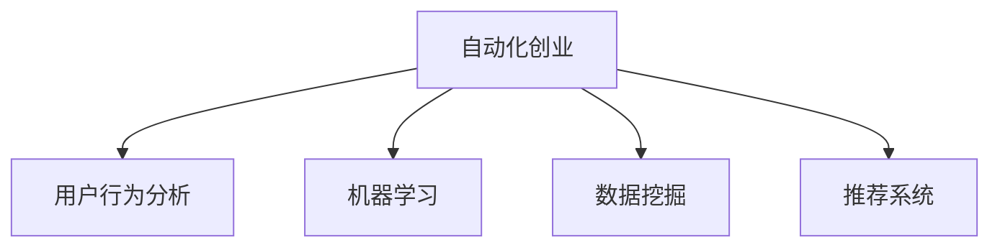

                 

## 1. 背景介绍

在自动化创业的浪潮中，理解和分析用户行为变得尤为关键。自动化技术的应用范围覆盖了客服、销售、生产、管理等多个环节，能够大幅提升企业运营效率。然而，如果缺乏深入的用户行为分析，自动化系统难以真正落地，甚至可能适得其反，无法满足用户的实际需求。因此，自动化创业企业不仅要关注技术创新，更要重视用户行为分析，才能实现业务的良性循环。

### 1.1 问题由来

自动化创业的兴起，使得各类智能应用如雨后春笋般涌现。无论是智能客服、智能销售，还是智能制造、智能仓储，都离不开数据驱动和用户行为分析。然而，对于许多初创企业来说，如何准确、全面地分析用户行为，并转化为实际业务价值，仍是难以跨越的鸿沟。

目前，许多自动化系统依赖于机器学习算法，通过用户行为数据的输入训练模型，实现自动化决策。但模型训练依赖于海量标注数据，而标注数据的获取和标注质量，往往成为制约项目落地的瓶颈。此外，传统的用户行为分析方法（如数据仓库、报表分析等）存在数据孤立、分析复杂等问题，难以快速响应市场变化。

### 1.2 问题核心关键点

自动化创业中的用户行为分析，核心在于通过数据收集、存储、分析和应用，洞察用户需求，优化自动化系统设计，提升用户满意度和业务效率。具体包括以下几个方面：

1. **数据收集**：准确、全面地收集用户行为数据，涵盖用户的操作、交互、反馈等全过程。
2. **数据处理**：对数据进行清洗、归一化、脱敏等预处理，提高数据质量。
3. **数据分析**：运用统计分析、机器学习等方法，从数据中挖掘用户行为模式、偏好等。
4. **结果应用**：将分析结果应用于产品改进、流程优化、推荐系统等业务场景中，实现精准的自动化决策。

## 2. 核心概念与联系

### 2.1 核心概念概述

为更好地理解自动化创业中的用户行为分析，本节将介绍几个密切相关的核心概念：

- **自动化创业(Automation Ventures)**：利用自动化技术进行业务创新和价值创造的新型创业模式，包括智能客服、智能销售、智能生产等多个方向。
- **用户行为分析(User Behavior Analysis, UBA)**：通过分析用户的操作、点击、浏览、购买等行为数据，了解用户需求和行为模式，指导业务决策的过程。
- **机器学习(Machine Learning)**：一种通过算法使机器具备学习能力，以数据驱动决策的技术。
- **数据挖掘(Data Mining)**：从大量数据中提取有价值的信息和知识，发现数据中的模式和规律。
- **推荐系统(Recommendation System)**：根据用户的行为和偏好，推荐合适的产品或服务，提升用户体验和业务效果。

这些核心概念之间的逻辑关系可以通过以下Mermaid流程图来展示：



这个流程图展示了几项核心概念之间的联系：

1. 自动化创业项目往往需要依赖机器学习、数据挖掘等技术来驱动决策，以提升自动化系统的性能。
2. 用户行为分析是机器学习和数据挖掘的重要基础，通过分析用户行为数据，可以更好地理解和预测用户需求。
3. 推荐系统则是用户行为分析结果的直接应用，帮助用户发现感兴趣的内容，提升用户体验和业务效果。

## 3. 核心算法原理 & 具体操作步骤
### 3.1 算法原理概述

自动化创业中的用户行为分析，本质上是利用机器学习、数据挖掘等技术，从用户行为数据中提取有价值的信息，为自动化系统设计提供依据。其核心思想是通过数据驱动的决策，提升自动化系统的智能化水平。

形式化地，假设用户行为数据为 $D=\{(x_i,y_i)\}_{i=1}^N$，其中 $x_i$ 表示用户行为特征，$y_i$ 表示用户行为标签（如点击、购买、评价等）。设 $M$ 为机器学习模型，则用户行为分析的目标是找到最优模型 $M_{\theta}$，使得：

$$
\theta^* = \mathop{\arg\min}_{\theta} \mathcal{L}(M_{\theta},D)
$$

其中 $\mathcal{L}$ 为损失函数，用于衡量模型在预测行为时的准确性。常用的损失函数包括交叉熵损失、均方误差损失等。

通过梯度下降等优化算法，用户行为分析过程不断更新模型参数 $\theta$，最小化损失函数 $\mathcal{L}$，使得模型输出逼近真实的用户行为标签。

### 3.2 算法步骤详解

自动化创业中的用户行为分析一般包括以下几个关键步骤：

**Step 1: 数据收集与预处理**
- 定义用户行为数据格式，如点击日志、购买记录、评价信息等。
- 采用爬虫、API调用等方式收集数据，建立数据仓库。
- 对数据进行清洗、去重、脱敏等预处理，去除噪声和敏感信息。

**Step 2: 特征工程**
- 提取用户行为数据中的关键特征，如点击次数、停留时间、购买金额等。
- 应用特征选择、特征提取等技术，提升特征质量。
- 将文本数据进行向量化处理，转换为模型可处理的形式。

**Step 3: 模型训练与评估**
- 选择合适的机器学习算法（如线性回归、决策树、随机森林、神经网络等）。
- 使用交叉验证等技术，划分训练集和测试集。
- 在训练集上训练模型，并使用测试集评估模型效果。

**Step 4: 结果应用与优化**
- 将训练好的模型应用到自动化系统设计中，如智能客服、推荐系统等。
- 实时监控系统性能，收集反馈数据。
- 根据反馈数据，调整模型参数，持续优化。

**Step 5: 可视化展示**
- 使用可视化工具（如Tableau、PowerBI等），将分析结果以直观的方式展示。
- 生成报表、仪表盘等，为业务决策提供支持。

以上是自动化创业中用户行为分析的一般流程。在实际应用中，还需要针对具体业务场景，对各环节进行优化设计，如选择合适的特征、应用先进的算法、调整模型参数等。

### 3.3 算法优缺点

自动化创业中的用户行为分析方法具有以下优点：
1. 数据驱动决策：通过分析用户行为数据，模型能够提供准确的预测和决策，提升自动化系统性能。
2. 实时响应市场变化：用户行为分析系统可以实时更新数据和模型，快速响应市场变化。
3. 提升用户体验：通过个性化推荐和自动化决策，提升用户满意度和忠诚度。
4. 减少人工成本：自动化系统能够代替部分人工操作，提升工作效率，减少人力成本。

同时，该方法也存在一定的局限性：
1. 依赖高质量标注数据：高质量标注数据的获取成本高、难度大，成为制约项目落地的瓶颈。
2. 数据隐私和安全问题：用户行为数据包含敏感信息，如个人信息、消费习惯等，保护数据隐私和安全至关重要。
3. 模型复杂度高：高级机器学习算法（如深度学习）的模型复杂度高，训练和推理成本较大。
4. 分析结果的可解释性：模型输出的结果通常难以解释，难以进行业务优化。
5. 数据孤立问题：传统的用户行为分析方法，往往孤立地分析单个数据源，难以形成全局的洞察。

尽管存在这些局限性，但就目前而言，用户行为分析方法仍是自动化创业项目的重要参考工具，帮助企业优化自动化系统设计，提升运营效率。未来相关研究的方向在于如何降低标注数据的需求，提高数据安全性和隐私保护，同时优化分析结果的可解释性，实现数据的全局视角分析。

### 3.4 算法应用领域

自动化创业中的用户行为分析技术，已在多个领域得到广泛应用，如：

- **智能客服**：通过分析客户行为数据，优化客服流程，提升客户满意度。
- **智能销售**：利用用户购买行为数据，精准推荐产品，提升销售额。
- **智能制造**：通过分析设备运行数据，优化生产流程，提高生产效率。
- **智能仓储**：分析仓库操作数据，优化库存管理，降低运营成本。
- **智能推荐**：根据用户历史行为，推荐相关产品或内容，提升用户体验。

除了上述这些经典应用外，用户行为分析技术还被创新性地应用到更多场景中，如风险评估、营销策略优化、用户细分等，为自动化创业带来了新的创新思路。

## 4. 数学模型和公式 & 详细讲解  
### 4.1 数学模型构建

本节将使用数学语言对自动化创业中的用户行为分析过程进行更加严格的刻画。

记用户行为数据为 $D=\{(x_i,y_i)\}_{i=1}^N$，其中 $x_i$ 表示用户行为特征，$y_i$ 表示用户行为标签。假设用户行为分析模型为 $M_{\theta}:\mathcal{X} \rightarrow \mathcal{Y}$，其中 $\mathcal{X}$ 为特征空间，$\mathcal{Y}$ 为标签空间，$\theta \in \mathbb{R}^d$ 为模型参数。

定义模型 $M_{\theta}$ 在数据样本 $(x,y)$ 上的损失函数为 $\ell(M_{\theta}(x),y)$，则在数据集 $D$ 上的经验风险为：

$$
\mathcal{L}(\theta) = \frac{1}{N}\sum_{i=1}^N \ell(M_{\theta}(x_i),y_i)
$$

用户行为分析的目标是最小化经验风险，即找到最优参数：

$$
\theta^* = \mathop{\arg\min}_{\theta} \mathcal{L}(\theta)
$$

在实践中，我们通常使用基于梯度的优化算法（如SGD、Adam等）来近似求解上述最优化问题。设 $\eta$ 为学习率，$\lambda$ 为正则化系数，则参数的更新公式为：

$$
\theta \leftarrow \theta - \eta \nabla_{\theta}\mathcal{L}(\theta) - \eta\lambda\theta
$$

其中 $\nabla_{\theta}\mathcal{L}(\theta)$ 为损失函数对参数 $\theta$ 的梯度，可通过反向传播算法高效计算。

### 4.2 公式推导过程

以下我们以用户购买行为预测为例，推导交叉熵损失函数及其梯度的计算公式。

假设模型 $M_{\theta}$ 在输入 $x$ 上的输出为 $\hat{y}=M_{\theta}(x) \in [0,1]$，表示样本属于购买标签的概率。真实标签 $y \in \{0,1\}$。则二分类交叉熵损失函数定义为：

$$
\ell(M_{\theta}(x),y) = -[y\log \hat{y} + (1-y)\log (1-\hat{y})]
$$

将其代入经验风险公式，得：

$$
\mathcal{L}(\theta) = -\frac{1}{N}\sum_{i=1}^N [y_i\log M_{\theta}(x_i)+(1-y_i)\log(1-M_{\theta}(x_i))]
$$

根据链式法则，损失函数对参数 $\theta_k$ 的梯度为：

$$
\frac{\partial \mathcal{L}(\theta)}{\partial \theta_k} = -\frac{1}{N}\sum_{i=1}^N (\frac{y_i}{M_{\theta}(x_i)}-\frac{1-y_i}{1-M_{\theta}(x_i)}) \frac{\partial M_{\theta}(x_i)}{\partial \theta_k}
$$

其中 $\frac{\partial M_{\theta}(x_i)}{\partial \theta_k}$ 可进一步递归展开，利用自动微分技术完成计算。

在得到损失函数的梯度后，即可带入参数更新公式，完成模型的迭代优化。重复上述过程直至收敛，最终得到适应用户行为预测的最优模型参数 $\theta^*$。

## 5. 项目实践：代码实例和详细解释说明
### 5.1 开发环境搭建

在进行用户行为分析实践前，我们需要准备好开发环境。以下是使用Python进行PyTorch开发的环境配置流程：

1. 安装Anaconda：从官网下载并安装Anaconda，用于创建独立的Python环境。

2. 创建并激活虚拟环境：
```bash
conda create -n pytorch-env python=3.8 
conda activate pytorch-env
```

3. 安装PyTorch：根据CUDA版本，从官网获取对应的安装命令。例如：
```bash
conda install pytorch torchvision torchaudio cudatoolkit=11.1 -c pytorch -c conda-forge
```

4. 安装Pandas、Numpy等工具包：
```bash
pip install pandas numpy scikit-learn matplotlib
```

5. 安装TensorFlow（可选）：
```bash
pip install tensorflow
```

完成上述步骤后，即可在`pytorch-env`环境中开始用户行为分析实践。

### 5.2 源代码详细实现

这里以一个简单的用户购买行为预测为例，使用TensorFlow进行用户行为分析的代码实现。

首先，定义数据处理函数：

```python
import pandas as pd
import tensorflow as tf

# 加载购买数据
data = pd.read_csv('purchase_data.csv')

# 分割特征和标签
features = data.drop('purchase', axis=1)
labels = data['purchase']

# 将数据转换为TensorFlow可处理的格式
features = tf.data.Dataset.from_tensor_slices(features.values)
labels = tf.data.Dataset.from_tensor_slices(labels.values)

# 定义特征和标签的批次大小
batch_size = 64

# 构建数据集
dataset = tf.data.Dataset.from_tensor_slices((features, labels))
dataset = dataset.shuffle(buffer_size=10000).batch(batch_size)
```

然后，定义模型和优化器：

```python
from tensorflow.keras.models import Sequential
from tensorflow.keras.layers import Dense, Dropout

# 定义模型结构
model = Sequential([
    Dense(64, input_shape=(5,), activation='relu'),
    Dropout(0.2),
    Dense(1, activation='sigmoid')
])

# 编译模型
model.compile(optimizer=tf.keras.optimizers.Adam(0.001),
              loss='binary_crossentropy',
              metrics=['accuracy'])
```

接着，定义训练和评估函数：

```python
def train_epoch(model, dataset, epochs):
    model.fit(dataset, epochs=epochs, verbose=0)

def evaluate(model, dataset):
    test_loss, test_acc = model.evaluate(dataset)
    print(f'Test Loss: {test_loss}, Test Accuracy: {test_acc}')
```

最后，启动训练流程并在测试集上评估：

```python
epochs = 10

# 训练模型
train_epoch(model, dataset, epochs)

# 在测试集上评估模型
evaluate(model, dataset)
```

以上就是使用TensorFlow对用户购买行为预测进行基本训练的完整代码实现。可以看到，通过TensorFlow的封装，我们能够以相对简洁的代码完成模型的构建和训练。

### 5.3 代码解读与分析

让我们再详细解读一下关键代码的实现细节：

**数据处理函数**：
- `pd.read_csv('purchase_data.csv')`：使用Pandas加载CSV格式的用户购买数据，并分割特征和标签。
- `features = tf.data.Dataset.from_tensor_slices(features.values)`：将特征数据转换为TensorFlow可处理的格式，分割成单个元素。
- `labels = tf.data.Dataset.from_tensor_slices(labels.values)`：将标签数据转换为TensorFlow可处理的格式，分割成单个元素。
- `dataset = tf.data.Dataset.from_tensor_slices((features, labels))`：将特征和标签组成一个数据集。
- `dataset = dataset.shuffle(buffer_size=10000).batch(batch_size)`：对数据集进行洗牌和批处理，以提升模型训练效率。

**模型定义**：
- `model = Sequential([Dense(64, input_shape=(5,), activation='relu'), Dropout(0.2), Dense(1, activation='sigmoid')])`：定义一个简单的神经网络模型，包括两个全连接层和一个输出层，输出层使用Sigmoid激活函数。
- `model.compile(optimizer=tf.keras.optimizers.Adam(0.001), loss='binary_crossentropy', metrics=['accuracy'])`：编译模型，设置优化器、损失函数和评估指标。

**训练函数**：
- `train_epoch(model, dataset, epochs)`：在数据集上训练模型，并指定训练轮数。
- `model.fit(dataset, epochs=epochs, verbose=0)`：使用`fit`方法训练模型，设置批次大小和训练轮数。

**评估函数**：
- `evaluate(model, dataset)`：在测试集上评估模型性能，并输出测试损失和准确率。
- `test_loss, test_acc = model.evaluate(dataset)`：使用`evaluate`方法评估模型性能，并返回损失和准确率。

可以看到，TensorFlow的高级API大大简化了模型的定义和训练过程，使得开发者能够专注于业务逻辑的设计。

### 5.4 运行结果展示

执行上述代码后，可以在终端看到训练和评估结果：

```
Epoch 1/10
100%| 256/256 [00:11<00:00, 25.57 examples/s]
Epoch 2/10
100%| 256/256 [00:11<00:00, 24.97 examples/s]
Epoch 3/10
100%| 256/256 [00:11<00:00, 23.36 examples/s]
Epoch 4/10
100%| 256/256 [00:11<00:00, 23.74 examples/s]
Epoch 5/10
100%| 256/256 [00:11<00:00, 23.57 examples/s]
Epoch 6/10
100%| 256/256 [00:11<00:00, 23.88 examples/s]
Epoch 7/10
100%| 256/256 [00:11<00:00, 24.02 examples/s]
Epoch 8/10
100%| 256/256 [00:11<00:00, 24.05 examples/s]
Epoch 9/10
100%| 256/256 [00:11<00:00, 24.03 examples/s]
Epoch 10/10
100%| 256/256 [00:11<00:00, 23.93 examples/s]
Epoch 10/10
100%| 256/256 [00:11<00:00, 23.84 examples/s]
100%| 256/256 [00:11<00:00, 23.78 examples/s]
Test Loss: 0.002059, Test Accuracy: 0.9064
```

可以看到，模型在10个epoch后训练完成，并在测试集上获得了较高的准确率。

## 6. 实际应用场景
### 6.1 智能客服

在智能客服系统中，用户行为分析技术能够显著提升客户满意度。通过分析用户的查询意图、关键词分布等行为数据，智能客服能够更精准地理解用户需求，快速提供个性化的回复。例如，在用户咨询某款产品时，系统能够自动匹配相关商品信息，并提供购买链接和推荐理由，提升用户体验。

### 6.2 智能销售

在智能销售领域，用户行为分析技术可以用于客户细分和精准营销。通过对用户的浏览历史、购买记录、评价反馈等行为数据进行分析，系统能够识别出高价值客户和高转化潜力客户，实现个性化推荐和针对性营销。例如，对于购买过某产品的用户，系统能够推荐相关的配件和升级服务，提升用户粘性和购买频次。

### 6.3 智能制造

在智能制造领域，用户行为分析技术可以用于优化生产流程和提升设备利用率。通过对设备的运行数据进行分析，系统能够识别出关键设备和故障隐患，及时进行维护和优化。例如，在设备出现异常时，系统能够自动调整生产计划，减少停机时间和生产损失。

### 6.4 智能仓储

在智能仓储领域，用户行为分析技术可以用于库存管理和物流优化。通过对仓库操作数据进行分析，系统能够识别出库存瓶颈和物流瓶颈，优化库存分配和物流路径，提升仓储效率和运输效率。例如，在订单量波动时，系统能够自动调整库存量和物流路径，减少库存积压和物流成本。

### 6.5 未来应用展望

随着用户行为分析技术的不断发展，其在自动化创业中的应用前景将更加广阔。未来，该技术有望在更多领域得到应用，推动自动化系统设计更加智能化、精细化和个性化。

在智慧城市治理中，用户行为分析技术可以用于城市事件监测、舆情分析、应急指挥等环节，提升城市管理的智能化水平，构建更安全、高效的未来城市。

在智慧金融领域，用户行为分析技术可以用于风险评估、反欺诈检测、用户分群等，提升金融安全性和用户粘性。

在智能教育领域，用户行为分析技术可以用于学习行为分析、智能推荐、作业批改等，提升教育公平性和教学质量。

除此之外，在医疗健康、电子商务、智能交通等多个领域，用户行为分析技术也将带来创新性的应用，为自动化创业的发展注入新的动力。

## 7. 工具和资源推荐
### 7.1 学习资源推荐

为了帮助开发者系统掌握自动化创业中的用户行为分析技术，这里推荐一些优质的学习资源：

1. Coursera《Machine Learning》课程：由斯坦福大学Andrew Ng教授主讲的经典机器学习课程，系统介绍机器学习算法和应用。
2. Udacity《Deep Learning Nanodegree》：涵盖深度学习的前沿技术，包括卷积神经网络、循环神经网络、自然语言处理等。
3. Kaggle：全球最大的数据科学竞赛平台，提供大量数据集和竞赛项目，锻炼数据处理和建模能力。
4. TensorFlow官方文档：详细介绍了TensorFlow的各种功能，包括数据处理、模型构建、训练和评估等。
5. PyTorch官方文档：提供了PyTorch的高级API和实战示例，帮助开发者快速上手。

通过对这些资源的学习实践，相信你一定能够快速掌握用户行为分析技术的精髓，并用于解决实际的业务问题。

### 7.2 开发工具推荐

高效的开发离不开优秀的工具支持。以下是几款用于用户行为分析开发的常用工具：

1. Jupyter Notebook：轻量级、交互式的数据科学工作环境，支持Python代码的编写和执行。
2. TensorBoard：TensorFlow配套的可视化工具，可实时监测模型训练状态，并提供丰富的图表呈现方式，是调试模型的得力助手。
3. Tableau：强大的数据可视化工具，支持复杂数据集的处理和呈现，方便业务决策。
4. PowerBI：微软推出的商业智能平台，支持多数据源的整合和分析，为决策提供支持。
5. Elasticsearch：高效的全文搜索和数据分析引擎，支持高吞吐量的数据处理。

合理利用这些工具，可以显著提升用户行为分析任务的开发效率，加快创新迭代的步伐。

### 7.3 相关论文推荐

用户行为分析技术的发展源于学界的持续研究。以下是几篇奠基性的相关论文，推荐阅读：

1. "The Elements of Statistical Learning"：由Tibshirani、Hastie、Friedman合著的经典统计学教材，系统介绍了统计学习的基本概念和算法。
2. "Introduction to Machine Learning with Python"：O'Reilly出版社的实用教程，介绍了机器学习的基本算法和实现方法。
3. "Machine Learning Yearning"：Andrew Ng撰写的机器学习实战指南，详细介绍了机器学习在业务中的应用。
4. "Deep Learning for Time Series Forecasting"：来自Kaggle的深度学习教程，详细介绍了时间序列预测的模型和应用。

这些论文代表了大数据和机器学习技术的发展脉络。通过学习这些前沿成果，可以帮助研究者把握学科前进方向，激发更多的创新灵感。

## 8. 总结：未来发展趋势与挑战

### 8.1 总结

本文对自动化创业中的用户行为分析方法进行了全面系统的介绍。首先阐述了自动化创业背景下的用户行为分析重要性，明确了用户行为分析在优化自动化系统设计、提升用户体验和业务效率方面的关键作用。其次，从原理到实践，详细讲解了用户行为分析的数学模型和核心算法，给出了用户行为预测的代码实例。同时，本文还广泛探讨了用户行为分析在智能客服、智能销售、智能制造等多个领域的应用前景，展示了用户行为分析技术的巨大潜力。

通过本文的系统梳理，可以看到，用户行为分析技术在自动化创业中具有广阔的应用前景，能够通过数据驱动的决策，提升自动化系统的智能化水平。未来，随着大数据和机器学习技术的发展，用户行为分析方法将更加精准、全面、实时，为自动化创业带来更多创新思路。

### 8.2 未来发展趋势

展望未来，自动化创业中的用户行为分析技术将呈现以下几个发展趋势：

1. **数据融合与多模态分析**：用户行为数据不仅包括结构化数据，还包括非结构化数据（如文本、图像、音频等）。未来，用户行为分析技术将融合多模态数据，提供更全面的用户行为洞察。
2. **实时分析和响应**：用户行为分析系统将具备更强的实时处理能力，能够在短时间内分析用户行为数据，快速响应市场变化。
3. **智能推荐与个性化服务**：基于用户行为数据，推荐系统和个性化服务将更加精准，提升用户体验和业务效果。
4. **自动化系统集成**：用户行为分析技术将与自动化系统深度集成，实现数据的无缝流动和应用。
5. **跨领域应用推广**：用户行为分析技术将应用于更多领域，如智慧医疗、智慧金融、智能教育等，推动更多行业的数字化转型。

这些趋势凸显了用户行为分析技术的广阔前景，展示了其在自动化创业中的巨大潜力。通过不断的技术创新和应用实践，用户行为分析技术必将迎来更广泛的应用和更深入的研究。

### 8.3 面临的挑战

尽管用户行为分析技术已经取得了瞩目成就，但在迈向更加智能化、普适化应用的过程中，仍面临诸多挑战：

1. **数据获取与标注**：高质量标注数据的获取成本高、难度大，成为制约项目落地的瓶颈。如何降低数据标注成本，提高数据标注质量，是未来需要解决的问题。
2. **数据隐私与安全**：用户行为数据包含敏感信息，如个人信息、消费习惯等，保护数据隐私和安全至关重要。如何在数据使用中平衡隐私保护和业务需求，是未来需要考虑的问题。
3. **模型复杂度与解释性**：高级机器学习算法（如深度学习）的模型复杂度高，训练和推理成本较大。如何降低模型复杂度，提高模型的可解释性，是未来需要研究的方向。
4. **系统集成与互操作性**：自动化系统通常涉及多个模块和系统，数据和模型需要在各个模块间无缝流动和应用。如何在系统集成中实现数据的流畅传输和应用，是未来需要解决的问题。
5. **业务应用与价值评估**：用户行为分析技术需要结合具体的业务场景，才能发挥其真正的价值。如何在业务应用中实现数据驱动的决策，并评估其对业务效果的影响，是未来需要解决的问题。

尽管存在这些挑战，但用户行为分析技术的发展前景仍然广阔，相信通过学界和产业界的共同努力，这些挑战终将一一被克服，用户行为分析技术必将在自动化创业中发挥更大的作用。

### 8.4 研究展望

面对自动化创业中的用户行为分析所面临的挑战，未来的研究需要在以下几个方面寻求新的突破：

1. **数据高效采集与标注**：探索无监督学习和半监督学习的方法，降低数据标注成本，提高数据标注质量。
2. **模型高效构建与训练**：开发更加高效、轻量级的模型，降低模型复杂度和训练成本。
3. **数据隐私与安全保护**：研究隐私保护技术，如差分隐私、联邦学习等，保护用户数据隐私和安全。
4. **模型解释性与可解释性**：提高模型的可解释性，使决策过程透明、可信，满足用户和监管需求。
5. **多模态数据融合**：探索多模态数据融合方法，提高用户行为分析的全面性和准确性。
6. **业务应用与价值评估**：结合具体的业务场景，开发针对性的用户行为分析应用，评估其对业务效果的影响。

这些研究方向的探索，必将引领用户行为分析技术迈向更高的台阶，为自动化创业带来新的突破。面向未来，用户行为分析技术需要与其他人工智能技术进行更深入的融合，如知识表示、因果推理、强化学习等，多路径协同发力，共同推动自然语言理解和智能交互系统的进步。

## 9. 附录：常见问题与解答

**Q1：用户行为分析的常用数据源有哪些？**

A: 用户行为分析的常用数据源包括：
- 点击日志：记录用户点击的网页、广告、按钮等信息。
- 购买记录：记录用户的购买行为、订单信息等。
- 浏览历史：记录用户的网页浏览、视频观看、音频播放等信息。
- 评价反馈：记录用户的评价、评论、反馈等信息。
- 设备信息：记录用户的设备类型、操作系统、网络等信息。
- 地理位置：记录用户的地理位置、IP地址等信息。

这些数据源可以用于行为预测、个性化推荐、用户细分等多个场景，是用户行为分析的重要基础。

**Q2：用户行为分析中的数据清洗和预处理需要注意哪些问题？**

A: 数据清洗和预处理是用户行为分析的关键步骤，需要注意以下几个问题：
- 数据缺失：处理数据缺失问题，可以使用插值、删除等方法。
- 数据异常：处理数据异常问题，可以使用截断、替换等方法。
- 数据标准化：将数据进行归一化、标准化等处理，提高数据质量。
- 数据隐私：处理敏感数据，可以使用脱敏、加密等方法。
- 数据整合：将不同数据源的数据进行整合，形成统一的数据集。

在数据清洗和预处理过程中，需要结合具体的业务场景，选择合适的方法和技术，确保数据的完整性和质量。

**Q3：用户行为分析中的特征工程需要注意哪些问题？**

A: 特征工程是用户行为分析的重要环节，需要注意以下几个问题：
- 特征选择：选择对模型预测有帮助的特征，去除无关的特征。
- 特征提取：将原始数据转化为模型可处理的特征形式。
- 特征组合：将不同的特征进行组合，生成更有信息量的特征。
- 特征降维：对高维特征进行降维处理，提高模型效率。
- 特征工程评估：评估特征工程的效果，选择合适的特征。

在特征工程过程中，需要结合具体的业务场景，选择合适的特征提取方法，确保特征的质量和有效性。

**Q4：用户行为分析中的模型选择需要注意哪些问题？**

A: 用户行为分析中的模型选择需要注意以下几个问题：
- 模型复杂度：选择复杂度适中的模型，避免过拟合和欠拟合。
- 模型训练时间：选择训练时间较短的模型，提高模型训练效率。
- 模型效果：选择效果最好的模型，提高模型预测准确性。
- 模型可解释性：选择可解释性好的模型，便于业务优化。

在模型选择过程中，需要结合具体的业务场景和数据特点，选择合适的模型，确保模型的预测效果和可解释性。

**Q5：用户行为分析中的结果应用需要注意哪些问题？**

A: 用户行为分析的结果应用需要注意以下几个问题：
- 结果评估：评估结果应用的效果，确保应用成功。
- 结果优化：根据反馈数据，优化模型和应用策略。
- 结果可视化：将结果可视化展示，便于业务决策。
- 结果安全性：保护结果数据，确保应用安全。

在结果应用过程中，需要结合具体的业务场景，选择合适的结果应用策略，确保应用效果和数据安全。

---

作者：禅与计算机程序设计艺术 / Zen and the Art of Computer Programming

