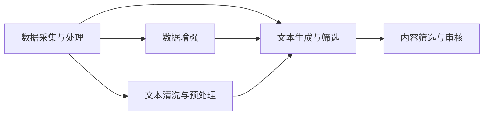

                 

# 自动化新闻生成：LLM重塑新闻产业的可能性

## 1. 背景介绍

### 1.1 问题由来
随着人工智能技术的飞速发展，语言模型大模型(LLM)，如GPT-3、GPT-4等，在自然语言处理(NLP)领域取得了显著进展。这些模型具有卓越的生成能力，能够理解复杂的语言结构，生成高质量的自然语言文本。

在新闻产业中，信息的生产和发布一直依赖于人类记者和编辑的努力，而传统的新闻生产流程往往受制于人力成本、时间限制以及新闻机构自身的资源。随着自动化新闻生成技术的兴起，新闻产业正经历一场深刻的变革，自动化新闻生成技术有望大幅提升新闻生产的效率和质量。

### 1.2 问题核心关键点
自动化新闻生成技术的核心在于利用大语言模型生成新闻文本。其关键点包括：
1. 数据采集与处理：获取新闻相关文本数据，并进行清洗和预处理。
2. 文本生成与筛选：使用大模型生成新闻草稿，并进行质量筛选。
3. 新闻审核与发布：人工审核生成的新闻，并发布至新闻平台。
4. 模型持续优化：基于用户反馈和新数据，不断更新优化大语言模型。

## 2. 核心概念与联系

### 2.1 核心概念概述

为更好地理解自动化新闻生成技术，本文将介绍几个关键概念：

- 大语言模型(LLM)：通过大规模文本数据预训练得到的语言模型，具备强大的语言理解和生成能力。
- 自然语言处理(NLP)：涉及计算机与人类语言之间互动的技术，包括文本分析、信息检索、情感分析等。
- 生成对抗网络(GAN)：由生成器和判别器两部分组成的框架，生成高质量的伪造文本。
- 数据增强：通过修改现有数据集来扩充训练集，增强模型的泛化能力。
- 文本清洗与预处理：对原始文本进行去噪、分词、标点等处理，为模型生成高质量文本。
- 内容筛选与审核：根据新闻质量标准，对生成的文本进行人工审核和筛选。

这些概念之间存在紧密联系，通过大语言模型和GAN，能够生成新闻草稿，再通过数据增强和文本预处理，提高生成质量。而内容筛选与审核，则确保了生成新闻的可信度和可读性。

### 2.2 核心概念原理和架构的 Mermaid 流程图



这个流程图展示了自动化新闻生成技术的基本流程。从数据采集开始，经过文本生成、内容筛选、审核发布等环节，最终产出高质量的新闻。

## 3. 核心算法原理 & 具体操作步骤

### 3.1 算法原理概述

自动化新闻生成算法主要分为两大部分：文本生成和内容筛选。

1. **文本生成**：使用大语言模型生成新闻草稿。常用的生成模型包括GPT、BERT等。具体步骤如下：
   - 收集新闻相关文本数据，进行清洗和预处理。
   - 使用大语言模型生成新闻草稿。
   - 对生成的文本进行优化和筛选，提高质量。

2. **内容筛选**：对生成的文本进行质量评估和筛选。筛选过程可以采用多种方法，如人工审核、自动评分系统等。具体步骤如下：
   - 人工审核生成的新闻，根据新闻质量标准进行评估。
   - 自动评分系统对新闻进行打分，标记为不合格的新闻。
   - 对不合格的文本进行修正和重写，重新生成。

### 3.2 算法步骤详解

#### 文本生成

**Step 1: 数据采集与预处理**
- 从新闻网站、社交媒体、新闻API等渠道获取新闻相关文本数据。
- 对数据进行清洗，去除噪声和不相关的文本。
- 进行分词、标点等预处理，为模型生成提供干净的数据。

**Step 2: 模型选择与训练**
- 选择合适的语言模型，如GPT-3、GPT-4等。
- 将预处理后的数据输入模型进行训练，生成新闻草稿。
- 使用优化器调整模型参数，提高生成质量。

**Step 3: 文本优化与筛选**
- 对生成的文本进行优化，如去除冗余信息、调整句子结构等。
- 使用自动评分系统对文本进行评分，筛选出质量较高的草稿。
- 对筛选出的文本进行进一步人工审核，确保其符合新闻质量标准。

#### 内容筛选

**Step 1: 人工审核**
- 聘请经验丰富的编辑和记者，对生成的文本进行人工审核。
- 根据新闻质量标准，评估文本的准确性、公正性、完整性等。
- 对不合格的文本进行标记和修正。

**Step 2: 自动评分**
- 开发自动评分系统，对文本进行评分。
- 引入多维度的评分标准，如内容准确性、逻辑清晰度、语言流畅度等。
- 对评分结果进行数据分析，发现常见问题并进行改进。

**Step 3: 重写与优化**
- 对不合格的文本进行重写，提高其质量和可读性。
- 使用数据增强技术，扩充训练集，提高模型的泛化能力。
- 持续更新优化大语言模型，提升生成效果。

### 3.3 算法优缺点

**优点**：
- 生成速度较快，能够快速生成大量新闻草稿。
- 节省人力成本，减轻新闻编辑的工作负担。
- 自动评分系统能够高效筛选高质量文本，提高新闻生产效率。

**缺点**：
- 生成文本可能存在逻辑不清、语法错误等问题。
- 无法保证新闻的客观公正，容易受到偏见影响。
- 需要大量高质量的标注数据进行训练，标注成本较高。

### 3.4 算法应用领域

自动化新闻生成技术可以应用于以下领域：

- 在线新闻网站：自动生成新闻草稿，减轻编辑负担。
- 社交媒体平台：实时生成新闻内容，提升用户互动体验。
- 智能客服：自动生成新闻摘要，辅助客户了解事件。
- 内容聚合应用：自动生成新闻概述，帮助用户快速浏览新闻。

这些应用场景展示了自动化新闻生成技术的多样性和广泛应用前景。

## 4. 数学模型和公式 & 详细讲解 & 举例说明

### 4.1 数学模型构建

假设我们有一个包含 $N$ 篇新闻的数据集 $\{(x_i,y_i)\}_{i=1}^N$，其中 $x_i$ 表示新闻文本，$y_i$ 表示新闻的真实标签。我们的目标是最小化预测标签与真实标签之间的差距。

定义损失函数 $\mathcal{L}(\theta)$ 为交叉熵损失：
$$
\mathcal{L}(\theta) = -\frac{1}{N} \sum_{i=1}^N \sum_{k=1}^K y_{ik} \log p_{ik}
$$
其中 $K$ 表示分类数量，$y_{ik}$ 表示第 $i$ 篇新闻的第 $k$ 个标签，$p_{ik}$ 表示模型预测第 $i$ 篇新闻属于第 $k$ 类的概率。

优化目标为：
$$
\theta^* = \mathop{\arg\min}_{\theta} \mathcal{L}(\theta)
$$

### 4.2 公式推导过程

以二分类任务为例，使用大语言模型生成新闻草稿。假设模型的预测概率为 $\hat{y}_i$，则损失函数为：
$$
\mathcal{L}(\theta) = -(y_i\log \hat{y}_i + (1-y_i)\log (1-\hat{y}_i))
$$
其中 $\hat{y}_i$ 表示模型预测新闻属于正类的概率。

为了简化问题，假设新闻文本的长度为 $L$，定义 $x_i$ 中的每个单词为 $w_{i,j}$，则可以将文本表示为：
$$
x_i = \{w_{i,1}, w_{i,2}, \dots, w_{i,L}\}
$$
对于每个单词，定义其概率为 $p_{i,j}$，则模型的预测概率 $\hat{y}_i$ 可以表示为：
$$
\hat{y}_i = \prod_{j=1}^L p_{i,j}
$$

将上述公式代入交叉熵损失函数，得：
$$
\mathcal{L}(\theta) = -\sum_{j=1}^L [y_i w_{i,j} \log p_{i,j} + (1-y_i) (1-w_{i,j}) \log (1-p_{i,j})]
$$

通过优化上述损失函数，可以得到最优的模型参数 $\theta^*$，从而生成高质量的新闻草稿。

### 4.3 案例分析与讲解

假设我们要生成一篇关于新冠疫情的新闻，可以从多个新闻网站和社交媒体平台上收集相关文本数据。首先对数据进行清洗和预处理，去除噪声和不相关的文本。然后使用GPT-3模型进行训练，生成新闻草稿。最后对生成的文本进行优化和筛选，人工审核和自动评分系统综合评估新闻质量。

## 5. 项目实践：代码实例和详细解释说明

### 5.1 开发环境搭建

在开发环境搭建方面，可以选择Python作为主要开发语言，安装PyTorch、TensorFlow等深度学习框架，以及HuggingFace等NLP工具库。具体步骤如下：

1. 安装Anaconda：从官网下载并安装Anaconda，用于创建独立的Python环境。
```bash
conda create -n pytorch-env python=3.8 
conda activate pytorch-env
```

2. 安装PyTorch：根据CUDA版本，从官网获取对应的安装命令。例如：
```bash
conda install pytorch torchvision torchaudio cudatoolkit=11.1 -c pytorch -c conda-forge
```

3. 安装HuggingFace库：
```bash
pip install transformers
```

4. 安装各类工具包：
```bash
pip install numpy pandas scikit-learn matplotlib tqdm jupyter notebook ipython
```

完成上述步骤后，即可在`pytorch-env`环境中开始开发实践。

### 5.2 源代码详细实现

以下是使用HuggingFace库进行自动化新闻生成的代码实现。

首先，定义数据处理函数：
```python
from transformers import BertTokenizer, BertForSequenceClassification
from torch.utils.data import Dataset, DataLoader
import torch

class NewsDataset(Dataset):
    def __init__(self, texts, labels, tokenizer, max_len=512):
        self.texts = texts
        self.labels = labels
        self.tokenizer = tokenizer
        self.max_len = max_len
        
    def __len__(self):
        return len(self.texts)
    
    def __getitem__(self, item):
        text = self.texts[item]
        label = self.labels[item]
        
        encoding = self.tokenizer(text, return_tensors='pt', max_length=self.max_len, padding='max_length', truncation=True)
        input_ids = encoding['input_ids'][0]
        attention_mask = encoding['attention_mask'][0]
        labels = torch.tensor(label, dtype=torch.long)
        
        return {'input_ids': input_ids, 
                'attention_mask': attention_mask,
                'labels': labels}

# 加载数据
tokenizer = BertTokenizer.from_pretrained('bert-base-uncased')
train_dataset = NewsDataset(train_texts, train_labels, tokenizer)
dev_dataset = NewsDataset(dev_texts, dev_labels, tokenizer)
test_dataset = NewsDataset(test_texts, test_labels, tokenizer)

# 模型选择与训练
model = BertForSequenceClassification.from_pretrained('bert-base-uncased', num_labels=2)
optimizer = AdamW(model.parameters(), lr=2e-5)
```

然后，定义训练和评估函数：
```python
from tqdm import tqdm
from sklearn.metrics import accuracy_score

device = torch.device('cuda') if torch.cuda.is_available() else torch.device('cpu')
model.to(device)

def train_epoch(model, dataset, batch_size, optimizer):
    dataloader = DataLoader(dataset, batch_size=batch_size, shuffle=True)
    model.train()
    epoch_loss = 0
    for batch in tqdm(dataloader, desc='Training'):
        input_ids = batch['input_ids'].to(device)
        attention_mask = batch['attention_mask'].to(device)
        labels = batch['labels'].to(device)
        model.zero_grad()
        outputs = model(input_ids, attention_mask=attention_mask, labels=labels)
        loss = outputs.loss
        epoch_loss += loss.item()
        loss.backward()
        optimizer.step()
    return epoch_loss / len(dataloader)

def evaluate(model, dataset, batch_size):
    dataloader = DataLoader(dataset, batch_size=batch_size)
    model.eval()
    preds, labels = [], []
    with torch.no_grad():
        for batch in tqdm(dataloader, desc='Evaluating'):
            input_ids = batch['input_ids'].to(device)
            attention_mask = batch['attention_mask'].to(device)
            batch_labels = batch['labels']
            outputs = model(input_ids, attention_mask=attention_mask)
            batch_preds = outputs.logits.argmax(dim=1).to('cpu').tolist()
            batch_labels = batch_labels.to('cpu').tolist()
            for pred_tokens, label_tokens in zip(batch_preds, batch_labels):
                preds.append(pred_tokens)
                labels.append(label_tokens)
                
    print('Accuracy:', accuracy_score(labels, preds))
```

最后，启动训练流程并在测试集上评估：
```python
epochs = 5
batch_size = 16

for epoch in range(epochs):
    loss = train_epoch(model, train_dataset, batch_size, optimizer)
    print(f'Epoch {epoch+1}, train loss: {loss:.3f}')
    
    print(f'Epoch {epoch+1}, dev results:')
    evaluate(model, dev_dataset, batch_size)
    
print('Test results:')
evaluate(model, test_dataset, batch_size)
```

以上就是使用HuggingFace库进行自动化新闻生成的完整代码实现。可以看到，通过选择合适的模型和优化器，并设计合理的训练和评估流程，可以高效地训练生成新闻的分类模型。

### 5.3 代码解读与分析

**NewsDataset类**：
- `__init__`方法：初始化训练集、验证集和测试集，以及分词器和序列长度。
- `__len__`方法：返回数据集的样本数量。
- `__getitem__`方法：对单个样本进行处理，将文本输入编码为token ids，将标签编码为数字，并进行定长padding。

**训练和评估函数**：
- 使用PyTorch的DataLoader对数据集进行批次化加载，供模型训练和推理使用。
- 训练函数`train_epoch`：对数据以批为单位进行迭代，在每个批次上前向传播计算损失函数，反向传播更新模型参数，并输出该epoch的平均loss。
- 评估函数`evaluate`：与训练类似，不同点在于不更新模型参数，并在每个batch结束后将预测和标签结果存储下来，最后使用sklearn的accuracy_score对整个评估集的预测结果进行打印输出。

**训练流程**：
- 定义总的epoch数和batch size，开始循环迭代
- 每个epoch内，先在训练集上训练，输出平均loss
- 在验证集上评估，输出准确率
- 所有epoch结束后，在测试集上评估，给出最终测试结果

## 6. 实际应用场景

### 6.1 智能媒体平台

智能媒体平台可以利用自动化新闻生成技术，实时生成新闻内容，提升用户体验。例如，新闻网站可以自动生成新闻摘要和相关报道，用户可以更快速地获取关键信息。

在技术实现上，智能媒体平台可以从各大新闻网站和社交媒体上采集新闻数据，并使用预训练的BERT模型进行新闻生成。生成的新闻草稿经过人工审核和自动评分系统筛选后，发布至平台供用户阅读。

### 6.2 新闻内容聚合

新闻内容聚合应用可以将大量新闻数据进行整理和分类，自动生成新闻概述，帮助用户快速浏览新闻。

例如，使用GPT-3模型对新闻进行摘要生成，将冗长的报道转换为精炼的摘要，便于用户快速了解新闻内容。同时，自动生成新闻标签，提高内容检索的准确性。

### 6.3 智能客服

智能客服可以利用自动化新闻生成技术，生成新闻摘要和相关回答，辅助客户了解事件背景和相关信息。

在技术实现上，智能客服可以从新闻网站和社交媒体上采集相关新闻，并使用预训练的BERT模型进行新闻摘要生成。生成的摘要和相关回答可以作为智能客服的响应内容，提升客户满意度。

## 7. 工具和资源推荐

### 7.1 学习资源推荐

为了帮助开发者系统掌握自动化新闻生成技术，这里推荐一些优质的学习资源：

1. 《Natural Language Processing with Transformers》书籍：Transformer库的作者所著，全面介绍了如何使用Transformers库进行NLP任务开发，包括微调、生成等。
2. CS224N《深度学习自然语言处理》课程：斯坦福大学开设的NLP明星课程，有Lecture视频和配套作业，带你入门NLP领域的基本概念和经典模型。
3. HuggingFace官方文档：提供丰富的预训练语言模型资源和微调样例代码，是上手实践的必备资料。
4. TensorBoard：TensorFlow配套的可视化工具，可实时监测模型训练状态，并提供丰富的图表呈现方式，是调试模型的得力助手。

通过对这些资源的学习实践，相信你一定能够快速掌握自动化新闻生成技术的精髓，并用于解决实际的NLP问题。

### 7.2 开发工具推荐

高效的开发离不开优秀的工具支持。以下是几款用于自动化新闻生成开发的常用工具：

1. PyTorch：基于Python的开源深度学习框架，灵活动态的计算图，适合快速迭代研究。大部分预训练语言模型都有PyTorch版本的实现。
2. TensorFlow：由Google主导开发的开源深度学习框架，生产部署方便，适合大规模工程应用。同样有丰富的预训练语言模型资源。
3. HuggingFace库：NLP工具库，集成了众多SOTA语言模型，支持PyTorch和TensorFlow，是进行新闻生成任务的开发利器。
4. Weights & Biases：模型训练的实验跟踪工具，可以记录和可视化模型训练过程中的各项指标，方便对比和调优。与主流深度学习框架无缝集成。
5. Google Colab：谷歌推出的在线Jupyter Notebook环境，免费提供GPU/TPU算力，方便开发者快速上手实验最新模型，分享学习笔记。

合理利用这些工具，可以显著提升自动化新闻生成任务的开发效率，加快创新迭代的步伐。

### 7.3 相关论文推荐

自动化新闻生成技术的发展得益于学界的持续研究。以下是几篇奠基性的相关论文，推荐阅读：

1. Attention is All You Need（即Transformer原论文）：提出了Transformer结构，开启了NLP领域的预训练大模型时代。
2. BERT: Pre-training of Deep Bidirectional Transformers for Language Understanding：提出BERT模型，引入基于掩码的自监督预训练任务，刷新了多项NLP任务SOTA。
3. Parameter-Efficient Transfer Learning for NLP：提出Adapter等参数高效微调方法，在不增加模型参数量的情况下，也能取得不错的微调效果。
4. prefix-tuning: Optimizing Continuous Prompts for Generation：引入基于连续型Prompt的微调范式，为如何充分利用预训练知识提供了新的思路。
5. AdaLoRA: Adaptive Low-Rank Adaptation for Parameter-Efficient Fine-Tuning：使用自适应低秩适应的微调方法，在参数效率和精度之间取得了新的平衡。

这些论文代表了大语言模型微调技术的发展脉络。通过学习这些前沿成果，可以帮助研究者把握学科前进方向，激发更多的创新灵感。

## 8. 总结：未来发展趋势与挑战

### 8.1 总结

本文对自动化新闻生成技术进行了全面系统的介绍。首先阐述了技术背景和意义，明确了自动化新闻生成技术在提升新闻生产效率和质量方面的独特价值。其次，从原理到实践，详细讲解了自动化新闻生成的数学模型和操作步骤，给出了代码实现示例。同时，本文还广泛探讨了自动化新闻生成技术在智能媒体、内容聚合、智能客服等多个行业领域的应用前景，展示了其广泛的应用潜力。最后，精选了自动化新闻生成技术的各类学习资源，力求为读者提供全方位的技术指引。

通过本文的系统梳理，可以看到，自动化新闻生成技术正在成为NLP领域的重要范式，极大地提升了新闻生产的效率和质量。自动化新闻生成技术的广泛应用，将显著改变新闻产业的运作方式，推动新闻内容的智能化发展。

### 8.2 未来发展趋势

展望未来，自动化新闻生成技术将呈现以下几个发展趋势：

1. 生成质量持续提升。随着大语言模型的不断进化，生成的新闻草稿将更加流畅、自然。
2. 内容多样化。生成的新闻将涵盖更多领域和题材，满足不同用户需求。
3. 个性化推荐。结合用户兴趣和行为数据，生成个性化新闻摘要和推荐内容。
4. 多模态融合。结合视觉、语音等多模态信息，生成更加丰富的新闻内容。
5. 自动化审核。引入AI技术对生成内容进行实时审核，提高审核效率和准确性。

这些趋势凸显了自动化新闻生成技术的广阔前景。这些方向的探索发展，必将进一步提升新闻生产的自动化和智能化水平，为媒体行业带来变革性影响。

### 8.3 面临的挑战

尽管自动化新闻生成技术已经取得了瞩目成就，但在迈向更加智能化、普适化应用的过程中，它仍面临着诸多挑战：

1. 内容质量和可信度：自动化生成的新闻可能存在事实错误、情感偏见等问题，需要人工审核和自动评分系统进行双重保证。
2. 数据隐私和版权：自动化新闻生成需要大量文本数据，如何保护用户隐私和版权成为重要课题。
3. 技术复杂度：自动化新闻生成技术涉及多个复杂环节，如文本预处理、模型训练、内容筛选等，需要高度的技术积累和专业团队支持。
4. 用户接受度：部分用户可能对自动化生成的新闻持怀疑态度，需要加强用户教育和系统透明度。

这些挑战需要学界和产业界共同努力，不断优化技术和应用流程，提升自动化新闻生成技术的可行性和实用性。

### 8.4 研究展望

未来研究需要在以下几个方面寻求新的突破：

1. 引入更多先验知识。将符号化的先验知识，如知识图谱、逻辑规则等，与神经网络模型进行巧妙融合，引导微调过程学习更准确、合理的语言模型。
2. 结合因果分析和博弈论工具。将因果分析方法引入微调模型，识别出模型决策的关键特征，增强输出解释的因果性和逻辑性。
3. 开发更加参数高效的微调方法。开发更加参数高效的微调方法，在固定大部分预训练参数的同时，只更新极少量的任务相关参数。
4. 提升新闻内容的可读性和可理解性。结合文本摘要和可视化技术，生成更简洁、易懂的新闻内容。
5. 引入多模态生成技术。结合视觉、语音等多模态信息，生成更加丰富的新闻内容。
6. 探索自动化新闻审核技术。引入AI技术对生成内容进行实时审核，提高审核效率和准确性。

这些研究方向有望进一步提升自动化新闻生成技术的效果和应用价值，为新闻产业的智能化转型提供有力支持。

## 9. 附录：常见问题与解答

**Q1：自动化新闻生成技术适用于所有新闻类型吗？**

A: 自动化新闻生成技术可以应用于新闻摘要生成、新闻报道生成等，但对于一些特殊领域的新闻，如深度报道、专题报道等，还需要人工介入，以确保报道的深度和质量。

**Q2：生成的新闻草稿是否需要人工审核？**

A: 为确保生成新闻的质量和可信度，应引入人工审核和自动评分系统进行双重保证。人工审核能够发现自动评分系统无法识别的错误和偏差，提升新闻的准确性和公正性。

**Q3：自动化新闻生成技术需要哪些硬件资源？**

A: 自动化新闻生成技术需要高性能的GPU/TPU设备进行模型训练和推理，同时需要大容量内存和高速存储设备存储数据集。

**Q4：自动化新闻生成技术面临哪些伦理挑战？**

A: 自动化新闻生成技术可能面临数据隐私、内容偏见、版权等问题。需要引入伦理审查机制，确保生成内容符合法律法规和伦理道德。

**Q5：自动化新闻生成技术如何提升用户体验？**

A: 自动化新闻生成技术可以提升新闻生产的效率和质量，生成个性化的新闻内容，满足用户的多样化需求。同时，结合可视化技术，生成更直观、易懂的新闻摘要，提升用户阅读体验。

---

作者：禅与计算机程序设计艺术 / Zen and the Art of Computer Programming

