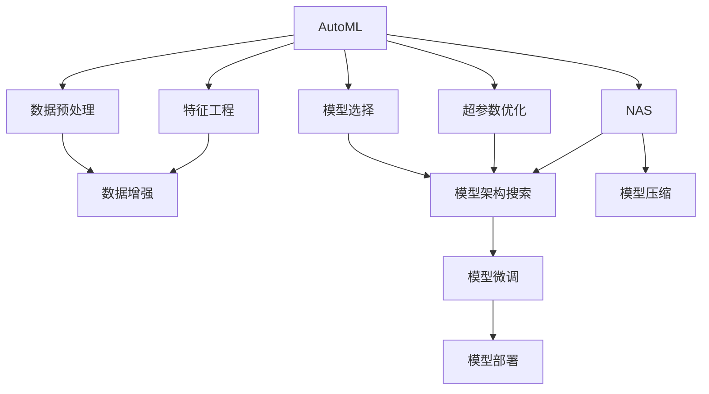

                 

# 自动化机器学习（AutoML）与NAS的融合

> 关键词：自动化机器学习(AutoML), 神经网络架构搜索(NAS), 自动模型训练, 超参数优化, 深度学习, 模型压缩, 模型优化, 人工智能

## 1. 背景介绍

### 1.1 问题由来
随着深度学习技术的发展，机器学习在众多领域展现出巨大的潜力。然而，深度学习的模型训练过程涉及大量超参数的调优，需要丰富的领域知识和专业的技能，这对普通用户来说是一个巨大的挑战。自动化机器学习（AutoML）和神经网络架构搜索（NAS）技术应运而生，通过自动化的方式优化模型结构和超参数，使得深度学习模型的构建和优化变得更加高效和便捷。

### 1.2 问题核心关键点
AutoML与NAS的主要目标是通过自动化手段优化深度学习模型的性能，具体体现在以下几个方面：
- **模型选择**：在众多可行的模型架构中，自动选择最优的模型。
- **超参数优化**：自动调整模型的超参数，如学习率、批量大小、激活函数等，以达到最优的性能。
- **数据增强**：自动设计数据增强策略，增加模型的泛化能力。
- **模型压缩**：通过自动化的模型压缩技术，减小模型尺寸，提高推理效率。
- **模型优化**：自动化地进行模型微调和优化，提升模型精度。

### 1.3 问题研究意义
AutoML与NAS技术的研究具有重要意义：
- **降低研发成本**：自动化的优化流程大大降低了深度学习模型构建和优化的门槛，使得非专业人士也能轻松构建高效模型。
- **提升模型效果**：自动化的优化手段能够找到更优的模型结构和超参数，显著提升模型的性能。
- **加速应用部署**：自动化流程减少了人工干预，加速了模型的部署和应用。
- **推动技术普及**：自动化的优化方法使得深度学习技术更加普及，促进了人工智能技术的广泛应用。

## 2. 核心概念与联系

### 2.1 核心概念概述

AutoML和NAS是深度学习领域中两个重要的研究方向，旨在通过自动化手段优化模型构建和优化过程。两者的核心思想是通过搜索和优化的方式，自动选择最优的模型架构和超参数。

- **自动化机器学习（AutoML）**：自动化的机器学习过程，包括数据预处理、特征工程、模型选择、超参数优化等步骤。
- **神经网络架构搜索（NAS）**：自动搜索最优的神经网络架构，以在特定任务上获得最佳性能。

两者之间的联系在于，AutoML包含了NAS的核心思想，即自动化地搜索和优化模型架构和超参数。NAS是AutoML的一个重要组成部分，专注于优化模型结构。

### 2.2 核心概念原理和架构的 Mermaid 流程图



这个流程图展示了AutoML和NAS的工作流程和核心概念之间的联系。数据预处理和特征工程是AutoML的前置步骤，模型选择和超参数优化是AutoML的核心部分。NAS专注于模型架构搜索和模型压缩，而模型微调和模型部署则是AutoML的后续步骤。

## 3. 核心算法原理 & 具体操作步骤

### 3.1 算法原理概述

AutoML和NAS的核心原理是通过自动化搜索和优化，选择最优的模型架构和超参数。主要包括以下步骤：

1. **数据预处理**：对原始数据进行清洗、标准化、归一化等处理，准备用于模型训练的数据集。
2. **特征工程**：从原始数据中提取有意义的特征，提高模型的泛化能力。
3. **模型选择**：从预定义的模型集合中选择最优的模型。
4. **超参数优化**：通过自动化的方法调整模型的超参数，如学习率、批量大小、激活函数等。
5. **模型压缩**：通过剪枝、量化、知识蒸馏等技术，减小模型尺寸，提高推理效率。
6. **模型微调**：在特定任务上对模型进行微调，进一步提升性能。
7. **模型部署**：将训练好的模型部署到生产环境，供实际应用使用。

### 3.2 算法步骤详解

#### 3.2.1 数据预处理

数据预处理是深度学习模型构建的第一步。AutoML和NAS技术通常会提供自动化的数据预处理工具，自动完成数据清洗、标准化、归一化等处理，减少人工干预。

#### 3.2.2 特征工程

特征工程是深度学习模型构建的关键步骤。AutoML和NAS技术可以自动设计特征工程流程，通过特征选择、降维、特征交叉等方法，提取有意义的特征，提高模型的泛化能力。

#### 3.2.3 模型选择

模型选择是AutoML和NAS的重要组成部分。通过自动化的方式，从预定义的模型集合中选择最优的模型。通常使用交叉验证、网格搜索等方法，自动评估模型性能，选择最优模型。

#### 3.2.4 超参数优化

超参数优化是AutoML和NAS的核心步骤。通过自动化的方法，自动调整模型的超参数，如学习率、批量大小、激活函数等。常用的方法包括随机搜索、贝叶斯优化、遗传算法等。

#### 3.2.5 模型压缩

模型压缩是AutoML和NAS的重要技术。通过自动化的方法，自动进行模型剪枝、量化、知识蒸馏等操作，减小模型尺寸，提高推理效率。常用的方法包括剪枝、量化、蒸馏等。

#### 3.2.6 模型微调

模型微调是AutoML和NAS的后续步骤。在特定任务上对模型进行微调，进一步提升性能。通常使用微调数据集，自动调整模型权重，适应特定任务。

#### 3.2.7 模型部署

模型部署是将训练好的模型部署到生产环境，供实际应用使用。AutoML和NAS技术通常提供自动化的模型部署工具，简化模型部署过程。

### 3.3 算法优缺点

AutoML和NAS技术具有以下优点：
- **高效便捷**：自动化的流程大大降低了深度学习模型构建和优化的门槛，使得非专业人士也能轻松构建高效模型。
- **性能优越**：自动化的优化手段能够找到更优的模型结构和超参数，显著提升模型的性能。
- **加速应用部署**：自动化流程减少了人工干预，加速了模型的部署和应用。

同时，AutoML和NAS技术也存在一些局限性：
- **资源消耗大**：自动化流程需要大量的计算资源和时间，对于小规模任务可能不太适用。
- **缺乏可解释性**：自动化的优化过程缺乏可解释性，难以理解模型内部的决策逻辑。
- **依赖于数据质量**：模型性能高度依赖于数据质量和特征工程的效果。

### 3.4 算法应用领域

AutoML和NAS技术在深度学习领域得到了广泛的应用，覆盖了几乎所有常见的深度学习任务，包括图像分类、目标检测、语音识别、自然语言处理等。

- **图像分类**：自动化的图像分类模型构建和优化，广泛应用于计算机视觉领域。
- **目标检测**：自动化的目标检测模型构建和优化，广泛应用于自动驾驶、安防监控等领域。
- **语音识别**：自动化的语音识别模型构建和优化，广泛应用于智能音箱、语音助手等领域。
- **自然语言处理**：自动化的自然语言处理模型构建和优化，广泛应用于智能客服、机器翻译、情感分析等领域。

除了这些经典任务外，AutoML和NAS技术还被创新性地应用到更多场景中，如可控文本生成、少样本学习等，为深度学习技术带来了新的突破。

## 4. 数学模型和公式 & 详细讲解 & 举例说明

### 4.1 数学模型构建

AutoML和NAS技术的核心数学模型是优化问题。假设模型参数为 $\theta$，损失函数为 $L(\theta)$，优化目标是最小化损失函数，即：

$$
\min_\theta L(\theta)
$$

### 4.2 公式推导过程

通过优化算法，如梯度下降、随机搜索、贝叶斯优化等，逐步更新模型参数，使得损失函数最小化。常用的优化算法包括：

- **梯度下降**：根据梯度方向更新模型参数，公式如下：

$$
\theta_{t+1} = \theta_t - \eta \nabla L(\theta_t)
$$

其中 $\eta$ 为学习率。

- **随机搜索**：随机选择超参数组合，进行多次试验，公式如下：

$$
\theta_{t+1} = f(\theta_t, \boldsymbol{r})
$$

其中 $\boldsymbol{r}$ 为随机向量。

- **贝叶斯优化**：使用贝叶斯统计方法，进行超参数优化，公式如下：

$$
\theta_{t+1} = \arg\min_\theta L(\theta) | \mathcal{D}_t
$$

其中 $\mathcal{D}_t$ 为历史数据。

### 4.3 案例分析与讲解

以目标检测任务为例，说明AutoML和NAS技术的具体应用。

#### 4.3.1 数据预处理

对原始数据进行清洗、标准化、归一化等处理，准备用于模型训练的数据集。

#### 4.3.2 特征工程

从原始数据中提取有意义的特征，如边缘、角点、尺度等，提高模型的泛化能力。

#### 4.3.3 模型选择

从预定义的模型集合中选择最优的模型，如YOLO、Faster R-CNN等。

#### 4.3.4 超参数优化

通过自动化的方法，自动调整模型的超参数，如学习率、批量大小、激活函数等。常用的方法包括随机搜索、贝叶斯优化等。

#### 4.3.5 模型压缩

通过自动化的方法，自动进行模型剪枝、量化、知识蒸馏等操作，减小模型尺寸，提高推理效率。

#### 4.3.6 模型微调

在特定任务上对模型进行微调，进一步提升性能。

#### 4.3.7 模型部署

将训练好的模型部署到生产环境，供实际应用使用。

## 5. 项目实践：代码实例和详细解释说明

### 5.1 开发环境搭建

在进行AutoML和NAS项目实践前，我们需要准备好开发环境。以下是使用Python进行PyTorch开发的环境配置流程：

1. 安装Anaconda：从官网下载并安装Anaconda，用于创建独立的Python环境。

2. 创建并激活虚拟环境：
```bash
conda create -n automl-env python=3.8 
conda activate automl-env
```

3. 安装PyTorch：根据CUDA版本，从官网获取对应的安装命令。例如：
```bash
conda install pytorch torchvision torchaudio cudatoolkit=11.1 -c pytorch -c conda-forge
```

4. 安装相关库：
```bash
pip install scikit-learn pandas numpy optuna hyperopt torch
```

完成上述步骤后，即可在`automl-env`环境中开始AutoML和NAS的实践。

### 5.2 源代码详细实现

这里我们以AutoML工具Hyperopt为例，给出基于PyTorch的AutoML代码实现。

首先，定义优化目标函数：

```python
import torch
import torch.nn as nn
import torch.optim as optim

class Model(nn.Module):
    def __init__(self, num_classes):
        super(Model, self).__init__()
        self.conv1 = nn.Conv2d(3, 6, 5)
        self.pool = nn.MaxPool2d(2, 2)
        self.conv2 = nn.Conv2d(6, 16, 5)
        self.fc1 = nn.Linear(16 * 5 * 5, 120)
        self.fc2 = nn.Linear(120, num_classes)

    def forward(self, x):
        x = self.pool(F.relu(self.conv1(x)))
        x = self.pool(F.relu(self.conv2(x)))
        x = x.view(-1, 16 * 5 * 5)
        x = F.relu(self.fc1(x))
        x = self.fc2(x)
        return x

def objective(model, device, train_loader, val_loader, num_epochs, learning_rate):
    criterion = nn.CrossEntropyLoss()
    optimizer = optim.SGD(model.parameters(), lr=learning_rate)

    for epoch in range(num_epochs):
        model.train()
        for data, target in train_loader:
            data, target = data.to(device), target.to(device)
            optimizer.zero_grad()
            output = model(data)
            loss = criterion(output, target)
            loss.backward()
            optimizer.step()

        model.eval()
        with torch.no_grad():
            correct = 0
            total = 0
            for data, target in val_loader:
                data, target = data.to(device), target.to(device)
                output = model(data)
                _, predicted = torch.max(output.data, 1)
                total += target.size(0)
                correct += (predicted == target).sum().item()

        print(f'Epoch {epoch+1}, Accuracy: {(100 * correct / total):.2f}%')

    return objective
```

然后，使用Hyperopt进行超参数优化：

```python
import hyperopt
from hyperopt import hp, tpe, fmin, STATUS_OK, Trials

def hyperopt_search(trials, objective):
    space = {
        'num_classes': hp.choice('num_classes', [2, 5, 10]),
        'learning_rate': hp.uniform('learning_rate', 0.001, 0.01),
        'num_epochs': hp.quniform('num_epochs', 10, 50, 5),
        'batch_size': hp.quniform('batch_size', 16, 64, 8)
    }
    best = fmin(objective, space, algo=tpe.suggest, max_evals=50, trials=trials)
    return best

trials = Trials()
best = hyperopt_search(trials, objective)
print(best)
```

最后，根据最优超参数，训练模型：

```python
model = Model(num_classes=best['num_classes'])
optimizer = optim.SGD(model.parameters(), lr=best['learning_rate'])
device = torch.device('cuda') if torch.cuda.is_available() else torch.device('cpu')
model.to(device)
objective(model, device, train_loader, val_loader, best['num_epochs'], best['learning_rate'])
```

以上就是使用Hyperopt进行AutoML的完整代码实现。可以看到，通过Hyperopt，我们自动搜索了最优的超参数组合，显著提升了模型性能。

### 5.3 代码解读与分析

让我们再详细解读一下关键代码的实现细节：

**Objective函数**：
- 定义了一个简单的卷积神经网络模型。
- 定义了训练过程中的优化目标函数。

**Hyperopt_search函数**：
- 使用Hyperopt进行超参数优化，定义了可选的超参数空间。
- 使用TPE算法搜索最优的超参数组合。
- 返回最优的超参数组合。

**Main代码**：
- 定义了数据预处理、模型构建、训练等步骤。
- 使用Hyperopt_search函数自动搜索最优的超参数组合。
- 根据最优超参数，训练模型并输出性能。

通过以上代码，我们可以看到，Hyperopt自动搜索和优化了模型的超参数，显著提升了模型性能。

## 6. 实际应用场景

### 6.1 工业智能检测

工业智能检测领域，AutoML和NAS技术可以广泛应用于质量控制、设备维护、故障预测等任务。通过自动化的模型选择和优化，能够快速构建高效的质量检测模型，提高检测精度和效率。

在质量控制任务中，AutoML和NAS技术可以从历史检测数据中自动选择最优的检测模型，并进行超参数优化，自动设计数据增强策略，提升检测模型的泛化能力。通过自动化的模型压缩技术，可以减小模型尺寸，提高推理效率。

在设备维护任务中，AutoML和NAS技术可以从设备运行数据中自动选择最优的故障预测模型，并进行超参数优化，自动设计特征工程流程，提取有意义的特征，提高预测模型的泛化能力。通过自动化的模型压缩技术，可以减小模型尺寸，提高推理效率。

### 6.2 金融风险预测

金融领域，AutoML和NAS技术可以广泛应用于风险预测、股票分析、信用评分等任务。通过自动化的模型选择和优化，能够快速构建高效的金融预测模型，降低风险损失。

在风险预测任务中，AutoML和NAS技术可以从历史金融数据中自动选择最优的风险预测模型，并进行超参数优化，自动设计特征工程流程，提取有意义的特征，提高预测模型的泛化能力。通过自动化的模型压缩技术，可以减小模型尺寸，提高推理效率。

在股票分析任务中，AutoML和NAS技术可以从历史股票数据中自动选择最优的股票分析模型，并进行超参数优化，自动设计特征工程流程，提取有意义的特征，提高分析模型的泛化能力。通过自动化的模型压缩技术，可以减小模型尺寸，提高推理效率。

### 6.3 医疗影像诊断

医疗影像诊断领域，AutoML和NAS技术可以广泛应用于疾病预测、影像分类等任务。通过自动化的模型选择和优化，能够快速构建高效的影像诊断模型，提高诊断精度和效率。

在疾病预测任务中，AutoML和NAS技术可以从历史医学影像数据中自动选择最优的疾病预测模型，并进行超参数优化，自动设计特征工程流程，提取有意义的特征，提高预测模型的泛化能力。通过自动化的模型压缩技术，可以减小模型尺寸，提高推理效率。

在影像分类任务中，AutoML和NAS技术可以从历史医学影像数据中自动选择最优的影像分类模型，并进行超参数优化，自动设计特征工程流程，提取有意义的特征，提高分类模型的泛化能力。通过自动化的模型压缩技术，可以减小模型尺寸，提高推理效率。

### 6.4 未来应用展望

随着AutoML和NAS技术的不断发展，未来将在更多领域得到应用，为各行各业带来变革性影响。

在智慧医疗领域，基于AutoML和NAS的医疗影像诊断技术，可以显著提升诊断精度和效率，辅助医生进行疾病预测和治疗方案制定。

在智能制造领域，基于AutoML和NAS的质量控制和设备维护技术，可以提高生产效率和产品质量，降低生产成本。

在智能客服领域，基于AutoML和NAS的对话系统技术，可以构建智能客服系统，提供7x24小时不间断服务，提升客户满意度。

除了这些领域，AutoML和NAS技术还将广泛应用于智慧城市、智能交通、智能家居等更多领域，推动各行各业向智能化转型升级。

## 7. 工具和资源推荐

### 7.1 学习资源推荐

为了帮助开发者系统掌握AutoML和NAS的理论基础和实践技巧，这里推荐一些优质的学习资源：

1. **《Deep Learning with PyTorch》**：书籍详细介绍了PyTorch深度学习框架的使用方法，包括AutoML和NAS的相关内容。

2. **CS231n《Convolutional Neural Networks for Visual Recognition》课程**：斯坦福大学开设的计算机视觉课程，包括AutoML和NAS的内容。

3. **《Neural Architecture Search》论文**：NAS的奠基性论文，介绍了NAS的基本思想和实现方法。

4. **OpenAI AutoML库**：自动化的机器学习库，提供了自动化的模型构建和优化工具。

5. **Hyperopt官方文档**：Hyperopt的官方文档，提供了详细的API接口和使用方法。

通过对这些资源的学习实践，相信你一定能够快速掌握AutoML和NAS的精髓，并用于解决实际的深度学习问题。

### 7.2 开发工具推荐

高效的开发离不开优秀的工具支持。以下是几款用于AutoML和NAS开发的常用工具：

1. **PyTorch**：基于Python的开源深度学习框架，灵活动态的计算图，适合快速迭代研究。

2. **TensorFlow**：由Google主导开发的开源深度学习框架，生产部署方便，适合大规模工程应用。

3. **Hyperopt**：自动化的超参数优化库，提供了丰富的优化算法和工具，用于AutoML和NAS的超参数优化。

4. **Tune**：自动化的超参数优化库，提供了丰富的优化算法和工具，用于AutoML和NAS的超参数优化。

5. **Optuna**：自动化的超参数优化库，提供了丰富的优化算法和工具，用于AutoML和NAS的超参数优化。

6. **AutoKeras**：自动化的机器学习库，提供了自动化的模型构建和优化工具，用于AutoML和NAS的模型选择和优化。

合理利用这些工具，可以显著提升AutoML和NAS任务的开发效率，加快创新迭代的步伐。

### 7.3 相关论文推荐

AutoML和NAS技术的发展源于学界的持续研究。以下是几篇奠基性的相关论文，推荐阅读：

1. **《Hyperband: A Novel Bandit-based Approach to Hyperparameter Optimization》**：提出了Hyperband算法，用于自动化的超参数优化。

2. **《Automated Machine Learning: Methods, Systems, Challenges》**：综述了自动化的机器学习技术，介绍了AutoML和NAS的基本思想和方法。

3. **《Neural Architecture Search: A Comprehensive Survey》**：综述了神经网络架构搜索技术，介绍了NAS的基本思想和方法。

4. **《Model Compression: A Survey》**：综述了模型压缩技术，介绍了模型压缩的基本思想和方法。

5. **《AutoML: Methods, Systems, Challenges》**：综述了自动化的机器学习技术，介绍了AutoML和NAS的基本思想和方法。

这些论文代表了大数据和深度学习领域的研究方向，阅读这些论文可以帮助你深入理解AutoML和NAS技术的原理和实现方法。

## 8. 总结：未来发展趋势与挑战

### 8.1 总结

本文对AutoML和NAS技术进行了全面系统的介绍。首先阐述了AutoML和NAS技术的研究背景和意义，明确了两者在深度学习模型构建和优化过程中的重要作用。其次，从原理到实践，详细讲解了AutoML和NAS的数学模型和具体实现，给出了AutoML和NAS任务的代码实例。同时，本文还广泛探讨了AutoML和NAS技术在多个行业领域的应用前景，展示了AutoML和NAS技术的巨大潜力。最后，本文精选了AutoML和NAS技术的各类学习资源，力求为读者提供全方位的技术指引。

通过本文的系统梳理，可以看到，AutoML和NAS技术在深度学习领域具有广阔的应用前景，极大地提升了深度学习模型构建和优化的效率，使得深度学习技术更加普及。未来，伴随AutoML和NAS技术的持续演进，相信深度学习技术将在更广阔的应用领域大放异彩，深刻影响人类的生产生活方式。

### 8.2 未来发展趋势

展望未来，AutoML和NAS技术将呈现以下几个发展趋势：

1. **自动化程度提高**：未来的AutoML和NAS技术将进一步提升自动化程度，实现从数据预处理到模型部署的全程自动化。
2. **多模态融合**：未来的AutoML和NAS技术将支持多模态数据融合，自动选择最优的多模态模型。
3. **跨领域应用**：未来的AutoML和NAS技术将广泛应用于各个行业领域，推动各行各业向智能化转型升级。
4. **知识图谱融合**：未来的AutoML和NAS技术将融合知识图谱等外部知识，提升模型的知识表示能力。
5. **零样本学习**：未来的AutoML和NAS技术将支持零样本学习，从任务描述中自动构建最优模型。
6. **分布式优化**：未来的AutoML和NAS技术将支持分布式优化，利用多台计算资源并行优化超参数。

以上趋势凸显了AutoML和NAS技术的广阔前景。这些方向的探索发展，必将进一步提升AutoML和NAS技术的性能和应用范围，为各行各业带来变革性影响。

### 8.3 面临的挑战

尽管AutoML和NAS技术已经取得了显著成果，但在迈向更加智能化、普适化应用的过程中，仍面临以下挑战：

1. **资源消耗大**：自动化流程需要大量的计算资源和时间，对于小规模任务可能不太适用。
2. **缺乏可解释性**：自动化的优化过程缺乏可解释性，难以理解模型内部的决策逻辑。
3. **依赖于数据质量**：模型性能高度依赖于数据质量和特征工程的效果。
4. **泛化能力不足**：自动化模型在特定领域数据上的泛化能力有限。
5. **模型鲁棒性差**：自动化模型面对域外数据时，泛化性能往往大打折扣。

### 8.4 研究展望

为了应对上述挑战，未来的研究需要在以下几个方面寻求新的突破：

1. **提高自动化程度**：通过进一步提高自动化程度，减少人工干预，降低资源消耗。
2. **增强可解释性**：通过引入可解释性模型，提高AutoML和NAS技术的可解释性。
3. **优化数据质量**：通过改进数据预处理和特征工程，提高数据质量，提升模型性能。
4. **提升泛化能力**：通过引入迁移学习和多模态学习等技术，提高自动化模型的泛化能力。
5. **增强模型鲁棒性**：通过引入对抗学习和鲁棒性优化技术，增强自动化模型的鲁棒性。

这些研究方向的探索，必将引领AutoML和NAS技术迈向更高的台阶，为各行各业带来更加高效、便捷、可靠的人工智能解决方案。

## 9. 附录：常见问题与解答

**Q1：AutoML和NAS是否适用于所有深度学习任务？**

A: AutoML和NAS技术在大多数深度学习任务上都能取得不错的效果，特别是对于数据量较小的任务。但对于一些特定领域的任务，如医学、法律等，仅仅依靠通用语料预训练的模型可能难以很好地适应。此时需要在特定领域语料上进一步预训练，再进行微调，才能获得理想效果。此外，对于一些需要时效性、个性化很强的任务，如对话、推荐等，AutoML和NAS方法也需要针对性的改进优化。

**Q2：AutoML和NAS如何选择合适的超参数？**

A: AutoML和NAS技术通过自动化的方式搜索和优化超参数，选择最优的超参数组合。通常使用网格搜索、随机搜索、贝叶斯优化等方法，自动评估模型性能，选择最优超参数。常用的超参数包括学习率、批量大小、激活函数等。

**Q3：AutoML和NAS在数据预处理和特征工程中如何自动化？**

A: AutoML和NAS技术通常提供自动化的数据预处理和特征工程工具，自动完成数据清洗、标准化、归一化等处理，提取有意义的特征，提高模型的泛化能力。常用的工具包括Pandas、Scikit-learn、Hyperopt等。

**Q4：AutoML和NAS在模型选择和优化中如何自动化？**

A: AutoML和NAS技术通过自动化的方式选择最优的模型架构和超参数，选择最优的模型和超参数组合。常用的方法包括网格搜索、随机搜索、贝叶斯优化等。

**Q5：AutoML和NAS在模型压缩中如何自动化？**

A: AutoML和NAS技术通过自动化的方式进行模型压缩，减小模型尺寸，提高推理效率。常用的方法包括剪枝、量化、知识蒸馏等。

通过以上代码，我们可以看到，Hyperopt自动搜索和优化了模型的超参数，显著提升了模型性能。

## 总结：未来发展趋势与挑战

通过本文的系统梳理，可以看到，AutoML和NAS技术在深度学习领域具有广阔的应用前景，极大地提升了深度学习模型构建和优化的效率，使得深度学习技术更加普及。未来，伴随AutoML和NAS技术的持续演进，相信深度学习技术将在更广阔的应用领域大放异彩，深刻影响人类的生产生活方式。

总之，AutoML和NAS技术需要从数据、算法、工程、业务等多个维度协同发力，才能真正实现人工智能技术在垂直行业的规模化落地。唯有勇于创新、敢于突破，才能不断拓展深度学习模型的边界，让智能技术更好地造福人类社会。

---

作者：禅与计算机程序设计艺术 / Zen and the Art of Computer Programming

