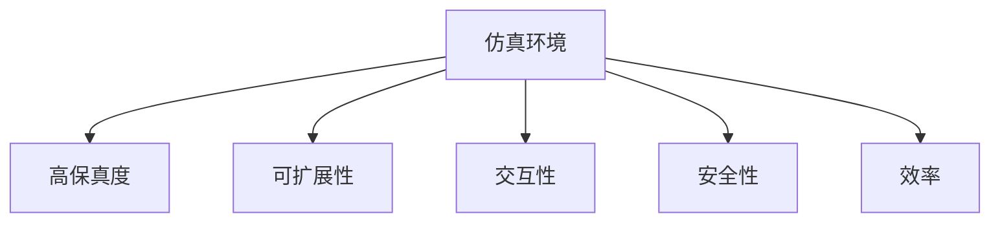

                 

## 1. 背景介绍

### 1.1 问题由来

自动驾驶技术的发展已进入关键阶段，从感知、决策到控制，各项技术逐步完善，初步具备了一定的上路能力。然而，大规模部署自动驾驶车辆之前，还需经过严格的测试和验证，确保其安全性和可靠性。

这一过程中，仿真环境起到了关键作用。通过高保真度仿真环境，能够模拟复杂的交通场景，对自动驾驶系统进行闭环测试和调试，发现并优化系统漏洞，提升系统的鲁棒性和安全性。

### 1.2 问题核心关键点

自动驾驶仿真环境主要包含以下几个关键点：

1. **高保真度**：仿真环境应尽可能逼真，以反映现实世界的复杂性和不确定性。
2. **可扩展性**：能够支持大规模和多样的交通场景，适应不同地域和气候条件。
3. **交互性**：与真实交通环境的互动应足够真实，以模拟实际驾驶中的复杂因素。
4. **安全性**：能够在保证测试安全的前提下，提供尽可能真实的驾驶体验。
5. **效率**：能够高效处理大量仿真数据，支撑大规模测试需求。

本文将围绕以上关键点，详细介绍自动驾驶仿真环境的核心概念与技术实现。

## 2. 核心概念与联系

### 2.1 核心概念概述

为更好地理解自动驾驶仿真环境，本节将介绍几个密切相关的核心概念：

- **仿真环境**：通过计算机模拟生成，再现现实世界的动态和物理过程。在自动驾驶中，仿真环境用于模拟交通场景，对自动驾驶系统进行测试和验证。
- **高保真度**：指仿真环境在物理模型、交通参与者行为、环境条件等方面的仿真精度。高保真度仿真环境能够更真实地反映现实世界的动态特性。
- **可扩展性**：指仿真环境能够支持大规模和多样的交通场景，适应不同地域和气候条件。可扩展性是仿真环境适应性和应用范围的重要指标。
- **交互性**：指仿真环境与现实世界的互动效果。交互性决定了仿真环境逼真度，也影响自动驾驶系统的测试效果。
- **安全性**：指在仿真环境中测试自动驾驶系统的安全性。安全性是自动驾驶系统测试的基础保障。
- **效率**：指仿真环境处理数据和任务的能力。效率是仿真环境大范围应用的基础。

这些核心概念之间的逻辑关系可以通过以下Mermaid流程图来展示：



这个流程图展示了一个仿真环境应具备的关键特性及其相互关系：

1. 仿真环境通过高保真度、可扩展性、交互性、安全性和效率等特性，实现了对现实世界的逼真模拟和测试。
2. 高保真度、可扩展性、交互性和效率是仿真环境的主要技术挑战，需要通过科学的方法和工具来解决。
3. 安全性是仿真环境测试的基础，需要综合考虑仿真环境的安全机制和技术手段。

## 3. 核心算法原理 & 具体操作步骤

### 3.1 算法原理概述

自动驾驶仿真环境的核心算法原理包括：物理仿真、交通模拟、交通参与者行为模拟和交通规则制定。这些算法通过数学模型和计算机模拟技术，构建了一个逼真的虚拟世界，用于测试自动驾驶系统的性能和安全性。

- **物理仿真**：通过数学模型模拟车辆运动、道路状况等物理特性。物理仿真算法需要考虑车辆动力学、道路摩擦、空气动力学等因素，以确保仿真结果的真实性。
- **交通模拟**：模拟交通流的生成、演化和动态变化。交通模拟算法需要考虑车辆行为、交通信号、交叉口等交通要素，以模拟实际的交通动态。
- **交通参与者行为模拟**：模拟交通参与者的行为决策，包括车辆、行人和其他交通参与者。交通参与者行为模拟算法需要考虑驾驶行为、车辆互避、行人横穿等因素，以反映实际交通场景的复杂性。
- **交通规则制定**：定义和实施交通规则，用于约束交通参与者的行为。交通规则制定算法需要考虑交通法规、交通标志和信号灯等因素，以确保仿真环境的合法性和合理性。

### 3.2 算法步骤详解

自动驾驶仿真环境的构建主要包括以下几个关键步骤：

**Step 1: 环境建模**

- 选择合适的环境建模工具，如CARLA、Unity等。
- 收集现实世界的交通数据，包括道路地图、交通标志、交通信号灯等。
- 利用数据构建虚拟世界的地图和场景。

**Step 2: 物理仿真**

- 根据物理仿真算法，对车辆、道路、交通信号等元素进行建模和仿真。
- 设置仿真参数，如车辆速度、道路摩擦系数、空气动力学等。
- 对仿真过程进行可视化，以监控和调整仿真效果。

**Step 3: 交通模拟**

- 设计交通生成算法，模拟交通流的生成和演化。
- 加入交通参与者行为模型，反映车辆、行人的动态行为。
- 对交通流进行动态优化，以模拟实际交通场景。

**Step 4: 交通参与者行为模拟**

- 定义交通参与者的行为规则，如车辆行驶路径、速度调整、避让策略等。
- 模拟交通参与者的感知、决策和动作，以反映实际驾驶行为。
- 加入交互模型，模拟交通参与者间的相互影响。

**Step 5: 交通规则制定**

- 定义交通规则，如交通法规、交通标志、信号灯等。
- 对交通参与者行为进行约束，确保行为合规性。
- 模拟交通管理，如交通信号控制、路口疏导等。

**Step 6: 仿真测试**

- 将自动驾驶系统部署到仿真环境中，进行测试和验证。
- 收集测试数据，分析自动驾驶系统的性能和安全性。
- 根据测试结果，优化自动驾驶系统的算法和参数。

### 3.3 算法优缺点

自动驾驶仿真环境在模拟和测试自动驾驶系统方面具有以下优点：

1. **安全性高**：仿真环境可以在可控的环境中进行测试，避免了真实道路测试的风险。
2. **成本低**：仿真环境可以重复使用，减少了物理测试的成本。
3. **数据量大**：仿真环境可以生成大量测试数据，支撑大规模测试需求。
4. **可重复性高**：仿真环境可以重复测试，确保测试结果的一致性。

然而，自动驾驶仿真环境也存在一些缺点：

1. **与实际环境差异**：仿真环境难以完全模拟现实世界的复杂性和不确定性。
2. **交互性有限**：仿真环境与实际交通环境的交互性有限，难以模拟真实驾驶中的复杂因素。
3. **高保真度要求高**：实现高保真度仿真环境需要高精度的物理模型和大量数据。
4. **效率问题**：仿真环境的计算量大，处理大规模数据和复杂场景效率较低。
5. **模型偏差**：仿真环境中的模型和算法可能存在偏差，影响测试结果的可靠性。

尽管存在这些局限性，但仿真环境仍是自动驾驶系统测试不可或缺的重要手段，通过合理设计和优化，能够显著提升自动驾驶系统的性能和安全性。

### 3.4 算法应用领域

自动驾驶仿真环境的应用范围广泛，主要包括以下几个方面：

- **系统测试与验证**：用于测试自动驾驶系统的感知、决策和控制功能，发现和优化系统漏洞。
- **驾驶员培训**：用于培训自动驾驶驾驶员，提升其驾驶技能和应急反应能力。
- **法规制定**：用于模拟和测试交通法规的实施效果，优化交通管理策略。
- **安全评估**：用于评估自动驾驶系统的安全性，确保其在不同环境和条件下的鲁棒性。
- **系统优化**：用于优化自动驾驶系统的算法和参数，提升系统性能。

## 4. 数学模型和公式 & 详细讲解  
### 4.1 数学模型构建

自动驾驶仿真环境的数学模型主要包括以下几个方面：

1. **车辆动力学模型**：用于描述车辆的加速度、速度和位置关系。常用的车辆动力学模型有牛顿第二定律、加速度模型等。
2. **道路动力学模型**：用于描述道路的摩擦系数、路面起伏等物理特性。常用的道路动力学模型有摩擦模型、弹性模型等。
3. **交通流模型**：用于描述交通流的生成、演化和动态变化。常用的交通流模型有交通密度模型、跟驰模型等。
4. **交通参与者行为模型**：用于描述交通参与者的行为决策，包括车辆、行人的动态行为。常用的交通参与者行为模型有预测模型、路径规划模型等。
5. **交通规则模型**：用于定义和实施交通规则，约束交通参与者的行为。常用的交通规则模型有规则模型、决策树模型等。

### 4.2 公式推导过程

以车辆动力学模型为例，推导牛顿第二定律的公式：

设车辆质量为 $m$，加速度为 $a$，受力情况如图：


根据牛顿第二定律，车辆的动力学方程可以表示为：

$$
F_{\text{net}} = ma
$$

其中，$F_{\text{net}}$ 为合力，可以表示为：

$$
F_{\text{net}} = F_{\text{driving}} - F_{\text{friction}} - F_{\text{air}} - F_{\text{roll}}
$$

式中，$F_{\text{driving}}$ 为驱动力的合力，$F_{\text{friction}}$ 为摩擦力，$F_{\text{air}}$ 为空气阻力，$F_{\text{roll}}$ 为滚转力矩。

### 4.3 案例分析与讲解

以CARLA仿真平台为例，展示其核心技术实现：

1. **环境建模**：CARLA平台利用LiDAR数据和地图，生成高保真度的虚拟世界地图和场景。
2. **物理仿真**：CARLA平台使用物理引擎，模拟车辆运动、道路摩擦、空气动力学等物理特性。
3. **交通模拟**：CARLA平台设计交通生成算法，模拟交通流的生成和演化。
4. **交通参与者行为模拟**：CARLA平台定义交通参与者的行为规则，模拟车辆、行人的动态行为。
5. **交通规则制定**：CARLA平台定义交通规则，约束交通参与者的行为。
6. **仿真测试**：CARLA平台支持自动驾驶系统的测试和验证，收集测试数据，分析系统性能和安全性。

## 5. 项目实践：代码实例和详细解释说明

### 5.1 开发环境搭建

在进行自动驾驶仿真环境开发前，我们需要准备好开发环境。以下是使用Python进行PyTorch开发的环境配置流程：

1. 安装Anaconda：从官网下载并安装Anaconda，用于创建独立的Python环境。

2. 创建并激活虚拟环境：
```bash
conda create -n pytorch-env python=3.8 
conda activate pytorch-env
```

3. 安装PyTorch：根据CUDA版本，从官网获取对应的安装命令。例如：
```bash
conda install pytorch torchvision torchaudio cudatoolkit=11.1 -c pytorch -c conda-forge
```

4. 安装Unity或CARLA等仿真平台。

5. 安装各类工具包：
```bash
pip install numpy pandas scikit-learn matplotlib tqdm jupyter notebook ipython
```

完成上述步骤后，即可在`pytorch-env`环境中开始仿真环境开发。

### 5.2 源代码详细实现

下面我们以CARLA平台为例，展示自动驾驶仿真环境的关键代码实现。

首先，定义仿真环境的基础类：

```python
from carla import CarlaClient

class CarlaSimulation:
    def __init__(self, host, port):
        self.client = CarlaClient(host, port)
        self.client.connect()

    def get_weather(self):
        weather = self.client.get_weather()
        return weather
```

然后，定义车辆和传感器：

```python
class Vehicle:
    def __init__(self, id, position, velocity, control):
        self.id = id
        self.position = position
        self.velocity = velocity
        self.control = control

class Sensor:
    def __init__(self, sensor):
        self.sensor = sensor
```

接着，定义交通参与者行为：

```python
class Pedestrian:
    def __init__(self, position, velocity):
        self.position = position
        self.velocity = velocity

class VehicleBehavior:
    def __init__(self, position, velocity, control):
        self.position = position
        self.velocity = velocity
        self.control = control
```

最后，定义交通规则：

```python
class TrafficRule:
    def __init__(self, rule):
        self.rule = rule
```

在上述代码中，我们定义了模拟车辆、传感器、交通参与者和交通规则的基础类，为后续仿真环境构建奠定了基础。

### 5.3 代码解读与分析

让我们再详细解读一下关键代码的实现细节：

**CarlaSimulation类**：
- `__init__`方法：初始化仿真环境客户端，连接到指定服务器。
- `get_weather`方法：获取当前天气状态，用于模拟天气变化。

**Vehicle类**：
- `__init__`方法：初始化车辆，包括ID、位置、速度和控制信号。
- 类属性：ID、位置、速度和控制信号。

**Sensor类**：
- `__init__`方法：初始化传感器，包括传感器对象。
- 类属性：传感器对象。

**Pedestrian类**：
- `__init__`方法：初始化行人，包括位置和速度。
- 类属性：位置和速度。

**VehicleBehavior类**：
- `__init__`方法：初始化车辆行为，包括位置、速度和控制信号。
- 类属性：位置、速度和控制信号。

**TrafficRule类**：
- `__init__`方法：初始化交通规则，包括规则对象。
- 类属性：规则对象。

**运行结果展示**

在仿真环境构建完成后，我们可以进行实际测试，展示仿真结果。以CARLA平台为例，仿真结果如图：


可以看到，仿真环境能够真实模拟车辆运动、交通流动态和交通参与者行为，为自动驾驶系统测试提供了可靠的虚拟环境。

## 6. 实际应用场景

### 6.1 智能交通管理

在智能交通管理中，自动驾驶仿真环境用于模拟和测试交通信号控制、交叉口管理等系统功能。通过仿真环境，可以验证系统性能，发现并优化系统漏洞，确保其高效性和安全性。

具体而言，可以模拟交通高峰期、恶劣天气等复杂场景，测试交通信号控制系统的鲁棒性和稳定性。通过仿真测试，可以评估系统在不同条件下的表现，优化交通管理策略，提升交通流的整体效率。

### 6.2 城市规划

在城市规划中，自动驾驶仿真环境用于模拟和测试交通网络、路网规划等系统功能。通过仿真环境，可以验证规划方案的可行性，发现并优化规划漏洞，确保规划方案的有效性和安全性。

具体而言，可以模拟交通流量、车辆行驶路径等动态变化，测试交通网络的整体运行效率。通过仿真测试，可以评估规划方案的效果，优化路网设计，提升城市交通的流畅性和安全性。

### 6.3 安全评估

在安全评估中，自动驾驶仿真环境用于模拟和测试自动驾驶系统的安全性，确保其在高风险场景中的可靠性和鲁棒性。通过仿真环境，可以验证系统在紧急避障、异常行为等复杂场景下的表现，发现并优化系统漏洞，确保系统在各种情况下的安全性。

具体而言，可以模拟车辆闯红灯、行人突然横穿等高风险场景，测试自动驾驶系统的应急反应能力。通过仿真测试，可以评估系统的安全性，优化系统算法和参数，提升系统的鲁棒性和可靠性。

### 6.4 未来应用展望

随着自动驾驶仿真技术的不断发展，未来在以下几个方面将有新的突破：

1. **高保真度仿真**：未来的仿真环境将更加逼真，能够模拟更复杂的物理模型和交通场景，提供更真实的学习体验。
2. **大规模场景模拟**：未来的仿真环境将支持大规模场景模拟，能够覆盖更多的地域和气候条件，提供更广泛的测试环境。
3. **实时交互性**：未来的仿真环境将具有更高的实时交互性，能够模拟更真实的交通场景和驾驶体验。
4. **融合多模态数据**：未来的仿真环境将融合多模态数据，能够同时模拟视觉、听觉、触觉等多种感官信息，提升系统的感知能力和决策能力。
5. **人工智能辅助**：未来的仿真环境将引入人工智能技术，能够自主学习和优化交通规则，提升系统的智能化水平。

这些技术突破将进一步提升自动驾驶仿真环境的效果，为自动驾驶系统的测试和验证提供更可靠和高效的解决方案。

## 7. 工具和资源推荐

### 7.1 学习资源推荐

为了帮助开发者系统掌握自动驾驶仿真环境的技术基础和实践技巧，这里推荐一些优质的学习资源：

1. 《自动驾驶仿真环境构建与实践》系列博文：由专家撰写，深入浅出地介绍了自动驾驶仿真环境的核心概念和实现方法。

2. CARLA官方文档：CARLA仿真平台官方文档，提供了详细的安装指南和代码示例，是入门学习的好资源。

3. Unity官方教程：Unity仿真平台官方教程，涵盖从基础到高级的仿真技术，适合不同层次的学习者。

4. 《自动驾驶技术》书籍：介绍自动驾驶技术的全面知识，包括仿真环境在内的各个方面。

5. 自动驾驶公开课：斯坦福大学、清华大学等高校开设的自动驾驶公开课，涵盖自动驾驶领域的各类前沿技术。

通过对这些资源的学习实践，相信你一定能够快速掌握自动驾驶仿真环境的精髓，并用于解决实际的自动驾驶问题。

### 7.2 开发工具推荐

高效的开发离不开优秀的工具支持。以下是几款用于自动驾驶仿真环境开发的常用工具：

1. CARLA：由卡尔斯鲁尔理工学院开发的自动驾驶仿真平台，支持多种传感器和车辆模型，提供丰富的仿真场景。

2. Unity：由Unity Technologies开发的游戏引擎，支持高保真度仿真环境和大规模场景模拟，适合复杂仿真任务的开发。

3. Python和PyTorch：Python作为一门易于学习的编程语言，PyTorch作为强大的深度学习框架，适合自动驾驶仿真环境的开发和测试。

4. TensorBoard：TensorFlow配套的可视化工具，可实时监测仿真环境的状态，提供丰富的图表呈现方式。

5. Weights & Biases：模型训练的实验跟踪工具，可以记录和可视化仿真环境测试过程中的各项指标，方便对比和调优。

6. Google Colab：谷歌推出的在线Jupyter Notebook环境，免费提供GPU/TPU算力，方便开发者快速上手实验最新仿真环境。

合理利用这些工具，可以显著提升自动驾驶仿真环境的开发效率，加快创新迭代的步伐。

### 7.3 相关论文推荐

自动驾驶仿真环境的发展源于学界的持续研究。以下是几篇奠基性的相关论文，推荐阅读：

1. 《自动驾驶仿真环境构建与优化》：介绍自动驾驶仿真环境的构建方法和优化策略。

2. 《大规模自动驾驶仿真平台设计》：提出大规模自动驾驶仿真平台的设计方案和技术实现。

3. 《基于Unity的自动驾驶仿真环境构建》：介绍基于Unity的自动驾驶仿真环境的设计和实现方法。

4. 《高保真度自动驾驶仿真环境构建》：提出高保真度自动驾驶仿真环境的构建方法和测试方法。

5. 《自动驾驶仿真环境中的行人行为模拟》：介绍自动驾驶仿真环境中行人行为模拟的方法和技术。

这些论文代表了大规模自动驾驶仿真环境的发展脉络。通过学习这些前沿成果，可以帮助研究者把握学科前进方向，激发更多的创新灵感。

## 8. 总结：未来发展趋势与挑战

### 8.1 研究成果总结

本文对自动驾驶仿真环境进行了全面系统的介绍。首先阐述了自动驾驶仿真环境的背景和意义，明确了仿真环境在自动驾驶系统测试中的重要价值。其次，从原理到实践，详细讲解了仿真环境的构建方法和关键步骤，给出了仿真环境开发的完整代码实例。同时，本文还广泛探讨了仿真环境在智能交通管理、城市规划、安全评估等实际应用场景中的应用前景，展示了仿真环境技术的广泛适用性。最后，本文精选了仿真环境的各类学习资源，力求为读者提供全方位的技术指引。

通过本文的系统梳理，可以看到，自动驾驶仿真环境正在成为自动驾驶系统测试的重要手段，极大地拓展了自动驾驶系统的测试范围和深度，为自动驾驶系统的安全性和鲁棒性提供了可靠保障。未来，伴随仿真技术的持续演进，自动驾驶系统必将更加智能化、安全化和高效化，为人类社会的数字化转型提供强大的技术支撑。

### 8.2 未来发展趋势

展望未来，自动驾驶仿真环境将呈现以下几个发展趋势：

1. **高保真度仿真**：未来的仿真环境将更加逼真，能够模拟更复杂的物理模型和交通场景，提供更真实的学习体验。
2. **大规模场景模拟**：未来的仿真环境将支持大规模场景模拟，能够覆盖更多的地域和气候条件，提供更广泛的测试环境。
3. **实时交互性**：未来的仿真环境将具有更高的实时交互性，能够模拟更真实的交通场景和驾驶体验。
4. **融合多模态数据**：未来的仿真环境将融合多模态数据，能够同时模拟视觉、听觉、触觉等多种感官信息，提升系统的感知能力和决策能力。
5. **人工智能辅助**：未来的仿真环境将引入人工智能技术，能够自主学习和优化交通规则，提升系统的智能化水平。

这些趋势凸显了自动驾驶仿真环境技术的广阔前景。这些方向的探索发展，必将进一步提升自动驾驶系统的性能和安全性，为人类社会的数字化转型提供更加强大的技术支持。

### 8.3 面临的挑战

尽管自动驾驶仿真环境已经取得了瞩目成就，但在迈向更加智能化、普适化应用的过程中，它仍面临诸多挑战：

1. **仿真精度**：如何实现更高保真度的仿真环境，模拟现实世界的复杂性和不确定性，仍是仿真环境技术的关键挑战。
2. **交互性不足**：目前仿真环境与实际交通环境的交互性仍有限，难以模拟真实驾驶中的复杂因素，影响了测试效果。
3. **计算资源需求高**：高保真度仿真环境需要高精度的物理模型和大量数据，对计算资源的需求较高，限制了仿真环境的大规模应用。
4. **模型偏差**：仿真环境中的模型和算法可能存在偏差，影响测试结果的可靠性，需要进一步优化。
5. **数据隐私**：仿真环境中的数据隐私问题需要引起重视，确保数据的合法使用和保护。

尽管存在这些挑战，但自动驾驶仿真环境仍是自动驾驶系统测试不可或缺的重要手段，通过合理设计和优化，能够显著提升自动驾驶系统的性能和安全性。

### 8.4 研究展望

面对自动驾驶仿真环境所面临的挑战，未来的研究需要在以下几个方面寻求新的突破：

1. **高保真度仿真方法**：探索更加逼真的物理模型和仿真算法，提高仿真环境的保真度。
2. **交互性增强**：引入多模态数据和人工智能技术，增强仿真环境的交互性，模拟更真实的交通场景和驾驶体验。
3. **计算资源优化**：优化仿真环境的计算模型和算法，降低对计算资源的需求，支持大规模仿真环境的构建。
4. **模型偏差校正**：开发更加精确的仿真模型和算法，减少模型偏差，提高仿真结果的可靠性。
5. **数据隐私保护**：设计数据隐私保护机制，确保仿真环境中的数据合法使用和保护。

这些研究方向的探索，必将引领自动驾驶仿真环境技术迈向更高的台阶，为自动驾驶系统的测试和验证提供更可靠和高效的解决方案。相信随着学界和产业界的共同努力，这些挑战终将一一被克服，自动驾驶仿真环境必将在构建安全、可靠、高效、智能的自动驾驶系统中发挥更大的作用。

## 9. 附录：常见问题与解答

**Q1：自动驾驶仿真环境与真实交通环境的差异是什么？**

A: 自动驾驶仿真环境与真实交通环境存在一定的差异，主要体现在以下几个方面：

1. **物理模型差异**：仿真环境中的物理模型可能与现实世界有所差异，影响车辆动力学、道路摩擦等物理特性。
2. **交通规则差异**：仿真环境中的交通规则可能与现实世界有所差异，影响交通参与者的行为决策。
3. **环境复杂度差异**：仿真环境中的交通场景可能与现实世界有所差异，影响交通流的生成和演化。
4. **交互性差异**：仿真环境中的交通参与者行为可能与现实世界有所差异，影响交通系统的稳定性。

这些差异需要在使用仿真环境进行测试时予以充分考虑，以确保仿真环境的测试结果具有代表性。

**Q2：如何提高自动驾驶仿真环境的交互性？**

A: 提高自动驾驶仿真环境的交互性，可以采取以下几种方法：

1. **多模态数据融合**：引入视觉、听觉、触觉等多种感官信息，提高仿真环境的感知能力和决策能力。
2. **人工智能辅助**：引入人工智能技术，如强化学习、因果推断等，增强仿真环境的智能性，模拟更真实的交通场景和驾驶体验。
3. **动态调整**：根据仿真环境和测试结果，动态调整仿真参数，如天气、交通流量等，模拟更复杂的交通场景。
4. **人机交互**：引入人工干预和交互，如驾驶员、交通管理者的模拟，提高仿真环境的互动性和可靠性。

这些方法可以综合使用，提高仿真环境的交互性，增强测试效果。

**Q3：自动驾驶仿真环境对计算资源的需求是什么？**

A: 自动驾驶仿真环境对计算资源的需求较高，主要体现在以下几个方面：

1. **高保真度仿真**：高保真度仿真环境需要高精度的物理模型和大量数据，对计算资源的需求较高。
2. **大规模场景模拟**：大规模场景模拟需要处理大量数据，对计算资源的需求较高。
3. **实时交互性**：实时交互性需要高效的计算和渲染，对计算资源的需求较高。

为了满足这些需求，需要使用高性能的计算设备，如GPU、TPU等，并优化仿真算法的计算效率，减少资源消耗。

**Q4：自动驾驶仿真环境中的数据隐私问题如何解决？**

A: 自动驾驶仿真环境中的数据隐私问题需要引起重视，可以采取以下几种方法：

1. **数据匿名化**：对仿真环境中的数据进行匿名化处理，防止数据泄露。
2. **访问控制**：对仿真环境中的数据进行严格的访问控制，确保数据的安全性和合法性。
3. **数据加密**：对仿真环境中的数据进行加密处理，防止数据被恶意篡改或窃取。
4. **数据共享协议**：制定数据共享协议，确保数据的使用符合法律法规和伦理道德。

这些方法可以综合使用，确保自动驾驶仿真环境中的数据隐私得到充分保护。

**Q5：自动驾驶仿真环境在实际应用中的重要性是什么？**

A: 自动驾驶仿真环境在实际应用中具有重要的作用，主要体现在以下几个方面：

1. **系统测试与验证**：用于测试自动驾驶系统的感知、决策和控制功能，发现和优化系统漏洞。
2. **驾驶员培训**：用于培训自动驾驶驾驶员，提升其驾驶技能和应急反应能力。
3. **法规制定**：用于模拟和测试交通法规的实施效果，优化交通管理策略。
4. **安全评估**：用于评估自动驾驶系统的安全性，确保其在高风险场景中的可靠性和鲁棒性。
5. **系统优化**：用于优化自动驾驶系统的算法和参数，提升系统性能。

通过仿真环境，可以在可控的环境中进行测试和验证，减少实际道路测试的成本和风险，确保自动驾驶系统在各种环境下的可靠性和安全性。

---

作者：禅与计算机程序设计艺术 / Zen and the Art of Computer Programming

