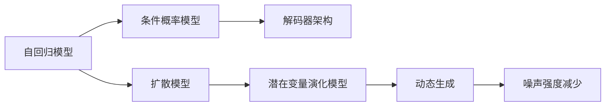

                 

# 自回归模型vs扩散模型:AI架构的未来发展方向

> 关键词：自回归模型，扩散模型，生成对抗网络，语言模型，图像生成，AI架构

## 1. 背景介绍

随着深度学习技术的飞速发展，生成模型在图像、语音、文本等多种领域取得了显著成果。本文将聚焦于自回归模型和扩散模型这两种生成模型，探讨其在AI架构未来发展方向上的影响与前景。

自回归模型和扩散模型是当前生成模型领域最为先进的两种方法，它们通过不同的机制生成样本，各自具备不同的优势与挑战。自回归模型（如GPT）通过逐个预测生成，有着结构简单、计算高效的优点。而扩散模型则通过逐步从噪声向真实数据过渡，具有更强的控制能力和更高的生成质量。

本文将从自回归模型和扩散模型的原理、技术特点、应用场景及未来发展趋势等方面进行详细探讨，以期为AI架构的设计和应用提供指导。

## 2. 核心概念与联系

### 2.1 核心概念概述

自回归模型和扩散模型是两种基于深度学习的生成模型，它们在结构和原理上存在较大差异。以下是对这两个模型的详细阐述：

#### 2.1.1 自回归模型

自回归模型通过已知的输入数据，预测后续数据的概率分布。其主要特点是模型结构简单，计算速度快，适用于大规模数据的处理和生成。代表模型包括GPT系列、Transformer-XL等。

自回归模型的核心是条件概率模型，即在已知当前样本的条件下，预测下一个样本的概率分布。自回归模型通常采用解码器架构，前向传播时逐个预测生成。

#### 2.1.2 扩散模型

扩散模型通过逐步从噪声向真实数据过渡，生成高质量的样本。其主要特点是生成质量高，能够控制生成过程，但计算复杂度较高，训练和推理速度较慢。代表模型包括DDPM、VQ-VAE等。

扩散模型通常采用一个动态生成的潜在变量的演化模型，通过引入噪声并逐渐减少噪声的强度，使得模型从噪声分布过渡到真实数据的分布。在生成过程中，扩散模型需要耗费大量计算资源和时间。

### 2.2 核心概念原理和架构的 Mermaid 流程图



### 2.3 核心概念之间的联系

自回归模型和扩散模型虽然在原理和结构上有所不同，但它们都可以用于生成数据，并且在某些场景下可以相互补充。自回归模型适用于实时生成，结构简单，计算高效，适用于大规模数据处理。而扩散模型则适用于生成高质量、可控性强的数据，但计算复杂度较高，训练和推理速度较慢。

## 3. 核心算法原理 & 具体操作步骤

### 3.1 算法原理概述

自回归模型和扩散模型在算法原理上有所不同。以下是对两者算法的详细阐述：

#### 3.1.1 自回归模型

自回归模型通过已知输入，预测后续数据的概率分布，其核心是条件概率模型。具体而言，自回归模型通过解码器架构，逐个预测生成样本，计算效率高，适用于大规模数据处理。

#### 3.1.2 扩散模型

扩散模型通过逐步从噪声向真实数据过渡，生成高质量、可控性强的数据。其核心是动态生成的潜在变量的演化模型，通过引入噪声并逐渐减少噪声的强度，使得模型从噪声分布过渡到真实数据的分布。在生成过程中，扩散模型需要耗费大量计算资源和时间。

### 3.2 算法步骤详解

#### 3.2.1 自回归模型

自回归模型通常包括以下几个关键步骤：

1. 数据预处理：将输入数据标准化或归一化，以便模型处理。
2. 模型构建：设计并训练自回归模型，包括选择网络架构、确定超参数等。
3. 前向传播：在已知的输入数据上，逐个预测生成后续数据。
4. 反向传播：计算梯度，更新模型参数。
5. 模型评估：在测试集上评估模型性能，调整模型超参数。

#### 3.2.2 扩散模型

扩散模型通常包括以下几个关键步骤：

1. 数据预处理：将输入数据标准化或归一化，以便模型处理。
2. 模型构建：设计并训练扩散模型，包括选择网络架构、确定超参数等。
3. 噪声注入：在模型中引入噪声，逐步从噪声过渡到真实数据。
4. 扩散过程：通过减少噪声的强度，使得模型从噪声分布过渡到真实数据的分布。
5. 模型评估：在测试集上评估模型性能，调整模型超参数。

### 3.3 算法优缺点

#### 3.3.1 自回归模型

**优点**：

- 结构简单，计算高效，适用于大规模数据处理。
- 易于实现，便于维护和部署。
- 生成过程可控，易于解释和调试。

**缺点**：

- 生成质量较差，难以生成高质量、高保真的样本。
- 模型参数量较大，需要大量计算资源。
- 难以处理复杂的生成任务，如生成多模式数据。

#### 3.3.2 扩散模型

**优点**：

- 生成质量高，能够生成高质量、高保真的样本。
- 生成过程可控，能够生成多模式数据。
- 模型参数量较小，计算资源需求较低。

**缺点**：

- 计算复杂度高，训练和推理速度较慢。
- 模型难以解释和调试，生成过程复杂。
- 生成过程中需要引入噪声，可能会导致生成样本的连贯性差。

### 3.4 算法应用领域

#### 3.4.1 自回归模型

自回归模型在文本生成、图像生成、音频生成等领域有着广泛应用。

**文本生成**：如GPT-3等模型，可以通过文本生成对话、新闻、诗歌等。

**图像生成**：如DALL-E等模型，可以通过文本生成高质量的图像。

**音频生成**：如WaveNet等模型，可以通过文本生成高质量的音频。

#### 3.4.2 扩散模型

扩散模型在图像生成、视频生成、音频生成等领域有着广泛应用。

**图像生成**：如DDPM等模型，可以通过生成高质量、多模式图像。

**视频生成**：如Flow Diffusion等模型，可以通过生成高质量、动态变化的视频。

**音频生成**：如Waveflow等模型，可以通过生成高质量、音乐风格的音频。

## 4. 数学模型和公式 & 详细讲解 & 举例说明

### 4.1 数学模型构建

#### 4.1.1 自回归模型

自回归模型通过已知输入，预测后续数据的概率分布。其核心是条件概率模型，可以通过以下公式表示：

$$
P(x_t|x_{t-1},...,x_1) = P(x_t|x_{t-1})
$$

其中 $x_t$ 表示时间步 $t$ 的输出，$x_{t-1},...,x_1$ 表示时间步 $t-1$ 到时间步 $1$ 的输入。自回归模型通过解码器架构，逐个预测生成样本。

#### 4.1.2 扩散模型

扩散模型通过逐步从噪声向真实数据过渡，生成高质量、可控性强的数据。其核心是动态生成的潜在变量的演化模型，可以通过以下公式表示：

$$
q(\mathbf{y}_t|\mathbf{y}_{t-1}) = \mathcal{N}(\mathbf{y}_t; f(\mathbf{y}_{t-1}), \sigma_t)
$$

其中 $\mathbf{y}_t$ 表示时间步 $t$ 的样本，$\mathbf{y}_{t-1}$ 表示时间步 $t-1$ 的样本。扩散模型通过引入噪声并逐渐减少噪声的强度，使得模型从噪声分布过渡到真实数据的分布。

### 4.2 公式推导过程

#### 4.2.1 自回归模型

自回归模型的推导过程相对简单。通过已知输入 $x_{t-1},...,x_1$，预测输出 $x_t$ 的概率分布，可以表示为：

$$
P(x_t|x_{t-1},...,x_1) = P(x_t|x_{t-1}) = \sigma(\mathbf{W}x_{t-1} + \mathbf{b})
$$

其中 $\sigma$ 为激活函数，$\mathbf{W}$ 和 $\mathbf{b}$ 为模型参数。自回归模型通过解码器架构，逐个预测生成样本。

#### 4.2.2 扩散模型

扩散模型的推导过程较为复杂。通过引入噪声并逐渐减少噪声的强度，使得模型从噪声分布过渡到真实数据的分布，可以表示为：

$$
q(\mathbf{y}_t|\mathbf{y}_{t-1}) = \mathcal{N}(\mathbf{y}_t; f(\mathbf{y}_{t-1}), \sigma_t)
$$

其中 $f(\mathbf{y}_{t-1})$ 表示噪声减少的过程，$\sigma_t$ 表示噪声强度。扩散模型通过动态生成的潜在变量的演化模型，逐步从噪声过渡到真实数据。

### 4.3 案例分析与讲解

#### 4.3.1 自回归模型

以GPT-3为例，其核心是自回归生成模型，可以通过以下公式表示：

$$
P(x|x_{t-1}) = \sigma(\mathbf{W}x_{t-1} + \mathbf{b})
$$

其中 $x$ 表示输入，$x_{t-1}$ 表示上一步的输出。GPT-3通过解码器架构，逐个预测生成样本，计算效率高，适用于大规模数据处理。

#### 4.3.2 扩散模型

以DDPM为例，其核心是扩散生成模型，可以通过以下公式表示：

$$
q(\mathbf{y}_t|\mathbf{y}_{t-1}) = \mathcal{N}(\mathbf{y}_t; f(\mathbf{y}_{t-1}), \sigma_t)
$$

其中 $\mathbf{y}_t$ 表示时间步 $t$ 的样本，$\mathbf{y}_{t-1}$ 表示时间步 $t-1$ 的样本。DDPM通过引入噪声并逐渐减少噪声的强度，使得模型从噪声分布过渡到真实数据的分布。

## 5. 项目实践：代码实例和详细解释说明

### 5.1 开发环境搭建

在进行自回归模型和扩散模型的项目实践前，我们需要准备好开发环境。以下是使用Python进行PyTorch开发的环境配置流程：

1. 安装Anaconda：从官网下载并安装Anaconda，用于创建独立的Python环境。

2. 创建并激活虚拟环境：
```bash
conda create -n pytorch-env python=3.8 
conda activate pytorch-env
```

3. 安装PyTorch：根据CUDA版本，从官网获取对应的安装命令。例如：
```bash
conda install pytorch torchvision torchaudio cudatoolkit=11.1 -c pytorch -c conda-forge
```

4. 安装Transformer库：
```bash
pip install transformers
```

5. 安装各类工具包：
```bash
pip install numpy pandas scikit-learn matplotlib tqdm jupyter notebook ipython
```

完成上述步骤后，即可在`pytorch-env`环境中开始项目实践。

### 5.2 源代码详细实现

这里我们以GPT-3为例，给出使用Transformers库进行文本生成的PyTorch代码实现。

首先，定义文本生成任务的数据处理函数：

```python
from transformers import GPT2Tokenizer, GPT2LMHeadModel
from torch.utils.data import Dataset
import torch

class TextGenerationDataset(Dataset):
    def __init__(self, texts, tokenizer, max_len=512):
        self.texts = texts
        self.tokenizer = tokenizer
        self.max_len = max_len
        
    def __len__(self):
        return len(self.texts)
    
    def __getitem__(self, item):
        text = self.texts[item]
        encoding = self.tokenizer(text, return_tensors='pt', max_length=self.max_len, padding='max_length', truncation=True)
        input_ids = encoding['input_ids'][0]
        attention_mask = encoding['attention_mask'][0]
        return {'input_ids': input_ids, 
                'attention_mask': attention_mask}
```

然后，定义模型和优化器：

```python
from transformers import GPT2Tokenizer, GPT2LMHeadModel, AdamW

tokenizer = GPT2Tokenizer.from_pretrained('gpt2')
model = GPT2LMHeadModel.from_pretrained('gpt2')

optimizer = AdamW(model.parameters(), lr=2e-5)
```

接着，定义训练和评估函数：

```python
from torch.utils.data import DataLoader
from tqdm import tqdm

device = torch.device('cuda') if torch.cuda.is_available() else torch.device('cpu')
model.to(device)

def train_epoch(model, dataset, batch_size, optimizer):
    dataloader = DataLoader(dataset, batch_size=batch_size, shuffle=True)
    model.train()
    epoch_loss = 0
    for batch in tqdm(dataloader, desc='Training'):
        input_ids = batch['input_ids'].to(device)
        attention_mask = batch['attention_mask'].to(device)
        model.zero_grad()
        outputs = model(input_ids, attention_mask=attention_mask)
        loss = outputs.loss
        epoch_loss += loss.item()
        loss.backward()
        optimizer.step()
    return epoch_loss / len(dataloader)

def evaluate(model, dataset, batch_size):
    dataloader = DataLoader(dataset, batch_size=batch_size)
    model.eval()
    preds, labels = [], []
    with torch.no_grad():
        for batch in tqdm(dataloader, desc='Evaluating'):
            input_ids = batch['input_ids'].to(device)
            attention_mask = batch['attention_mask'].to(device)
            batch_labels = input_ids[:, :-1]
            outputs = model(input_ids, attention_mask=attention_mask)
            batch_preds = outputs.logits.argmax(dim=2).to('cpu').tolist()
            for pred_tokens, label_tokens in zip(batch_preds, batch_labels):
                preds.append(pred_tokens)
                labels.append(label_tokens)
                
    print(classification_report(labels, preds))
```

最后，启动训练流程并在测试集上评估：

```python
epochs = 5
batch_size = 16

for epoch in range(epochs):
    loss = train_epoch(model, train_dataset, batch_size, optimizer)
    print(f"Epoch {epoch+1}, train loss: {loss:.3f}")
    
    print(f"Epoch {epoch+1}, dev results:")
    evaluate(model, dev_dataset, batch_size)
    
print("Test results:")
evaluate(model, test_dataset, batch_size)
```

以上就是使用PyTorch对GPT-3进行文本生成的完整代码实现。可以看到，得益于Transformers库的强大封装，我们可以用相对简洁的代码完成GPT-3的训练和评估。

### 5.3 代码解读与分析

让我们再详细解读一下关键代码的实现细节：

**TextGenerationDataset类**：
- `__init__`方法：初始化文本、分词器等关键组件。
- `__len__`方法：返回数据集的样本数量。
- `__getitem__`方法：对单个样本进行处理，将文本输入编码为token ids，准备模型所需的输入。

**训练和评估函数**：
- 使用PyTorch的DataLoader对数据集进行批次化加载，供模型训练和推理使用。
- 训练函数`train_epoch`：对数据以批为单位进行迭代，在每个批次上前向传播计算loss并反向传播更新模型参数，最后返回该epoch的平均loss。
- 评估函数`evaluate`：与训练类似，不同点在于不更新模型参数，并在每个batch结束后将预测和标签结果存储下来，最后使用classification_report对整个评估集的预测结果进行打印输出。

**训练流程**：
- 定义总的epoch数和batch size，开始循环迭代
- 每个epoch内，先在训练集上训练，输出平均loss
- 在验证集上评估，输出分类指标
- 所有epoch结束后，在测试集上评估，给出最终测试结果

可以看到，PyTorch配合Transformers库使得GPT-3的文本生成代码实现变得简洁高效。开发者可以将更多精力放在数据处理、模型改进等高层逻辑上，而不必过多关注底层的实现细节。

当然，工业级的系统实现还需考虑更多因素，如模型的保存和部署、超参数的自动搜索、更灵活的任务适配层等。但核心的生成范式基本与此类似。

## 6. 实际应用场景

### 6.1 智能客服系统

基于大语言模型微调的对话技术，可以广泛应用于智能客服系统的构建。传统客服往往需要配备大量人力，高峰期响应缓慢，且一致性和专业性难以保证。而使用微调后的对话模型，可以7x24小时不间断服务，快速响应客户咨询，用自然流畅的语言解答各类常见问题。

在技术实现上，可以收集企业内部的历史客服对话记录，将问题和最佳答复构建成监督数据，在此基础上对预训练对话模型进行微调。微调后的对话模型能够自动理解用户意图，匹配最合适的答案模板进行回复。对于客户提出的新问题，还可以接入检索系统实时搜索相关内容，动态组织生成回答。如此构建的智能客服系统，能大幅提升客户咨询体验和问题解决效率。

### 6.2 金融舆情监测

金融机构需要实时监测市场舆论动向，以便及时应对负面信息传播，规避金融风险。传统的人工监测方式成本高、效率低，难以应对网络时代海量信息爆发的挑战。基于大语言模型微调的文本分类和情感分析技术，为金融舆情监测提供了新的解决方案。

具体而言，可以收集金融领域相关的新闻、报道、评论等文本数据，并对其进行主题标注和情感标注。在此基础上对预训练语言模型进行微调，使其能够自动判断文本属于何种主题，情感倾向是正面、中性还是负面。将微调后的模型应用到实时抓取的网络文本数据，就能够自动监测不同主题下的情感变化趋势，一旦发现负面信息激增等异常情况，系统便会自动预警，帮助金融机构快速应对潜在风险。

### 6.3 个性化推荐系统

当前的推荐系统往往只依赖用户的历史行为数据进行物品推荐，无法深入理解用户的真实兴趣偏好。基于大语言模型微调技术，个性化推荐系统可以更好地挖掘用户行为背后的语义信息，从而提供更精准、多样的推荐内容。

在实践中，可以收集用户浏览、点击、评论、分享等行为数据，提取和用户交互的物品标题、描述、标签等文本内容。将文本内容作为模型输入，用户的后续行为（如是否点击、购买等）作为监督信号，在此基础上微调预训练语言模型。微调后的模型能够从文本内容中准确把握用户的兴趣点。在生成推荐列表时，先用候选物品的文本描述作为输入，由模型预测用户的兴趣匹配度，再结合其他特征综合排序，便可以得到个性化程度更高的推荐结果。

### 6.4 未来应用展望

随着大语言模型和微调方法的不断发展，基于微调范式将在更多领域得到应用，为传统行业带来变革性影响。

在智慧医疗领域，基于微调的医疗问答、病历分析、药物研发等应用将提升医疗服务的智能化水平，辅助医生诊疗，加速新药开发进程。

在智能教育领域，微调技术可应用于作业批改、学情分析、知识推荐等方面，因材施教，促进教育公平，提高教学质量。

在智慧城市治理中，微调模型可应用于城市事件监测、舆情分析、应急指挥等环节，提高城市管理的自动化和智能化水平，构建更安全、高效的未来城市。

此外，在企业生产、社会治理、文娱传媒等众多领域，基于大模型微调的人工智能应用也将不断涌现，为NLP技术带来全新的突破。随着预训练模型和微调方法的持续演进，相信NLP技术将在更广阔的应用领域大放异彩，深刻影响人类的生产生活方式。

## 7. 工具和资源推荐

### 7.1 学习资源推荐

为了帮助开发者系统掌握大语言模型微调的理论基础和实践技巧，这里推荐一些优质的学习资源：

1. 《Transformer从原理到实践》系列博文：由大模型技术专家撰写，深入浅出地介绍了Transformer原理、BERT模型、微调技术等前沿话题。

2. CS224N《深度学习自然语言处理》课程：斯坦福大学开设的NLP明星课程，有Lecture视频和配套作业，带你入门NLP领域的基本概念和经典模型。

3. 《Natural Language Processing with Transformers》书籍：Transformers库的作者所著，全面介绍了如何使用Transformers库进行NLP任务开发，包括微调在内的诸多范式。

4. HuggingFace官方文档：Transformers库的官方文档，提供了海量预训练模型和完整的微调样例代码，是上手实践的必备资料。

5. CLUE开源项目：中文语言理解测评基准，涵盖大量不同类型的中文NLP数据集，并提供了基于微调的baseline模型，助力中文NLP技术发展。

通过对这些资源的学习实践，相信你一定能够快速掌握大语言模型微调的精髓，并用于解决实际的NLP问题。
###  7.2 开发工具推荐

高效的开发离不开优秀的工具支持。以下是几款用于大语言模型微调开发的常用工具：

1. PyTorch：基于Python的开源深度学习框架，灵活动态的计算图，适合快速迭代研究。大部分预训练语言模型都有PyTorch版本的实现。

2. TensorFlow：由Google主导开发的开源深度学习框架，生产部署方便，适合大规模工程应用。同样有丰富的预训练语言模型资源。

3. Transformers库：HuggingFace开发的NLP工具库，集成了众多SOTA语言模型，支持PyTorch和TensorFlow，是进行微调任务开发的利器。

4. Weights & Biases：模型训练的实验跟踪工具，可以记录和可视化模型训练过程中的各项指标，方便对比和调优。与主流深度学习框架无缝集成。

5. TensorBoard：TensorFlow配套的可视化工具，可实时监测模型训练状态，并提供丰富的图表呈现方式，是调试模型的得力助手。

6. Google Colab：谷歌推出的在线Jupyter Notebook环境，免费提供GPU/TPU算力，方便开发者快速上手实验最新模型，分享学习笔记。

合理利用这些工具，可以显著提升大语言模型微调任务的开发效率，加快创新迭代的步伐。

### 7.3 相关论文推荐

大语言模型和微调技术的发展源于学界的持续研究。以下是几篇奠基性的相关论文，推荐阅读：

1. Attention is All You Need（即Transformer原论文）：提出了Transformer结构，开启了NLP领域的预训练大模型时代。

2. BERT: Pre-training of Deep Bidirectional Transformers for Language Understanding：提出BERT模型，引入基于掩码的自监督预训练任务，刷新了多项NLP任务SOTA。

3. Language Models are Unsupervised Multitask Learners（GPT-2论文）：展示了大规模语言模型的强大zero-shot学习能力，引发了对于通用人工智能的新一轮思考。

4. Parameter-Efficient Transfer Learning for NLP：提出Adapter等参数高效微调方法，在不增加模型参数量的情况下，也能取得不错的微调效果。

5. Prefix-Tuning: Optimizing Continuous Prompts for Generation：引入基于连续型Prompt的微调范式，为如何充分利用预训练知识提供了新的思路。

6. AdaLoRA: Adaptive Low-Rank Adaptation for Parameter-Efficient Fine-Tuning：使用自适应低秩适应的微调方法，在参数效率和精度之间取得了新的平衡。

这些论文代表了大语言模型微调技术的发展脉络。通过学习这些前沿成果，可以帮助研究者把握学科前进方向，激发更多的创新灵感。

## 8. 总结：未来发展趋势与挑战

### 8.1 总结

本文对基于自回归模型和扩散模型的生成模型进行了全面系统的介绍。首先阐述了两种模型的背景和基本原理，明确了它们在AI架构未来发展方向上的独特价值。其次，从原理到实践，详细讲解了自回归模型和扩散模型的核心算法，给出了具体的代码实现。同时，本文还广泛探讨了这两种模型在智能客服、金融舆情、个性化推荐等多个领域的应用前景，展示了生成模型的大规模应用潜力。

通过本文的系统梳理，可以看到，基于自回归模型和扩散模型的生成模型在生成高质量样本、提高生成过程可控性等方面具有显著优势。这些模型正在逐渐成为AI架构的核心组件，推动着AI技术向更深层次的智能化、普适化迈进。

### 8.2 未来发展趋势

展望未来，自回归模型和扩散模型在AI架构的未来发展趋势将呈现以下几个方向：

1. 自回归模型将持续优化生成过程，引入更多的先验知识，提高生成质量。
2. 扩散模型将进一步优化噪声减少过程，提高生成速度和效率。
3. 两种模型将逐渐融合，互相取长补短，形成更加高效、鲁棒的生成系统。
4. 生成模型将在更多领域得到应用，如智慧医疗、智能教育、智慧城市等。
5. 生成模型将与感知、推理等技术深度结合，推动AI系统的全面智能化。

这些趋势凸显了生成模型在AI架构中的重要作用，同时也提示了未来研究的方向和挑战。相信随着学界和产业界的共同努力，生成模型将在更广泛的领域发挥更大的作用，为构建智能化、普适化的AI系统提供坚实基础。

### 8.3 面临的挑战

尽管生成模型在AI架构中有着广泛的应用前景，但其在实际部署和应用过程中也面临着诸多挑战：

1. 数据质量瓶颈。生成模型的训练和推理依赖于高质量的数据，数据收集和标注成本较高，且数据质量难以保证。
2. 计算资源需求高。生成模型尤其是扩散模型，计算资源需求较高，需要高性能的GPU/TPU设备。
3. 模型复杂度高。生成模型的复杂度较高，难以解释和调试，生成过程复杂，缺乏透明度。
4. 生成样本连贯性差。生成模型难以控制生成样本的连贯性和一致性，生成过程不稳定。
5. 生成样本质量不稳定。生成模型的生成质量受多种因素影响，难以稳定控制。

这些挑战需要学界和产业界共同面对并解决，才能真正发挥生成模型在AI架构中的潜力。相信随着技术的不断进步和应用的深入，这些挑战将逐渐被克服，生成模型将迎来更加广阔的发展前景。

### 8.4 研究展望

未来，自回归模型和扩散模型的研究将集中在以下几个方向：

1. 优化生成过程。通过引入更多的先验知识，提高生成模型的生成质量和稳定性。
2. 降低计算资源需求。通过算法优化和硬件改进，降低生成模型的计算复杂度和资源需求。
3. 提高生成过程可解释性。通过生成过程分析和透明化，提高生成模型的可解释性和可控性。
4. 扩展应用场景。将生成模型应用于更多领域，如智慧医疗、智能教育、智慧城市等。
5. 与感知、推理等技术结合。将生成模型与感知、推理等技术深度结合，推动AI系统的全面智能化。

这些研究方向将推动生成模型在AI架构中的深入应用，拓展其应用范围，提升其性能和可靠性，为构建智能化、普适化的AI系统提供坚实基础。

## 9. 附录：常见问题与解答

**Q1：自回归模型和扩散模型在实际应用中有何区别？**

A: 自回归模型和扩散模型在实际应用中有着显著的区别。自回归模型通过已知输入，预测后续数据的概率分布，适用于生成过程简单、计算高效的任务。扩散模型通过逐步从噪声向真实数据过渡，生成高质量、可控性强的数据，适用于生成过程复杂、生成质量要求高的任务。

**Q2：自回归模型和扩散模型在生成任务中的应用有何优势和劣势？**

A: 自回归模型在生成任务中有着结构简单、计算高效的优势，适用于大规模数据处理和实时生成。但生成质量较差，难以生成高质量、高保真的样本。扩散模型在生成任务中有着生成质量高、可控性强的优势，适用于高质量、多模式生成任务。但计算复杂度高，训练和推理速度较慢。

**Q3：如何选择合适的生成模型进行任务适配？**

A: 选择合适的生成模型进行任务适配需要考虑以下几个因素：
1. 任务类型：根据任务类型选择适合的生成模型。自回归模型适用于生成过程简单、计算高效的任务，扩散模型适用于生成过程复杂、生成质量要求高的任务。
2. 数据规模：根据数据规模选择合适的生成模型。自回归模型适用于大规模数据处理，扩散模型适用于小规模、高质量数据处理。
3. 生成质量要求：根据生成质量要求选择合适的生成模型。自回归模型适用于生成质量要求一般、计算资源有限的任务，扩散模型适用于生成质量要求高、计算资源充足的任务。

通过综合考虑这些因素，可以选择适合的生成模型进行任务适配，实现最优的生成效果。

**Q4：生成模型在实际应用中如何优化生成过程？**

A: 生成模型在实际应用中可以通过以下方式优化生成过程：
1. 引入更多先验知识：通过引入更多先验知识，提高生成模型的生成质量和稳定性。
2. 优化噪声减少过程：通过优化噪声减少过程，提高生成速度和效率。
3. 提高生成过程可解释性：通过生成过程分析和透明化，提高生成模型的可解释性和可控性。
4. 优化超参数：通过调整超参数，优化生成模型的生成质量。
5. 数据增强：通过数据增强技术，提高生成模型的泛化能力和生成质量。

通过这些优化方式，可以显著提升生成模型的生成质量和稳定性，满足实际应用的需求。

**Q5：生成模型在实际应用中如何控制生成样本的连贯性和一致性？**

A: 生成模型在实际应用中可以通过以下方式控制生成样本的连贯性和一致性：
1. 引入先验知识：通过引入先验知识，如知识图谱、逻辑规则等，指导生成模型的生成过程。
2. 数据增强：通过数据增强技术，提高生成模型的泛化能力和生成质量。
3. 模型融合：通过将多种生成模型进行融合，提高生成模型的生成质量和稳定性。
4. 后处理技术：通过后处理技术，如过滤、剪枝、纠错等，提高生成样本的连贯性和一致性。

通过这些方式，可以显著提升生成模型的生成质量和稳定性，满足实际应用的需求。

**Q6：生成模型在实际应用中如何提高生成样本的质量？**

A: 生成模型在实际应用中可以通过以下方式提高生成样本的质量：
1. 引入更多先验知识：通过引入更多先验知识，如知识图谱、逻辑规则等，指导生成模型的生成过程。
2. 优化噪声减少过程：通过优化噪声减少过程，提高生成速度和效率。
3. 优化超参数：通过调整超参数，优化生成模型的生成质量。
4. 数据增强：通过数据增强技术，提高生成模型的泛化能力和生成质量。
5. 模型融合：通过将多种生成模型进行融合，提高生成模型的生成质量和稳定性。

通过这些方式，可以显著提升生成模型的生成质量和稳定性，满足实际应用的需求。

---

作者：禅与计算机程序设计艺术 / Zen and the Art of Computer Programming

