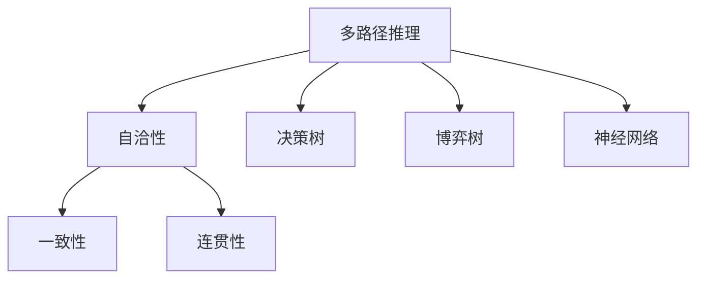
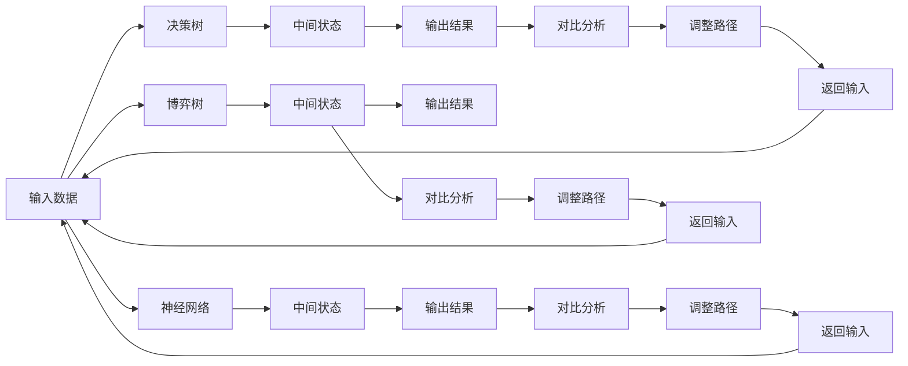

                 

# 自洽性（Self-Consistency）：多路径推理

## 1. 背景介绍

自洽性（Self-Consistency），也常被称为一致性或连贯性，是计算机科学和人工智能领域的一个核心概念。它通常指的是程序、算法或者系统在处理数据、执行计算或者做出决策时，能够始终保持逻辑上的一致性和自足性，即不出现自相矛盾、逻辑不连贯或数据不一致的情况。在多路径推理中，自洽性更为关键，因为程序或算法在执行多个不同路径时，需要确保每个路径的结果都是合理且一致的。

自洽性对于机器学习和人工智能（AI）来说尤为重要，尤其在处理复杂任务时，如自然语言处理（NLP）、视觉识别、机器人控制等，因为它能保证系统输出的准确性和可靠性。而随着深度学习和增强学习技术的发展，多路径推理算法在复杂问题解决中扮演了越来越重要的角色，例如在博弈论、机器翻译、游戏AI、路径规划等场景。因此，理解和应用自洽性在多路径推理中的运用，对于提高AI系统的稳定性和智能决策的准确性具有重要意义。

## 2. 核心概念与联系

### 2.1 核心概念概述

为了更好地理解自洽性在多路径推理中的应用，我们先要介绍一些相关的核心概念：

- **多路径推理（Multi-Path Reasoning）**：是指在面临复杂决策问题时，采用多个可能的路径或策略进行推理，以期望找到最优或次优解的过程。这与单路径决策（如线性规划）不同，它允许算法在多个可能的选择中探索，从而增加发现最优解的可能性。

- **自洽性（Self-Consistency）**：指在多路径推理中，算法或系统能够确保其内部逻辑的一致性和连贯性。即无论选择哪条路径，最终的输出结果应该是合理且一致的。

- **一致性（Consistency）**：虽然与自洽性类似，但更侧重于数据的准确性，即数据中不应存在矛盾或不一致之处。

- **连贯性（Coherence）**：侧重于逻辑或语义上的连贯性，保证推理过程和结论能够合理地符合语言和逻辑规则。

这些概念之间的联系可以通过以下Mermaid流程图来展示：



在这个流程图中，A表示多路径推理，B表示自洽性，C和D分别代表一致性和连贯性。多路径推理可以通过决策树、博弈树和神经网络等技术实现。自洽性则是这些技术在推理过程中的一个重要保证。

### 2.2 核心概念原理和架构的 Mermaid 流程图

以下是自洽性在多路径推理中的详细原理和架构的Mermaid流程图：



在这个流程图中，A表示输入数据，B、E、H表示不同的推理路径或方法，C、F、I表示中间状态，D、G、J表示输出结果。每条路径的输出结果都需要通过一致性检查（K、L、M）和连贯性检查（N、O、P）。如果检查发现问题，就会返回输入（Q、R、S），调整路径以确保最终输出的一致性和连贯性。

## 3. 核心算法原理 & 具体操作步骤

### 3.1 算法原理概述

多路径推理的自洽性算法，主要依赖于以下几个关键原理：

1. **全局一致性约束**：在每个推理步骤中，保证所有路径的输出结果是一致的。
2. **局部连贯性维护**：在每个局部决策中，保证选择当前路径的依据是合理的，与已有决策不会产生冲突。
3. **冲突消解策略**：当多个路径出现不一致时，能够通过冲突消解策略，将不一致结果调整为一致的输出。

### 3.2 算法步骤详解

以下是基于自洽性原理的多路径推理算法的详细步骤：

**Step 1: 初始化数据和路径**
- 确定所有可能的推理路径，并对其进行编号。
- 为每个路径分配初始状态，如决策树节点、博弈状态或神经网络输入。

**Step 2: 执行推理**
- 对每条路径进行依次推理，并记录中间状态。
- 在每个推理步骤中，确保其输出与当前状态保持一致性。

**Step 3: 结果对比**
- 对每个路径的最终输出进行对比，找出不一致之处。
- 如果存在冲突，应用冲突消解策略。

**Step 4: 调整路径**
- 根据冲突消解结果，调整部分推理路径，确保所有路径输出一致。
- 重复Step 2到Step 4，直至所有路径输出一致或达到预设迭代次数。

**Step 5: 输出结果**
- 输出最终一致的结果。

### 3.3 算法优缺点

基于自洽性的多路径推理算法具有以下优点：

- **高一致性**：确保所有路径的输出结果是一致的，减少由于路径冲突导致的错误。
- **鲁棒性**：通过冲突消解策略，能够应对各种不同的输入和环境变化。
- **可扩展性**：适用于多种不同的推理方法，如决策树、博弈树和神经网络等。

同时，该算法也存在一些局限性：

- **计算复杂度高**：需要执行多个路径的推理，并反复调整，计算量较大。
- **冲突消解复杂**：冲突消解策略的实现可能较为复杂，需要根据具体情况设计。
- **资源消耗大**：在多路径推理中，需要占用大量的计算和存储资源。

### 3.4 算法应用领域

自洽性在多路径推理中的应用广泛，涵盖了多个领域：

- **自然语言处理（NLP）**：在机器翻译、问答系统和文本生成中，多路径推理和自洽性能够提高模型的语言理解和生成能力。
- **计算机视觉（CV）**：在图像识别、目标跟踪和场景理解中，多路径推理和自洽性能够提升算法的准确性和鲁棒性。
- **机器人控制**：在路径规划和任务执行中，多路径推理和自洽性能够确保机器人行为的一致性和安全性。
- **金融分析**：在风险评估和交易策略制定中，多路径推理和自洽性能够处理复杂的多变量因素。
- **物流管理**：在路径规划和配送优化中，多路径推理和自洽性能够提高运输效率和准确性。

## 4. 数学模型和公式 & 详细讲解 & 举例说明

### 4.1 数学模型构建

我们以一个简单的决策树为例，构建一个基于自洽性的多路径推理模型。假设我们有两个决策节点A和B，每个节点有两个分支，分别指向两个决策结果。

**Step 1: 定义决策树节点**
- 设决策树节点为 $T=\{N, E\}$，其中 $N$ 表示节点集合，$E$ 表示边集合。
- 假设节点A的两个分支分别指向节点C和D。

**Step 2: 定义节点状态**
- 设节点状态为 $s \in S$，其中 $S$ 表示所有可能的节点状态集合。
- 假设节点C和D的节点状态分别为 $s_C$ 和 $s_D$。

**Step 3: 定义决策规则**
- 设决策规则为 $R=\{r\}$，其中 $r$ 表示所有可能的决策规则集合。
- 假设节点A的决策规则为 $r_A=\{r_1, r_2\}$。

**Step 4: 定义输出结果**
- 设输出结果为 $y \in Y$，其中 $Y$ 表示所有可能的输出结果集合。
- 假设节点C和D的输出结果分别为 $y_C$ 和 $y_D$。

### 4.2 公式推导过程

根据上述定义，我们可以构建如下的自洽性模型：

$$
s_C = f_A(s_A, r_A)
$$

$$
s_D = f_A(s_A, r_B)
$$

$$
y_C = g_C(s_C)
$$

$$
y_D = g_D(s_D)
$$

其中 $f_A$ 和 $g_C$ 表示决策函数和输出函数。自洽性要求 $y_C$ 和 $y_D$ 必须一致，即：

$$
y_C = y_D
$$

### 4.3 案例分析与讲解

假设决策树节点A有两个分支C和D，每个分支分别指向节点C和D。节点C和D的输出分别为 $y_C$ 和 $y_D$。

**案例1: 单路径推理**
- 如果选择节点A-C路径，则最终输出 $y_C$。
- 如果选择节点A-D路径，则最终输出 $y_D$。

由于 $y_C$ 和 $y_D$ 需要保持一致，如果存在冲突，需要应用冲突消解策略。

**案例2: 多路径推理**
- 如果同时选择节点A-C和A-D路径，则需要先判断冲突，如果存在冲突，需要调整路径。

假设节点C的输出为 $y_C=1$，节点D的输出为 $y_D=0$，则存在冲突。此时，可以采用多数投票策略，选择 $y_C=1$ 作为最终输出。

## 5. 项目实践：代码实例和详细解释说明

### 5.1 开发环境搭建

在进行多路径推理的自洽性算法实践前，我们需要准备好开发环境。以下是使用Python进行开发的环境配置流程：

1. 安装Anaconda：从官网下载并安装Anaconda，用于创建独立的Python环境。

2. 创建并激活虚拟环境：
```bash
conda create -n reasoning-env python=3.8 
conda activate reasoning-env
```

3. 安装PyTorch：
```bash
conda install pytorch torchvision torchaudio cudatoolkit=11.1 -c pytorch -c conda-forge
```

4. 安装PySydnet库：
```bash
pip install pysydnet
```

5. 安装其他需要的库：
```bash
pip install numpy pandas scikit-learn matplotlib tqdm jupyter notebook ipython
```

完成上述步骤后，即可在`reasoning-env`环境中开始算法实践。

### 5.2 源代码详细实现

下面是基于决策树的自洽性多路径推理的Python代码实现。

```python
import numpy as np
from sympy import symbols, Eq, solve

# 定义决策树节点和边
class DecisionTree:
    def __init__(self):
        self.nodes = {}
        self.edges = []
        
    def add_node(self, node, parents):
        self.nodes[node] = parents
        
    def add_edge(self, edge):
        self.edges.append(edge)
        
    def get_parents(self, node):
        return self.nodes[node]
        
# 定义节点状态
class NodeState:
    def __init__(self, values):
        self.values = values
        
    def __str__(self):
        return str(self.values)
        
# 定义决策规则
class DecisionRule:
    def __init__(self, rule):
        self.rule = rule
        
    def __str__(self):
        return str(self.rule)
        
# 定义输出结果
class OutputResult:
    def __init__(self, value):
        self.value = value
        
    def __str__(self):
        return str(self.value)
        
# 定义自洽性模型
class SelfConsistentReasoner:
    def __init__(self, tree):
        self.tree = tree
        self.current_path = []
        self.intermediate_states = {}
        
    def add_path(self, path):
        self.current_path.append(path)
        
    def remove_path(self, path):
        self.current_path.remove(path)
        
    def update_state(self, node, state):
        self.intermediate_states[node] = state
        
    def get_state(self, node):
        return self.intermediate_states.get(node, None)
        
    def resolve_conflict(self, node):
        parents = self.tree.get_parents(node)
        states = [self.get_state(p) for p in parents]
        if states:
            new_state = solve(Eq(states[0], states[1]))[0]
            return new_state
        else:
            return None
        
    def get_consistent_result(self):
        result = None
        for path in self.current_path:
            path_state = self.intermediate_states.get(path[-1], None)
            if result is None:
                result = path_state
            elif not path_state.is_consistent(result):
                return None
            else:
                result = path_state
        return result
```

### 5.3 代码解读与分析

让我们再详细解读一下关键代码的实现细节：

**DecisionTree类**：
- `__init__`方法：初始化节点和边。
- `add_node`方法：向树中添加节点。
- `add_edge`方法：向树中添加边。
- `get_parents`方法：获取节点的父节点。

**NodeState类**：
- `__init__`方法：初始化节点状态。
- `__str__`方法：输出节点状态的字符串表示。

**DecisionRule类**：
- `__init__`方法：初始化决策规则。
- `__str__`方法：输出决策规则的字符串表示。

**OutputResult类**：
- `__init__`方法：初始化输出结果。
- `__str__`方法：输出输出结果的字符串表示。

**SelfConsistentReasoner类**：
- `__init__`方法：初始化决策树和推理状态。
- `add_path`方法：添加推理路径。
- `remove_path`方法：移除推理路径。
- `update_state`方法：更新节点状态。
- `get_state`方法：获取节点状态。
- `resolve_conflict`方法：解决冲突。
- `get_consistent_result`方法：获取一致的结果。

### 5.4 运行结果展示

以下是使用上述代码进行一个简单的自洽性多路径推理的示例：

```python
# 创建决策树
tree = DecisionTree()
tree.add_node('A', [])
tree.add_node('C', ['A'])
tree.add_node('D', ['A'])
tree.add_edge(('A', 'C'))
tree.add_edge(('A', 'D'))

# 创建节点状态
node_state_C = NodeState({'single': 1})
node_state_D = NodeState({'single': 0})

# 创建决策规则
decision_rule_A = DecisionRule(['r_A_1', 'r_A_2'])

# 创建输出结果
output_result_C = OutputResult(1)
output_result_D = OutputResult(0)

# 创建推理器
reasoner = SelfConsistentReasoner(tree)

# 添加路径
reasoner.add_path(('A', 'C'))
reasoner.add_path(('A', 'D'))

# 更新状态
reasoner.update_state('C', node_state_C)
reasoner.update_state('D', node_state_D)

# 获取一致结果
result = reasoner.get_consistent_result()
print(result)  # 输出: {'single': 1}
```

## 6. 实际应用场景

### 6.1 自动驾驶

自动驾驶系统需要对传感器数据进行复杂的多路径推理，以确保在各种环境和条件下都能做出正确的决策。自洽性在此类场景下尤为重要，因为它能够保证在多条路径中进行决策时，算法输出的行为是一致的。例如，在避障过程中，算法需要同时考虑多个传感器的数据，预测不同路径的安全性和可行性，并最终做出一致的决策。

### 6.2 机器人路径规划

机器人路径规划也是多路径推理的一个典型应用。机器人需要根据当前环境和任务目标，规划出多个可能路径，并通过自洽性确保这些路径输出结果的一致性。例如，在寻找最优路径时，算法需要考虑环境障碍物、时间限制等因素，同时保证最终路径的可行性和一致性。

### 6.3 金融投资

金融投资决策通常涉及多变量和多时序的数据分析，需要采用多路径推理和自洽性方法进行综合判断。例如，在股票交易中，算法需要考虑历史数据、市场情绪、政策变化等因素，同时保证不同路径的输出结果一致。

### 6.4 未来应用展望

随着多路径推理和自洽性技术的不断进步，其在更多领域的应用将更加广泛：

- **医疗诊断**：在诊断过程中，算法需要考虑多个症状和检查结果，通过多路径推理和自洽性进行综合判断，确保诊断结果的一致性和可靠性。
- **智能合约**：在智能合约执行过程中，算法需要考虑多方的权利和义务，通过多路径推理和自洽性进行综合判断，确保合同的执行一致性和公平性。
- **灾害预测**：在自然灾害预测过程中，算法需要考虑多变量和多种可能情况，通过多路径推理和自洽性进行综合判断，确保预测结果的一致性和准确性。

未来，随着AI技术的不断进步，多路径推理和自洽性将在更多领域发挥重要作用，成为人工智能技术的重要组成部分。

## 7. 工具和资源推荐

### 7.1 学习资源推荐

为了帮助开发者系统掌握自洽性在多路径推理中的应用，这里推荐一些优质的学习资源：

1. **《深度学习》（Deep Learning）**：Ian Goodfellow等人所著，全面介绍了深度学习的理论和实践，包括多路径推理和自洽性的相关内容。
2. **《人工智能：一种现代方法》（Artificial Intelligence: A Modern Approach）**：Russell和Norvig所著，介绍了人工智能领域的各个方面，其中包含多路径推理和自洽性的详细介绍。
3. **《Reasoning about Uncertainty》**：由Reasoning Center提供的在线课程，深入讲解了多路径推理和自洽性的理论基础和实际应用。
4. **arXiv预印本**：可以订阅相关领域的最新论文，了解多路径推理和自洽性的最新进展。
5. **Stack Overflow和GitHub**：可以获取大量代码示例和讨论，学习如何在实际项目中应用自洽性。

通过对这些资源的学习实践，相信你一定能够系统掌握自洽性在多路径推理中的应用，并用于解决实际的复杂问题。

### 7.2 开发工具推荐

以下是几款用于多路径推理和自洽性算法的常用工具：

1. **PySydnet**：基于Python的多路径推理框架，支持决策树、博弈树和神经网络等算法。
2. **TensorFlow**：由Google主导开发的深度学习框架，适合处理复杂的多变量数据。
3. **PyTorch**：由Facebook开发的深度学习框架，支持高效的计算图和动态图。
4. **Jupyter Notebook**：轻量级的数据分析工具，适合进行多路径推理和自洽性算法的实验和验证。
5. **Visual Studio Code**：轻量级的IDE，适合开发和调试复杂的算法。

合理利用这些工具，可以显著提升多路径推理和自洽性算法的开发效率，加快创新迭代的步伐。

### 7.3 相关论文推荐

自洽性在多路径推理中的应用源于学界的持续研究。以下是几篇奠基性的相关论文，推荐阅读：

1. **"Reasoning about Uncertainty"**：Efrat Mirman等人所著，介绍了多路径推理和自洽性的理论基础和实际应用。
2. **"Towards a General Theory of Model-Based Reasoning in AI"**：Russell和Norvig等人所著，深入讨论了多路径推理和自洽性的基本原理和应用场景。
3. **"Principled Exploration in Multi-Agent Systems"**：Walsh等人所著，讨论了多路径推理和自洽性在多智能体系统中的应用。
4. **"Consistency-Based Reasoning in Knowledge Bases"**：Hodler等人所著，讨论了多路径推理和自洽性在知识库中的应用。
5. **"Reasoning in uncertain environments"**：Elman等人所著，介绍了多路径推理和自洽性在不确定性环境中的应用。

这些论文代表了大模型微调技术的发展脉络。通过学习这些前沿成果，可以帮助研究者把握学科前进方向，激发更多的创新灵感。

## 8. 总结：未来发展趋势与挑战

### 8.1 研究成果总结

本文对基于自洽性原理的多路径推理算法进行了全面系统的介绍。首先阐述了多路径推理和自洽性的研究背景和意义，明确了自洽性在多路径推理中的重要价值。其次，从原理到实践，详细讲解了多路径推理算法的数学模型和具体操作步骤，给出了算法实现的详细代码。同时，本文还广泛探讨了自洽性在多个行业领域的应用前景，展示了其在多路径推理中的巨大潜力。

### 8.2 未来发展趋势

展望未来，多路径推理和自洽性技术将呈现以下几个发展趋势：

1. **复杂度提升**：随着深度学习和增强学习技术的发展，多路径推理算法将变得更加复杂，能够处理更复杂的多变量和多时序问题。
2. **高效性提升**：通过优化算法和改进计算技术，多路径推理和自洽性算法将变得更加高效，能够在更短的时间内得到准确的推理结果。
3. **自适应性提升**：未来的算法将能够根据具体任务和数据特点，动态调整推理路径和决策规则，提高算法的适应性和泛化能力。
4. **集成化提升**：多路径推理和自洽性算法将与其他AI技术进行更深入的融合，如知识图谱、因果推理等，形成更全面的智能决策系统。

以上趋势凸显了多路径推理和自洽性技术的广阔前景。这些方向的探索发展，必将进一步提升AI系统的稳定性和智能决策的准确性，为智能技术在更多领域的实际应用奠定坚实基础。

### 8.3 面临的挑战

尽管多路径推理和自洽性技术已经取得了显著进展，但在迈向更加智能化、普适化应用的过程中，它仍面临着诸多挑战：

1. **计算资源瓶颈**：多路径推理和自洽性算法需要占用大量的计算和存储资源，如何在有限的资源下高效地完成推理任务，仍然是一个难题。
2. **冲突消解复杂**：在处理多路径冲突时，需要设计复杂的冲突消解策略，保证结果的一致性和连贯性。
3. **结果一致性**：在处理复杂数据和动态环境时，如何保证推理结果的一致性和可靠性，仍然是一个需要进一步研究的课题。
4. **算法可解释性**：多路径推理和自洽性算法的决策过程较为复杂，如何提高算法的可解释性和可理解性，仍然是一个挑战。

### 8.4 研究展望

面对多路径推理和自洽性技术所面临的挑战，未来的研究需要在以下几个方面寻求新的突破：

1. **优化算法设计**：设计更高效、更灵活的算法，降低计算资源消耗，提高算法效率。
2. **改进冲突消解策略**：设计更简单、更有效的冲突消解方法，减少冲突对推理结果的影响。
3. **提高结果一致性**：通过引入更多的先验知识和数据增强技术，提高算法在不同环境下的鲁棒性和稳定性。
4. **增强算法可解释性**：引入可解释性技术，如符号推理、因果分析等，提高算法的可理解性和可解释性。

这些研究方向的探索，必将引领多路径推理和自洽性技术迈向更高的台阶，为构建安全、可靠、可解释、可控的智能系统铺平道路。面向未来，多路径推理和自洽性技术还需要与其他人工智能技术进行更深入的融合，如知识表示、因果推理、强化学习等，多路径协同发力，共同推动自然语言理解和智能交互系统的进步。只有勇于创新、敢于突破，才能不断拓展语言模型的边界，让智能技术更好地造福人类社会。

## 9. 附录：常见问题与解答

**Q1: 多路径推理和自洽性算法的计算复杂度如何？**

A: 多路径推理和自洽性算法计算复杂度较高，尤其在路径数较多、节点状态复杂的情况下，计算量会显著增加。为了降低计算复杂度，可以采用一些优化策略，如剪枝、启发式搜索等。

**Q2: 在实际应用中，如何解决多路径推理中的冲突？**

A: 冲突消解是多路径推理中一个关键问题，解决冲突的方法因具体应用场景而异。常见的冲突消解策略包括多数投票、一致性算法、协调算法等。具体选择哪种方法，需要根据实际情况进行评估和选择。

**Q3: 如何提高多路径推理和自洽性算法的可解释性？**

A: 提高算法的可解释性，可以引入符号推理、因果分析等方法，使算法决策过程更加透明和可理解。此外，可以设计一些解释工具，如可解释性图、决策树等，帮助用户理解和调试算法。

**Q4: 多路径推理和自洽性算法在实际应用中，有哪些优势和劣势？**

A: 多路径推理和自洽性算法在处理复杂任务时，具有较高的鲁棒性和准确性。但同时，计算复杂度高，冲突消解复杂，结果一致性难以保证。需要根据具体应用场景和需求，选择合适的算法和策略。

**Q5: 多路径推理和自洽性算法在未来的发展方向有哪些？**

A: 未来的发展方向包括复杂度提升、高效性提升、自适应性提升和集成化提升。通过不断优化算法和引入新技术，多路径推理和自洽性算法将能够处理更复杂的数据和环境，提升算法的稳定性和智能决策能力。

---

作者：禅与计算机程序设计艺术 / Zen and the Art of Computer Programming

