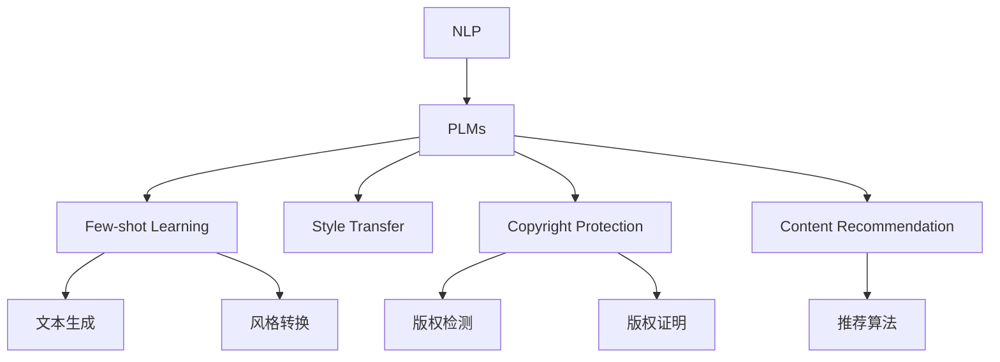

                 

# 自然语言处理的未来：AI出版业的革新

> 关键词：自然语言处理，AI出版业，深度学习，Transformer，预训练语言模型，少样本学习，少样本学习，出版物质量检测，风格转换，版权保护，内容推荐

## 1. 背景介绍

### 1.1 问题由来
随着人工智能技术的迅猛发展，自然语言处理（Natural Language Processing，NLP）在出版业中的应用日益广泛。传统的出版流程中，内容编辑、校对、排版、印刷、发行等环节往往需要大量人力和时间的投入，且容易受限于专业知识和经验。AI出版业的出现，使得出版流程可以更加高效、智能化，提高出版物的质量和时效性。

近年来，AI在出版业中的应用已经从简单的自动化排版、编辑校对，扩展到了更为复杂的自然语言处理领域，如内容生成、风格转换、版权保护、内容推荐等。这些应用不仅能够显著提升出版效率，还能够改善出版物质量，增强用户阅读体验，为出版业带来革命性的变革。

### 1.2 问题核心关键点
AI出版业的核心在于利用深度学习技术，特别是Transformer架构的预训练语言模型（Pre-trained Language Models, PLMs），对文本数据进行智能化处理。PLMs通过大规模无标签文本数据的预训练，学习到了丰富的语言知识和表达能力，能够快速适应各种下游出版任务。

AI出版业的具体应用包括：
- 出版物质量检测：利用预训练模型对文本进行语法、拼写、标点等方面的检测。
- 风格转换：根据给定文本或样式模板，自动生成符合特定风格的新文本。
- 内容生成：基于主题或关键词，自动生成相关文本，如新闻、评论、摘要等。
- 版权保护：通过预训练模型识别文本特征，实现版权检测和证明。
- 内容推荐：根据用户阅读历史和文本内容，推荐相关书籍、文章等出版物。

这些应用场景展示了大语言模型在出版业中的巨大潜力，同时也带来了对AI出版业未来发展方向的深入探讨。

## 2. 核心概念与联系

### 2.1 核心概念概述

为更好地理解AI出版业中的NLP技术，本节将介绍几个密切相关的核心概念：

- 自然语言处理（NLP）：指使用计算机技术对自然语言文本进行处理、分析和理解的过程，包括文本预处理、词法分析、句法分析、语义分析、文本生成等任务。

- 预训练语言模型（PLMs）：指通过大规模无标签文本数据进行预训练，学习到丰富语言表示的深度学习模型。如BERT、GPT、T5等。

- 少样本学习（Few-shot Learning）：指模型仅在少量标注数据上进行微调，就能快速适应新任务的能力。特别适用于文本生成、风格转换等任务。

- 风格转换（Style Transfer）：指将文本从一个风格转换到另一个风格的过程，如将一段文言文转换为现代汉语，或将一段新闻报道转换为故事叙述。

- 版权保护（Copyright Protection）：指利用技术手段保护出版物版权，防止盗版和非法使用。包括版权检测和版权证明两个方面。

- 内容推荐（Content Recommendation）：指根据用户兴趣和文本内容，自动推荐相关出版物，增强用户阅读体验，提升出版物的曝光率和销量。

这些核心概念之间的逻辑关系可以通过以下Mermaid流程图来展示：



这个流程图展示了NLP技术的各个子领域及其与PLMs的紧密联系。PLMs作为基础，提供了丰富的语言表示和生成能力，通过不同的技术手段应用于出版业的不同环节。

## 3. 核心算法原理 & 具体操作步骤
### 3.1 算法原理概述

AI出版业的算法核心是利用深度学习模型进行自然语言处理。具体来说，通过预训练语言模型对文本数据进行处理和分析，然后针对特定的出版任务进行微调，从而实现高效、智能的出版物生成和管理。

### 3.2 算法步骤详解

AI出版业的算法步骤一般包括以下几个关键环节：

**Step 1: 准备预训练模型和数据集**
- 选择合适的预训练语言模型 $M_{\theta}$ 作为初始化参数，如 BERT、GPT 等。
- 准备出版任务的数据集，如文本校对数据集、版权保护数据集、风格转换数据集等，并划分为训练集、验证集和测试集。

**Step 2: 任务适配层设计**
- 根据出版任务类型，设计合适的输出层和损失函数。
- 对于出版物质量检测，通常使用交叉熵损失函数，对于风格转换和内容生成，则可能需要自定义损失函数。

**Step 3: 微调参数设置**
- 选择合适的优化算法及其参数，如 AdamW、SGD 等，设置学习率、批大小、迭代轮数等。
- 设置正则化技术及强度，包括 L2 正则、Dropout、Early Stopping 等。
- 确定冻结预训练参数的策略，如仅微调顶层，或全部参数都参与微调。

**Step 4: 执行梯度训练**
- 将训练集数据分批次输入模型，前向传播计算损失函数。
- 反向传播计算参数梯度，根据设定的优化算法和学习率更新模型参数。
- 周期性在验证集上评估模型性能，根据性能指标决定是否触发 Early Stopping。
- 重复上述步骤直到满足预设的迭代轮数或 Early Stopping 条件。

**Step 5: 测试和部署**
- 在测试集上评估微调后模型 $M_{\hat{\theta}}$ 的性能，对比微调前后的精度提升。
- 使用微调后的模型对新样本进行推理预测，集成到实际的应用系统中。
- 持续收集新的数据，定期重新微调模型，以适应数据分布的变化。

以上是AI出版业中基于监督学习的大语言模型微调的一般流程。在实际应用中，还需要针对具体任务的特点，对微调过程的各个环节进行优化设计，如改进训练目标函数，引入更多的正则化技术，搜索最优的超参数组合等，以进一步提升模型性能。

### 3.3 算法优缺点

基于监督学习的AI出版业算法具有以下优点：
1. 高效：通过预训练模型，模型能够快速适应新的出版任务。
2. 通用：预训练模型可以广泛应用于多种出版任务，如文本校对、风格转换、内容生成等。
3. 泛化能力强：经过大规模无标签数据预训练的模型，具备较强的泛化能力。
4. 适应性强：能够根据不同出版物的风格和要求进行灵活微调。

同时，该算法也存在一定的局限性：
1. 依赖标注数据：微调的效果很大程度上取决于标注数据的质量和数量，获取高质量标注数据的成本较高。
2. 计算资源需求大：预训练模型和微调过程需要大量的计算资源，成本较高。
3. 模型复杂度高：大模型包含大量参数，推理过程较为复杂。

尽管存在这些局限性，但就目前而言，基于监督学习的微调方法仍是大语言模型应用的主流范式。未来相关研究的重点在于如何进一步降低微调对标注数据的依赖，提高模型的泛化能力和效率，同时兼顾模型的可解释性和伦理安全性等因素。

### 3.4 算法应用领域

AI出版业的算法应用领域广泛，涵盖了出版物的各个环节，包括：

- 内容生成：如自动生成新闻、文章、摘要等。
- 文本校对：如语法、拼写、标点等方面的检测和校正。
- 风格转换：如将文言文转换为现代汉语，将正式文风转换为口语文风等。
- 版权保护：如版权检测和版权证明，防止盗版和非法使用。
- 内容推荐：如根据用户阅读历史和文本内容，推荐相关书籍、文章等出版物。
- 翻译：如将不同语言的出版物进行翻译。
- 情感分析：如分析用户对出版物的情感倾向，辅助出版商优化内容。

这些应用场景展示了AI出版业的广泛应用，使得出版流程更加智能化和高效化。

## 4. 数学模型和公式 & 详细讲解  
### 4.1 数学模型构建

本节将使用数学语言对基于监督学习的出版任务进行更加严格的刻画。

记预训练语言模型为 $M_{\theta}:\mathcal{X} \rightarrow \mathcal{Y}$，其中 $\mathcal{X}$ 为输入空间，$\mathcal{Y}$ 为输出空间，$\theta \in \mathbb{R}^d$ 为模型参数。假设出版任务训练集为 $D=\{(x_i,y_i)\}_{i=1}^N, x_i \in \mathcal{X}, y_i \in \mathcal{Y}$。

定义模型 $M_{\theta}$ 在数据样本 $(x,y)$ 上的损失函数为 $\ell(M_{\theta}(x),y)$，则在数据集 $D$ 上的经验风险为：

$$
\mathcal{L}(\theta) = \frac{1}{N} \sum_{i=1}^N \ell(M_{\theta}(x_i),y_i)
$$

微调的优化目标是最小化经验风险，即找到最优参数：

$$
\theta^* = \mathop{\arg\min}_{\theta} \mathcal{L}(\theta)
$$

在实践中，我们通常使用基于梯度的优化算法（如SGD、Adam等）来近似求解上述最优化问题。设 $\eta$ 为学习率，$\lambda$ 为正则化系数，则参数的更新公式为：

$$
\theta \leftarrow \theta - \eta \nabla_{\theta}\mathcal{L}(\theta) - \eta\lambda\theta
$$

其中 $\nabla_{\theta}\mathcal{L}(\theta)$ 为损失函数对参数 $\theta$ 的梯度，可通过反向传播算法高效计算。

### 4.2 公式推导过程

以下我们以版权保护任务为例，推导版权检测损失函数及其梯度的计算公式。

假设版权保护任务的目标是判断一段文本是否为原创，1表示原创，0表示非原创。假设模型 $M_{\theta}$ 在输入 $x$ 上的输出为 $\hat{y}=M_{\theta}(x) \in [0,1]$，表示文本为原创的概率。真实标签 $y \in \{0,1\}$。则版权保护任务的二分类交叉熵损失函数定义为：

$$
\ell(M_{\theta}(x),y) = -[y\log \hat{y} + (1-y)\log (1-\hat{y})]
$$

将其代入经验风险公式，得：

$$
\mathcal{L}(\theta) = -\frac{1}{N}\sum_{i=1}^N [y_i\log M_{\theta}(x_i)+(1-y_i)\log(1-M_{\theta}(x_i))]
$$

根据链式法则，损失函数对参数 $\theta_k$ 的梯度为：

$$
\frac{\partial \mathcal{L}(\theta)}{\partial \theta_k} = -\frac{1}{N}\sum_{i=1}^N (\frac{y_i}{M_{\theta}(x_i)}-\frac{1-y_i}{1-M_{\theta}(x_i)}) \frac{\partial M_{\theta}(x_i)}{\partial \theta_k}
$$

其中 $\frac{\partial M_{\theta}(x_i)}{\partial \theta_k}$ 可进一步递归展开，利用自动微分技术完成计算。

在得到损失函数的梯度后，即可带入参数更新公式，完成模型的迭代优化。重复上述过程直至收敛，最终得到适应版权保护任务的最优模型参数 $\theta^*$。

## 5. 项目实践：代码实例和详细解释说明
### 5.1 开发环境搭建

在进行出版任务微调实践前，我们需要准备好开发环境。以下是使用Python进行PyTorch开发的环境配置流程：

1. 安装Anaconda：从官网下载并安装Anaconda，用于创建独立的Python环境。

2. 创建并激活虚拟环境：
```bash
conda create -n pytorch-env python=3.8 
conda activate pytorch-env
```

3. 安装PyTorch：根据CUDA版本，从官网获取对应的安装命令。例如：
```bash
conda install pytorch torchvision torchaudio cudatoolkit=11.1 -c pytorch -c conda-forge
```

4. 安装Transformers库：
```bash
pip install transformers
```

5. 安装各类工具包：
```bash
pip install numpy pandas scikit-learn matplotlib tqdm jupyter notebook ipython
```

完成上述步骤后，即可在`pytorch-env`环境中开始出版任务微调实践。

### 5.2 源代码详细实现

下面我们以版权保护任务为例，给出使用Transformers库对BERT模型进行版权保护微调的PyTorch代码实现。

首先，定义版权保护任务的数据处理函数：

```python
from transformers import BertTokenizer
from torch.utils.data import Dataset
import torch

class CopyrightDataset(Dataset):
    def __init__(self, texts, labels, tokenizer, max_len=128):
        self.texts = texts
        self.labels = labels
        self.tokenizer = tokenizer
        self.max_len = max_len
        
    def __len__(self):
        return len(self.texts)
    
    def __getitem__(self, item):
        text = self.texts[item]
        label = self.labels[item]
        
        encoding = self.tokenizer(text, return_tensors='pt', max_length=self.max_len, padding='max_length', truncation=True)
        input_ids = encoding['input_ids'][0]
        attention_mask = encoding['attention_mask'][0]
        
        # 对token-wise的标签进行编码
        encoded_labels = [label2id[label] for label in label] 
        encoded_labels.extend([label2id['O']] * (self.max_len - len(encoded_labels)))
        labels = torch.tensor(encoded_labels, dtype=torch.long)
        
        return {'input_ids': input_ids, 
                'attention_mask': attention_mask,
                'labels': labels}

# 标签与id的映射
label2id = {'O': 0, '原创': 1, '非原创': 2}
id2label = {v: k for k, v in label2id.items()}

# 创建dataset
tokenizer = BertTokenizer.from_pretrained('bert-base-cased')

train_dataset = CopyrightDataset(train_texts, train_labels, tokenizer)
dev_dataset = CopyrightDataset(dev_texts, dev_labels, tokenizer)
test_dataset = CopyrightDataset(test_texts, test_labels, tokenizer)
```

然后，定义模型和优化器：

```python
from transformers import BertForTokenClassification, AdamW

model = BertForTokenClassification.from_pretrained('bert-base-cased', num_labels=len(label2id))

optimizer = AdamW(model.parameters(), lr=2e-5)
```

接着，定义训练和评估函数：

```python
from torch.utils.data import DataLoader
from tqdm import tqdm
from sklearn.metrics import accuracy_score

device = torch.device('cuda') if torch.cuda.is_available() else torch.device('cpu')
model.to(device)

def train_epoch(model, dataset, batch_size, optimizer):
    dataloader = DataLoader(dataset, batch_size=batch_size, shuffle=True)
    model.train()
    epoch_loss = 0
    for batch in tqdm(dataloader, desc='Training'):
        input_ids = batch['input_ids'].to(device)
        attention_mask = batch['attention_mask'].to(device)
        labels = batch['labels'].to(device)
        model.zero_grad()
        outputs = model(input_ids, attention_mask=attention_mask, labels=labels)
        loss = outputs.loss
        epoch_loss += loss.item()
        loss.backward()
        optimizer.step()
    return epoch_loss / len(dataloader)

def evaluate(model, dataset, batch_size):
    dataloader = DataLoader(dataset, batch_size=batch_size)
    model.eval()
    preds, labels = [], []
    with torch.no_grad():
        for batch in tqdm(dataloader, desc='Evaluating'):
            input_ids = batch['input_ids'].to(device)
            attention_mask = batch['attention_mask'].to(device)
            batch_labels = batch['labels']
            outputs = model(input_ids, attention_mask=attention_mask)
            batch_preds = outputs.logits.argmax(dim=2).to('cpu').tolist()
            batch_labels = batch_labels.to('cpu').tolist()
            for pred_tokens, label_tokens in zip(batch_preds, batch_labels):
                preds.append(pred_tokens[:len(label_tokens)])
                labels.append(label_tokens)
                
    print(accuracy_score(labels, preds))
```

最后，启动训练流程并在测试集上评估：

```python
epochs = 5
batch_size = 16

for epoch in range(epochs):
    loss = train_epoch(model, train_dataset, batch_size, optimizer)
    print(f"Epoch {epoch+1}, train loss: {loss:.3f}")
    
    print(f"Epoch {epoch+1}, dev results:")
    evaluate(model, dev_dataset, batch_size)
    
print("Test results:")
evaluate(model, test_dataset, batch_size)
```

以上就是使用PyTorch对BERT进行版权保护任务微调的完整代码实现。可以看到，得益于Transformers库的强大封装，我们可以用相对简洁的代码完成BERT模型的加载和微调。

### 5.3 代码解读与分析

让我们再详细解读一下关键代码的实现细节：

**CopyrightDataset类**：
- `__init__`方法：初始化文本、标签、分词器等关键组件。
- `__len__`方法：返回数据集的样本数量。
- `__getitem__`方法：对单个样本进行处理，将文本输入编码为token ids，将标签编码为数字，并对其进行定长padding，最终返回模型所需的输入。

**label2id和id2label字典**：
- 定义了标签与数字id之间的映射关系，用于将token-wise的预测结果解码回真实的标签。

**训练和评估函数**：
- 使用PyTorch的DataLoader对数据集进行批次化加载，供模型训练和推理使用。
- 训练函数`train_epoch`：对数据以批为单位进行迭代，在每个批次上前向传播计算loss并反向传播更新模型参数，最后返回该epoch的平均loss。
- 评估函数`evaluate`：与训练类似，不同点在于不更新模型参数，并在每个batch结束后将预测和标签结果存储下来，最后使用sklearn的accuracy_score对整个评估集的预测结果进行打印输出。

**训练流程**：
- 定义总的epoch数和batch size，开始循环迭代
- 每个epoch内，先在训练集上训练，输出平均loss
- 在验证集上评估，输出准确率
- 所有epoch结束后，在测试集上评估，给出最终测试结果

可以看到，PyTorch配合Transformers库使得BERT微调的代码实现变得简洁高效。开发者可以将更多精力放在数据处理、模型改进等高层逻辑上，而不必过多关注底层的实现细节。

当然，工业级的系统实现还需考虑更多因素，如模型的保存和部署、超参数的自动搜索、更灵活的任务适配层等。但核心的微调范式基本与此类似。

## 6. 实际应用场景
### 6.1 智能出版系统

智能出版系统是AI出版业的重要应用场景之一，它能够帮助出版商自动化完成文本校对、排版、版权保护等环节，提高出版效率和质量。

具体来说，智能出版系统可以通过以下方式实现：
- 文本校对：利用预训练模型对出版物进行语法、拼写、标点等方面的检测，自动校对修改。
- 排版优化：根据文本内容自动调整字体大小、行间距、段落间距等，提升阅读体验。
- 版权保护：利用版权检测模型对文本进行原创性检测，自动标记版权信息，防止盗版和非法使用。
- 内容推荐：根据用户阅读历史和文本内容，自动推荐相关书籍、文章等出版物，增加曝光率和销量。

例如，一个出版社可以利用智能出版系统，在收到稿件后，自动进行文本校对和排版优化，快速生成高质量的电子版和纸质书，大大缩短出版周期。此外，该系统还能检测文本的原创性，自动标记版权信息，保护作者的权益，防止盗版和非法使用。

### 6.2 数字出版平台

数字出版平台是AI出版业的另一个重要应用场景，它能够提供更加丰富、多样化的内容，满足用户多元化的阅读需求。

具体来说，数字出版平台可以通过以下方式实现：
- 自动生成文章：利用预训练模型生成新闻、评论、摘要等，丰富平台内容。
- 风格转换：根据用户偏好，自动将文本转换成不同的风格，如文言文、现代汉语、口语等。
- 内容推荐：根据用户阅读历史和文本内容，自动推荐相关书籍、文章等出版物，增强用户粘性。
- 版权保护：利用版权检测模型对文本进行原创性检测，自动标记版权信息，防止盗版和非法使用。

例如，一个数字出版平台可以利用AI技术，自动生成高质量的文章和评论，丰富用户阅读体验。同时，该平台还能根据用户的阅读历史和兴趣，自动推荐相关书籍和文章，增加用户粘性和平台流量。

### 6.3 版权检测与维权

版权检测与维权是AI出版业的重要应用之一，它能够帮助版权方识别和证明版权，打击盗版和非法使用。

具体来说，版权检测与维权可以通过以下方式实现：
- 版权检测：利用版权检测模型对文本进行原创性检测，判断是否为原创。
- 版权证明：利用版权证明模型自动生成版权声明和证据，证明版权归属。
- 版权维权：根据版权检测和证明结果，自动启动版权维权流程，减少维权成本和难度。

例如，一个版权方可以利用AI技术，对平台上的文本进行版权检测，自动标记版权信息。如果发现有盗版或非法使用，该平台可以自动生成版权声明和证据，自动启动维权流程，减少版权方维权的时间和成本。

### 6.4 未来应用展望

随着AI出版业的发展，未来的出版流程将更加智能化、高效化。AI出版业将不仅限于文本处理和版权保护，还将延伸到更多的领域，如内容生成、风格转换、情感分析等。

未来，AI出版业可能还会出现以下趋势：
- 多模态出版：结合文本、图像、视频等多种模态，丰富出版内容，提升用户体验。
- 跨领域出版：将出版物应用于多个领域，如教育、医疗、法律等，提供跨领域的知识服务。
- 实时出版：利用AI技术，实现实时内容生成和发布，提升出版时效性。
- 个性化出版：根据用户偏好和行为，自动生成个性化内容，满足用户个性化需求。

总之，AI出版业的发展前景广阔，未来将更加多样化、智能化，为出版业带来深远的变革。

## 7. 工具和资源推荐
### 7.1 学习资源推荐

为了帮助开发者系统掌握AI出版业中的NLP技术，这里推荐一些优质的学习资源：

1. 《Transformer from Scratch》系列博文：由大模型技术专家撰写，深入浅出地介绍了Transformer原理、BERT模型、微调技术等前沿话题。

2. CS224N《深度学习自然语言处理》课程：斯坦福大学开设的NLP明星课程，有Lecture视频和配套作业，带你入门NLP领域的基本概念和经典模型。

3. 《Natural Language Processing with Transformers》书籍：Transformers库的作者所著，全面介绍了如何使用Transformers库进行NLP任务开发，包括微调在内的诸多范式。

4. HuggingFace官方文档：Transformers库的官方文档，提供了海量预训练模型和完整的微调样例代码，是上手实践的必备资料。

5. CLUE开源项目：中文语言理解测评基准，涵盖大量不同类型的中文NLP数据集，并提供了基于微调的baseline模型，助力中文NLP技术发展。

通过对这些资源的学习实践，相信你一定能够快速掌握AI出版业的精髓，并用于解决实际的出版问题。
###  7.2 开发工具推荐

高效的开发离不开优秀的工具支持。以下是几款用于AI出版业开发的常用工具：

1. PyTorch：基于Python的开源深度学习框架，灵活动态的计算图，适合快速迭代研究。大部分预训练语言模型都有PyTorch版本的实现。

2. TensorFlow：由Google主导开发的开源深度学习框架，生产部署方便，适合大规模工程应用。同样有丰富的预训练语言模型资源。

3. Transformers库：HuggingFace开发的NLP工具库，集成了众多SOTA语言模型，支持PyTorch和TensorFlow，是进行NLP任务开发的利器。

4. Weights & Biases：模型训练的实验跟踪工具，可以记录和可视化模型训练过程中的各项指标，方便对比和调优。与主流深度学习框架无缝集成。

5. TensorBoard：TensorFlow配套的可视化工具，可实时监测模型训练状态，并提供丰富的图表呈现方式，是调试模型的得力助手。

6. Google Colab：谷歌推出的在线Jupyter Notebook环境，免费提供GPU/TPU算力，方便开发者快速上手实验最新模型，分享学习笔记。

合理利用这些工具，可以显著提升AI出版业的开发效率，加快创新迭代的步伐。

### 7.3 相关论文推荐

AI出版业的算法应用领域广泛，涵盖出版物的各个环节，以下是几篇奠基性的相关论文，推荐阅读：

1. Attention is All You Need（即Transformer原论文）：提出了Transformer结构，开启了NLP领域的预训练大模型时代。

2. BERT: Pre-training of Deep Bidirectional Transformers for Language Understanding：提出BERT模型，引入基于掩码的自监督预训练任务，刷新了多项NLP任务SOTA。

3. Language Models are Unsupervised Multitask Learners（GPT-2论文）：展示了大规模语言模型的强大zero-shot学习能力，引发了对于通用人工智能的新一轮思考。

4. Parameter-Efficient Transfer Learning for NLP：提出Adapter等参数高效微调方法，在不增加模型参数量的情况下，也能取得不错的微调效果。

5. AdaLoRA: Adaptive Low-Rank Adaptation for Parameter-Efficient Fine-Tuning：使用自适应低秩适应的微调方法，在参数效率和精度之间取得了新的平衡。

这些论文代表了大语言模型在出版业中的应用，展示了NLP技术的强大潜力。通过学习这些前沿成果，可以帮助研究者把握学科前进方向，激发更多的创新灵感。

## 8. 总结：未来发展趋势与挑战

### 8.1 总结

本文对基于监督学习的AI出版业中的NLP技术进行了全面系统的介绍。首先阐述了AI出版业中的NLP技术的研究背景和意义，明确了微调在拓展预训练模型应用、提升出版物质量等方面的独特价值。其次，从原理到实践，详细讲解了出版任务的数学模型和微调步骤，给出了出版任务开发的完整代码实例。同时，本文还广泛探讨了AI出版业在出版物质量检测、风格转换、版权保护等方面的应用前景，展示了NLP技术在出版业中的巨大潜力。

通过本文的系统梳理，可以看到，基于监督学习的出版任务微调方法正在成为出版业的重要范式，极大地提升了出版效率和质量。未来，伴随预训练语言模型和微调方法的持续演进，相信NLP技术必将在更广阔的应用领域大放异彩，深刻影响出版业的发展进程。

### 8.2 未来发展趋势

展望未来，AI出版业中的NLP技术将呈现以下几个发展趋势：

1. 模型规模持续增大。随着算力成本的下降和数据规模的扩张，预训练语言模型的参数量还将持续增长。超大规模语言模型蕴含的丰富语言知识，有望支撑更加复杂多变的出版任务。

2. 微调方法日趋多样。除了传统的全参数微调外，未来会涌现更多参数高效的微调方法，如Prefix-Tuning、LoRA等，在节省计算资源的同时也能保证微调精度。

3. 持续学习成为常态。随着数据分布的不断变化，微调模型也需要持续学习新知识以保持性能。如何在不遗忘原有知识的同时，高效吸收新样本信息，将成为重要的研究课题。

4. 标注样本需求降低。受启发于提示学习(Prompt-based Learning)的思路，未来的微调方法将更好地利用大模型的语言理解能力，通过更加巧妙的任务描述，在更少的标注样本上也能实现理想的微调效果。

5. 模型通用性增强。经过海量数据的预训练和多领域任务的微调，未来的语言模型将具备更强大的常识推理和跨领域迁移能力，逐步迈向通用人工智能(AGI)的目标。

以上趋势凸显了AI出版业的广阔前景。这些方向的探索发展，必将进一步提升出版流程的智能化水平，为出版业带来深远的变革。

### 8.3 面临的挑战

尽管AI出版业中的NLP技术已经取得了瞩目成就，但在迈向更加智能化、普适化应用的过程中，它仍面临着诸多挑战：

1. 标注成本瓶颈。虽然微调大大降低了标注数据的需求，但对于长尾应用场景，难以获得充足的高质量标注数据，成为制约微调性能的瓶颈。如何进一步降低微调对标注样本的依赖，将是一大难题。

2. 模型鲁棒性不足。当前微调模型面对域外数据时，泛化性能往往大打折扣。对于测试样本的微小扰动，微调模型的预测也容易发生波动。如何提高微调模型的鲁棒性，避免灾难性遗忘，还需要更多理论和实践的积累。

3. 推理效率有待提高。大规模语言模型虽然精度高，但在实际部署时往往面临推理速度慢、内存占用大等效率问题。如何在保证性能的同时，简化模型结构，提升推理速度，优化资源占用，将是重要的优化方向。

4. 可解释性亟需加强。当前微调模型更像是"黑盒"系统，难以解释其内部工作机制和决策逻辑。对于医疗、金融等高风险应用，算法的可解释性和可审计性尤为重要。如何赋予微调模型更强的可解释性，将是亟待攻克的难题。

5. 安全性有待保障。预训练语言模型难免会学习到有偏见、有害的信息，通过微调传递到下游任务，产生误导性、歧视性的输出，给实际应用带来安全隐患。如何从数据和算法层面消除模型偏见，避免恶意用途，确保输出的安全性，也将是重要的研究课题。

6. 知识整合能力不足。现有的微调模型往往局限于任务内数据，难以灵活吸收和运用更广泛的先验知识。如何让微调过程更好地与外部知识库、规则库等专家知识结合，形成更加全面、准确的信息整合能力，还有很大的想象空间。

正视AI出版业中的NLP技术面临的这些挑战，积极应对并寻求突破，将是大规模语言模型微调走向成熟的必由之路。相信随着学界和产业界的共同努力，这些挑战终将一一被克服，NLP技术必将在构建智能化出版流程中扮演越来越重要的角色。

### 8.4 研究展望

面对AI出版业中的NLP技术所面临的种种挑战，未来的研究需要在以下几个方面寻求新的突破：

1. 探索无监督和半监督微调方法。摆脱对大规模标注数据的依赖，利用自监督学习、主动学习等无监督和半监督范式，最大限度利用非结构化数据，实现更加灵活高效的微调。

2. 研究参数高效和计算高效的微调范式。开发更加参数高效的微调方法，在固定大部分预训练参数的同时，只更新极少量的任务相关参数。同时优化微调模型的计算图，减少前向传播和反向传播的资源消耗，实现更加轻量级、实时性的部署。

3. 融合因果和对比学习范式。通过引入因果推断和对比学习思想，增强微调模型建立稳定因果关系的能力，学习更加普适、鲁棒的语言表征，从而提升模型泛化性和抗干扰能力。

4. 引入更多先验知识。将符号化的先验知识，如知识图谱、逻辑规则等，与神经网络模型进行巧妙融合，引导微调过程学习更准确、合理的语言模型。同时加强不同模态数据的整合，实现视觉、语音等多模态信息与文本信息的协同建模。

5. 结合因果分析和博弈论工具。将因果分析方法引入微调模型，识别出模型决策的关键特征，增强输出解释的因果性和逻辑性。借助博弈论工具刻画人机交互过程，主动探索并规避模型的脆弱点，提高系统稳定性。

6. 纳入伦理道德约束。在模型训练目标中引入伦理导向的评估指标，过滤和惩罚有偏见、有害的输出倾向。同时加强人工干预和审核，建立模型行为的监管机制，确保输出符合人类价值观和伦理道德。

这些研究方向的探索，必将引领AI出版业中的NLP技术迈向更高的台阶，为出版业带来更加智能、高效、安全、可控的智能化服务。面向未来，AI出版业中的NLP技术还需要与其他人工智能技术进行更深入的融合，如知识表示、因果推理、强化学习等，多路径协同发力，共同推动出版业迈向智能化新纪元。

## 9. 附录：常见问题与解答

**Q1：大语言模型在出版业中的主要应用场景有哪些？**

A: 大语言模型在出版业中的应用场景非常广泛，主要包括：
- 文本校对：利用大语言模型对出版物进行语法、拼写、标点等方面的检测，自动校对修改。
- 版权保护：利用大语言模型对文本进行原创性检测，判断是否为原创。
- 风格转换：根据给定文本或样式模板，自动生成符合特定风格的新文本。
- 内容生成：利用大语言模型自动生成新闻、文章、摘要等。
- 内容推荐：根据用户阅读历史和文本内容，自动推荐相关书籍、文章等出版物。

这些应用场景展示了大语言模型在出版业中的巨大潜力，能够显著提升出版物的质量和时效性。

**Q2：如何在出版任务中使用大语言模型？**

A: 使用大语言模型进行出版任务，一般需要以下步骤：
1. 准备预训练模型和数据集：选择合适的预训练语言模型，准备任务相关的标注数据集。
2. 任务适配层设计：根据任务类型，设计合适的输出层和损失函数。
3. 微调参数设置：选择合适的优化算法及其参数，设置学习率、批大小、迭代轮数等。
4. 执行梯度训练：将训练集数据分批次输入模型，前向传播计算损失函数，反向传播更新模型参数。
5. 测试和部署：在测试集上评估微调后模型的性能，使用微调后的模型对新样本进行推理预测，集成到实际的应用系统中。

例如，对于版权保护任务，可以基于预训练的BERT模型，利用版权检测数据集进行微调，最终得到版权检测模型。微调完成后，可以利用该模型对新文本进行版权检测，判断是否为原创。

**Q3：AI出版业中的NLP技术面临哪些挑战？**

A: AI出版业中的NLP技术面临以下挑战：
1. 标注成本瓶颈：微调效果很大程度上取决于标注数据的质量和数量，获取高质量标注数据的成本较高。
2. 模型鲁棒性不足：当前微调模型面对域外数据时，泛化性能往往大打折扣，容易受到微小扰动的影响。
3. 推理效率有待提高：大规模语言模型虽然精度高，但在实际部署时往往面临推理速度慢、内存占用大等效率问题。
4. 可解释性亟需加强：当前微调模型更像是"黑盒"系统，难以解释其内部工作机制和决策逻辑。
5. 安全性有待保障：预训练语言模型可能学习到有偏见、有害的信息，通过微调传递到下游任务，产生误导性、歧视性的输出，给实际应用带来安全隐患。
6. 知识整合能力不足：现有的微调模型往往局限于任务内数据，难以灵活吸收和运用更广泛的先验知识。

这些挑战需要未来的研究者在算法、数据、工程等方面进行深入探索和优化，才能实现AI出版业的可持续发展。

**Q4：AI出版业中的NLP技术未来发展趋势是什么？**

A: AI出版业中的NLP技术未来发展趋势包括：
1. 模型规模持续增大：随着算力成本的下降和数据规模的扩张，预训练语言模型的参数量还将持续增长，超大规模语言模型蕴含的丰富语言知识，有望支撑更加复杂多变的出版任务。
2. 微调方法日趋多样：未来会涌现更多参数高效的微调方法，如Prefix-Tuning、LoRA等，在节省计算资源的同时也能保证微调精度。
3. 持续学习成为常态：随着数据分布的不断变化，微调模型也需要持续学习新知识以保持性能。
4. 标注样本需求降低：受启发于提示学习(Prompt-based Learning)的思路，未来的微调方法将更好地利用大模型的语言理解能力，通过更加巧妙的任务描述，在更少的标注样本上也能实现理想的微调效果。
5. 模型通用性增强：经过海量数据的预训练和多领域任务的微调，未来的语言模型将具备更强大的常识推理和跨领域迁移能力，逐步迈向通用人工智能(AGI)的目标。

这些趋势凸显了AI出版业的广阔前景，为出版业带来了深远的变革。

**Q5：如何提高AI出版业中NLP模型的鲁棒性？**

A: 提高AI出版业中NLP模型的鲁棒性，可以从以下几个方面进行优化：
1. 数据增强：通过对训练样本进行改写、回译等方式丰富训练集多样性，减少模型对特定数据集的依赖。
2. 对抗训练：加入对抗样本，提高模型鲁棒性，防止模型对输入的微小扰动产生波动。
3. 正则化技术：使用L2正则、Dropout等正则化技术，防止模型过拟合，提高模型的泛化能力。
4. 参数高效微调：在固定大部分预训练参数的情况下，只更新极少量的任务相关参数，减少对原始模型的破坏。
5. 多模型集成：训练多个微调模型，取平均输出，抑制过拟合，提高模型鲁棒性。

通过这些方法，可以有效提高AI出版业中NLP模型的鲁棒性，使其在面对复杂多变的出版任务时，仍能保持稳定的性能表现。

---

作者：禅与计算机程序设计艺术 / Zen and the Art of Computer Programming

