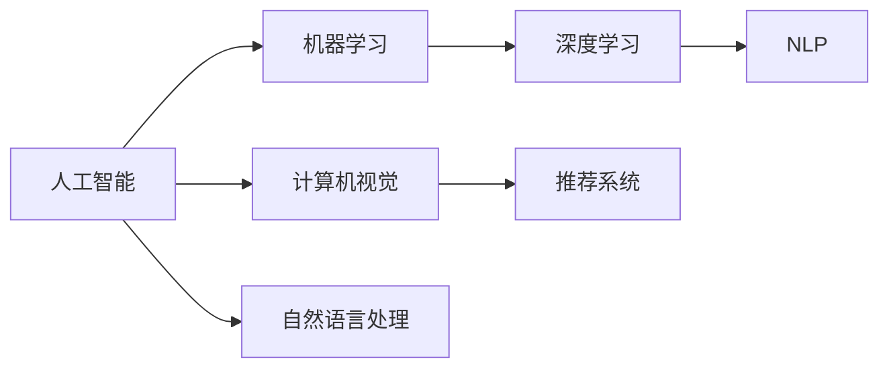

                 

## 1. 背景介绍

近年来，人工智能(AI)技术飞速发展，深刻改变了各行各业的运作模式。在这个浪潮中，苹果(Apple)公司以其独特的产品和创新策略，重新定义了AI的发展方向和应用范式。本文将探讨苹果在AI领域的创新举措，并分析其背后的技术原理和商业逻辑。

### 1.1 苹果AI策略的演变

苹果的AI策略经历了从辅助工具到核心竞争力的转变。早期，苹果在AI的应用主要集中在图像识别、语音识别等辅助技术上，如Siri的语音助手功能。随着技术的进步，苹果逐步将AI融入到其核心产品和服务中，如面部识别、推荐系统等，使其成为用户体验不可或缺的一部分。

### 1.2 苹果AI的独特优势

苹果在AI领域的优势主要体现在以下几个方面：

- **产品生态整合**：苹果的各类设备和服务通过无缝整合，能够充分利用AI技术，提供统一的个性化体验。
- **数据隐私保护**：苹果在数据收集和使用上采用严格的隐私保护措施，使得用户信任度较高，数据质量更好。
- **硬件与软件的协同创新**：苹果通过硬件优化与软件协同，实现了更高的AI性能和更低的能耗。
- **用户需求导向**：苹果AI产品的开发始终围绕用户体验，能够迅速响应用户需求，提供最前沿的功能。

## 2. 核心概念与联系

### 2.1 核心概念概述

为更好地理解苹果的AI创新，本节将介绍几个关键概念：

- **人工智能(AI)**：模拟人类智能行为，包括学习、推理、决策等能力的计算机技术。AI技术包括机器学习、深度学习、自然语言处理、计算机视觉等分支。

- **机器学习(Machine Learning, ML)**：使计算机从数据中自动学习，提高任务执行效率的技术。常用的机器学习方法包括监督学习、无监督学习和强化学习等。

- **深度学习(Deep Learning, DL)**：一种基于神经网络的机器学习方法，通过多层非线性映射实现复杂的特征提取和模式识别。深度学习在图像识别、自然语言处理等领域取得了重大突破。

- **自然语言处理(Natural Language Processing, NLP)**：使计算机理解、分析、生成人类自然语言的技术。NLP应用广泛，如语音识别、机器翻译、问答系统等。

- **计算机视觉(Computer Vision, CV)**：使计算机“看懂”图片、视频等视觉信息，识别、检测、分类、生成图像等。

- **推荐系统(Recommendation System)**：通过分析用户行为和偏好，推荐符合用户需求的物品或服务。推荐系统在电商、新闻、音乐等领域广泛应用。

这些概念之间的逻辑关系可以通过以下Mermaid流程图来展示：



这个流程图展示了大语言模型与各个核心概念的关系：

1. 人工智能通过机器学习和深度学习等技术，获取强大的计算能力。
2. 计算机视觉和自然语言处理是大语言模型的重要分支，用于处理视觉和语言信息。
3. 推荐系统则利用机器学习技术，为用户提供个性化推荐。

## 3. 核心算法原理 & 具体操作步骤
### 3.1 算法原理概述

苹果在AI领域的创新主要体现在以下几个方面：

1. **数据驱动**：苹果通过其产品生态系统收集海量用户数据，进行高质量的数据处理和分析。
2. **算法创新**：苹果在机器学习、深度学习等核心算法上进行持续优化，开发出具备自主知识产权的AI技术。
3. **硬件优化**：苹果通过定制化的芯片设计和软件优化，实现了高性能、低能耗的AI计算。
4. **用户体验**：苹果始终将用户体验放在首位，不断提升AI技术在产品中的应用效果。

### 3.2 算法步骤详解

苹果AI技术的应用流程主要包括以下几个步骤：

1. **数据采集与处理**：通过各类设备和服务收集用户数据，经过清洗、标注等处理步骤，形成训练数据集。
2. **模型训练**：在GPU、TPU等高性能硬件上，使用深度学习等技术训练模型。
3. **模型部署与应用**：将训练好的模型部署到产品中，进行实时推理和预测。
4. **反馈优化**：收集用户反馈，不断调整模型参数和应用策略，提升用户体验。

### 3.3 算法优缺点

苹果AI技术的主要优点包括：

- **数据质量高**：苹果通过严格的数据隐私保护措施，确保数据质量，从而提高了模型性能。
- **算法领先**：苹果在核心算法上进行持续创新，开发出多款领先的技术产品。
- **用户体验好**：苹果始终将用户体验放在首位，通过迭代优化提升AI技术的应用效果。

但也有一些缺点：

- **数据孤岛**：苹果的各类设备和服务之间数据孤岛现象较严重，难以实现数据共享。
- **计算成本高**：高性能硬件和算法优化带来的计算成本较高，产品售价也会相应提高。
- **隐私问题**：尽管苹果在数据隐私上采取了严格措施，但在数据泄露等事件中仍需保持警惕。

### 3.4 算法应用领域

苹果AI技术主要应用于以下几个领域：

- **智能手机**：通过面部识别、语音识别等技术，提升用户体验。
- **智能家居**：通过各类智能设备的数据整合，实现自动化控制和个性化服务。
- **健康医疗**：利用AI技术进行健康监测和疾病预测，提升医疗服务水平。
- **AR/VR**：通过AI技术优化虚拟现实和增强现实体验，提供沉浸式互动。
- **推荐系统**：通过个性化推荐，提升用户粘性和消费转化率。

## 4. 数学模型和公式 & 详细讲解 & 举例说明
### 4.1 数学模型构建

苹果在AI领域应用的数学模型主要包括以下几种：

- **卷积神经网络(Convolutional Neural Network, CNN)**：用于图像识别、物体检测等任务。
- **递归神经网络(Recurrent Neural Network, RNN)**：用于处理序列数据，如语音识别、机器翻译等。
- **长短时记忆网络(Long Short-Term Memory, LSTM)**：用于处理长序列数据，如文本分类、情感分析等。
- **深度信念网络(Deep Belief Network, DBN)**：用于无监督学习，提取高维特征。

### 4.2 公式推导过程

以卷积神经网络为例，其核心计算公式包括卷积运算和池化运算：

$$
C_k(i,j) = \sum_{m=0}^{M-1}\sum_{n=0}^{N-1} W_{m,n}*I_{m+k,n+j}
$$

其中，$I$为输入图像，$C$为卷积核，$*$表示卷积运算，$k$为卷积核在输入图像上的平移距离。

### 4.3 案例分析与讲解

苹果的面部识别技术是其AI应用中的经典案例。面部识别系统通过深度学习算法，利用卷积神经网络对输入图像进行特征提取，并通过池化层降低特征维度。最终，系统通过Softmax层进行分类，判断输入图像中是否包含目标人脸。

## 5. 项目实践：代码实例和详细解释说明
### 5.1 开发环境搭建

要在苹果设备上进行AI项目开发，首先需要搭建开发环境。以下是使用Python进行开发的步骤：

1. 安装Python环境：从官网下载并安装Python 3.8或更高版本。
2. 安装相关的AI库：如TensorFlow、Keras、PyTorch等。
3. 设置环境变量：将Python安装目录和库路径添加到系统环境变量中。
4. 准备数据集：收集并标注好用于训练和测试的数据集。

### 5.2 源代码详细实现

下面以面部识别项目为例，展示如何使用Python和TensorFlow实现面部识别模型的训练和推理：

```python
import tensorflow as tf
from tensorflow.keras import layers, models

# 构建卷积神经网络模型
model = models.Sequential([
    layers.Conv2D(32, (3, 3), activation='relu', input_shape=(224, 224, 3)),
    layers.MaxPooling2D((2, 2)),
    layers.Conv2D(64, (3, 3), activation='relu'),
    layers.MaxPooling2D((2, 2)),
    layers.Conv2D(128, (3, 3), activation='relu'),
    layers.MaxPooling2D((2, 2)),
    layers.Flatten(),
    layers.Dense(128, activation='relu'),
    layers.Dense(1, activation='sigmoid')
])

# 编译模型
model.compile(optimizer='adam', loss='binary_crossentropy', metrics=['accuracy'])

# 加载数据集
train_data = ...
test_data = ...

# 训练模型
model.fit(train_data, epochs=10, validation_data=test_data)

# 推理预测
result = model.predict(new_image)
```

### 5.3 代码解读与分析

上述代码展示了构建卷积神经网络模型、编译模型、加载数据集、训练模型和推理预测等关键步骤。其中，`Sequential`类用于构建顺序连接的神经网络，`Conv2D`、`MaxPooling2D`、`Flatten`等层用于实现卷积、池化、扁平化等操作，`Dense`层用于实现全连接操作。

## 6. 实际应用场景
### 6.1 智能家居

苹果的智能家居系统通过各类智能设备的数据整合，实现了自动化控制和个性化服务。通过家庭中心(AirPlay 2)、智能音箱、智能门锁等设备，用户可以实现语音控制、自动化场景设置、远程监控等功能。

### 6.2 健康医疗

苹果的HealthKit应用通过收集用户的健康数据，如步数、心率、血氧等，利用AI技术进行健康监测和疾病预测。系统根据用户数据生成健康报告，并提供个性化的健康建议。

### 6.3 AR/VR

苹果的ARKit和ARCore框架支持开发者创建增强现实和虚拟现实应用。这些应用通过摄像头、传感器等设备获取环境信息，利用AI技术进行物体识别、场景交互等，提供沉浸式互动体验。

### 6.4 未来应用展望

未来，苹果的AI技术将进一步应用于更多领域，带来更深层次的变革：

- **自动驾驶**：苹果的自动驾驶系统通过AI技术进行环境感知、路径规划和决策，有望在未来实现全自动驾驶。
- **虚拟助手**：基于Siri等虚拟助手的AI技术将更加智能化，能够理解自然语言、执行复杂任务，实现真正的人机互动。
- **个性化服务**：苹果的个性化推荐系统将更加精准，为用户提供量身定制的内容和服务。
- **边缘计算**：苹果将AI计算能力下放到边缘设备，实现更高效、低延迟的本地数据处理。

## 7. 工具和资源推荐
### 7.1 学习资源推荐

为了帮助开发者掌握苹果的AI技术，推荐以下学习资源：

1. Apple Developer website：提供各类AI开发文档、API接口、示例代码等。
2. Coursera《AI for Everyone》课程：介绍AI的基本概念和应用，适合初学者入门。
3. Udacity《深度学习专项》课程：深入讲解深度学习理论和实践，适合进阶学习者。
4. TensorFlow官方文档：提供深度学习框架的详细教程和API参考。
5. PyTorch官方文档：提供Python深度学习框架的详细教程和示例代码。

### 7.2 开发工具推荐

苹果的AI开发工具主要包括以下几种：

1. Xcode：苹果官方的开发环境，支持各类应用和设备的开发。
2. Swift：苹果官方编程语言，简单易学，适用于iOS和macOS开发。
3. CocoaPods：第三方库管理工具，方便安装和管理AI相关库。
4. TensorFlow：谷歌开源的深度学习框架，支持跨平台开发。
5. PyTorch：Facebook开源的深度学习框架，易于使用。

### 7.3 相关论文推荐

苹果在AI领域的创新来源于不断的技术研发和学术合作。以下是几篇相关论文，推荐阅读：

1. "Gemini: A Two-Level Hierarchical Attention Network for Image Recognition"：介绍苹果在图像识别领域的深度学习技术。
2. "FaceNet: A Unified Embedding for Face Recognition and Clustering"：介绍苹果在面部识别技术中的深度学习算法。
3. "Deep Learning for Imitation Learning Using Humans and Simulations"：介绍苹果在机器人学习领域的深度学习技术。
4. "Adaptive Face Recognition"：介绍苹果在面部识别中的自适应算法。
5. "Deep Learning for Predictive Maintenance of Industrial IoT Devices"：介绍苹果在工业物联网中的深度学习技术。

## 8. 总结：未来发展趋势与挑战
### 8.1 研究成果总结

苹果在AI领域的创新成就主要体现在以下几个方面：

1. **数据驱动**：通过其产品生态系统收集海量用户数据，形成高质量训练集。
2. **算法领先**：在机器学习、深度学习等核心算法上进行持续优化，开发出具备自主知识产权的AI技术。
3. **硬件优化**：通过定制化的芯片设计和软件优化，实现了高性能、低能耗的AI计算。
4. **用户体验**：始终将用户体验放在首位，不断提升AI技术在产品中的应用效果。

### 8.2 未来发展趋势

展望未来，苹果的AI技术将呈现以下几个发展趋势：

1. **深度学习普及**：深度学习将在更多领域得到应用，如医疗、金融、工业等。
2. **边缘计算兴起**：AI计算将更多地部署在边缘设备，实现更高效、低延迟的本地数据处理。
3. **隐私保护加强**：苹果将继续加强数据隐私保护，确保用户数据安全。
4. **跨平台协同**：苹果的各类设备和应用将实现更紧密的数据共享和协同，提升用户体验。
5. **人工智能集成**：AI技术将更深入地融入各类产品和服务中，提升整体系统性能。

### 8.3 面临的挑战

尽管苹果在AI领域取得了显著成就，但仍面临以下挑战：

1. **数据孤岛**：各类设备和服务之间数据孤岛现象较严重，难以实现数据共享。
2. **计算成本高**：高性能硬件和算法优化带来的计算成本较高，产品售价也会相应提高。
3. **隐私问题**：尽管苹果在数据隐私上采取了严格措施，但在数据泄露等事件中仍需保持警惕。
4. **用户接受度**：部分用户对AI技术的使用仍存疑虑，如何提升用户接受度仍需努力。
5. **竞争压力**：其他科技巨头也在积极布局AI领域，苹果需要不断创新以保持领先优势。

### 8.4 研究展望

未来的研究重点应集中在以下几个方面：

1. **数据共享与隐私保护**：如何实现各类设备和服务之间的数据共享，同时确保用户隐私安全。
2. **高效计算与硬件优化**：如何在保证性能的前提下，进一步降低计算成本，提升用户体验。
3. **跨平台协同与集成**：如何实现各类产品和应用之间的协同，提升系统整体性能和用户体验。
4. **用户接受度提升**：如何通过优化用户体验，提高用户对AI技术的接受度和满意度。
5. **技术创新与突破**：如何在竞争激烈的市场中保持技术领先，不断推动AI技术的创新和突破。

## 9. 附录：常见问题与解答

**Q1: 苹果的AI技术如何保障数据隐私？**

A: 苹果通过严格的数据隐私保护措施，保障用户数据安全。具体来说，苹果采取以下策略：

- **数据匿名化**：对用户数据进行匿名化处理，去除个人身份信息，防止数据泄露。
- **访问控制**：限制应用和服务对用户数据的访问权限，确保数据仅用于合法用途。
- **数据加密**：对数据进行加密存储和传输，防止数据被非法访问和篡改。
- **隐私政策透明**：在隐私政策中详细说明数据收集和使用方式，让用户了解并同意数据处理。

**Q2: 苹果的AI技术在哪些设备上得到应用？**

A: 苹果的AI技术主要在以下设备上得到应用：

- **iPhone、iPad**：通过面部识别、语音识别等技术，提升用户体验。
- **Apple Watch**：利用AI技术进行健康监测和疾病预测，提升健康管理效果。
- **智能家居设备**：通过各类智能设备的数据整合，实现自动化控制和个性化服务。
- **AR/VR设备**：通过AI技术优化虚拟现实和增强现实体验，提供沉浸式互动。

**Q3: 苹果的AI技术面临哪些挑战？**

A: 苹果的AI技术面临以下挑战：

- **数据孤岛**：各类设备和服务之间数据孤岛现象较严重，难以实现数据共享。
- **计算成本高**：高性能硬件和算法优化带来的计算成本较高，产品售价也会相应提高。
- **隐私问题**：尽管苹果在数据隐私上采取了严格措施，但在数据泄露等事件中仍需保持警惕。
- **用户接受度**：部分用户对AI技术的使用仍存疑虑，如何提升用户接受度仍需努力。
- **竞争压力**：其他科技巨头也在积极布局AI领域，苹果需要不断创新以保持领先优势。

**Q4: 苹果如何提升AI技术的性能？**

A: 苹果通过以下策略提升AI技术的性能：

- **数据驱动**：通过其产品生态系统收集海量用户数据，形成高质量训练集。
- **算法领先**：在机器学习、深度学习等核心算法上进行持续优化，开发出具备自主知识产权的AI技术。
- **硬件优化**：通过定制化的芯片设计和软件优化，实现了高性能、低能耗的AI计算。
- **用户体验**：始终将用户体验放在首位，不断提升AI技术在产品中的应用效果。

**Q5: 苹果的AI技术如何提升用户体验？**

A: 苹果通过以下策略提升用户体验：

- **智能化服务**：利用AI技术实现语音助手、推荐系统等功能，提升用户互动体验。
- **个性化定制**：通过AI技术对用户行为和偏好进行分析，提供个性化的服务和推荐。
- **无缝整合**：将各类设备和服务的数据整合，实现自动化控制和协同，提升整体体验。
- **透明透明**：通过透明的隐私政策和用户控制，让用户信任并接受AI技术。

**Q6: 苹果的未来AI发展方向是什么？**

A: 苹果的未来AI发展方向主要包括以下几个方面：

- **深度学习普及**：深度学习将在更多领域得到应用，如医疗、金融、工业等。
- **边缘计算兴起**：AI计算将更多地部署在边缘设备，实现更高效、低延迟的本地数据处理。
- **隐私保护加强**：继续加强数据隐私保护，确保用户数据安全。
- **跨平台协同**：实现各类设备和服务之间的数据共享和协同，提升用户体验。
- **人工智能集成**：AI技术将更深入地融入各类产品和服务中，提升整体系统性能。

通过以上分析和讨论，可以看到苹果在AI领域的创新不仅改变了公司的业务模式，也引领了整个科技行业的AI发展方向。未来，苹果的AI技术有望在更多领域得到应用，带来更深层次的变革和创新。

