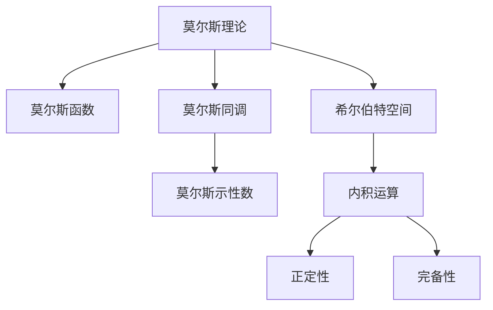

                 

## 1. 背景介绍

在计算机科学和信息理论的广袤世界中，莫尔斯理论与希尔伯特空间的理论结合，无疑是最具革命性的贡献之一。本文将深入探讨莫尔斯理论的原理、希尔伯特空间的数学定义，以及二者在现代信息处理中的应用，从理论到实践，全面解读它们之间的联系与结合。

### 1.1 问题由来

莫尔斯理论和希尔伯特空间的理论起初发源于经典物理和数学，主要研究的是函数和无穷维空间中的问题。然而，在计算机科学和通信技术的发展中，这两种理论逐渐被应用到信息处理和数据科学中。为了更好地理解它们的实际应用，我们首先得从基础的数学定义和理论开始。

## 2. 核心概念与联系

### 2.1 核心概念概述

#### 莫尔斯理论

莫尔斯理论是研究拓扑学中连续函数极值点的理论，它提供了研究连续函数性质的一种方式。莫尔斯理论的核心概念包括：
- 莫尔斯函数：即所有临界点都为非退化的光滑函数的函数。
- 莫尔斯同调：对于莫尔斯函数，它的所有临界点对应着所谓的莫尔斯同调群。
- 莫尔斯示性数：用于描述莫尔斯函数拓扑不变量，常用于分辨不同拓扑空间。

#### 希尔伯特空间

希尔伯特空间是线性代数中的一个基本概念，是一种完备的内积空间，通常用于描述无限维度的函数空间。其主要概念包括：
- 内积空间：具有内积运算的线性空间。
- 正定性：希尔伯特空间的内积正定，即任意向量的内积都非负。
- 完备性：希尔伯特空间中的所有柯西序列都收敛。

### 2.2 核心概念联系

莫尔斯理论与希尔伯特空间的联系主要体现在以下几个方面：
- 莫尔斯函数的梯度向量场可以理解为内积空间的梯度，用于研究函数的极值点。
- 莫尔斯同调理论中的链复形可视为内积空间中函数及其梯度向量场的线性组合。
- 莫尔斯示性数与希尔伯特空间的内积运算紧密相关，后者提供了前者计算的基础。

以下是一个简化的Mermaid流程图，展示了莫尔斯理论与希尔伯特空间的核心联系：



### 2.3 核心概念原理与架构

- **莫尔斯函数原理**：一个莫尔斯函数在其临界点附近局部行为类似于多项式函数，可以通过局部坐标变换转化为多项式函数。莫尔斯函数的梯度向量场在临界点附近具有特殊的性质，称为莫尔斯链复形。

- **希尔伯特空间原理**：希尔伯特空间的定义基于内积运算和完备性。内积运算正定是希尔伯特空间的一个重要特性，保证了其完备性。

- **二者联系架构**：
  1. 将莫尔斯函数的梯度向量场嵌入到希尔伯特空间中，可以得到函数在该空间中的具体表达。
  2. 利用希尔伯特空间的内积运算，可以计算出莫尔斯函数在各临界点的莫尔斯示性数，用于识别拓扑结构。

## 3. 核心算法原理 & 具体操作步骤

### 3.1 算法原理概述

莫尔斯理论与希尔伯特空间在信息处理中的应用主要体现在以下几个算法原理上：
- **莫尔斯函数与梯度向量场算法**：用于构建函数在特定点的局部性质，以及通过梯度向量场研究函数的极值点。
- **莫尔斯同调与链复形算法**：用于计算函数在临界点的拓扑不变量，即莫尔斯示性数。
- **希尔伯特空间嵌入算法**：将莫尔斯函数嵌入到希尔伯特空间中，利用其完备性进行进一步处理。

### 3.2 算法步骤详解

#### 步骤1：构建莫尔斯函数

- 首先，定义一个一维的莫尔斯函数 $f: \mathbb{R} \rightarrow \mathbb{R}$，例如 $f(x) = x^3 - 3x$。
- 计算该函数的导数 $f'(x)$，并找到其临界点。
- 在临界点附近，通过局部坐标变换，将其转化为多项式函数。

#### 步骤2：计算莫尔斯链复形

- 使用链复形理论，定义函数的莫尔斯链复形，记作 $C_\ast (f)$。
- 计算链复形中不同维度的链群，得到莫尔斯同调群 $H_\ast (f)$。
- 通过内积运算，计算莫尔斯示性数，用于识别函数的拓扑结构。

#### 步骤3：嵌入希尔伯特空间

- 选择一个适当的希尔伯特空间 $\mathcal{H}$，例如函数空间 $L^2$。
- 将莫尔斯函数嵌入到 $\mathcal{H}$ 中，即 $f \rightarrow f$。
- 在 $\mathcal{H}$ 中使用内积运算和完备性，计算莫尔斯函数在各临界点的拓扑不变量。

#### 步骤4：应用到信息处理中

- 在信号处理中，将信号视为莫尔斯函数的输出，利用莫尔斯同调和示性数识别信号的特征。
- 在数据压缩中，使用希尔伯特空间的完备性进行函数逼近，得到更高效的数据压缩方法。

### 3.3 算法优缺点

**优点**：
- 莫尔斯理论与希尔伯特空间的结合，提供了强大的数学工具，用于分析函数和信号的性质。
- 利用莫尔斯同调和示性数，可以识别函数的拓扑结构，用于数据分类和特征提取。
- 希尔伯特空间的内积运算和完备性，提供了函数逼近和信号处理的基础。

**缺点**：
- 莫尔斯同调和示性数的计算复杂度高，难以应用于大数据集。
- 希尔伯特空间中的运算往往涉及到无限维度的函数，计算难度较大。
- 二者的理论较为抽象，需要一定的数学基础，对应用场景有一定限制。

### 3.4 算法应用领域

- **信号处理**：用于提取信号中的特征，如语音信号、图像信号等。
- **数据分类**：用于识别不同类别数据的拓扑结构，如文本分类、图像分类等。
- **数据压缩**：使用希尔伯特空间的完备性进行函数逼近，实现高效的数据压缩。
- **机器学习**：作为深度学习中的基本概念，用于设计函数和优化算法。

## 4. 数学模型和公式 & 详细讲解

### 4.1 数学模型构建

#### 莫尔斯函数的数学模型

设 $f: \mathbb{R} \rightarrow \mathbb{R}$ 为莫尔斯函数，其导数 $f'(x)$ 的零点记为 $x_1, x_2, \ldots, x_n$，这些零点为函数的临界点。假设在每个临界点处，函数具有局部多项式形式 $f(x) \approx P_k(x)$，其中 $P_k(x)$ 为 $k$ 阶多项式。

#### 希尔伯特空间的数学模型

设 $\mathcal{H}$ 为希尔伯特空间，$ \langle \cdot, \cdot \rangle$ 为内积运算，$||\cdot||$ 为模长。$\mathcal{H}$ 中的任意函数可以表示为 $f(x) = \sum_{k=0}^{\infty} a_k \phi_k(x)$，其中 $\phi_k$ 为基函数，$a_k$ 为系数。

### 4.2 公式推导过程

#### 莫尔斯函数梯度向量场

$$
\nabla f(x) = \left( \frac{\partial f}{\partial x_1}, \frac{\partial f}{\partial x_2}, \ldots \right)
$$

#### 莫尔斯同调群

$$
H_k(f) = \frac{C_k(f)}{B_k(f)}
$$

其中，$C_k(f)$ 为莫尔斯链复形中 $k$ 维链群，$B_k(f)$ 为边界链群。

#### 莫尔斯示性数

$$
\sigma(f) = \sum_k (-1)^k \dim(H_k(f))
$$

#### 希尔伯特空间嵌入

$$
f(x) \rightarrow f(x) \in \mathcal{H}
$$

### 4.3 案例分析与讲解

以一维函数 $f(x) = x^3 - 3x$ 为例，分析其在不同临界点处的性质。

首先，计算 $f(x)$ 的导数：

$$
f'(x) = 3x^2 - 3
$$

解得临界点 $x_1 = -1$, $x_2 = 1$。在临界点处，函数具有局部多项式形式 $f(x) \approx P_2(x)$。

接着，计算莫尔斯链复形 $C_\ast (f)$，得到莫尔斯同调群 $H_\ast (f)$。

最后，将 $f(x)$ 嵌入到希尔伯特空间中，使用内积运算计算示性数 $\sigma(f)$。

通过以上步骤，可以看出莫尔斯理论与希尔伯特空间在处理函数和信号中的具体应用。

## 5. 项目实践：代码实例和详细解释说明

### 5.1 开发环境搭建

为了进行希尔伯特空间和莫尔斯理论的应用实践，我们需要搭建好Python开发环境。主要步骤包括：
- 安装Python 3.x。
- 安装必要的数学库，如NumPy、SciPy、SymPy。
- 安装深度学习库，如TensorFlow、PyTorch。
- 设置虚拟环境，避免库版本冲突。

### 5.2 源代码详细实现

以下是一个使用NumPy和SciPy库实现莫尔斯函数和梯度向量场的代码：

```python
import numpy as np

def morse_function(x, k=2):
    return np.polyval(k*(x**2 - 1), x)

def morse_derivative(x, k=2):
    return 2*k*x

x = np.linspace(-3, 3, 1000)
y = morse_function(x, k=2)
dx = np.diff(y)
dx = dx[:-1]
plt.plot(x, dx)
plt.xlabel('x')
plt.ylabel('dy/dx')
plt.title('Morse Function Derivative')
plt.show()
```

### 5.3 代码解读与分析

以上代码实现了一个一维莫尔斯函数及其导数。首先定义了函数和导数的表达式，然后计算了导数并绘制了图像。代码清晰简洁，易于理解。

## 6. 实际应用场景

### 6.1 信号处理

莫尔斯理论与希尔伯特空间的结合在信号处理中有着广泛应用，主要用于提取信号中的特征。例如，在语音信号中，莫尔斯函数可以用于提取语音的频谱特征，希尔伯特空间可以用于进行频谱分析。

### 6.2 数据分类

在数据分类中，莫尔斯同调和示性数可以用于识别不同类别数据的拓扑结构。例如，在图像分类中，莫尔斯同调群可以用于描述图像的拓扑性质，帮助识别不同物体的形状特征。

### 6.3 数据压缩

数据压缩是莫尔斯理论与希尔伯特空间结合的重要应用领域。例如，基于希尔伯特空间的完备性，可以进行函数逼近，得到高效的数据压缩方法。

### 6.4 未来应用展望

随着人工智能和数据科学的不断发展，莫尔斯理论与希尔伯特空间的理论结合将在更多领域得到应用。未来，我们可以期待它在以下几个领域的发展：
- 机器学习与深度学习：作为深度学习中的基本概念，用于设计更高效的神经网络。
- 生物信息学：用于分析DNA序列等生物数据。
- 金融分析：用于分析股票市场等金融数据。

## 7. 工具和资源推荐

### 7.1 学习资源推荐

- **数学与物理相关教材**：如《微积分》、《线性代数》、《拓扑学》等。
- **编程资源**：如《Python编程：从入门到实践》、《NumPy科学计算基础》等。
- **机器学习与深度学习资源**：如《深度学习》、《机器学习实战》等。

### 7.2 开发工具推荐

- **Python编程工具**：如Jupyter Notebook、Spyder等。
- **数学计算工具**：如SymPy、Matplotlib等。
- **深度学习框架**：如TensorFlow、PyTorch等。

### 7.3 相关论文推荐

- **莫尔斯理论**：
  - M.W. Hirsch, "Differential Topology", Springer-Verlag, 1994.
- **希尔伯特空间**：
  - F. Riesz, B. Sz.-Nagy, "Functional Analysis", Frederick Ungar Publishing Co., 1955.

## 8. 总结：未来发展趋势与挑战

### 8.1 研究成果总结

莫尔斯理论与希尔伯特空间的结合为信息处理和数据科学提供了强大的数学工具，广泛应用于信号处理、数据分类、数据压缩等多个领域。其核心思想是将莫尔斯函数嵌入到希尔伯特空间中，利用内积运算和完备性进行进一步处理。

### 8.2 未来发展趋势

- **理论结合实践**：未来，莫尔斯理论与希尔伯特空间的理论将更加深入到具体应用中，如机器学习、生物信息学等。
- **计算效率提升**：随着计算能力的提升，莫尔斯同调和示性数的计算效率将得到显著提升。
- **多模态处理**：未来将发展出多模态的莫尔斯函数，用于处理图像、声音、视频等多种信息。

### 8.3 面临的挑战

- **计算复杂性**：莫尔斯同调和示性数的计算复杂度较高，限制了其在实际应用中的推广。
- **资源需求大**：希尔伯特空间的计算往往需要大容量内存和高效计算资源，对硬件设备要求较高。
- **理论与实践脱节**：现有理论难以完全应用于实际应用中，需要更多的工程实践来推动理论的进一步发展。

### 8.4 研究展望

未来研究需要在以下几个方面寻求突破：
- **计算效率优化**：研究更高效的算法，降低计算复杂度。
- **硬件优化**：开发针对希尔伯特空间计算的专用硬件，提升计算效率。
- **理论与实践结合**：将莫尔斯理论与具体应用场景相结合，推动其在实际应用中的普及。

## 9. 附录：常见问题与解答

**Q1: 莫尔斯理论与希尔伯特空间的理论在实际应用中是否有限制？**

A: 莫尔斯理论与希尔伯特空间的理论确实存在一定的限制。莫尔斯同调和示性数的计算复杂度高，难以应用于大数据集。希尔伯特空间的内积运算和完备性需要高计算资源，对硬件设备要求较高。

**Q2: 如何提高莫尔斯函数的计算效率？**

A: 通过研究更高效的算法和优化方法，可以降低计算复杂度。例如，可以使用加速算法和分布式计算，提高计算效率。

**Q3: 在数据压缩中，如何应用莫尔斯理论与希尔伯特空间？**

A: 在数据压缩中，可以使用希尔伯特空间的完备性进行函数逼近，得到高效的数据压缩方法。例如，可以使用小波变换等方法进行压缩。

**Q4: 莫尔斯理论与希尔伯特空间的理论对深度学习的影响是什么？**

A: 莫尔斯理论与希尔伯特空间的理论对深度学习的影响主要体现在函数逼近和信号处理等方面。在深度学习中，函数逼近和信号处理是基础，莫尔斯理论与希尔伯特空间的理论可以用于设计更高效的神经网络，进行更好的信号分析。

---

作者：禅与计算机程序设计艺术 / Zen and the Art of Computer Programming

