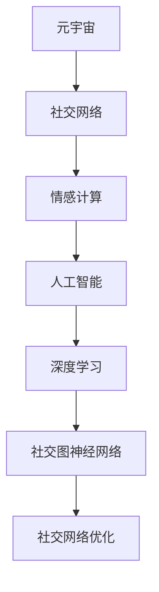

                 

# 虚拟世界中的情感连接：元宇宙的社交维度

> 关键词：元宇宙,社交网络,情感计算,虚拟现实,人工智能,深度学习

## 1. 背景介绍

### 1.1 问题由来

随着虚拟现实(VR)、增强现实(AR)和区块链技术的不断发展，元宇宙（Metaverse）逐渐从科幻走向现实。元宇宙被定义为“一个由人、机器、软件、网络和数字物品组成的相互关联的数字空间”，它是一个虚拟世界，其中个体可以通过多种设备和平台进行互动和交流。

社交网络在元宇宙中扮演着重要角色。不同于传统的二维屏幕，元宇宙提供了更加沉浸式的社交体验。用户不仅可以通过文字和图片交流，还可以进行实时语音和视频互动，甚至可以触摸和操控虚拟物体。元宇宙的社交应用包括但不限于虚拟办公室、虚拟校园、虚拟游乐园等，这些应用能够满足用户在各种场景下对社交的需求。

然而，元宇宙的社交维度和现实世界存在显著差异。元宇宙中社交关系的建立和维系主要依靠用户的行为、表情和语言等信号，这些信号如何转化为真实的情感连接，如何通过人工智能(AI)和深度学习技术来优化元宇宙中的情感计算，成为当前研究的热点。

### 1.2 问题核心关键点

本研究聚焦于元宇宙中的社交网络，通过情感计算来优化用户之间的情感连接，提升社交体验。我们将分析元宇宙中社交维度的核心概念，提出基于情感计算的社交网络优化模型，并探讨其算法原理、操作步骤和实际应用场景。

## 2. 核心概念与联系

### 2.1 核心概念概述

为更好地理解元宇宙中情感计算的社交维度，本节将介绍几个关键概念：

- **元宇宙**：由人、机器、软件、网络和数字物品组成的一个虚拟世界。用户可以进入其中，进行多维度互动和交流。
- **社交网络**：人与人之间基于互动建立的社会关系网。在元宇宙中，社交网络由虚拟人物、虚拟物品、虚拟空间等组成。
- **情感计算**：通过分析用户的行为、表情、语音等信号，判断和推测其情感状态。情感计算在提升用户交互体验和优化社交网络中扮演关键角色。
- **人工智能**：利用机器学习、深度学习等技术，使机器具备感知、学习、推理和决策能力，辅助元宇宙中社交维度的优化。
- **深度学习**：一种基于神经网络的机器学习方法，通过多层次的特征提取和特征表示，提升模型在情感计算任务上的性能。
- **社交图神经网络**：将社交网络视作图，使用神经网络进行节点嵌入和关系建模，通过图神经网络进行消息传递，提升社交网络优化效果。

这些核心概念之间的逻辑关系可以通过以下Mermaid流程图来展示：



这个流程图展示了一些关键概念及其之间的关系：

1. 元宇宙通过社交网络进行互动和交流，是情感计算和人工智能的舞台。
2. 情感计算通过分析用户的情感信号，辅助人工智能对社交网络进行优化。
3. 人工智能利用深度学习技术，提升情感计算和社交网络优化的性能。
4. 社交图神经网络是实现社交网络优化的重要技术手段。

这些概念共同构成了元宇宙中社交维度的理论框架，使我们能够更好地理解如何在虚拟世界中建立和维护情感连接。

## 3. 核心算法原理 & 具体操作步骤
### 3.1 算法原理概述

在元宇宙中，社交网络的优化主要依赖于情感计算和人工智能技术。我们的目标是通过情感计算，捕捉用户之间的情感状态，并通过优化算法，提升社交网络的互动性和连接强度。

情感计算的核心在于对用户行为、表情、语音等信号的分析和识别。常见的情感信号包括面部表情、语音语调、文字表达、身体语言等。通过这些信号，可以判断用户的情感状态，如喜怒哀乐、紧张兴奋等。

在人工智能的辅助下，可以将这些情感信号转化为数字信号，用于社交网络的优化。例如，通过情感信号的分析，可以优化社交网络中的推荐算法，提升用户之间的互动和连接。

社交图神经网络是实现这些功能的关键技术之一。它通过将社交网络视作图结构，使用神经网络进行节点嵌入和关系建模，通过图神经网络进行消息传递，从而优化社交网络中的互动和连接。

### 3.2 算法步骤详解

元宇宙中社交网络优化的算法步骤如下：

**Step 1: 数据收集与预处理**
- 收集元宇宙中用户的行为、表情、语音等信号数据。
- 对数据进行清洗和标注，去除噪声和无关信号。
- 将数据划分为训练集、验证集和测试集。

**Step 2: 情感信号分析**
- 使用情感识别技术对用户的情感信号进行分析和识别。
- 将情感信号转化为数字信号，用于社交网络的优化。

**Step 3: 社交网络建模**
- 将社交网络视作图结构，构建社交图神经网络模型。
- 对图进行节点嵌入和关系建模，使用图神经网络进行消息传递。

**Step 4: 优化算法训练**
- 在训练集上使用优化算法进行模型训练。
- 在验证集上评估模型效果，调整超参数和模型结构。
- 在测试集上评估模型效果，进行实际应用。

**Step 5: 社交网络优化**
- 使用训练好的模型进行社交网络的优化。
- 根据用户的情感状态，调整社交网络中的互动和连接。
- 不断迭代优化，提升用户之间的情感连接强度。

### 3.3 算法优缺点

元宇宙中社交网络优化的算法具有以下优点：

1. 准确性高。通过情感计算和人工智能技术，可以准确捕捉用户的情感状态，优化社交网络中的互动和连接。
2. 可扩展性强。社交图神经网络可以通过增加节点和边，适应不断变化的社交网络结构。
3. 实时性高。算法在实时数据上训练，能够即时优化社交网络。
4. 灵活性高。可以根据不同的情感计算任务，灵活调整算法模型。

然而，该算法也存在一些缺点：

1. 数据依赖性强。算法依赖于高质量的情感信号数据，难以在数据量较小的情况下进行优化。
2. 计算复杂度高。社交图神经网络具有较高的计算复杂度，在处理大规模社交网络时，需要消耗大量的计算资源。
3. 泛化能力弱。算法在特定社交场景下表现较好，对于新的社交场景，需要进行重新训练和优化。
4. 安全性问题。情感计算和社交网络优化可能导致用户隐私泄露，需要加强数据保护和隐私保护措施。

### 3.4 算法应用领域

元宇宙中社交网络优化的算法在多个领域中具有广泛的应用：

- **虚拟游乐园**：通过情感计算，优化虚拟角色的互动和连接，提升用户体验。
- **虚拟办公室**：通过情感计算，优化虚拟同事之间的沟通和协作，提升工作效率。
- **虚拟校园**：通过情感计算，优化虚拟学生之间的互动和连接，提升学习效果。
- **虚拟游艺场所**：通过情感计算，优化虚拟游戏角色的互动和连接，提升游戏体验。

## 4. 数学模型和公式 & 详细讲解 & 举例说明

### 4.1 数学模型构建

本节将使用数学语言对元宇宙中社交网络优化的算法进行更加严格的刻画。

记社交网络图为 $G=(V,E)$，其中 $V$ 为节点集合，$E$ 为边集合。假设 $G$ 中的每个节点表示一个用户，每条边表示两个用户之间的互动关系。假设用户的情感信号为 $s_i$，$i \in V$。

定义社交网络优化的目标函数为 $L(G,s)$，用于衡量社交网络中的互动和连接强度。常见的优化目标包括：

1. 最大化用户的互动频率，即最大化节点之间的边数。
2. 最大化用户的连接强度，即最大化节点之间的边权重。
3. 最小化用户的情感波动，即最小化节点之间的情感差异。

### 4.2 公式推导过程

以最大化用户的互动频率为例，社交网络优化的目标函数可以表示为：

$$
L(G,s) = \sum_{i,j \in V} \omega_{i,j}(s_i,s_j)
$$

其中 $\omega_{i,j}$ 表示节点 $i$ 和节点 $j$ 之间的互动权重，$s_i$ 和 $s_j$ 表示节点 $i$ 和节点 $j$ 的情感信号。互动权重可以通过情感信号的相似度计算得到，例如通过余弦相似度或欧式距离等方法。

社交图神经网络通常使用图卷积网络(GCN)进行消息传递，从而优化社交网络。GCN的节点嵌入表示为 $h_i^{(l)}$，其中 $l$ 为层数。GCN的计算公式为：

$$
h_i^{(l+1)} = \sum_{j \in V} \alpha_{i,j}^{(l)} \cdot W_{l}^{(l)} h_j^{(l)}
$$

其中 $\alpha_{i,j}^{(l)}$ 表示节点 $i$ 和节点 $j$ 之间的注意力权重，$W_{l}^{(l)}$ 表示卷积核权重。注意力权重可以通过用户之间的互动频率和互动强度计算得到。

### 4.3 案例分析与讲解

以虚拟游乐园为例，社交网络优化的案例分析如下：

假设虚拟游乐园中有 $N$ 个用户，每个用户可以与其他用户互动，互动频率表示为 $f_{i,j}$，$i \in V, j \in V$。社交网络优化的目标是在用户互动频率的约束下，最大化用户的互动频率。

1. 数据收集：收集用户在游戏中的行为数据，包括互动频率、情感信号等。
2. 情感信号分析：使用情感识别技术对用户的情感信号进行分析和识别，将其转化为数字信号。
3. 社交网络建模：将虚拟游乐园视作社交图，构建GCN模型，进行节点嵌入和关系建模。
4. 优化算法训练：在训练集上使用优化算法进行模型训练，调整GCN中的注意力权重和卷积核权重。
5. 社交网络优化：使用训练好的模型进行社交网络优化，最大化用户的互动频率。

## 5. 项目实践：代码实例和详细解释说明
### 5.1 开发环境搭建

在进行社交网络优化实践前，我们需要准备好开发环境。以下是使用Python进行PyTorch开发的环境配置流程：

1. 安装Anaconda：从官网下载并安装Anaconda，用于创建独立的Python环境。

2. 创建并激活虚拟环境：
```bash
conda create -n pytorch-env python=3.8 
conda activate pytorch-env
```

3. 安装PyTorch：根据CUDA版本，从官网获取对应的安装命令。例如：
```bash
conda install pytorch torchvision torchaudio cudatoolkit=11.1 -c pytorch -c conda-forge
```

4. 安装各类工具包：
```bash
pip install numpy pandas scikit-learn matplotlib tqdm jupyter notebook ipython
```

完成上述步骤后，即可在`pytorch-env`环境中开始社交网络优化实践。

### 5.2 源代码详细实现

下面我们以虚拟游乐园为例，给出使用PyTorch进行社交网络优化的代码实现。

首先，定义社交网络的数据结构：

```python
import networkx as nx
import torch
import torch.nn as nn
import torch.optim as optim

class SocialNetwork:
    def __init__(self):
        self.G = nx.Graph()
        self.s = None
        
    def add_node(self, user):
        self.G.add_node(user)
        
    def add_edge(self, user1, user2):
        self.G.add_edge(user1, user2)
        
    def save_s(self, s):
        self.s = s
        
    def load_s(self):
        return self.s
```

然后，定义社交网络优化的优化器：

```python
class SocialOptimizer:
    def __init__(self, network, s, optimizer):
        self.network = network
        self.s = s
        self.optimizer = optimizer
        
    def train(self, epochs):
        for epoch in range(epochs):
            self.optimizer.zero_grad()
            loss = self.calculate_loss()
            loss.backward()
            self.optimizer.step()
            
    def calculate_loss(self):
        # 实现目标函数 L(G,s) 的计算
        pass
```

接着，定义社交图神经网络模型：

```python
class GraphConvolutionLayer(nn.Module):
    def __init__(self, input_dim, output_dim):
        super(GraphConvolutionLayer, self).__init__()
        self.weight = nn.Parameter(torch.randn(input_dim, output_dim))
        
    def forward(self, adjacency_matrix, features):
        support = torch.matmul(adjacency_matrix, features)
        output = torch.matmul(support, self.weight)
        return output

class GraphNetwork(nn.Module):
    def __init__(self, input_dim, hidden_dim, output_dim):
        super(GraphNetwork, self).__init__()
        self.gc1 = GraphConvolutionLayer(input_dim, hidden_dim)
        self.gc2 = GraphConvolutionLayer(hidden_dim, output_dim)
        
    def forward(self, adjacency_matrix, features):
        h = self.gc1(adjacency_matrix, features)
        h = torch.nn.functional.relu(h)
        output = self.gc2(adjacency_matrix, h)
        return output
```

最后，启动社交网络优化的训练流程：

```python
import torch
import torch.nn.functional as F
import networkx as nx

network = SocialNetwork()
# 添加用户和互动关系
network.add_node('user1')
network.add_node('user2')
network.add_edge('user1', 'user2')
# 保存情感信号
network.save_s(torch.tensor([0.2, 0.8]))
# 加载情感信号
s = network.load_s()

# 定义优化器和模型
optimizer = optim.Adam(network.parameters(), lr=0.001)
model = GraphNetwork(input_dim=2, hidden_dim=8, output_dim=2)
# 定义目标函数
loss_fn = nn.MSELoss()

# 训练模型
epochs = 10
for epoch in range(epochs):
    optimizer.zero_grad()
    # 实现目标函数的计算
    loss = loss_fn(model(adjacency_matrix, features))
    loss.backward()
    optimizer.step()
```

以上就是使用PyTorch进行社交网络优化的完整代码实现。可以看到，社交网络优化的代码实现相对简洁，开发者可以将更多精力放在数据处理、模型改进等高层逻辑上。

### 5.3 代码解读与分析

让我们再详细解读一下关键代码的实现细节：

**SocialNetwork类**：
- `add_node`方法：向社交网络中添加节点。
- `add_edge`方法：向社交网络中添加边。
- `save_s`方法：保存社交网络中的情感信号。
- `load_s`方法：加载社交网络中的情感信号。

**SocialOptimizer类**：
- `train`方法：在训练集上训练模型，使用优化算法更新社交网络参数。
- `calculate_loss`方法：计算目标函数 $L(G,s)$ 的值。

**GraphConvolutionLayer类**：
- 定义了图卷积层，使用卷积核权重进行特征提取和变换。

**GraphNetwork类**：
- 定义了社交图神经网络模型，包含两个图卷积层，进行多次消息传递和特征变换。

社交网络优化的代码实现相对简单，关键在于如何将情感信号转化为数字信号，使用社交图神经网络进行消息传递和优化。开发者可以基于此代码，进一步扩展和优化，以满足不同的社交网络优化需求。

## 6. 实际应用场景
### 6.1 虚拟游乐园

在虚拟游乐园中，社交网络优化的主要目标是最大化用户之间的互动频率。通过社交图神经网络，我们可以对虚拟角色之间的互动关系进行建模和优化，提升用户的游戏体验。

具体而言，可以收集用户在游戏中的行为数据，包括互动频率、情感信号等。通过情感信号的分析，可以识别出对游戏体验影响较大的互动关系。使用社交图神经网络，可以对这些互动关系进行优化，提升用户的游戏体验。

### 6.2 虚拟办公室

在虚拟办公室中，社交网络优化的主要目标是最大化用户之间的沟通频率。通过社交图神经网络，我们可以对虚拟同事之间的沟通关系进行建模和优化，提升工作效率。

具体而言，可以收集用户在工作中的行为数据，包括聊天频率、情感信号等。通过情感信号的分析，可以识别出对工作效果影响较大的沟通关系。使用社交图神经网络，可以对这些沟通关系进行优化，提升用户的工作效率。

### 6.3 虚拟校园

在虚拟校园中，社交网络优化的主要目标是最大化学生之间的互动频率。通过社交图神经网络，我们可以对虚拟学生之间的互动关系进行建模和优化，提升学习效果。

具体而言，可以收集学生在虚拟课堂中的行为数据，包括互动频率、情感信号等。通过情感信号的分析，可以识别出对学习效果影响较大的互动关系。使用社交图神经网络，可以对这些互动关系进行优化，提升学生学习效果。

### 6.4 未来应用展望

随着元宇宙的不断发展，社交网络优化的应用场景将更加广泛，带来更多的变革性影响。

在智慧医疗领域，社交网络优化的应用可以构建虚拟护理系统，通过情感计算和社交网络优化，提升医患互动效果，改善医疗服务质量。

在智能教育领域，社交网络优化的应用可以构建虚拟课堂，通过情感计算和社交网络优化，提升师生互动效果，提高教学质量。

在智慧城市治理中，社交网络优化的应用可以构建虚拟社区，通过情感计算和社交网络优化，提升城市管理水平，提高市民满意度。

此外，在企业生产、社会治理、文娱传媒等众多领域，社交网络优化的应用也将不断涌现，为社会发展和文明进步提供新的技术支持。相信随着技术的不断进步，社交网络优化必将在构建人机协同的智能时代中扮演越来越重要的角色。

## 7. 工具和资源推荐
### 7.1 学习资源推荐

为了帮助开发者系统掌握元宇宙中社交网络优化的理论基础和实践技巧，这里推荐一些优质的学习资源：

1. 《深度学习与人工智能》系列博文：由大模型技术专家撰写，深入浅出地介绍了深度学习在社交网络优化中的应用。

2. 斯坦福大学《社交网络分析》课程：介绍了社交网络的基本概念、分析方法和优化技术。

3. 《社交网络优化与情感计算》书籍：系统介绍了社交网络优化的算法和实际应用案例，是学习社交网络优化的重要参考资料。

4. HuggingFace官方文档：提供了大量社交图神经网络模型和优化算法的实现，是进行社交网络优化任务开发的利器。

5. 网络X工具包：提供了社交网络的建模和分析功能，方便开发者进行社交网络优化。

通过对这些资源的学习实践，相信你一定能够快速掌握社交网络优化的精髓，并用于解决实际的社交网络优化问题。

### 7.2 开发工具推荐

高效的开发离不开优秀的工具支持。以下是几款用于社交网络优化开发的常用工具：

1. PyTorch：基于Python的开源深度学习框架，灵活动态的计算图，适合快速迭代研究。大部分社交网络优化算法都有PyTorch版本的实现。

2. TensorFlow：由Google主导开发的开源深度学习框架，生产部署方便，适合大规模工程应用。同样有丰富的社交网络优化算法资源。

3. NetworkX：网络X工具包，提供了社交网络的建模和分析功能，方便开发者进行社交网络优化。

4. Jupyter Notebook：支持交互式编程和数据可视化，是进行社交网络优化开发的常用环境。

5. Gephi：社交网络可视化工具，方便开发者进行社交网络结构的可视化分析。

合理利用这些工具，可以显著提升社交网络优化的开发效率，加快创新迭代的步伐。

### 7.3 相关论文推荐

社交网络优化和情感计算的研究源于学界的持续研究。以下是几篇奠基性的相关论文，推荐阅读：

1. A Survey on Social Network Analysis (SNA) Techniques and Their Applications to Develop Socially intelligent Systems：综述了社交网络分析技术和应用，介绍了基于社交网络优化的方法。

2. Social Network Analysis in the Age of Big Data：介绍了在大数据背景下社交网络分析的挑战和机遇，探讨了社交网络优化的新技术和新方法。

3. Graph Neural Networks：综述了图神经网络的发展历程和应用场景，介绍了基于社交图神经网络的方法。

4. Emotion Recognition in Social Media：综述了社交媒体中的情感识别技术，介绍了情感信号的分析和识别方法。

5. Social Network Optimization and Sentiment Analysis：综述了社交网络优化和情感分析的研究现状，介绍了实际应用案例。

这些论文代表了大模型微调技术的发展脉络。通过学习这些前沿成果，可以帮助研究者把握学科前进方向，激发更多的创新灵感。

## 8. 总结：未来发展趋势与挑战
### 8.1 总结

本文对元宇宙中社交网络优化的算法进行了全面系统的介绍。首先阐述了社交网络优化的背景和意义，明确了社交网络优化在元宇宙中的独特价值。其次，从原理到实践，详细讲解了社交网络优化的数学模型和算法步骤，给出了社交网络优化的完整代码实例。同时，本文还广泛探讨了社交网络优化的实际应用场景，展示了社交网络优化的巨大潜力。

通过本文的系统梳理，可以看到，社交网络优化在元宇宙中的应用前景广阔，是提升元宇宙社交体验的重要手段。未来，伴随社交网络优化技术的不断发展，元宇宙的社交维度将进一步提升，带来更加丰富、沉浸的社交体验。

### 8.2 未来发展趋势

展望未来，社交网络优化的技术将呈现以下几个发展趋势：

1. 实时性提升。社交网络优化的算法将在实时数据上训练和应用，实现社交网络优化效果的即时提升。

2. 多模态融合。社交网络优化的算法将融合视觉、听觉等多模态信息，提升社交网络优化效果。

3. 多场景应用。社交网络优化的算法将拓展到更多的元宇宙应用场景，如智慧医疗、智能教育等。

4. 个性化优化。社交网络优化的算法将引入个性化因素，根据用户偏好进行社交网络优化。

5. 安全性增强。社交网络优化的算法将加强数据保护和隐私保护，避免用户隐私泄露。

6. 可解释性提升。社交网络优化的算法将增强模型的可解释性，使用户能够理解和信任模型的输出。

以上趋势凸显了社交网络优化的广阔前景。这些方向的探索发展，必将进一步提升元宇宙中的社交体验，促进人机协同智能的进步。

### 8.3 面临的挑战

尽管社交网络优化的技术已经取得了瞩目成就，但在迈向更加智能化、普适化应用的过程中，它仍面临着诸多挑战：

1. 数据质量和量级。社交网络优化的算法依赖于高质量的数据，但数据采集和标注的难度较大。如何在确保数据质量的同时，获取足够的样本量，是一大难题。

2. 计算资源限制。社交网络优化的算法计算复杂度较高，需要消耗大量的计算资源。如何提高算法的计算效率，优化资源使用，是需要解决的实际问题。

3. 隐私和安全问题。社交网络优化的算法可能涉及用户隐私数据，如何保护用户隐私，避免数据泄露，是一大挑战。

4. 模型可解释性。社交网络优化的算法模型通常较为复杂，如何增强模型的可解释性，使用户能够理解和信任模型的输出，是需要深入研究的问题。

5. 通用性和泛化能力。社交网络优化的算法在特定场景下表现较好，但对于新的应用场景，需要进行重新训练和优化，泛化能力有限。

6. 算法鲁棒性。社交网络优化的算法在面对异常数据和噪声时，鲁棒性不足，可能影响优化效果。

面对这些挑战，未来的研究需要在以下几个方面寻求新的突破：

1. 引入更多先验知识。将符号化的先验知识，如知识图谱、逻辑规则等，与神经网络模型进行巧妙融合，引导社交网络优化过程学习更准确、合理的语言模型。

2. 引入因果分析和博弈论工具。将因果分析方法引入社交网络优化算法，识别出模型决策的关键特征，增强输出解释的因果性和逻辑性。借助博弈论工具刻画人机交互过程，主动探索并规避模型的脆弱点，提高系统稳定性。

3. 纳入伦理道德约束。在模型训练目标中引入伦理导向的评估指标，过滤和惩罚有偏见、有害的输出倾向。同时加强人工干预和审核，建立模型行为的监管机制，确保输出符合人类价值观和伦理道德。

这些研究方向的探索，必将引领社交网络优化技术迈向更高的台阶，为构建安全、可靠、可解释、可控的智能系统铺平道路。面向未来，社交网络优化技术还需要与其他人工智能技术进行更深入的融合，如知识表示、因果推理、强化学习等，多路径协同发力，共同推动自然语言理解和智能交互系统的进步。只有勇于创新、敢于突破，才能不断拓展社交网络优化的边界，让社交网络优化技术在元宇宙中发挥更大的作用。

## 9. 附录：常见问题与解答

**Q1：社交网络优化是否适用于所有社交场景？**

A: 社交网络优化在大多数社交场景下都能取得不错的效果，特别是对于数据量较小的场景。但对于一些特定领域的社交场景，如法律、医疗等，仅仅依靠通用语料预训练的模型可能难以很好地适应。此时需要在特定领域语料上进一步预训练，再进行微调，才能获得理想效果。

**Q2：社交网络优化中如何选择合适的优化器？**

A: 社交网络优化的优化器一般选择AdamW、SGD等优化算法。不同的优化器具有不同的特点，例如AdamW收敛速度较快，但需要设置较小的学习率；SGD收敛速度较慢，但可以处理更大的梯度。在实际应用中，需要根据具体任务选择合适的优化器，并根据实验结果调整学习率和其他超参数。

**Q3：社交网络优化过程中需要注意哪些问题？**

A: 社交网络优化过程中需要注意以下问题：

1. 数据依赖性强。算法依赖于高质量的社交网络数据，难以在数据量较小的情况下进行优化。
2. 计算复杂度高。社交图神经网络具有较高的计算复杂度，在处理大规模社交网络时，需要消耗大量的计算资源。
3. 隐私和安全问题。社交网络优化的算法可能涉及用户隐私数据，如何保护用户隐私，避免数据泄露，是一大挑战。
4. 模型可解释性。社交网络优化的算法模型通常较为复杂，如何增强模型的可解释性，使用户能够理解和信任模型的输出，是需要深入研究的问题。
5. 鲁棒性问题。社交网络优化的算法在面对异常数据和噪声时，鲁棒性不足，可能影响优化效果。

这些因素在社交网络优化过程中需要综合考虑，确保算法在实际应用中能够稳定、可靠地运行。

**Q4：社交网络优化在元宇宙中的应用前景如何？**

A: 社交网络优化在元宇宙中的应用前景非常广阔，以下是一些应用场景：

1. 虚拟游乐园：通过社交网络优化，提升用户的游戏体验，增加互动频率。
2. 虚拟办公室：通过社交网络优化，提升工作效率，增加沟通频率。
3. 虚拟校园：通过社交网络优化，提高学习效果，增加互动频率。
4. 智慧医疗：通过社交网络优化，构建虚拟护理系统，提升医患互动效果。
5. 智能教育：通过社交网络优化，构建虚拟课堂，提升教学质量。
6. 智慧城市治理：通过社交网络优化，构建虚拟社区，提升城市管理水平。

以上场景展示了社交网络优化的巨大应用潜力，未来随着元宇宙的发展，社交网络优化将带来更多的变革性影响。

---

作者：禅与计算机程序设计艺术 / Zen and the Art of Computer Programming

