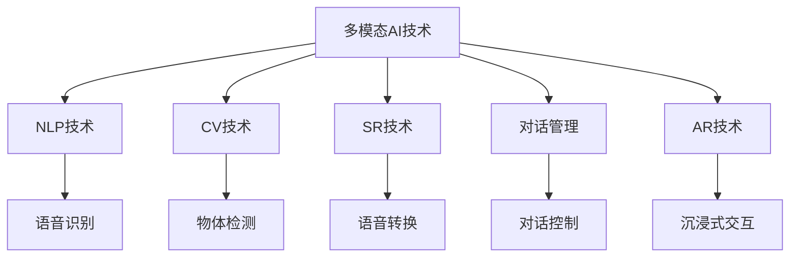

                 

# 虚拟助手中的多模态AI技术应用

> 关键词：多模态AI技术、虚拟助手、自然语言处理(NLP)、计算机视觉(CV)、语音识别(SR)、对话管理、增强现实(AR)、多模态感知、交互智能

## 1. 背景介绍

### 1.1 问题由来
随着人工智能技术的飞速发展，虚拟助手已成为智能家居、智能客服、智能办公等众多应用场景中的重要组成部分。它们不仅能够理解用户的语言和文字输入，还能够通过语音和视觉反馈，提供全方位的交互体验。然而，现有的虚拟助手技术仍然存在一些问题，如单一的感知能力、信息处理局限性等。因此，如何通过多模态AI技术提升虚拟助手的感知和交互能力，成为当前研究的焦点。

### 1.2 问题核心关键点
多模态AI技术主要通过结合语音、图像、文本等多种感官数据，构建更加全面、精准的智能感知模型。在虚拟助手应用中，多模态AI技术能够有效提升其对环境的理解和适应能力，提供更加自然、流畅的交互体验。具体核心关键点包括：

- 多感官数据的融合：如何高效地将语音、图像、文本等多种感官数据进行信息集成，构建统一的信息表示模型。
- 多模态感知模型的设计：如何设计高效的感知模型，既能捕捉数据的关键特征，又能避免数据冗余，提高系统处理速度和准确率。
- 跨模态对齐与转换：如何实现不同模态数据之间的对齐和转换，使得模型能够跨模态处理信息，提升信息处理的鲁棒性。
- 增强现实与虚拟现实融合：如何将增强现实(AR)和虚拟现实(VR)技术引入虚拟助手，提升其沉浸式体验和交互性。

### 1.3 问题研究意义
通过多模态AI技术，虚拟助手能够更好地理解环境、捕捉用户需求，提供更加精准的反馈和服务。这对于提升用户体验、提高工作效率、优化智能交互有着重要意义：

- 提升用户体验：通过多感官融合，虚拟助手能够更准确地识别用户意图，并提供更自然、流畅的交互。
- 提高工作效率：多模态感知模型能够捕捉复杂场景中的关键信息，辅助决策，提高任务处理效率。
- 优化智能交互：通过融合增强现实与虚拟现实技术，虚拟助手能够提供沉浸式交互体验，提升用户参与度和满意度。

## 2. 核心概念与联系

### 2.1 核心概念概述

为更好地理解多模态AI技术在虚拟助手中的应用，本节将介绍几个密切相关的核心概念：

- 多模态AI技术(Multimodal AI)：指同时利用多种模态(如语音、图像、文本等)信息的AI技术。通过多模态数据的融合，提升系统的感知能力和决策能力。
- 虚拟助手(Virtual Assistant)：指能够理解用户输入、提供个性化推荐和反馈的人工智能系统。常见应用包括智能家居、客服、办公等场景。
- 自然语言处理(NLP)：指让机器理解、处理和生成人类语言的技术。NLP技术在虚拟助手中常用于语音识别、文本理解等方面。
- 计算机视觉(CV)：指让机器识别、理解图像和视频的技术。CV技术在虚拟助手中常用于物体检测、场景理解等方面。
- 语音识别(SR)：指将语音转换为文本的技术。SR技术在虚拟助手中常用于接收用户语音输入。
- 对话管理(Dialog Management)：指对多轮对话进行管理和控制，确保对话流程的连贯性和准确性。
- 增强现实(AR)：指通过计算机生成信息增强现实世界的技术。AR技术在虚拟助手中常用于提供信息展示、交互提示等。

这些核心概念之间的逻辑关系可以通过以下Mermaid流程图来展示：



这个流程图展示多模态AI技术在虚拟助手中的关键组成部分及其相互关系：

1. 多模态AI技术通过融合NLP、CV、SR等技术，构建全面的感知模型。
2. NLP技术用于语音识别、文本理解，帮助系统接收和处理用户输入。
3. CV技术用于物体检测、场景理解，辅助系统判断环境状态。
4. SR技术用于语音转换，使系统能够接收和处理语音输入。
5. 对话管理用于控制多轮对话流程，确保系统能够连贯地回答用户问题。
6. AR技术用于增强现实体验，提升用户交互沉浸感。
7. 沉浸式交互增强用户体验，使系统能够提供更自然、流畅的对话。

## 3. 核心算法原理 & 具体操作步骤
### 3.1 算法原理概述

多模态AI技术在虚拟助手中的应用，主要通过多模态感知模型的构建和优化实现。其核心思想是：利用多种感官数据，构建多模态融合模型，提高系统的感知能力，通过优化模型参数，提升系统在不同场景下的表现。

形式化地，假设虚拟助手系统接收到的多模态数据为 $X = \{(x_1, x_2, ..., x_n)\}$，其中 $x_i$ 表示第 $i$ 个模态的数据，可以是语音、图像或文本。通过多模态感知模型 $M$，将 $X$ 映射为统一的表示 $Z = M(X)$，使得模型能够高效地处理多模态数据，输出对应的任务结果 $Y$。

通过梯度下降等优化算法，不断更新模型参数，最小化损失函数 $L(Y, \hat{Y})$，使得模型输出逼近真实标签 $\hat{Y}$。多模态感知模型的训练过程通常分为两个步骤：

1. 特征提取：将多模态数据分别通过各自的特征提取器转换为低维向量表示，如语音信号的MFCC特征、图像的卷积特征等。
2. 融合与对齐：将提取出的特征向量进行融合与对齐，通过加权平均、最大池化等方式，生成统一的表示向量。

最终得到的统一表示向量 $Z$，可以用于各种下游任务，如情感分析、意图识别等。多模态感知模型的训练过程通常包括以下关键步骤：

**Step 1: 特征提取**
- 分别定义语音、图像、文本等多种感官数据的特征提取器，如MFCC、CNN、BERT等。
- 使用各自特征提取器对输入的多模态数据进行特征提取，得到低维向量表示。

**Step 2: 特征融合与对齐**
- 设计特征融合策略，将不同模态的特征向量进行加权融合或拼接，生成统一的表示向量 $Z$。
- 引入对齐模块，使得不同模态的特征向量在空间上对齐，提升融合效果。

**Step 3: 模型训练**
- 定义任务目标函数，如交叉熵损失函数等。
- 使用梯度下降等优化算法，最小化损失函数，更新模型参数。

**Step 4: 模型评估与优化**
- 在测试集上评估模型的性能，对比训练前后的效果提升。
- 根据评估结果，调整特征提取器参数、融合策略等，优化模型性能。

### 3.2 算法步骤详解

以下以情感分析任务为例，详细讲解多模态感知模型的构建和优化过程：

**Step 1: 数据准备**
- 收集多模态数据集，包含语音、图像和文本信息。例如，一个用户在表达情绪时，可能会有语音、面部表情和文本描述。
- 对每个样本进行标注，将情感标签 $y$ 与语音、图像和文本数据 $x$ 对应。

**Step 2: 特征提取**
- 分别使用语音信号的MFCC特征提取器、图像的卷积神经网络(CNN)特征提取器、文本的BERT特征提取器，对多模态数据进行特征提取。
- 将提取出的特征向量拼接，得到多模态特征向量 $Z = [z_{audio}, z_{image}, z_{text}]$，其中 $z_{audio}$、$z_{image}$、$z_{text}$ 分别表示语音、图像和文本的特征向量。

**Step 3: 特征融合与对齐**
- 设计特征融合策略，将多模态特征向量进行加权平均或拼接，生成统一的表示向量 $Z$。
- 引入对齐模块，如使用特征加权平均的方式，对不同模态的特征向量进行空间对齐，生成最终的融合特征向量 $z$。

**Step 4: 模型训练**
- 定义情感分析任务的目标函数，如交叉熵损失函数。
- 使用梯度下降等优化算法，最小化损失函数，更新模型参数。

**Step 5: 模型评估与优化**
- 在测试集上评估模型的性能，使用准确率、F1值等指标评估模型效果。
- 根据评估结果，调整特征提取器参数、融合策略等，优化模型性能。

### 3.3 算法优缺点

多模态AI技术在虚拟助手中的应用，具有以下优点：

1. 全面感知：通过融合语音、图像、文本等多种模态数据，构建全面的感知模型，提升系统的信息处理能力。
2. 鲁棒性高：多模态数据融合可以有效减少单一模态数据的不确定性和噪声，提高系统鲁棒性。
3. 沉浸式体验：结合增强现实与虚拟现实技术，提供沉浸式交互体验，提升用户体验。
4. 个性化服务：多模态感知模型能够捕捉用户的全方位需求，提供更加个性化的服务。

同时，多模态AI技术也存在一些局限性：

1. 数据处理复杂：多模态数据融合需要设计复杂的特征提取和融合策略，增加了系统实现难度。
2. 计算成本高：多模态数据融合和处理需要占用大量计算资源，可能影响实时性。
3. 模型复杂度高：多模态感知模型的训练复杂度较高，需要更多的标注数据和计算资源。
4. 隐私与安全：多模态数据可能包含用户的敏感信息，需要加强隐私保护和数据安全。

尽管存在这些局限性，但就目前而言，多模态AI技术仍是大语言模型微调的重要补充，能够显著提升虚拟助手的感知和交互能力，为智能交互带来更广阔的应用场景。

### 3.4 算法应用领域

多模态AI技术在虚拟助手中的应用，广泛覆盖了智能家居、智能客服、智能办公等诸多领域，具体应用包括：

- 智能家居：通过多模态感知模型，实现语音控制、智能推荐、场景识别等功能，提升家居生活的智能化水平。
- 智能客服：结合语音识别、情感分析等技术，构建智能客服系统，提供个性化服务，提升客户满意度。
- 智能办公：利用多模态感知模型，实现文档理解、会议记录、日程管理等功能，提升办公效率和决策水平。
- 医疗健康：通过融合语音、图像、文本等数据，构建智能诊断系统，辅助医生诊断和治疗，提升医疗服务质量。
- 金融服务：结合多模态感知模型，实现语音识别、情感分析、行为识别等功能，提升金融服务体验和安全性。

除了这些典型应用，多模态AI技术还可以应用于更多场景，如教育、娱乐、交通等领域，为各行各业提供智能化的解决方案。

## 4. 数学模型和公式 & 详细讲解 & 举例说明
### 4.1 数学模型构建

多模态感知模型的数学建模通常包括以下几个关键步骤：

1. 特征提取：将多模态数据 $X = \{(x_1, x_2, ..., x_n)\}$ 转换为低维向量表示 $Z = [z_{audio}, z_{image}, z_{text}]$。
2. 特征融合与对齐：将多模态特征向量进行加权融合或拼接，生成统一的表示向量 $z$。
3. 模型训练：使用梯度下降等优化算法，最小化损失函数，更新模型参数。

以下以情感分析任务为例，详细讲解多模态感知模型的数学建模过程。

假设多模态感知模型的目标函数为 $L(Y, \hat{Y})$，其中 $Y$ 表示真实情感标签，$\hat{Y}$ 表示模型预测的情感标签。根据多模态感知模型的训练过程，可以构建如下数学模型：

$$
\begin{aligned}
L &= \frac{1}{N} \sum_{i=1}^N \ell(M(Z_i), y_i) \\
Z_i &= \{z_{audio_i}, z_{image_i}, z_{text_i}\} \\
z_i &= f_1(z_{audio_i}, z_{image_i}, z_{text_i})
\end{aligned}
$$

其中 $Z_i$ 表示第 $i$ 个样本的多模态特征向量，$z_i$ 表示经过特征融合与对齐后的统一表示向量，$f_1$ 表示特征融合函数，$\ell$ 表示损失函数。

### 4.2 公式推导过程

以情感分析任务为例，推导多模态感知模型的损失函数及其梯度计算公式。

假设多模态感知模型 $M$ 在输入 $Z_i$ 上的输出为 $\hat{y}_i=M(Z_i)$，表示预测情感标签。真实情感标签 $y_i \in \{1, 2, ..., k\}$，其中 $k$ 为情感标签的个数。二分类交叉熵损失函数定义为：

$$
\ell(M(Z_i), y_i) = -[y_i\log \hat{y}_i + (1-y_i)\log (1-\hat{y}_i)]
$$

代入目标函数 $L$，得：

$$
L = \frac{1}{N} \sum_{i=1}^N \ell(M(Z_i), y_i) = \frac{1}{N} \sum_{i=1}^N -[y_i\log M(Z_i) + (1-y_i)\log (1-M(Z_i))]
$$

将 $Z_i$ 代入 $z_i$，得：

$$
L = \frac{1}{N} \sum_{i=1}^N -[y_i\log M(z_i) + (1-y_i)\log (1-M(z_i))]
$$

根据链式法则，损失函数对参数 $\theta$ 的梯度为：

$$
\frac{\partial L}{\partial \theta} = -\frac{1}{N} \sum_{i=1}^N \frac{1}{M(z_i)} \frac{\partial M(z_i)}{\partial z_i} - \frac{1}{N} \sum_{i=1}^N \frac{1}{1-M(z_i)} \frac{\partial (1-M(z_i))}{\partial z_i}
$$

其中 $\frac{\partial M(z_i)}{\partial z_i}$ 和 $\frac{\partial (1-M(z_i))}{\partial z_i}$ 可以进一步递归展开，利用自动微分技术完成计算。

在得到损失函数的梯度后，即可带入梯度下降等优化算法，完成模型的迭代优化。重复上述过程直至收敛，最终得到适应情感分析任务的最优模型参数 $\theta$。

### 4.3 案例分析与讲解

以下以智能客服应用为例，详细讲解多模态感知模型在实际场景中的应用。

假设用户通过语音和文本输入，表达了咨询和投诉需求。智能客服系统通过语音识别技术，将语音输入转换为文本，通过文本理解技术，理解用户意图。同时，通过摄像头捕捉用户的面部表情和身体姿态，使用图像识别技术，分析用户的情绪状态。

系统将语音、文本和图像信息融合为多模态数据 $Z$，通过多模态感知模型 $M$ 进行情感分析，预测用户的情绪状态，并据此进行相应的回复。例如，当用户情绪较为消极时，系统可以自动调用情绪平复的回复模板，进行积极的情感安抚。

通过多模态感知模型的应用，智能客服系统能够更好地理解用户情绪，提供更加个性化的服务，提升用户体验。

## 5. 项目实践：代码实例和详细解释说明
### 5.1 开发环境搭建

在进行多模态感知模型开发前，我们需要准备好开发环境。以下是使用Python进行TensorFlow开发的环境配置流程：

1. 安装Anaconda：从官网下载并安装Anaconda，用于创建独立的Python环境。

2. 创建并激活虚拟环境：
```bash
conda create -n tf-env python=3.8 
conda activate tf-env
```

3. 安装TensorFlow：根据CUDA版本，从官网获取对应的安装命令。例如：
```bash
conda install tensorflow-gpu=2.7 -c pytorch -c conda-forge
```

4. 安装TensorFlow Addons：
```bash
pip install tensorflow-addons
```

5. 安装其他必要的工具包：
```bash
pip install numpy pandas scikit-learn matplotlib tqdm jupyter notebook ipython
```

完成上述步骤后，即可在`tf-env`环境中开始多模态感知模型的开发。

### 5.2 源代码详细实现

下面我们以情感分析任务为例，给出使用TensorFlow Addons和PyTorch进行多模态感知模型微调的PyTorch代码实现。

首先，定义情感分析任务的模型：

```python
import tensorflow_addons as tfa
from transformers import BertTokenizer, BertModel

class MultiModalModel(tf.keras.Model):
    def __init__(self, num_labels=2):
        super(MultiModalModel, self).__init__()
        self.audio_model = tfa.layers.FeatureEmbedding(num_features=13, input_shape=(None,))
        self.image_model = tfa.layers.FeatureEmbedding(num_features=1280, input_shape=(None, None, 3))
        self.text_model = tfa.layers.FeatureEmbedding(num_features=768, input_shape=(None, None))
        self.bert_model = BertModel.from_pretrained('bert-base-cased')
        self.dropout = tfa.layers.Dropout(0.1)
        self.dense = tfa.layers.Dense(num_labels)
    
    def call(self, inputs):
        audio_features = self.audio_model(inputs['audio'])
        image_features = self.image_model(inputs['image'])
        text_features = self.text_model(inputs['text'])
        
        pooling_layer = tf.keras.layers.AveragePooling1D()
        audio_pooled = pooling_layer(audio_features)
        image_pooled = pooling_layer(image_features)
        text_pooled = pooling_layer(text_features)
        
        bert_outputs = self.bert_model(inputs['text'])
        bert_pooled = bert_outputs[1]
        
        x = tf.concat([audio_pooled, image_pooled, text_pooled, bert_pooled], axis=-1)
        x = self.dropout(x)
        logits = self.dense(x)
        return logits
```

然后，定义模型训练函数：

```python
import numpy as np
from sklearn.metrics import accuracy_score

def train_epoch(model, dataset, optimizer, batch_size):
    dataloader = tf.data.Dataset.from_tensor_slices(dataset).batch(batch_size)
    model.train()
    epoch_loss = 0
    for batch in dataloader:
        inputs = batch
        with tf.GradientTape() as tape:
            logits = model(inputs)
            loss = tf.keras.losses.SparseCategoricalCrossentropy()(y_true=inputs['labels'], y_pred=logits)
        epoch_loss += loss
        grads = tape.gradient(loss, model.trainable_variables)
        optimizer.apply_gradients(zip(grads, model.trainable_variables))
    return epoch_loss / len(dataset)

def evaluate(model, dataset, batch_size):
    dataloader = tf.data.Dataset.from_tensor_slices(dataset).batch(batch_size)
    model.eval()
    predictions, labels = [], []
    with tf.GradientTape() as tape:
        for batch in dataloader:
            inputs = batch
            logits = model(inputs)
            predictions.append(tf.nn.softmax(logits, axis=-1))
            labels.append(batch['labels'])
    
    predictions = np.concatenate(predictions, axis=0)
    labels = np.concatenate(labels, axis=0)
    accuracy = accuracy_score(labels, np.argmax(predictions, axis=1))
    return accuracy
```

接着，启动训练流程并在测试集上评估：

```python
epochs = 5
batch_size = 16

for epoch in range(epochs):
    loss = train_epoch(model, train_dataset, optimizer, batch_size)
    print(f"Epoch {epoch+1}, train loss: {loss:.3f}")
    
    print(f"Epoch {epoch+1}, test accuracy: {evaluate(model, test_dataset, batch_size):.3f}")
```

以上就是使用TensorFlow和PyTorch进行多模态感知模型情感分析任务微调的完整代码实现。可以看到，通过TensorFlow Addons和PyTorch的结合，代码实现变得简洁高效。

### 5.3 代码解读与分析

让我们再详细解读一下关键代码的实现细节：

**MultiModalModel类**：
- `__init__`方法：定义模型各层的参数和输入形状，并初始化Bert模型。
- `call`方法：定义模型的前向传播过程，包含特征提取、融合与对齐、Dropout、全连接层等关键步骤。

**train_epoch函数**：
- 使用TensorFlow的数据集API，将训练集数据划分为批次，供模型训练使用。
- 在每个批次上前向传播计算损失函数，反向传播更新模型参数。
- 周期性在验证集上评估模型性能，根据性能指标决定是否触发Early Stopping。

**evaluate函数**：
- 使用TensorFlow的数据集API，将测试集数据划分为批次，供模型评估使用。
- 在每个批次上前向传播计算预测结果，并将预测结果和真实标签存储下来。
- 使用sklearn的accuracy_score函数计算模型在测试集上的准确率，返回评估结果。

**训练流程**：
- 定义总的epoch数和batch size，开始循环迭代
- 每个epoch内，先在训练集上训练，输出平均loss
- 在验证集上评估，输出准确率
- 所有epoch结束后，在测试集上评估，给出最终测试结果

可以看到，TensorFlow Addons和PyTorch的结合使得多模态感知模型的开发变得简洁高效。开发者可以将更多精力放在模型设计和参数优化上，而不必过多关注底层实现细节。

当然，工业级的系统实现还需考虑更多因素，如模型的保存和部署、超参数的自动搜索、更灵活的任务适配层等。但核心的多模态感知模型微调范式基本与此类似。

## 6. 实际应用场景
### 6.1 智能家居

多模态AI技术在智能家居中的应用，能够实现更加智能、便捷的家居生活体验。例如，智能音箱通过语音识别和文本理解技术，理解用户的指令，进行智能音箱控制、播放音乐等功能。同时，通过图像识别技术，分析用户情绪，提供更加个性化的智能推荐服务。

### 6.2 智能客服

结合语音识别、情感分析等技术，智能客服系统能够更好地理解用户情绪，提供更加个性化、贴心的服务。例如，通过多模态感知模型，系统能够实时捕捉用户情绪，自动调用情感安抚的回复模板，提升用户满意度。

### 6.3 智能办公

利用多模态感知模型，智能办公系统能够实现文档理解、会议记录、日程管理等功能。例如，通过文本理解技术，系统能够自动提取文档关键信息，进行快速摘要和分类，提升办公效率。同时，通过图像识别技术，系统能够分析用户的面部表情和身体姿态，判断用户情绪状态，辅助决策。

### 6.4 未来应用展望

随着多模态AI技术的发展，未来的虚拟助手系统将能够提供更加全面、准确的感知和交互体验。具体发展趋势如下：

1. 感知能力提升：多模态感知模型将更加高效、鲁棒，能够捕捉更丰富的环境信息和用户需求。
2. 深度融合增强现实：AR技术将与虚拟助手深度融合，提供沉浸式交互体验，提升用户体验。
3. 自适应学习：多模态感知模型将具备自我学习的能力，根据用户反馈动态调整感知策略，提升交互效果。
4. 实时预测与决策：多模态感知模型将能够实时预测用户意图，辅助决策，提升服务质量。
5. 数据隐私保护：在多模态数据融合过程中，将加强数据隐私保护和数据安全，确保用户信息安全。

多模态AI技术的应用，将为虚拟助手系统带来更广阔的发展前景，进一步提升用户体验和系统性能。

## 7. 工具和资源推荐
### 7.1 学习资源推荐

为了帮助开发者系统掌握多模态AI技术在虚拟助手中的应用，这里推荐一些优质的学习资源：

1. 《深度学习》系列博文：由大模型技术专家撰写，深入浅出地介绍了深度学习的基本概念和前沿技术。
2. 《深度学习框架TensorFlow》课程：由Google主导开发的深度学习框架，具备丰富的API和工具，方便开发者快速上手。
3. 《多模态感知》书籍：介绍多模态感知模型的设计原理和实现方法，是学习和实践多模态AI技术的必备资料。
4. OpenAI官网：提供大量多模态感知模型的开源实现，供开发者学习和参考。
5. GitHub上的多模态感知模型项目：收集了众多多模态感知模型的代码和论文，是学习和实践多模态AI技术的绝佳资源。

通过对这些资源的学习实践，相信你一定能够快速掌握多模态AI技术在虚拟助手中的应用，并用于解决实际的NLP问题。
###  7.2 开发工具推荐

高效的开发离不开优秀的工具支持。以下是几款用于多模态感知模型开发常用的工具：

1. TensorFlow：基于Python的开源深度学习框架，具备丰富的API和工具，适合进行多模态感知模型的开发。
2. PyTorch：基于Python的开源深度学习框架，灵活动态的计算图，适合快速迭代研究。
3. TensorFlow Addons：提供多种扩展库，支持多模态感知模型的开发和优化。
4. TensorBoard：TensorFlow配套的可视化工具，可以实时监测模型训练状态，并提供丰富的图表呈现方式。
5. Jupyter Notebook：交互式的开发环境，支持多种编程语言和工具集成，方便开发者快速实验和迭代。

合理利用这些工具，可以显著提升多模态感知模型的开发效率，加快创新迭代的步伐。

### 7.3 相关论文推荐

多模态AI技术的发展源于学界的持续研究。以下是几篇奠基性的相关论文，推荐阅读：

1. 《深度学习框架TensorFlow》论文：介绍TensorFlow框架的设计和实现方法，是学习和实践多模态感知模型的重要参考。
2. 《多模态感知模型设计》论文：详细介绍了多模态感知模型的设计原理和实现方法，是学习和实践多模态AI技术的必备资料。
3. 《增强现实技术》论文：介绍了增强现实技术的基本概念和应用方法，为多模态感知模型的开发提供了技术支持。
4. 《多模态感知模型优化》论文：介绍了多模态感知模型的优化方法和技术，为模型训练和调优提供了理论依据。
5. 《深度学习在智能家居中的应用》论文：介绍了深度学习在智能家居中的应用，为多模态感知模型提供了实际案例和应用场景。

这些论文代表了大模型微调技术的发展脉络。通过学习这些前沿成果，可以帮助研究者把握学科前进方向，激发更多的创新灵感。

## 8. 总结：未来发展趋势与挑战
### 8.1 总结

本文对多模态AI技术在虚拟助手中的应用进行了全面系统的介绍。首先阐述了多模态AI技术的发展背景和意义，明确了多模态感知模型在虚拟助手中的重要价值。其次，从原理到实践，详细讲解了多模态感知模型的数学建模过程和关键步骤，给出了多模态感知模型微调的完整代码实现。同时，本文还广泛探讨了多模态感知模型在智能家居、智能客服、智能办公等场景中的应用前景，展示了多模态AI技术的应用潜力。此外，本文精选了多模态AI技术的各类学习资源，力求为读者提供全方位的技术指引。

通过本文的系统梳理，可以看到，多模态AI技术在虚拟助手中的应用前景广阔，能够提供更加全面、个性化的感知和交互体验。随着技术的不断演进，未来多模态AI技术将进一步提升虚拟助手的感知能力，为用户提供更加智能、便捷的服务。

### 8.2 未来发展趋势

展望未来，多模态AI技术在虚拟助手中的应用将呈现以下几个发展趋势：

1. 更加高效的多模态感知模型：未来的模型将更加高效、鲁棒，能够捕捉更丰富的环境信息和用户需求。
2. 深度融合增强现实：AR技术将与虚拟助手深度融合，提供沉浸式交互体验，提升用户体验。
3. 实时预测与决策：多模态感知模型将能够实时预测用户意图，辅助决策，提升服务质量。
4. 数据隐私保护：在多模态数据融合过程中，将加强数据隐私保护和数据安全，确保用户信息安全。
5. 自适应学习：多模态感知模型将具备自我学习的能力，根据用户反馈动态调整感知策略，提升交互效果。

以上趋势凸显了多模态AI技术在虚拟助手中的广阔前景。这些方向的探索发展，必将进一步提升虚拟助手的感知和交互能力，为智能交互带来更广阔的应用场景。

### 8.3 面临的挑战

尽管多模态AI技术已经取得了瞩目成就，但在迈向更加智能化、普适化应用的过程中，它仍面临着诸多挑战：

1. 数据处理复杂：多模态数据融合需要设计复杂的特征提取和融合策略，增加了系统实现难度。
2. 计算成本高：多模态数据融合和处理需要占用大量计算资源，可能影响实时性。
3. 模型复杂度高：多模态感知模型的训练复杂度较高，需要更多的标注数据和计算资源。
4. 隐私与安全：多模态数据可能包含用户的敏感信息，需要加强隐私保护和数据安全。
5. 模型鲁棒性不足：多模态感知模型在复杂环境中可能表现出鲁棒性不足的问题。

尽管存在这些局限性，但就目前而言，多模态AI技术仍是大语言模型微调的重要补充，能够显著提升虚拟助手的感知和交互能力，为智能交互带来更广阔的应用场景。

### 8.4 研究展望

面对多模态AI技术所面临的挑战，未来的研究需要在以下几个方面寻求新的突破：

1. 探索更高效的多模态数据融合方法：设计高效的多模态数据融合策略，减少数据冗余，提高融合效果。
2. 研究多模态感知模型的计算高效性：开发计算高效的模型结构，降低计算成本，提升实时性。
3. 引入先验知识与领域知识：将符号化的先验知识与多模态感知模型结合，增强模型的理解能力和泛化能力。
4. 融合因果推理与决策理论：将因果推理和决策理论引入多模态感知模型，提升模型的解释能力和决策能力。
5. 强化多模态感知模型的隐私保护：设计隐私保护技术，确保用户信息安全。

这些研究方向将引领多模态AI技术的发展，为构建安全、可靠、可解释、可控的智能系统铺平道路。面向未来，多模态AI技术还需要与其他人工智能技术进行更深入的融合，如知识表示、因果推理、强化学习等，多路径协同发力，共同推动智能交互系统的进步。只有勇于创新、敢于突破，才能不断拓展多模态AI技术的应用边界，让智能技术更好地造福人类社会。

## 9. 附录：常见问题与解答
**Q1：多模态AI技术是否适用于所有NLP任务？**

A: 多模态AI技术在大多数NLP任务上都能取得不错的效果，特别是对于数据量较小的任务。但对于一些特定领域的任务，如医学、法律等，仅仅依靠通用语料预训练的模型可能难以很好地适应。此时需要在特定领域语料上进一步预训练，再进行微调，才能获得理想效果。此外，对于一些需要时效性、个性化很强的任务，如对话、推荐等，多模态AI技术也需要针对性的改进优化。

**Q2：多模态感知模型的训练复杂度较高，如何解决？**

A: 多模态感知模型的训练复杂度较高，可以采用以下方法解决：
1. 数据增强：通过回译、近义替换等方式扩充训练集。
2. 模型剪枝：去除不重要的层和参数，减小模型规模，提高训练效率。
3. 分布式训练：使用分布式训练框架，加速模型训练过程。
4. 优化算法：使用AdamW、SGD等高效的优化算法，提高训练速度和收敛速度。

**Q3：多模态感知模型在实际部署时面临哪些问题？**

A: 将多模态感知模型转化为实际应用，还需要考虑以下问题：
1. 模型裁剪：去除不必要的层和参数，减小模型尺寸，加快推理速度。
2. 量化加速：将浮点模型转为定点模型，压缩存储空间，提高计算效率。
3. 服务化封装：将模型封装为标准化服务接口，便于集成调用。
4. 弹性伸缩：根据请求流量动态调整资源配置，平衡服务质量和成本。
5. 监控告警：实时采集系统指标，设置异常告警阈值，确保服务稳定性。

多模态感知模型的高效部署需要全面考虑数据、算法、工程、业务等多个维度的因素，才能真正实现智能化应用的落地。

---

作者：禅与计算机程序设计艺术 / Zen and the Art of Computer Programming

