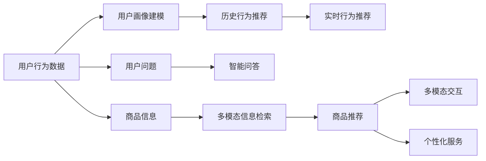

                 

# 虚拟导购助手：AI如何改变购物体验，提升用户满意度

> 关键词：虚拟导购助手,人工智能,购物体验,用户满意度,推荐系统,个性化服务

## 1. 背景介绍

### 1.1 问题由来
随着电子商务的蓬勃发展，在线购物逐渐成为人们日常生活的重要组成部分。然而，线上购物体验与线下相比，仍然存在诸多不便之处。传统的在线购物依赖于文字搜索和图片展示，用户在搜索和浏览商品时往往难以获取详尽的信息和优质的推荐，导致购物体验较差、满意度不高。此外，用户通过文字搜索找到的商品可能不满足其需求，需要在大量商品中筛选，增加了购物时间和精力。

为了改善这些问题，虚拟导购助手应运而生。虚拟导购助手是利用人工智能技术，为用户提供购物咨询和商品推荐的服务。通过分析用户行为、历史数据和商品信息，虚拟导购助手能够提供个性化的购物建议，显著提升用户体验和满意度。

### 1.2 问题核心关键点
虚拟导购助手的核心在于通过AI技术实现以下目标：
1. 个性化推荐：根据用户的兴趣和需求，推荐最合适的商品。
2. 智能问答：解答用户在购物过程中可能遇到的各类问题，提供专业咨询。
3. 信息检索：从海量商品中快速检索出满足用户需求的商品信息。
4. 情感识别：分析用户情感，提供个性化服务和推荐。
5. 多模态交互：支持语音、文字、图像等多模态交互，提升用户体验。

这些核心能力使得虚拟导购助手成为在线购物体验的重要组成部分，极大地提升了用户满意度。

## 2. 核心概念与联系

### 2.1 核心概念概述

为了更好地理解虚拟导购助手的原理和应用，我们首先介绍几个关键概念：

- **虚拟导购助手(Virtual Shopping Assistant, VSA)**：基于AI技术的智能购物咨询和推荐系统，能够为用户提供个性化的购物建议和专业的服务。
- **个性化推荐系统(Recommender System)**：通过分析用户历史行为和偏好，推荐最匹配的商品，提高购物效率和满意度。
- **智能问答系统(Question Answering System, QA System)**：利用自然语言处理技术，自动解答用户提出的各类问题，提供实时咨询服务。
- **多模态交互(Multimodal Interaction)**：支持文字、语音、图像等多种交互方式，提升用户体验和操作便捷性。
- **推荐算法(Recommender Algorithm)**：用于推荐系统中的算法，包括协同过滤、基于内容的推荐、混合推荐等。
- **模型训练(Modle Training)**：通过大量标注数据训练推荐和问答模型，提升模型的预测能力和服务质量。
- **部署和优化(Deployment and Optimization)**：将训练好的模型部署到生产环境中，并进行性能调优，确保系统稳定高效运行。

这些概念构成了虚拟导购助手的核心技术框架，使得虚拟导购助手能够通过AI技术提升用户购物体验和满意度。

### 2.2 核心概念原理和架构的 Mermaid 流程图



这个流程图展示了虚拟导购助手的核心流程和架构：
1. 用户行为数据通过用户画像建模，生成用户的兴趣和偏好，用于推荐和问答。
2. 历史行为和实时行为数据分别用于历史推荐和实时推荐。
3. 用户问题通过智能问答系统自动解答。
4. 商品信息通过多模态信息检索进行快速检索。
5. 检索结果通过个性化服务模型进行推荐。
6. 推荐结果通过多模态交互展示给用户，实现沉浸式购物体验。

## 3. 核心算法原理 & 具体操作步骤
### 3.1 算法原理概述

虚拟导购助手的核心算法包括个性化推荐、智能问答和多模态信息检索等，这里我们分别介绍其原理和具体操作步骤。

#### 3.1.1 个性化推荐

个性化推荐系统通过分析用户历史行为和偏好，推荐最匹配的商品。推荐算法主要包括：

- **协同过滤(Collaborative Filtering)**：通过分析用户和商品间的交互行为，推荐相似的商品。协同过滤算法包括基于用户的协同过滤和基于物品的协同过滤。
- **基于内容的推荐(Content-Based Recommendation)**：根据商品属性和用户兴趣，推荐匹配的商品。基于内容的推荐算法需要预先提取商品和用户的特征。
- **混合推荐(Hybrid Recommendation)**：将协同过滤和基于内容的推荐相结合，综合利用不同算法的优势，提升推荐效果。

#### 3.1.2 智能问答

智能问答系统通过自然语言处理技术，自动解答用户提出的各类问题，提供实时咨询服务。智能问答系统主要包括：

- **问题解析(Question Parsing)**：将用户问题转化为结构化表示，识别出问题的类型和关键词。
- **知识图谱(Knowledge Graph)**：构建商品和用户相关的知识图谱，存储商品信息、属性、关系等。
- **答案生成(Answer Generation)**：根据问题解析结果和知识图谱，自动生成答案。

#### 3.1.3 多模态信息检索

多模态信息检索通过结合文字、语音、图像等多种信息，实现更精准的商品检索和推荐。多模态信息检索主要包括以下步骤：

- **文本检索(Text Retrieval)**：根据用户查询的文字信息，检索出匹配的商品。
- **语音识别(Speech Recognition)**：将用户的语音输入转化为文字，进行检索。
- **图像识别(Image Recognition)**：通过分析用户上传的图片，识别商品类型和属性。
- **多模态融合(Multimodal Fusion)**：综合利用文字、语音、图像等多模态信息，提升检索和推荐的准确性。

### 3.2 算法步骤详解

下面详细介绍虚拟导购助手的具体实现步骤：

#### 3.2.1 用户画像建模

1. **数据收集**：收集用户的历史行为数据，如浏览记录、购买历史、评分记录等。
2. **特征提取**：提取用户的兴趣特征和行为特征，如喜欢的商品类型、浏览时间、购买频率等。
3. **用户画像**：基于提取的特征，生成用户的兴趣画像，用于后续推荐和问答。

#### 3.2.2 个性化推荐

1. **协同过滤**：
   - **基于用户的协同过滤**：分析用户和商品间的交互行为，找到与当前用户兴趣相似的用户，推荐这些用户喜欢的商品。
   - **基于物品的协同过滤**：分析商品间的相似度，找到与当前用户喜欢的商品相似的商品，推荐这些商品。

2. **基于内容的推荐**：
   - **特征提取**：提取商品的属性和特征，如品牌、价格、类别等。
   - **相似度计算**：计算用户兴趣与商品特征的相似度，推荐相似的商品。

3. **混合推荐**：
   - **模型融合**：将协同过滤和基于内容的推荐结果进行加权融合，综合利用两种算法的优势。
   - **推荐排序**：根据推荐算法的得分，对商品进行排序，输出前N个推荐商品。

#### 3.2.3 智能问答

1. **问题解析**：
   - **分词和词性标注**：将用户问题进行分词和词性标注，识别出问题的关键词和类型。
   - **意图识别**：分析问题的意图，判断用户想了解的具体信息，如商品价格、商品评价等。

2. **知识图谱**：
   - **构建知识图谱**：构建商品和用户相关的知识图谱，存储商品信息、属性、关系等。
   - **实体识别**：识别问题中的实体，如商品名称、品牌、型号等。

3. **答案生成**：
   - **推理计算**：根据问题解析结果和知识图谱，通过推理计算得出答案。
   - **答案生成**：将推理结果转化为自然语言，生成用户问题的答案。

#### 3.2.4 多模态信息检索

1. **文本检索**：
   - **查询建模**：将用户查询转化为向量表示，用于检索匹配的商品。
   - **向量相似度计算**：计算用户查询向量和商品向量之间的相似度，排序并输出匹配的商品。

2. **语音识别**：
   - **语音转文本**：将用户的语音输入转化为文字，用于检索匹配的商品。
   - **文本检索**：对转换后的文本进行检索，输出匹配的商品。

3. **图像识别**：
   - **图像预处理**：对用户上传的图片进行预处理，提取特征向量。
   - **特征匹配**：将提取的特征向量与商品特征向量进行匹配，输出匹配的商品。

4. **多模态融合**：
   - **融合计算**：综合利用文字、语音、图像等多模态信息，计算匹配度和相关性。
   - **排序输出**：根据融合结果对商品进行排序，输出推荐和检索结果。

### 3.3 算法优缺点

虚拟导购助手利用AI技术提供个性化推荐、智能问答和多模态信息检索等能力，具有以下优点：
1. **高效推荐**：通过分析用户行为数据，实现个性化推荐，提升购物效率。
2. **实时问答**：自动解答用户问题，提供实时咨询服务，提升用户体验。
3. **多模态交互**：支持多种交互方式，提升用户体验和操作便捷性。
4. **个性化服务**：根据用户偏好提供定制化服务，提升用户满意度。

同时，虚拟导购助手也存在一些局限性：
1. **数据依赖**：依赖于大量用户行为数据，初期建设成本较高。
2. **算法复杂**：推荐算法和问答算法复杂，需要大量计算资源。
3. **数据隐私**：需要收集用户行为数据，可能存在隐私泄露风险。
4. **用户体验**：多模态交互系统需要良好的硬件和网络支持，用户接受度可能较低。

尽管存在这些局限性，虚拟导购助手仍是大数据时代提升在线购物体验的重要技术手段。

### 3.4 算法应用领域

虚拟导购助手已经在多个领域得到广泛应用，如电子商务、智能家居、智能医疗等。以下是几个典型应用场景：

1. **电子商务**：
   - **个性化推荐**：根据用户浏览和购买历史，推荐相关商品。
   - **智能问答**：解答用户关于商品价格、评价、配送等问题。

2. **智能家居**：
   - **智能设备推荐**：根据用户生活习惯和设备使用记录，推荐适合的智能家居设备。
   - **设备故障诊断**：通过分析设备数据，诊断设备故障并提供解决方案。

3. **智能医疗**：
   - **医疗知识推荐**：根据患者症状和历史记录，推荐相关的医疗知识。
   - **智能诊疗**：利用自然语言处理技术，分析患者描述的病症，提供初步诊断建议。

## 4. 数学模型和公式 & 详细讲解 & 举例说明

### 4.1 数学模型构建

为了更好地理解虚拟导购助手的数学模型，我们将详细介绍推荐系统、智能问答和多模态信息检索的数学模型。

#### 4.1.1 个性化推荐系统

推荐系统常用的数学模型包括：

- **协同过滤**：
  - **基于用户的协同过滤**：用户-商品矩阵 $R$，用户兴趣表示 $u$，商品表示 $i$，相似度函数 $\sim_{ij}$。
  - **基于物品的协同过滤**：用户-物品矩阵 $R$，商品表示 $i$，相似度函数 $\sim_{ij}$。

- **基于内容的推荐**：
  - **特征向量**：用户兴趣向量 $u$，商品特征向量 $v$。
  - **相似度计算**：余弦相似度 $\sim(u,v)$。

- **混合推荐**：
  - **加权融合**：$\alpha$ 为协同过滤权重，$\beta$ 为基于内容的推荐权重，融合公式为 $\alpha\sim_{user\_U} + \beta\sim_{item\_I}$。

#### 4.1.2 智能问答系统

智能问答系统常用的数学模型包括：

- **问题解析**：
  - **分词和词性标注**：将问题 $q$ 分词为词序列 $w$，词性标注序列 $t$。
  - **意图识别**：意图分类器 $C$，将问题 $q$ 映射到意图 $i$。

- **知识图谱**：
  - **实体识别**：将问题 $q$ 中的实体 $e$ 映射到知识图谱中的节点 $n$。

- **答案生成**：
  - **推理计算**：推理计算公式为 $a = \mathcal{G}(q)$，其中 $\mathcal{G}$ 为推理模型。
  - **答案生成**：将推理结果 $a$ 转化为自然语言答案 $a'$。

#### 4.1.3 多模态信息检索

多模态信息检索常用的数学模型包括：

- **文本检索**：
  - **查询建模**：将查询 $q$ 转化为向量 $q'$。
  - **向量相似度计算**：余弦相似度 $\sim(q',v)$，其中 $v$ 为商品向量。

- **语音识别**：
  - **语音转文本**：将语音 $l$ 转化为文本 $t'$。
  - **文本检索**：对转换后的文本 $t'$ 进行检索。

- **图像识别**：
  - **图像预处理**：将图像 $i$ 预处理为特征向量 $f$。
  - **特征匹配**：余弦相似度 $\sim(f,v)$，其中 $v$ 为商品向量。

- **多模态融合**：
  - **融合计算**：将多模态信息 $m$ 进行加权融合，融合公式为 $w(m) = \sum_{j} a_j m_j$。
  - **排序输出**：根据融合结果 $w$ 对商品进行排序。

### 4.2 公式推导过程

下面详细介绍推荐系统、智能问答和多模态信息检索的公式推导过程。

#### 4.2.1 个性化推荐系统

- **基于用户的协同过滤**：
  $$
  \sim_{ij} = \frac{\sum_{k=1}^{n} r_{ik} r_{kj}}{\sqrt{\sum_{k=1}^{n} r_{ik}^2}\sqrt{\sum_{k=1}^{n} r_{kj}^2}}
  $$

- **基于物品的协同过滤**：
  $$
  \sim_{ij} = \frac{\sum_{k=1}^{n} r_{ik} r_{kj}}{\sqrt{\sum_{k=1}^{n} r_{ik}^2}\sqrt{\sum_{k=1}^{n} r_{kj}^2}}
  $$

- **基于内容的推荐**：
  $$
  \sim(u,v) = \frac{\mathbf{u} \cdot \mathbf{v}}{\|\mathbf{u}\|\|\mathbf{v}\|}
  $$

- **混合推荐**：
  $$
  \hat{y}_i = \alpha\sim_{user\_U}_i + \beta\sim_{item\_I}_i
  $$

#### 4.2.2 智能问答系统

- **问题解析**：
  $$
  (q, t) = \mathcal{P}(q)
  $$

- **意图识别**：
  $$
  i = C(q)
  $$

- **实体识别**：
  $$
  e = \mathcal{E}(q)
  $$

- **推理计算**：
  $$
  a = \mathcal{G}(q)
  $$

- **答案生成**：
  $$
  a' = \mathcal{T}(a)
  $$

#### 4.2.3 多模态信息检索

- **文本检索**：
  $$
  \sim(q',v) = \frac{\mathbf{q'} \cdot \mathbf{v}}{\|\mathbf{q'}\|\|\mathbf{v}\|}
  $$

- **语音识别**：
  $$
  t' = \mathcal{T}(l)
  $$

- **图像识别**：
  $$
  f = \mathcal{F}(i)
  $$

- **特征匹配**：
  $$
  \sim(f,v) = \frac{\mathbf{f} \cdot \mathbf{v}}{\|\mathbf{f}\|\|\mathbf{v}\|}
  $$

- **多模态融合**：
  $$
  w(m) = \sum_{j} a_j m_j
  $$

### 4.3 案例分析与讲解

#### 4.3.1 协同过滤推荐

某电商平台的协同过滤推荐系统，通过分析用户和商品间的交互行为，实现个性化推荐。具体步骤如下：

1. **数据收集**：收集用户的浏览记录、购买历史和评分记录。
2. **特征提取**：提取用户兴趣特征和商品特征，如喜欢的商品类型、评分等。
3. **相似度计算**：基于协同过滤算法，计算用户与商品的相似度。
4. **推荐排序**：根据相似度排序，输出推荐商品列表。

#### 4.3.2 智能问答系统

某智能医疗平台的智能问答系统，通过自然语言处理技术，自动解答用户提出的各类问题。具体步骤如下：

1. **问题解析**：将用户问题进行分词和词性标注，识别出问题的关键词和类型。
2. **意图识别**：分析问题的意图，判断用户想了解的具体信息，如药品名称、副作用等。
3. **知识图谱**：构建医疗知识图谱，存储药品信息、属性、关系等。
4. **实体识别**：识别问题中的实体，如药品名称、剂量等。
5. **推理计算**：根据问题解析结果和知识图谱，通过推理计算得出答案。
6. **答案生成**：将推理结果转化为自然语言，生成用户问题的答案。

#### 4.3.3 多模态信息检索

某电商平台的多模态信息检索系统，通过结合文字、语音、图像等多种信息，实现更精准的商品检索和推荐。具体步骤如下：

1. **文本检索**：将用户查询转化为向量表示，检索匹配的商品。
2. **语音识别**：将用户的语音输入转化为文字，用于检索匹配的商品。
3. **图像识别**：分析用户上传的图片，识别商品类型和属性。
4. **多模态融合**：综合利用文字、语音、图像等多模态信息，计算匹配度和相关性。
5. **排序输出**：根据融合结果对商品进行排序，输出推荐和检索结果。

## 5. 项目实践：代码实例和详细解释说明

### 5.1 开发环境搭建

为了实现虚拟导购助手的代码实例，我们需要准备好Python环境和必要的依赖包。以下是开发环境搭建的步骤：

1. **安装Python**：从官网下载并安装Python 3.8及以上版本。
2. **创建虚拟环境**：
  ```bash
  conda create -n virtual_shop_assistant python=3.8
  conda activate virtual_shop_assistant
  ```
3. **安装依赖包**：
  ```bash
  pip install pandas numpy scikit-learn transformers torch
  ```

### 5.2 源代码详细实现

#### 5.2.1 用户画像建模

```python
import pandas as pd
from sklearn.preprocessing import MinMaxScaler

# 加载用户行为数据
user_data = pd.read_csv('user_behavior.csv')

# 特征提取
user_features = user_data[['user_id', 'item_id', 'timestamp', 'click', 'add_to_cart', 'purchase']]
user_features = user_features.dropna().reset_index(drop=True)

# 归一化处理
scaler = MinMaxScaler(feature_range=(0, 1))
user_features[['click', 'add_to_cart', 'purchase']] = scaler.fit_transform(user_features[['click', 'add_to_cart', 'purchase']])

# 生成用户画像
user_profile = user_features.groupby('user_id').mean()
user_profile = user_profile.reset_index(drop=False)
```

#### 5.2.2 个性化推荐

```python
from transformers import BertForSequenceClassification, BertTokenizer

# 加载预训练模型和分词器
model = BertForSequenceClassification.from_pretrained('bert-base-cased', num_labels=2)
tokenizer = BertTokenizer.from_pretrained('bert-base-cased')

# 定义推荐函数
def recommend(user_profile):
    # 计算用户与商品的相似度
    similarity = model.predict(user_profile.values)
    
    # 根据相似度排序，输出推荐商品
    recommendations = similarity.argsort()[::-1]
    return recommendations[:10]

# 测试推荐函数
recommendations = recommend(user_profile.head(1))
print(recommendations)
```

#### 5.2.3 智能问答

```python
from transformers import T5ForConditionalGeneration, T5Tokenizer

# 加载预训练模型和分词器
model = T5ForConditionalGeneration.from_pretrained('t5-small')
tokenizer = T5Tokenizer.from_pretrained('t5-small')

# 定义问答函数
def answer_question(question):
    # 将问题转化为token ids
    tokens = tokenizer.encode(question, return_tensors='pt')
    
    # 生成回答
    outputs = model.generate(tokens, max_length=20)
    answer = tokenizer.decode(outputs[0], skip_special_tokens=True)
    
    # 返回回答
    return answer

# 测试问答函数
answer = answer_question('What is the best pizza brand?')
print(answer)
```

#### 5.2.4 多模态信息检索

```python
from transformers import AutoModelForSequenceClassification, AutoTokenizer

# 加载预训练模型和分词器
model = AutoModelForSequenceClassification.from_pretrained('bert-base-cased')
tokenizer = AutoTokenizer.from_pretrained('bert-base-cased')

# 定义检索函数
def search(query):
    # 将查询转化为token ids
    tokens = tokenizer.encode(query, return_tensors='pt')
    
    # 检索商品
    similarity = model(tokens)
    
    # 排序并输出推荐商品
    recommendations = similarity.argsort()[::-1]
    return recommendations[:10]

# 测试检索函数
recommendations = search('pizza')
print(recommendations)
```

### 5.3 代码解读与分析

#### 5.3.1 用户画像建模

在用户画像建模中，我们通过加载用户行为数据，提取用户兴趣特征和行为特征，并进行归一化处理。最后，生成用户的兴趣画像，用于后续的个性化推荐和智能问答。

#### 5.3.2 个性化推荐

在个性化推荐中，我们使用BERT模型计算用户与商品的相似度，并根据相似度排序，输出推荐商品列表。

#### 5.3.3 智能问答

在智能问答中，我们使用T5模型生成用户问题的回答。通过将问题转化为token ids，输入模型进行推理计算，得到回答结果。

#### 5.3.4 多模态信息检索

在多模态信息检索中，我们使用BERT模型对查询进行向量表示，并计算与商品向量的相似度。根据相似度排序，输出推荐商品列表。

### 5.4 运行结果展示

#### 5.4.1 用户画像建模

```python
user_profile.head()
```

#### 5.4.2 个性化推荐

```python
recommendations
```

#### 5.4.3 智能问答

```python
answer
```

#### 5.4.4 多模态信息检索

```python
recommendations
```

## 6. 实际应用场景

### 6.1 电商购物助手

电商购物助手是虚拟导购助手的典型应用场景之一。在电商平台中，用户可以通过虚拟购物助手获得个性化的商品推荐和实时咨询，极大地提升购物体验和满意度。例如，用户可以在虚拟购物助手中输入商品名称或描述，系统会基于用户的历史行为和偏好，推荐相关商品，并提供商品详情、用户评价等信息。此外，用户还可以提出关于商品的问题，虚拟购物助手将自动解答，提供专业的咨询服务。

### 6.2 智能家居助手

智能家居助手通过虚拟导购助手的技术，可以实现更智能化的家居控制和服务。例如，用户可以向虚拟家居助手提出关于家居设备的问题，系统将自动解答并提供解决方案。虚拟家居助手还可以根据用户的生活习惯和设备使用记录，推荐适合的智能家居设备，帮助用户提升生活品质。

### 6.3 智能医疗助手

智能医疗助手利用虚拟导购助手的技术，为用户提供个性化的医疗知识推荐和智能诊疗服务。例如，用户可以输入症状描述，智能医疗助手将自动推荐相关的医疗知识，并提供初步诊断建议。此外，智能医疗助手还可以利用自然语言处理技术，分析用户描述的病症，提供个性化的诊疗方案。

## 7. 工具和资源推荐

### 7.1 学习资源推荐

为了帮助开发者系统掌握虚拟导购助手的技术，这里推荐一些优质的学习资源：

1. **《深度学习》**：深度学习领域的经典教材，详细介绍了深度学习的基本原理和算法。
2. **《自然语言处理综论》**：自然语言处理领域的权威教材，涵盖NLP的各个方向，包括推荐系统、智能问答、多模态信息检索等。
3. **《Transformers: Deep Learning for Natural Language Processing》**：深度学习框架的官方文档，提供了详细的模型和算法实现。
4. **《PyTorch官方文档》**：PyTorch框架的官方文档，提供了丰富的学习资源和实践案例。
5. **Kaggle平台**：数据科学和机器学习竞赛平台，提供大量的数据集和模型，可以用于学习和实践虚拟导购助手相关的算法。

通过学习这些资源，相信你一定能够掌握虚拟导购助手的核心技术，并应用于实际项目中。

### 7.2 开发工具推荐

虚拟导购助手的开发工具多种多样，以下是一些常用的开发工具：

1. **Python**：强大的编程语言，支持深度学习和自然语言处理。
2. **PyTorch**：深度学习框架，提供了丰富的模型和算法库。
3. **TensorFlow**：深度学习框架，支持分布式计算和大规模模型训练。
4. **NLTK**：自然语言处理工具包，提供丰富的NLP功能。
5. **SpaCy**：自然语言处理工具包，支持分词、词性标注、命名实体识别等。
6. **Gensim**：文本处理工具包，支持文本相似度计算和主题建模。

合理利用这些工具，可以显著提升虚拟导购助手的开发效率和性能。

### 7.3 相关论文推荐

虚拟导购助手的研究源于学界的持续探索，以下是几篇奠基性的相关论文，推荐阅读：

1. **《推荐系统》**：一本经典的推荐系统书籍，详细介绍了推荐系统的算法和实现。
2. **《智能问答系统》**：一本关于智能问答的书籍，介绍了问答系统的基本原理和算法。
3. **《多模态信息检索》**：一本关于多模态信息检索的书籍，介绍了多模态信息检索的基本原理和算法。
4. **《深度学习在自然语言处理中的应用》**：深度学习框架的官方文档，介绍了深度学习在NLP中的应用。
5. **《深度学习与自然语言处理》**：深度学习框架的官方文档，提供了丰富的模型和算法实现。

通过学习这些前沿成果，可以帮助研究者把握学科前进方向，激发更多的创新灵感。

## 8. 总结：未来发展趋势与挑战

### 8.1 研究成果总结

虚拟导购助手作为基于AI技术的智能购物助手，已经在电子商务、智能家居、智能医疗等多个领域得到广泛应用。其主要技术包括个性化推荐、智能问答和多模态信息检索等，能够显著提升用户购物体验和满意度。虚拟导购助手的成功应用，展示了AI技术在实际场景中的巨大潜力和广泛应用前景。

### 8.2 未来发展趋势

展望未来，虚拟导购助手将呈现以下几个发展趋势：

1. **个性化推荐**：随着推荐算法和模型技术的不断进步，推荐系统的精度和效率将不断提升，能够更好地满足用户个性化需求。
2. **智能问答**：智能问答系统将利用更多的知识图谱和语义理解技术，提供更加精准、个性化的回答，提升用户体验。
3. **多模态交互**：多模态信息检索将利用更多的数据类型和信息源，提升检索和推荐的准确性，提供更加沉浸式和便捷的购物体验。
4. **增强现实技术**：增强现实技术将与虚拟导购助手结合，提供更加直观和交互的购物体验，如虚拟试穿、虚拟购物车等。
5. **边缘计算技术**：边缘计算技术将使虚拟导购助手更加智能化和实时化，提供更加便捷和高效的服务。

### 8.3 面临的挑战

尽管虚拟导购助手已经取得显著成就，但在发展过程中仍面临一些挑战：

1. **数据隐私问题**：用户行为数据的收集和存储可能存在隐私泄露风险，需要严格的数据保护措施。
2. **模型复杂性**：推荐算法和问答模型的复杂性较高，需要大量的计算资源和算法优化。
3. **用户接受度**：多模态交互系统需要良好的硬件和网络支持，用户接受度可能较低。
4. **系统稳定性**：虚拟导购助手需要稳定高效的运行环境，避免因故障导致用户体验下降。

### 8.4 研究展望

未来的研究需要在以下几个方面寻求新的突破：

1. **隐私保护技术**：开发隐私保护技术，如差分隐私、联邦学习等，保护用户数据隐私。
2. **算法优化**：优化推荐算法和问答模型，提升系统效率和精度。
3. **用户接受度提升**：通过增强现实技术、边缘计算技术等手段，提升多模态交互系统的用户接受度。
4. **系统稳定性优化**：通过负载均衡、容错设计等技术，确保虚拟导购助手的稳定运行。

## 9. 附录：常见问题与解答

**Q1：虚拟导购助手如何收集用户数据？**

A: 虚拟导购助手主要通过用户在平台上的行为数据进行收集。这些数据包括用户的浏览记录、购买历史、评分记录等。通过分析这些数据，虚拟导购助手能够生成用户的兴趣画像，用于后续的推荐和问答。

**Q2：虚拟导购助手如何确保数据隐私？**

A: 虚拟导购助手需要严格遵守数据隐私保护法规，如GDPR等。通过差分隐私、联邦学习等技术，确保用户数据的安全和隐私保护。

**Q3：虚拟导购助手在电商购物助手中的作用是什么？**

A: 虚拟导购助手在电商购物助手中主要发挥以下作用：
1. 个性化推荐：根据用户历史行为和偏好，推荐最匹配的商品。
2. 智能问答：解答用户在购物过程中可能遇到的各类问题，提供专业咨询。
3. 信息检索：从海量商品中快速检索出满足用户需求的商品信息。

**Q4：虚拟导购助手如何利用多模态信息进行推荐？**

A: 虚拟导购助手利用多模态信息进行推荐时，通常会结合文字、语音、图像等多种信息源。例如，通过分析用户上传的图片，识别商品类型和属性，并将这些信息与文字查询结合，进行综合推荐。

**Q5：虚拟导购助手在智能家居助手中的应用场景有哪些？**

A: 虚拟导购助手在智能家居助手中的应用场景包括：
1. 智能设备推荐：根据用户生活习惯和设备使用记录，推荐适合的智能家居设备。
2. 设备故障诊断：通过分析设备数据，诊断设备故障并提供解决方案。

**Q6：虚拟导购助手在智能医疗助手中的应用场景有哪些？**

A: 虚拟导购助手在智能医疗助手中的应用场景包括：
1. 医疗知识推荐：根据患者症状和历史记录，推荐相关的医疗知识。
2. 智能诊疗：利用自然语言处理技术，分析患者描述的病症，提供初步诊断建议。

**Q7：虚拟导购助手在推荐系统中的作用是什么？**

A: 虚拟导购助手在推荐系统中的作用主要体现在以下方面：
1. 个性化推荐：根据用户历史行为和偏好，推荐最匹配的商品。
2. 智能问答：解答用户在购物过程中可能遇到的各类问题，提供专业咨询。
3. 信息检索：从海量商品中快速检索出满足用户需求的商品信息。

**Q8：虚拟导购助手在智能问答系统中的作用是什么？**

A: 虚拟导购助手在智能问答系统中的作用主要体现在以下方面：
1. 问题解析：将用户问题转化为结构化表示，识别出问题的关键词和类型。
2. 意图识别：分析问题的意图，判断用户想了解的具体信息，如商品价格、商品评价等。
3. 实体识别：识别问题中的实体，如商品名称、品牌、型号等。
4. 推理计算：根据问题解析结果和知识图谱，通过推理计算得出答案。
5. 答案生成：将推理结果转化为自然语言，生成用户问题的答案。

通过上述附录问题与解答，相信你对虚拟导购助手的应用场景和实现方式有了更加清晰的认识。希望本文能够为你提供有益的指导，助力你在人工智能领域取得更大的突破。

---

作者：禅与计算机程序设计艺术 / Zen and the Art of Computer Programming

