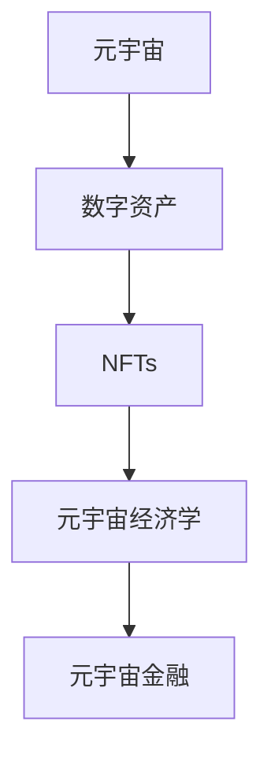

                 

# 虚拟房地产:元宇宙中的资产新概念

> 关键词：虚拟房地产, 元宇宙, 资产新概念, 元宇宙经济学, 区块链, 数字资产, 非同质化代币(NFTs)

## 1. 背景介绍

### 1.1 问题由来

随着虚拟现实(VR)、增强现实(AR)、混合现实(MR)等技术的迅速发展，元宇宙(Metaverse)这一概念逐渐走进公众视野。元宇宙不仅是一个虚拟世界，更是具有经济体系和生态系统的数字化空间。在元宇宙中，数字资产扮演着不可或缺的角色，包括虚拟土地、虚拟房产、数字艺术品等。其中，虚拟房地产作为元宇宙中极具潜力的资产形式，吸引了大量投资者和开发者的关注。

### 1.2 问题核心关键点

虚拟房地产在元宇宙中具有特殊意义，它不仅代表了数字土地的所有权，也承载着元宇宙经济活动的核心价值。虚拟房地产的构建和管理，涉及到虚拟土地资源的分配、开发、交易等复杂过程，需要综合运用虚拟地理信息系统、3D建模、区块链技术等手段。

核心问题包括：

- 如何定义虚拟土地的所有权和权益？
- 如何构建高效、公平的虚拟土地交易市场？
- 如何确保虚拟房地产的保值增值？
- 如何评估虚拟房地产的价值和市场潜力？

这些问题不仅是技术问题，也涉及到元宇宙经济学的核心内容，需要从多个维度进行综合分析。

### 1.3 问题研究意义

研究元宇宙中的虚拟房地产，对于构建更加健壮、安全的元宇宙经济体系，推动数字资产的发展具有重要意义。

1. **经济价值实现**：虚拟房地产作为元宇宙中的重要资产，可以吸引更多用户参与，促进元宇宙经济的繁荣。
2. **技术创新**：虚拟房地产的构建和交易需要先进的3D建模和区块链技术，这些技术的突破将进一步推动相关领域的发展。
3. **生态系统构建**：通过虚拟房地产的开发和交易，可以构建更加完善、多样化的元宇宙生态系统。
4. **社会影响**：虚拟房地产的广泛应用，将带来新的商业模式、就业机会和用户体验，对社会产生深远影响。

## 2. 核心概念与联系

### 2.1 核心概念概述

为更好地理解元宇宙中虚拟房地产的构建和管理，本节将介绍几个密切相关的核心概念：

- 元宇宙：通过VR、AR、MR等技术构建的虚拟空间，具备经济、社交、文化等多重属性。
- 数字资产：包括虚拟土地、数字艺术品、虚拟房产等，具备价值和使用价值。
- 非同质化代币(NFTs)：基于区块链技术，确保数字资产的唯一性和所有权证明。
- 元宇宙经济学：研究元宇宙中的经济活动，包括数字资产的创建、交易、分配等。
- 元宇宙金融：利用区块链、NFTs等技术，提供安全的金融服务和交易平台。

这些核心概念之间的逻辑关系可以通过以下Mermaid流程图来展示：



这个流程图展示了几者之间的联系：

1. 元宇宙是虚拟资产和金融活动的基础平台。
2. NFTs作为数字资产的底层技术，确保了其唯一性和所有权。
3. 元宇宙经济学研究虚拟资产的交易和分配，奠定了元宇宙金融的基础。
4. 元宇宙金融利用区块链和NFTs技术，为数字资产提供安全的交易和保值增值服务。

## 3. 核心算法原理 & 具体操作步骤

### 3.1 算法原理概述

虚拟房地产的构建和管理，涉及到3D建模、区块链、虚拟地理信息系统等多个领域的交叉技术。其核心算法原理如下：

1. **3D建模与渲染**：通过3D建模技术，创建虚拟土地的地形、建筑、景观等，并进行实时渲染，构建虚拟空间。
2. **区块链技术**：利用区块链的分布式账本和智能合约特性，确保虚拟土地的所有权和交易透明性。
3. **虚拟地理信息系统(VGIS)**：结合VR、AR技术，实现虚拟土地的空间分析和导航功能。

这些技术共同构建了虚拟房地产的完整生态，使其具备了产权保护、价值评估、交易流通等多重功能。

### 3.2 算法步骤详解

以下详细阐述虚拟房地产构建和管理的主要步骤：

1. **3D建模与渲染**：
    - 收集地形、建筑、景观等数据，进行3D建模。
    - 使用渲染引擎进行实时渲染，创建虚拟空间。
    - 设计虚拟建筑和景观，确保美学和功能性结合。

2. **区块链技术应用**：
    - 使用智能合约定义虚拟土地的所有权和使用权。
    - 使用NFTs技术进行虚拟土地的数字化所有权证明。
    - 设计交易机制，确保交易的透明和公平。

3. **虚拟地理信息系统(VGIS)**：
    - 结合VR、AR技术，实现虚拟空间的导航和查询。
    - 进行空间分析和统计，评估虚拟土地的价值。
    - 设计虚拟土地的交通和基础设施，提升用户体验。

4. **市场构建与管理**：
    - 构建虚拟土地交易平台，提供买卖、租赁、拍卖等多种交易方式。
    - 设计虚拟土地的评价体系，评估其市场价值和潜力。
    - 进行市场监管，确保市场的公平和透明。

### 3.3 算法优缺点

虚拟房地产构建和管理算法的主要优点包括：

- 利用3D建模和渲染技术，可以构建高度逼真的虚拟空间，提升用户体验。
- 结合区块链技术，确保虚拟土地的所有权和使用权的透明和可信。
- 通过虚拟地理信息系统，实现虚拟土地的空间分析和导航功能。

缺点包括：

- 3D建模和渲染需要较高的计算资源和技术门槛。
- 区块链技术的性能瓶颈和扩展性问题需进一步解决。
- 虚拟地理信息系统的复杂性较高，开发和维护成本较高。

### 3.4 算法应用领域

虚拟房地产构建和管理算法在多个领域都有广泛应用，例如：

- 元宇宙开发：构建元宇宙中的虚拟土地和房产，提供沉浸式体验。
- 游戏开发：在虚拟游戏中设计虚拟世界和景观，提升游戏质量。
- 城市规划：进行城市虚拟仿真和规划，提高城市管理效率。
- 房地产评估：利用虚拟地理信息系统进行房地产价值的评估和分析。

## 4. 数学模型和公式 & 详细讲解 & 举例说明

### 4.1 数学模型构建

在虚拟房地产构建和管理中，涉及多个数学模型，包括空间坐标系、3D建模、价值评估等。

- **空间坐标系**：用于描述虚拟土地的位置和形状，通常采用3D直角坐标系。
- **3D建模**：涉及点、线、面、体等基本几何元素的组合和计算，常用的数学模型包括三角剖分、法向量计算等。
- **价值评估**：通过多种指标，如位置、面积、开发潜力等，进行虚拟土地的价值评估，常用的数学模型包括加权评分法、市场比较法等。

### 4.2 公式推导过程

以下推导两个关键数学模型：

1. **空间坐标系转换**：
    - 假设虚拟土地的位置为 $(x, y, z)$，世界坐标系为 $(x_w, y_w, z_w)$，投影到平面上的位置为 $(x_p, y_p)$，则转换公式为：
    $$
    \begin{aligned}
    x_p &= x_w \\
    y_p &= y_w \\
    z_p &= z_w
    \end{aligned}
    $$

2. **虚拟土地价值评估**：
    - 假设虚拟土地价值为 $V$，位置因素权重为 $w_1$，面积因素权重为 $w_2$，开发潜力权重为 $w_3$，则价值评估公式为：
    $$
    V = w_1 \times \text{Location Score} + w_2 \times \text{Area Score} + w_3 \times \text{Development Potential Score}
    $$
    - 其中，Location Score、Area Score、Development Potential Score分别为位置、面积、开发潜力的评分，通常通过专家评分或数据分析获得。

### 4.3 案例分析与讲解

假设某元宇宙开发公司希望在元宇宙中构建一个虚拟庄园，并进行虚拟土地价值评估。该公司首先使用3D建模技术，设计虚拟庄园的地形、建筑、景观等，然后利用虚拟地理信息系统进行空间分析和导航设计，最后通过区块链技术确保虚拟土地的所有权和使用权。

在虚拟土地价值评估中，该公司选取了三个关键因素：位置、面积和开发潜力。通过专家评分和数据分析，计算出每个因素的评分值，并根据权重进行加权计算，得出虚拟庄园的整体价值。

## 5. 项目实践：代码实例和详细解释说明

### 5.1 开发环境搭建

为了实现虚拟房地产的构建和管理，需要搭建一个综合开发环境，包括以下步骤：

1. **安装3D建模软件**：如Blender、Autodesk Maya等，用于创建虚拟土地和建筑。
2. **安装渲染引擎**：如Unity、Unreal Engine等，用于实时渲染虚拟空间。
3. **安装区块链开发工具**：如Truffle、Web3.js等，用于开发智能合约和NFTs。
4. **安装虚拟地理信息系统(VGIS)软件**：如ESRI ArcGIS等，用于空间分析和导航设计。

### 5.2 源代码详细实现

以下是一个简单的虚拟土地交易平台的示例代码，使用Python和Flask框架开发：

```python
from flask import Flask, request, jsonify

app = Flask(__name__)

# 虚拟土地数据
lands = [
    {'id': 1, 'name': 'Village A', 'location': 'East', 'size': 100, 'price': 500},
    {'id': 2, 'name': 'Village B', 'location': 'West', 'size': 150, 'price': 700}
]

@app.route('/lands', methods=['GET'])
def get_lands():
    return jsonify(lands)

@app.route('/lands/<int:id>', methods=['GET'])
def get_land(id):
    for land in lands:
        if land['id'] == id:
            return jsonify(land)
    return jsonify({'error': 'Land not found'}), 404

@app.route('/lands', methods=['POST'])
def create_land():
    new_land = request.json
    lands.append(new_land)
    return jsonify(new_land), 201

if __name__ == '__main__':
    app.run(debug=True)
```

### 5.3 代码解读与分析

该示例代码使用了Python的Flask框架，通过RESTful API接口，实现了虚拟土地数据的增删改查功能。其中，GET方法用于查询虚拟土地数据，POST方法用于创建新的虚拟土地数据。

具体实现步骤如下：

1. **虚拟土地数据的存储**：使用Python的列表数据结构，存储虚拟土地数据。
2. **GET请求处理**：使用Flask的request对象解析请求参数，并返回相应的数据。
3. **POST请求处理**：接收请求数据，将其添加到虚拟土地数据列表中，并返回新数据。

### 5.4 运行结果展示

启动该示例代码，访问`http://localhost:5000/lands`，即可查询虚拟土地数据列表。例如，访问`http://localhost:5000/lands/1`，即可获取ID为1的虚拟土地的详细信息。

## 6. 实际应用场景

### 6.1 虚拟庄园开发

虚拟庄园是元宇宙中常见的虚拟房地产形式，用于展示和体验虚拟土地的美学和功能。虚拟庄园的开发需要综合运用3D建模、渲染、虚拟地理信息系统等技术，构建高度逼真的虚拟空间。

开发流程如下：

1. **规划设计**：定义虚拟庄园的规模、位置、主题等要素，并进行初步设计。
2. **3D建模**：使用3D建模软件创建虚拟土地和建筑，并进行详细设计。
3. **渲染测试**：使用渲染引擎进行实时渲染，测试虚拟土地的视觉效果。
4. **虚拟地理信息系统**：结合VR、AR技术，实现虚拟庄园的空间分析和导航功能。
5. **发布上线**：将虚拟庄园部署到元宇宙平台上，进行用户测试和优化。

### 6.2 虚拟地产交易平台

虚拟地产交易平台用于虚拟土地的买卖、租赁、拍卖等交易活动，通常基于区块链技术实现。

平台开发流程如下：

1. **智能合约开发**：使用Solidity等语言，开发虚拟土地的智能合约，定义所有权和使用权。
2. **NFTs设计**：设计虚拟土地的NFTs，确保其唯一性和所有权证明。
3. **交易机制设计**：设计虚拟土地的交易机制，确保交易的透明和公平。
4. **平台搭建**：使用区块链开发工具搭建虚拟地产交易平台，并集成智能合约和NFTs。
5. **市场监管**：进行市场监管，确保交易的合法性和安全性。

### 6.3 元宇宙地产投资

元宇宙地产投资是虚拟房地产的重要应用场景，通过虚拟土地的买卖和租赁，获取虚拟资产的增值收益。

投资流程如下：

1. **市场分析**：分析虚拟地产市场的供需情况和价格走势。
2. **虚拟土地评估**：评估虚拟土地的价值和潜力，选择合适的投资标的。
3. **交易操作**：通过虚拟地产交易平台进行虚拟土地的买卖和租赁操作。
4. **资产管理**：管理虚拟资产，监控其价值和市场变化。
5. **退出操作**：在合适时机退出投资，获取收益。

## 7. 工具和资源推荐

### 7.1 学习资源推荐

为了掌握虚拟房地产的构建和管理技术，推荐以下学习资源：

1. **《3D建模与渲染》**：介绍3D建模和渲染技术的基本原理和实践方法，适用于虚拟庄园的开发。
2. **《区块链技术与应用》**：介绍区块链技术的原理、开发工具和应用场景，适用于虚拟土地交易平台的设计。
3. **《虚拟地理信息系统》**：介绍虚拟地理信息系统的基本概念和应用，适用于虚拟土地的空间分析和导航设计。

### 7.2 开发工具推荐

为了高效开发虚拟房地产项目，推荐以下开发工具：

1. **Blender**：适用于3D建模和渲染，支持多种文件格式和插件。
2. **Unity**：适用于实时渲染和游戏开发，具备强大的引擎功能和社区支持。
3. **Solidity**：适用于智能合约开发，支持以太坊等区块链平台。

### 7.3 相关论文推荐

虚拟房地产的研究涉及多个领域，以下是几篇重要的相关论文，推荐阅读：

1. **《元宇宙：概念、技术与应用》**：介绍元宇宙的基本概念和技术，分析其应用场景和潜在影响。
2. **《区块链在虚拟土地交易中的应用》**：介绍区块链技术在虚拟土地交易中的应用，分析其优势和挑战。
3. **《虚拟庄园的3D建模与渲染技术》**：介绍虚拟庄园的3D建模和渲染技术，分析其优化方法。

## 8. 总结：未来发展趋势与挑战

### 8.1 研究成果总结

本文对虚拟房地产在元宇宙中的构建和管理进行了系统介绍，包括3D建模、区块链、虚拟地理信息系统等核心技术，分析了虚拟房地产的多种应用场景和实现流程。

### 8.2 未来发展趋势

虚拟房地产作为元宇宙中的重要资产形式，其未来发展趋势如下：

1. **技术进步**：3D建模、渲染、虚拟地理信息系统等技术将不断进步，提升虚拟土地的真实感和互动性。
2. **市场拓展**：虚拟地产交易平台和市场将不断扩展，吸引更多用户和投资者。
3. **应用多样化**：虚拟房地产将广泛应用于虚拟庄园、游戏、地产投资等多个领域，带来新的商业模式和用户体验。
4. **法规完善**：虚拟土地所有权和使用权等法律问题将逐步明晰，推动虚拟房地产的健康发展。

### 8.3 面临的挑战

虚拟房地产在元宇宙中的构建和管理，面临以下挑战：

1. **技术门槛**：3D建模和渲染等技术需要较高的专业知识和技能，开发和维护成本较高。
2. **市场不规范**：虚拟土地交易市场尚处于初期阶段，缺乏完善的法规和监管机制。
3. **价值评估**：虚拟土地的价值评估存在一定的不确定性，需要更多的数据和分析方法。
4. **用户体验**：虚拟土地的用户体验和互动性需要不断优化，提升用户黏性和满意度。

### 8.4 研究展望

未来，虚拟房地产的研究需要在以下几个方面进行突破：

1. **技术融合**：探索3D建模、渲染、虚拟地理信息系统等技术的融合应用，提升虚拟土地的真实感和互动性。
2. **市场机制**：设计更加公平、透明的虚拟土地交易机制，确保市场的健康发展。
3. **价值评估**：探索更加科学的虚拟土地价值评估方法，提升价值评估的准确性和可靠性。
4. **用户体验**：提升虚拟土地的用户体验和互动性，增强用户黏性和满意度。

## 9. 附录：常见问题与解答

### Q1: 虚拟房地产在元宇宙中的地位如何？

A: 虚拟房地产是元宇宙中的重要资产形式，代表了虚拟土地的所有权和价值。其地位类似于现实世界中的地产，具有经济、社会和文化多重属性，是元宇宙经济体系的核心组成部分。

### Q2: 如何确保虚拟土地的所有权和使用权的透明性和可信性？

A: 通过区块链技术的智能合约，可以确保虚拟土地的所有权和使用权的透明性和可信性。智能合约自动执行虚拟土地的买卖和租赁操作，避免人为干预，确保交易的公平和透明。

### Q3: 虚拟土地的价值如何评估？

A: 虚拟土地的价值评估涉及多个因素，如位置、面积、开发潜力等。通过专家评分和数据分析，得出每个因素的评分值，并根据权重进行加权计算，得到虚拟土地的整体价值。

### Q4: 虚拟土地交易平台如何设计？

A: 虚拟土地交易平台的设计需要考虑智能合约、NFTs、交易机制等多个方面。通过区块链技术，实现虚拟土地的智能合约和NFTs设计，确保虚拟土地的所有权和使用权的透明性和可信性。通过交易机制设计，确保交易的公平和透明。

### Q5: 虚拟庄园的开发流程是什么？

A: 虚拟庄园的开发流程包括规划设计、3D建模、渲染测试、虚拟地理信息系统、发布上线等多个步骤。通过综合运用3D建模、渲染、虚拟地理信息系统等技术，构建高度逼真的虚拟空间，提供沉浸式体验。

---

作者：禅与计算机程序设计艺术 / Zen and the Art of Computer Programming

