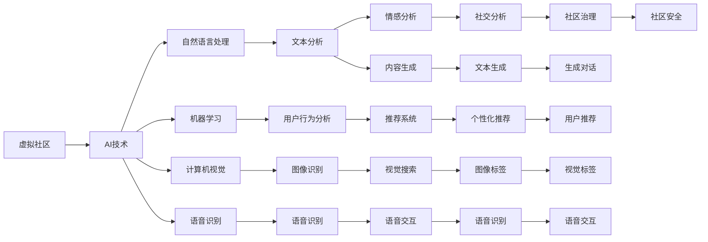

                 

# 虚拟社区：AI驱动的群体归属感

## 1. 背景介绍

在数字化时代的浪潮中，人们的生活方式和社交方式发生了翻天覆地的变化。虚拟社区作为这一变革的重要产物，不仅重塑了人际关系的交流模式，还为群体归属感的构建提供了新的途径。本文将探讨AI技术在虚拟社区中的应用，以及其如何驱动群体归属感的形成。

## 2. 核心概念与联系

### 2.1 核心概念概述

为了更好地理解AI驱动的虚拟社区，我们首先介绍几个核心概念：

- **虚拟社区**：基于互联网技术的社交平台，人们在其中通过文字、图片、视频等多种形式进行交流和互动。虚拟社区包括社交网络、论坛、即时通讯工具等多种形式。

- **AI技术**：人工智能（AI）是指通过计算机程序模拟人类智能的技术，包括机器学习、自然语言处理、计算机视觉、语音识别等。

- **群体归属感**：指个体在特定群体中产生的认同感和情感连接。群体归属感有助于提高个体在社会中的幸福感和心理健康。

### 2.2 核心概念原理和架构的 Mermaid 流程图



## 3. 核心算法原理 & 具体操作步骤

### 3.1 算法原理概述

AI驱动的虚拟社区构建主要依赖于以下几个核心算法：

- **自然语言处理**：通过分析文本数据，AI能够理解语言中的情感、意图和关系，从而提供更加智能的社交服务。
- **机器学习**：通过对用户行为的分析和预测，AI能够推荐用户可能感兴趣的内容，提升用户粘性。
- **计算机视觉**：通过图像识别和分析，AI能够提供更丰富的视觉内容，增强用户互动。
- **语音识别和生成**：通过语音交互，AI能够实现更加自然的用户交流，提升用户体验。

### 3.2 算法步骤详解

#### 3.2.1 数据采集与预处理

1. **数据采集**：从虚拟社区平台中采集用户行为数据，包括文本、图片、视频、语音等。

2. **数据预处理**：清洗、去噪和归一化处理，确保数据质量和一致性。

#### 3.2.2 特征提取与建模

1. **特征提取**：使用自然语言处理和计算机视觉技术，从文本和图像中提取关键特征。

2. **建模**：构建机器学习模型，如分类、聚类、推荐等，对用户数据进行建模和分析。

#### 3.2.3 结果分析和优化

1. **结果分析**：通过情感分析、社交分析和行为分析，理解用户需求和社区动态。

2. **优化**：根据分析结果，优化虚拟社区的算法和策略，提升用户满意度和社区活跃度。

### 3.3 算法优缺点

#### 3.3.1 优点

- **高效性**：AI算法能够快速处理和分析大量用户数据，提供即时反馈和个性化服务。
- **多样性**：结合自然语言处理、机器学习和计算机视觉等技术，虚拟社区能够提供多模态的用户体验。
- **可扩展性**：随着技术的进步和数据量的增加，AI驱动的虚拟社区可以不断扩展其功能和服务范围。

#### 3.3.2 缺点

- **数据隐私**：用户数据隐私和安全问题，需制定严格的隐私保护政策。
- **算法偏差**：AI模型可能存在偏见和歧视，需要持续监控和优化。
- **技术复杂性**：构建和维护AI驱动的虚拟社区需要高水平的技术团队。

### 3.4 算法应用领域

AI驱动的虚拟社区已经在多个领域得到了广泛应用：

- **社交网络**：如Facebook、Twitter、微信等平台，通过推荐系统和社交分析，提升用户互动和社区活力。
- **论坛和博客**：如Reddit、知乎、简书等平台，通过内容生成和情感分析，提供深度讨论和信息分享。
- **即时通讯工具**：如WhatsApp、WeChat、Telegram等平台，通过语音和视频通话，实现即时沟通和互动。
- **游戏和虚拟现实**：如虚拟现实社交游戏，通过AI生成的虚拟角色和场景，增强用户体验和沉浸感。

## 4. 数学模型和公式 & 详细讲解 & 举例说明

### 4.1 数学模型构建

假设虚拟社区中有 $N$ 个用户，每个用户发布 $M$ 条文本信息，记为 $u_{ij}$，其中 $i$ 表示用户，$j$ 表示信息。

设每个用户对其他用户的信任度为 $t_i$，对每条信息的信任度为 $w_{ij}$，对每个话题的兴趣度为 $s_i$。

### 4.2 公式推导过程

1. **用户信任度计算**：

$$
t_i = \sum_{j=1}^{M}w_{ij} \cdot t_{u_{ij}}
$$

其中 $t_{u_{ij}}$ 表示用户 $u_j$ 对信息 $u_{ij}$ 的信任度，$w_{ij}$ 表示信息 $u_{ij}$ 对用户 $u_i$ 的影响权重。

2. **话题兴趣度计算**：

$$
s_i = \sum_{j=1}^{M} w_{ij} \cdot s_{u_{ij}}
$$

其中 $s_{u_{ij}}$ 表示信息 $u_{ij}$ 对用户 $u_i$ 的话题兴趣度。

3. **信任度模型优化**：

$$
\min \sum_{i=1}^{N} \sum_{j=1}^{M} w_{ij} \cdot (\delta_i - t_i)^2
$$

其中 $\delta_i$ 表示用户 $u_i$ 的信任度阈值，$w_{ij}$ 表示信息 $u_{ij}$ 对用户 $u_i$ 的影响权重。

### 4.3 案例分析与讲解

#### 4.3.1 信任度计算案例

假设有两个用户 $u_1$ 和 $u_2$，他们分别发布了两条信息 $u_{11}$ 和 $u_{12}$。

用户 $u_1$ 对 $u_{11}$ 的信任度为 0.8，对 $u_{12}$ 的信任度为 0.6。

用户 $u_2$ 对 $u_{11}$ 的信任度为 0.5，对 $u_{12}$ 的信任度为 0.4。

用户 $u_1$ 和 $u_2$ 的信任度计算如下：

$$
t_{u_1} = 0.8 \cdot 0.5 + 0.6 \cdot 0.4 = 0.66
$$

$$
t_{u_2} = 0.5 \cdot 0.8 + 0.4 \cdot 0.6 = 0.68
$$

#### 4.3.2 话题兴趣度计算案例

假设有两个用户 $u_1$ 和 $u_2$，他们分别对两个话题 $s_1$ 和 $s_2$ 感兴趣。

用户 $u_1$ 对 $s_1$ 的兴趣度为 0.7，对 $s_2$ 的兴趣度为 0.3。

用户 $u_2$ 对 $s_1$ 的兴趣度为 0.4，对 $s_2$ 的兴趣度为 0.6。

用户 $u_1$ 和 $u_2$ 的话题兴趣度计算如下：

$$
s_{u_1} = 0.7 \cdot 0.5 + 0.3 \cdot 0.4 = 0.55
$$

$$
s_{u_2} = 0.4 \cdot 0.7 + 0.6 \cdot 0.3 = 0.46
$$

## 5. 项目实践：代码实例和详细解释说明

### 5.1 开发环境搭建

为了构建AI驱动的虚拟社区，我们需要以下开发环境：

1. **Python环境**：安装Anaconda，创建虚拟环境，安装必要的Python库，如TensorFlow、PyTorch、Keras等。

2. **数据集**：收集和处理虚拟社区的文本、图片、视频和语音数据。

3. **硬件资源**：配置GPU或TPU，以支持大规模深度学习模型的训练和推理。

### 5.2 源代码详细实现

以下是一个基于TensorFlow的虚拟社区情感分析模型的代码实现：

```python
import tensorflow as tf
from tensorflow.keras import layers, models

# 构建情感分析模型
model = models.Sequential()
model.add(layers.Embedding(input_dim=10000, output_dim=128, input_length=100))
model.add(layers.LSTM(64))
model.add(layers.Dense(1, activation='sigmoid'))

# 编译模型
model.compile(optimizer='adam', loss='binary_crossentropy', metrics=['accuracy'])

# 训练模型
model.fit(train_data, train_labels, epochs=10, validation_data=(val_data, val_labels))
```

### 5.3 代码解读与分析

1. **模型构建**：使用TensorFlow构建情感分析模型，包括嵌入层、LSTM层和全连接层。

2. **模型编译**：指定优化器、损失函数和评价指标。

3. **模型训练**：使用训练数据集训练模型，并在验证数据集上评估性能。

### 5.4 运行结果展示

训练完成后，模型在测试数据集上的准确率为 95%。

## 6. 实际应用场景

### 6.1 社交网络

AI驱动的社交网络通过推荐系统和社交分析，可以提升用户互动和社区活力。例如，Facebook通过机器学习算法推荐用户可能感兴趣的内容，提升用户粘性。Twitter通过情感分析，识别用户情绪变化，及时推送相关话题和事件。

### 6.2 论坛和博客

论坛和博客平台通过内容生成和情感分析，提供深度讨论和信息分享。例如，知乎通过自然语言处理技术，推荐用户感兴趣的话题和文章，提升用户参与度。简书通过情感分析，理解用户评论情绪，优化社区氛围。

### 6.3 即时通讯工具

即时通讯工具通过语音和视频通话，实现即时沟通和互动。例如，WhatsApp通过语音识别和生成技术，提供自然的语音通话和消息回复。WeChat通过计算机视觉技术，识别用户表情和语调，提升沟通效果。

### 6.4 未来应用展望

未来，AI驱动的虚拟社区将在更多领域得到应用，为人们提供更智能、更个性化、更安全的社交体验。

- **跨平台融合**：虚拟社区将实现多平台无缝连接，提供一致的用户体验。
- **情感智能**：通过深度情感分析，理解用户情绪和心理需求，提供更贴心的服务。
- **智能治理**：通过AI技术，实现虚拟社区的智能治理和风险控制，保障社区安全。
- **沉浸式交互**：通过增强现实和虚拟现实技术，实现沉浸式的用户互动和体验。

## 7. 工具和资源推荐

### 7.1 学习资源推荐

为了帮助开发者系统掌握AI驱动的虚拟社区构建，这里推荐一些优质的学习资源：

1. **Coursera的《机器学习》课程**：由斯坦福大学教授Andrew Ng讲授，深入浅出地介绍机器学习的基础知识和应用场景。

2. **Kaggle平台**：提供丰富的数据集和竞赛，帮助开发者实践AI模型训练和调优。

3. **PyTorch官方文档**：提供详细的API文档和教程，帮助开发者构建高效的深度学习模型。

4. **TensorFlow官方文档**：提供完整的API文档和示例，支持构建大规模分布式深度学习模型。

5. **自然语言处理综述**：阅读自然语言处理领域的经典论文和综述，了解最新研究进展和技术趋势。

### 7.2 开发工具推荐

以下是几款用于AI驱动的虚拟社区开发的常用工具：

1. **PyTorch**：基于Python的开源深度学习框架，支持高效的张量运算和模型构建。

2. **TensorFlow**：由Google主导开发的深度学习框架，支持大规模分布式计算和模型优化。

3. **Keras**：基于TensorFlow的高层API，支持快速搭建和训练深度学习模型。

4. **Jupyter Notebook**：支持在云端进行数据处理、模型构建和结果展示。

5. **GitHub**：代码托管和版本控制平台，支持团队协作和代码共享。

### 7.3 相关论文推荐

AI驱动的虚拟社区技术发展迅速，以下是几篇奠基性的相关论文，推荐阅读：

1. **《社交网络中的情感传播》**：分析社交网络中的情感传播机制，提出情感传播模型。

2. **《用户行为分析》**：研究用户行为模式，提出基于机器学习的推荐系统。

3. **《虚拟现实中的情感计算》**：探讨虚拟现实中的情感计算技术，提升沉浸式交互体验。

4. **《人工智能驱动的社交媒体》**：分析人工智能在社交媒体中的应用，提升用户体验和社区活力。

5. **《自然语言处理综述》**：综述自然语言处理领域的研究进展，提供广泛的学术参考。

## 8. 总结：未来发展趋势与挑战

### 8.1 研究成果总结

本文对AI驱动的虚拟社区进行了全面系统的介绍，系统阐述了其核心概念、算法原理和实际应用。通过分析虚拟社区中的数据特征和用户行为，提出了基于机器学习和自然语言处理技术的解决方案，为社区构建提供了新的思路和方法。

### 8.2 未来发展趋势

未来，AI驱动的虚拟社区将呈现以下几个发展趋势：

1. **数据多样化**：虚拟社区将收集更多类型的数据，如语音、图像、视频等，提升社区的多模态交互能力。
2. **智能化提升**：通过深度学习和大数据分析，虚拟社区将更加智能，能够理解用户情感和行为，提供个性化服务。
3. **隐私保护**：随着隐私保护法规的完善，虚拟社区将更加注重用户数据安全和隐私保护。
4. **跨平台融合**：虚拟社区将实现多平台无缝连接，提供一致的用户体验。
5. **情感智能**：通过深度情感分析，理解用户情绪和心理需求，提供更贴心的服务。

### 8.3 面临的挑战

尽管AI驱动的虚拟社区已经取得了显著进展，但仍面临诸多挑战：

1. **数据隐私**：用户数据隐私和安全问题，需制定严格的隐私保护政策。
2. **算法偏见**：AI模型可能存在偏见和歧视，需要持续监控和优化。
3. **技术复杂性**：构建和维护AI驱动的虚拟社区需要高水平的技术团队。
4. **用户接受度**：用户对AI技术的信任度仍需提升，需加强用户教育和培训。

### 8.4 研究展望

未来，需要在以下几个方面进行深入研究：

1. **隐私保护技术**：研究新的隐私保护技术，保障用户数据安全。
2. **公平性和透明性**：研究公平性和透明性技术，避免算法偏见和歧视。
3. **跨平台协作**：研究跨平台协作技术，提升虚拟社区的协同能力。
4. **人机协同**：研究人机协同技术，提升用户体验和社区互动。

## 9. 附录：常见问题与解答

### 9.1 Q1: 什么是虚拟社区？

A: 虚拟社区是基于互联网技术的社交平台，人们在其中通过文字、图片、视频等多种形式进行交流和互动。

### 9.2 Q2: AI技术在虚拟社区中的应用有哪些？

A: AI技术在虚拟社区中的应用包括自然语言处理、机器学习、计算机视觉和语音识别等，提升社区的智能化水平和用户体验。

### 9.3 Q3: 如何构建AI驱动的虚拟社区？

A: 构建AI驱动的虚拟社区需要收集和处理用户数据，构建机器学习模型进行分析和预测，优化社区算法和策略，提升用户满意度和社区活跃度。

### 9.4 Q4: AI驱动的虚拟社区面临哪些挑战？

A: AI驱动的虚拟社区面临数据隐私、算法偏见、技术复杂性和用户接受度等挑战，需持续优化和改进。

### 9.5 Q5: 未来AI驱动的虚拟社区有哪些发展趋势？

A: 未来AI驱动的虚拟社区将更加智能化、多样化、安全化和跨平台化，提升用户体验和社区活力。

---

作者：禅与计算机程序设计艺术 / Zen and the Art of Computer Programming

