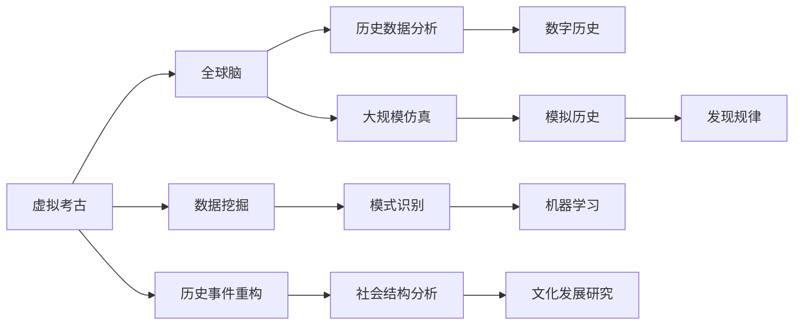

                 

# 虚拟考古:全球脑助力历史研究

## 1. 背景介绍

随着信息技术的迅猛发展和全球数据网络的建立，全球脑及其虚拟考古项目在全球历史研究领域中引起了广泛关注。这个项目利用先进的计算技术，模拟全球人类社会和历史的演化，通过虚拟考古和历史数据分析，挖掘出新的历史信息和历史规律，为历史学家和研究人员提供了强大的工具和平台。本文将详细阐述虚拟考古的概念、核心原理、具体操作步骤，以及其应用前景和存在的问题。

## 2. 核心概念与联系

### 2.1 核心概念概述

全球脑是建立在互联网和计算机网络基础上，通过大数据和机器学习技术构建的全球人类社会和历史的模拟平台。其核心概念包括：

- **虚拟考古**：利用计算机模拟和仿真技术，对历史事件、社会结构、文化发展等方面进行虚拟再现和深入研究，发现和验证历史上的未知事实和规律。
- **全球脑**：通过大数据分析、机器学习和计算仿真，模拟全球人类社会和历史的发展和演化过程，提供一个研究历史的新视角和工具。
- **历史数据分析**：采用数据挖掘和模式识别技术，从大规模历史数据集中提取有用信息，辅助历史研究。
- **数字历史**：将历史数据数字化，通过数字技术和工具进行存储、处理和分析，为历史研究提供新的方法和思路。

### 2.2 核心概念原理和架构的 Mermaid 流程图(Mermaid 流程节点中不要有括号、逗号等特殊字符)



这个流程图展示了虚拟考古项目的核心逻辑：

- 虚拟考古(A)项目依托全球脑(B)平台，利用历史数据分析(C)和数字历史(D)进行数据挖掘(E)和模式识别(F)。
- 机器学习(G)技术辅助历史事件重构(K)、社会结构分析(L)和文化发展研究(M)。
- 通过大规模仿真(H)模拟历史(I)，发现历史规律(J)，形成新见解。

## 3. 核心算法原理 & 具体操作步骤

### 3.1 算法原理概述

全球脑和虚拟考古的核心算法原理主要包括以下几个方面：

1. **大数据分析**：利用计算机对大规模历史数据进行存储、处理和分析，提取有用信息。
2. **机器学习**：通过算法对历史数据进行学习和训练，发现数据中的规律和模式。
3. **数字仿真**：使用计算机模拟和仿真技术，模拟历史事件、社会结构和文化发展，提供历史场景的可视化。
4. **模式识别**：对历史数据进行特征提取和模式识别，辅助历史事件的分类和归属。

### 3.2 算法步骤详解

1. **数据收集**：收集和整理历史数据，包括历史文本、考古发现、地理数据、社会结构数据等。
2. **数据预处理**：清洗和格式化数据，处理缺失值和异常值，对数据进行归一化和标准化。
3. **特征提取**：对数据进行特征提取，选择合适的特征，包括时间、地点、事件类型、社会结构等。
4. **模型训练**：选择适当的机器学习模型，对历史数据进行训练和测试，确定最佳模型。
5. **历史仿真**：利用计算机模拟和仿真技术，生成历史事件和结构的可视化。
6. **结果分析**：分析历史数据和仿真结果，发现新的历史规律和事件。

### 3.3 算法优缺点

**优点**：

1. **数据量大**：利用全球脑平台，能够访问到全球范围内的大量历史数据。
2. **算法强大**：大数据分析、机器学习和数字仿真等技术提供强大的计算支持。
3. **可验证性**：虚拟考古能够模拟历史事件，提供可验证的研究结果。

**缺点**：

1. **数据质量参差不齐**：历史数据存在残缺和误差，影响分析结果的准确性。
2. **算法复杂性**：需要处理和分析大规模复杂数据，算法设计复杂。
3. **计算资源需求高**：需要高性能计算资源，包括GPU、TPU等。

### 3.4 算法应用领域

虚拟考古和全球脑技术在历史研究领域有着广泛的应用，主要包括：

- **历史事件重构**：对历史事件进行模拟和重构，辅助历史事件的研究和理解。
- **社会结构分析**：研究不同时期的社会结构变化，如家庭、组织、阶级等。
- **文化发展研究**：分析不同历史时期文化的演变和发展，如艺术、文学、宗教等。
- **考古学应用**：辅助考古发现，通过虚拟考古技术重建历史遗址。
- **地理数据分析**：分析历史地理数据，研究地理因素对历史事件的影响。

## 4. 数学模型和公式 & 详细讲解 & 举例说明

### 4.1 数学模型构建

虚拟考古和全球脑项目的数学模型主要包括以下几个方面：

1. **时间序列分析**：利用时间序列模型分析历史数据中的趋势和规律。
2. **空间分析**：利用地理信息系统和地图数据进行空间分析和模拟。
3. **社会网络分析**：研究历史时期的社会网络结构，如家族、组织等。
4. **随机过程模型**：利用随机过程模型模拟历史事件的演化。

### 4.2 公式推导过程

以时间序列分析为例，介绍虚拟考古项目中常用的数学模型。

假设有一组历史数据 $y_t$，其中 $t$ 表示时间，可以建立时间序列模型：

$$ y_t = \alpha + \beta t + \epsilon_t $$

其中，$\alpha$ 是历史事件的基线值，$\beta$ 是历史事件的趋势参数，$\epsilon_t$ 是随机误差项。通过最小二乘法求解，可以估计 $\alpha$ 和 $\beta$，得到历史事件的趋势和基线值。

### 4.3 案例分析与讲解

假设历史数据 $y_t$ 表示某个历史时期的人口数量，建立时间序列模型：

$$ y_t = 100 + 0.1t + \epsilon_t $$

通过最小二乘法求解，得到历史事件的基线值 $\alpha = 100$，趋势参数 $\beta = 0.1$，随机误差项 $\epsilon_t$。可以得出结论，在第一个历史时期，人口数量为 100，随着时间推移，人口以每年代0.1的速度增长。

## 5. 项目实践：代码实例和详细解释说明

### 5.1 开发环境搭建

1. **安装 Python**：在 Windows 或 Linux 系统下，可以通过 apt-get 或 yum 命令安装 Python 3.x。
2. **安装 Pandas 和 NumPy**：使用 pip 命令安装 Pandas 和 NumPy 库，这些库是进行数据处理和计算的基础库。
3. **安装 Matplotlib**：安装 Matplotlib 库，用于数据可视化。
4. **安装 Scikit-learn**：安装 Scikit-learn 库，用于机器学习模型的训练和测试。
5. **安装 Jupyter Notebook**：安装 Jupyter Notebook 库，用于编写和运行 Python 代码。

### 5.2 源代码详细实现

以下是一个简单的 Python 代码示例，用于时间序列分析：

```python
import pandas as pd
import numpy as np
import matplotlib.pyplot as plt
from sklearn.linear_model import LinearRegression

# 加载历史数据
data = pd.read_csv('history_data.csv', index_col='time')

# 进行时间序列分析
model = LinearRegression()
model.fit(np.array(data['population']).reshape(-1, 1), np.array(data['year']).reshape(-1, 1))
y_pred = model.predict(np.array(data['year']).reshape(-1, 1))

# 绘制时间序列图
plt.plot(data['year'], data['population'], label='Actual')
plt.plot(data['year'], y_pred, label='Predicted')
plt.legend()
plt.show()
```

### 5.3 代码解读与分析

上述代码中，使用 Pandas 库读取历史数据，并将其存储为 DataFrame 格式。然后，使用 LinearRegression 模型对历史数据进行时间序列分析，并绘制出时间序列图。

## 6. 实际应用场景

### 6.1 历史事件重构

通过虚拟考古和全球脑技术，可以对历史事件进行重构，辅助历史学家对历史事件进行深入研究。例如，利用时间序列模型分析历史战争的人口流动和资源消耗，建立虚拟战场，重现历史战争场景。

### 6.2 社会结构分析

利用社会网络分析技术，可以研究历史时期的社会结构变化。例如，对历史时期的社会网络进行可视化，分析家族、组织、阶级等社会结构的变化趋势。

### 6.3 文化发展研究

通过虚拟考古和数字仿真技术，可以研究不同历史时期文化的演变和发展。例如，利用计算机模拟和仿真技术，再现古代艺术、文学、宗教等文化现象，分析其发展和变化。

### 6.4 未来应用展望

未来，虚拟考古和全球脑技术将在历史研究中发挥更大作用。随着计算技术的进步，数据量和算力将进一步提升，模拟和分析的精度也将更高。此外，结合人工智能和大数据技术，虚拟考古和全球脑项目将提供更加丰富的历史研究和分析工具。

## 7. 工具和资源推荐

### 7.1 学习资源推荐

- **Coursera**：提供大数据分析、机器学习和计算机模拟等课程，帮助用户掌握相关技术。
- **edX**：提供历史数据分析和数字历史等课程，帮助用户了解虚拟考古和全球脑技术的应用。
- **Kaggle**：提供历史数据分析竞赛和数据集，用户可以通过竞赛和数据集学习虚拟考古和全球脑技术的实际应用。

### 7.2 开发工具推荐

- **PyTorch**：强大的深度学习框架，适用于时间序列分析和数字仿真。
- **TensorFlow**：适用于大规模数据处理和机器学习模型训练。
- **Jupyter Notebook**：用于编写和运行 Python 代码，适合进行数据处理和分析。

### 7.3 相关论文推荐

- **"Big Data Analysis and Machine Learning in History"**：探讨大数据分析和机器学习在历史研究中的应用。
- **"Virtual Archaeology and Global Brain: New Tools for Historical Research"**：介绍虚拟考古和全球脑技术的概念和应用。
- **"Digital Historical Data and Its Impact on Historical Research"**：分析数字历史数据在历史研究中的应用和影响。

## 8. 总结：未来发展趋势与挑战

### 8.1 研究成果总结

虚拟考古和全球脑技术在历史研究中提供了强大的工具和平台，通过大数据分析和机器学习技术，帮助历史学家发现和验证历史事件和规律。虚拟考古项目模拟历史事件和社会结构，为历史研究提供新的视角和思路。

### 8.2 未来发展趋势

1. **数据量增大**：随着计算技术的进步，虚拟考古和全球脑项目将能够访问和分析更多的历史数据。
2. **算法优化**：未来算法将更加高效和精确，帮助历史学家进行更深入的研究和分析。
3. **跨领域应用**：虚拟考古和全球脑技术将与其他学科和领域结合，如考古学、地理学、社会学等，提供更加全面和深入的研究工具。
4. **全球合作**：不同国家和地区的学者可以共享数据和算法，提高全球历史研究的协作性和效率。

### 8.3 面临的挑战

1. **数据质量**：历史数据存在残缺和误差，影响分析结果的准确性。
2. **算法复杂性**：需要处理和分析大规模复杂数据，算法设计复杂。
3. **计算资源**：需要高性能计算资源，包括GPU、TPU等。

### 8.4 研究展望

未来的研究需要进一步提升数据质量、优化算法、降低计算资源消耗，同时促进跨学科合作，进一步拓展虚拟考古和全球脑技术在历史研究中的应用。

## 9. 附录：常见问题与解答

**Q1: 虚拟考古和全球脑技术在历史研究中有哪些应用？**

A: 虚拟考古和全球脑技术在历史研究中的应用包括历史事件重构、社会结构分析、文化发展研究、考古学应用和地理数据分析等。

**Q2: 虚拟考古和全球脑技术在实际应用中需要注意哪些问题？**

A: 虚拟考古和全球脑技术在实际应用中需要注意数据质量、算法复杂性和计算资源消耗等问题。

**Q3: 未来虚拟考古和全球脑技术将如何发展？**

A: 未来虚拟考古和全球脑技术将通过数据量增大、算法优化、跨领域应用和全球合作等方式，进一步拓展在历史研究中的应用。

---

作者：禅与计算机程序设计艺术 / Zen and the Art of Computer Programming

