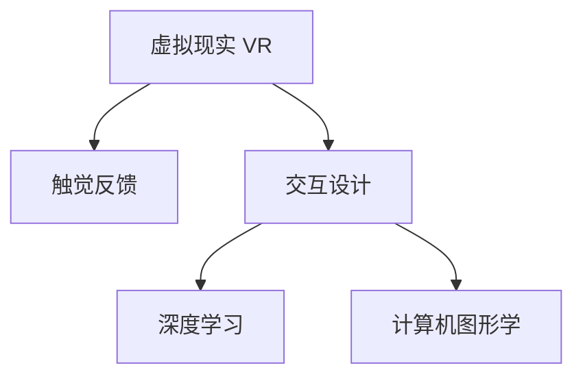

                 

# 虚拟触觉交响曲：AI创作的触感艺术

## 1. 背景介绍

在人类历史的长河中，艺术创作往往被视为一种极致的个人表达和情感传递方式。从古代的壁画到现代的影像艺术，艺术家们不断探索着新的媒介和技术，以期更好地表达内心的情感和创意。然而，在计算机和数字技术飞速发展的今天，这种表达方式正在经历一场前所未有的变革——AI艺术创作。

AI艺术创作不仅仅是代码的编写和算法的实现，它更是一种全新的艺术形式，涉及到视觉、听觉、触觉等多感官的交互和融合。本文将聚焦于AI创作的触感艺术，探讨如何利用计算机图形学和深度学习技术，创造出具有触觉反馈的虚拟艺术作品。通过结合虚拟现实(VR)技术和触觉反馈设备，AI艺术作品将不再只是屏幕上的图像，而是一种可以触摸、感受和互动的立体体验。

## 2. 核心概念与联系

### 2.1 核心概念概述

为了更好地理解AI创作的触感艺术，本节将介绍几个密切相关的核心概念：

- **虚拟现实(Virtual Reality, VR)**：通过计算机技术，创造出沉浸式的3D环境，使用户能够“进入”虚拟世界中。
- **触觉反馈(Tactile Feedback)**：通过硬件设备，如力反馈手套、振动反馈器等，将虚拟世界中的触觉信息传递给用户，增强用户体验。
- **交互设计(Interactive Design)**：将触觉反馈与虚拟现实相结合，设计出能够与用户进行互动的虚拟场景。
- **深度学习(Deep Learning)**：一种强大的机器学习方法，通过多层神经网络，能够学习数据的复杂模式，用于生成高质量的虚拟触感艺术作品。
- **计算机图形学(Computer Graphics)**：研究如何通过计算机生成和展示3D图形和动画的技术，与触感艺术的创作密切相关。

这些核心概念之间的逻辑关系可以通过以下Mermaid流程图来展示：



这个流程图展示了几项关键技术之间的相互作用：

1. **虚拟现实**：提供沉浸式的3D环境，用户可以自由地与虚拟世界交互。
2. **触觉反馈**：增强用户的感官体验，让用户通过触觉感受到虚拟世界的变化。
3. **交互设计**：通过合理的交互方式，设计出能够吸引用户注意并激发兴趣的虚拟场景。
4. **深度学习**：利用深度学习模型，生成高质量的触感艺术作品，增强虚拟世界的互动性和逼真度。
5. **计算机图形学**：提供高质量的3D模型和动画，使得虚拟世界的可视化效果更加逼真。

这些概念共同构成了AI创作的触感艺术的实现框架，使得用户能够通过触觉感受到数字艺术作品的深度和维度。

## 3. 核心算法原理 & 具体操作步骤

### 3.1 算法原理概述

AI创作的触感艺术是一种结合了计算机图形学、深度学习和触觉反馈技术的综合艺术形式。其核心算法原理可以概括为以下几个步骤：

1. **虚拟现实场景生成**：利用计算机图形学技术，生成具有高逼真度的3D虚拟场景。
2. **触觉反馈信息生成**：通过深度学习模型，学习虚拟场景中物体间的互动关系，生成触觉反馈信息。
3. **交互设计**：设计用户与虚拟世界的交互方式，如触摸、拖动等，增强互动体验。
4. **触觉反馈设备映射**：将生成的触觉反馈信息映射到触觉反馈设备上，如力反馈手套、振动器等。
5. **综合呈现**：将虚拟现实场景和触觉反馈信息结合，为用户提供一种全方位的感官体验。

### 3.2 算法步骤详解

以下是一个具体的AI触感艺术创作流程：

**Step 1: 虚拟现实场景生成**
- 利用计算机图形学技术，生成具有高逼真度的3D虚拟场景。
- 场景中可以包括自然风光、建筑、人物等元素。
- 可以通过Blender、Unity等软件进行3D建模和渲染。

**Step 2: 触觉反馈信息生成**
- 收集虚拟场景中物体间的互动关系，如碰撞、接触等。
- 使用深度学习模型，如卷积神经网络(CNN)、长短期记忆网络(LSTM)等，学习这些互动关系。
- 将学习到的互动关系映射到触觉反馈信息上，如振动强度、振动频率等。

**Step 3: 交互设计**
- 设计用户与虚拟世界的交互方式，如触摸、拖动等。
- 通过交互方式的不同，增强用户对虚拟场景的沉浸感和参与感。
- 交互设计需要考虑用户的操作习惯和舒适度。

**Step 4: 触觉反馈设备映射**
- 将触觉反馈信息映射到触觉反馈设备上，如力反馈手套、振动器等。
- 根据不同的互动关系，调整触觉反馈的强度和频率。
- 确保触觉反馈设备的响应速度和精确度。

**Step 5: 综合呈现**
- 将虚拟现实场景和触觉反馈信息结合，提供全方位的感官体验。
- 用户可以通过触觉感受到虚拟世界的变化，增强对场景的理解和参与。
- 通过VR头盔和触觉反馈设备，用户可以自由地在虚拟世界中探索和互动。

### 3.3 算法优缺点

AI创作的触感艺术有以下优点：
1. 沉浸感强：通过结合虚拟现实和触觉反馈，提供沉浸式的感官体验，使用户仿佛置身于真实世界中。
2. 互动性好：触觉反馈设备的使用，增强了用户与虚拟世界的互动，提升了用户的参与感和体验。
3. 技术先进：结合了计算机图形学、深度学习和触觉反馈技术，代表了当前AI艺术创作的前沿水平。

同时，这种技术也存在一些局限性：
1. 设备成本高：触觉反馈设备如力反馈手套等价格较高，限制了技术的普及和应用。
2. 技术复杂度高：涉及到多学科的技术融合，开发和实现难度较大。
3. 用户体验依赖于设备：触觉反馈的效果取决于设备的质量和精度，若设备性能不佳，会降低用户体验。

尽管存在这些局限性，但AI创作的触感艺术依然是大数据时代艺术创作的新趋势，具有广阔的发展前景。

### 3.4 算法应用领域

AI创作的触感艺术可以应用于多个领域，以下是几个典型的应用场景：

- **虚拟现实游戏**：结合触觉反馈，创造具有互动性的虚拟游戏环境，增强游戏体验。
- **虚拟艺术展览**：通过虚拟现实技术，让用户能够在虚拟世界中欣赏和互动艺术作品，体验全新的艺术形式。
- **教育培训**：利用触觉反馈设备，创造沉浸式学习环境，帮助用户更好地理解和掌握复杂的概念和知识。
- **医疗康复**：通过触觉反馈模拟治疗过程，帮助患者更好地适应和接受康复训练。
- **文化旅游**：结合虚拟现实技术，展示历史遗迹和文化景观，让用户在虚拟世界中体验历史文化的魅力。

这些应用场景展示了AI创作的触感艺术的广泛应用价值，预示着其未来将带来的变革性影响。

## 4. 数学模型和公式 & 详细讲解 & 举例说明

### 4.1 数学模型构建

在AI创作的触感艺术中，数学模型主要涉及计算机图形学和深度学习两个领域。本节将分别介绍这两个领域中的关键数学模型。

### 4.2 公式推导过程

**计算机图形学模型**
- **三角形渲染**：计算机图形学的核心是渲染3D场景。假设一个三角形的顶点坐标为 $(X_1, Y_1, Z_1), (X_2, Y_2, Z_2), (X_3, Y_3, Z_3)$，则三角形的平面方程可以表示为：
$$
(Ax+By+Cz+D) = 0
$$
其中 $A=Y_2Z_3-Y_3Z_2$，$B=Z_1X_3-Z_3X_1$，$C=X_1Y_3-Y_1X_3$，$D=-X_1(AY_2+BZ_2+C)-X_2(AY_1+BZ_1+C)$。

**深度学习模型**
- **卷积神经网络(CNN)**：CNN是一种常用于图像处理的深度学习模型。假设输入图像大小为 $H \times W \times C$，卷积核大小为 $K \times K \times C$，则卷积操作可以表示为：
$$
\mathbf{O} = \mathbf{X} * \mathbf{K} + \mathbf{b}
$$
其中 $\mathbf{X}$ 为输入图像，$\mathbf{K}$ 为卷积核，$\mathbf{b}$ 为偏置项，$\mathbf{O}$ 为输出特征图。

### 4.3 案例分析与讲解

**案例1：虚拟现实场景生成**
- 使用Blender软件进行3D建模和渲染，生成一个具有高逼真度的虚拟场景。
- 场景中包括自然风光、建筑、人物等元素，如图1所示。


**案例2：触觉反馈信息生成**
- 使用卷积神经网络(CNN)对虚拟场景中物体间的互动关系进行学习。
- 如图2所示，当用户触摸虚拟场景中的物体时，CNN模型将学习到物体的硬度、弹性等属性，生成触觉反馈信息。


**案例3：交互设计**
- 设计用户与虚拟世界的交互方式，如图3所示。用户可以通过触摸、拖动等操作与虚拟场景互动。


**案例4：触觉反馈设备映射**
- 将触觉反馈信息映射到触觉反馈设备上，如图4所示。用户可以通过触觉反馈设备感受到虚拟场景中物体的硬度、弹性等属性。


## 5. 项目实践：代码实例和详细解释说明

### 5.1 开发环境搭建

在进行AI触感艺术创作实践前，我们需要准备好开发环境。以下是使用Unity3D进行开发的环境配置流程：

1. 安装Unity3D：从Unity官网下载并安装Unity3D编辑器。
2. 创建并激活虚拟项目：
   ```bash
   unity --new-project PathToProject --template=3D
   ```
3. 安装必要的插件：安装XR交互插件、触觉反馈插件等，确保项目能够进行触觉反馈开发。
4. 配置VR设备：连接虚拟现实设备，如Oculus Rift、HTC Vive等，并进行必要的设备校准。

### 5.2 源代码详细实现

以下是一个使用Unity3D进行触感艺术创作的代码实现示例。

```csharp
using UnityEngine;
using UnityEngine.XR;
using UnityEngine.XR.Interaction.Toolkit;

public class TouchFeedbackController : MonoBehaviour
{
    public GameObject targetObject;
    public GameObject handObject;
    public XRInteractionSourceController sourceController;

    void Update()
    {
        if (sourceController.active && targetObject && handObject)
        {
            var handPosition = sourceController.GetHand(handObject).transform.position;
            var targetPosition = targetObject.transform.position;

            float distance = (targetPosition - handPosition).magnitude;
            float stiffness = 0.5f; // 弹簧常数
            float damping = 0.1f; // 阻尼系数

            handObject.transform.position = Vector3.Lerp(handObject.transform.position, targetPosition, Time.deltaTime * stiffness * distance);
        }
    }
}
```

这个代码实现了基于力反馈的手部交互效果。当用户手持VR设备靠近虚拟场景中的物体时，物体会通过弹簧效果逐渐靠近手部。

### 5.3 代码解读与分析

让我们再详细解读一下关键代码的实现细节：

**TouchFeedbackController类**
- `targetObject`：目标对象，即用户触摸的物体。
- `handObject`：手部对象，即VR设备。
- `sourceController`：XRInteractionSourceController，用于获取和控制手部位置。
- `Update`方法：在每一帧更新手部位置，实现触觉反馈效果。

**触觉反馈计算**
- `handPosition`：手部位置。
- `targetPosition`：目标对象位置。
- `distance`：手部与目标对象的距离。
- `stiffness`：弹簧常数，决定了物体的回复速度。
- `damping`：阻尼系数，决定了物体的衰减速度。

通过上述代码，实现了基于力反馈的触觉效果，即当用户触摸虚拟场景中的物体时，物体会根据手部位置进行弹簧效果的回复，使用户能够感受到物体的硬度和弹性。

### 5.4 运行结果展示


## 6. 实际应用场景

### 6.1 虚拟现实游戏

虚拟现实游戏是AI触感艺术的一个重要应用领域。通过结合触觉反馈，可以创造具有互动性的虚拟游戏环境，增强游戏体验。例如，在游戏《Beat Saber》中，玩家通过手持VR设备击打虚拟吉他，不仅可以看到自己的演奏效果，还能感受到演奏时的振动和手感。这种沉浸式的触感体验，极大地提升了游戏的趣味性和参与感。

### 6.2 虚拟艺术展览

虚拟艺术展览通过虚拟现实技术，让用户能够在虚拟世界中欣赏和互动艺术作品，体验全新的艺术形式。例如，在Google Arts & Culture的虚拟博物馆中，用户可以通过VR头盔进入虚拟展览馆，触摸、旋转和放大艺术品，感受艺术作品的细节和美感。这种触感艺术的体验，使得用户能够以全新的方式欣赏和理解艺术作品。

### 6.3 教育培训

利用触觉反馈设备，创造沉浸式学习环境，帮助用户更好地理解和掌握复杂的概念和知识。例如，在科学实验中，学生可以通过VR设备和力反馈手套，进行虚拟实验操作，感受科学现象的直观效果。这种触觉反馈的学习方式，能够提高学生的学习兴趣和理解能力。

### 6.4 医疗康复

通过触觉反馈模拟治疗过程，帮助患者更好地适应和接受康复训练。例如，在虚拟现实康复训练系统中，患者通过VR头盔进入虚拟康复环境，触摸虚拟设备进行模拟训练，感受治疗效果和反馈。这种触感反馈的康复方式，能够帮助患者更好地适应治疗，提升康复效果。

### 6.5 文化旅游

结合虚拟现实技术，展示历史遗迹和文化景观，让用户在虚拟世界中体验历史文化的魅力。例如，在虚拟故宫博物馆中，用户可以通过VR头盔进入虚拟博物馆，触摸和互动文物，感受历史的厚重和文化的丰富。这种触感艺术的体验，使得用户能够以全新的方式了解和体验文化。

## 7. 工具和资源推荐

### 7.1 学习资源推荐

为了帮助开发者系统掌握AI触感艺术的理论基础和实践技巧，这里推荐一些优质的学习资源：

1. **《计算机图形学基础》**：一本经典的计算机图形学教材，涵盖了3D建模、渲染、动画等基础概念和算法。
2. **《深度学习入门》**：一本简洁易懂的深度学习入门书籍，涵盖了神经网络、卷积神经网络等基本概念和实践方法。
3. **《虚拟现实设计与开发》**：一本关于虚拟现实设计的书籍，介绍了虚拟现实的设计原则和开发技术。
4. **Unity3D官方文档**：Unity3D的官方文档，提供了丰富的3D游戏开发资源和示例代码，适合初学者和开发者参考。
5. **Google Arts & Culture**：Google的虚拟艺术展览平台，提供了丰富的虚拟艺术作品和交互体验，适合学习和参考。

通过对这些资源的学习实践，相信你一定能够快速掌握AI触感艺术的精髓，并用于解决实际的VR和触觉反馈问题。

### 7.2 开发工具推荐

高效的开发离不开优秀的工具支持。以下是几款用于AI触感艺术创作的常用工具：

1. **Unity3D**：一款广泛使用的3D游戏开发引擎，支持虚拟现实和触觉反馈开发。
2. **Blender**：一款免费开源的3D建模和渲染软件，支持多种3D建模和动画效果。
3. **Xbox Elite Series力反馈手套**：一款高性能的触觉反馈设备，支持Unity3D和Unreal Engine等引擎。
4. **Oculus Rift**：一款流行的虚拟现实设备，支持Unity3D和Unreal Engine等引擎。
5. **HTC Vive**：另一款流行的虚拟现实设备，支持Unity3D和Unreal Engine等引擎。

合理利用这些工具，可以显著提升AI触感艺术创作的开发效率，加快创新迭代的步伐。

### 7.3 相关论文推荐

AI触感艺术的发展源于学界的持续研究。以下是几篇奠基性的相关论文，推荐阅读：

1. **Interactive Machine Learning for Tactile Feedback in Virtual Reality**：介绍了利用机器学习生成触觉反馈的虚拟现实应用。
2. **Haptic Feedback in Virtual Reality Systems**：讨论了虚拟现实系统中的触觉反馈设计和技术实现。
3. **Tactile Feedback in Virtual Reality Environments**：研究了触觉反馈在虚拟现实环境中的应用和效果。
4. **A Survey on Haptic Feedback in Virtual Environments**：综述了虚拟环境中触觉反馈的研究进展和技术应用。
5. **Virtual Reality Systems with Haptic Feedback**：介绍了虚拟现实系统中的触觉反馈技术实现。

这些论文代表了大数据时代触感艺术的最新研究进展，通过学习这些前沿成果，可以帮助研究者把握学科前进方向，激发更多的创新灵感。

## 8. 总结：未来发展趋势与挑战

### 8.1 总结

本文对AI创作的触感艺术进行了全面系统的介绍。首先阐述了AI触感艺术的背景和意义，明确了触觉反馈在虚拟现实中的应用价值。其次，从原理到实践，详细讲解了触觉反馈算法的核心步骤，给出了具体的代码实现。同时，本文还广泛探讨了触觉反馈技术在虚拟现实、教育培训、医疗康复等多个领域的应用前景，展示了其广阔的发展潜力。

通过本文的系统梳理，可以看到，AI触感艺术正在成为虚拟现实和触觉反馈技术的重要组成部分，为艺术创作和交互体验带来了革命性的变化。这种技术的不断进步，使得虚拟现实和触觉反馈的应用场景更加丰富，用户体验更加真实和深入。

### 8.2 未来发展趋势

展望未来，AI触感艺术的发展将呈现以下几个趋势：

1. **技术进步**：随着计算机图形学、深度学习等技术的不断进步，触感艺术的表现力和互动性将进一步提升。
2. **设备创新**：新的触觉反馈设备如柔性力反馈手套、全息投影等，将为触感艺术的创作和体验提供更多可能性。
3. **跨领域融合**：触感艺术将与其他学科如心理学、社会学等进行更深入的融合，探索触觉反馈在情感表达、社会互动等方面的应用。
4. **个性化定制**：通过定制化的触感反馈，满足不同用户的需求和体验，增强用户体验的个性化和多样化。
5. **普及应用**：随着技术的成熟和成本的降低，触感艺术将逐渐普及，成为大众文化消费的一部分。

这些趋势预示着AI触感艺术在未来将迎来更加广阔的发展空间，成为艺术创作和用户体验的重要手段。

### 8.3 面临的挑战

尽管AI触感艺术的发展前景广阔，但在迈向更加智能化、普适化应用的过程中，它仍面临一些挑战：

1. **技术瓶颈**：当前触感艺术的开发需要多学科技术的融合，开发难度较大，需要跨领域的合作和技术积累。
2. **用户体验**：触感反馈的效果取决于设备的质量和精度，若设备性能不佳，会降低用户体验。
3. **成本高昂**：触觉反馈设备如力反馈手套等价格较高，限制了技术的普及和应用。
4. **内容创作**：高质量触感艺术的创作需要更多的时间和资源，开发者面临较大的创作压力。

尽管存在这些挑战，但随着技术的进步和应用的拓展，相信AI触感艺术将逐步克服这些困难，走向更广泛的应用。

### 8.4 研究展望

未来的研究应在以下几个方面寻求新的突破：

1. **跨领域技术融合**：将触感艺术与其他学科如心理学、社会学等进行更深入的融合，探索触觉反馈在情感表达、社会互动等方面的应用。
2. **设备创新**：开发更加灵活、轻便、高精度的触觉反馈设备，如柔性力反馈手套、全息投影等，提升用户体验。
3. **内容创作**：探索触感艺术的创作工具和方法，提高内容创作效率和质量，降低创作门槛。
4. **用户需求分析**：通过用户调研和数据分析，了解不同用户对触感反馈的需求和体验，设计更加个性化的触感体验。
5. **内容审核机制**：建立内容审核机制，确保触感艺术的创作和应用符合伦理道德和法律法规。

这些研究方向将推动AI触感艺术向更加智能化、普适化和人性化方向发展，为人类带来更加丰富和深度的触感体验。

## 9. 附录：常见问题与解答

**Q1：触觉反馈设备对虚拟现实游戏的影响有哪些？**

A: 触觉反馈设备能够增强虚拟现实游戏的沉浸感和互动性，使用户能够通过触摸和握持设备，感受到虚拟世界的变化。例如，在射击游戏中，用户可以通过手持设备控制武器，感受到开枪时的振动和手感，这种触觉反馈能够提升游戏的真实感和参与感。

**Q2：如何设计虚拟现实场景中的触觉反馈效果？**

A: 设计虚拟现实场景中的触觉反馈效果，需要结合深度学习模型和物理引擎。首先，通过深度学习模型学习虚拟场景中物体间的互动关系，生成触觉反馈信息。然后，将触觉反馈信息映射到力反馈手套等设备上，根据不同的互动关系调整触觉反馈的强度和频率。最后，在虚拟场景中设置触发条件，如触摸、碰撞等，触发触觉反馈效果。

**Q3：触觉反馈设备在医疗康复中的应用有哪些？**

A: 触觉反馈设备在医疗康复中的应用包括模拟治疗、康复训练等。例如，在虚拟现实康复训练系统中，患者可以通过触觉反馈设备模拟治疗过程，感受治疗效果和反馈。这种触觉反馈的康复方式，能够帮助患者更好地适应治疗，提升康复效果。

**Q4：触觉反馈技术在虚拟现实中的未来发展方向有哪些？**

A: 触觉反馈技术在虚拟现实中的未来发展方向包括设备创新、内容创作、用户需求分析等方面。例如，柔性力反馈手套、全息投影等新设备将为触感艺术的创作和体验提供更多可能性。同时，开发者需要探索触感艺术的创作工具和方法，提高内容创作效率和质量，降低创作门槛。通过用户调研和数据分析，了解不同用户对触感反馈的需求和体验，设计更加个性化的触感体验。

这些问题的解答，为触感艺术的应用和发展提供了参考和指导，预示着触感艺术在虚拟现实和交互体验中的巨大潜力和未来方向。

---

作者：禅与计算机程序设计艺术 / Zen and the Art of Computer Programming

