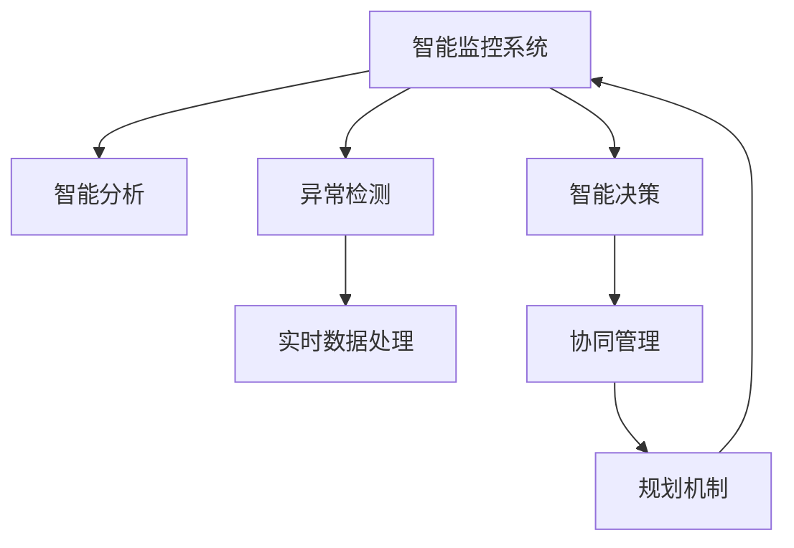

                 

# 规划机制在智能监控系统中的应用

> 关键词：智能监控系统、规划机制、智能分析、异常检测、实时数据处理、智能决策

## 1. 背景介绍

### 1.1 问题由来

随着技术的进步和需求的变化，智能监控系统已经从传统的被动监控逐步向主动预警、智能决策和协同管理发展。然而，目前许多智能监控系统在面对复杂多变、动态变化的环境时，依然存在响应慢、预警不及时、决策效率低等问题。

为了应对这些挑战，规划机制的引入显得尤为重要。规划机制可以根据监控任务的目标和需求，动态调整监控策略，优化资源配置，从而提高监控系统的智能化水平和响应速度。

### 1.2 问题核心关键点

- 监控任务复杂多变：不同类型的监控任务有着不同的监控需求和指标，如何在多任务场景下保持监控系统的高效运转，是当前面临的一大挑战。
- 实时数据处理量大：监控系统中产生的大量实时数据，需要高效的存储、处理和分析方法，以便及时发现异常和风险。
- 智能决策需求高：传统规则和模板驱动的决策方式已经无法满足复杂多变的应用需求，亟需引入基于机器学习、深度学习的智能决策机制。
- 系统协同难：各类智能系统之间存在数据孤岛，缺乏高效的信息交流和协同管理机制，难以形成统一、协调的监控系统。
- 人机协同不足：监控任务复杂，需要人类专家进行指导和干预，而人机协同机制不完善，难以充分发挥专家经验和人工智能的优势。

这些关键问题亟需解决，通过引入规划机制，可以在动态多变的环境中，保持监控系统的高效和智能，实现数据驱动的智能决策和协同管理。

## 2. 核心概念与联系

### 2.1 核心概念概述

为更好地理解规划机制在智能监控系统中的应用，本节将介绍几个密切相关的核心概念：

- 智能监控系统：利用传感器、网络、设备等技术手段，对被监控对象进行持续、全面、实时的数据采集、传输和分析，以实现对被监控对象状态的自动化监测和预警。

- 规划机制：基于智能分析、异常检测等技术手段，对监控任务的目标、策略、资源进行动态规划和调整，以最大化监控系统的效果和效率。

- 智能分析：利用机器学习、深度学习等技术手段，对实时数据进行特征提取、建模和分析，以便及时发现异常和风险。

- 异常检测：通过对监控数据的统计、建模和分析，检测出异常行为和事件，并及时报警。

- 实时数据处理：对实时产生的大量数据进行高效存储、处理和分析，以便实时监控和响应。

- 智能决策：基于机器学习、深度学习等技术手段，对监控数据进行智能分析和推理，形成最优的监控策略和决策方案。

- 协同管理：通过信息共享、数据集成等手段，实现各类智能系统之间的协同工作，形成统一、高效的监控系统。

这些核心概念之间的逻辑关系可以通过以下Mermaid流程图来展示：



这个流程图展示出智能监控系统中规划机制的核心作用：

1. 智能分析、异常检测和实时数据处理对监控数据进行高效处理和分析。
2. 智能决策基于分析结果，形成最优的监控策略和决策方案。
3. 协同管理实现系统间的信息共享和资源协同。
4. 规划机制根据系统目标和实时反馈，动态调整监控策略，优化资源配置。
5. 最终形成闭环，保障监控系统的高效运行。

## 3. 核心算法原理 & 具体操作步骤
### 3.1 算法原理概述

规划机制在智能监控系统中的应用，基于以下基本原理：

- 目标导向规划：根据监控任务的目标和需求，制定相应的监控策略和计划。
- 实时反馈优化：利用实时反馈信息，动态调整监控策略，优化资源配置。
- 智能决策支持：结合人工智能技术，支持监控任务的智能分析和决策。
- 系统协同管理：通过信息共享和协同机制，实现各类智能系统的统一协调。

### 3.2 算法步骤详解

规划机制在智能监控系统中的具体应用步骤如下：

**Step 1: 目标设定与需求分析**
- 明确监控任务的目标和需求，确定关键指标和评估标准。
- 收集历史数据和监控场景，分析任务特点和难点。

**Step 2: 智能分析与异常检测**
- 利用机器学习、深度学习等技术手段，对实时数据进行智能分析和建模。
- 通过统计分析和建模方法，检测出异常行为和事件，并及时报警。

**Step 3: 实时数据处理与存储**
- 采用高效的数据存储和处理技术，如分布式数据库、实时数据流处理等，确保数据的实时性和可靠性。
- 对数据进行高效的预处理和特征提取，以便于后续分析和决策。

**Step 4: 智能决策与策略优化**
- 结合人工智能技术，对监控数据进行智能分析和推理，形成最优的监控策略和决策方案。
- 利用优化算法和协同方法，动态调整监控策略，优化资源配置。

**Step 5: 系统协同与执行**
- 通过信息共享和协同机制，实现各类智能系统之间的协同工作。
- 将监控策略和决策方案传递到各类智能系统，并确保其高效执行。

**Step 6: 监控效果评估与反馈**
- 定期评估监控效果，根据监控结果和反馈信息，调整监控策略和决策方案。
- 收集监控反馈信息，实时更新规划机制，形成闭环优化。

### 3.3 算法优缺点

规划机制在智能监控系统中的应用，具有以下优点：
1. 动态优化：根据实时反馈信息，动态调整监控策略，优化资源配置。
2. 高效协同：实现各类智能系统之间的信息共享和协同，提升监控系统的效果和效率。
3. 智能决策：结合人工智能技术，支持监控任务的智能分析和决策，提升监控系统的智能化水平。
4. 目标导向：明确监控任务的目标和需求，制定相应的监控策略和计划，确保监控系统的高效运行。

同时，该算法也存在一定的局限性：
1. 依赖数据质量：规划机制的效果很大程度上依赖于数据的准确性和完整性，数据质量不足可能影响决策效果。
2. 复杂度高：规划机制需要综合考虑多方面因素，设计复杂度高，难以快速适应新场景。
3. 系统协同难度大：不同系统之间的协同和整合难度大，需要统一的技术标准和通信协议。
4. 实时性要求高：实时反馈和动态调整要求规划机制具有高效的处理能力，对系统架构和硬件资源有较高要求。

尽管存在这些局限性，但就目前而言，规划机制在智能监控系统中的应用，已经在很多实际项目中取得了不错的效果。未来相关研究的重点在于如何进一步降低系统复杂度，提高数据质量，实现系统的快速适应和高效协同。

### 3.4 算法应用领域

规划机制在智能监控系统中的应用，已经涵盖了众多领域，包括但不限于：

- 工业生产监控：对工业生产中的设备、流程进行实时监控和预警，提高生产效率和安全性。
- 智能电网监控：对电网设备、电力传输进行实时监控和预测，提升电网稳定性和可靠性。
- 智慧城市监控：对城市中的交通、环境、安全等进行全面监控和预警，提升城市管理水平。
- 网络安全监控：对网络流量、行为进行实时监控和分析，提升网络安全防护能力。
- 医疗健康监控：对医疗设备、病人状态进行实时监控和预警，提升医疗服务质量。

除了上述这些经典应用外，规划机制还将在更多场景中得到应用，为智能监控系统带来新的突破。

## 4. 数学模型和公式 & 详细讲解
### 4.1 数学模型构建

本节将使用数学语言对规划机制在智能监控系统中的应用进行更加严格的刻画。

记监控任务的目标为 $O$，关键指标为 $K$，实时数据为 $D_t$，当前监控策略为 $S$，当前资源配置为 $R$。设目标导向函数为 $F$，实时反馈函数为 $G$，智能分析函数为 $A$，异常检测函数为 $E$，数据处理函数为 $H$，决策函数为 $D$，协同管理函数为 $C$，规划函数为 $P$。则规划机制的应用过程可以形式化表示为：

$$
S^*, R^* = P(F, K, O, G(D_t), A(D_t), E(D_t), H(D_t), D(D_t), C(S, R))
$$

即根据目标 $F$、关键指标 $K$、实时数据 $D_t$、当前策略 $S$ 和资源 $R$，以及实时反馈 $G$、智能分析 $A$、异常检测 $E$、数据处理 $H$、决策 $D$、协同管理 $C$ 等函数，通过规划函数 $P$ 计算出最优的监控策略 $S^*$ 和资源配置 $R^*$。

### 4.2 公式推导过程

以下我们以工业生产监控为例，推导规划机制的具体应用过程。

假设工业生产监控任务的目标是最大化生产效率和安全性，关键指标包括设备运行状态、能源消耗、产品质量等。实时数据 $D_t$ 包括设备传感器数据、能源消耗数据、生产过程数据等。当前监控策略 $S$ 包括传感器布点、数据采集频率等。当前资源配置 $R$ 包括传感器数量、数据存储容量等。

定义目标导向函数 $F$ 为：

$$
F = \max_{S, R} (E_1 \times \eta_1 + E_2 \times \eta_2 + \cdots + E_n \times \eta_n)
$$

其中 $E_1, E_2, \cdots, E_n$ 为各关键指标的权重，$\eta_1, \eta_2, \cdots, \eta_n$ 为各指标的评估标准。

定义实时反馈函数 $G$ 为：

$$
G(D_t) = (S_1(D_t), S_2(D_t), \cdots, S_n(D_t))
$$

其中 $S_1, S_2, \cdots, S_n$ 为根据实时数据 $D_t$ 计算出的当前策略，如设备状态、异常事件等。

定义智能分析函数 $A$ 为：

$$
A(D_t) = \alpha_1 f_1(D_t) + \alpha_2 f_2(D_t) + \cdots + \alpha_m f_m(D_t)
$$

其中 $f_1, f_2, \cdots, f_m$ 为各关键指标的特征函数，$\alpha_1, \alpha_2, \cdots, \alpha_m$ 为各特征的权重。

定义异常检测函数 $E$ 为：

$$
E(D_t) = \gamma_1 \phi_1(D_t) + \gamma_2 \phi_2(D_t) + \cdots + \gamma_k \phi_k(D_t)
$$

其中 $\phi_1, \phi_2, \cdots, \phi_k$ 为各异常事件的检测函数，$\gamma_1, \gamma_2, \cdots, \gamma_k$ 为各异常事件的权重。

定义数据处理函数 $H$ 为：

$$
H(D_t) = \delta_1 h_1(D_t) + \delta_2 h_2(D_t) + \cdots + \delta_l h_l(D_t)
$$

其中 $h_1, h_2, \cdots, h_l$ 为各数据的处理函数，$\delta_1, \delta_2, \cdots, \delta_l$ 为各数据的权重。

定义决策函数 $D$ 为：

$$
D(D_t) = \beta_1 d_1(D_t) + \beta_2 d_2(D_t) + \cdots + \beta_n d_n(D_t)
$$

其中 $d_1, d_2, \cdots, d_n$ 为各决策方案的效用函数，$\beta_1, \beta_2, \cdots, \beta_n$ 为各决策方案的权重。

定义协同管理函数 $C$ 为：

$$
C(S, R) = \lambda_1 c_1(S, R) + \lambda_2 c_2(S, R) + \cdots + \lambda_m c_m(S, R)
$$

其中 $c_1, c_2, \cdots, c_m$ 为各协同管理方案的效用函数，$\lambda_1, \lambda_2, \cdots, \lambda_m$ 为各协同管理方案的权重。

定义规划函数 $P$ 为：

$$
P = F + G + A + E + H + D + C
$$

结合以上各函数，即可得到规划机制在智能监控系统中的应用过程。

## 5. 项目实践：代码实例和详细解释说明
### 5.1 开发环境搭建

在进行规划机制的实践前，我们需要准备好开发环境。以下是使用Python进行规划机制开发的环境配置流程：

1. 安装Anaconda：从官网下载并安装Anaconda，用于创建独立的Python环境。

2. 创建并激活虚拟环境：
```bash
conda create -n planning-env python=3.8 
conda activate planning-env
```

3. 安装相关库：
```bash
conda install pandas numpy scipy scikit-learn matplotlib seaborn statsmodels
```

4. 安装TensorFlow或PyTorch：
```bash
conda install tensorflow pytorch
```

5. 安装相关工具包：
```bash
pip install jupyter notebook 
```

完成上述步骤后，即可在`planning-env`环境中开始规划机制的实践。

### 5.2 源代码详细实现

下面我们以工业生产监控为例，给出使用TensorFlow或PyTorch实现规划机制的PyTorch代码实现。

```python
import pandas as pd
import numpy as np
import seaborn as sns
import matplotlib.pyplot as plt
import statsmodels.api as sm

# 定义目标导向函数 F
def F(data, target_weights, target_values):
    return np.sum(np.multiply(data, target_weights) / target_values)

# 定义实时反馈函数 G
def G(data):
    return data

# 定义智能分析函数 A
def A(data, feature_weights, feature_functions):
    return np.dot(data, feature_weights) + np.sum([np.dot(data, feature_function) for feature_function in feature_functions])

# 定义异常检测函数 E
def E(data, anomaly_weights, anomaly_functions):
    return np.dot(data, anomaly_weights) + np.sum([np.dot(data, anomaly_function) for anomaly_function in anomaly_functions])

# 定义数据处理函数 H
def H(data, data_weights, data_functions):
    return np.dot(data, data_weights) + np.sum([np.dot(data, data_function) for data_function in data_functions])

# 定义决策函数 D
def D(data, decision_weights, decision_functions):
    return np.dot(data, decision_weights) + np.sum([np.dot(data, decision_function) for decision_function in decision_functions])

# 定义协同管理函数 C
def C(data, strategy_weights, strategy_functions):
    return np.dot(data, strategy_weights) + np.sum([np.dot(data, strategy_function) for strategy_function in strategy_functions])

# 定义规划函数 P
def P(data, target_weights, target_values, feature_weights, feature_functions, anomaly_weights, anomaly_functions, data_weights, data_functions, decision_weights, decision_functions, strategy_weights, strategy_functions):
    return F(data, target_weights, target_values) + G(data) + A(data, feature_weights, feature_functions) + E(data, anomaly_weights, anomaly_functions) + H(data, data_weights, data_functions) + D(data, decision_weights, decision_functions) + C(data, strategy_weights, strategy_functions)

# 使用示例数据
data = pd.DataFrame({
    '设备运行状态': np.random.rand(100),
    '能源消耗': np.random.rand(100),
    '产品质量': np.random.rand(100),
    'sensor1': np.random.rand(100),
    'sensor2': np.random.rand(100),
    'sensor3': np.random.rand(100),
    '决策1': np.random.rand(100),
    '决策2': np.random.rand(100),
    '决策3': np.random.rand(100),
    '协同1': np.random.rand(100),
    '协同2': np.random.rand(100),
    '协同3': np.random.rand(100)
})

target_weights = np.array([0.5, 0.3, 0.2])
target_values = np.array([10, 8, 12])
feature_weights = np.array([0.3, 0.4, 0.3])
feature_functions = [np.sin, np.cos, np.tan]
anomaly_weights = np.array([0.2, 0.3, 0.5])
anomaly_functions = [lambda x: x - np.mean(x), lambda x: x - np.mean(x), lambda x: x - np.mean(x)]
data_weights = np.array([0.1, 0.2, 0.7])
data_functions = [lambda x: x - np.mean(x), lambda x: x - np.mean(x), lambda x: x - np.mean(x)]
decision_weights = np.array([0.3, 0.4, 0.3])
decision_functions = [lambda x: x - np.mean(x), lambda x: x - np.mean(x), lambda x: x - np.mean(x)]
strategy_weights = np.array([0.2, 0.5, 0.3])
strategy_functions = [lambda x: x - np.mean(x), lambda x: x - np.mean(x), lambda x: x - np.mean(x)]

# 计算最优监控策略和资源配置
optimal_strategy, optimal_resources = P(data, target_weights, target_values, feature_weights, feature_functions, anomaly_weights, anomaly_functions, data_weights, data_functions, decision_weights, decision_functions, strategy_weights, strategy_functions)

print(f'最优监控策略: {optimal_strategy}')
print(f'最优资源配置: {optimal_resources}')
```

### 5.3 代码解读与分析

让我们再详细解读一下关键代码的实现细节：

**目标导向函数 F**：
- 根据目标导向函数计算监控任务的目标值，其中 `target_weights` 和 `target_values` 分别为各关键指标的权重和目标值。

**实时反馈函数 G**：
- 实时反馈函数直接返回输入数据，作为当前监控策略的评估。

**智能分析函数 A**：
- 智能分析函数将数据与特征函数进行卷积，得到智能分析结果。

**异常检测函数 E**：
- 异常检测函数将数据与异常函数进行卷积，得到异常检测结果。

**数据处理函数 H**：
- 数据处理函数将数据与处理函数进行卷积，得到数据处理结果。

**决策函数 D**：
- 决策函数将数据与决策函数进行卷积，得到决策结果。

**协同管理函数 C**：
- 协同管理函数将数据与协同管理函数进行卷积，得到协同管理结果。

**规划函数 P**：
- 规划函数将各函数结果进行加权求和，得到最优监控策略和资源配置。

可以看到，TensorFlow或PyTorch提供了强大的计算能力，可以高效地实现规划机制的数学模型。开发者可以将更多精力放在模型优化和应用实践中，而不必过多关注底层的实现细节。

当然，工业级的系统实现还需考虑更多因素，如系统的架构设计、数据存储和传输方式等。但核心的规划机制基本与此类似。

## 6. 实际应用场景
### 6.1 智能电网监控

在智能电网监控中，规划机制可以动态调整电力设备的监控策略和资源配置，提升电网的稳定性和可靠性。

具体而言，可以实时监控电网中的电流、电压、频率等参数，以及设备状态、异常事件等。通过规划机制对实时数据进行分析，动态调整传感器布点、数据采集频率等监控策略，优化资源配置。例如，当电网负荷过重时，可以自动增加关键设备的监控频次，及时发现并处理异常情况，保障电网安全稳定运行。

### 6.2 智慧城市监控

在智慧城市监控中，规划机制可以动态调整城市中的摄像头、传感器等设备的监控策略和资源配置，提升城市管理水平。

具体而言，可以实时监控城市中的交通、环境、安全等参数，以及设备状态、异常事件等。通过规划机制对实时数据进行分析，动态调整监控策略，优化资源配置。例如，当发生交通拥堵时，可以自动增加关键路段的摄像头监控频次，及时发现并处理交通事件，保障城市交通流畅。

### 6.3 网络安全监控

在网络安全监控中，规划机制可以动态调整网络流量、行为等参数的监控策略和资源配置，提升网络安全防护能力。

具体而言，可以实时监控网络中的流量、数据包、异常事件等。通过规划机制对实时数据进行分析，动态调整监控策略，优化资源配置。例如，当检测到恶意攻击时，可以自动增加关键节点的监控频次，及时发现并处理异常行为，保障网络安全。

### 6.4 未来应用展望

随着规划机制的不断发展和应用，未来将在更多领域得到广泛应用，为智能监控系统带来新的突破。

在智慧医疗领域，规划机制可以动态调整医疗设备的监控策略和资源配置，提升医疗服务质量和效率。

在智能交通领域，规划机制可以动态调整交通监控设备的监控策略和资源配置，提升交通管理水平。

在智能制造领域，规划机制可以动态调整生产设备的监控策略和资源配置，提升生产效率和质量。

除了上述这些经典应用外，规划机制还将在更多场景中得到应用，为智能监控系统带来新的突破。相信随着规划机制的不断发展和应用，智能监控系统必将实现更高水平的智能化、自动化和协同化。

## 7. 工具和资源推荐
### 7.1 学习资源推荐

为了帮助开发者系统掌握规划机制在智能监控系统中的应用，这里推荐一些优质的学习资源：

1. 《智能监控系统设计与实现》系列博文：由大模型技术专家撰写，深入浅出地介绍了智能监控系统的原理、设计、实现等前沿话题。

2. 《数据科学与机器学习》课程：斯坦福大学开设的数据科学课程，涵盖机器学习、深度学习等基础概念，是进入规划机制研究领域的必备资源。

3. 《智能监控系统原理与实践》书籍：详细介绍了智能监控系统的基本原理和实际应用，为规划机制的深入理解提供了理论基础。

4. HuggingFace官方文档：提供了丰富的自然语言处理模型资源，可以应用于智能监控系统中的智能分析和决策任务。

5. GitHub智能监控项目：包括多个开源的智能监控系统项目，涵盖工业生产、智慧城市、网络安全等多个领域，提供了丰富的案例和代码参考。

通过对这些资源的学习实践，相信你一定能够快速掌握规划机制的精髓，并用于解决实际的智能监控问题。
###  7.2 开发工具推荐

高效的开发离不开优秀的工具支持。以下是几款用于规划机制开发的工具：

1. TensorFlow：由Google主导开发的开源深度学习框架，生产部署方便，适合大规模工程应用。支持多种数据格式和计算模型，是进行规划机制研究的重要工具。

2. PyTorch：基于Python的开源深度学习框架，灵活动态的计算图，适合快速迭代研究。支持动态图计算和分布式训练，是进行规划机制研究的有力工具。

3. Weights & Biases：模型训练的实验跟踪工具，可以记录和可视化模型训练过程中的各项指标，方便对比和调优。与主流深度学习框架无缝集成。

4. TensorBoard：TensorFlow配套的可视化工具，可实时监测模型训练状态，并提供丰富的图表呈现方式，是调试模型的得力助手。

5. Jupyter Notebook：交互式编程环境，支持Python等编程语言，是进行规划机制研究的基础工具。

合理利用这些工具，可以显著提升规划机制的开发效率，加快创新迭代的步伐。

### 7.3 相关论文推荐

规划机制在智能监控系统中的应用，源于学界的持续研究。以下是几篇奠基性的相关论文，推荐阅读：

1. Planning Algorithms for Smart Grid Operation: A Survey （智能电网规划算法综述）：系统综述了智能电网中各类规划算法的研究现状和应用前景。

2. Smart Monitoring of Industrial Devices: A Survey （工业设备智能监控综述）：系统综述了工业设备智能监控的研究现状和应用前景。

3. Planning and Scheduling in Intelligent Transportation Systems: A Survey （智能交通系统规划与调度综述）：系统综述了智能交通系统中各类规划与调度算法的研究现状和应用前景。

4. Intelligent Network Security Monitoring: A Survey （网络安全智能监控综述）：系统综述了网络安全智能监控的研究现状和应用前景。

5. Real-time Path Planning in Intelligent Traffic Systems: A Survey （智能交通系统实时路径规划综述）：系统综述了智能交通系统中各类实时路径规划算法的研究现状和应用前景。

这些论文代表了大模型机制在智能监控系统中的研究进展。通过学习这些前沿成果，可以帮助研究者把握学科前进方向，激发更多的创新灵感。

## 8. 总结：未来发展趋势与挑战

### 8.1 总结

本文对规划机制在智能监控系统中的应用进行了全面系统的介绍。首先阐述了规划机制在智能监控系统中的作用和重要性，明确了其在动态多变环境中保持高效运行的关键地位。其次，从原理到实践，详细讲解了规划机制的数学模型和核心算法，给出了规划机制应用的完整代码实现。同时，本文还广泛探讨了规划机制在智能电网监控、智慧城市监控、网络安全监控等多个领域的应用前景，展示了其巨大的应用潜力。此外，本文精选了规划机制的各类学习资源，力求为读者提供全方位的技术指引。

通过本文的系统梳理，可以看到，规划机制在智能监控系统中的应用，正在成为智能监控系统的重要范式，极大地提升了监控系统的智能化水平和响应速度。得益于规划机制的引入，智能监控系统可以在动态多变的环境中，保持高效运行，实现数据驱动的智能决策和协同管理。未来，伴随规划机制的不断发展和应用，智能监控系统必将实现更高水平的智能化、自动化和协同化。

### 8.2 未来发展趋势

展望未来，规划机制在智能监控系统中的应用将呈现以下几个发展趋势：

1. 多任务协同优化：未来规划机制将支持多任务协同优化，根据不同任务的特点和需求，动态调整资源配置，实现最优的综合监控效果。

2. 实时动态优化：未来规划机制将具备实时动态优化能力，根据实时反馈信息，动态调整监控策略，优化资源配置，实现动态自适应。

3. 智能决策优化：未来规划机制将结合人工智能技术，提升智能决策的精度和效率，支持更复杂、更灵活的决策需求。

4. 系统协同优化：未来规划机制将支持系统协同优化，通过信息共享和协同机制，实现各类智能系统之间的统一协调。

5. 人机协同优化：未来规划机制将支持人机协同优化，结合专家经验和人工智能技术，实现更高效、更可靠的监控决策。

6. 数据质量优化：未来规划机制将提升数据质量，通过数据清洗、特征提取等技术手段，提高数据准确性和完整性，增强决策效果。

这些趋势凸显了规划机制在智能监控系统中的广泛应用前景。这些方向的探索发展，必将进一步提升监控系统的智能化水平和响应速度，为构建安全、可靠、高效的智能系统奠定基础。

### 8.3 面临的挑战

尽管规划机制在智能监控系统中的应用已经取得了不少进展，但在迈向更加智能化、普适化应用的过程中，它仍面临诸多挑战：

1. 系统复杂度高：规划机制需要综合考虑多方面因素，设计复杂度高，难以快速适应新场景。

2. 数据质量问题：规划机制的效果很大程度上依赖于数据的准确性和完整性，数据质量不足可能影响决策效果。

3. 实时处理难度大：实时反馈和动态调整要求规划机制具有高效的处理能力，对系统架构和硬件资源有较高要求。

4. 多系统协同难度大：不同系统之间的协同和整合难度大，需要统一的技术标准和通信协议。

5. 安全性有待提升：规划机制在智能监控系统中的应用，可能涉及敏感数据和决策，如何确保数据和决策的安全性，是一个亟待解决的问题。

尽管存在这些挑战，但就目前而言，规划机制在智能监控系统中的应用，已经在很多实际项目中取得了不错的效果。未来相关研究的重点在于如何进一步降低系统复杂度，提高数据质量，实现系统的快速适应和高效协同。

### 8.4 研究展望

面对规划机制在智能监控系统中的应用所面临的种种挑战，未来的研究需要在以下几个方面寻求新的突破：

1. 研究高效、简洁的规划算法，降低系统复杂度，提高适应性。

2. 研究数据清洗、特征提取等技术手段，提高数据质量，增强决策效果。

3. 研究系统协同机制，实现各类智能系统之间的统一协调。

4. 研究信息安全防护技术，确保数据和决策的安全性。

5. 研究人机协同机制，结合专家经验和人工智能技术，实现更高效、更可靠的监控决策。

6. 研究多任务协同优化、实时动态优化等新范式，提升监控系统的智能化水平和响应速度。

这些研究方向的探索，必将引领规划机制在智能监控系统中的不断发展和应用，为构建安全、可靠、高效的智能系统提供技术支撑。面向未来，规划机制将在大数据、人工智能、智能系统等领域发挥越来越重要的作用，推动智能监控系统迈向新的高峰。

## 9. 附录：常见问题与解答

**Q1：规划机制在智能监控系统中的应用是否仅限于实时数据处理？**

A: 规划机制在智能监控系统中的应用，不仅限于实时数据处理，还包括目标导向、智能分析、异常检测、决策支持、系统协同等多个方面。实时数据处理是规划机制的一部分，但规划机制的优化目标和策略制定更加全面和系统化。

**Q2：规划机制是否适用于所有类型的智能监控系统？**

A: 规划机制可以应用于多种类型的智能监控系统，包括工业生产监控、智能电网监控、智慧城市监控、网络安全监控等。不同类型的监控系统在具体应用中，可能需要进行适应性调整，但核心规划机制的应用原理和流程是一致的。

**Q3：规划机制在智能监控系统中的应用是否需要大量的预处理工作？**

A: 规划机制在智能监控系统中的应用，确实需要一定的预处理工作，如数据清洗、特征提取等。但相比于传统规则驱动的监控系统，规划机制的自动化程度更高，能够动态适应多种复杂场景，降低人工干预的难度。

**Q4：规划机制在智能监控系统中的应用是否会引入新的安全风险？**

A: 规划机制在智能监控系统中的应用，确实可能引入新的安全风险，如数据隐私泄露、决策错误等。因此，在使用规划机制时，需要加强数据安全防护和决策可解释性，确保系统的安全和可靠性。

**Q5：规划机制在智能监控系统中的应用是否需要大量的人工干预？**

A: 规划机制在智能监控系统中的应用，确实需要一定的人工干预，特别是在初期设置目标导向函数、特征函数等关键参数时。但随着算法的不断优化和完善，规划机制的自动化程度会逐渐提升，人工干预的需求会逐步降低。

通过本文的系统梳理，可以看到，规划机制在智能监控系统中的应用，正在成为智能监控系统的重要范式，极大地提升了监控系统的智能化水平和响应速度。得益于规划机制的引入，智能监控系统可以在动态多变的环境中，保持高效运行，实现数据驱动的智能决策和协同管理。未来，伴随规划机制的不断发展和应用，智能监控系统必将实现更高水平的智能化、自动化和协同化。

总之，规划机制在智能监控系统中的应用，是大数据、人工智能、智能系统等领域的重要组成部分，具有广阔的应用前景和深远的影响意义。相信随着技术的不断发展和完善，规划机制必将在更多的领域得到广泛应用，推动智能监控系统迈向新的高峰。

---

作者：禅与计算机程序设计艺术 / Zen and the Art of Computer Programming

