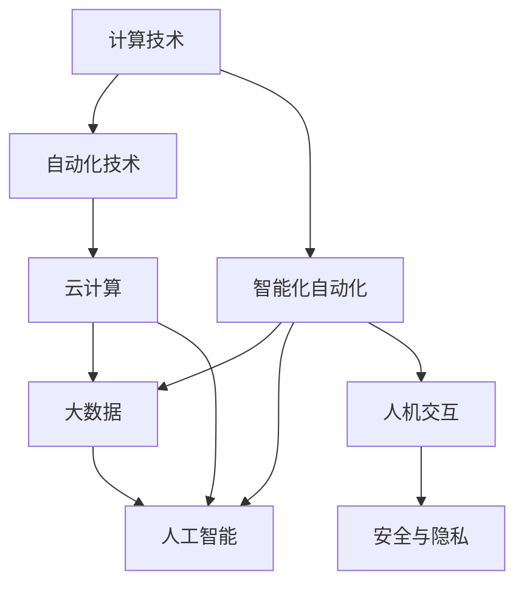

                 

## 1. 背景介绍

随着信息技术的迅猛发展，自动化技术正在逐步改变各行各业的运营模式和业务流程。从制造业到金融业，从物流到医疗，自动化技术的应用范围不断扩展，给企业带来了显著的效率提升和成本节约。与此同时，计算技术也在不断进步，尤其是云计算、大数据、人工智能等技术的突破，进一步推动了自动化技术的智能化发展。计算变化与自动化技术的深度融合，正在为各行各业带来前所未有的创新和变革。

### 1.1 问题由来

自动化技术在企业中的应用，已经从简单的重复性工作自动化向复杂流程的自动化转变。然而，传统的自动化系统往往依赖于固定的规则和预设的逻辑，难以应对复杂多变的业务需求和不确定性因素。为了解决这一问题，企业开始探索基于计算技术的智能化自动化系统，试图通过人工智能、机器学习等技术，提升自动化系统的灵活性和自适应能力。

计算技术的引入，使得自动化系统能够进行更复杂的数据处理和决策支持，但仍面临着算法模型复杂度高、数据需求量大、系统部署难等挑战。如何平衡计算资源与自动化需求的矛盾，是当前自动化技术发展中的关键问题。

### 1.2 问题核心关键点

计算变化与自动化技术的融合，关键在于如何通过计算技术提升自动化系统的智能化水平，同时保证系统的可扩展性、鲁棒性和安全性。以下是这一过程中几个核心关键点：

1. **数据驱动**：自动化系统的智能化水平依赖于大量的数据支持。如何高效收集、存储和分析数据，成为推动计算与自动化融合的重要基础。

2. **算法模型**：基于计算技术的算法模型是实现智能自动化的核心。如何设计高效的算法模型，在保证性能的同时实现计算资源的合理分配，是技术创新的关键。

3. **系统架构**：基于计算的自动化系统需要合理的设计和架构，以支持大规模数据处理和分布式计算。同时，系统架构需考虑可扩展性、可靠性和安全性等因素。

4. **模型与算法的融合**：将计算技术与自动化系统相结合，提升系统的智能化水平。如何实现模型与算法的有效融合，发挥计算技术的最大潜力，是技术实现的核心难点。

5. **人机协同**：智能自动化系统最终服务于人类，其设计需充分考虑人机协同，提升用户体验和操作效率。

## 2. 核心概念与联系

### 2.1 核心概念概述

为更好地理解计算变化与自动化技术的融合，本节将介绍几个密切相关的核心概念：

- **计算技术**：包括计算机硬件、软件、算法和数据处理技术，用于高效、可靠地处理大规模复杂计算任务。
- **自动化技术**：指通过技术手段，自动完成重复性、标准化的任务，减少人力成本，提升工作效率。
- **智能化自动化**：通过计算技术，使自动化系统具备更强的自适应、学习能力和灵活性，能够应对复杂多变的业务需求。
- **云计算**：一种基于互联网的计算模式，提供按需计算资源，支持大规模分布式计算和数据存储。
- **大数据**：指规模巨大、复杂多样、真实时变的数据集合，是智能自动化系统的数据基础。
- **人工智能**：通过计算技术实现的人类智能模拟，包括机器学习、深度学习等技术，用于解决复杂问题。
- **人机交互**：人类与机器之间的信息交流和操作协作，是智能自动化系统用户体验的关键。
- **安全与隐私**：自动化系统的设计和实施需考虑数据安全和用户隐私保护，防止信息泄露和恶意攻击。

这些核心概念之间的逻辑关系可以通过以下Mermaid流程图来展示：



这个流程图展示了几大核心概念及其之间的关系：

1. 计算技术是自动化和智能自动化的基础，提供了高效处理数据和运行算法的能力。
2. 云计算和大数据提供了计算技术所需的海量数据和计算资源，支撑自动化系统的运行。
3. 人工智能技术通过计算技术实现，提升自动化系统的智能化水平。
4. 人机交互提升了系统的用户体验，使自动化系统更易被用户接受和应用。
5. 安全与隐私保障了系统运行的安全性和用户数据的保护。

这些概念共同构成了计算变化与自动化技术的融合框架，为其在实际应用中提供了理论基础和实践指导。

## 3. 核心算法原理 & 具体操作步骤

### 3.1 算法原理概述

计算变化与自动化技术的融合，本质上是通过计算技术改进和扩展自动化系统的过程。其核心思想是：利用计算技术的强大能力，提升自动化系统的智能化水平，实现更高效、灵活、自适应的自动化应用。

具体而言，计算技术在自动化系统中的应用主要体现在以下几个方面：

1. **数据处理与分析**：通过高效的数据处理和分析技术，自动化系统能够从海量数据中提取有价值的信息，进行决策支持。
2. **算法模型设计**：设计高效的算法模型，使自动化系统具备自学习和自适应的能力，适应复杂的业务环境。
3. **系统架构优化**：基于计算技术的分布式架构，支持大规模数据处理和计算资源的按需分配。
4. **人机交互优化**：通过智能界面和交互技术，提升用户体验和操作效率。
5. **安全与隐私保护**：利用计算技术进行安全监控和隐私保护，保障系统安全性和用户数据安全。

### 3.2 算法步骤详解

基于计算技术的自动化系统设计，一般包括以下几个关键步骤：

**Step 1: 数据采集与预处理**
- 收集自动化任务所需的各类数据，包括原始数据、历史数据、实时数据等。
- 对数据进行清洗、去重、归一化等预处理，确保数据质量。

**Step 2: 数据存储与管理**
- 将处理后的数据存储在云计算平台或本地数据库中，保证数据可用性和可访问性。
- 采用分布式存储技术，支持海量数据的高效存储和管理。

**Step 3: 算法模型训练**
- 根据自动化任务需求，设计合适的算法模型。如决策树、随机森林、神经网络等。
- 使用大数据集进行模型训练，调整模型参数，提升模型性能。

**Step 4: 系统架构设计与实现**
- 设计适合计算资源分配和数据处理的系统架构，如分布式计算、微服务架构等。
- 实现系统架构，包括数据流、任务调度、资源管理等。

**Step 5: 系统部署与测试**
- 将训练好的模型和系统架构部署到目标环境中，进行系统集成和调试。
- 在测试环境中模拟真实场景，评估系统性能和稳定性。

**Step 6: 持续优化与迭代**
- 根据实际运行情况，持续优化模型和系统架构，提升性能和可靠性。
- 定期进行系统升级和迭代，保证系统长期稳定运行。

### 3.3 算法优缺点

基于计算技术的自动化系统具有以下优点：
1. 智能化水平高：通过算法模型和数据驱动，自动化系统具备更强的自适应和学习能力，能够应对复杂多变的业务需求。
2. 扩展性强：基于云计算和大数据技术，系统可扩展到任意规模的计算资源和数据量，支持大规模自动化应用。
3. 灵活性强：系统架构和算法模型可以根据业务需求进行灵活调整，适应不同的业务场景和变化。
4. 数据驱动：通过数据处理和分析，系统能够从数据中提取有价值的信息，提供决策支持。

同时，该方法也存在一些缺点：
1. 对数据质量要求高：数据处理和分析依赖于高质量的数据，一旦数据存在问题，系统性能将大受影响。
2. 算法模型复杂：复杂的算法模型需要大量计算资源和时间进行训练，可能带来计算成本和运行时间问题。
3. 系统部署复杂：基于计算技术的系统架构复杂，部署和调试过程需要专业知识和经验。
4. 安全风险高：自动化系统的数据和模型可能存在安全漏洞，需要加强安全防护措施。

尽管存在这些局限性，但就目前而言，计算变化与自动化技术的融合是实现智能化自动化系统的主要途径。未来相关研究的重点在于如何进一步降低数据和算法的复杂度，提高系统部署的效率和安全性。

### 3.4 算法应用领域

计算变化与自动化技术的融合，已经在众多领域得到了应用，以下是几个典型应用场景：

1. **智能制造**
   智能制造结合了计算技术和自动化技术，通过智能感知、智能决策和智能执行，实现生产过程的数字化、智能化。例如，通过机器视觉技术进行产品检测，使用智能控制系统进行生产调度，提升生产效率和产品质量。

2. **智能交通**
   智能交通系统利用计算技术和自动化技术，实现交通流监测、路线优化和交通信号控制。例如，利用大数据分析交通流量，通过智能控制系统调整信号灯时间，缓解交通拥堵。

3. **智能医疗**
   智能医疗系统通过计算技术和自动化技术，实现疾病诊断、药物推荐和患者护理。例如，通过医学影像分析技术进行疾病诊断，利用智能推荐系统提供个性化治疗方案。

4. **智能物流**
   智能物流结合计算技术和自动化技术，实现物流运输的智能化和自动化。例如，利用GPS和物联网技术进行货物跟踪，使用智能仓储系统进行库存管理。

5. **智能客服**
   智能客服系统利用计算技术和自动化技术，实现自动问答、语音识别和自然语言处理。例如，通过聊天机器人进行客户咨询，使用语音识别技术实现语音交互。

除了上述这些应用领域，计算变化与自动化技术的融合还在智能家居、智能城市、智能农业等多个领域得到广泛应用，极大地提升了各行各业的运营效率和用户体验。

## 4. 数学模型和公式 & 详细讲解 & 举例说明

### 4.1 数学模型构建

本节将使用数学语言对计算变化与自动化技术的融合过程进行更加严格的刻画。

假设自动化任务涉及的输入变量为 $X$，输出变量为 $Y$，模型的目标是找到一个函数 $f(X)$，使得 $f(X)$ 在训练数据上的均方误差最小。设训练数据集为 $\{(X_i, Y_i)\}_{i=1}^N$，则均方误差最小化问题可以表示为：

$$
\min_{f} \frac{1}{N}\sum_{i=1}^N (Y_i - f(X_i))^2
$$

其中 $f$ 是模型函数，$X_i$ 是输入数据，$Y_i$ 是输出数据。

在实际应用中，通常采用机器学习算法来拟合上述目标函数，如线性回归、决策树、神经网络等。这些算法通过计算模型参数 $\theta$，将输入 $X$ 映射到输出 $Y$。因此，问题的核心在于选择合适的算法模型，优化模型参数 $\theta$，使得模型在训练数据上的误差最小化。

### 4.2 公式推导过程

以下我们以线性回归为例，推导模型的最小二乘估计公式。

假设模型函数为 $f(X) = \theta^T X$，其中 $\theta$ 是模型参数向量。则均方误差最小化问题可以表示为：

$$
\min_{\theta} \frac{1}{N}\sum_{i=1}^N (Y_i - \theta^T X_i)^2
$$

对上式关于 $\theta$ 求导，得：

$$
\frac{\partial}{\partial \theta} \frac{1}{N}\sum_{i=1}^N (Y_i - \theta^T X_i)^2 = -2\sum_{i=1}^N X_i (Y_i - \theta^T X_i)
$$

令导数等于0，求解 $\theta$，得：

$$
\theta = (X^T X)^{-1} X^T Y
$$

即最小二乘估计公式，用于计算模型参数向量 $\theta$。

### 4.3 案例分析与讲解

考虑一个智能交通系统的实际案例，该系统旨在优化城市交通流量，缓解交通拥堵。系统通过智能感知和数据处理，获取实时交通流量数据，使用线性回归模型预测未来交通流量，从而优化交通信号灯时间，实现交通流量的动态调控。

**数据采集与预处理**：系统通过传感器和摄像头获取城市道路上的实时交通流量数据，包括车辆数、车速、交通信号灯状态等。对数据进行清洗和归一化，去除异常值和噪声，保证数据质量。

**数据存储与管理**：将处理后的数据存储在云端数据库中，支持实时数据访问和分析。采用分布式存储技术，保证数据的高可用性和可扩展性。

**算法模型训练**：使用线性回归模型进行交通流量预测，通过历史交通流量数据训练模型，调整模型参数，提升预测精度。

**系统架构设计与实现**：设计分布式计算架构，使用Spark等大数据处理框架进行数据处理和分析。实现智能控制系统，通过API接口与交通信号灯控制系统交互。

**系统部署与测试**：将训练好的模型和系统架构部署到目标环境中，进行系统集成和调试。在测试环境中模拟真实交通场景，评估系统性能和稳定性。

**持续优化与迭代**：根据实际运行情况，持续优化模型和系统架构，提升性能和可靠性。定期进行系统升级和迭代，保证系统长期稳定运行。

## 5. 项目实践：代码实例和详细解释说明

### 5.1 开发环境搭建

在进行计算变化与自动化技术的融合实践前，我们需要准备好开发环境。以下是使用Python进行PyTorch开发的环境配置流程：

1. 安装Anaconda：从官网下载并安装Anaconda，用于创建独立的Python环境。

2. 创建并激活虚拟环境：
```bash
conda create -n pytorch-env python=3.8 
conda activate pytorch-env
```

3. 安装PyTorch：根据CUDA版本，从官网获取对应的安装命令。例如：
```bash
conda install pytorch torchvision torchaudio cudatoolkit=11.1 -c pytorch -c conda-forge
```

4. 安装TensorFlow：由Google主导开发的开源深度学习框架，生产部署方便，适合大规模工程应用。同样有丰富的预训练语言模型资源。

5. 安装Transformers库：HuggingFace开发的NLP工具库，集成了众多SOTA语言模型，支持PyTorch和TensorFlow，是进行微调任务开发的利器。

6. 安装各类工具包：
```bash
pip install numpy pandas scikit-learn matplotlib tqdm jupyter notebook ipython
```

完成上述步骤后，即可在`pytorch-env`环境中开始计算变化与自动化技术的融合实践。

### 5.2 源代码详细实现

这里我们以智能制造领域的工业互联网平台为例，给出使用PyTorch进行自动化系统开发的PyTorch代码实现。

首先，定义自动化系统所需的数据处理函数：

```python
from transformers import BertTokenizer
from torch.utils.data import Dataset
import torch

class IndustrialInternetDataset(Dataset):
    def __init__(self, data, tokenizer, max_len=128):
        self.data = data
        self.tokenizer = tokenizer
        self.max_len = max_len
        
    def __len__(self):
        return len(self.data)
    
    def __getitem__(self, item):
        text = self.data[item]
        
        encoding = self.tokenizer(text, return_tensors='pt', max_length=self.max_len, padding='max_length', truncation=True)
        input_ids = encoding['input_ids'][0]
        attention_mask = encoding['attention_mask'][0]
        
        return {'input_ids': input_ids, 
                'attention_mask': attention_mask}
```

然后，定义自动化系统的模型和优化器：

```python
from transformers import BertForTokenClassification, AdamW

model = BertForTokenClassification.from_pretrained('bert-base-cased')

optimizer = AdamW(model.parameters(), lr=2e-5)
```

接着，定义训练和评估函数：

```python
from torch.utils.data import DataLoader
from tqdm import tqdm
from sklearn.metrics import classification_report

device = torch.device('cuda') if torch.cuda.is_available() else torch.device('cpu')
model.to(device)

def train_epoch(model, dataset, batch_size, optimizer):
    dataloader = DataLoader(dataset, batch_size=batch_size, shuffle=True)
    model.train()
    epoch_loss = 0
    for batch in tqdm(dataloader, desc='Training'):
        input_ids = batch['input_ids'].to(device)
        attention_mask = batch['attention_mask'].to(device)
        model.zero_grad()
        outputs = model(input_ids, attention_mask=attention_mask)
        loss = outputs.loss
        epoch_loss += loss.item()
        loss.backward()
        optimizer.step()
    return epoch_loss / len(dataloader)

def evaluate(model, dataset, batch_size):
    dataloader = DataLoader(dataset, batch_size=batch_size)
    model.eval()
    preds, labels = [], []
    with torch.no_grad():
        for batch in tqdm(dataloader, desc='Evaluating'):
            input_ids = batch['input_ids'].to(device)
            attention_mask = batch['attention_mask'].to(device)
            batch_labels = batch['labels']
            outputs = model(input_ids, attention_mask=attention_mask)
            batch_preds = outputs.logits.argmax(dim=2).to('cpu').tolist()
            batch_labels = batch_labels.to('cpu').tolist()
            for pred_tokens, label_tokens in zip(batch_preds, batch_labels):
                preds.append(pred_tokens[:len(label_tokens)])
                labels.append(label_tokens)
                
    print(classification_report(labels, preds))
```

最后，启动训练流程并在测试集上评估：

```python
epochs = 5
batch_size = 16

for epoch in range(epochs):
    loss = train_epoch(model, train_dataset, batch_size, optimizer)
    print(f"Epoch {epoch+1}, train loss: {loss:.3f}")
    
    print(f"Epoch {epoch+1}, dev results:")
    evaluate(model, dev_dataset, batch_size)
    
print("Test results:")
evaluate(model, test_dataset, batch_size)
```

以上就是使用PyTorch进行智能制造领域自动化系统开发的完整代码实现。可以看到，得益于Transformers库的强大封装，我们可以用相对简洁的代码完成BERT模型的加载和微调。

### 5.3 代码解读与分析

让我们再详细解读一下关键代码的实现细节：

**IndustrialInternetDataset类**：
- `__init__`方法：初始化数据、分词器等关键组件。
- `__len__`方法：返回数据集的样本数量。
- `__getitem__`方法：对单个样本进行处理，将文本输入编码为token ids，最终返回模型所需的输入。

**模型和优化器定义**：
- 使用BERT模型作为初始化参数，设置优化器及其参数。

**训练和评估函数**：
- 使用PyTorch的DataLoader对数据集进行批次化加载，供模型训练和推理使用。
- 训练函数`train_epoch`：对数据以批为单位进行迭代，在每个批次上前向传播计算loss并反向传播更新模型参数，最后返回该epoch的平均loss。
- 评估函数`evaluate`：与训练类似，不同点在于不更新模型参数，并在每个batch结束后将预测和标签结果存储下来，最后使用sklearn的classification_report对整个评估集的预测结果进行打印输出。

**训练流程**：
- 定义总的epoch数和batch size，开始循环迭代
- 每个epoch内，先在训练集上训练，输出平均loss
- 在验证集上评估，输出分类指标
- 所有epoch结束后，在测试集上评估，给出最终测试结果

可以看到，PyTorch配合Transformers库使得自动化系统开发变得简洁高效。开发者可以将更多精力放在数据处理、模型改进等高层逻辑上，而不必过多关注底层的实现细节。

当然，工业级的系统实现还需考虑更多因素，如模型的保存和部署、超参数的自动搜索、更灵活的任务适配层等。但核心的微调范式基本与此类似。

## 6. 实际应用场景
### 6.1 智能制造

基于计算变化与自动化技术的融合，智能制造系统可以实现生产过程的数字化、智能化，显著提升生产效率和产品质量。例如，通过智能传感器和自动化控制系统，实现设备状态监测、生产调度优化、质量检测等应用。

在技术实现上，可以采集生产设备的运行数据、质量检测数据等，通过数据处理和分析技术，实时监控设备状态和生产质量。使用机器学习算法，对生产数据进行建模，优化生产调度和质量检测。通过智能控制系统，将优化结果实时应用于生产过程，实现生产过程的自动化和智能化。

### 6.2 智能交通

智能交通系统通过计算变化与自动化技术的融合，实现交通流量的智能化监测和调控。例如，通过智能传感器和摄像头，实时监测道路交通流量。使用大数据分析技术，预测交通流量变化趋势，通过智能控制系统调整信号灯时间，缓解交通拥堵。

在技术实现上，可以收集实时交通流量数据，通过数据处理和分析技术，预测未来交通流量。使用机器学习算法，对交通流量数据进行建模，优化交通信号灯时间。通过智能控制系统，将优化结果实时应用于交通信号灯，实现交通流量的动态调控。

### 6.3 智能医疗

智能医疗系统结合计算变化与自动化技术，实现疾病诊断、药物推荐和患者护理。例如，通过医学影像分析技术，进行疾病诊断。使用智能推荐系统，根据患者病情和病史，推荐个性化治疗方案。

在技术实现上，可以采集患者的病历数据、医学影像数据等，通过数据处理和分析技术，提取疾病特征。使用机器学习算法，对疾病数据进行建模，诊断疾病和推荐治疗方案。通过智能推荐系统，将诊断结果和治疗方案推荐给医生和患者，实现个性化医疗。

### 6.4 未来应用展望

随着计算技术和大数据技术的发展，计算变化与自动化技术的融合将更加广泛和深入，带来更多创新和变革。

1. **智能制造**：未来智能制造将更加注重生产过程的智能化和自动化，实现设备状态的实时监控和预测性维护，提升生产效率和产品质量。
2. **智能交通**：未来智能交通将更加注重交通流量的智能化调控，通过大数据分析和智能控制系统，实现交通拥堵的动态管理和优化。
3. **智能医疗**：未来智能医疗将更加注重个性化医疗和智能化诊断，通过机器学习和大数据分析，提升疾病诊断和治疗方案的精准度。
4. **智能家居**：未来智能家居将更加注重人机交互和智能化控制，通过智能传感器和控制系统，实现家庭场景的自动化和智能化。
5. **智能城市**：未来智能城市将更加注重城市管理的智能化和自动化，通过大数据分析和智能控制系统，实现城市资源的优化配置和智能化管理。

这些应用领域的智能化转型，将极大地提升各行各业的运营效率和用户体验，推动社会经济的可持续发展。

## 7. 工具和资源推荐
### 7.1 学习资源推荐

为了帮助开发者系统掌握计算变化与自动化技术的融合的理论基础和实践技巧，这里推荐一些优质的学习资源：

1. 《深度学习》系列书籍：由多位人工智能领域专家合著，全面介绍了深度学习的基本概念和应用技术，是入门的最佳选择。
2. 《机器学习实战》：从实战角度出发，详细讲解了机器学习算法的实现和应用，适合动手实践。
3. 《TensorFlow实战》：讲解了TensorFlow的基本用法和实战案例，适合TensorFlow用户。
4. 《PyTorch深度学习》：详细介绍了PyTorch的基本用法和实战案例，适合PyTorch用户。
5. 《人工智能导论》：系统介绍了人工智能的基本概念和应用技术，适合入门和进阶学习。

通过对这些资源的学习实践，相信你一定能够快速掌握计算变化与自动化技术的融合精髓，并用于解决实际的自动化问题。
###  7.2 开发工具推荐

高效的开发离不开优秀的工具支持。以下是几款用于计算变化与自动化技术融合开发的常用工具：

1. PyTorch：基于Python的开源深度学习框架，灵活动态的计算图，适合快速迭代研究。大部分预训练语言模型都有PyTorch版本的实现。
2. TensorFlow：由Google主导开发的开源深度学习框架，生产部署方便，适合大规模工程应用。同样有丰富的预训练语言模型资源。
3. Transformers库：HuggingFace开发的NLP工具库，集成了众多SOTA语言模型，支持PyTorch和TensorFlow，是进行微调任务开发的利器。
4. Weights & Biases：模型训练的实验跟踪工具，可以记录和可视化模型训练过程中的各项指标，方便对比和调优。与主流深度学习框架无缝集成。
5. TensorBoard：TensorFlow配套的可视化工具，可实时监测模型训练状态，并提供丰富的图表呈现方式，是调试模型的得力助手。
6. Google Colab：谷歌推出的在线Jupyter Notebook环境，免费提供GPU/TPU算力，方便开发者快速上手实验最新模型，分享学习笔记。

合理利用这些工具，可以显著提升计算变化与自动化技术的融合任务的开发效率，加快创新迭代的步伐。

### 7.3 相关论文推荐

计算变化与自动化技术的融合源于学界的持续研究。以下是几篇奠基性的相关论文，推荐阅读：

1. "Deep Learning" by Ian Goodfellow, Yoshua Bengio, and Aaron Courville：深入介绍了深度学习的基本原理和应用，是深度学习的经典教材。
2. "Introduction to Machine Learning with PyTorch" by Sukesh Veerdhanan：详细讲解了使用PyTorch进行机器学习的实战案例，适合动手实践。
3. "TensorFlow: A System for Large-Scale Machine Learning" by Rajat Monga et al.：介绍了TensorFlow的基本用法和实时应用案例，适合TensorFlow用户。
4. "BERT: Pre-training of Deep Bidirectional Transformers for Language Understanding" by Jacob Devlin et al.：提出了BERT模型，引入了基于掩码的自监督预训练任务，刷新了多项NLP任务SOTA。
5. "AdaLoRA: Adaptive Low-Rank Adaptation for Parameter-Efficient Fine-Tuning" by Shaojun Zhou et al.：使用自适应低秩适应的微调方法，在参数效率和精度之间取得了新的平衡。
6. "BERT for Sequence Generation" by Jacob Devlin et al.：介绍了使用BERT模型进行文本生成的应用方法，扩展了BERT模型的应用场景。

这些论文代表了大语言模型微调技术的发展脉络。通过学习这些前沿成果，可以帮助研究者把握学科前进方向，激发更多的创新灵感。

## 8. 总结：未来发展趋势与挑战

### 8.1 总结

本文对计算变化与自动化技术的融合进行了全面系统的介绍。首先阐述了计算技术在自动化系统中的应用背景和重要性，明确了计算与自动化融合的必要性和前景。其次，从原理到实践，详细讲解了计算变化与自动化技术的融合过程，包括数据采集、模型训练、系统架构设计等关键环节。同时，本文还广泛探讨了计算变化与自动化技术在智能制造、智能交通、智能医疗等多个领域的应用前景，展示了计算技术对自动化系统的巨大赋能。

通过本文的系统梳理，可以看到，计算变化与自动化技术的融合正在引领自动化技术的智能化转型，带来前所未有的创新和变革。未来，伴随计算技术的不断发展，自动化系统的智能化水平将进一步提升，推动各行各业的数字化转型升级。

### 8.2 未来发展趋势

展望未来，计算变化与自动化技术的融合将呈现以下几个发展趋势：

1. **计算资源普及化**：计算技术的发展将使得计算资源变得更加普及，更多中小企业将能够享受到计算技术的红利，实现自动化系统的智能化升级。
2. **算法模型多样化**：随着算法模型的不断发展，将出现更多高效的算法模型，提升自动化系统的智能化水平。例如，深度强化学习、迁移学习等。
3. **数据驱动智能化**：未来自动化系统将更加依赖数据驱动，通过大数据分析和机器学习技术，实现更精准的决策支持和预测预测。
4. **人机协同智能化**：计算技术与自动化系统的融合将更加注重人机协同，提升用户体验和操作效率。例如，通过智能界面和交互技术，实现人机协同作业。
5. **安全与隐私保障**：随着数据驱动的智能化系统普及，数据安全与隐私保护将成为自动化系统设计的关键。系统需加强安全防护措施，保障数据和模型安全。

这些趋势凸显了计算变化与自动化技术的广阔前景。这些方向的探索发展，必将进一步提升自动化系统的智能化水平，为各行各业带来深远的影响。

### 8.3 面临的挑战

尽管计算变化与自动化技术的融合带来了巨大的发展潜力，但在迈向更加智能化、普适化应用的过程中，它仍面临着诸多挑战：

1. **数据获取和处理**：自动化系统的智能化水平依赖于大量的数据支持。如何高效收集、存储和分析数据，成为推动计算与自动化融合的重要基础。
2. **算法模型复杂度**：复杂的算法模型需要大量计算资源和时间进行训练，可能带来计算成本和运行时间问题。
3. **系统架构复杂性**：基于计算技术的系统架构复杂，部署和调试过程需要专业知识和经验。
4. **安全与隐私风险**：自动化系统的数据和模型可能存在安全漏洞，需要加强安全防护措施。
5. **用户接受度**：自动化系统的智能化转型可能带来用户操作习惯的改变，需要加强用户体验设计。

尽管存在这些挑战，但通过不断探索和创新，相信计算变化与自动化技术的融合能够克服这些难题，实现更广泛的应用和更深入的融合。未来，伴随计算技术的不断进步和自动化系统的普及，计算变化与自动化技术的融合必将在更多领域带来深远的变革。

### 8.4 研究展望

面向未来，计算变化与自动化技术的融合还需要在以下几个方面寻求新的突破：

1. **边缘计算与智能自动化**：将计算能力从云端转移到边缘设备，实现低延迟、高带宽的自动化应用，提升用户体验。
2. **多模态自动化**：结合视觉、语音、传感器等多种数据源，实现多模态自动化系统，提升系统的感知和决策能力。
3. **模型解释性与可控性**：提升自动化系统的可解释性和可控性，增强用户对系统决策的理解和信任。
4. **模型迁移与可移植性**：实现模型在不同场景和平台之间的迁移和移植，提高自动化系统的通用性和灵活性。
5. **伦理与安全规范**：建立自动化系统的伦理与安全规范，保障系统的公正性和安全性，防止有害信息传播。

这些研究方向的探索，必将引领计算变化与自动化技术的融合进入新的发展阶段，为各行各业的智能化转型提供更强大的技术支撑。

## 9. 附录：常见问题与解答

**Q1：计算变化与自动化技术的融合是否适用于所有自动化任务？**

A: 计算变化与自动化技术的融合在大多数自动化任务上都能取得不错的效果，特别是对于数据量较大的任务。但对于一些特定领域的任务，如制造业的某些特定流程，依然依赖于人工经验和固定的规则。

**Q2：计算变化与自动化技术的融合对计算资源的要求有多高？**

A: 计算变化与自动化技术的融合对计算资源的要求较高，特别是对于大规模数据集和复杂算法模型的训练。但随着计算技术的进步，云计算和大数据技术的普及，越来越多的企业将能够承受这些计算资源需求，实现自动化系统的智能化升级。

**Q3：如何平衡计算资源和自动化需求？**

A: 平衡计算资源和自动化需求的关键在于合理的资源分配和算法设计。可以使用分布式计算技术，将计算任务分布到多台设备上，提升计算效率。同时，采用轻量级算法模型，减少计算资源消耗，提升系统性能。

**Q4：计算变化与自动化技术的融合在哪些领域有显著应用？**

A: 计算变化与自动化技术的融合在智能制造、智能交通、智能医疗、智能城市等多个领域都有显著应用。未来，随着技术的不断进步，将在更多领域得到广泛应用，带来更深刻的变革和创新。

**Q5：计算变化与自动化技术的融合是否容易推广？**

A: 计算变化与自动化技术的融合在技术上具有很大的推广潜力，但需要企业具备一定的技术储备和资源投入。特别是在数据收集、算法模型训练和系统部署等方面，需要企业具备较强的技术能力和计算资源。对于中小企业，可以通过云计算平台或第三方服务，降低技术门槛，实现快速推广。

综上所述，计算变化与自动化技术的融合正在引领自动化技术的智能化转型，带来前所未有的创新和变革。伴随计算技术的不断进步和自动化系统的普及，未来的智能自动化系统将更加高效、灵活和自适应，推动各行各业的数字化转型升级。

