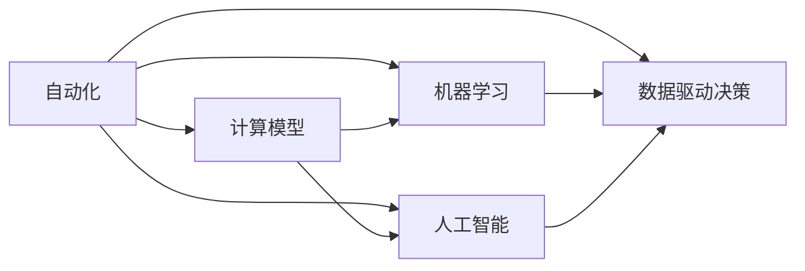

                 

# 计算变化对自动化领域的影响

> 关键词：自动化,计算模型,机器学习,人工智能,数据驱动决策

## 1. 背景介绍

随着信息技术和计算能力的飞速发展，自动化技术已经从传统的机械自动化、流程自动化，扩展到智能自动化、数据驱动决策等多个层面。计算变化作为自动化领域的一个重要趋势，不仅推动了技术的进步，也对行业生态和组织架构产生了深远影响。本文将探讨计算变化如何改变自动化领域，以及未来的发展趋势与面临的挑战。

## 2. 核心概念与联系

### 2.1 核心概念概述

自动化领域的核心概念包括：

- 自动化（Automation）：通过技术手段，使系统或设备自动执行特定任务，减少人力参与，提升效率和质量。
- 计算模型（Computational Model）：描述系统行为和决策的数学模型，常用于模拟和优化自动化流程。
- 机器学习（Machine Learning）：通过数据驱动的算法，使系统具有自我学习、自我适应的能力。
- 人工智能（AI）：旨在创建具有类人智能的智能系统，涵盖感知、推理、决策等多个方面。
- 数据驱动决策（Data-Driven Decision Making）：基于数据分析和建模，辅助或替代人工决策。

这些概念之间的逻辑关系可以用以下Mermaid流程图表示：



通过上述流程图，可以清晰看到自动化与计算模型、机器学习、人工智能、数据驱动决策之间的关系：自动化通过计算模型进行行为模拟和决策优化，机器学习和人工智能作为自动化技术的重要组成部分，为系统提供了智能化的功能和能力，而数据驱动决策则是自动化在业务应用中追求更高效率和精确度的表现。

## 3. 核心算法原理 & 具体操作步骤
### 3.1 算法原理概述

自动化领域的计算变化主要体现在以下几个方面：

- **基于模型的自动化**：通过构建数学模型，自动化系统能够模拟和优化其行为和决策过程，从而实现更高的自动化水平。
- **数据驱动的决策**：自动化系统通过收集和分析海量数据，利用机器学习和人工智能技术，辅助或替代人工决策，提升决策的科学性和精准度。
- **智能自动化**：通过引入智能算法，自动化系统能够实现更加灵活和复杂的任务处理，如自然语言理解、图像识别等。
- **跨领域应用**：自动化技术从传统的制造业扩展到金融、医疗、教育等多个领域，推动了各行业的数字化转型。

### 3.2 算法步骤详解

自动化领域的计算变化通常包括以下步骤：

1. **需求分析**：明确自动化的目标和范围，确定自动化系统的需求和功能。
2. **数据收集与预处理**：收集自动化流程相关的数据，并进行清洗、标注和标准化，以供后续分析使用。
3. **模型构建与训练**：选择合适的计算模型，利用历史数据对模型进行训练，以预测未来行为或辅助决策。
4. **系统集成与部署**：将训练好的模型集成到自动化系统中，并上线部署，实现自动化功能。
5. **监控与优化**：实时监控自动化系统的运行状态，根据反馈数据进行调整和优化，以提升性能和稳定性。

### 3.3 算法优缺点

自动化领域的计算变化具备以下优点：

- **高效性**：通过模型和算法自动化任务执行，大幅提升效率，减少人力成本。
- **精度提升**：基于数据驱动的决策，系统能够提供更加精准的预测和决策支持。
- **灵活性增强**：智能算法使自动化系统能够处理复杂多变的环境和任务，适应性强。
- **应用广泛**：跨领域的自动化应用，推动了各行各业的数字化转型和智能化升级。

同时，也存在一些挑战：

- **数据质量和获取成本**：高质量的数据是模型训练和决策分析的前提，但数据的收集和处理往往成本较高。
- **模型复杂度和维护**：随着自动化系统复杂度的增加，模型的构建和维护难度也相应增加。
- **安全和隐私问题**：自动化系统依赖于数据，数据泄露和安全问题可能会带来严重后果。
- **人机协作**：自动化和人工的协作方式需要设计，过度自动化可能减少人的参与度，降低决策质量。

### 3.4 算法应用领域

自动化领域的计算变化在多个应用领域得到了广泛应用：

- **制造业自动化**：通过机器人和自动化设备，实现生产流程的自动化和优化。
- **物流和供应链管理**：利用计算模型优化物流路线和库存管理，提升供应链效率。
- **金融科技**：在风险控制、投资分析等领域，利用机器学习和人工智能进行数据分析和决策。
- **医疗健康**：通过智能算法辅助诊断和治疗，提高医疗服务的精准性和效率。
- **智能客服**：通过自然语言处理和机器学习技术，实现自动化的客户服务和支持。
- **教育技术**：利用数据分析和智能化技术，提高教育质量和个性化学习体验。

## 4. 数学模型和公式 & 详细讲解 & 举例说明

### 4.1 数学模型构建

自动化领域的计算模型可以基于多种数学框架构建，如线性回归、决策树、支持向量机、神经网络等。以线性回归模型为例，假设有一个自动化流程，需要预测某个指标$y$，其与多个特征$x_i$之间的关系可以用线性模型表示：

$$ y = w_0 + w_1x_1 + w_2x_2 + ... + w_nx_n + e $$

其中$w_i$为特征的权重，$e$为误差项，$\{(x_i, y_i)\}$为训练集样本。

### 4.2 公式推导过程

线性回归模型的最小二乘法参数估计公式为：

$$ \hat{w} = (X^TX)^{-1}X^Ty $$

其中$X$为特征矩阵，$y$为标签向量，$\hat{w}$为模型参数估计。

### 4.3 案例分析与讲解

以制造业自动化中的预测性维护为例，通过收集设备运行数据，建立线性回归模型预测设备故障，从而实现预测性维护。

假设有一个设备运行数据集，包括时间、温度、振动等多个特征。通过最小二乘法训练模型，预测设备在未来某个时间点是否发生故障。

```python
import numpy as np
from sklearn.linear_model import LinearRegression

# 假设数据集为x, y
x = np.array([[1, 2, 3], [4, 5, 6], [7, 8, 9]])
y = np.array([3, 4, 5])

# 训练模型
model = LinearRegression().fit(x, y)

# 预测
x_test = np.array([[10, 11, 12]])
y_pred = model.predict(x_test)
print(y_pred)
```

## 5. 项目实践：代码实例和详细解释说明

### 5.1 开发环境搭建

开发环境搭建是自动化项目的重要基础，以下是一个基于Python的自动化项目开发环境搭建流程：

1. 安装Python：选择合适的Python版本，如Python 3.7或更高。
2. 安装Pip：使用Python的包管理工具Pip安装依赖包。
3. 安装虚拟环境：使用虚拟环境隔离项目依赖，防止版本冲突。
4. 安装相关库：如Pandas、NumPy、Scikit-Learn等常用数据科学库。

### 5.2 源代码详细实现

以下是一个简单的线性回归自动化预测模型实现：

```python
import pandas as pd
import numpy as np
from sklearn.linear_model import LinearRegression

# 读取数据
data = pd.read_csv('data.csv')

# 数据预处理
X = data[['feature1', 'feature2']]
y = data['target']

# 划分训练集和测试集
X_train, X_test, y_train, y_test = train_test_split(X, y, test_size=0.2)

# 训练模型
model = LinearRegression().fit(X_train, y_train)

# 预测
y_pred = model.predict(X_test)
print(y_pred)
```

### 5.3 代码解读与分析

上述代码中，首先使用Pandas读取数据集，进行数据预处理，然后划分训练集和测试集。接着，利用Scikit-Learn库中的LinearRegression模型进行训练，并使用训练好的模型对测试集进行预测。

## 6. 实际应用场景

### 6.1 制造业自动化

在制造业中，自动化系统可以通过计算模型预测设备故障，实现预测性维护，减少停机时间和维修成本。通过引入机器学习和人工智能，系统能够识别和分析设备运行数据中的异常模式，提供故障预测和诊断。

### 6.2 金融科技

金融科技领域，自动化系统可以通过计算模型进行风险控制和投资分析。例如，基于历史数据训练模型，预测股票价格走势，进行投资组合优化。

### 6.3 智能客服

智能客服系统通过自然语言处理和机器学习，实现自动化客户服务。通过训练模型，系统能够理解和回应客户的自然语言查询，提升客户满意度。

### 6.4 医疗健康

在医疗健康领域，自动化系统可以通过机器学习辅助诊断，提高诊断的精准性和效率。例如，基于影像数据训练模型，自动识别病变区域。

### 6.5 未来应用展望

未来，随着计算能力的提升和数据的积累，自动化系统将更加智能和灵活。人工智能和大数据技术将进一步深入融合，推动各领域的智能化升级。

## 7. 工具和资源推荐

### 7.1 学习资源推荐

为了帮助开发者深入理解自动化领域的计算变化，推荐以下学习资源：

1. 《Python编程：从入门到实践》：学习Python编程语言，掌握数据科学和自动化开发基础。
2. 《机器学习实战》：了解机器学习的基本原理和应用场景，掌握常见的机器学习算法。
3. 《深度学习》（Goodfellow等著）：深入理解深度学习技术，掌握神经网络模型和优化算法。
4. 《TensorFlow实战》：掌握TensorFlow框架，实现复杂的数据驱动自动化系统。
5. 《Python机器学习》（Raschka和Miranda著）：从Python角度学习机器学习，实现自动化项目。

### 7.2 开发工具推荐

以下是几款自动化项目开发常用的工具：

1. Jupyter Notebook：开源的交互式编程环境，适合数据探索和模型开发。
2. PyTorch：深度学习框架，提供丰富的神经网络模型和优化算法。
3. TensorFlow：开源的机器学习框架，支持大规模数据处理和模型训练。
4. Scikit-Learn：数据科学库，提供多种机器学习算法和数据预处理工具。
5. Matplotlib和Seaborn：数据可视化库，帮助分析和展示数据。

### 7.3 相关论文推荐

自动化领域的计算变化需要理论支持，以下是几篇经典论文：

1. 《机器人学：机器人感知与控制》：探讨机器人自动化系统的工作原理和控制方法。
2. 《深度学习在金融领域的应用》：介绍深度学习在金融科技中的应用和挑战。
3. 《基于深度学习的自然语言处理》：探讨深度学习在自然语言处理中的应用。
4. 《智能自动化系统设计》：介绍智能自动化系统的设计和实现方法。
5. 《数据驱动决策在企业管理中的应用》：探讨数据驱动决策在企业管理中的应用。

## 8. 总结：未来发展趋势与挑战

### 8.1 研究成果总结

计算变化推动了自动化领域的进步，提升了效率和精度，但也面临数据质量、模型复杂度、安全隐私等问题。未来，自动化系统将更加智能和灵活，但需要进一步解决技术挑战。

### 8.2 未来发展趋势

未来，自动化系统将进一步融合人工智能和大数据技术，实现更高效的自动化和智能化。

1. 高度自动化：通过更加智能的算法，实现更高效、更灵活的自动化。
2. 数据驱动决策：基于大数据分析，提供更精准的决策支持。
3. 人机协作：实现人与机器的协同工作，提升工作效率。
4. 跨领域应用：自动化技术将扩展到更多领域，推动各行各业的数字化转型。

### 8.3 面临的挑战

自动化领域的计算变化虽然带来诸多机遇，但也面临以下挑战：

1. 数据获取和处理成本高昂，需要高效的自动化数据处理机制。
2. 模型复杂度增加，需要高效的模型优化和部署机制。
3. 安全和隐私问题，需要建立严格的数据保护措施。
4. 人机协作方式需要设计，需要平衡自动化和人工的协作关系。

### 8.4 研究展望

未来，自动化领域的研究方向将集中在以下几个方面：

1. 数据处理与清洗：研究高效的数据获取、处理和清洗技术，降低自动化系统的数据获取成本。
2. 模型优化与部署：研究高效的模型优化和部署方法，提高模型的运行效率和稳定性。
3. 人机协作设计：研究人机协作方式，提升自动化系统的人性化和智能化。
4. 跨领域应用扩展：研究自动化技术在更多领域的应用，推动各行业的数字化转型。

## 9. 附录：常见问题与解答

**Q1：自动化系统如何处理复杂多变的环境？**

A: 自动化系统可以通过引入智能算法，如深度学习、强化学习等，增强对复杂环境的适应能力。例如，通过自然语言处理技术，实现对自然语言环境的理解和响应。

**Q2：自动化系统如何提高数据驱动决策的精度？**

A: 自动化系统可以通过数据增强、特征工程等方法，提高数据质量和特征表达能力。例如，使用生成对抗网络（GAN）生成更多的训练数据，提高模型的泛化能力。

**Q3：如何平衡自动化系统和人工的协作关系？**

A: 自动化系统和人工协作可以通过设计合适的用户界面和反馈机制，实现良好的人机交互。例如，在智能客服系统中，系统可以根据用户反馈，自动调整回答策略。

**Q4：自动化系统如何保证数据安全和隐私？**

A: 自动化系统可以通过数据加密、访问控制等手段，保护数据的隐私和安全。例如，使用差分隐私技术，保护用户数据的匿名性。

**Q5：自动化系统如何提高模型的解释性和可解释性？**

A: 自动化系统可以通过引入可解释性技术，如特征重要性分析、因果分析等，增强模型的可解释性。例如，使用SHAP（SHapley Additive exPlanations）方法，分析模型的预测过程。

---

作者：禅与计算机程序设计艺术 / Zen and the Art of Computer Programming

